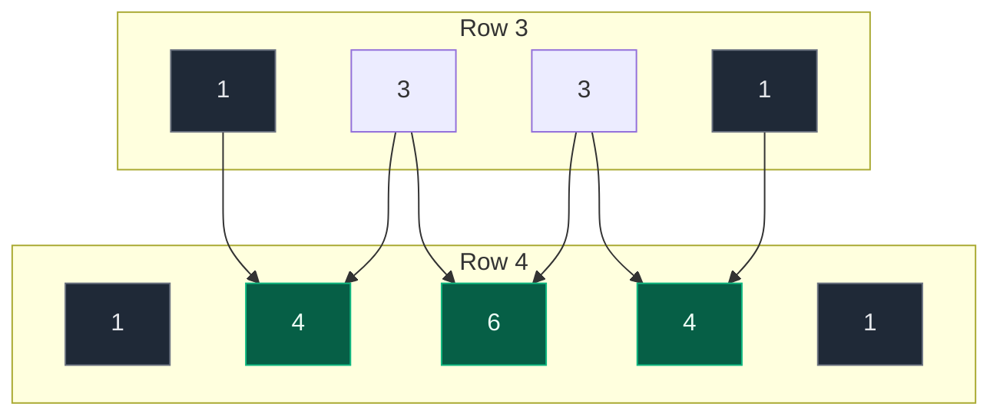

# 01. 118. Pascal's Triangle

| Difficulty | Pattern | Source | Time | Space |
|:---:|:---:|:---:|:---:|:---:|
| **Easy** | Row-by-Row Construction | [118. Pascal's Triangle](https://leetcode.com/problems/pascals-triangle/) | `O(numRows^2)` | `O(1)` extra |

## 1. Problem Statement

Given an integer `numRows`, return the first `numRows` of **Pascal's triangle**.

In **Pascal's triangle**, each number is the sum of the two numbers directly above it.

### Examples

```text
Input:  numRows = 5
Output: [[1],[1,1],[1,2,1],[1,3,3,1],[1,4,6,4,1]]
```

```text
Input:  numRows = 1
Output: [[1]]
```

### Constraints

- `1 <= numRows <= 30`

## 2. Core Theory

Pascal's Triangle is defined by one recurrence and two base cases. Every element is the sum of the two directly above it; the edges are always `1`.

```text
                1                 row 0
              1   1               row 1
            1   2   1             row 2
          1   3   3   1           row 3
        1   4   6   4   1         row 4
         ↘   ↙
        3 + 3 = 6
```

Formally, with zero-based indexing:

```text
row[0]        = 1
row[last]     = 1
row[j]        = previous[j - 1] + previous[j]
```

Here is where each value in row 4 comes from:



**The key structural facts:**

| Property | Value | Consequence |
|:---|:---|:---|
| Row `i` length | `i + 1` elements | Row size is known before building it |
| First and last | always `1` | Only interior positions need computing |
| Interior count | `i - 1` | Rows 0 and 1 have no interior at all |
| Total elements | `n(n+1)/2` | Output alone forces `O(n^2)` |

**Why the recurrence beats the formula.** Each value also equals the binomial coefficient `C(r, c) = r! / (c! * (r-c)!)`. That is mathematically clean but computationally wasteful: factorials grow explosively, and you recompute overlapping work for every cell. The recurrence reuses the row you just built, turning each element into a single addition.

**Why `O(n^2)` is optimal here.** The triangle contains `1 + 2 + ... + n = n(n+1)/2` numbers, and you must emit every one. No algorithm can beat the size of its own output. The real optimization target is therefore *extra* space, which the row-by-row method reduces to `O(1)` beyond the answer.

**Recognizing the pattern:** when each row of a structure depends only on the row before it, build iteratively and keep just the previous row. The same shape appears in space-optimized DP, where a 2D table collapses to one or two rows.

## 3. Visual Intuition

Pascal's Triangle looks like this:

```text
        1
      1   1
    1   2   1
  1   3   3   1
1   4   6   4   1
```

Each middle value comes from the previous row.

Example:

```text
Row 4 = [1, 3, 3, 1]
```

Next row:

```text
Row 5 = [1, 4, 6, 4, 1]
```

How?

```text
First element = 1

4 = 1 + 3
6 = 3 + 3
4 = 3 + 1

Last element = 1
```

## 4. Key Observation

For row index `i`, the row has:

```text
i + 1 elements
```

Using zero-based indexing:

```text
row 0 -> 1 element  -> [1]
row 1 -> 2 elements -> [1, 1]
row 2 -> 3 elements -> [1, 2, 1]
row 3 -> 4 elements -> [1, 3, 3, 1]
```

For every row:

```text
First value  = 1
Last value   = 1
Middle value = previous_row[j - 1] + previous_row[j]
```

## 5. Edge Cases

| Case | Input | Expected | Why it matters |
|:---|:---|:---:|:---|
| Minimum input | `numRows = 1` | `[[1]]` | Interior loop must not execute |
| Two rows | `numRows = 2` | `[[1],[1,1]]` | Still no interior elements |
| First interior element | `numRows = 3` | `[[1],[1,1],[1,2,1]]` | The first time the recurrence fires |
| Maximum input | `numRows = 30` | 30 rows | Row 29 centre is `C(29,14)` — large but fits in 64 bits |
| Row length | row `i` | `i + 1` | Off-by-one here is the most common bug |

Note the constraint guarantees `numRows >= 1`, so an empty result is never required — though returning `[]` for `0` is the natural behaviour anyway.

## 6. Brute Force Solution: Use Combination Formula

### Intuition

Every value in Pascal's Triangle can be calculated using combinations.

The value at row `r` and column `c` is:

```text
rC c
```

Formula:

```text
rC c = r! / (c! * (r - c)!)
```

Example:

```text
row 4 = [4C0, 4C1, 4C2, 4C3, 4C4]
      = [1, 4, 6, 4, 1]
```

### Approach

1. For each row `r` from 0 to `numRows - 1`.
2. For each column `c` from 0 to `r`.
3. Calculate `rC c`.
4. Add it to the row.
5. Add row to answer.

### Code

```python
# Define the class solution
class Solution:

    # Define the method
    def generate(self, numRows: int) -> List[List[int]]:

        # Store the final Pascal triangle
        triangle = []

        # Generate each row from 0 to numRows - 1
        for row_index in range(numRows):

            # Store current row values
            row = []

            # Generate each column value in current row
            for col_index in range(row_index + 1):

                # Calculate nCr using factorial formula
                value = math.factorial(row_index) // ( math.factorial(col_index) * math.factorial(row_index - col_index))

                # Add calculated value to current row
                row.append(value)

            # Add current row to triangle
            triangle.append(row)

        # Return complete Pascal triangle
        return triangle
```

### Complexity

| Measure | Complexity | Why |
|:---|:---:|:---|
| **Time** | `O(numRows^3)` approx | Because there are about `numRows^2` cells, and factorial calculation can take extra time. |
| **Space** | `O(numRows^2)` | Because we store the triangle. |

## 7. Better Solution: Build Each Row from Previous Row

### Intuition

Instead of calculating every value using formula, use the previous row.

For every middle element:

```text
current_row[j] = previous_row[j - 1] + previous_row[j]
```

### How the Row Is Filled

```text
Step 1: create row of all 1s      [1, 1, 1, 1, 1]
Step 2: overwrite interior only    ^  ^  ^  ^  ^
                                   |  └──┴──┘  |
                                 fixed  computed  fixed
```

### Dry Run

```text
numRows = 5
```

Start:

```text
triangle = []
```

#### row_index = 0

Row size is 1.

```text
row = [1]
```

Triangle:

```text
[[1]]
```

#### row_index = 1

Start row:

```text
[1, 1]
```

No middle elements.

Triangle:

```text
[
  [1],
  [1, 1]
]
```

#### row_index = 2

Start row:

```text
[1, 1, 1]
```

Middle index:

```text
j = 1
```

Calculate:

```text
row[1] = triangle[1][0] + triangle[1][1]
       = 1 + 1
       = 2
```

Row:

```text
[1, 2, 1]
```

#### row_index = 3

Start row:

```text
[1, 1, 1, 1]
```

Middle elements:

```text
j = 1:
row[1] = previous[0] + previous[1]
       = 1 + 2
       = 3

j = 2:
row[2] = previous[1] + previous[2]
       = 2 + 1
       = 3
```

Row:

```text
[1, 3, 3, 1]
```

#### row_index = 4

Start row:

```text
[1, 1, 1, 1, 1]
```

Previous row:

```text
[1, 3, 3, 1]
```

Middle elements:

```text
j = 1 -> 1 + 3 = 4
j = 2 -> 3 + 3 = 6
j = 3 -> 3 + 1 = 4
```

Row:

```text
[1, 4, 6, 4, 1]
```

Final triangle:

```text
[
  [1],
  [1, 1],
  [1, 2, 1],
  [1, 3, 3, 1],
  [1, 4, 6, 4, 1]
]
```

### Code

```python
# Define the class solution
class Solution:

    # Define the method
    def generate(self, numRows: int) -> List[List[int]]:

        # Store the complete Pascal triangle
        triangle = []

        # Build each row one by one
        for row_index in range(numRows):

            # Create current row filled with 1s
            row = [1] * (row_index + 1)

            # Fill only the middle elements
            for col_index in range(1, row_index):

                # Each middle element is sum of two elements above it
                row[col_index] = ( triangle[row_index - 1][col_index - 1] + triangle[row_index - 1][col_index])

            # Add completed row to triangle
            triangle.append(row)

        # Return final Pascal triangle
        return triangle
```

## 8. Complexity of Optimal Solution

| Measure | Complexity | Why |
|:---|:---:|:---|
| **Time** | `O(numRows^2)` | Because total number of generated elements is `1 + 2 + 3 + ... + numRows = numRows * (numRows + 1) / 2`. |
| **Space** | `O(numRows^2)` | Because we return the whole triangle. Ignoring the output space, extra space is `O(1)`. |

## 9. Alternative Solution: Generate Row Using Previous Row Directly

This is a cleaner version.

### Intuition

For every new row:

```text
start with [1]
add sums of adjacent pairs from previous row
end with [1]
```

Example:

```text
previous = [1, 3, 3, 1]
```

Adjacent sums:

```text
1 + 3 = 4
3 + 3 = 6
3 + 1 = 4
```

New row:

```text
[1, 4, 6, 4, 1]
```

### Code

```python
# Define the class solution
class Solution:

    # Define the method
    def generate(self, numRows: int) -> List[List[int]]:

        # Store the final triangle
        triangle = []

        # Generate rows one by one
        for row_index in range(numRows):

            # First row is always [1]
            if row_index == 0:

                # Add first row
                triangle.append([1])

            # For all other rows
            else:

                # Get previous row
                previous_row = triangle[-1]

                # Start current row with 1
                current_row = [1]

                # Generate middle elements using adjacent sums
                for i in range(len(previous_row) - 1):

                    # Add sum of two adjacent values from previous row
                    current_row.append(previous_row[i] + previous_row[i + 1])

                # End current row with 1
                current_row.append(1)

                # Add current row to triangle
                triangle.append(current_row)

        # Return complete triangle
        return triangle
```

Complexity:

```text
Time Complexity: O(numRows^2)
Space Complexity: O(numRows^2)
```

## 10. Common Mistakes

| Mistake | Why it breaks | Fix |
|:---|:---|:---|
| `row = [1] * row_index` | Row `i` needs `i + 1` slots, so the row is one short | `[1] * (row_index + 1)` |
| Interior loop `range(1, row_index + 1)` | Overwrites the trailing `1` with an out-of-range sum | `range(1, row_index)` stops before the last index |
| Reading `triangle[row_index]` for the previous row | That row is still being built; raises `IndexError` | Use `triangle[row_index - 1]` or `triangle[-1]` |
| `row[j] = row[j-1] + row[j]` on the current row | Mixes half-updated values into later sums | Always read from the **previous** row |
| Appending the same list object each row | All rows alias one list and show identical contents | Create a fresh `row` inside the loop |
| Using factorials for large `numRows` | Correct but needlessly slow and overflow-prone in other languages | Use the additive recurrence |
| Forgetting rows 0 and 1 have no interior | An unguarded interior loop indexes out of range | `range(1, row_index)` is naturally empty for `i < 2` |

## 11. Interview Follow-ups

**Q: Return only the `k`-th row, using `O(k)` space.**

A: Keep a single list and update it **right to left** in place: `row[j] += row[j-1]` for `j` from the end down to `1`. Iterating backwards means each `row[j-1]` you read still holds the previous row's value. That is LeetCode 119, in `O(k^2)` time and `O(k)` space.

**Q: Can you compute a single value `C(r, c)` without building the triangle?**

A: Yes, multiplicatively: start at `1` and apply `result = result * (r - i) / (i + 1)` for `i` in `0..c-1`. This stays `O(c)` with no factorial blow-up, and every intermediate result is an exact integer.

**Q: Why is `O(n^2)` unavoidable?**

A: The output itself has `n(n+1)/2` elements. Any algorithm must write all of them, so it is output-bound. Only the auxiliary space can be improved, not the time.

**Q: How large do the numbers get at `numRows = 30`?**

A: The largest is the centre of the last row, `C(29, 14) = 77558760` — comfortably inside a 32-bit int. Python has arbitrary precision anyway, but in Java or C++ it is worth noting the values stay small at this constraint.

**Q: What is the sum of row `i`?**

A: Exactly `2^i`, since each element of a row contributes to two elements below it. A quick sanity check: row 4 is `[1,4,6,4,1]`, summing to `16 = 2^4`.

**Q: Could you build it with recursion?**

A: You could define `row(i)` in terms of `row(i-1)`, but it adds stack depth with no benefit, and a naive version without memoization recomputes rows exponentially. The iterative build is strictly better here.

## 12. Interview Explanation

> Pascal's Triangle starts and ends every row with 1. Every middle value is calculated using the previous row: `current[j] = previous[j - 1] + previous[j]`. So I build the triangle row by row. For each row, I initialize all values as 1, then fill only the middle positions using the previous row. Since the triangle itself contains `O(numRows^2)` values, the time and space complexity are both `O(numRows^2)`.

## 13. Verify

```python
from typing import List


def generate(numRows: int) -> List[List[int]]:
    triangle = []
    for row_index in range(numRows):
        row = [1] * (row_index + 1)
        for col_index in range(1, row_index):
            row[col_index] = (triangle[row_index - 1][col_index - 1]
                              + triangle[row_index - 1][col_index])
        triangle.append(row)
    return triangle


# LeetCode examples
assert generate(5) == [[1], [1, 1], [1, 2, 1], [1, 3, 3, 1], [1, 4, 6, 4, 1]]
assert generate(1) == [[1]]

# Two rows: still no interior elements
assert generate(2) == [[1], [1, 1]]

# First row with an interior element
assert generate(3) == [[1], [1, 1], [1, 2, 1]]

# Zero rows behaves naturally
assert generate(0) == []

# Structural properties across the full constraint range
from math import comb

for n in range(1, 31):
    tri = generate(n)
    assert len(tri) == n
    for i, row in enumerate(tri):
        # row i has i + 1 elements
        assert len(row) == i + 1, (i, row)
        # edges are always 1
        assert row[0] == 1 and row[-1] == 1, (i, row)
        # every value matches the binomial coefficient
        assert row == [comb(i, c) for c in range(i + 1)], (i, row)
        # each row sums to 2^i
        assert sum(row) == 2 ** i, (i, row)
        # each row is a palindrome
        assert row == row[::-1], (i, row)

# Largest value at the maximum constraint stays modest
assert max(generate(30)[-1]) == comb(29, 14) == 77558760

print("All tests passed")
```
