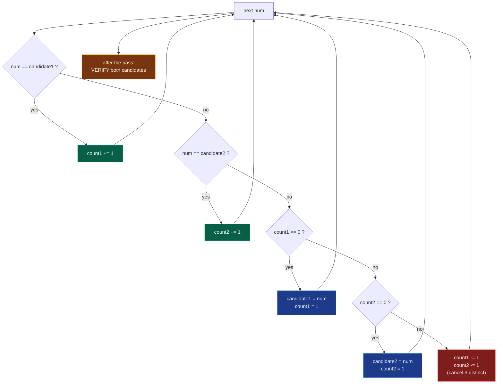

# 02. 229. Majority Element II

| Difficulty | Pattern | Source | Time | Space |
|:---:|:---:|:---:|:---:|:---:|
| **Medium** | Boyer-Moore (n/3) | [229. Majority Element II](https://leetcode.com/problems/majority-element-ii/) | `O(n)` | `O(1)` |

## 1. Problem Statement

Given an integer array of size `n`, find all elements that appear more than `⌊ n/3 ⌋` times.

You are given an integer array `nums`.

You need to return all elements that appear more than:

```text
n / 3 times
```

where `n` is the size of the array.

### Examples

```text
Input:  nums = [3,2,3]
Output: [3]
```

Explanation:

```text
n = 3
n / 3 = 1

3 appears 2 times
2 > 1

So 3 is answer.
```

```text
Input:  nums = [1]
Output: [1]
```

Explanation:

```text
n = 1
n / 3 = 0

1 appears 1 time
1 > 0

So 1 is answer.
```

```text
Input:  nums = [1,2]
Output: [1,2]
```

Explanation:

```text
n = 2
n / 3 = 0

1 appears 1 time
2 appears 1 time

Both appear more than 0 times.
```

### Constraints

- `1 <= nums.length <= 5 * 10^4`
- `-10^9 <= nums[i] <= 10^9`

**Follow up:** Could you solve the problem in linear time and in `O(1)` space?

## 2. Core Theory

The whole problem rests on a **pigeonhole argument**. Suppose three *distinct* values each appeared strictly more than `n/3` times. Their occurrences would add up to strictly more than `n/3 + n/3 + n/3 = n` elements — but the array only holds `n` elements. Contradiction. So **at most two** values can qualify, which is exactly why the algorithm keeps two candidate slots instead of one.

```text
n = 9, threshold = n/3 = 3  (need strictly more than 3, i.e. >= 4)

value A: ####          4 occurrences   > 3  ok
value B: ####          4 occurrences   > 3  ok
value C: #             1 occurrence        no room left
         ---------------------------
         total         9 = n           a third winner cannot fit
```

The scan itself is **cancellation**. Think of each element as a token. Whenever we meet a value that matches neither candidate *and* both slots are occupied, we throw away one token of candidate1, one token of candidate2, and the current token — a group of **three distinct** values disappears at once. That is why both counters decrement together: a cancellation is only valid if all three removed tokens differ. An element occurring more than `n/3` times has more tokens than there can be cancellation groups, so it can never be wiped out completely and must survive in a candidate slot.

The **verification pass is mandatory**, and this is the key difference from LeetCode 169. There, a majority element is *guaranteed* to exist, so the single surviving candidate is automatically the answer. Here nothing is guaranteed — `[1,2,3,4]` has no qualifying element at all, yet the voting pass still leaves two candidates sitting in the slots. Those slots always contain *something*; being a candidate only means "if an answer exists, it is here". So we recount both candidates honestly and keep only those whose real count exceeds `n // 3`.

Two details make or break the implementation. **Match checks must come before empty-slot checks**: if `num` already equals `candidate1`, we must bump `count1` rather than dump `num` into the empty `candidate2` slot, otherwise the same value would occupy both slots and we would lose one of the two tracking channels. And the candidates must be **distinct** — the branch order (`== c1`, then `== c2`, then `count1 == 0`, then `count2 == 0`) enforces this automatically, which is also why the final result never contains a duplicate.



## 3. Edge Cases

| Case | Input | Expected | Why it matters |
|:---|:---|:---:|:---|
| Single element | `[1]` | `[1]` | `n // 3 = 0`, so `1 > 0` qualifies |
| Two elements | `[1,2]` | `[1,2]` | Both exceed a threshold of `0`; both slots fill |
| All identical | `[2,2,2,2]` | `[2]` | Only one candidate is ever assigned; `candidate2` stays `None` |
| No valid answer | `[1,2,3,4]` | `[]` | Candidates survive the vote but fail verification |
| Exactly `n/3`, not more | `[1,1,2,2,3,3]` | `[]` | Strictly greater — `2` occurrences with `n // 3 = 2` does **not** qualify |
| Negatives | `[-1,-1,-1,2]` | `[-1]` | Values may be negative; `None` sentinel must not collide with a real value |
| Duplicates across slots | `[1,1,1,3,3,2,2,2]` | `[1,2]` | Two winners; candidate slots must stay distinct |
| Empty-ish array | `[]` | `[]` | Not in constraints, but the loops must not crash |

## 4. Key Observation

For majority element greater than `n / 2`, there can be only **one** answer.

But for majority element greater than `n / 3`, there can be at most **two** answers.

Why?

Suppose there are three different elements that each appear more than `n / 3` times.

Then total count would be:

```text
more than n/3 + more than n/3 + more than n/3
= more than n
```

That is impossible because array has only n elements.

So:

```text
At most 2 elements can appear more than n / 3 times.
```

This is why we maintain **two candidates**.

## 5. Brute Force Solution

### Intuition

For every element, count how many times it appears.

If its count is greater than `n / 3`, add it to answer.

To avoid duplicates in answer, check whether it is already added.

### Approach

1. For each element `nums[i]`.
2. Count its frequency by scanning the whole array.
3. If frequency is greater than `n / 3`, add it to result.
4. Return result.

### Dry Run

```text
nums = [3, 2, 3]
n = 3
n // 3 = 1
```

Check 3:

```text
3 appears 2 times
2 > 1
Add 3
```

Check 2:

```text
2 appears 1 time
1 > 1? No
```

Check 3 again:

```text
Already added, skip duplicate
```

Answer:

```text
[3]
```

### Code

```python
# Define the class solution
class Solution:

    # Define the method
    def majorityElement(self, nums: List[int]) -> List[int]:

        # Store the size of the array
        n = len(nums)

        # Store final majority elements
        result = []

        # Check every element as a possible majority element
        for i in range(n):

            # Skip if this number is already added to result
            if nums[i] in result: continue

            # Count frequency of current number
            count = 0

            # Traverse array to count nums[i]
            for j in range(n):

                # If current value matches nums[i]
                if nums[j] == nums[i]:

                    # Increase count
                    count += 1

            # If count is greater than n / 3
            if count > n // 3:

                # Add number to result
                result.append(nums[i])

        # Return all majority elements
        return result
```

### Complexity

| Measure | Complexity | Why |
|:---|:---:|:---|
| **Time** | `O(n^2)` | Because for every element, we scan the whole array. |
| **Space** | `O(1)` extra | Ignoring the output list. |

## 6. Better Solution: Hash Map

### Intuition

Instead of counting frequency repeatedly, count frequency once using a dictionary.

Then return all elements whose frequency is greater than `n / 3`.

### Approach

1. Create a frequency dictionary.
2. Count every number.
3. Traverse dictionary.
4. Add numbers with count greater than `n / 3`.

### Dry Run

```text
nums = [1, 1, 1, 3, 3, 2, 2, 2]
```

Frequency map:

```text
1 -> 3
3 -> 2
2 -> 3
```

Here:

```text
n = 8
n // 3 = 2
```

Elements with count greater than 2:

```text
1 and 2
```

Answer:

```text
[1, 2]
```

### Code

```python
# Define the class solution
class Solution:

    # Define the method
    def majorityElement(self, nums: List[int]) -> List[int]:

        # Store length of array
        n = len(nums)

        # Dictionary to store frequency of each number
        frequency = {}

        # Traverse every number
        for num in nums:

            # If number is already present, increase count
            if num in frequency:

                # Increase existing count
                frequency[num] += 1

            # If number appears first time
            else:

                # Initialize count as 1
                frequency[num] = 1

        # Store final answer
        result = []

        # Traverse all numbers and their counts
        for num, count in frequency.items():

            # If count is greater than n / 3
            if count > n // 3:

                # Add number to result
                result.append(num)

        # Return all majority elements
        return result
```

### Complexity

| Measure | Complexity | Why |
|:---|:---:|:---|
| **Time** | `O(n)` | Because we scan the array once and dictionary once. |
| **Space** | `O(n)` | Because dictionary may store many unique elements. |

## 7. Most Optimal Solution: Extended Boyer-Moore Voting Algorithm

### Intuition

**Core Intuition**

For majority greater than `n / 2`, we keep one candidate.

For majority greater than `n / 3`, we keep two candidates.

Because at most two elements can appear more than `n / 3` times.

So we maintain:

```text
candidate1, count1
candidate2, count2
```

### Voting Logic

For every number `num`:

**Case 1: num matches candidate1**

```text
count1 += 1
```

**Case 2: num matches candidate2**

```text
count2 += 1
```

**Case 3: count1 is 0**

```text
candidate1 = num
count1 = 1
```

**Case 4: count2 is 0**

```text
candidate2 = num
count2 = 1
```

**Case 5: num is different from both candidates**

```text
count1 -= 1
count2 -= 1
```

Meaning we cancel one occurrence of three different elements.

### Why This Works

For `n / 3`, we are allowed at most two majority elements.

Whenever we see a third different element, we cancel:

```text
one vote from candidate1
one vote from candidate2
one vote from current different element
```

This is like removing a group of three different values.

Any element that appears more than `n / 3` times cannot be fully cancelled.

So after the first pass, possible majority elements remain as candidates.

But important:

```text
Candidates are only possible answers.
We must verify them in a second pass.
```

Why verification is needed?

Because unlike LeetCode 169, this problem does not guarantee that majority elements exist.

### Approach

**Important Candidate Assignment Order**

The order of conditions matters.

Correct order:

```text
1. Check if num == candidate1
2. Check if num == candidate2
3. If count1 == 0, assign candidate1
4. If count2 == 0, assign candidate2
5. Else decrement both
```

Why check match first?

Because if current number already equals a candidate, we should increase its count instead of replacing another candidate slot.

### Dry Run

```text
nums = [1, 1, 1, 3, 3, 2, 2, 2]
```

Initial:

```text
candidate1 = None, count1 = 0
candidate2 = None, count2 = 0
```

| num | Action | candidate1 | count1 | candidate2 | count2 |
|:---:|:---|:---:|:---:|:---:|:---:|
| 1 | count1 is 0, set candidate1 | 1 | 1 | None | 0 |
| 1 | matches candidate1 | 1 | 2 | None | 0 |
| 1 | matches candidate1 | 1 | 3 | None | 0 |
| 3 | count2 is 0, set candidate2 | 1 | 3 | 3 | 1 |
| 3 | matches candidate2 | 1 | 3 | 3 | 2 |
| 2 | different from both, decrement both | 1 | 2 | 3 | 1 |
| 2 | different from both, decrement both | 1 | 1 | 3 | 0 |
| 2 | count2 is 0, set candidate2 | 1 | 1 | 2 | 1 |

After first pass:

```text
candidate1 = 1
candidate2 = 2
```

Now verify:

```text
1 appears 3 times
2 appears 3 times
n // 3 = 2
```

Both are valid.

Answer:

```text
[1, 2]
```

### Code

```python
# Define the class solution
class Solution:

    # Define the method
    def majorityElement(self, nums: List[int]) -> List[int]:

        # First possible majority candidate
        candidate1 = None

        # Second possible majority candidate
        candidate2 = None

        # Vote count for candidate1
        count1 = 0

        # Vote count for candidate2
        count2 = 0

        # First pass: find possible candidates
        for num in nums:

            # If num matches first candidate, increase count1
            if num == candidate1:
                count1 += 1

            # If num matches second candidate, increase count2
            elif num == candidate2:
                count2 += 1

            # If first candidate slot is empty, assign num
            elif count1 == 0:
                candidate1 = num
                count1 = 1

            # If second candidate slot is empty, assign num
            elif count2 == 0:
                candidate2 = num
                count2 = 1

            # If num is different from both candidates
            else:

                # Cancel one vote from both candidates
                count1 -= 1
                count2 -= 1

        # Reset counts for actual verification
        count1 = 0
        count2 = 0

        # Second pass: count actual occurrences of both candidates
        for num in nums:

            # Count occurrences of candidate1
            if num == candidate1:
                count1 += 1

            # Count occurrences of candidate2
            elif num == candidate2:
                count2 += 1

        # Store final valid majority elements
        result = []

        # If candidate1 appears more than n / 3 times
        if count1 > len(nums) // 3:
            result.append(candidate1)

        # If candidate2 appears more than n / 3 times
        if count2 > len(nums) // 3:
            result.append(candidate2)

        # Return valid majority elements
        return result
```

### Complexity

| Measure | Complexity | Why |
|:---|:---:|:---|
| **Time** | `O(n)` | Because we traverse the array twice. |
| **Space** | `O(1)` | Because we use only fixed variables. Ignoring output list. |

## 8. Why We Need Verification

Example:

```text
nums = [1, 2, 3, 4]
```

Here:

```text
n = 4
n // 3 = 1
```

An element must appear more than 1 time.

No element appears more than once.

But after voting pass, we may still have candidates.

So we must count actual frequency and verify.

## 9. Small Array Cases

`nums = [1]`

```text
n = 1
n // 3 = 0

1 appears 1 time.
1 > 0.

Answer = [1]
```

`nums = [1, 2]`

```text
n = 2
n // 3 = 0

1 appears 1 time.
2 appears 1 time.

Both > 0.

Answer = [1, 2]
```

The Boyer-Moore version handles these correctly.

## 10. Common Mistakes

| Mistake | Why it breaks | Fix |
|:---|:---|:---|
| Skipping the verification pass | `[1,2,3,4]` returns junk candidates even though no element qualifies | Always recount both candidates and compare against `n // 3` |
| Checking `count1 == 0` before `num == candidate1` | The same value can land in both slots, destroying one tracking channel | Match checks first, empty-slot checks second |
| Using `count >= n // 3` | `[1,1,2,2,3,3]` would wrongly return `[1,2]`; the rule is **strictly** greater | Use `count > n // 3` |
| Initialising candidates to `0` instead of `None` | A real `0` in the array collides with the sentinel and inflates its count | Use `None`, or sentinels outside `[-10^9, 10^9]` |
| Decrementing only one counter in Case 5 | Cancellation must remove a full group of three distinct values, or the invariant collapses | `count1 -= 1` **and** `count2 -= 1` |
| Comparing against `len(nums) / 3` (float) | Float division and rounding make the boundary inconsistent | Use integer division `len(nums) // 3` |
| Assuming the answer always has two elements | `[2,2,2,2]` has exactly one winner; `[1,2,3,4]` has none | Append each candidate only after its own check passes |

## 11. Interview Follow-ups

**Q: Why exactly two candidates, and how does this generalise?**

A: Pigeonhole. For a threshold of `n/k`, at most `k - 1` values can exceed it, so you keep `k - 1` candidates and cancel groups of `k` distinct values. `k = 2` gives classic Boyer-Moore, `k = 3` gives this problem. The generalised version runs in `O(nk)` time and `O(k)` space.

**Q: Why is verification optional in LeetCode 169 but mandatory here?**

A: LC 169 guarantees a majority element exists, so the survivor must be it. LC 229 guarantees nothing — the slots always hold *some* value after the scan, so a candidate is only a hypothesis until its true count is measured.

**Q: Does the algorithm still work if the array is streamed and cannot be revisited?**

A: The voting pass works in a single stream with `O(1)` memory, but verification needs a second look at the data. With one pass only you can report candidates that are a *superset* of the answer, never confirm them. A single-pass exact answer is impossible in `O(1)` space.

**Q: The problem says `⌊n/3⌋`. Does the floor change anything at the boundary?**

A: Yes, and it is the classic trap. For `n = 6`, `⌊6/3⌋ = 2`, so a value needs at least **3** occurrences. `[1,1,2,2,3,3]` returns `[]` because every value hits exactly 2, not more.

**Q: Can the result ever contain the same element twice?**

A: No. The branch order keeps `candidate1 != candidate2` at all times (a value equal to an existing candidate is caught by the match checks before any assignment), so the two appends are always distinct values.

**Q: What if you wanted the counts returned as well?**

A: The verification pass already computes them — return `(candidate, count)` pairs instead of bare values. No extra work and still `O(n)` / `O(1)`.

## 12. Interview Explanation

> Since we need elements appearing more than n/3 times, there can be at most two such elements. So I use an extended Boyer-Moore voting algorithm with two candidates and two counts. While scanning, matching candidates increase their counts, empty slots get assigned, and if the current number is different from both candidates, both counts are decreased. This cancels groups of three different elements. After the first pass, the candidates are only potential answers, so I verify their actual counts in a second pass.

## 13. Verify

```python
from typing import List
from collections import Counter
import random


def majorityElement(nums: List[int]) -> List[int]:
    candidate1 = None
    candidate2 = None
    count1 = 0
    count2 = 0

    # First pass: find possible candidates
    for num in nums:
        if num == candidate1:
            count1 += 1
        elif num == candidate2:
            count2 += 1
        elif count1 == 0:
            candidate1 = num
            count1 = 1
        elif count2 == 0:
            candidate2 = num
            count2 = 1
        else:
            count1 -= 1
            count2 -= 1

    # Reset counts for actual verification
    count1 = 0
    count2 = 0

    # Second pass: count actual occurrences of both candidates
    for num in nums:
        if num == candidate1:
            count1 += 1
        elif num == candidate2:
            count2 += 1

    result = []
    if count1 > len(nums) // 3:
        result.append(candidate1)
    if count2 > len(nums) // 3:
        result.append(candidate2)
    return result


def brute(nums: List[int]) -> List[int]:
    n = len(nums)
    return sorted(v for v, c in Counter(nums).items() if c > n // 3)


# LeetCode examples
assert sorted(majorityElement([3, 2, 3])) == [3]
assert sorted(majorityElement([1])) == [1]
assert sorted(majorityElement([1, 2])) == [1, 2]

# Author's dry run
assert sorted(majorityElement([1, 1, 1, 3, 3, 2, 2, 2])) == [1, 2]

# All identical -> exactly one winner
assert sorted(majorityElement([2, 2, 2, 2])) == [2]

# No valid answer: verification pass is what saves us
assert majorityElement([1, 2, 3, 4]) == []

# Exactly n/3 occurrences must NOT qualify (strictly greater)
assert majorityElement([1, 1, 2, 2, 3, 3]) == []

# Negatives, and a None sentinel that must not collide
assert sorted(majorityElement([-1, -1, -1, 2])) == [-1]
assert sorted(majorityElement([0, 0, 0, 1])) == [0]

# Empty array does not crash
assert majorityElement([]) == []

# Result never contains duplicates
for case in ([1, 1, 1], [5, 5, 5, 5, 5], [7, 7, 8, 8]):
    out = majorityElement(case)
    assert len(out) == len(set(out)), case

# Cross-check against brute force on random inputs
random.seed(229)
for _ in range(3000):
    n = random.randint(1, 14)
    arr = [random.randint(-3, 3) for _ in range(n)]
    assert sorted(majorityElement(arr)) == brute(arr), arr

# Larger random arrays with a planted heavy hitter
for _ in range(300):
    n = random.randint(30, 120)
    arr = [random.randint(-50, 50) for _ in range(n)]
    arr += [999] * (n // 2)
    random.shuffle(arr)
    assert sorted(majorityElement(arr)) == brute(arr)

print("All tests passed")
```
