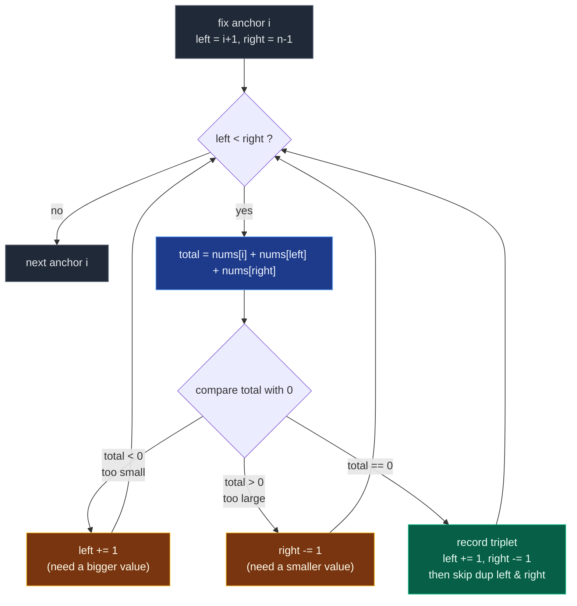

# 03. 15. 3Sum

| Difficulty | Pattern | Source | Time | Space |
|:---:|:---:|:---:|:---:|:---:|
| **Medium** | Sorting + Two Pointers | [15. 3Sum](https://leetcode.com/problems/3sum/) | `O(n^2)` | `O(1)` extra |

## 1. Problem Statement

Given an integer array `nums`, return all the triplets `[nums[i], nums[j], nums[k]]` such that `i != j`, `i != k`, and `j != k`, and `nums[i] + nums[j] + nums[k] == 0`.

Notice that the solution set must not contain duplicate triplets.

You need to find all **unique triplets**:

```text
[nums[i], nums[j], nums[k]]
```

such that:

```text
i != j != k
nums[i] + nums[j] + nums[k] == 0
```

Important:

```text
The answer must not contain duplicate triplets.
```

### Examples

```text
Input:  nums = [-1,0,1,2,-1,-4]
Output: [[-1,-1,2],[-1,0,1]]
Explanation:
nums[0] + nums[1] + nums[2] = (-1) + 0 + 1 = 0.
nums[1] + nums[2] + nums[4] = 0 + 1 + (-1) = 0.
nums[0] + nums[3] + nums[4] = (-1) + 2 + (-1) = 0.
The distinct triplets are [-1,0,1] and [-1,-1,2].
Notice that the order of the output and the order of the triplets does not matter.
```

```text
Input:  nums = [0,1,1]
Output: []
Explanation: The only possible triplet does not sum up to 0.
```

```text
Input:  nums = [0,0,0]
Output: [[0,0,0]]
Explanation: The only possible triplet sums up to 0.
```

### Constraints

- `3 <= nums.length <= 3000`
- `-10^5 <= nums[i] <= 10^5`

## 2. Core Theory

3Sum is Two Sum with an extra layer. Fix one value `nums[i]`; the remaining task is "find two numbers in the suffix that sum to `-nums[i]`". Done naively that is `O(n)` per pair of positions, giving `O(n^3)`. **Sorting is the unlock**, and it pays for itself twice over.

**Why sorting enables the two-pointer scan.** In a sorted suffix, put `left` at the start and `right` at the end. The sum `total = nums[i] + nums[left] + nums[right]` responds monotonically to pointer moves: advancing `left` can only *increase* the sum, retreating `right` can only *decrease* it. So if `total < 0` the sum is too small — and since `nums[right]` is already the largest available partner for `nums[left]`, no partner at all can rescue `nums[left]`, so discarding it by `left += 1` loses nothing. Symmetrically, if `total > 0`, `nums[left]` is the smallest available partner for `nums[right]`, so `nums[right]` can never participate and `right -= 1` is safe. Each step eliminates exactly one candidate, so the window closes in `O(n)` per fixed `i` and the whole scan is `O(n^2)`.

**Why sorting also makes duplicate removal cheap.** Equal values become adjacent, so "have I seen this value already?" degenerates into comparing with the neighbour — no hash set of triplets needed. There are **three distinct skips**, and all three are required:

1. **Anchor skip**, before the scan: `if i > 0 and nums[i] == nums[i-1]: continue`. A repeated anchor would regenerate every triplet the first copy already produced.
2. **`left` skip**, *after* recording a triplet: `while left < right and nums[left] == nums[left-1]: left += 1`. Stops the same `(anchor, left-value)` pair being recorded again.
3. **`right` skip**, also after recording: `while left < right and nums[right] == nums[right+1]: right -= 1`. Same idea from the other end.

Skips 2 and 3 only make sense *after* `left += 1; right -= 1` has already happened — that is why they compare against `left-1` and `right+1`, the positions just vacated.

**The `nums[i] > 0` early break.** In a sorted array, if the anchor itself is positive then `nums[left]` and `nums[right]` sit to its right and are at least as large, so the total is strictly positive and no zero-sum triplet can exist from here on. `break`, not `continue` — every later anchor is also positive.



Pointer state for `nums = [-1,0,1,2,-1,-4]` after sorting, at `i = 1`:

```text
index:    0    1    2    3    4    5
value:   -4   -1   -1    0    1    2
               ^    ^              ^
               i   left          right     total = -1 + -1 + 2 = 0   HIT

after recording, move both inward:
index:    0    1    2    3    4    5
value:   -4   -1   -1    0    1    2
               ^         ^    ^
               i       left right          total = -1 + 0 + 1 = 0    HIT

move both inward again:
index:    0    1    2    3    4    5
value:   -4   -1   -1    0    1    2
               ^         ^
               i    right  left             left >= right -> stop
```

## 3. Edge Cases

| Case | Input | Expected | Why it matters |
|:---|:---|:---:|:---|
| Minimum length | `[0,1,1]` | `[]` | Only one possible triplet, and it fails |
| All zeros | `[0,0,0]` | `[[0,0,0]]` | Exactly one triplet, not three |
| Many zeros | `[0,0,0,0]` | `[[0,0,0]]` | Duplicate skipping must collapse these to one |
| All positive | `[1,2,3,4]` | `[]` | The `nums[i] > 0` break fires immediately |
| All negative | `[-1,-2,-3]` | `[]` | Sum can never reach `0` |
| Repeated anchor | `[-1,0,1,2,-1,-4]` | `[[-1,-1,2],[-1,0,1]]` | The second `-1` anchor must be skipped |
| Heavy duplicates | `[-2,0,0,2,2]` | `[[-2,0,2]]` | Both `left` and `right` skips must fire |
| Mixed signs, two answers | `[-4,-1,-1,0,1,2]` | `[[-1,-1,2],[-1,0,1]]` | The canonical dry-run case |
| Large magnitudes | `[-100000,50000,50000]` | `[[-100000,50000,50000]]` | Values at the constraint boundary still sum exactly |

## 4. Key Observation

This problem is an extension of **Two Sum**.

For every fixed number `nums[i]`, we need two other numbers such that:

```text
nums[i] + nums[left] + nums[right] = 0
```

Rearrange:

```text
nums[left] + nums[right] = -nums[i]
```

So after fixing one number, the problem becomes:

```text
Find two numbers whose sum is -nums[i]
```

## 5. Important Duplicate Problem

Input:

```text
nums = [-1, 0, 1, 2, -1, -4]
```

After sorting:

```text
[-4, -1, -1, 0, 1, 2]
```

The triplet `[-1, 0, 1]` can be found more than once because `-1` appears twice.

But output should contain it only once.

So we must skip duplicates carefully.

## 6. Brute Force Solution

### Intuition

Try every possible triplet.

If the sum is 0, store the sorted triplet in a set to avoid duplicates.

### Approach

1. Use three loops.
2. Pick indices i, j, and k.
3. Check if sum is 0.
4. Sort the triplet.
5. Add it into a set.
6. Convert set back to list.

### Dry Run

```text
nums = [-1, 0, 1, 2, -1, -4]
```

Some checked triplets:

```text
[-1, 0, 1] -> sum = 0
[-1, 2, -1] -> sum = 0
```

After sorting triplets:

```text
[-1, 0, 1]
[-1, -1, 2]
```

Answer:

```text
[[-1, -1, 2], [-1, 0, 1]]
```

### Code

```python
# Define the class solution
class Solution:

    # Define the method
    def threeSum(self, nums: List[int]) -> List[List[int]]:

        # Store the size of the array
        n = len(nums)

        # Use a set to avoid duplicate triplets
        unique_triplets = set()

        # Pick first element
        for i in range(n):

            # Pick second element after i
            for j in range(i + 1, n):

                # Pick third element after j
                for k in range(j + 1, n):

                    # Check if current triplet sum is zero
                    if nums[i] + nums[j] + nums[k] == 0:

                        # Sort the triplet so duplicate combinations look same
                        triplet = tuple(sorted([nums[i], nums[j], nums[k]]))

                        # Add triplet to set
                        unique_triplets.add(triplet)

        # Convert set of tuples into list of lists
        result = [list(triplet) for triplet in unique_triplets]

        # Return all unique triplets
        return result
```

### Complexity

| Measure | Complexity | Why |
|:---|:---:|:---|
| **Time** | `O(n^3)` | Because we use three nested loops. |
| **Space** | `O(number of unique triplets)` | Because we store triplets in a set. |

## 7. Better Solution: Hash Set for Two Sum

### Intuition

Fix one number `nums[i]`.

Then find two numbers after `i` whose sum is:

```text
-nums[i]
```

We can use a hash set for the two-sum part.

### Approach

1. For every index i, fix `nums[i]`.
2. Create an empty set called `seen`.
3. For every index `j > i`:
   - Need third number:

```text
third = -(nums[i] + nums[j])
```

4. If `third` is in `seen`, we found a triplet.
5. Sort triplet and add to set to avoid duplicates.
6. Add `nums[j]` to `seen`.

### Dry Run

```text
nums = [-1, 0, 1, 2, -1, -4]
```

Fix:

```text
nums[i] = -1
```

Now we need two numbers with sum:

```text
1
```

Scan remaining elements:

```text
j = 1, nums[j] = 0
third = -(-1 + 0) = 1
seen = {}
1 not found
add 0

j = 2, nums[j] = 1
third = -(-1 + 1) = 0
seen = {0}
0 found
triplet = [-1, 1, 0] -> sorted [-1, 0, 1]
```

Valid triplet found.

### Code

```python
# Define the class solution
class Solution:

    # Define the method
    def threeSum(self, nums: List[int]) -> List[List[int]]:

        # Store the size of the array
        n = len(nums)

        # Set to store unique sorted triplets
        unique_triplets = set()

        # Fix one element at a time
        for i in range(n):

            # Set to store values seen after fixed index i
            seen = set()

            # Traverse elements after i
            for j in range(i + 1, n):

                # Calculate required third value to make sum zero
                third = -(nums[i] + nums[j])

                # If required third value was seen before
                if third in seen:

                    # Create sorted triplet to avoid duplicate order issues
                    triplet = tuple(sorted([nums[i], nums[j], third]))

                    # Add triplet to set
                    unique_triplets.add(triplet)

                # Add current value to seen for future pairs
                seen.add(nums[j])

        # Convert set of tuples to list of lists
        result = [list(triplet) for triplet in unique_triplets]

        # Return unique triplets
        return result
```

### Complexity

| Measure | Complexity | Why |
|:---|:---:|:---|
| **Time** | `O(n^2)` | Because we fix one element and scan the remaining array. |
| **Space** | `O(n)` + output space | Because `seen` can store up to n elements, and the result stores triplets. |

This is better, but still uses extra set for duplicates.

## 8. Most Optimal Solution: Sorting + Two Pointers

### Intuition

**Core Intuition**

Sort the array.

Then fix one number and use two pointers to find the other two numbers.

After sorting:

```text
nums = [-4, -1, -1, 0, 1, 2]
```

Fix one number:

```text
nums[i]
```

Then use:

```text
left = i + 1
right = n - 1
```

Calculate:

```text
total = nums[i] + nums[left] + nums[right]
```

If:

```text
total == 0
```

we found a triplet.

If:

```text
total < 0
```

we need a bigger sum, so move `left` forward.

If:

```text
total > 0
```

we need a smaller sum, so move `right` backward.

### Why Sorting Helps

Sorting helps in two ways:

**1. Two pointer movement becomes possible**

If sum is too small:

```text
move left rightward to increase sum
```

If sum is too large:

```text
move right leftward to decrease sum
```

**2. Duplicate skipping becomes easier**

If current number is same as previous number, skip it.

Example:

```text
[-4, -1, -1, 0, 1, 2]
```

When `i = 1`, `nums[i] = -1`.

When `i = 2`, `nums[i] = -1` again.

We skip `i = 2` because it would create duplicate triplets.

### Approach

**Duplicate Skipping Rules**

**Skip duplicate fixed number**

```python
if i > 0 and nums[i] == nums[i - 1]:
    continue
```

This avoids repeating triplets with same first value.

**Skip duplicate left and right after finding triplet**

After we find a valid triplet:

```text
[nums[i], nums[left], nums[right]]
```

Move `left` over duplicates:

```python
while left < right and nums[left] == nums[left - 1]:
    left += 1
```

Move `right` over duplicates:

```python
while left < right and nums[right] == nums[right + 1]:
    right -= 1
```

This avoids repeated second and third values.

**Early Break Optimization**

After sorting, if:

```text
nums[i] > 0
```

then all numbers after it are also positive.

So sum can never become 0.

Therefore:

```python
if nums[i] > 0:
    break
```

Example:

```text
[1, 2, 3, 4]
```

No triplet can sum to zero.

### Dry Run

```text
nums = [-1, 0, 1, 2, -1, -4]
```

Sort:

```text
[-4, -1, -1, 0, 1, 2]
```

#### i = 0

```text
nums[i] = -4
left = 1
right = 5
```

Sum:

```text
-4 + -1 + 2 = -3
```

Too small, move `left`.

Continue:

```text
-4 + -1 + 2 = -3
-4 + 0 + 2 = -2
-4 + 1 + 2 = -1
```

No triplet.

#### i = 1

```text
nums[i] = -1
left = 2
right = 5
```

Sum:

```text
-1 + -1 + 2 = 0
```

Triplet found:

```text
[-1, -1, 2]
```

Move both:

```text
left = 3
right = 4
```

Sum:

```text
-1 + 0 + 1 = 0
```

Triplet found:

```text
[-1, 0, 1]
```

Move both:

```text
left = 4
right = 3
```

Stop.

#### i = 2

```text
nums[i] = -1
```

Same as previous fixed value.

Skip it.

Final answer:

```text
[[-1, -1, 2], [-1, 0, 1]]
```

### Code

```python
# Define the class solution
class Solution:

    # Define the method
    def threeSum(self, nums: List[int]) -> List[List[int]]:

        # Sort the array to enable two pointers and duplicate skipping
        nums.sort()

        # Store final unique triplets
        result = []

        # Store the length of the array
        n = len(nums)

        # Fix one number at a time
        for i in range(n - 2):

            # If fixed number is greater than zero, no future triplet can sum to zero
            if nums[i] > 0: break

            # Skip duplicate fixed numbers to avoid duplicate triplets
            if i > 0 and nums[i] == nums[i - 1]: continue

            # Left pointer starts after fixed index
            left = i + 1

            # Right pointer starts from end
            right = n - 1

            # Search for pairs using two pointers
            while left < right:

                # Calculate current triplet sum
                total = nums[i] + nums[left] + nums[right]

                # If sum is zero, we found a valid triplet
                if total == 0:

                    # Add triplet to result
                    result.append([nums[i], nums[left], nums[right]])

                    # Move left pointer forward
                    left += 1

                    # Move right pointer backward
                    right -= 1

                    # Skip duplicate values for left pointer
                    while left < right and nums[left] == nums[left - 1]: left += 1

                    # Skip duplicate values for right pointer
                    while left < right and nums[right] == nums[right + 1]: right -= 1

                # If sum is less than zero, we need a larger value
                elif total < 0:

                    # Move left pointer forward to increase sum
                    left += 1

                # If sum is greater than zero, we need a smaller value
                else:

                    # Move right pointer backward to decrease sum
                    right -= 1

        # Return all unique triplets
        return result
```

### Complexity

| Measure | Complexity | Why |
|:---|:---:|:---|
| **Time** | `O(n^2)` | Sorting takes `O(n log n)`, outer loop takes `O(n)`, two pointer scan takes `O(n)` for each fixed `i`, overall `O(n^2)`. |
| **Space** | `O(1)` extra | Ignoring the output list. Sorting may use extra internal space depending on language implementation. |

## 9. Important Interview Mistakes

**Mistake 1: Not sorting first**

Without sorting, two pointers cannot decide whether to move `left` or `right`.

**Mistake 2: Not skipping duplicate fixed values**

Without this:

```python
if i > 0 and nums[i] == nums[i - 1]:
    continue
```

You may add duplicate triplets.

**Mistake 3: Moving `left` and `right` before saving triplet incorrectly**

Correct order after finding triplet:

```text
1. Add triplet
2. Move left and right
3. Skip duplicates
```

**Mistake 4: Returning indices**

LeetCode 15 asks for values, not indices.

So return:

```text
[[-1, -1, 2], [-1, 0, 1]]
```

not index positions.

## 10. Common Mistakes

| Mistake | Why it breaks | Fix |
|:---|:---|:---|
| Skipping the anchor with `nums[i] == nums[i+1]` | Skips the *first* copy instead of later ones, losing triplets like `[-1,-1,2]` | Compare backwards: `i > 0 and nums[i] == nums[i-1]` |
| `continue` instead of `break` on `nums[i] > 0` | Correct but wastes the whole remaining scan; every later anchor is positive too | `break` exits immediately |
| Skipping `left` duplicates *before* moving the pointer | Compares `nums[left]` with `nums[left-1]` while `left` is still the recorded index, so the real duplicate is never skipped | Move `left += 1` / `right -= 1` first, then run the skip loops |
| Omitting `left < right` inside the skip `while` loops | The pointers run past each other and index out of range | Guard every skip loop with `left < right` |
| Looping `for i in range(n)` | `left = i+1` and `right = n-1` can cross before any work; wasted iterations | `range(n - 2)` leaves room for two partners |
| Sorting the array but returning triplets unsorted | Values are already ascending here, but a hand-built triplet can break the expected form | Append `[nums[i], nums[left], nums[right]]` in that order |
| Deduplicating only with a set of tuples | Works, but costs `O(n)` extra space and hides the real insight | Use the three positional skips on a sorted array |

## 11. Interview Follow-ups

**Q: Why can you move both pointers after a hit instead of just one?**

A: Once `nums[i] + nums[left] + nums[right] == 0`, keeping `left` fixed and moving only `right` makes the total strictly smaller (unless `nums[right]` repeats, which the skip loop handles), so no further hit exists for that `left`. Both pointers must move to reach the next distinct pair.

**Q: How does this generalise to 4Sum, or kSum?**

A: Recursively. Fix one more anchor per level and recurse down to a 2Sum two-pointer base, giving `O(n^(k-1))`. The same three-skip duplicate discipline applies at every level.

**Q: Can you avoid sorting and still get `O(n^2)`?**

A: Yes, with the hash-set approach in section 7 — but it costs `O(n)` auxiliary space plus a set of triplets for deduplication, and duplicate handling becomes far more fiddly. Sorting buys `O(1)` extra space and trivial dedup for an `O(n log n)` that is dominated by the `O(n^2)` scan anyway.

**Q: What if the array is huge and you only need to know *whether* a zero-sum triplet exists?**

A: Same loop, but return `True` on the first hit. Still `O(n^2)` worst case — 3SUM is conjectured to have no truly subquadratic solution, which is the basis of the well-known 3SUM-hardness reductions.

**Q: What if duplicate triplets were allowed in the output?**

A: Drop all three skip loops. The scan stays correct — you simply emit `[-1,0,1]` once per repeated anchor. Note the two-pointer scan still would not enumerate every *index* combination, so for index-level output you would need the `O(n^3)` brute force.

**Q: Does the `nums[i] > 0` break ever cost you an answer?**

A: No. After sorting, `nums[left]` and `nums[right]` both lie to the right of `i`, so both are `>= nums[i] > 0` and the total is strictly positive. Zero is unreachable from that anchor onward.

## 12. Interview Explanation

> I sort the array first. Then I fix one element at a time and use two pointers on the remaining right side to find two numbers whose sum with the fixed element is zero. If the sum is too small, I move the left pointer forward. If the sum is too large, I move the right pointer backward. I skip duplicate fixed values and duplicate left/right values after finding a valid triplet to ensure unique triplets. This gives `O(n^2)` time.

## 13. Verify

```python
from typing import List
from itertools import combinations
import random


def threeSum(nums: List[int]) -> List[List[int]]:
    nums = sorted(nums)
    result = []
    n = len(nums)

    for i in range(n - 2):
        # If fixed number is greater than zero, no future triplet can sum to zero
        if nums[i] > 0:
            break
        # Skip duplicate fixed numbers to avoid duplicate triplets
        if i > 0 and nums[i] == nums[i - 1]:
            continue

        left = i + 1
        right = n - 1

        while left < right:
            total = nums[i] + nums[left] + nums[right]
            if total == 0:
                result.append([nums[i], nums[left], nums[right]])
                left += 1
                right -= 1
                while left < right and nums[left] == nums[left - 1]:
                    left += 1
                while left < right and nums[right] == nums[right + 1]:
                    right -= 1
            elif total < 0:
                left += 1
            else:
                right -= 1

    return result


def brute(nums: List[int]) -> List[List[int]]:
    seen = {tuple(sorted(t)) for t in combinations(nums, 3) if sum(t) == 0}
    return sorted(list(t) for t in seen)


def norm(triplets):
    return sorted(sorted(t) for t in triplets)


# LeetCode examples
assert norm(threeSum([-1, 0, 1, 2, -1, -4])) == [[-1, -1, 2], [-1, 0, 1]]
assert threeSum([0, 1, 1]) == []
assert norm(threeSum([0, 0, 0])) == [[0, 0, 0]]

# All zeros: exactly one triplet, not several
assert norm(threeSum([0, 0, 0, 0])) == [[0, 0, 0]]
assert norm(threeSum([0] * 12)) == [[0, 0, 0]]

# Early break cases
assert threeSum([1, 2, 3, 4]) == []
assert threeSum([-1, -2, -3]) == []

# Heavy duplicates on both pointers
assert norm(threeSum([-2, 0, 0, 2, 2])) == [[-2, 0, 2]]

# Already sorted input
assert norm(threeSum([-4, -1, -1, 0, 1, 2])) == [[-1, -1, 2], [-1, 0, 1]]

# Constraint-boundary magnitudes
assert norm(threeSum([-100000, 50000, 50000])) == [[-100000, 50000, 50000]]

# Output never contains a duplicate triplet
for case in ([-1, 0, 1, 2, -1, -4], [0, 0, 0, 0], [-2, 0, 1, 1, 2], [3, 0, -2, -1, 1, 2]):
    out = norm(threeSum(case))
    assert len(out) == len({tuple(t) for t in out}), case

# The input list must not be mutated by the helper above
sample = [3, -1, -2, 0]
_ = threeSum(sample)
assert sample == [3, -1, -2, 0]

# Cross-check against brute force on random inputs
random.seed(15)
for _ in range(3000):
    n = random.randint(3, 10)
    arr = [random.randint(-6, 6) for _ in range(n)]
    assert norm(threeSum(arr)) == brute(arr), arr

# Random arrays that are mostly duplicates
for _ in range(1000):
    n = random.randint(3, 12)
    arr = [random.choice([-2, -1, 0, 0, 1, 2]) for _ in range(n)]
    assert norm(threeSum(arr)) == brute(arr), arr

print("All tests passed")
```
