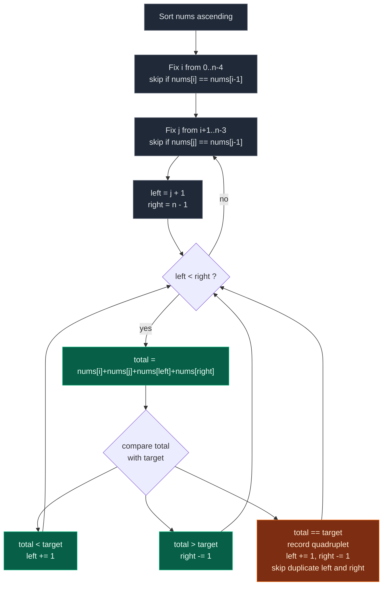

# 04. 18. 4Sum

| Difficulty | Pattern | Source | Time | Space |
|:---:|:---:|:---:|:---:|:---:|
| **Medium** | Sort + Fix Two + Two Pointers | [18. 4Sum](https://leetcode.com/problems/4sum/) | `O(n^3)` | `O(1)` extra |

## 1. Problem Statement

Given an array `nums` of `n` integers, return *an array of all the **unique** quadruplets* `[nums[a], nums[b], nums[c], nums[d]]` such that:

- `0 <= a, b, c, d < n`
- `a`, `b`, `c`, and `d` are **distinct**.
- `nums[a] + nums[b] + nums[c] + nums[d] == target`

You may return the answer in **any order**.

You need to find all **unique quadruplets**:

```text
[nums[a], nums[b], nums[c], nums[d]]
```

such that:

```text
a, b, c, d are all different indices
nums[a] + nums[b] + nums[c] + nums[d] == target
```

Important:

```text
The answer must not contain duplicate quadruplets.
```

### Examples

```text
Input:  nums = [1,0,-1,0,-2,2], target = 0
Output: [[-2,-1,1,2],[-2,0,0,2],[-1,0,0,1]]
```

```text
Input:  nums = [2,2,2,2,2], target = 8
Output: [[2,2,2,2]]
```

```text
Input:
nums = [1, 0, -1, 0, -2, 2]
target = 0

Output:
[
  [-2, -1, 1, 2],
  [-2, 0, 0, 2],
  [-1, 0, 0, 1]
]
```

### Constraints

- `1 <= nums.length <= 200`
- `-10^9 <= nums[i] <= 10^9`
- `-10^9 <= target <= 10^9`

## 2. Core Theory

4Sum is one rung on the **kSum ladder**. The whole family reduces to the same base case: sort the array once, then peel off fixed elements one at a time until only two remain, and finish those two with the classic opposite-ends two-pointer scan. Each element you fix costs one extra loop, and therefore one extra `O(n)` factor:

```text
2Sum on sorted array  -> two pointers only      -> O(n)
3Sum                  -> fix i, two pointers    -> O(n^2)
4Sum                  -> fix i, fix j, pointers -> O(n^3)
kSum                  -> fix k-2 elements       -> O(n^(k-1))
```

Sorting is what makes the two-pointer step legal. On a sorted array the sum `nums[i] + nums[j] + nums[left] + nums[right]` is **monotone** in each pointer: pushing `left` right can only increase the total, pulling `right` left can only decrease it. So a single comparison against `target` tells you unambiguously which pointer to move, and no candidate pair is ever skipped.



The four index positions on the sorted array, with `left` and `right` closing in on each other inside the window that `j` opens:

```text
sorted:   -2   -1    0    0    1    2
index:     0    1    2    3    4    5
           ^    ^    ^              ^
           i    j   left          right
                     ---> sweeps <---
                total < target  =>  left++
                total > target  =>  right--
                total == target =>  record, move both
```

**Why duplicate skipping now happens at FOUR levels.** Sorting makes equal values adjacent, which is exactly what lets a single `nums[x] == nums[x-1]` test collapse a run. But a quadruplet is uniquely identified by its *multiset of values*, not its indices, and any of the four slots can repeat. So each slot gets its own guard: `i` skips when `i > 0 and nums[i] == nums[i-1]`; `j` skips when `j > i + 1 and nums[j] == nums[j-1]` (note `i + 1`, not `0` — the first `j` for a new `i` must always be allowed even if it equals `nums[i]`); and after recording a hit, `left` and `right` each advance past their own equal runs. Miss any one of the four and `[2,2,2,2]` with `target = 8` reports the same quadruplet many times. In 3Sum there were only three levels; the extra fixed element is what adds the fourth.

**Overflow.** With `-10^9 <= nums[i] <= 10^9`, four elements can sum to `4 * 10^9`, which overflows a signed 32-bit `int` (max `2147483647`). Python integers are arbitrary precision so this is a non-issue here, but in Java or C++ the running `current_sum` must be computed in `long` / `long long`, otherwise a legitimately-too-large sum wraps negative and the pointer moves the wrong way. The same applies to the alternative formulation `target - nums[i] - nums[j]`.

## 3. Edge Cases

| Case | Input | Expected | Why it matters |
|:---|:---|:---:|:---|
| Fewer than four elements | `nums = [1]`, `target = 1` | `[]` | Loop bounds `range(n - 3)` must not run at all |
| Exactly four elements, hit | `nums = [1,2,3,4]`, `target = 10` | `[[1,2,3,4]]` | Smallest array with any answer |
| All identical | `nums = [2,2,2,2,2]`, `target = 8` | `[[2,2,2,2]]` | Every one of the four skip guards fires |
| Many zeros | `nums = [0,0,0,0,0]`, `target = 0` | `[[0,0,0,0]]` | Classic duplicate explosion if skips are wrong |
| Negatives present | `nums = [1,0,-1,0,-2,2]`, `target = 0` | 3 quadruplets | Sums are not monotone in value, only in index |
| No valid answer | `nums = [1,2,3,4]`, `target = 100` | `[]` | Target far larger than any reachable sum |
| Large magnitudes | `nums = [10^9]*4`, `target = 4*10^9` | `[[10^9,...]]` | Overflow trap in 32-bit languages |
| Duplicated pairs | `nums = [1,1,2,2,3,3]`, `target = 8` | unique sets only | `left`/`right` runs must both be skipped |

## 4. Key Observation

This problem is an extension of:

```text
Two Sum
3Sum
```

In **3Sum**, we fixed one number and then used two pointers.

In **4Sum**, we fix two numbers and then use two pointers.

So after sorting:

```text
Fix nums[i]
Fix nums[j]
Then find two numbers using left and right
```

We need:

```text
nums[i] + nums[j] + nums[left] + nums[right] == target
```

## 5. Brute Force Solution

### Intuition

Try every possible combination of four indices.

If their sum equals `target`, store the sorted quadruplet in a set to avoid duplicates.

### Approach

1. Use four nested loops.
2. Pick indices a, b, c, and d.
3. Check if their sum equals `target`.
4. Add the sorted quadruplet to a set.
5. Convert set to list.

### Dry Run

```text
nums = [1, 0, -1, 0], target = 0
```

The only index choice is `a=0, b=1, c=2, d=3`:

```text
1 + 0 + -1 + 0 = 0   -> match
sorted tuple    = (-1, 0, 0, 1)
set             = {(-1, 0, 0, 1)}
result          = [[-1, 0, 0, 1]]
```

### Code

```python
# Define the class solution
class Solution:

    # Define the method
    def fourSum(self, nums: List[int], target: int) -> List[List[int]]:

        # Store length of nums
        n = len(nums)

        # Set stores unique quadruplets
        unique_quadruplets = set()

        # Pick first index
        for a in range(n):

            # Pick second index after a
            for b in range(a + 1, n):

                # Pick third index after b
                for c in range(b + 1, n):

                    # Pick fourth index after c
                    for d in range(c + 1, n):

                        # Check whether current four numbers sum to target
                        if nums[a] + nums[b] + nums[c] + nums[d] == target:

                            # Sort quadruplet so same values have same representation
                            quadruplet = tuple(sorted([nums[a], nums[b], nums[c], nums[d]]))

                            # Add quadruplet to set
                            unique_quadruplets.add(quadruplet)

        # Convert set of tuples to list of lists
        result = [list(quad) for quad in unique_quadruplets]

        # Return all unique quadruplets
        return result
```

### Complexity

| Measure | Complexity | Why |
|:---|:---:|:---|
| **Time** | `O(n^4)` | Four fully nested index loops over the array. |
| **Space** | `O(number of unique quadruplets)` | The set holds one tuple per distinct answer. |

This is too slow for interviews.

## 6. Better Solution: Hash Set for Pair Sum

### Intuition

Fix two numbers:

```text
nums[i], nums[j]
```

Now we need two more numbers whose sum is:

```text
target - nums[i] - nums[j]
```

We can use a set to solve the remaining two-sum part.

### Approach

1. Fix `i`, then fix `j` after it.
2. Walk `k` from `j + 1` to the end, keeping a `seen` set of values already passed.
3. The required fourth number is `target - nums[i] - nums[j] - nums[k]`.
4. If that value is already in `seen`, a valid quadruplet exists — sort it and store it in a set.
5. Add `nums[k]` to `seen` and continue.

### Dry Run

```text
nums = [1, 0, -1, 0, -2, 2], target = 0
i = 0 -> nums[i] = 1
j = 1 -> nums[j] = 0
seen = {}

k = 2: fourth = 0 - 1 - 0 - (-1) = 0   not in seen   seen = {-1}
k = 3: fourth = 0 - 1 - 0 - 0    = -1  in seen       quad = (-1, 0, 0, 1)
       seen = {-1, 0}
k = 4: fourth = 0 - 1 - 0 - (-2) = 1   not in seen   seen = {-1, 0, -2}
k = 5: fourth = 0 - 1 - 0 - 2    = -3  not in seen   seen = {-1, 0, -2, 2}
```

Only one quadruplet is produced from this `(i, j)` pair. Note that `fourth` is a *value*, not an index: it is safe to use because `seen` only ever holds values from strictly between `j` and `k`, so the four positions are guaranteed distinct. Sorting each tuple before adding it to the set is what makes the representation canonical, so `(1, 0, 0, -1)` and `(-1, 0, 0, 1)` collapse into one entry.

### Code

```python
# Define the class solution
class Solution:

    # Define the method
    def fourSum(self, nums: List[int], target: int) -> List[List[int]]:

        # Store array length
        n = len(nums)

        # Store unique quadruplets
        unique_quadruplets = set()

        # Fix first number
        for i in range(n):

            # Fix second number
            for j in range(i + 1, n):

                # Set stores values seen after j
                seen = set()

                # Search remaining two numbers
                for k in range(j + 1, n):

                    # Required fourth number
                    fourth = target - nums[i] - nums[j] - nums[k]

                    # If fourth number was seen before
                    if fourth in seen:

                        # Sort quadruplet to avoid duplicate ordering
                        quad = tuple(sorted([nums[i], nums[j], nums[k], fourth]))

                        # Add to set
                        unique_quadruplets.add(quad)

                    # Add current value for future checks
                    seen.add(nums[k])

        # Convert set to list of lists
        return [list(quad) for quad in unique_quadruplets]
```

### Complexity

| Measure | Complexity | Why |
|:---|:---:|:---|
| **Time** | `O(n^3)` | Three nested loops; the set lookup inside is `O(1)` average. |
| **Space** | `O(n)` + output space | The `seen` set holds up to `n` values, plus the result set. |

Better than brute force, but the most common interview solution is sorting + two pointers.

## 7. Most Optimal Interview Solution: Sorting + Two Pointers

### Intuition

Sort the array.

Then:

```text
Fix first number with i
Fix second number with j
Use left and right pointers for remaining two numbers
```

If current sum is:

```text
less than target
```

move `left` forward to increase sum.

If current sum is:

```text
greater than target
```

move `right` backward to decrease sum.

If current sum equals `target`, store the quadruplet and skip duplicates.

### Approach

1. Sort `nums` so equal values become adjacent and the sum is monotone in each pointer.
2. Fix `i` over `range(n - 3)`, skipping `i` when `nums[i] == nums[i - 1]`.
3. Fix `j` over `range(i + 1, n - 2)`, skipping `j` when `j > i + 1 and nums[j] == nums[j - 1]`.
4. Set `left = j + 1`, `right = n - 1`, and scan while `left < right`.
5. Compare `current_sum` with `target` and move the correct pointer; on equality record the quadruplet, move both pointers, then skip equal runs on both sides.

### Duplicate Skipping Rules

After sorting, duplicates become adjacent.

Skip duplicate `i`:

```python
if i > 0 and nums[i] == nums[i - 1]:
    continue
```

Skip duplicate `j`:

```python
if j > i + 1 and nums[j] == nums[j - 1]:
    continue
```

Skip duplicate `left` and `right` after finding answer.

After adding a valid quadruplet:

```python
left += 1
right -= 1
```

Then skip repeated values:

```python
while left < right and nums[left] == nums[left - 1]:
    left += 1

while left < right and nums[right] == nums[right + 1]:
    right -= 1
```

### Dry Run

```text
nums = [1, 0, -1, 0, -2, 2]
target = 0
```

Sort:

```text
[-2, -1, 0, 0, 1, 2]
```

#### i = 0

```text
nums[i] = -2
```

#### j = 1

```text
nums[j] = -1
left = 2
right = 5
```

Sum:

```text
-2 + -1 + 0 + 2 = -1
```

Too small, move `left`.

Now:

```text
left = 3
right = 5
```

Sum:

```text
-2 + -1 + 0 + 2 = -1
```

Too small, move `left`.

Now:

```text
left = 4
right = 5
```

Sum:

```text
-2 + -1 + 1 + 2 = 0
```

Quadruplet found:

```text
[-2, -1, 1, 2]
```

#### j = 2

```text
nums[j] = 0
left = 3
right = 5
```

Sum:

```text
-2 + 0 + 0 + 2 = 0
```

Quadruplet found:

```text
[-2, 0, 0, 2]
```

#### i = 1

```text
nums[i] = -1
```

#### j = 2

```text
nums[j] = 0
left = 3
right = 5
```

Sum:

```text
-1 + 0 + 0 + 2 = 1
```

Too large, move `right`.

Now:

```text
right = 4
```

Sum:

```text
-1 + 0 + 0 + 1 = 0
```

Quadruplet found:

```text
[-1, 0, 0, 1]
```

Final answer:

```text
[[-2, -1, 1, 2], [-2, 0, 0, 2], [-1, 0, 0, 1]]
```

### Code

```python
# Define the class solution
class Solution:

    # Define the method
    def fourSum(self, nums: List[int], target: int) -> List[List[int]]:

        # Sort nums to use two pointers and handle duplicates easily
        nums.sort()

        # Store length of nums
        n = len(nums)

        # Store all unique quadruplets
        result = []

        # Fix the first number
        for i in range(n - 3):

            # Skip duplicate first numbers
            if i > 0 and nums[i] == nums[i - 1]: continue

            # Fix the second number
            for j in range(i + 1, n - 2):

                # Skip duplicate second numbers for same i
                if j > i + 1 and nums[j] == nums[j - 1]: continue

                # Left pointer starts after j
                left = j + 1

                # Right pointer starts at the end
                right = n - 1

                # Find two numbers using two pointers
                while left < right:

                    # Calculate current quadruplet sum
                    current_sum = nums[i] + nums[j] + nums[left] + nums[right]

                    # If sum equals target, we found a valid quadruplet
                    if current_sum == target:

                        # Add quadruplet to result
                        result.append([nums[i], nums[j], nums[left], nums[right]])

                        # Move both pointers
                        left += 1
                        right -= 1

                        # Skip duplicate left values
                        while left < right and nums[left] == nums[left - 1]: left += 1

                        # Skip duplicate right values
                        while left < right and nums[right] == nums[right + 1]: right -= 1

                    # If current sum is smaller, move left to increase sum
                    elif current_sum < target: left += 1

                    # If current sum is larger, move right to decrease sum
                    else: right -= 1

        # Return all unique quadruplets
        return result
```

### Complexity

```text
Time Complexity: O(n³)
```

Why?

```text
Sorting takes O(n log n)
First loop takes O(n)
Second loop takes O(n)
Two-pointer scan takes O(n)

Overall = O(n³)
```

```text
Space Complexity: O(1) extra
```

Ignoring the output list.

Sorting may use internal space depending on the language.

| Measure | Complexity | Why |
|:---|:---:|:---|
| **Time** | `O(n^3)` | Sort is `O(n log n)`; two nested loops each `O(n)` wrap an `O(n)` two-pointer sweep. |
| **Space** | `O(1)` extra | Only pointers and the sum; the output list and sorting's internal space are excluded. |

## 8. Optional Pruning Optimization

Because the array is sorted, we can sometimes skip impossible cases.

For fixed `i`, the smallest possible sum is:

```text
nums[i] + nums[i+1] + nums[i+2] + nums[i+3]
```

If this is greater than target, break.

The largest possible sum is:

```text
nums[i] + nums[n-1] + nums[n-2] + nums[n-3]
```

If this is less than target, continue.

Same idea can be applied for fixed `j`.

This optimization improves runtime but makes code slightly more complex. In interviews, write the clean two-pointer version first.

## 9. Common Mistakes

| Mistake | Why it breaks | Fix |
|:---|:---|:---|
| Forgetting to sort before the two-pointer scan | The sum is no longer monotone in `left`/`right`, so the comparison gives no information | `nums.sort()` first |
| Skipping `j` with `if j > 0 and nums[j] == nums[j-1]` | Wrongly skips the very first `j` when `nums[j] == nums[i]`, losing answers like `[2,2,2,2]` | Guard must be `j > i + 1` |
| Not skipping duplicate `left`/`right` after a hit | The same quadruplet is appended once per repeated value | Advance both pointers past their equal runs |
| Loop bounds `range(n)` / `range(i+1, n)` | `left = j + 1` can exceed `right`, wasting work or indexing badly on tiny arrays | Use `range(n - 3)` and `range(i + 1, n - 2)` |
| Computing `current_sum` in 32-bit `int` (Java/C++) | Four values near `10^9` overflow and wrap negative, flipping the comparison | Accumulate in `long` / `long long` |
| Moving only one pointer on a match | `left` and `right` can re-pair into the same total forever or miss pairs | Move both, then skip duplicates |
| De-duplicating with a set of unsorted tuples | `(1,2,3,4)` and `(2,1,3,4)` count as different | Sort each tuple, or rely on the sorted-array skips |

## 10. Interview Follow-ups

**Q: How would you generalize this to kSum?**

A: Write a recursive helper `kSum(nums, target, k, start)`. When `k == 2`, run the two-pointer scan; otherwise loop a fixed index from `start`, skip duplicates, and recurse with `k - 1`, `target - nums[i]`, and `i + 1`. Time becomes `O(n^(k-1))` and the sorting is done once up front.

**Q: Why is `O(n^3)` considered acceptable but `O(n^4)` is not?**

A: With `n <= 200`, `n^3` is `8 * 10^6` operations — trivial. `n^4` is `1.6 * 10^9`, which will time out. The hash-set version also reaches `O(n^3)` but costs `O(n)` extra space and messier de-duplication, which is why sorting + two pointers is the preferred answer.

**Q: Can 4Sum be solved faster than `O(n^3)`?**

A: You can reach `O(n^2)` *time* by hashing all pair sums into a map from sum to list of index pairs, then matching complementary sums. But you then need `O(n^2)` space and non-trivial work to reject overlapping index pairs and to de-duplicate values, so it is rarely the interview answer.

**Q: What changes if you only need the count, not the quadruplets?**

A: You can drop the duplicate-skipping entirely if duplicates should be counted separately, and on a match advance both pointers past their equal runs while multiplying the run lengths — a common trick in the 4Sum II variant.

**Q: Where does overflow bite in a statically-typed language?**

A: `nums[i] + nums[j] + nums[left] + nums[right]` with values up to `10^9` reaches `4 * 10^9`, beyond `int`'s `2^31 - 1`. In Java use `long sum = (long) nums[i] + ...`. Python is immune because its integers are unbounded.

## 11. Interview Explanation

> I sort the array first. Then I fix two numbers using two loops and solve the remaining two-sum problem using two pointers. If the current sum is less than target, I move the left pointer to increase the sum. If it is greater, I move the right pointer to decrease the sum. Whenever I find a valid quadruplet, I add it and skip duplicate values to avoid repeated quadruplets. This gives `O(n³)` time and `O(1)` extra space.

## 12. Verify

```python
from itertools import combinations
from random import randint, seed
from typing import List


def fourSum(nums: List[int], target: int) -> List[List[int]]:
    nums = sorted(nums)
    n = len(nums)
    result = []
    for i in range(n - 3):
        if i > 0 and nums[i] == nums[i - 1]:
            continue
        for j in range(i + 1, n - 2):
            if j > i + 1 and nums[j] == nums[j - 1]:
                continue
            left, right = j + 1, n - 1
            while left < right:
                current_sum = nums[i] + nums[j] + nums[left] + nums[right]
                if current_sum == target:
                    result.append([nums[i], nums[j], nums[left], nums[right]])
                    left += 1
                    right -= 1
                    while left < right and nums[left] == nums[left - 1]:
                        left += 1
                    while left < right and nums[right] == nums[right + 1]:
                        right -= 1
                elif current_sum < target:
                    left += 1
                else:
                    right -= 1
    return result


def norm(quads):
    return sorted(sorted(q) for q in quads)


def brute(nums, target):
    found = set()
    for combo in combinations(nums, 4):
        if sum(combo) == target:
            found.add(tuple(sorted(combo)))
    return sorted(list(c) for c in found)


# LeetCode examples
assert norm(fourSum([1, 0, -1, 0, -2, 2], 0)) == norm([[-2, -1, 1, 2], [-2, 0, 0, 2], [-1, 0, 0, 1]])
assert norm(fourSum([2, 2, 2, 2, 2], 8)) == [[2, 2, 2, 2]]

# Fewer than four elements: loops must not execute
assert fourSum([1], 1) == []
assert fourSum([], 0) == []
assert fourSum([1, 2, 3], 6) == []

# Exactly four elements
assert norm(fourSum([1, 2, 3, 4], 10)) == [[1, 2, 3, 4]]

# All zeros
assert norm(fourSum([0, 0, 0, 0, 0], 0)) == [[0, 0, 0, 0]]

# Negatives
assert norm(fourSum([-3, -2, -1, 0, 0, 1, 2, 3], 0)) == norm(brute([-3, -2, -1, 0, 0, 1, 2, 3], 0))

# No valid answer: target far larger than any reachable sum
assert fourSum([1, 2, 3, 4], 100) == []

# Large magnitudes: overflow trap in 32-bit languages
assert norm(fourSum([10 ** 9] * 4, 4 * 10 ** 9)) == [[10 ** 9] * 4]
assert norm(fourSum([-10 ** 9, -10 ** 9, 10 ** 9, 10 ** 9], 0)) == [[-10 ** 9, -10 ** 9, 10 ** 9, 10 ** 9]]

# Duplicated pairs: both left and right runs must be skipped
assert norm(fourSum([1, 1, 2, 2, 3, 3], 8)) == norm(brute([1, 1, 2, 2, 3, 3], 8))

# Cross-check against brute force on random inputs
seed(18)
for _ in range(400):
    n = randint(0, 9)
    arr = [randint(-4, 4) for _ in range(n)]
    t = randint(-8, 8)
    assert norm(fourSum(arr, t)) == brute(arr, t), (arr, t)

# The optimal solution must never emit a duplicate quadruplet
for _ in range(200):
    arr = [randint(-2, 2) for _ in range(randint(0, 10))]
    out = fourSum(arr, 0)
    keys = [tuple(sorted(q)) for q in out]
    assert len(keys) == len(set(keys)), (arr, out)

print("All tests passed")
```
