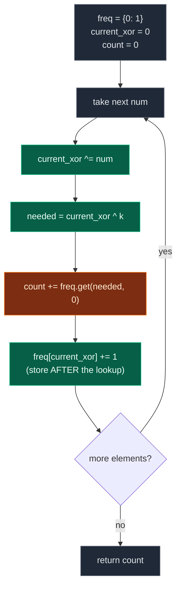

# 05. Count Subarrays with given XOR

| Difficulty | Pattern | Source | Time | Space |
|:---:|:---:|:---:|:---:|:---:|
| **Medium** | Prefix XOR + Hash Map | [Count Subarrays with given XOR](https://www.geeksforgeeks.org/problems/count-subarray-with-given-xor/1) | `O(n)` | `O(n)` |

## 1. Problem Statement

Given an array of integers `arr[]` and a number `k`, count the number of subarrays having **XOR** of their elements as `k`.

**Note:** It is guranteed that the total count will fit within a 32-bit integer.

This is a common interview problem:

> Given an array `nums` and an integer `k`, count the number of contiguous subarrays whose XOR is equal to `k`.

### Examples

```text
Input:  arr[] = [4, 2, 2, 6, 4], k = 6
Output: 4
Explanation: The subarrays having XOR of their elements as 6 are [4, 2], [4, 2, 2, 6, 4], [2, 2, 6], and [6]. Hence, the answer is 4.
```

```text
Input:  arr[] = [5, 6, 7, 8, 9], k = 5
Output: 2
Explanation: The subarrays having XOR of their elements as 5 are [5] and [5, 6, 7, 8, 9]. Hence, the answer is 2.
```

```text
Input:  arr[] = [1, 1, 1, 1], k = 0
Output: 4
Explanation: The subarrays are [1, 1], [1, 1], [1, 1] and [1, 1, 1, 1].
```

Valid subarrays for the first example are:

```text
[4, 2]          XOR = 6
[2, 2, 6]       XOR = 6
[6]             XOR = 6
[4, 2, 2, 6, 4] XOR = 6
```

So answer is:

```text
4
```

### Constraints

- `1 <= arr.size() <= 10^5`
- `0 <= arr[i] <= 10^5`
- `0 <= k <= 10^5`

## 2. Core Theory

Everything about this problem falls out of three facts about XOR, one definition, and one rearrangement. Get those and the `O(n)` solution writes itself.

**The three XOR properties.** XOR is a bitwise operation that sets a result bit when exactly one of the two input bits is set.

```text
a ^ a = 0        5 ^ 5 = 0      because 101 ^ 101 = 000, same bits cancel
a ^ 0 = a        5 ^ 0 = 5      zero is the identity element
a ^ b = b ^ a    XOR is commutative
(a ^ b) ^ c = a ^ (b ^ c)       XOR is associative
```

The first two combine into the fact that makes the whole technique possible: `a ^ b ^ a = b`, "because the two `a`s cancel each other". Commutativity and associativity are what license you to *rearrange* a long XOR chain so that the cancelling pairs sit next to each other.

**Prefix XOR.** Exactly the prefix-sum idea with `^` in place of `+`. Define `prefix[i]` as the XOR of everything from index `0` up to and including index `i`:

```text
Index        0    1    2    3    4
arr          4    2    2    6    4
prefix XOR   4    6    4    2    6
```

**The key identity.** For a subarray from `l` to `r`:

```text
XOR(l, r) = prefix[r] ^ prefix[l - 1]
```

Why? Take `arr = [a, b, c, d, e]` and ask for the XOR of `[c, d, e]`. The prefix up to `e` is `a^b^c^d^e`; the prefix before `c` is `a^b`. XOR them and, by associativity and commutativity, rearrange:

```text
(a^b^c^d^e) ^ (a^b)
= a^a ^ b^b ^ c^d^e      rearranged
= 0 ^ 0 ^ c^d^e          because a^a = 0 and b^b = 0
= c^d^e                  because 0^x = x
```

The shared prefix `a^b` cancels itself out, leaving precisely the subarray.

**The rearrangement, and why you XOR instead of subtract.** We want `XOR(l, r) = k`, so with `X = prefix[r]` (known, we are standing at `r`) and `Y = prefix[l-1]` (unknown, we are looking for it):

```text
X ^ Y = k
X ^ X ^ Y = k ^ X        XOR both sides with X
0 ^ Y = k ^ X            because X ^ X = 0
Y = X ^ k                because 0 ^ Y = Y, and XOR is commutative
```

This is the crucial parallel to the prefix-**sum** version of the problem. There, `prefix[r] - prefix[l-1] = k` rearranges to `prefix[l-1] = prefix[r] - k` — you *subtract*, because subtraction is the inverse of addition. Under XOR there is no separate inverse operation: **XOR is its own inverse** (`X ^ X = 0`), so undoing an XOR means applying another XOR. Writing `needed = current_xor - k` is the single most common way to get this problem wrong.

**Why the map stores COUNTS, not just membership.** The same prefix XOR value can occur at several different indices, and each occurrence is a different starting point for a valid subarray ending here. In `[4, 2, 2, 6, 4]` the value `4` appears as a prefix after index `0` and again after index `2`. Standing at index `3` with `current_xor = 2` and `needed = 2 ^ 6 = 4`, both earlier occurrences produce a valid subarray — `[2, 2, 6]` (indices 1..3) and `[6]` (index 3..3). So the step is `count += freq[needed]`, never `count += 1`.

**Why the map is seeded with `{0: 1}`.** The empty prefix — everything before index `0` — has XOR `0`. Picture an imaginary index `-1` whose prefix XOR is `0`. That seed is what lets subarrays *starting at index 0* be counted. With `arr = [4, 2]`, `k = 6`: at index `1`, `current_xor = 4 ^ 2 = 6` and `needed = 6 ^ 6 = 0`. The whole array is itself a valid subarray, and the only way to detect it is for prefix XOR `0` to already be in the map once. Without the seed, every subarray beginning at index `0` is silently missed.



Worked trace for `arr = [4, 2, 2, 6, 4]`, `k = 6`:

```text
 i | arr[i] | current_xor | needed = X^k | freq before lookup    | found | count
---+--------+-------------+--------------+-----------------------+-------+------
 - |   -    |      0      |      -       | {0:1}                 |   -   |   0
 0 |   4    |      4      |      2       | {0:1}                 |   0   |   0
 1 |   2    |      6      |      0       | {0:1, 4:1}            |   1   |   1
 2 |   2    |      4      |      2       | {0:1, 4:1, 6:1}       |   0   |   1
 3 |   6    |      2      |      4       | {0:1, 4:2, 6:1}       |   2   |   3
 4 |   4    |      6      |      0       | {0:1, 4:2, 6:1, 2:1}  |   1   |   4
```

Note row `i = 3`: `freq[4] == 2` contributes **two** subarrays in a single step. That is the whole reason for counting frequencies.

## 3. Edge Cases

| Case | Input | Expected | Why it matters |
|:---|:---|:---:|:---|
| Single element, match | `arr = [6]`, `k = 6` | `1` | Needs the `{0: 1}` seed to be found at all |
| Single element, no match | `arr = [5]`, `k = 6` | `0` | Map lookup must miss cleanly |
| `k = 0`, all equal | `arr = [1,1,1,1]`, `k = 0` | `4` | Counts subarrays XOR-ing to zero, i.e. repeated prefixes |
| `k = 0`, zeros present | `arr = [0,0,0]`, `k = 0` | `6` | Every one of the `n(n+1)/2` subarrays qualifies |
| Whole prefix equals `k` | `arr = [4,2,2,6,4]`, `k = 6` | `4` | Includes the full array; seed is load-bearing |
| No valid answer | `arr = [1,2,3]`, `k = 100` | `0` | `needed` is never present in the map |
| Duplicated prefixes | `arr = [4,2,2,6,4]`, `k = 6` at `i=3` | adds `2` | One index contributes more than one subarray |
| Element equals `k` alone | `arr = [5,6,7,8,9]`, `k = 5` | `2` | `[5]` and `[5,6,7,8,9]` both count |
| Large input | `n = 10^5` | runs fast | Only `O(n)` survives; `O(n^2)` is `10^10` steps |

## 4. What is XOR?

XOR is a bitwise operation.

Important properties:

```text
a ^ a = 0
a ^ 0 = a
XOR is commutative
XOR is associative
```

Meaning:

```text
5 ^ 5 = 0
5 ^ 0 = 5
```

Also:

```text
a ^ b ^ a = b
```

because the two `a`s cancel each other.

## 5. Problem Explanation

We need to count all contiguous subarrays whose XOR is equal to `k`.

For example:

```text
nums = [4, 2, 2, 6, 4]
k = 6
```

Subarray `[4, 2]`:

```text
4 ^ 2 = 6
```

Subarray `[6]`:

```text
6
```

Both are valid.

## 6. Brute Force Solution

### Intuition

Generate every possible subarray.

Calculate XOR of that subarray.

If XOR equals `k`, increase count.

### Approach

1. Choose every possible starting index.
2. Choose every possible ending index.
3. Calculate XOR from start to end.
4. If XOR equals `k`, increment answer.

### Dry Run

```text
nums = [4, 2, 2]
k = 6
```

All subarrays:

```text
[4]       XOR = 4
[4, 2]    XOR = 6  count = 1
[4, 2, 2] XOR = 4
[2]       XOR = 2
[2, 2]    XOR = 0
[2]       XOR = 2
```

Answer:

```text
1
```

### Code

```python
class Solution:
    def subarrayXor(self, nums, k):

        # Store the length of the array
        n = len(nums)

        # Store the count of subarrays whose XOR equals k
        count = 0

        # Try every possible starting index
        for start in range(n):

            # Try every possible ending index
            for end in range(start, n):

                # Store XOR of current subarray
                current_xor = 0

                # Calculate XOR from start to end
                for index in range(start, end + 1):

                    # XOR current element into current_xor
                    current_xor ^= nums[index]

                # If current subarray XOR equals k
                if current_xor == k:

                    # Increase valid subarray count
                    count += 1

        # Return total count
        return count
```

### Complexity

```text
Time Complexity: O(n³)
Space Complexity: O(1)
```

Because we choose start, end, and calculate XOR again.

| Measure | Complexity | Why |
|:---|:---:|:---|
| **Time** | `O(n^3)` | There are `O(n^2)` subarrays and recomputing each one's XOR costs `O(n)`. |
| **Space** | `O(1)` | Only a running XOR and a counter. |

## 7. Better Brute Force: Running XOR

### Intuition

Instead of recalculating XOR again and again, maintain a running XOR for each start index.

For fixed `start`, as `end` moves forward:

```text
current_xor ^= nums[end]
```

Do we really need the third loop? No. For `start = 0` on `[4, 2, 2]`:

```text
Take 4:      xor = 0 XOR 4 = 4
Take 2:      xor = 4 XOR 2 = 6
Take next 2: xor = 6 XOR 2 = 4
```

### Approach

1. Fix a starting index `start`.
2. Reset `current_xor = 0`.
3. Extend `end` rightward, folding `nums[end]` into `current_xor` with one XOR.
4. Whenever `current_xor == k`, increment the count.

### Dry Run

```text
nums = [4, 2, 2, 6, 4]
k = 6
```

Start at index 0:

```text
end = 0 -> current_xor = 4
end = 1 -> current_xor = 4 ^ 2 = 6 -> count = 1
end = 2 -> current_xor = 6 ^ 2 = 4
end = 3 -> current_xor = 4 ^ 6 = 2
end = 4 -> current_xor = 2 ^ 4 = 6 -> count = 2
```

Start at index 1:

```text
end = 1 -> current_xor = 2
end = 2 -> current_xor = 2 ^ 2 = 0
end = 3 -> current_xor = 0 ^ 6 = 6 -> count = 3
end = 4 -> current_xor = 6 ^ 4 = 2
```

Start at index 3:

```text
end = 3 -> current_xor = 6 -> count = 4
```

Final answer:

```text
4
```

### Code

```python
# Define the class solution
class Solution:

    # Define the method
    def subarrayXor(self, nums, k):

        # Store the length of the array
        n = len(nums)

        # Store total count of valid subarrays
        count = 0

        # Try every starting index
        for start in range(n):

            # Running XOR for subarray starting at start
            current_xor = 0

            # Expand ending index from start to end
            for end in range(start, n):

                # Include current end element in XOR
                current_xor ^= nums[end]

                # If running XOR equals k
                if current_xor == k:

                    # Increase count
                    count += 1

        # Return total valid subarrays
        return count
```

### Complexity

```text
Time Complexity: O(n²)
Space Complexity: O(1)
```

This is better, but still not optimal.

| Measure | Complexity | Why |
|:---|:---:|:---|
| **Time** | `O(n^2)` | Outer loop `O(n)` times an inner loop `O(n)`; the XOR update is `O(1)`. |
| **Space** | `O(1)` | No auxiliary structure. |

## 8. Most Optimal Solution: Prefix XOR + Hash Map

### Core Intuition

This is very similar to:

```text
Count subarrays with given sum
```

But instead of prefix sum, we use **prefix XOR**.

Let:

```text
current_xor = XOR from index 0 to current index
```

Suppose there was a previous prefix XOR:

```text
previous_xor
```

The XOR of subarray between previous index + 1 and current index is:

```text
previous_xor ^ current_xor
```

We want this to be equal to `k`.

So:

```text
previous_xor ^ current_xor = k
```

Now we need to find:

```text
previous_xor = current_xor ^ k
```

Why?

Because XOR both sides with `current_xor`:

```text
previous_xor ^ current_xor = k

previous_xor = current_xor ^ k
```

So at every index, we check how many times:

```text
current_xor ^ k
```

has appeared before.

### Important Formula

At current index:

```text
current_xor = prefix XOR till current index
```

We need previous prefix XOR:

```text
required_xor = current_xor ^ k
```

If `required_xor` appeared before `freq` times, then `freq` subarrays ending at current index have XOR `k`.

### Important Initialization

We initialize:

```python
prefix_xor_count = {0: 1}
```

Meaning:

```text
Prefix XOR 0 exists once before the array starts.
```

Why?

Because if current prefix XOR itself equals `k`, then subarray from index 0 to current index is valid.

Example:

```text
nums = [4, 2]
k = 6
```

At index 1:

```text
current_xor = 4 ^ 2 = 6
required_xor = current_xor ^ k = 6 ^ 6 = 0
```

We need prefix XOR 0 before array start to count `[4, 2]`.

### Approach

1. Seed `prefix_xor_count = {0: 1}` for the empty prefix.
2. Walk the array once, folding each element into `current_xor`.
3. Compute `required_xor = current_xor ^ k`.
4. Add `prefix_xor_count.get(required_xor, 0)` to the answer.
5. **Then** record `current_xor` in the map, and continue.

### Dry Run

```text
nums = [4, 2, 2, 6, 4]
k = 6
```

Initial:

```text
prefix_xor_count = {0: 1}
current_xor = 0
count = 0
```

| i | nums[i] | current_xor | required_xor = current_xor ^ k | Frequency found | count |
|:---:|:---:|:---:|:---:|:---:|:---:|
| 0 | 4 | 4 | 2 | 0 | 0 |
| 1 | 2 | 6 | 0 | 1 | 1 |
| 2 | 2 | 4 | 2 | 0 | 1 |
| 3 | 6 | 2 | 4 | 2 | 3 |
| 4 | 4 | 6 | 0 | 1 | 4 |

Final answer:

```text
4
```

### Why At Index 3 Frequency Found Is 2

At index 3:

```text
current_xor = 2
k = 6
required_xor = 2 ^ 6 = 4
```

Prefix XOR 4 appeared earlier two times:

```text
after index 0
after index 2
```

So there are two valid subarrays ending at index 3:

```text
index 1 to 3: [2, 2, 6]
index 3 to 3: [6]
```

Both have XOR 6.

### Code

```python
# Define the class solution
class Solution:

    # Define the method
    def subarrayXor(self, nums, k):

        # Dictionary stores frequency of prefix XOR values seen so far
        prefix_xor_count = {0: 1}

        # Running prefix XOR from index 0 to current index
        current_xor = 0

        # Total number of subarrays with XOR equal to k
        count = 0

        # Traverse every number in nums
        for num in nums:

            # Update running prefix XOR
            current_xor ^= num

            # Required previous prefix XOR to form XOR k
            required_xor = current_xor ^ k

            # If required_xor appeared before, all its occurrences form valid subarrays
            count += prefix_xor_count.get(required_xor, 0)

            # Store current prefix XOR frequency for future subarrays
            prefix_xor_count[current_xor] = prefix_xor_count.get(current_xor, 0) + 1

        # Return total count of valid subarrays
        return count
```

### Complexity

```text
Time Complexity: O(n)
```

Because we traverse the array once.

```text
Space Complexity: O(n)
```

Because in the worst case, all prefix XOR values can be different.

| Measure | Complexity | Why |
|:---|:---:|:---|
| **Time** | `O(n)` | One pass, with `O(1)` average hash map lookup and insert per element. |
| **Space** | `O(n)` | The map can hold up to `n + 1` distinct prefix XOR values. |

## 9. Why This Works

Suppose:

```text
prefix_xor_before = XOR from index 0 to index a
current_xor       = XOR from index 0 to index b
```

Then XOR of subarray from `a + 1` to `b` is:

```text
prefix_xor_before ^ current_xor
```

We want:

```text
prefix_xor_before ^ current_xor = k
```

So the previous prefix XOR must be:

```text
prefix_xor_before = current_xor ^ k
```

That is why for each current index, we count how many times `current_xor ^ k` appeared before.

## 10. Common Mistakes

| Mistake | Why it breaks | Fix |
|:---|:---|:---|
| `required_xor = current_xor - k` | Subtraction is the inverse of `+`, not of `^`; XOR is its own inverse | `required_xor = current_xor ^ k` |
| Storing `current_xor` in the map **before** the lookup | Counts the empty subarray ending at the current index, inflating the answer — especially when `k = 0` | Update `current_xor`, look up `required_xor`, **then** store |
| Omitting the `{0: 1}` seed | Every subarray starting at index `0` is missed, including the full array | Initialize `prefix_xor_count = {0: 1}` |
| `count += 1` instead of `count += freq[required_xor]` | One index can close several valid subarrays; only the first is counted | Add the stored frequency |
| Using a `set` instead of a map of counts | A set records existence but loses multiplicity | Use a frequency dictionary |
| Resetting `current_xor` inside the loop | Destroys the prefix invariant; the map values stop being prefixes | Keep one running XOR across the whole pass |

## 11. Interview Follow-ups

**Q: How does this differ from "count subarrays with sum `k`"?**

A: Structurally it is the same single-pass prefix + hash-map algorithm. The only change is the operator: `prefix[r] - prefix[l-1] = k` becomes `prefix[r] ^ prefix[l-1] = k`, and therefore `needed = prefix - k` becomes `needed = prefix ^ k`. XOR is its own inverse, so you XOR rather than subtract.

**Q: Why does the sliding-window trick not work here?**

A: Sliding windows need monotonicity — extending the window must move the quantity in a predictable direction. XOR has no such ordering: adding an element can raise or lower the value arbitrarily, and there are no "positive numbers only" guarantees to lean on. Prefix + hash map is the correct tool.

**Q: What happens when `k = 0`?**

A: `required_xor = current_xor ^ 0 = current_xor`, so you are counting pairs of indices with *equal* prefix XOR. Each such pair delimits a subarray XOR-ing to zero. For `[1,1,1,1]` the prefixes are `1,0,1,0`; together with the seeded `0` this yields 4.

**Q: Can the answer overflow?**

A: The maximum is `n(n+1)/2`, which for `n = 10^5` is about `5 * 10^9` — beyond 32-bit. The problem statement guarantees the count fits in 32 bits for its test data, but in C++/Java it is still safest to accumulate in `long long` / `long`.

**Q: Could you use an array instead of a hash map?**

A: Yes, when the value range is bounded. Prefix XOR of values `< 2^17` stays `< 2^17`, so a plain array of size `131072` works and is faster than hashing, at the cost of `O(max_value)` space regardless of `n`.

## 12. Interview Explanation

> I use prefix XOR and a hash map. At each index, I maintain XOR from the start to current index. If a previous prefix XOR equals `current_xor ^ k`, then the subarray between that previous prefix and current index has XOR `k`. Since multiple previous prefixes can have the same XOR, I store frequencies. I initialize the map with `{0: 1}` to count subarrays starting from index 0. This gives `O(n)` time and `O(n)` space.

## 13. Verify

```python
from collections import defaultdict
from random import randint, seed


def subarrayXor(nums, k):

    # Dictionary stores frequency of prefix XOR values seen so far
    prefix_xor_count = defaultdict(int)

    # Seed the empty prefix so a whole-prefix match is counted
    prefix_xor_count[0] = 1

    # Running prefix XOR from index 0 to current index
    current_xor = 0

    # Total number of subarrays with XOR equal to k
    count = 0

    # Traverse every number in nums
    for num in nums:

        # Update running prefix XOR
        current_xor ^= num

        # Required previous prefix XOR to form XOR k
        required_xor = current_xor ^ k

        # If required_xor appeared before, all its occurrences form valid subarrays
        count += prefix_xor_count[required_xor]

        # Store current prefix XOR frequency for future subarrays
        prefix_xor_count[current_xor] += 1

    # Return total count of valid subarrays
    return count


def brute(nums, k):
    # Total number of matching subarrays found
    total = 0

    # Try every possible subarray start
    for start in range(len(nums)):

        # Running XOR for subarrays beginning at start
        current = 0

        # Extend the subarray one element at a time
        for end in range(start, len(nums)):
            current ^= nums[end]

            # Count it if the running XOR matches k
            if current == k:
                total += 1

    # Return the brute-force count
    return total


# Problem examples
assert subarrayXor([4, 2, 2, 6, 4], 6) == 4
assert subarrayXor([5, 6, 7, 8, 9], 5) == 2
assert subarrayXor([1, 1, 1, 1], 0) == 4

# Single element
assert subarrayXor([6], 6) == 1
assert subarrayXor([5], 6) == 0
assert subarrayXor([0], 0) == 1

# k = 0 with all zeros: every subarray qualifies, n(n+1)/2
assert subarrayXor([0, 0, 0], 0) == 6
assert subarrayXor([0] * 10, 0) == 10 * 11 // 2

# All identical values
assert subarrayXor([7, 7, 7, 7], 7) == 6
assert subarrayXor([7, 7, 7, 7], 0) == 4

# Whole prefix equals k (the {0: 1} seed is load-bearing)
assert subarrayXor([1, 2, 3], 1 ^ 2 ^ 3) == 1

# No valid answer
assert subarrayXor([1, 2, 3], 100) == 0

# Brute-force cross-check on random inputs, including k = 0
seed(5)
for _ in range(600):
    n = randint(0, 12)
    arr = [randint(0, 8) for _ in range(n)]
    for kk in range(0, 9):
        assert subarrayXor(arr, kk) == brute(arr, kk), (arr, kk)

# Larger random cross-check with a wider value range
for _ in range(40):
    arr = [randint(0, 10 ** 5) for _ in range(200)]
    kk = randint(0, 10 ** 5)
    assert subarrayXor(arr, kk) == brute(arr, kk)

# Performance sanity: 10^5 elements must run in one pass
big = [randint(0, 10 ** 5) for _ in range(10 ** 5)]
assert subarrayXor(big, 0) >= 0

print("All tests passed")
```
