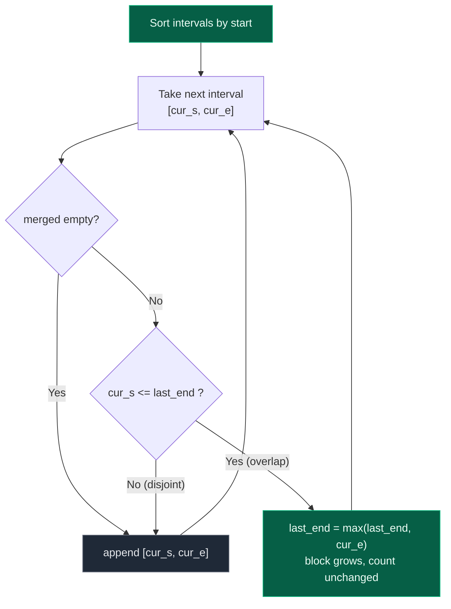

# 06. 56. Merge Intervals

| Difficulty | Pattern | Source | Time | Space |
|:---:|:---:|:---:|:---:|:---:|
| **Medium** | Sort + Sweep | [56. Merge Intervals](https://leetcode.com/problems/merge-intervals/) | `O(n log n)` | `O(n)` |

## 1. Problem Statement

Given an array of `intervals` where `intervals[i] = [start_i, end_i]`, merge all overlapping intervals, and return *an array of the non-overlapping intervals that cover all the intervals in the input*.

You are given a list of intervals. Each interval is:

```text
[start, end]
```

You need to merge all overlapping intervals and return the final non-overlapping intervals.

### Examples

```text
Input:  intervals = [[1,3],[2,6],[8,10],[15,18]]
Output: [[1,6],[8,10],[15,18]]
Explanation: Since intervals [1,3] and [2,6] overlap, merge them into [1,6].
```

```text
Input:  intervals = [[1,4],[4,5]]
Output: [[1,5]]
Explanation: Intervals [1,4] and [4,5] are considered overlapping.
```

```text
Input:  intervals = [[4,7],[1,4]]
Output: [[1,7]]
Explanation: Intervals [1,4] and [4,7] are considered overlapping.
```

Worked explanation of Example 1:

```text
[1,3] and [2,6] overlap

Because:
2 <= 3

So merge them:
[1,6]
```

```text
Final answer:
[[1,6], [8,10], [15,18]]
```

### Constraints

- `1 <= intervals.length <= 10^4`
- `intervals[i].length == 2`
- `0 <= start_i <= end_i <= 10^4`

## 2. Core Theory

The whole problem collapses once you sort by **start**. In arbitrary order, an interval can overlap something far away in the array, so you would have to keep looking backwards forever. After sorting by start, every interval you meet has a start greater than or equal to every start you have already consumed. That single fact means the only thing that can still be extended is the **most recently emitted merged block** — if the current interval does not reach back to that block's end, it cannot reach back to any earlier block either, because all earlier blocks end at or before it. So one forward sweep with one "last merged" slot is sufficient; you never look backwards.

The merge test is `current_start <= last_end`. The `<=` (not `<`) is deliberate: this problem treats touching intervals as overlapping, so `[1,4]` and `[4,5]` become `[1,5]`. If the problem instead defined intervals as half-open, `<` would be correct — the comparison operator is exactly where that definition lives.

When they do overlap, the merged end must be `max(last_end, current_end)`, never simply `current_end`. Sorting orders the starts, not the ends, so a fully-contained interval like `[2,3]` can arrive after `[1,10]`. Assigning `last_end = current_end` would shrink the block from `[1,10]` to `[1,3]` and silently drop coverage. Taking the max makes the block monotonically grow, which is the invariant the sweep depends on.



On a number line, the two cases look like this:

```text
index:   0    2    4    6    8   10   12   14   16   18
         |----|----|----|----|----|----|----|----|----|

[1,3]     [===]
[2,6]        [=========]          cur_s=2 <= last_end=3  -> OVERLAP, end = max(3,6)=6
merged    [============]          -> [1,6]

[8,10]                  [====]    cur_s=8 >  last_end=6  -> DISJOINT, append
[15,18]                             [====]  cur_s=15 > 10 -> DISJOINT, append

result:   [1,6]         [8,10]     [15,18]
```

## 3. Edge Cases

| Case | Input | Expected | Why it matters |
|:---|:---|:---:|:---|
| Single interval | `[[1,4]]` | `[[1,4]]` | Loop must emit the first interval with no comparison |
| Touching endpoints | `[[1,4],[4,5]]` | `[[1,5]]` | Forces `<=` instead of `<` |
| Fully contained | `[[1,10],[2,3]]` | `[[1,10]]` | Forces `max(last_end, cur_e)` |
| Already disjoint | `[[1,2],[3,4],[5,6]]` | `[[1,2],[3,4],[5,6]]` | Nothing merges; output length equals input |
| Unsorted input | `[[8,10],[1,3],[15,18],[2,6]]` | `[[1,6],[8,10],[15,18]]` | Sorting is what makes one sweep valid |
| All identical | `[[2,5],[2,5],[2,5]]` | `[[2,5]]` | Duplicates must collapse, not duplicate |
| Zero-width interval | `[[1,1],[1,3]]` | `[[1,3]]` | `start == end` is legal under the constraints |
| Everything merges | `[[1,4],[2,5],[3,6]]` | `[[1,6]]` | Chained overlaps grow one block repeatedly |

## 4. Brute Force Solution

### Intuition

For each interval, compare it with every other interval and keep merging if they overlap.

This is complicated because after merging one interval, it may overlap with another interval again.

A brute force style approach repeatedly scans and merges until no more changes happen.

### Approach

High-Level Brute Force Approach:

1. Pick one interval.
2. Compare with all other intervals.
3. If overlap exists, merge them.
4. Remove the merged interval.
5. Repeat until no interval can be merged.

This is not interview-friendly because it is inefficient and messy.

### Dry Run

```text
intervals = [[1,3], [8,10], [2,6]]

pass 1: [1,3] vs [8,10] -> no overlap
        [1,3] vs [2,6]  -> overlap -> [1,6], remove [2,6]
        list changed, so scan again

pass 2: [1,6] vs [8,10] -> no overlap
        nothing changed -> stop

result: [[1,6], [8,10]]
```

### Code

```python
# Define the class solution
class Solution:

    # Define the method
    def merge(self, intervals: List[List[int]]) -> List[List[int]]:

        # Work on a copy so the input is not disturbed
        result = [list(interval) for interval in intervals]

        # Keep scanning until a full pass makes no merge
        changed = True

        # Repeat until no interval can be merged
        while changed:

            # Assume nothing will merge in this pass
            changed = False

            # Pick one interval
            for i in range(len(result)):

                # Compare with all other intervals
                for j in range(i + 1, len(result)):

                    # If overlap exists, merge them
                    if result[i][0] <= result[j][1] and result[j][0] <= result[i][1]:

                        # Merge into the interval at i
                        result[i] = [min(result[i][0], result[j][0]), max(result[i][1], result[j][1])]

                        # Remove the merged interval
                        result.pop(j)

                        # A merge happened, so scan again
                        changed = True

                        # Restart the scan safely
                        break

                # Stop the outer loop too when a merge happened
                if changed:
                    break

        # Return merged intervals
        return result
```

### Complexity

| Measure | Complexity | Why |
|:---|:---:|:---|
| **Time** | `O(n^2)` or worse | Because each interval may be compared many times. |
| **Space** | `O(n)` | Because we store the result list. |

In interviews, we usually directly move to sorting.

## 5. Key Observation

Two intervals overlap if the second interval starts before or at the end of the first interval.

Suppose:

```text
first  = [1, 3]
second = [2, 6]
```

They overlap because:

```text
second_start <= first_end
2 <= 3
```

Merged interval becomes:

```text
[start of first, max(end of first, end of second)]
= [1, max(3, 6)]
= [1, 6]
```

Non-overlapping example:

```text
first  = [1, 3]
second = [4, 6]
```

They do not overlap because:

```text
second_start > first_end
4 > 3
```

So keep both:

```text
[[1,3], [4,6]]
```

If intervals are sorted by start time, then overlapping intervals will come next to each other.

Example:

```text
intervals = [[8,10], [1,3], [15,18], [2,6]]
```

After sorting by start:

```text
[[1,3], [2,6], [8,10], [15,18]]
```

Now we only need to compare each interval with the last merged interval.

## 6. Better / Optimal Solution: Sort + Merge

### Intuition

Sort intervals by starting point.

Then maintain a result list.

For every interval:

```text
If result is empty:
    add interval

Else compare current interval with last interval in result
```

There are two cases.

**Case 1: Overlap**

```text
last interval    = [1, 3]
current interval = [2, 6]
```

They overlap because:

```text
current_start <= last_end
2 <= 3
```

So merge:

```text
last_end = max(last_end, current_end)
last_end = max(3, 6) = 6
```

Result becomes:

```text
[[1,6]]
```

**Case 2: No Overlap**

```text
last interval    = [1, 6]
current interval = [8, 10]
```

No overlap because:

```text
8 > 6
```

So add current interval separately:

```text
[[1,6], [8,10]]
```

### Approach

1. Sort intervals based on their start value.
2. Create an empty `merged` list.
3. Traverse every interval after sorting.
4. If `merged` is empty, add the first interval directly.
5. Else if `interval[0] > merged[-1][1]`, there is no overlap, so add it as a new interval.
6. Otherwise, intervals overlap, so extend the end of the last merged interval to `max(merged[-1][1], interval[1])`.
7. Return `merged`.

### Dry Run

```text
intervals = [[1,3], [2,6], [8,10], [15,18]]
```

Already sorted.

Initial:

```text
merged = []
```

#### interval = [1,3]

Merged is empty.

Add interval:

```text
merged = [[1,3]]
```

#### interval = [2,6]

Last interval:

```text
[1,3]
```

Current interval:

```text
[2,6]
```

Check overlap:

```text
2 <= 3
```

Yes, overlap.

Merge:

```text
last_end = max(3,6) = 6
```

Merged becomes:

```text
merged = [[1,6]]
```

#### interval = [8,10]

Last interval:

```text
[1,6]
```

Check overlap:

```text
8 <= 6? No
```

No overlap.

Add:

```text
merged = [[1,6], [8,10]]
```

#### interval = [15,18]

Last interval:

```text
[8,10]
```

Check overlap:

```text
15 <= 10? No
```

No overlap.

Add:

```text
merged = [[1,6], [8,10], [15,18]]
```

Final answer:

```text
[[1,6], [8,10], [15,18]]
```

### Dry Run With Touching Intervals

```text
intervals = [[1,4], [4,5]]
```

Sorted:

```text
[[1,4], [4,5]]
```

Check:

```text
current_start <= last_end
4 <= 4
```

They overlap because endpoints touch.

Merge:

```text
[1, max(4,5)] = [1,5]
```

Output:

```text
[[1,5]]
```

### Code

```python
# Define the class solution
class Solution:

    # Define the method
    def merge(self, intervals: List[List[int]]) -> List[List[int]]:

        # Sort intervals based on their start value
        intervals.sort(key=lambda interval: interval[0])

        # This list will store the merged non-overlapping intervals
        merged = []

        # Traverse every interval after sorting
        for interval in intervals:

            # If merged is empty, add the first interval directly
            if not merged:

                # Add current interval to merged list
                merged.append(interval)

            # If current interval starts after the last merged interval ends
            elif interval[0] > merged[-1][1]:

                # There is no overlap, so add it as a new interval
                merged.append(interval)

            # Otherwise, intervals overlap
            else:

                # Extend the end of last merged interval if current interval ends later
                merged[-1][1] = max(merged[-1][1], interval[1])

        # Return merged intervals
        return merged
```

### Complexity

| Measure | Complexity | Why |
|:---|:---:|:---|
| **Time** | `O(n log n)` | Because sorting takes `O(n log n)`. The merging scan takes `O(n)`. So total is `O(n log n)`. |
| **Space** | `O(n)` | Because we store the output list. Ignoring output space, extra space is `O(1)` depending on sorting implementation. |

## 7. Why Sorting Is Necessary

Without sorting:

```text
intervals = [[8,10], [1,3], [2,6]]
```

If we process in this order, `[1,3]` and `[2,6]` are not adjacent initially.

Sorting makes overlapping intervals come together:

```text
[[1,3], [2,6], [8,10]]
```

Then one linear scan is enough.

## 8. Common Mistakes

The author's three interview mistakes, plus a few more traps:

| Mistake | Why it breaks | Fix |
|:---|:---|:---|
| Using `<` instead of `<=` | `[1,4]` and `[4,5]` should merge into `[1,5]`, but a strict `<` treats them as disjoint | Overlap condition must be `interval[0] <= merged[-1][1]` |
| Not taking max end: `merged[-1][1] = interval[1]` | `[1,10]` followed by `[2,3]` would shrink to `[1,3]` instead of staying `[1,10]` | `merged[-1][1] = max(merged[-1][1], interval[1])` |
| Forgetting to sort | If intervals are not sorted, comparing only with the last merged interval is not safe | Always `intervals.sort(key=lambda x: x[0])` first |
| Sorting by end instead of start | Overlapping intervals are no longer guaranteed adjacent by start, so the one-slot sweep breaks | Sort by `interval[0]` |
| Appending the input row object then mutating it | `merged[-1][1] = ...` writes back into the caller's list | Append a copy, or accept the in-place mutation deliberately |
| Comparing against `merged[0]` instead of `merged[-1]` | Only the most recent block can still grow | Always compare with `merged[-1]` |

## 9. Interview Follow-ups

**Q: Why is comparing only with the last merged interval enough?**

A: Because the input is sorted by start. Every later interval has a start `>=` all consumed starts, and every earlier merged block ends at or before the last block's end. So if the current interval does not reach the last block, it cannot reach any earlier one either.

**Q: Can you do better than `O(n log n)`?**

A: Not by comparison sorting — merging intervals is at least as hard as sorting, so `O(n log n)` is the bound. If the coordinates are small bounded integers (here `0 <= start <= end <= 10^4`), you can counting-sort or use a difference array over the value range and get `O(n + M)`.

**Q: What if intervals arrive one at a time and you must insert into an already-merged list?**

A: That is LeetCode 57 (Insert Interval). Binary search for the position, then merge the contiguous run of overlapping blocks — `O(log n)` to locate plus `O(k)` for the `k` blocks swallowed.

**Q: How would you instead count the minimum number of intervals to remove so none overlap?**

A: Sort by **end** and greedily keep intervals whose start is `>=` the last kept end. That is LeetCode 435, and it is the classic case where sorting by end, not start, is the right key.

**Q: How do you find the maximum number of intervals overlapping at any point?**

A: Sweep line: emit `(start, +1)` and `(end, -1)` events, sort them, and track a running counter's maximum. This is the "meeting rooms II" variant and also runs in `O(n log n)`.

## 10. Interview Explanation

> I first sort the intervals by start time. Then I scan them one by one and compare each interval with the last interval in the merged result. If the current start is greater than the last merged end, there is no overlap, so I add it as a new interval. Otherwise, they overlap, so I update the last merged end to the maximum of both ends. Sorting makes all overlapping intervals adjacent, so one scan is enough after sorting.

## 11. Verify

```python
from typing import List
import random


def merge(intervals: List[List[int]]) -> List[List[int]]:

    # Sort intervals based on their start value, without mutating the input
    intervals = sorted(intervals, key=lambda interval: interval[0])

    # This list will store the merged non-overlapping intervals
    merged = []

    # Traverse every interval after sorting
    for interval in intervals:

        # If merged is empty, add the first interval directly
        if not merged:
            merged.append(list(interval))

        # If current interval starts after the last merged interval ends
        elif interval[0] > merged[-1][1]:

            # There is no overlap, so add it as a new interval
            merged.append(list(interval))

        # Otherwise, intervals overlap
        else:

            # Extend the end of last merged interval if current interval ends later
            merged[-1][1] = max(merged[-1][1], interval[1])

    # Return merged intervals
    return merged


# LeetCode examples: touching endpoints and unsorted overlapping pairs
assert merge([[1, 3], [2, 6], [8, 10], [15, 18]]) == [[1, 6], [8, 10], [15, 18]]
# Touching endpoints: forces <= instead of <
assert merge([[1, 4], [4, 5]]) == [[1, 5]]
assert merge([[4, 7], [1, 4]]) == [[1, 7]]

# Single interval: loop must emit the first interval with no comparison
assert merge([[1, 4]]) == [[1, 4]]

# Fully contained: forces max(last_end, cur_e), must not shrink the block
assert merge([[1, 10], [2, 3]]) == [[1, 10]]

# Already disjoint: nothing merges, output length equals input
assert merge([[1, 2], [3, 4], [5, 6]]) == [[1, 2], [3, 4], [5, 6]]

# Unsorted input: sorting is what makes one sweep valid
assert merge([[8, 10], [1, 3], [15, 18], [2, 6]]) == [[1, 6], [8, 10], [15, 18]]

# All identical: duplicates must collapse, not duplicate
assert merge([[2, 5], [2, 5], [2, 5]]) == [[2, 5]]

# Zero-width interval: start == end is legal under the constraints
assert merge([[1, 1], [1, 3]]) == [[1, 3]]

# Everything merges: chained overlaps grow one block repeatedly
assert merge([[1, 4], [2, 5], [3, 6]]) == [[1, 6]]

# Input list is not mutated
original = [[1, 3], [2, 6]]
merge(original)
assert original == [[1, 3], [2, 6]]


def brute_force(intervals: List[List[int]]) -> List[List[int]]:
    """Reference: mark every covered unit point, then read off runs."""

    # Track every unit point covered by any interval
    covered = set()
    for start, end in intervals:

        # Mark all doubled points so half-open touches still connect
        for point in range(2 * start, 2 * end + 1):
            covered.add(point)

    # Collect contiguous runs of covered points
    blocks = []
    for point in sorted(covered):

        # Extend the current run if this point is adjacent
        if blocks and point == blocks[-1][1] + 1:
            blocks[-1][1] = point
        else:
            blocks.append([point, point])

    # Undo the doubling to get back to original interval units
    return [[s // 2, e // 2] for s, e in blocks]


random.seed(56)
for _ in range(400):
    n = random.randint(1, 8)
    data = []
    for _ in range(n):
        a = random.randint(0, 12)
        b = random.randint(a, 12)
        data.append([a, b])
    assert merge(data) == brute_force(data), data

print("All tests passed")
```
