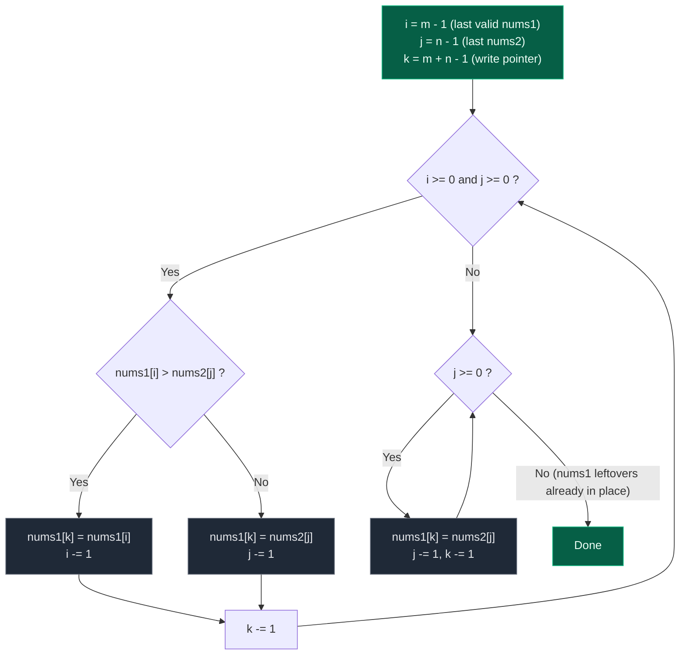

# 07. 88. Merge Sorted Array

| Difficulty | Pattern | Source | Time | Space |
|:---:|:---:|:---:|:---:|:---:|
| **Easy** | Two Pointers from the Back | [88. Merge Sorted Array](https://leetcode.com/problems/merge-sorted-array/) | `O(m + n)` | `O(1)` |

## 1. Problem Statement

You are given two integer arrays `nums1` and `nums2`, sorted in **non-decreasing order**, and two integers `m` and `n`, representing the number of elements in `nums1` and `nums2` respectively.

**Merge** `nums1` and `nums2` into a single array sorted in **non-decreasing order**.

The final sorted array should not be returned by the function, but instead be *stored inside the array* `nums1`. To accommodate this, `nums1` has a length of `m + n`, where the first `m` elements denote the elements that should be merged, and the last `n` elements are set to `0` and should be ignored. `nums2` has a length of `n`.

But `nums1` has extra empty space at the end.

```text
nums1.length = m + n
```

Where:

```text
First m elements of nums1 are actual valid elements.
Last n elements of nums1 are extra placeholders.
```

You need to merge `nums2` into `nums1` so that `nums1` becomes sorted.

Important:

```text
Do not return anything.
Modify nums1 in-place.
```

### Examples

```text
Input:  nums1 = [1,2,3,0,0,0], m = 3, nums2 = [2,5,6], n = 3
Output: [1,2,2,3,5,6]
Explanation: The arrays we are merging are [1,2,3] and [2,5,6].
The result of the merge is [1,2,2,3,5,6] with the underlined elements coming from nums1.
```

```text
Input:  nums1 = [1], m = 1, nums2 = [], n = 0
Output: [1]
Explanation: The arrays we are merging are [1] and [].
The result of the merge is [1].
```

```text
Input:  nums1 = [0], m = 0, nums2 = [1], n = 1
Output: [1]
Explanation: The arrays we are merging are [] and [1].
The result of the merge is [1].
Note that because m = 0, there are no elements in nums1. The 0 is only there to ensure the merge
result can fit in nums1.
```

Worked explanation of Example 1:

```text
Valid nums1 part = [1, 2, 3]
nums2            = [2, 5, 6]

Merged sorted array = [1, 2, 2, 3, 5, 6]
```

### Constraints

- `nums1.length == m + n`
- `nums2.length == n`
- `0 <= m, n <= 200`
- `1 <= m + n <= 200`
- `-10^9 <= nums1[i], nums2[j] <= 10^9`

**Follow up:** Can you come up with an algorithm that runs in `O(m + n)` time?

## 2. Core Theory

This is the **merge step of merge sort**, with one twist: the destination buffer *is* one of the sources. Merging `[1,2,3]` with `[2,5,6]` into a fresh array is trivial — walk both from the front and emit the smaller. The difficulty here is that the output must land inside `nums1`, and `nums1`'s first `m` slots still hold unread input.

**Why filling forward is unsafe.** If you write the merged result starting at index `0`, the very first write can clobber a value you have not compared yet. With `nums1 = [1,2,3,0,0,0]` and `nums2 = [2,5,6]`, if `nums2[0]` were smaller you would write it to index `0` and destroy the `1` that still needed comparing. To stay safe forward you would have to shift the whole valid part right, or copy it into a temporary array — which is exactly the `O(m + n)` extra space the "better" solution pays.

**Why filling backward is safe.** The largest of all `m + n` values must occupy index `m + n - 1`, and every slot from index `m` upward is a placeholder. So start the write pointer `k` at `m + n - 1` and fill descending. The invariant is `k >= i` at every step: `k` starts at `m + n - 1` and `i` starts at `m - 1`, a gap of `n`; each iteration decrements `k` by one and decrements `i` by at most one, so the gap never shrinks below zero. The write pointer is therefore always at or to the right of the unread `nums1` region — every write lands on a placeholder or on a cell whose value was already consumed.

**Why `while j >= 0` is the only cleanup loop you need.** When the main loop stops, one side is exhausted. If `nums1`'s valid part ran out first, the remaining `nums2` values are the smallest and must be copied into the front — hence the `j >= 0` loop. If `nums2` ran out first, the leftover `nums1` values are already sitting in positions `0..i`, which are exactly where they belong, because `k == i` at that moment. Copying them onto themselves would be a no-op, so the loop is omitted.



The three pointers walking backwards on Example 1:

```text
index:      0    1    2    3    4    5
nums1  = [  1,   2,   3,   0,   0,   0 ]
                 i              k          i=2 (val 3), k=5
nums2  = [  2,   5,   6 ]
                      j                    j=2 (val 6)

6 > 3 -> write 6:  [ 1, 2, 3, 0, 0, 6 ]   j=1, k=4
5 > 3 -> write 5:  [ 1, 2, 3, 0, 5, 6 ]   j=0, k=3
3 > 2 -> write 3:  [ 1, 2, 3, 3, 5, 6 ]   i=1, k=2
2 <= 2 -> write 2: [ 1, 2, 2, 3, 5, 6 ]   j=-1, k=1

j < 0 -> stop. nums1[0..1] = [1,2] already correct (k == i).
```

Notice `k >= i` held on every line — the write pointer never stepped on unread data.

## 3. Edge Cases

| Case | Input | Expected | Why it matters |
|:---|:---|:---:|:---|
| `nums2` is empty | `nums1=[1], m=1, nums2=[], n=0` | `[1]` | Main loop never runs because `j = -1`; must not crash |
| `nums1` has no valid elements | `nums1=[0], m=0, nums2=[1], n=1` | `[1]` | `i = -1`, so the cleanup `j` loop does all the work |
| All `nums2` smaller | `nums1=[4,5,6,0,0,0], m=3, nums2=[1,2,3], n=3` | `[1,2,3,4,5,6]` | Main loop moves 6,5,4 back, then `j` loop copies 3,2,1 to the front |
| All `nums2` larger | `nums1=[1,2,3,0,0,0], m=3, nums2=[4,5,6], n=3` | `[1,2,3,4,5,6]` | Main loop places 6,5,4; leftover `nums1` already in place |
| Equal values | `nums1=[2,0], m=1, nums2=[2], n=1` | `[2,2]` | Ties must not lose an element; either side may be chosen |
| All identical | `nums1=[1,1,0,0], m=2, nums2=[1,1], n=2` | `[1,1,1,1]` | Duplicates across both arrays |
| Negatives | `nums1=[-5,-1,0,0], m=2, nums2=[-3,2], n=2` | `[-5,-3,-1,2]` | Values range down to `-10^9`; no sentinel assumptions |
| Single element each | `nums1=[2,0], m=1, nums2=[1], n=1` | `[1,2]` | Smallest non-trivial merge |

## 4. Key Observation

This is the same as the **merge step** in merge sort.

If we have:

```text
[1, 2, 3]
[2, 5, 6]
```

The merged result is:

```text
[1, 2, 2, 3, 5, 6]
```

But the important twist is:

```text
The final answer must be stored inside nums1.
```

**Important Catch**

If we merge from the front, we may overwrite useful elements in `nums1`.

Example:

```text
nums1 = [1, 2, 3, 0, 0, 0]
nums2 = [2, 5, 6]
```

If we start writing at index 0, we may destroy 1, 2, or 3 before comparing them.

So the smart trick is:

```text
Merge from the back.
```

Why?

Because the back of `nums1` already has empty space.

## 5. Brute Force Solution: Copy and Sort

### Intuition

Put all elements of `nums2` into the empty part of `nums1`.

Then sort `nums1`.

### Approach

1. Copy all elements of `nums2` into `nums1` starting from index `m`.
2. Sort `nums1`.

### Dry Run

```text
nums1 = [1, 2, 3, 0, 0, 0]
m = 3

nums2 = [2, 5, 6]
n = 3
```

Copy `nums2`:

```text
nums1 = [1, 2, 3, 2, 5, 6]
```

Sort:

```text
nums1 = [1, 2, 3, 5, 6]
```

(After sorting the six values, `nums1 = [1, 2, 2, 3, 5, 6]`.)

### Code

```python
# Define the class solution
class Solution:

    # Define the method
    def merge(self, nums1: List[int], m: int, nums2: List[int], n: int) -> None:
        """
        Do not return anything, modify nums1 in-place instead.
        """

        # Start writing nums2 values at index m in nums1
        write_index = m

        # Traverse every element in nums2
        for num in nums2:

            # Copy current nums2 element into nums1
            nums1[write_index] = num

            # Move write index forward
            write_index += 1

        # Sort nums1 in-place
        nums1.sort()
```

### Complexity

| Measure | Complexity | Why |
|:---|:---:|:---|
| **Time** | `O((m + n) log(m + n))` | Because sorting takes `O((m+n) log(m+n))`. |
| **Space** | `O(1)` or `O(m+n)` | Depending on sorting implementation. |

This is accepted but not the best interview answer.

## 6. Better Solution: Extra Array Merge

### Intuition

Use two pointers from the front.

One pointer reads valid elements of `nums1`.

One pointer reads `nums2`.

Whichever value is smaller is added to a temporary array.

Finally copy the temporary array back to `nums1`.

### Approach

Use:

```text
i = 0  for nums1 valid part
j = 0  for nums2
```

Compare:

```text
nums1[i] and nums2[j]
```

Add the smaller one into `merged`.

### Dry Run

```text
nums1 valid part = [1, 2, 3]
nums2            = [2, 5, 6]
```

Initial:

```text
i = 0
j = 0
merged = []
```

| `nums1[i]` | `nums2[j]` | Pick | `merged` |
|:---:|:---:|:---|:---|
| 1 | 2 | 1 | `[1]` |
| 2 | 2 | 2 from nums1 | `[1, 2]` |
| 3 | 2 | 2 from nums2 | `[1, 2, 2]` |
| 3 | 5 | 3 | `[1, 2, 2, 3]` |

Now valid `nums1` part is finished.

Add remaining `nums2`:

```text
[5, 6]
```

Final:

```text
merged = [1, 2, 2, 3, 5, 6]
```

Copy back into `nums1`.

### Code

```python
# Define the class solution
class Solution:

    # Define the method
    def merge(self, nums1: List[int], m: int, nums2: List[int], n: int) -> None:
        """
        Do not return anything, modify nums1 in-place instead.
        """

        # Pointer for valid part of nums1
        i = 0

        # Pointer for nums2
        j = 0

        # Temporary array to store merged result
        merged = []

        # Continue while both arrays have elements left
        while i < m and j < n:

            # If nums1 value is smaller or equal
            if nums1[i] <= nums2[j]:

                # Add nums1 value to merged array
                merged.append(nums1[i])

                # Move nums1 pointer forward
                i += 1

            # If nums2 value is smaller
            else:

                # Add nums2 value to merged array
                merged.append(nums2[j])

                # Move nums2 pointer forward
                j += 1

        # Add remaining nums1 valid elements
        while i < m:

            # Add current nums1 element
            merged.append(nums1[i])

            # Move nums1 pointer forward
            i += 1

        # Add remaining nums2 elements
        while j < n:

            # Add current nums2 element
            merged.append(nums2[j])

            # Move nums2 pointer forward
            j += 1

        # Copy merged array back into nums1
        for index in range(m + n):

            # Update nums1 in-place
            nums1[index] = merged[index]
```

### Complexity

| Measure | Complexity | Why |
|:---|:---:|:---|
| **Time** | `O(m + n)` | Because each element is processed once. |
| **Space** | `O(m + n)` | Because we use a temporary array. |

This is good, but not optimal because the problem gives extra space inside `nums1`.

## 7. Most Optimal Solution: Merge From Back

### Intuition

Both arrays are sorted.

The largest element among both arrays should go to the last position of `nums1`.

Since `nums1` has empty space at the end, we can safely fill from the back.

Use three pointers:

```text
i = m - 1
```

Points to the last valid element in `nums1`.

```text
j = n - 1
```

Points to the last element in `nums2`.

```text
k = m + n - 1
```

Points to the last position in `nums1`.

At every step:

```text
Compare nums1[i] and nums2[j]
Put the larger one at nums1[k]
Move that pointer backward
Move k backward
```

### Approach

**Why Backward Merge Avoids Overwriting**

Example:

```text
nums1 = [1, 2, 3, 0, 0, 0]
nums2 = [2, 5, 6]
```

The empty space is:

```text
indices 3, 4, 5
```

The largest values should go there.

So we place:

```text
6 at index 5
5 at index 4
3 at index 3
```

This does not destroy unprocessed values in the valid part of `nums1`.

**Why We Only Copy Remaining nums2**

After the main loop, two cases are possible.

*Case 1: nums2 still has elements*

Example:

```text
nums1 = [4, 5, 6, 0, 0, 0]
nums2 = [1, 2, 3]
```

The smaller `nums2` values must be placed at the front.

So we copy remaining `nums2`.

*Case 2: nums1 still has elements*

Example:

```text
nums1 = [1, 2, 3, 0, 0, 0]
nums2 = [4, 5, 6]
```

After placing 6, 5, 4, the original 1, 2, 3 are already in correct positions.

So no need to copy remaining `nums1`.

That is why final loop is only:

```text
while j >= 0:
    nums1[k] = nums2[j]
```

### Dry Run

```text
nums1 = [1, 2, 3, 0, 0, 0]
m = 3

nums2 = [2, 5, 6]
n = 3
```

Initial:

```text
i = 2    nums1[i] = 3
j = 2    nums2[j] = 6
k = 5
```

#### Step 1

Compare:

```text
nums1[i] = 3
nums2[j] = 6
```

6 is larger.

Put 6 at index `k = 5`.

```text
nums1 = [1, 2, 3, 0, 0, 6]
```

Move:

```text
j = 1
k = 4
```

#### Step 2

Compare:

```text
nums1[i] = 3
nums2[j] = 5
```

5 is larger.

```text
nums1 = [1, 2, 3, 0, 5, 6]
```

Move:

```text
j = 0
k = 3
```

#### Step 3

Compare:

```text
nums1[i] = 3
nums2[j] = 2
```

3 is larger.

```text
nums1 = [1, 2, 3, 3, 5, 6]
```

Move:

```text
i = 1
k = 2
```

#### Step 4

Compare:

```text
nums1[i] = 2
nums2[j] = 2
```

Both are equal.

We can choose either.

Let us choose `nums2[j]`.

```text
nums1 = [1, 2, 2, 3, 5, 6]
```

Move:

```text
j = -1
k = 1
```

Now `nums2` is finished.

Final:

```text
nums1 = [1, 2, 2, 3, 5, 6]
```

### Code

```python
# Define the class solution
class Solution:

    # Define the method
    def merge(self, nums1: List[int], m: int, nums2: List[int], n: int) -> None:
        """
        Do not return anything, modify nums1 in-place instead.
        """

        # Pointer to the last valid element in nums1
        i = m - 1

        # Pointer to the last element in nums2
        j = n - 1

        # Pointer to the last position in nums1
        k = m + n - 1

        # Continue while both nums1 valid part and nums2 have elements
        while i >= 0 and j >= 0:

            # If nums1 current element is greater than nums2 current element
            if nums1[i] > nums2[j]:

                # Place nums1 current element at the final position k
                nums1[k] = nums1[i]

                # Move nums1 pointer backward
                i -= 1

            # Otherwise nums2 current element is greater or equal
            else:

                # Place nums2 current element at final position k
                nums1[k] = nums2[j]

                # Move nums2 pointer backward
                j -= 1

            # Move final write pointer backward
            k -= 1

        # If nums2 still has elements, copy them into nums1
        while j >= 0:

            # Place remaining nums2 element at current position k
            nums1[k] = nums2[j]

            # Move nums2 pointer backward
            j -= 1

            # Move write pointer backward
            k -= 1
```

### Complexity

| Measure | Complexity | Why |
|:---|:---:|:---|
| **Time** | `O(m + n)` | Because each element is processed at most once. |
| **Space** | `O(1)` | Because we do the merge inside `nums1`. |

## 8. Author's Edge Cases

**Case 1: nums2 is empty**

```text
nums1 = [1]
m = 1

nums2 = []
n = 0

Output:
[1]
```

The main loop does not run because `j = -1`.

Correct.

**Case 2: nums1 has no valid elements**

```text
nums1 = [0]
m = 0

nums2 = [1]
n = 1

Output:
[1]
```

Here:

```text
i = -1
j = 0
k = 0
```

Main loop does not run.

Remaining `nums2` loop copies 1.

Correct.

**Case 3: All nums2 elements are smaller**

```text
nums1 = [4, 5, 6, 0, 0, 0]
m = 3

nums2 = [1, 2, 3]
n = 3

Output:
[1, 2, 3, 4, 5, 6]
```

Main loop moves 6, 5, 4 to the back.

Then remaining `nums2` loop copies 3, 2, 1 to the front.

**Case 4: All nums2 elements are larger**

```text
nums1 = [1, 2, 3, 0, 0, 0]
m = 3

nums2 = [4, 5, 6]
n = 3

Output:
[1, 2, 3, 4, 5, 6]
```

Main loop directly places 6, 5, 4.

Remaining `nums1` values are already correct.

## 9. Common Mistakes

| Mistake | Why it breaks | Fix |
|:---|:---|:---|
| Merging from the front in place | Writing at index `0` clobbers `nums1` values that have not been compared yet | Fill from index `m + n - 1` backwards |
| Starting `i` at `len(nums1) - 1` | That points into the placeholder zeros, which must be ignored | `i = m - 1`, the last **valid** element |
| Looping `while i >= 0` only, dropping the `j` cleanup | Leftover smaller `nums2` values never reach the front (`[4,5,6]` + `[1,2,3]` fails) | Add `while j >= 0: nums1[k] = nums2[j]` |
| Adding a `while i >= 0` cleanup too | Harmless but pointless — those values already sit at `0..i` since `k == i` | Omit it; only `nums2` leftovers need copying |
| Returning the merged list | The judge inspects `nums1`; a rebound local name changes nothing for the caller | Mutate `nums1` element by element, return `None` |
| `nums1 = merged` instead of `nums1[:] = merged` | Rebinds the local name, leaving the caller's list untouched | Assign into the slice, or write index by index |
| Using `>=` vs `>` in the comparison | Both are correct here (ties may go either way), but flipping which branch decrements is not | Whichever value you write, decrement *that* array's pointer |

## 10. Interview Follow-ups

**Q: Why merge from the back instead of the front?**

A: The free space is at the back. Writing backwards keeps the invariant `k >= i`, so the write pointer is always at or right of the unread `nums1` region and can never overwrite a value still needed. Forward merging would need a shift or a temp array.

**Q: Why is there no `while i >= 0` cleanup loop?**

A: If `nums2` empties first, then `k == i` at that moment, so the remaining `nums1[0..i]` values are already in their final positions. Copying them would just write each value onto itself.

**Q: Can it be done in `O(1)` space merging forward?**

A: Yes, with the gap method (a Shell-sort-style shrinking gap across the concatenated arrays), but it costs `O((m+n) log(m+n))` time. The backward two-pointer merge is strictly better here precisely because the buffer already exists.

**Q: What if `nums1` had no extra space and you had to return a new array?**

A: Then it is the plain merge-sort merge: two forward pointers into a fresh array of size `m + n`, `O(m + n)` time and `O(m + n)` space — the "better" solution above.

**Q: How would you merge `k` sorted arrays instead of two?**

A: Use a min-heap of size `k` holding the current head of each array, popping the smallest and pushing its successor. That is `O(N log k)` for `N` total elements — LeetCode 23 in list form.

**Q: Is the merge stable?**

A: As written, ties take `nums2`'s element first when scanning backwards, which means `nums1`'s equal element ends up earlier in the final array — so it is stable with `nums1` treated as the first sequence. Flipping `>` to `>=` would reverse that.

## 11. Interview Explanation

> Since both arrays are sorted and `nums1` has extra space at the end, I merge from the back. I use three pointers: `i` for the last valid element of `nums1`, `j` for the last element of `nums2`, and `k` for the last position of `nums1`. At each step, I place the larger of `nums1[i]` and `nums2[j]` at `nums1[k]`. This avoids overwriting useful values in `nums1`. If any elements remain in `nums2`, I copy them. Remaining `nums1` elements are already in place.

## 12. Verify

```python
from typing import List
import random


def merge(nums1: List[int], m: int, nums2: List[int], n: int) -> None:
    """Do not return anything, modify nums1 in-place instead."""
    # Pointer to the last valid element in nums1
    i = m - 1
    # Pointer to the last element in nums2
    j = n - 1
    # Pointer to the last slot of the merged array
    k = m + n - 1
    # Merge from the back while both arrays still have elements
    while i >= 0 and j >= 0:
        if nums1[i] > nums2[j]:
            # nums1's element is larger, place it at the end
            nums1[k] = nums1[i]
            i -= 1
        else:
            # nums2's element is larger or equal, place it at the end
            nums1[k] = nums2[j]
            j -= 1
        # Move the write pointer left
        k -= 1
    # Copy any remaining nums2 elements (nums1's leftovers are already in place)
    while j >= 0:
        nums1[k] = nums2[j]
        j -= 1
        k -= 1


# LeetCode example 1
a = [1, 2, 3, 0, 0, 0]
merge(a, 3, [2, 5, 6], 3)
assert a == [1, 2, 2, 3, 5, 6]

# LeetCode example 2: nums2 is empty
a = [1]
merge(a, 1, [], 0)
assert a == [1]

# LeetCode example 3: nums1 has no valid elements
a = [0]
merge(a, 0, [1], 1)
assert a == [1]

# All nums2 elements are smaller
a = [4, 5, 6, 0, 0, 0]
merge(a, 3, [1, 2, 3], 3)
assert a == [1, 2, 3, 4, 5, 6]

# All nums2 elements are larger
a = [1, 2, 3, 0, 0, 0]
merge(a, 3, [4, 5, 6], 3)
assert a == [1, 2, 3, 4, 5, 6]

# Equal values across both arrays
a = [2, 0]
merge(a, 1, [2], 1)
assert a == [2, 2]

# All identical
a = [1, 1, 0, 0]
merge(a, 2, [1, 1], 2)
assert a == [1, 1, 1, 1]

# Negatives
a = [-5, -1, 0, 0]
merge(a, 2, [-3, 2], 2)
assert a == [-5, -3, -1, 2]

# Single element each
a = [2, 0]
merge(a, 1, [1], 1)
assert a == [1, 2]

# nums2 must never be mutated
b = [3, 4]
a = [1, 2, 0, 0]
merge(a, 2, b, 2)
assert b == [3, 4] and a == [1, 2, 3, 4]

# Randomized cross-check against sorted(concatenation)
random.seed(88)
for _ in range(500):
    # Random size of the valid part of nums1
    m = random.randint(0, 8)
    # Random size of nums2
    n = random.randint(0, 8)
    # Skip the degenerate case of both arrays being empty
    if m + n == 0:
        continue
    # Random sorted left array
    left = sorted(random.randint(-20, 20) for _ in range(m))
    # Random sorted right array
    right = sorted(random.randint(-20, 20) for _ in range(n))
    # Build nums1 with trailing zero padding for the merge
    nums1 = left + [0] * n
    # Merge nums2 into nums1 in place
    merge(nums1, m, list(right), n)
    # Result must equal the fully sorted concatenation
    assert nums1 == sorted(left + right), (left, right, nums1)

print("All tests passed")
```
