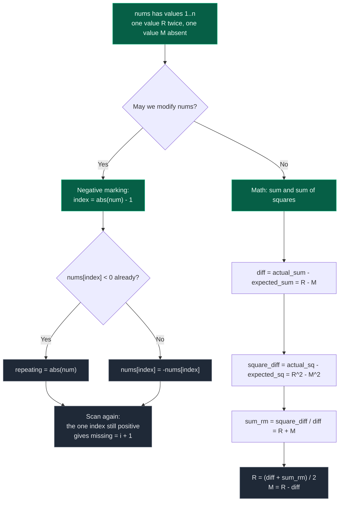

# 08. Missing And Repeating

| Difficulty | Pattern | Source | Time | Space |
|:---:|:---:|:---:|:---:|:---:|
| **Easy** | Math / Index Marking | [Missing And Repeating](https://www.geeksforgeeks.org/problems/find-missing-and-repeating2512/1) | `O(n)` | `O(1)` |

## 1. Problem Statement

Given an unsorted array `arr[]` of size `n`, containing elements from the range `1` to `n`, it is known that one number in this range is **missing**, and another number **occurs twice** in the array, find both the **duplicate** number and the **missing** number.

You are given an array `nums` of size `n`.

The array should contain numbers from:

```text
1 to n
```

But one number is **missing**, and one number is **repeating**.

You need to find:

```text
[repeating_number, missing_number]
```

### Examples

```text
Input:  arr[] = [2, 2]
Output: [2, 1]
Explanation: Repeating number is 2 and the missing number is 1.
```

```text
Input:  arr[] = [1, 3, 3]
Output: [3, 2]
Explanation: Repeating number is 3 and the missing number is 2.
```

```text
Input:  arr[] = [4, 3, 6, 2, 1, 1]
Output: [1, 5]
Explanation: Repeating number is 1 and the missing number is 5.
```

Worked example:

```text
Input:
nums = [3, 1, 2, 5, 3]

Output:
[3, 4]
```

Explanation:

```text
Numbers should be: [1, 2, 3, 4, 5]

Array has:
1 present
2 present
3 present twice
4 missing
5 present

Repeating = 3
Missing   = 4
```

### Constraints

- `2 <= n <= 10^6`
- `1 <= arr[i] <= n`

## 2. Core Theory

The array is a **perturbed permutation**: it should be `1..n` in some order, but exactly one value `R` has been duplicated over exactly one value `M`. That single structural fact — the multiset is `{1..n}` with `M` swapped out for a second copy of `R` — is what every solution below exploits, and it says the answer is uniquely determined by any two independent aggregate statistics of the multiset.

**The two-equation derivation.** Take the plain sum. Every value from `1..n` contributes once, except `M` contributes zero times and `R` contributes twice. So `actual_sum - expected_sum = R - M`; call it `diff`. One equation, two unknowns — not enough. Now take the sum of squares: by the identical argument, `actual_square_sum - expected_square_sum = R^2 - M^2`. Factor it: `R^2 - M^2 = (R - M)(R + M) = diff * (R + M)`. Dividing recovers `R + M = square_diff / diff`, which is a genuinely *new* linear equation because squaring is not linear. With `R - M = diff` and `R + M = sum_rm` in hand, adding gives `2R = diff + sum_rm`, and `M = R - diff`. The division is always exact and never by zero, since `R != M` guarantees `diff != 0`.

```text
Equation 1 (sum):         R - M = actual_sum        - expected_sum        = diff
Equation 2 (squares):     R^2 - M^2 = actual_sq_sum - expected_sq_sum     = square_diff
Factor:                   R^2 - M^2 = (R - M)(R + M) = diff * (R + M)
Divide:                   R + M = square_diff / diff = sum_rm

Add the two linear equations:
    (R - M) + (R + M) = diff + sum_rm
                  2R  = diff + sum_rm
                   R  = (diff + sum_rm) / 2
                   M  = R - diff
```

**The index-marking view.** Because every value lies in `1..n`, value `x` owns slot `x - 1`. Walk the array and flip the sign of the owned slot. A slot that is asked to flip twice identifies the repeating value; the one slot never flipped identifies the missing one. This is `O(n)` time and `O(1)` space with no arithmetic at all — but it writes into the input.



**Choosing between them.** The math route never touches the input but needs 64-bit accumulators in Java or C++, since `sum of squares` reaches roughly `n^3 / 3` — for `n = 10^6` that is about `3.3 * 10^17`, well past 32-bit range. Negative marking has no overflow risk at all but destroys the array (it is restorable by taking absolute values). XOR splits the two unknowns by their differing bits and needs neither, at the cost of a longer explanation.

## 3. Edge Cases

| Case | Input | Expected | Why it matters |
|:---|:---|:---:|:---|
| Minimum size | `[2, 2]` | `[2, 1]` | `n = 2`, the smallest legal array |
| Missing is `1` | `[2, 2]` | `[2, 1]` | Missing at the very first index |
| Missing is `n` | `[1, 2, 2]` | `[2, 3]` | Sorting solutions must not stop early and report `-1` |
| Repeating is `1` | `[4, 3, 6, 2, 1, 1]` | `[1, 5]` | Repeating at the low end |
| Repeating is `n` | `[1, 3, 3]` | `[3, 2]` | Repeating at the high end |
| Already nearly sorted | `[1, 2, 2, 4, 5]` | `[2, 3]` | Duplicate and missing are adjacent values |
| Repeating below missing | `[3, 1, 2, 5, 3]` | `[3, 4]` | `diff` is negative (`R - M = -1`); division sign must work out |
| Repeating above missing | `[1, 2, 4, 4, 5]` | `[4, 3]` | `diff` is positive; mirror of the previous case |
| Large `n` | `n = 10^6` | exact pair | Sum of squares near `3.3 * 10^17` — 64-bit territory outside Python |

## 4. Key Observation

For an array of size `n`, ideal numbers are:

```text
1, 2, 3, ..., n
```

But in the given array:

```text
One number appears twice
One number does not appear
```

So the array length is still `n`, but one value has replaced another value.

## 5. Brute Force Solution

### Intuition

For every number from 1 to `n`, count how many times it appears in the array.

If count is:

```text
0 -> missing number
2 -> repeating number
```

### Approach

1. For each number `x` from 1 to `n`.
2. Count how many times `x` appears in `nums`.
3. If count is 0, store it as missing.
4. If count is 2, store it as repeating.

### Dry Run

```text
nums = [3, 1, 2, 5, 3]
n = 5
```

Check every number:

| Number | Count | Meaning |
|:---:|:---:|:---|
| 1 | 1 | normal |
| 2 | 1 | normal |
| 3 | 2 | repeating |
| 4 | 0 | missing |
| 5 | 1 | normal |

Answer:

```text
[3, 4]
```

### Code

```python
# Define the class solution
class Solution:

    # Define the method
    def findTwoElement(self, nums):

        # Store the size of the array
        n = len(nums)

        # Store repeating number
        repeating = -1

        # Store missing number
        missing = -1

        # Check every number from 1 to n
        for number in range(1, n + 1):

            # Count frequency of current number
            count = 0

            # Traverse array to count current number
            for num in nums:

                # If current array value equals number
                if num == number:

                    # Increase count
                    count += 1

            # If count is 0, this number is missing
            if count == 0:

                # Store missing number
                missing = number

            # If count is 2, this number is repeating
            elif count == 2:

                # Store repeating number
                repeating = number

        # Return repeating first, then missing
        return [repeating, missing]
```

### Complexity

| Measure | Complexity | Why |
|:---|:---:|:---|
| **Time** | `O(n^2)` | Because for every number from 1 to `n`, we scan the whole array. |
| **Space** | `O(1)` | Because only two scalars are stored. |

## 6. Better Solution: Frequency Array

### Intuition

Instead of counting again and again, create a frequency array.

For every number in `nums`, increase its count.

Then scan frequency array:

```text
frequency[i] == 0 -> i is missing
frequency[i] == 2 -> i is repeating
```

### Approach

1. Create a frequency array of size `n + 1`.
2. For every number in `nums`, increment `frequency[num]`.
3. Scan `1..n`: a zero entry is the missing number, a two entry is the repeating number.

### Dry Run

```text
nums = [3, 1, 2, 5, 3]
```

Create frequency array of size `n + 1`:

```text
freq = [0, 0, 0, 0, 0, 0]
```

After counting:

```text
freq[1] = 1
freq[2] = 1
freq[3] = 2
freq[4] = 0
freq[5] = 1
```

So:

```text
Repeating = 3
Missing = 4
```

### Code

```python
# Define the class solution
class Solution:

    # Define the method
    def findTwoElement(self, nums):

        # Store the size of the array
        n = len(nums)

        # Create frequency array from 0 to n
        frequency = [0] * (n + 1)

        # Count frequency of each number
        for num in nums:

            # Increase count of current number
            frequency[num] += 1

        # Store repeating number
        repeating = -1

        # Store missing number
        missing = -1

        # Check numbers from 1 to n
        for number in range(1, n + 1):

            # If frequency is 0, number is missing
            if frequency[number] == 0:

                # Store missing number
                missing = number

            # If frequency is 2, number is repeating
            elif frequency[number] == 2:

                # Store repeating number
                repeating = number

        # Return repeating first and missing second
        return [repeating, missing]
```

### Complexity

| Measure | Complexity | Why |
|:---|:---:|:---|
| **Time** | `O(n)` | Because we do two linear passes. |
| **Space** | `O(n)` | Because of the frequency array. |

This is simple and safe, but not most optimal in space.

## 7. Better Solution: Sorting

### Intuition

If we sort the array, duplicate values become adjacent.

Then:

```text
If nums[i] == nums[i - 1], nums[i] is repeating.
```

To find missing, compare sorted values with expected numbers.

But duplicates make missing detection slightly tricky.

### Approach

1. Sort the array.
2. Find adjacent duplicate as repeating.
3. Find missing by checking which number from 1 to `n` is not present.

A clean way after sorting is to use expected number pointer.

### Dry Run

```text
nums = [3, 1, 2, 5, 3]
```

Sorted:

```text
[1, 2, 3, 3, 5]
```

Adjacent duplicate:

```text
3 and 3
```

So:

```text
Repeating = 3
```

Expected numbers:

```text
1, 2, 3, 4, 5
```

At sorted index where value jumps from 3 to 5, number 4 is missing.

So:

```text
Missing = 4
```

### Code

```python
# Define the class solution
class Solution:

    # Define the method
    def findTwoElement(self, nums):

        # Sort the array
        nums.sort()

        # Store size of array
        n = len(nums)

        # Store repeating number
        repeating = -1

        # Store missing number
        missing = -1

        # Find repeating number by checking adjacent equal values
        for i in range(1, n):
            # If current value equals previous value
            if nums[i] == nums[i - 1]:
                # This value is repeating
                repeating = nums[i]

        # Expected number starts from 1
        expected = 1

        # Traverse sorted array
        for num in nums:

            # If current number is equal to expected
            if num == expected:

                # Move to next expected number
                expected += 1

            # If current number is smaller than expected, it is duplicate, skip it
            elif num < expected:

                # Continue without changing expected
                continue

            # If current number is greater than expected
            else:

                # Expected number is missing
                missing = expected

                # Stop because only one number is missing
                break

        # If missing was not found inside loop, then n is missing
        if missing == -1:

            # Last expected value is missing
            missing = expected

        # Return repeating and missing
        return [repeating, missing]
```

### Complexity

| Measure | Complexity | Why |
|:---|:---:|:---|
| **Time** | `O(n log n)` | Because of the sort. |
| **Space** | `O(1)` or `O(n)` | Depending on sorting implementation. |

Sorting is good but not optimal in time.

## 8. Most Optimal Mathematical Solution: Sum and Square Sum

### Intuition

Let:

```text
R = repeating number
M = missing number
```

The array has `R` instead of `M`.

So actual array sum differs from expected sum.

**Equation 1: Sum Difference**

Expected sum:

```text
1 + 2 + 3 + ... + n
```

Actual sum:

```text
sum(nums)
```

Difference:

```text
actual_sum - expected_sum = R - M
```

Let:

```text
diff = R - M
```

**Equation 2: Square Sum Difference**

Expected square sum:

```text
1^2 + 2^2 + 3^2 + ... + n^2
```

Actual square sum:

```text
sum(num^2 for num in nums)
```

Difference:

```text
actual_square_sum - expected_square_sum = R^2 - M^2
```

Using identity:

```text
R^2 - M^2 = (R - M)(R + M)
```

So:

```text
square_diff = diff * (R + M)
```

Therefore:

```text
R + M = square_diff / diff
```

Now we have:

```text
R - M = diff
R + M = sum_rm
```

Add both equations:

```text
2R = diff + sum_rm
R = (diff + sum_rm) / 2
```

Then:

```text
M = R - diff
```

### Approach

1. Compute `expected_sum = n * (n + 1) // 2` and `expected_square_sum = n * (n + 1) * (2 * n + 1) // 6`.
2. Compute `actual_sum` and `actual_square_sum` in one pass.
3. `diff = actual_sum - expected_sum` gives `R - M`.
4. `square_diff = actual_square_sum - expected_square_sum` gives `R^2 - M^2`.
5. `sum_rm = square_diff // diff` gives `R + M`.
6. `repeating = (diff + sum_rm) // 2` and `missing = repeating - diff`.

### Dry Run

Mathematical Dry Run:

```text
nums = [3, 1, 2, 5, 3]
n = 5
```

Expected sum:

```text
1 + 2 + 3 + 4 + 5 = 15
```

Actual sum:

```text
3 + 1 + 2 + 5 + 3 = 14
```

So:

```text
diff = actual_sum - expected_sum
diff = 14 - 15 = -1
```

Meaning:

```text
R - M = -1
```

Now square sums.

Expected square sum:

```text
1^2 + 2^2 + 3^2 + 4^2 + 5^2
= 1 + 4 + 9 + 16 + 25
= 55
```

Actual square sum:

```text
3^2 + 1^2 + 2^2 + 5^2 + 3^2
= 9 + 1 + 4 + 25 + 9
= 48
```

So:

```text
square_diff = 48 - 55 = -7
```

Now:

```text
R + M = square_diff / diff
R + M = -7 / -1 = 7
```

We have:

```text
R - M = -1
R + M = 7
```

Add both:

```text
2R = 6
R = 3
```

Then:

```text
M = R - diff
M = 3 - (-1)
M = 4
```

Answer:

```text
[3, 4]
```

### Code

```python
class Solution:

    # Define the method
    def findTwoElement(self, nums):

        # Store size of array
        n = len(nums)

        # Expected sum of numbers from 1 to n
        expected_sum = n * (n + 1) // 2

        # Expected square sum of numbers from 1 to n
        expected_square_sum = n * (n + 1) * (2 * n + 1) // 6

        # Actual sum of given array
        actual_sum = 0

        # Actual square sum of given array
        actual_square_sum = 0

        # Traverse every number
        for num in nums:

            # Add number to actual sum
            actual_sum += num

            # Add square of number to actual square sum
            actual_square_sum += num * num

        # diff = repeating - missing
        diff = actual_sum - expected_sum

        # square_diff = repeating^2 - missing^2
        square_diff = actual_square_sum - expected_square_sum

        # sum_rm = repeating + missing
        sum_rm = square_diff // diff

        # repeating = (diff + sum_rm) / 2
        repeating = (diff + sum_rm) // 2

        # missing = repeating - diff
        missing = repeating - diff

        # Return repeating first, then missing
        return [repeating, missing]
```

### Complexity

| Measure | Complexity | Why |
|:---|:---:|:---|
| **Time** | `O(n)` | Because one pass computes both sums. |
| **Space** | `O(1)` | Because only a few scalars are stored. |

Important note:

```text
In Python, this is safe because integers do not overflow.
In Java/C++, use long long because square sums can overflow int.
```

## 9. Most Optimal In-Place Solution: Negative Marking

### Intuition

Because numbers are from 1 to `n`, each number can be mapped to an index:

```text
number x maps to index x - 1
```

We can mark visited numbers by making the value at that mapped index negative.

If we try to mark an index that is already negative, then the number is repeating.

After marking, the index whose value is still positive represents the missing number.

### Approach

1. For each `num` in `nums`, compute `index = abs(num) - 1`.
2. If `nums[index] < 0`, that number was already seen, so `repeating = abs(num)`.
3. Otherwise flip it: `nums[index] = -nums[index]`.
4. Scan again; the first index whose value is still positive gives `missing = i + 1`.

### Dry Run

```text
nums = [3, 1, 2, 5, 3]
```

Initial:

```text
[3, 1, 2, 5, 3]
```

#### num = 3

Index:

```text
abs(3) - 1 = 2
```

Mark index 2 negative:

```text
[3, 1, -2, 5, 3]
```

#### num = 1

Index:

```text
abs(1) - 1 = 0
```

Mark index 0 negative:

```text
[-3, 1, -2, 5, 3]
```

#### num = 2

Index:

```text
abs(2) - 1 = 1
```

Mark index 1 negative:

```text
[-3, -1, -2, 5, 3]
```

#### num = 5

Index:

```text
abs(5) - 1 = 4
```

Mark index 4 negative:

```text
[-3, -1, -2, 5, -3]
```

#### num = 3 again

Index:

```text
abs(3) - 1 = 2
```

But:

```text
nums[2] is already negative
```

So:

```text
Repeating = 3
```

Now array:

```text
[-3, -1, -2, 5, -3]
```

Positive value remains at index 3.

That means:

```text
Missing = index + 1 = 4
```

Answer:

```text
[3, 4]
```

### Code

```python
# Define the class solution
class Solution:

    # Define the method
    def findTwoElement(self, nums):

        # Store repeating number
        repeating = -1

        # Store missing number
        missing = -1

        # Traverse every number in array
        for num in nums:

            # Convert number to its mapped index
            index = abs(num) - 1

            # If value at mapped index is already negative
            if nums[index] < 0:

                # Current number was seen before, so it is repeating
                repeating = abs(num)

            # Otherwise mark this number as seen
            else:

                # Make mapped index value negative
                nums[index] = -nums[index]

        # After marking, positive index represents missing number
        for i in range(len(nums)):

            # If value is still positive
            if nums[i] > 0:

                # Missing number is i + 1
                missing = i + 1

                # Stop after finding missing number
                break

        # Return repeating and missing
        return [repeating, missing]
```

### Complexity

| Measure | Complexity | Why |
|:---|:---:|:---|
| **Time** | `O(n)` | Because of two linear passes. |
| **Space** | `O(1)` | Because marking happens inside the input array. |

But note:

```text
This modifies the input array.
```

If input should not be modified, use math or frequency array.

## 10. XOR Solution

This is also `O(n)` time and `O(1)` space, but the logic is more complex.

### Intuition

XOR all numbers from array and numbers from 1 to `n`.

Since common numbers cancel, we get:

```text
xor_value = repeating ^ missing
```

Then we separate repeating and missing using the rightmost set bit.

Finally, we verify which one is repeating.

### Approach

Every value in `1..n` appears the same number of times on both sides of the XOR except `R` (once extra from the array) and `M` (once extra from the ideal range). So everything cancels down to `R ^ M`. Since `R != M`, that result is non-zero, and any set bit in it is a position where `R` and `M` differ. Pick the rightmost such bit and use it to partition **both** the array values and the ideal range `1..n` into two buckets: `R` lands in one bucket, `M` in the other, and every other value contributes an even number of times to whichever bucket it falls in. XOR-ing each bucket therefore isolates `R` in one and `M` in the other — you just do not yet know which is which, so one final count pass decides.

### Dry Run

```text
nums = [3, 1, 2, 5, 3]
n = 5

xor_value = (3^1^2^5^3) ^ (1^2^3^4^5)
          = 3 ^ 4
          = 7        (binary 111)

rightmost_set_bit = 7 & -7 = 1

bucket by "value & 1":
  bit set   (odd values):  array 3,1,5,3   ideal 1,3,5   -> group1 = 3
  bit unset (even values): array 2         ideal 2,4     -> group2 = 4

candidate1 = 3, candidate2 = 4
count of 3 in nums = 2 -> candidate1 is repeating

Answer: [3, 4]
```

### Code

```python
# Define the class solution
class Solution:

    # Define the method
    def findTwoElement(self, nums):

        # Store size of array
        n = len(nums)

        # XOR of all nums and all numbers from 1 to n
        xor_value = 0

        # XOR all array values
        for num in nums:

            # Add current number to xor_value
            xor_value ^= num

        # XOR all numbers from 1 to n
        for number in range(1, n + 1):

            # Add expected number to xor_value
            xor_value ^= number

        # Get rightmost set bit to separate two groups
        rightmost_set_bit = xor_value & -xor_value

        # First group XOR
        group1 = 0

        # Second group XOR
        group2 = 0

        # Separate array values into two groups
        for num in nums:

            # If this bit is set
            if num & rightmost_set_bit:

                # XOR into group1
                group1 ^= num

            # If this bit is not set
            else:

                # XOR into group2
                group2 ^= num

        # Separate expected values into two groups
        for number in range(1, n + 1):

            # If this bit is set
            if number & rightmost_set_bit:

                # XOR into group1
                group1 ^= number

            # If this bit is not set
            else:

                # XOR into group2
                group2 ^= number

        # Now group1 and group2 are repeating and missing, but order unknown
        candidate1 = group1
        candidate2 = group2

        # Count candidate1 in nums
        count_candidate1 = 0

        # Traverse nums to verify repeating number
        for num in nums:

            # If num equals candidate1
            if num == candidate1:

                # Increase count
                count_candidate1 += 1

        # If candidate1 appears twice, it is repeating
        if count_candidate1 == 2:

            # candidate1 is repeating and candidate2 is missing
            return [candidate1, candidate2]

        # Otherwise candidate2 is repeating and candidate1 is missing
        return [candidate2, candidate1]
```

### Complexity

| Measure | Complexity | Why |
|:---|:---:|:---|
| **Time** | `O(n)` | Because of a constant number of linear passes. |
| **Space** | `O(1)` | Because only scalars are stored. |

This is powerful but harder to explain than math or negative marking.

## 11. Which Solution Should You Use in Interview?

**If modification is allowed**

Use **negative marking**:

```text
Time: O(n)
Space: O(1)
Simple and practical
```

**If modification is not allowed**

Use **math solution**:

```text
Time: O(n)
Space: O(1)
But be careful about overflow in Java/C++
```

**If interviewer wants bit manipulation**

Use **XOR solution**.

## 12. Common Mistakes

| Mistake | Why it breaks | Fix |
|:---|:---|:---|
| Using only the sum equation | `R - M` alone has infinitely many solutions | Add a second independent equation: sum of squares (or XOR) |
| `int` accumulators in Java/C++ | Sum of squares reaches about `n^3 / 3`, roughly `3.3 * 10^17` at `n = 10^6` | Use `long long` / `long` for both sums |
| Indexing with `num - 1` instead of `abs(num) - 1` in negative marking | Once slots are flipped, `num` may already be negative and the index goes out of range | Always `abs(num) - 1` |
| Reporting `repeating = num` rather than `abs(num)` in negative marking | The value read may already carry a marking sign | Use `abs(num)` |
| Forgetting the missing number can be `n` | A sorted scan that only breaks inside the loop leaves `missing = -1` | Fall back to `missing = expected` after the loop |
| Returning `[missing, repeating]` | The required output order is repeating first | Return `[repeating, missing]` |
| Assuming the XOR groups are already labelled | The bucket split isolates the pair but not which is which | Count one candidate in `nums`; a count of 2 means it is the repeating one |

## 13. Interview Follow-ups

**Q: Why does the sum alone not solve it?**

A: The sum only gives `R - M`, one equation with two unknowns. Every pair with the same difference fits. You need a second, non-linear statistic — squares or XOR — to pin both values down.

**Q: Why is `square_diff / diff` always an exact integer, and why is `diff` never zero?**

A: `square_diff = (R - M)(R + M) = diff * (R + M)`, so the quotient is exactly the integer `R + M`. And `diff = R - M` is non-zero because the problem guarantees the repeating and missing values are different.

**Q: How would you avoid overflow in C++?**

A: Use `long long` for both accumulators, or subtract incrementally — add `nums[i]` and subtract `i + 1` inside the same loop so the running total stays small. Negative marking or XOR sidestep the issue entirely.

**Q: What if the array must not be modified?**

A: Use the math solution or XOR — both are `O(n)` time, `O(1)` space, read-only. Negative marking is the only one that writes; if you must use it, restore the array afterwards by taking absolute values.

**Q: What if there are two missing and two repeating numbers?**

A: The aggregate trick generalizes poorly — you would need four independent equations. Better to switch to a frequency array or a hash map in `O(n)` time and `O(n)` space, or sort and scan.

**Q: How does cyclic sort compare?**

A: Repeatedly swapping each value to its home index `num - 1` also gives `O(n)` time and `O(1)` space, and afterwards the single index `i` with `nums[i] != i + 1` reveals both answers: `nums[i]` is repeating and `i + 1` is missing. It modifies the array like negative marking but leaves it in a more readable state.

## 14. Interview Explanation

> Since values are from 1 to `n`, each number maps to an index `number - 1`. I traverse the array and mark each visited number by making the value at its mapped index negative. If I reach a number whose mapped index is already negative, then that number is the repeating number. After marking, the index that remains positive corresponds to the missing number. This takes `O(n)` time and `O(1)` space, but it modifies the array.

## 15. Verify

```python
from typing import List
import random


def find_two_element_math(nums: List[int]) -> List[int]:
    """Read-only: sum and sum-of-squares equations."""
    # Size of the array
    n = len(nums)
    # Expected sum of 1..n if there were no duplicate/missing
    expected_sum = n * (n + 1) // 2
    # Expected sum of squares of 1..n
    expected_square_sum = n * (n + 1) * (2 * n + 1) // 6
    # Actual sum of the given array
    actual_sum = 0
    # Actual sum of squares of the given array
    actual_square_sum = 0
    for num in nums:
        # Accumulate the actual sum
        actual_sum += num
        # Accumulate the actual sum of squares
        actual_square_sum += num * num
    diff = actual_sum - expected_sum              # R - M
    square_diff = actual_square_sum - expected_square_sum  # R^2 - M^2
    sum_rm = square_diff // diff                  # R + M
    # Solve the two linear equations for the repeating value
    repeating = (diff + sum_rm) // 2
    # Missing value follows from the repeating value and diff
    missing = repeating - diff
    # Return [repeating, missing]
    return [repeating, missing]


def find_two_element_marking(nums: List[int]) -> List[int]:
    """In-place: negative marking. Mutates nums."""
    # Repeating value, unfound initially
    repeating = -1
    # Missing value, unfound initially
    missing = -1
    for num in nums:
        # Index corresponding to this value
        index = abs(num) - 1
        # If already marked negative, this value repeats
        if nums[index] < 0:
            repeating = abs(num)
        else:
            # Mark this value's index as visited
            nums[index] = -nums[index]
    for i in range(len(nums)):
        # A still-positive slot means its value never appeared
        if nums[i] > 0:
            missing = i + 1
            break
    # Return [repeating, missing]
    return [repeating, missing]


def find_two_element_xor(nums: List[int]) -> List[int]:
    """Read-only: XOR bucket split."""
    # Size of the array
    n = len(nums)
    # XOR accumulator
    xor_value = 0
    for num in nums:
        # XOR in every array value
        xor_value ^= num
    for number in range(1, n + 1):
        # XOR in every expected value 1..n
        xor_value ^= number
    # Isolate the rightmost set bit; it distinguishes repeating from missing
    rightmost_set_bit = xor_value & -xor_value
    # Accumulator for values with that bit set
    group1 = 0
    # Accumulator for values with that bit unset
    group2 = 0
    for num in nums:
        # Bucket this array value by the rightmost set bit
        if num & rightmost_set_bit:
            group1 ^= num
        else:
            group2 ^= num
    for number in range(1, n + 1):
        # Bucket this expected value by the rightmost set bit
        if number & rightmost_set_bit:
            group1 ^= number
        else:
            group2 ^= number
    # Count how many times group1's value actually appears in nums
    count_candidate1 = sum(1 for num in nums if num == group1)
    # Appearing twice means group1 holds the repeating value
    if count_candidate1 == 2:
        return [group1, group2]
    # Otherwise group2 holds the repeating value
    return [group2, group1]


def brute_force(nums: List[int]) -> List[int]:
    """Reference: count every value from 1 to n."""
    # Size of the array
    n = len(nums)
    # Repeating value, unfound initially
    repeating = -1
    # Missing value, unfound initially
    missing = -1
    for number in range(1, n + 1):
        # Count occurrences of this expected value
        count = nums.count(number)
        # Zero occurrences means it is missing
        if count == 0:
            missing = number
        # Two occurrences means it is the repeating value
        elif count == 2:
            repeating = number
    # Return [repeating, missing]
    return [repeating, missing]


# Read-only solvers that can share the same input list
solvers = (find_two_element_math, find_two_element_xor)


def check(nums: List[int], expected: List[int]) -> None:
    for solve in solvers:
        # Each read-only solver must match the expected [repeating, missing]
        assert solve(list(nums)) == expected, (solve.__name__, nums)
    # negative marking mutates its input, so hand it a copy
    assert find_two_element_marking(list(nums)) == expected, nums
    # Brute force reference must also agree
    assert brute_force(list(nums)) == expected, nums


# Problem examples: minimum size, missing is 1
check([2, 2], [2, 1])
# Repeating is n
check([1, 3, 3], [3, 2])
# Repeating is 1
check([4, 3, 6, 2, 1, 1], [1, 5])
# Repeating below missing: diff is negative
check([3, 1, 2, 5, 3], [3, 4])

# Missing is n
check([1, 2, 2], [2, 3])

# Duplicate and missing are adjacent values
check([1, 2, 2, 4, 5], [2, 3])

# Repeating above missing (positive diff)
check([1, 2, 4, 4, 5], [4, 3])

# Negative marking really does mutate; magnitudes survive
data = [3, 1, 2, 5, 3]
find_two_element_marking(data)
assert sorted(abs(v) for v in data) == [1, 2, 3, 3, 5]

# Randomized cross-check of all four solutions
random.seed(7)
for _ in range(500):
    # Random array size
    n = random.randint(2, 40)
    # Random value chosen to repeat
    repeating = random.randint(1, n)
    # Random value chosen to be missing, distinct from repeating
    missing = random.choice([v for v in range(1, n + 1) if v != repeating])
    # Build the array: every value except missing, plus repeating once more
    values = [v for v in range(1, n + 1) if v != missing] + [repeating]
    # Shuffle so the positions carry no extra structure
    random.shuffle(values)
    # All solvers must find the same planted pair
    check(values, [repeating, missing])

# Large n: sum of squares is around 3.3e17, well past 32-bit
n = 10 ** 6
# Planted repeating and missing values for the large-n case
repeating, missing = 999999, 500000
# Build the large array: every value except missing, plus repeating once more
values = [v for v in range(1, n + 1) if v != missing] + [repeating]
# Math solution must handle 64-bit-scale sums correctly
assert find_two_element_math(values) == [repeating, missing]
# XOR solution must also handle the large input efficiently
assert find_two_element_xor(values) == [repeating, missing]

print("All tests passed")
```
