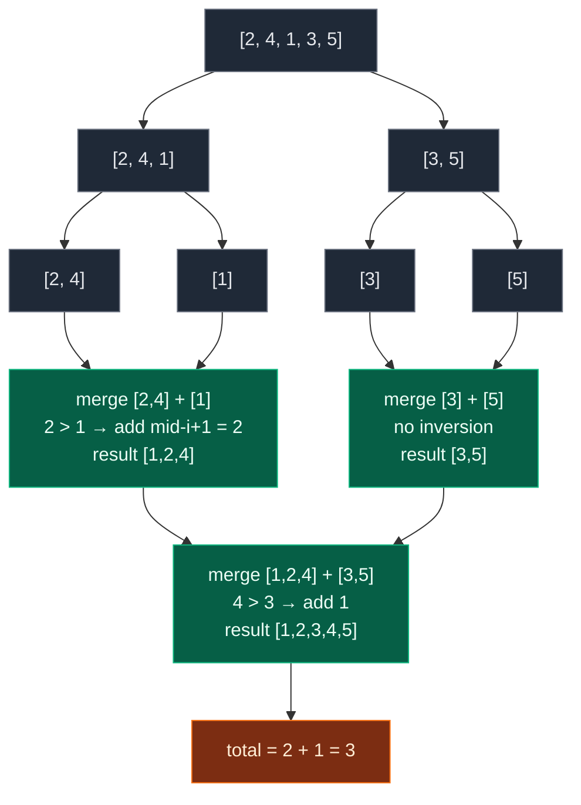

# 09. Count Inversions

| Difficulty | Pattern | Source | Time | Space |
|:---:|:---:|:---:|:---:|:---:|
| **Hard** | Merge Sort | [Count Inversions](https://www.geeksforgeeks.org/problems/inversion-of-array-1587115620/1) | `O(n log n)` | `O(n)` |

## 1. Problem Statement

Given an array of integers `arr[]`. You have to find the **Inversion Count** of the array.

**Note :** Inversion count is the number of pairs of elements (i, j) such that i < j and arr[i] > arr[j].

### Examples

```text
Input:  arr[] = [2, 4, 1, 3, 5]
Output: 3
Explanation: The sequence 2, 4, 1, 3, 5 has three inversions (2, 1), (4, 1), (4, 3).
```

```text
Input:  arr[] = [2, 3, 4, 5, 6]
Output: 0
Explanation: As the sequence is already sorted so there is no inversion count.
```

```text
Input:  arr[] = [10, 10, 10]
Output: 0
Explanation: As all the elements of array are same, so there is no inversion count.
```

### Constraints

- `1 <= arr.size() <= 10^5`
- `1 <= arr[i] <= 10^4`

## 2. Core Theory

An **inversion** is a pair of positions `i < j` whose values are out of order — `arr[i] > arr[j]`. The inversion count measures how far the array is from being sorted: a sorted array has `0`, a strictly reverse-sorted array has the maximum `n(n-1)/2`.

The brute force checks every pair, which is `O(n^2)` and dies at `n = 10^5`. The key realisation is that **merge sort already compares exactly the pairs that matter**, and it does so in batches. When merging two halves that are each already sorted, suppose the merge is comparing `left[i]` against `right[j]` and finds `left[i] > right[j]`. Because `left` is sorted, every element from `i` to `mid` is also greater than `right[j]`. That is not one inversion — it is `mid - i + 1` inversions, and we can add them all in a single step instead of discovering them one at a time.

That batching is precisely why the algorithm drops from `O(n^2)` to `O(n log n)`. Each level of the recursion touches every element once (`O(n)` work per level) and there are `log n` levels. Every inversion is counted exactly once, at the unique merge where its two elements first end up in opposite halves.



The crucial counting step, drawn out:

```text
left  = [2, 4]          right = [1, 3, 5]
         ^                       ^
         i                       j

arr[i] = 2  >  arr[j] = 1   ->  inversion

left is sorted, so EVERYTHING from i to mid is also > 1:

left:   [ 2   4 ]
          ^   ^
          |___|   both greater than 1

count += (mid - i + 1) = 2      (pairs (2,1) and (4,1) at once)
```

**Recognising the pattern:** whenever a problem asks you to count pairs `(i, j)` with `i < j` satisfying an order condition, merge sort (or a BIT / order-statistics tree) turns the quadratic pair scan into `O(n log n)`.

## 3. Edge Cases

| Case | Input | Expected | Why it matters |
|:---|:---|:---:|:---|
| Single element | `[7]` | `0` | Recursion base case `left >= right` must return immediately |
| Two elements sorted | `[1, 2]` | `0` | Smallest non-trivial merge |
| Two elements reversed | `[2, 1]` | `1` | Smallest real inversion |
| All identical | `[10, 10, 10]` | `0` | `<=` in the merge prevents counting equals |
| Already sorted | `[2, 3, 4, 5, 6]` | `0` | Left branch always wins; count stays zero |
| Reverse sorted | `[5, 4, 3, 2, 1]` | `10` | Maximum `n(n-1)/2` = `5*4/2` |
| Duplicates mixed in | `[2, 2, 1, 1]` | `4` | Equal values must not inflate the count |
| Sample array | `[2, 4, 1, 3, 5]` | `3` | Mix of batch count and single count |
| Large `n` | `10^5` elements | fits `O(n log n)` | Brute force `10^10` would time out |

## 4. What Does Inversion Mean?

For every pair:

```text
arr[i], arr[j]
```

where `i < j`, if left value is greater than right value, then it is an inversion.

Example:

```text
arr = [2, 4, 1, 3, 5]
```

Check pairs:

```text
2 > 1  -> inversion
4 > 1  -> inversion
4 > 3  -> inversion
```

So answer:

```text
3
```

In simple words:

```text
A bigger element appears before a smaller element.
```

Another worked example:

```text
arr = [5, 3, 2, 4, 1]
Output = 9
```

All inversions are:

```text
(5, 3)
(5, 2)
(5, 4)
(5, 1)

(3, 2)
(3, 1)

(2, 1)

(4, 1)

Total = 8
```

Correction: for this array, total inversions are 8.

## 5. Key Observation

If array is already sorted:

```text
[1, 2, 3, 4, 5]
```

There are no inversions.

Output:

```text
0
```

If array is reverse sorted:

```text
[5, 4, 3, 2, 1]
```

Every pair is an inversion.

For n elements, maximum inversions:

```text
n * (n - 1) / 2
```

For `n = 5`:

```text
5 * 4 / 2 = 10
```

## 6. Brute Force Solution

### Intuition

Check every pair `(i, j)`.

If:

```text
i < j and arr[i] > arr[j]
```

increase count.

### Approach

1. Start `i` from 0.
2. Start `j` from `i + 1`.
3. If `arr[i] > arr[j]`, count it.
4. Return count.

### Dry Run

```text
arr = [2, 4, 1, 3, 5]
```

For `i = 0`, `arr[i] = 2`:

```text
2 > 4? No
2 > 1? Yes -> count = 1
2 > 3? No
2 > 5? No
```

For `i = 1`, `arr[i] = 4`:

```text
4 > 1? Yes -> count = 2
4 > 3? Yes -> count = 3
4 > 5? No
```

Remaining elements do not create inversions.

Answer:

```text
3
```

### Code

```python
class Solution:
    def inversionCount(self, arr):

        # Store the length of the array
        n = len(arr)

        # Store total number of inversions
        inversion_count = 0

        # Pick the first index of the pair
        for i in range(n):

            # Pick the second index after i
            for j in range(i + 1, n):

                # If left element is greater than right element
                if arr[i] > arr[j]:

                    # This pair is an inversion
                    inversion_count += 1

        # Return total inversions
        return inversion_count
```

### Complexity

| Measure | Complexity | Why |
|:---|:---:|:---|
| **Time** | `O(n^2)` | Because we check every pair. |
| **Space** | `O(1)` | Because we only use variables. |

## 7. Most Optimal Solution: Merge Sort

### Intuition

This problem can be solved using **merge sort**.

While merging two sorted halves, we can count how many elements from the left half are greater than an element from the right half.

**Why Merge Sort Helps**

Suppose we have two sorted halves:

```text
left  = [2, 4]
right = [1, 3, 5]
```

Now compare:

```text
left[i] = 2
right[j] = 1
```

Since:

```text
2 > 1
```

And left half is sorted:

```text
[2, 4]
```

That means:

```text
2 > 1
4 > 1
```

So 1 forms inversions with all remaining elements in the left half.

Number of inversions:

```text
len(left) - i
```

Here:

```text
2 elements remaining: 2, 4
```

So add:

```text
2
```

This is the main trick.

### Approach

**Merge Sort Counting Logic**

During merge:

If:

```text
left[i] <= right[j]
```

Then no inversion is formed because left value is smaller.

So add `left[i]`.

If:

```text
left[i] > right[j]
```

Then inversion is formed.

Because `left` is sorted, all elements from `i` to end in `left` are also greater than `right[j]`.

So add:

```text
mid - i + 1
```

or if using separate lists:

```text
len(left) - i
```

### Dry Run

```text
arr = [2, 4, 1, 3, 5]
```

Divide:

```text
[2, 4, 1, 3, 5]
```

Split:

```text
[2, 4, 1] and [3, 5]
```

Further:

```text
[2, 4] and [1]
```

Now merge `[2, 4]` and `[1]`.

Compare:

```text
2 > 1
```

Since `[2, 4]` is sorted, 1 is smaller than both 2 and 4.

So inversions:

```text
(2, 1)
(4, 1)

count += 2
```

Merged:

```text
[1, 2, 4]
```

Now merge `[1, 2, 4]` and `[3, 5]`.

Compare:

```text
1 <= 3
2 <= 3
4 > 3
```

Since remaining left elements are:

```text
[4]
```

Inversion:

```text
(4, 3)

count += 1
```

Total:

```text
2 + 1 = 3
```

Answer:

```text
3
```

### Code

```python
# Define the class solution
class Solution:

    # Define the method
    def inversionCount(self, arr):

        # Helper function to perform merge sort and count inversions
        def merge_sort(left_index: int, right_index: int) -> int:

            # If there is only one element, no inversion is possible
            if left_index >= right_index: return 0

            # Find the middle index
            mid = (left_index + right_index) // 2

            # Count inversions in the left half
            left_count = merge_sort(left_index, mid)

            # Count inversions in the right half
            right_count = merge_sort(mid + 1, right_index)

            # Count cross inversions while merging both halves
            merge_count = merge(left_index, mid, right_index)

            # Return total inversions
            return left_count + right_count + merge_count

        # Helper function to merge two sorted halves and count cross inversions
        def merge(left_index: int, mid: int, right_index: int) -> int:

            # Temporary list to store merged sorted values
            temp = []

            # Pointer for left half
            left = left_index

            # Pointer for right half
            right = mid + 1

            # Store cross inversion count
            count = 0

            # Merge while both halves have elements
            while left <= mid and right <= right_index:

                # If left value is smaller or equal, no inversion
                if arr[left] <= arr[right]:

                    # Add left value to temp
                    temp.append(arr[left])

                    # Move left pointer
                    left += 1

                # If left value is greater than right value
                else:

                    # arr[right] is smaller than all remaining left-half elements
                    count += (mid - left + 1)

                    # Add right value to temp
                    temp.append(arr[right])

                    # Move right pointer
                    right += 1

            # Add remaining values from left half
            while left <= mid:

                # Add current left value
                temp.append(arr[left])

                # Move left pointer
                left += 1

            # Add remaining values from right half
            while right <= right_index:

                # Add current right value
                temp.append(arr[right])

                # Move right pointer
                right += 1

            # Copy sorted temp values back into original array
            for i in range(len(temp)):

                # Update original array position
                arr[left_index + i] = temp[i]

            # Return cross inversion count
            return count

        # Start merge sort on the full array
        return merge_sort(0, len(arr) - 1)
```

### Complexity

| Measure | Complexity | Why |
|:---|:---:|:---|
| **Time** | `O(n log n)` | Because merge sort divides the array into halves and merges in linear time. |
| **Space** | `O(n)` | Because we use temporary arrays during merging. |

## 8. Why Use `<=` Instead of `<`

In inversion condition, we count only when:

```text
arr[i] > arr[j]
```

Not when equal.

So during merge, if:

```text
arr[left] <= arr[right]
```

we should take `arr[left]`.

This avoids counting equal elements as inversions.

Example:

```text
arr = [2, 2]
```

There is no inversion because:

```text
2 > 2 is False
```

So use:

```python
if arr[left] <= arr[right]:
```

not:

```python
if arr[left] < arr[right]:
```

## 9. Common Mistakes

| Mistake | Why it breaks | Fix |
|:---|:---|:---|
| Using `<` instead of `<=` in the merge | Equal values get pulled from the right half first and counted as inversions | `if arr[left] <= arr[right]` |
| Incrementing `count += 1` on `arr[left] > arr[right]` | Counts one pair per comparison, missing the remaining left elements — result is too small | `count += (mid - left + 1)` |
| Using `mid - left` instead of `mid - left + 1` | Off by one: forgets `arr[left]` itself is an inversion with `arr[right]` | Inclusive range needs the `+ 1` |
| Forgetting to copy `temp` back into `arr` | Later merges see unsorted halves, so the counting invariant collapses | Write `arr[left_index + i] = temp[i]` for every `i` |
| Counting during the leftover-drain loops | Remaining left elements have no right partner left to pair with | Only count inside the main two-pointer loop |
| Assuming the input survives | Merge sort sorts `arr` in place | Pass a copy if the caller still needs the original order |

## 10. Interview Follow-ups

**Q: Why can you add `mid - left + 1` in one step instead of looping?**

A: Because the left half is already sorted when the merge runs. If `arr[left] > arr[right]`, then every element from `left` through `mid` is `>= arr[left] > arr[right]`, so all of them form an inversion with `arr[right]`. Counting them individually would reintroduce the `O(n^2)` behaviour.

**Q: What is the maximum possible inversion count, and does it overflow?**

A: `n(n-1)/2`. For `n = 10^5` that is about `5 * 10^9`, which overflows a 32-bit `int`. Python is arbitrary precision, but in Java or C++ you must use `long`.

**Q: Can you solve it without merge sort?**

A: Yes — a Binary Indexed Tree over coordinate-compressed values. Scan right to left and query how many already-seen values are strictly smaller than the current one. Also `O(n log n)`, and it does not mutate the array.

**Q: How is inversion count related to sorting algorithms?**

A: It is exactly the number of swaps bubble sort or insertion sort performs. Insertion sort runs in `O(n + inversions)`, which is why it is fast on nearly-sorted data.

**Q: Does the algorithm still work with duplicates and negative numbers?**

A: Yes. Duplicates are handled by the `<=` comparison (equals are never inversions), and negatives need no special treatment since only relative order matters.

## 11. Interview Explanation

> I use merge sort. The idea is to count inversions while merging two sorted halves. If the current left element is less than or equal to the current right element, there is no inversion. But if the left element is greater than the right element, then because the left half is sorted, all remaining elements from the left pointer to `mid` are also greater than the right element. So I add `mid - left + 1` to the count. This gives `O(n log n)` time.

## 12. Verify

```python
from typing import List


def inversionCount(arr: List[int]) -> int:
    def merge(left_index: int, mid: int, right_index: int) -> int:
        temp = []
        left = left_index
        right = mid + 1
        count = 0
        while left <= mid and right <= right_index:
            if arr[left] <= arr[right]:
                temp.append(arr[left])
                left += 1
            else:
                count += (mid - left + 1)
                temp.append(arr[right])
                right += 1
        while left <= mid:
            temp.append(arr[left])
            left += 1
        while right <= right_index:
            temp.append(arr[right])
            right += 1
        for i in range(len(temp)):
            arr[left_index + i] = temp[i]
        return count

    def merge_sort(left_index: int, right_index: int) -> int:
        if left_index >= right_index:
            return 0
        mid = (left_index + right_index) // 2
        return (merge_sort(left_index, mid)
                + merge_sort(mid + 1, right_index)
                + merge(left_index, mid, right_index))

    return merge_sort(0, len(arr) - 1)


def brute(a: List[int]) -> int:
    n = len(a)
    return sum(1 for i in range(n) for j in range(i + 1, n) if a[i] > a[j])


# Problem examples (pass a copy: merge sort mutates the input)
assert inversionCount([2, 4, 1, 3, 5][:]) == 3
assert inversionCount([2, 3, 4, 5, 6][:]) == 0
assert inversionCount([10, 10, 10][:]) == 0

# Author's second example
assert inversionCount([5, 3, 2, 4, 1][:]) == 8

# Single element
assert inversionCount([7]) == 0

# Two elements
assert inversionCount([1, 2]) == 0
assert inversionCount([2, 1]) == 1

# Already sorted -> 0
assert inversionCount(list(range(1, 51))) == 0

# Reverse sorted -> n(n-1)/2
for n in range(1, 30):
    assert inversionCount(list(range(n, 0, -1))) == n * (n - 1) // 2

# Duplicates must not inflate the count
assert inversionCount([2, 2, 1, 1]) == 4
assert inversionCount([1, 1, 1, 1]) == 0

# Negatives work too
assert inversionCount([-1, -5, 0, -3]) == 3 == brute([-1, -5, 0, -3])

# Cross-check against brute force on random inputs
import random

random.seed(7)
for _ in range(400):
    n = random.randint(1, 40)
    a = [random.randint(-10, 10) for _ in range(n)]
    assert inversionCount(a[:]) == brute(a), a

# The optimal solution sorts the array as a side effect
data = [4, 1, 3, 2]
inversionCount(data)
assert data == [1, 2, 3, 4]

# Scales to the constraint size
big = [random.randint(1, 10 ** 4) for _ in range(10 ** 5)]
assert inversionCount(big[:]) >= 0

print("All tests passed")
```
