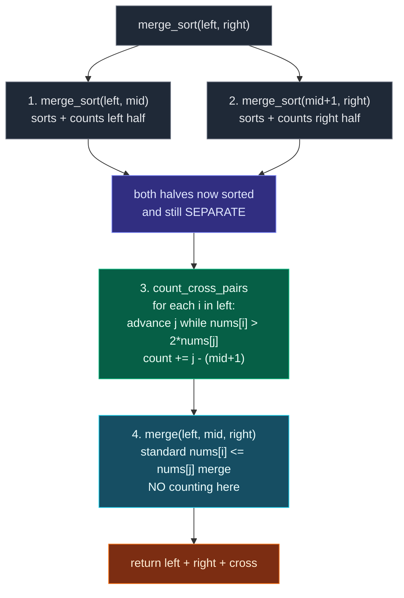

# 10. 493. Reverse Pairs

| Difficulty | Pattern | Source | Time | Space |
|:---:|:---:|:---:|:---:|:---:|
| **Hard** | Modified Merge Sort | [493. Reverse Pairs](https://leetcode.com/problems/reverse-pairs/) | `O(n log n)` | `O(n)` |

## 1. Problem Statement

Given an integer array `nums`, return *the number of **reverse pairs** in the array*.

A **reverse pair** is a pair `(i, j)` where:

- `0 <= i < j < nums.length` and
- `nums[i] > 2 * nums[j]`.

### Examples

```text
Input:  nums = [1,3,2,3,1]
Output: 2
Explanation: The reverse pairs are:
(1, 4) --> nums[1] = 3, nums[4] = 1, 3 > 2 * 1
(3, 4) --> nums[3] = 3, nums[4] = 1, 3 > 2 * 1
```

```text
Input:  nums = [2,4,3,5,1]
Output: 3
Explanation: The reverse pairs are:
(1, 4) --> nums[1] = 4, nums[4] = 1, 4 > 2 * 1
(2, 4) --> nums[2] = 3, nums[4] = 1, 3 > 2 * 1
(3, 4) --> nums[3] = 5, nums[4] = 1, 5 > 2 * 1
```

### Constraints

- `1 <= nums.length <= 5 * 10^4`
- `-2^31 <= nums[i] <= 2^31 - 1`

## 2. Core Theory

A reverse pair is an inversion with a stricter threshold: not merely `nums[i] > nums[j]`, but `nums[i] > 2 * nums[j]` with `i < j`. Every reverse pair is an inversion, but not every inversion is a reverse pair — `5 > 3` is an inversion, yet `5 > 2 * 3 = 6` is false, so it is not a reverse pair.

The skeleton is the same divide-and-conquer as Count Inversions: sort the left half, sort the right half, count the pairs that straddle the two halves, then merge. What changes is that **the counting can no longer ride along inside the merge comparison**. The merge advances its pointers on the test `nums[i] <= nums[j]`; that test tells you nothing reliable about `nums[i] > 2 * nums[j]`, because the doubling shifts the boundary. A left element can lose the merge comparison and still be a reverse pair, or win it and not be one. So the two jobs use different pointer schedules and must be done separately.

Hence the **counting is a separate pass done before the merge**, while both halves are still individually sorted and — crucially — still separated. Once merged, the array no longer remembers which element came from which half, and any pair count would mix in same-half pairs. The correct order is: sort/count left, sort/count right, count cross pairs, then merge.

The cross-counting pass itself is linear. Walk `i` across the left half; for each `i`, advance `j` in the right half while `nums[i] > 2 * nums[j]`. Because the left half is sorted ascending, as `nums[i]` grows the valid window in the right half only ever extends forward — `j` never resets, so the whole pass is `O(n)` per merge level.



The counting window, drawn out:

```text
left  = [3, 4, 10]          right = [1, 2, 3, 8]
                                     ^        ^
                                   mid+1      j stops here

for nums[i] = 10:
    10 > 2*1 = 2   True   -> j advances
    10 > 2*2 = 4   True   -> j advances
    10 > 2*3 = 6   True   -> j advances
    10 > 2*8 = 16  False  -> stop

valid right elements = [1, 2, 3]
count += j - (mid + 1) = 3

j is NOT reset for the next i: left is sorted, so a larger
nums[i] can only push the boundary further right.
```

**Overflow caution.** With `nums[i]` up to `2^31 - 1`, the expression `2 * nums[j]` overflows a 32-bit `int` in Java or C++. Cast to 64-bit (`(long) nums[i] > 2L * nums[j]`). Python integers are arbitrary precision, so the issue does not arise here.

## 3. Edge Cases

| Case | Input | Expected | Why it matters |
|:---|:---|:---:|:---|
| Single element | `[1]` | `0` | Base case `left >= right` must return `0` |
| Two elements, no pair | `[1, 2]` | `0` | `1 > 4` is false |
| Two elements, pair | `[3, 1]` | `1` | Smallest real reverse pair |
| All identical positive | `[5, 5, 5]` | `0` | `5 > 10` is false — equals never count |
| All identical negative | `[-5, -5]` | `1` | `-5 > -10` is **true** — sign flips the intuition |
| Already sorted | `[1, 2, 3, 4, 5]` | `0` | No `i < j` with a larger left value |
| Reverse sorted | `[5, 4, 3, 2, 1]` | `4` | Not all `10` inversions qualify under `2 *` |
| Negatives mixed | `[-5, -1, -3]` | `2` | Doubling a negative makes it smaller, not larger |
| Zeroes | `[0, 0, 0]` | `0` | `0 > 0` is false |
| Extreme values | `[2^31-1, -2^31]` | `1` | `2 * nums[j]` overflows 32-bit in other languages |
| LeetCode example | `[1,3,2,3,1]` | `2` | Duplicates on both sides of a split |

## 4. Difference Between Inversions and Reverse Pairs

Normal inversion condition is:

```text
nums[i] > nums[j]
```

Reverse pair condition is stronger:

```text
nums[i] > 2 * nums[j]
```

Example:

```text
nums[i] = 5
nums[j] = 3
```

For inversion:

```text
5 > 3
True
```

For reverse pair:

```text
5 > 2 * 3
5 > 6
False
```

So every reverse pair may be an inversion, but every inversion is not a reverse pair.

## 5. Brute Force Solution

### Intuition

Check every pair `(i, j)` where `i < j`.

If:

```text
nums[i] > 2 * nums[j]
```

increase count.

### Approach

1. Pick the first index `i` of the pair.
2. Pick the second index `j` after `i`.
3. Check the reverse pair condition.
4. Return the total count.

### Dry Run

```text
nums = [1, 3, 2, 3, 1]
```

Check all pairs:

```text
i = 0, nums[i] = 1
1 > 2 * 3? No
1 > 2 * 2? No
1 > 2 * 3? No
1 > 2 * 1? No

i = 1, nums[i] = 3
3 > 2 * 2? No
3 > 2 * 3? No
3 > 2 * 1? Yes -> count = 1

i = 2, nums[i] = 2
2 > 2 * 3? No
2 > 2 * 1? No

i = 3, nums[i] = 3
3 > 2 * 1? Yes -> count = 2
```

Answer:

```text
2
```

### Code

```python
# Define the class solution
class Solution:

    # Define the method
    def reversePairs(self, nums: List[int]) -> int:

        # Store the length of the array
        n = len(nums)

        # Store the count of reverse pairs
        count = 0

        # Pick the first index of the pair
        for i in range(n):

            # Pick the second index after i
            for j in range(i + 1, n):

                # Check the reverse pair condition
                if nums[i] > 2 * nums[j]:

                    # Increase count if condition is true
                    count += 1

        # Return total reverse pairs
        return count
```

### Complexity

| Measure | Complexity | Why |
|:---|:---:|:---|
| **Time** | `O(n^2)` | Because we check every pair. |
| **Space** | `O(1)` | Because we only use variables. |

This will give TLE for large input because n can be up to `5 * 10^4`.

## 6. Optimal Solution: Modified Merge Sort

### Intuition

This problem is very similar to **Count Inversions**.

In count inversions, during merge sort we count:

```text
nums[i] > nums[j]
```

Here we count:

```text
nums[i] > 2 * nums[j]
```

The idea:

```text
1. Divide the array into two halves.
2. Count reverse pairs in the left half.
3. Count reverse pairs in the right half.
4. Count reverse pairs across left and right halves.
5. Merge both halves in sorted order.
```

**Why Merge Sort Helps**

Suppose left half and right half are already sorted:

```text
left  = [1, 3, 3]
right = [1, 2]
```

We need to count pairs:

```text
left[i] > 2 * right[j]
```

For each element in `left`, we can move a pointer in `right`.

Example:

For `left[i] = 1`:

```text
1 > 2 * 1? No
```

For `left[i] = 3`:

```text
3 > 2 * 1? Yes
3 > 2 * 2? No
```

So 3 forms one pair with 1.

For next `left[i] = 3`, the right pointer does not need to move back.

This gives efficient counting.

### Approach

**Important Counting Trick**

During merge sort, left half is sorted and right half is sorted.

Let:

```text
i goes from left_start to mid
j starts from mid + 1
```

For each `i`, move `j` while:

```text
nums[i] > 2 * nums[j]
```

Then all indices from:

```text
mid + 1 to j - 1
```

form valid reverse pairs with `i`.

So add:

```text
j - (mid + 1)
```

to count.

**Why This Works**

Because right half is sorted.

If:

```text
nums[i] > 2 * nums[j]
```

is true for some `j`, then it is also true for all earlier elements in the right half.

Example:

```text
left value = 10
right = [1, 2, 3, 8]
```

Check:

```text
10 > 2 * 1 -> True
10 > 2 * 2 -> True
10 > 2 * 3 -> True
10 > 2 * 8 -> False
```

So valid right elements are:

```text
[1, 2, 3]
```

Count:

```text
3
```

### Dry Run

```text
nums = [1, 3, 2, 3, 1]
```

Split:

```text
[1, 3, 2] and [3, 1]
```

Eventually, sorted halves become:

```text
left  = [1, 2, 3]
right = [1, 3]
```

Now count cross reverse pairs.

For 1:

```text
1 > 2 * 1? No
count += 0
```

For 2:

```text
2 > 2 * 1? No
count += 0
```

For 3:

```text
3 > 2 * 1? Yes
3 > 2 * 3? No
count += 1
```

One cross pair:

```text
3 with 1
```

But there are two 3s in original array that create pairs with last 1.

Total answer becomes:

```text
2
```

### Code

```python
# Define the class solution
class Solution:

    # Define the method
    def reversePairs(self, nums: List[int]) -> int:

        # Helper function to divide array and count reverse pairs
        def merge_sort(left: int, right: int) -> int:

            # Base case: single element has zero reverse pairs
            if left >= right:
                return 0

            # Find middle index
            mid = (left + right) // 2

            # Count reverse pairs in left half
            count = merge_sort(left, mid)

            # Count reverse pairs in right half
            count += merge_sort(mid + 1, right)

            # Count reverse pairs across left and right halves
            count += count_cross_pairs(left, mid, right)

            # Merge both sorted halves
            merge(left, mid, right)

            # Return total count
            return count

        # Helper function to count cross reverse pairs
        def count_cross_pairs(left: int, mid: int, right: int) -> int:

            # Pointer for right half
            j = mid + 1

            # Store cross reverse pair count
            count = 0

            # Traverse every element in left half
            for i in range(left, mid + 1):

                # Move j while reverse pair condition is true
                while j <= right and nums[i] > 2 * nums[j]:

                    # Move right pointer forward
                    j += 1

                # All elements from mid + 1 to j - 1 form reverse pairs with nums[i]
                count += j - (mid + 1)

            # Return cross count
            return count

        # Helper function to merge two sorted halves
        def merge(left: int, mid: int, right: int) -> None:

            # Temporary list to store sorted merged result
            temp = []

            # Pointer for left half
            i = left

            # Pointer for right half
            j = mid + 1

            # Merge while both halves have elements
            while i <= mid and j <= right:

                # If left value is smaller or equal
                if nums[i] <= nums[j]:

                    # Add left value to temp
                    temp.append(nums[i])

                    # Move left pointer
                    i += 1

                # If right value is smaller
                else:

                    # Add right value to temp
                    temp.append(nums[j])

                    # Move right pointer
                    j += 1

            # Add remaining left half values
            while i <= mid:

                # Add current left value
                temp.append(nums[i])

                # Move left pointer
                i += 1

            # Add remaining right half values
            while j <= right:

                # Add current right value
                temp.append(nums[j])

                # Move right pointer
                j += 1

            # Copy temp values back into nums
            for index in range(len(temp)):

                # Update original array
                nums[left + index] = temp[index]

        # Start merge sort on complete array
        return merge_sort(0, len(nums) - 1)
```

### Complexity

| Measure | Complexity | Why |
|:---|:---:|:---|
| **Time** | `O(n log n)` | Merge sort has `log n` levels. At every level, counting and merging together take `O(n)`. Total = `O(n log n)`. |
| **Space** | `O(n)` | Because merge step uses a temporary array. |

## 7. Why Count Before Merge?

This is very important.

We count cross pairs before merging because:

```text
left half and right half are individually sorted
```

At that moment, we know which elements originally belong to left side and which belong to right side.

If we merge first, we lose that separation.

Correct order:

```text
1. Sort/count left half
2. Sort/count right half
3. Count cross pairs between left and right
4. Merge both halves
```

## 8. Why We Do Not Reset `j` for Every `i`

In `count_cross_pairs`:

```python
j = mid + 1

for i in range(left, mid + 1):
    while j <= right and nums[i] > 2 * nums[j]:
        j += 1
    count += j - (mid + 1)
```

We do not reset `j` because left half is sorted.

As `nums[i]` increases, the valid range in the right half can only move forward, not backward.

This keeps cross counting linear.

## 9. Handling Negative Numbers

This solution also works with negative numbers.

Example:

```text
nums = [-5, -5]
```

Check pair:

```text
-5 > 2 * -5
-5 > -10
True
```

So answer is 1.

The merge sort counting condition handles this correctly:

```python
nums[i] > 2 * nums[j]
```

## 10. Integer Overflow Note

In Java/C++, be careful with:

```text
2 * nums[j]
```

Because values can be near `2^31`.

Use long type:

```java
(long) nums[i] > 2L * nums[j]
```

In Python, integers do not overflow.

## 11. Common Mistakes

| Mistake | Why it breaks | Fix |
|:---|:---|:---|
| Folding the count into the merge comparison | The merge advances on `nums[i] <= nums[j]`, which is a different boundary from `nums[i] > 2 * nums[j]` — pairs get missed or double counted | Run `count_cross_pairs` as a separate pass before `merge` |
| Counting after merging | The halves are fused, so same-half pairs get counted too | Count while both halves are still separate |
| Resetting `j = mid + 1` inside the `for i` loop | Turns the cross pass into `O(n^2)`, giving `O(n^2 log n)` overall | Keep `j` outside the loop; it only moves forward |
| `count += j - mid` instead of `j - (mid + 1)` | Off by one — the right half starts at `mid + 1`, not `mid` | Window length is `j - (mid + 1)` |
| Using `>=` in the condition | `nums[i] >= 2 * nums[j]` counts the boundary case, which the problem excludes | Strict `>` only |
| 32-bit arithmetic for `2 * nums[j]` | Overflows when `nums[j]` is near `2^31`, flipping the sign | Cast to `long` / `int64` in Java or C++ |
| Assuming negatives behave like positives | `-5 > 2 * -5` is true, because doubling a negative makes it smaller | Trust the raw comparison, do not special-case signs |

## 12. Interview Follow-ups

**Q: Why can't you count reverse pairs inside the merge loop like you do for Count Inversions?**

A: The merge loop moves pointers according to `nums[i] <= nums[j]`, and for plain inversions that is the exact condition being counted, so the batch count `mid - i + 1` is valid. With the `2 *` factor the two conditions diverge: a left element can be smaller than a right element yet still exceed twice it (with negatives), or be larger yet not exceed twice it. The merge's pointer schedule is therefore wrong for counting, so you need an independent pass.

**Q: Why is the separate counting pass still `O(n)` per merge?**

A: `j` is initialised once per merge and only ever increases. Across the whole `for i` loop, `i` advances at most `mid - left + 1` times and `j` at most `right - mid` times, so the pass is linear in the segment length. With `log n` levels the total is `O(n log n)`.

**Q: What about integer overflow?**

A: `nums[i]` can reach `2^31 - 1`, so `2 * nums[j]` overflows a 32-bit signed int. In Java use `(long) nums[i] > 2L * nums[j]`; in C++ use `long long`. Python is unaffected. An alternative is to rewrite the test as `nums[i] / 2.0 > nums[j]`, but floating point risks precision errors, so 64-bit integers are safer.

**Q: Can this be done with a BIT or Segment Tree instead?**

A: Yes. Coordinate-compress the values of `nums` together with all `2 * nums[j]` thresholds, then scan left to right inserting each `nums[i]` and querying how many previously inserted values exceed `2 * nums[j]`. Also `O(n log n)`, and it does not reorder the array.

**Q: Does the algorithm mutate the input?**

A: Yes — the merge writes sorted values back into `nums`, so the array comes out sorted. If the caller needs the original order, pass or restore a copy.

**Q: How does this generalise?**

A: Replace `2 *` with any monotone function `f` and the same structure works: count `nums[i] > f(nums[j])` in a separate pre-merge pass. Monotonicity of `f` is what keeps `j` from ever moving backwards.

## 13. Interview Explanation

> This is a modified merge sort problem. I recursively sort the left and right halves. Before merging them, I count cross reverse pairs where `i` is in the left half and `j` is in the right half. Since both halves are sorted, for each `i`, I move a pointer `j` in the right half while `nums[i] > 2 * nums[j]`, and add the number of valid right-side elements. Then I merge both halves. This gives `O(n log n)` time.

## 14. Verify

```python
from typing import List


# Optimal merge-sort based reverse-pair counter
def reversePairs(nums: List[int]) -> int:
    # Count cross pairs (i in left half, j in right half) satisfying nums[i] > 2 * nums[j]
    def count_cross_pairs(left: int, mid: int, right: int) -> int:
        # Pointer into the right half
        j = mid + 1
        # Store cross reverse-pair count
        count = 0
        # Walk each left-half index
        for i in range(left, mid + 1):
            # Advance j while the doubled right value is still too small
            while j <= right and nums[i] > 2 * nums[j]:
                j += 1
            # Every right index from mid+1 up to j-1 pairs with this i
            count += j - (mid + 1)
        # Return cross reverse-pair count
        return count

    # Merge two sorted halves back into nums
    def merge(left: int, mid: int, right: int) -> None:
        # Temporary list to store merged sorted values
        temp = []
        # Pointer for left half
        i = left
        # Pointer for right half
        j = mid + 1
        # Merge while both halves have elements
        while i <= mid and j <= right:
            # If left value is smaller or equal, take it first
            if nums[i] <= nums[j]:
                temp.append(nums[i])
                i += 1
            # Otherwise take the right value
            else:
                temp.append(nums[j])
                j += 1
        # Add remaining values from left half
        while i <= mid:
            temp.append(nums[i])
            i += 1
        # Add remaining values from right half
        while j <= right:
            temp.append(nums[j])
            j += 1
        # Copy sorted temp values back into original array
        for index in range(len(temp)):
            nums[left + index] = temp[index]

    # Recursively split, count each half, count the cross pairs, then merge
    def merge_sort(left: int, right: int) -> int:
        # If there is only one element, no reverse pair is possible
        if left >= right:
            return 0
        # Find the middle index
        mid = (left + right) // 2
        # Count reverse pairs in the left half
        count = merge_sort(left, mid)
        # Count reverse pairs in the right half
        count += merge_sort(mid + 1, right)
        # Count cross reverse pairs before the halves get merged
        count += count_cross_pairs(left, mid, right)
        # Merge the two halves back into sorted order
        merge(left, mid, right)
        # Return total reverse pairs
        return count

    # Start merge sort on the full array
    return merge_sort(0, len(nums) - 1)


# Brute force reference used only to cross-check the optimal solution
def brute(a: List[int]) -> int:
    # Store the size of the array
    n = len(a)
    # Count every pair satisfying a[i] > 2 * a[j]
    return sum(1 for i in range(n) for j in range(i + 1, n) if a[i] > 2 * a[j])


# LeetCode examples (pass a copy: merge sort mutates the input)
assert reversePairs([1, 3, 2, 3, 1][:]) == 2
assert reversePairs([2, 4, 3, 5, 1][:]) == 3

# Single element: base case left >= right must return 0
assert reversePairs([1]) == 0

# Two elements, no pair, and two elements with a pair
assert reversePairs([1, 2]) == 0
assert reversePairs([3, 1]) == 1

# All identical positive: equals never count
assert reversePairs([5, 5, 5]) == 0

# All identical negative: sign flips the intuition, -5 > 2 * -5 = -10 is true
assert reversePairs([-5, -5]) == 1

# Already sorted: no i < j with a larger left value
assert reversePairs([1, 2, 3, 4, 5]) == 0

# Reverse sorted: not every inversion is a reverse pair under 2 *
assert reversePairs([5, 4, 3, 2, 1][:]) == brute([5, 4, 3, 2, 1]) == 4

# Negatives mixed: doubling a negative makes it smaller, not larger
assert reversePairs([-5, -1, -3][:]) == brute([-5, -1, -3]) == 2

# Zeroes: 0 > 0 is false
assert reversePairs([0, 0, 0]) == 0

# Extreme values: 2 * nums[j] overflows 32-bit in other languages
INT_MAX, INT_MIN = 2 ** 31 - 1, -2 ** 31
assert reversePairs([INT_MAX, INT_MIN][:]) == 1
assert reversePairs([INT_MIN, INT_MAX][:]) == 0

# Cross-check against brute force on random inputs
import random

random.seed(11)
for _ in range(400):
    n = random.randint(1, 40)
    a = [random.randint(-10, 10) for _ in range(n)]
    assert reversePairs(a[:]) == brute(a), a

# Random inputs with extreme magnitudes
for _ in range(100):
    a = [random.randint(INT_MIN, INT_MAX) for _ in range(random.randint(1, 20))]
    assert reversePairs(a[:]) == brute(a), a

# The optimal solution sorts the array as a side effect
data = [4, 1, 3, 2]
reversePairs(data)
assert data == [1, 2, 3, 4]

# Scales to the constraint size (large n still runs in O(n log n))
big = [random.randint(INT_MIN, INT_MAX) for _ in range(5 * 10 ** 4)]
assert reversePairs(big[:]) >= 0

print("All tests passed")
```
