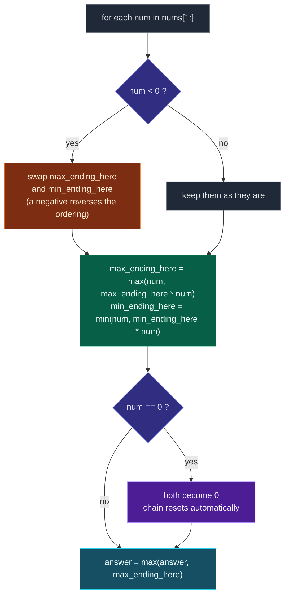

# 11. 152. Maximum Product Subarray

| Difficulty | Pattern | Source | Time | Space |
|:---:|:---:|:---:|:---:|:---:|
| **Hard** | Modified Kadane (Min/Max Tracking) | [152. Maximum Product Subarray](https://leetcode.com/problems/maximum-product-subarray/) | `O(n)` | `O(1)` |

## 1. Problem Statement

Given an integer array `nums`, find a **subarray** that has the largest product, and return *the product*.

The test cases are generated so that the answer will fit in a **32-bit** integer.

**Note** that the product of an array with a single element is the value of that element.

### Examples

```text
Input:  nums = [2,3,-2,4]
Output: 6
Explanation: [2,3] has the largest product 6.
```

```text
Input:  nums = [-2,0,-1]
Output: 0
Explanation: The result cannot be 2, because [-2,-1] is not a subarray.
```

### Constraints

- `1 <= nums.length <= 2 * 10^4`
- `-10 <= nums[i] <= 10`
- The product of any subarray of `nums` is **guaranteed** to fit in a **32-bit** integer.

## 2. Core Theory

Kadane's Algorithm works for maximum **sum** because sums are monotone: adding a bigger number always helps, so tracking only "best sum ending here" is enough. Products break that monotonicity. Multiplying by a negative number **reverses the ordering** — the worst (most negative) running product instantly becomes the best one.

Concretely, with `nums = [-2, 3, -4]` the running minimum after two elements is `-6`. The next element is `-4`, and `-6 * -4 = 24` — the answer. A max-only tracker would have thrown `-6` away as useless and returned `3`. So the minimum is not noise; it is a *candidate in waiting*, holding the negative magnitude that a future negative will flip into a maximum.

That gives the rule: at every index track **both** `max_ending_here` and `min_ending_here`, and compute each from three candidates — the number alone (start a fresh subarray), the number times the previous max, and the number times the previous min. Equivalently, since a negative `num` swaps the roles of max and min, you can swap the two variables first and then apply plain Kadane's two-way choice. Both formulations are the same algorithm.

Zeroes need no special case. A zero makes all three candidates `0`, so both `max_ending_here` and `min_ending_here` collapse to `0` and the product chain resets naturally. The next element then starts fresh via the "number alone" candidate.



The trace where the minimum saves the day, with columns aligned:

```text
nums          =   -2      3      -4
                 ----   ----   -----
max_ending_here    -2      3      24     <- 24 comes from min * num
min_ending_here    -2     -6     -12
answer             -2      3      24

At num = -4:
    candidates = -4,  3 * -4 = -12,  -6 * -4 = 24
    max = 24   <- the stored MINIMUM (-6) produced it
    min = -12
```

**Recognising the pattern:** whenever the combining operation is not monotone — products, or DP states where a sign or parity flips — carry the extremes of *both* directions forward, not just the one you are optimising.

## 3. Edge Cases

| Case | Input | Expected | Why it matters |
|:---|:---|:---:|:---|
| Single element | `[5]` | `5` | Loop body never runs; answer is `nums[0]` |
| Single negative element | `[-5]` | `-5` | Must not initialise `answer` to `0` |
| All identical | `[2, 2, 2]` | `8` | Plain positive chain |
| Zero breaks the chain | `[0, 2]` | `2` | Fresh start via the "num alone" candidate |
| Zero itself is the max | `[-2, 0, -1]` | `0` | `[-2,-1]` is not a subarray |
| Two negatives flip | `[-2, 3, -4]` | `24` | The tracked minimum becomes the maximum |
| All negative, odd count | `[-1, -2, -3]` | `6` | Best is `[-2,-3]`, dropping one negative |
| All negative, even count | `[-1, -2, -3, -4]` | `24` | Whole array works |
| Already sorted ascending | `[1, 2, 3, 4]` | `24` | Product of everything |
| Reverse sorted | `[4, 3, 2, 1]` | `24` | Order does not matter when all positive |
| Duplicates with a zero | `[2, 0, 2, 0, 2]` | `2` | Every segment resets |
| Leading zeroes | `[0, 0, -3]` | `0` | `0` beats `-3` |
| LeetCode example | `[2,3,-2,4]` | `6` | `[2,3]` beats the whole-array `-48` |

## 4. Why This Problem Is Different From Maximum Sum Subarray

For maximum sum subarray, Kadane's Algorithm tracks only:

```text
maximum sum ending here
```

But for maximum product, negative numbers create a special problem.

A negative number can turn:

```text
smallest negative product -> largest positive product
```

Example:

```text
nums = [-2, 3, -4]
```

Products:

```text
[-2]         = -2
[-2, 3]      = -6
[-2, 3, -4] = 24
```

The answer is:

```text
24
```

Notice:

```text
-6 * -4 = 24
```

So the minimum product became the maximum product.

That is why we track both:

```text
max_product_ending_here
min_product_ending_here
```

## 5. Key Observation

At every index, the maximum product subarray ending at current index can come from three choices:

```text
1. current number alone
2. current number * previous maximum product
3. current number * previous minimum product
```

Why previous minimum?

Because if current number is negative:

```text
negative * negative = positive
```

So previous minimum can become the new maximum.

## 6. Author's Edge Cases

```text
nums = [5]
Output = 5
```

Single element.

```text
nums = [-5]
Output = -5
```

Single negative element.

```text
nums = [0, 2]
Output = 2
```

Zero breaks the product chain.

```text
nums = [-2, 0, -1]
Output = 0
```

Zero itself can be maximum.

```text
nums = [-2, 3, -4]
Output = 24
```

Two negatives create a positive product.

```text
nums = [-1, -2, -3]
Output = 6
```

Best subarray is:

```text
[-2, -3] = 6
```

## 7. Brute Force Solution

### Intuition

Generate every possible subarray.

Calculate its product.

Return the maximum product.

### Approach

1. Choose every starting index.
2. Choose every ending index.
3. Calculate product from start to end.
4. Update maximum product.

### Dry Run

```text
nums = [2, 3, -2, 4]
```

Subarrays and products:

```text
[2]             = 2
[2, 3]          = 6
[2, 3, -2]      = -12
[2, 3, -2, 4]   = -48

[3]             = 3
[3, -2]         = -6
[3, -2, 4]      = -24

[-2]            = -2
[-2, 4]         = -8

[4]             = 4
```

Maximum product:

```text
6
```

### Code

```python
# Define the class solution
class Solution:

    # Define the method
    def maxProduct(self, nums: List[int]) -> int:

        # Store the length of the array
        n = len(nums)

        # Initialize maximum product with very small value
        max_product = float("-inf")

        # Try every possible starting index
        for start in range(n):

            # Try every possible ending index
            for end in range(start, n):

                # Product of current subarray
                current_product = 1

                # Calculate product from start to end
                for index in range(start, end + 1):

                    # Multiply current element
                    current_product *= nums[index]

                # Update maximum product
                max_product = max(max_product, current_product)

        # Return largest product found
        return max_product
```

### Complexity

| Measure | Complexity | Why |
|:---|:---:|:---|
| **Time** | `O(n^3)` | Because we choose start, end, and calculate product again. |
| **Space** | `O(1)` | Because we only use variables. |

## 8. Better Brute Force: Running Product

### Intuition

For fixed `start`, instead of recalculating product from scratch, keep multiplying as `end` moves forward.

### Approach

1. Fix a start index.
2. Reset `current_product` to `1`.
3. Expand `end` to the right, multiplying one new element each time.
4. Update the maximum after every expansion.

### Dry Run

```text
nums = [2, 3, -2, 4]
```

For `start = 0`:

```text
end = 0 -> current_product = 2      -> max = 2
end = 1 -> current_product = 6      -> max = 6
end = 2 -> current_product = -12    -> max = 6
end = 3 -> current_product = -48    -> max = 6
```

For `start = 1`:

```text
end = 1 -> current_product = 3      -> max = 6
end = 2 -> current_product = -6     -> max = 6
end = 3 -> current_product = -24    -> max = 6
```

Remaining starts do not beat 6.

Answer:

```text
6
```

### Code

```python
# Define the class solution
class Solution:

    # Define the method
    def maxProduct(self, nums: List[int]) -> int:

        # Store array length
        n = len(nums)

        # Store maximum product found
        max_product = float("-inf")

        # Try every start index
        for start in range(n):

            # Running product for subarray starting at start
            current_product = 1

            # Expand end index
            for end in range(start, n):

                # Include current end element in product
                current_product *= nums[end]

                # Update maximum product
                max_product = max(max_product, current_product)

        # Return maximum product
        return max_product
```

### Complexity

| Measure | Complexity | Why |
|:---|:---:|:---|
| **Time** | `O(n^2)` | Because we still try every start and every end. |
| **Space** | `O(1)` | Because we only use variables. |

Better, but still not optimal.

## 9. Most Optimal Solution: Modified Kadane's Algorithm

### Intuition

For each element, maintain:

```text
max_ending_here = maximum product of subarray ending at current index
min_ending_here = minimum product of subarray ending at current index
```

Why both?

Because negative numbers can flip signs.

Example:

```text
previous min = -6
current num = -4
```

Then:

```text
previous min * current num = -6 * -4 = 24
```

This can become maximum.

### Approach

**Formula**

At current number `num`, possible products are:

```text
num
num * previous_max
num * previous_min
```

So:

```text
current_max = max(num, num * previous_max, num * previous_min)
current_min = min(num, num * previous_max, num * previous_min)
```

Then update:

```text
answer = max(answer, current_max)
```

### Dry Run

```text
nums = [2, 3, -2, 4]
```

Initial:

```text
max_ending_here = 2
min_ending_here = 2
answer = 2
```

| num | Candidates | max_ending_here | min_ending_here | answer |
|:---:|:---|:---:|:---:|:---:|
| 3 | 3, 2\*3=6, 2\*3=6 | 6 | 3 | 6 |
| -2 | -2, 6\*(-2)=-12, 3\*(-2)=-6 | -2 | -12 | 6 |
| 4 | 4, -2\*4=-8, -12\*4=-48 | 4 | -48 | 6 |

Final answer:

```text
6
```

### Dry Run With Negative Flip

```text
nums = [-2, 3, -4]
```

Initial:

```text
max_ending_here = -2
min_ending_here = -2
answer = -2
```

| num | Candidates | max_ending_here | min_ending_here | answer |
|:---:|:---|:---:|:---:|:---:|
| 3 | 3, -2\*3=-6, -2\*3=-6 | 3 | -6 | 3 |
| -4 | -4, 3\*(-4)=-12, -6\*(-4)=24 | 24 | -12 | 24 |

Final answer:

```text
24
```

This is why we track `min_ending_here`.

### Code

```python
# Define the class solution
class Solution:

    # Define the method
    def maxProduct(self, nums: List[int]) -> int:

        # Maximum product ending at current index
        max_ending_here = nums[0]

        # Minimum product ending at current index
        min_ending_here = nums[0]

        # Best product found so far
        answer = nums[0]

        # Traverse from second element
        for i in range(1, len(nums)):

            # Current number
            num = nums[i]

            # Store previous max because max_ending_here will be updated
            previous_max = max_ending_here

            # Store previous min because min_ending_here will be updated
            previous_min = min_ending_here

            # Current max can come from num alone, previous max * num, or previous min * num
            max_ending_here = max(num, previous_max * num, previous_min * num)

            # Current min can come from num alone, previous max * num, or previous min * num
            min_ending_here = min(num, previous_max * num, previous_min * num)

            # Update global best answer
            answer = max(answer, max_ending_here)

        # Return maximum product subarray
        return answer
```

### Complexity

| Measure | Complexity | Why |
|:---|:---:|:---|
| **Time** | `O(n)` | Because we scan the array once. |
| **Space** | `O(1)` | Because we use only fixed variables. |

## 10. Alternative Optimal Style: Swap on Negative

There is another popular version.

### Intuition

When current number is negative, maximum and minimum swap roles.

Because multiplying by negative flips sign.

So before multiplying, if `num < 0`, swap:

```text
max_ending_here
min_ending_here
```

Then update:

```text
max_ending_here = max(num, max_ending_here * num)
min_ending_here = min(num, min_ending_here * num)
```

### Approach

1. Initialise `max_ending_here`, `min_ending_here` and `answer` to `nums[0]`.
2. For each later number, if it is negative, swap max and min first.
3. Apply the two-way Kadane choice: extend, or start fresh from `num`.
4. Update the global answer.

### Dry Run

```text
nums = [-2, 3, -4]
```

Initial:

```text
max_ending_here = -2
min_ending_here = -2
answer = -2
```

```text
num = 3   (not negative, no swap)
    max_ending_here = max(3, -2 * 3)  = 3
    min_ending_here = min(3, -2 * 3)  = -6
    answer = 3

num = -4  (negative -> swap first)
    after swap: max_ending_here = -6, min_ending_here = 3
    max_ending_here = max(-4, -6 * -4) = 24
    min_ending_here = min(-4,  3 * -4) = -12
    answer = 24
```

Answer:

```text
24
```

### Code

```python
# Define the class solution
class Solution:

    # Define the method
    def maxProduct(self, nums: List[int]) -> int:

        # Maximum product ending at current index
        max_ending_here = nums[0]

        # Minimum product ending at current index
        min_ending_here = nums[0]

        # Global maximum product
        answer = nums[0]

        # Traverse from second element
        for i in range(1, len(nums)):

            # Current number
            num = nums[i]

            # If num is negative, max and min roles reverse
            if num < 0:

                # Swap max and min
                max_ending_here, min_ending_here = min_ending_here, max_ending_here

            # Either start new subarray from num or extend previous max product
            max_ending_here = max(num, max_ending_here * num)

            # Either start new subarray from num or extend previous min product
            min_ending_here = min(num, min_ending_here * num)

            # Update global answer
            answer = max(answer, max_ending_here)

        # Return final maximum product
        return answer
```

### Complexity

| Measure | Complexity | Why |
|:---|:---:|:---|
| **Time** | `O(n)` | Single pass over the array. |
| **Space** | `O(1)` | Only fixed variables. |

## 11. Why Zero Works Automatically

Example:

```text
nums = [-2, 0, -1]
```

At `0`, candidates become:

```text
0
previous_max * 0 = 0
previous_min * 0 = 0
```

So:

```text
max_ending_here = 0
min_ending_here = 0
answer = max(answer, 0)
```

Zero resets the product chain naturally.

Then `-1` starts a new product if needed.

## 12. Common Mistakes

| Mistake | Why it breaks | Fix |
|:---|:---|:---|
| Tracking only `max_ending_here` | A later negative can turn a stored minimum into the maximum; the minimum is thrown away and `[-2,3,-4]` returns `3` instead of `24` | Track both running max and running min |
| Initialising `answer = 0` | An all-negative array like `[-5]` then returns `0`, which is not any subarray's product | Initialise all three to `nums[0]` |
| Updating `min_ending_here` from the already-updated `max_ending_here` | The min is computed from a value from the wrong step | Save `previous_max` and `previous_min` before overwriting either |
| Forgetting the "num alone" candidate | Cannot start a fresh subarray after a zero, so `[0, 2]` returns `0` | Include `num` itself in both `max(...)` and `min(...)` |
| Special-casing zero with a manual reset | Unnecessary and easy to get wrong | Zero already forces all three candidates to `0` |
| Swapping after the multiply in the swap variant | The swap must precede the update, or the roles are applied to the wrong values | Swap first, then compute both updates |
| Assuming the answer is a contiguous run of non-zeros times everything | `[-2, 0, -1]` shows `[-2,-1]` is not a subarray | Only contiguous segments count |

## 13. Interview Follow-ups

**Q: Why does plain Kadane's Algorithm fail here?**

A: Kadane's relies on the fact that adding a value preserves ordering, so a single "best so far" is sufficient. Multiplication by a negative reverses the ordering, so the worst prefix product can become the best in one step. You have to carry the minimum forward as a second candidate.

**Q: What happens with an array of all negative numbers?**

A: The algorithm handles it. With an even count of negatives the whole array is the answer; with an odd count it drops one end negative. For `[-1,-2,-3]` the answer is `6` from `[-2,-3]`, and for a single `[-5]` it correctly returns `-5` because `answer` starts at `nums[0]`.

**Q: Do zeroes need a special case?**

A: No. A zero makes all three candidates `0`, so both trackers reset to `0` and the next element restarts the chain via the "num alone" candidate. `answer` is still compared against `0`, which matters when every other subarray is negative.

**Q: Is there another `O(n)` approach without tracking the minimum?**

A: Yes — a two-pass prefix/suffix product scan. Sweep left to right multiplying a running product (resetting to `1` on a zero) and track the max, then do the same right to left. One of the two directions always captures the optimal segment, because an odd number of negatives can be trimmed from exactly one side.

**Q: What about overflow?**

A: LeetCode guarantees every subarray product fits in a 32-bit integer, and `nums[i]` is bounded by `10`, so Python is safe. In other languages, if the guarantee were lifted you would need 64-bit or big integers, since products grow exponentially.

**Q: How would you return the subarray itself, not just the product?**

A: Record the start index whenever `max_ending_here` is reset to `num` alone, and record both indices whenever `answer` improves. The swap variant makes this bookkeeping messier, so prefer the three-candidate form when indices are required.

## 14. Interview Explanation

> This is like Kadane's Algorithm, but because product changes sign with negative numbers, I track both maximum and minimum product ending at each index. For each number, the new maximum can be the number itself, the number multiplied by previous maximum, or the number multiplied by previous minimum. The previous minimum is needed because negative times negative can become maximum. I update the global answer at every step.

## 15. Verify

```python
from typing import List


def maxProduct(nums: List[int]) -> int:
    # Maximum product ending at current index
    max_ending_here = nums[0]
    # Minimum product ending at current index
    min_ending_here = nums[0]
    # Best product found so far
    answer = nums[0]
    # Traverse from second element
    for i in range(1, len(nums)):
        # Current number
        num = nums[i]
        # Store previous max because max_ending_here will be updated
        previous_max = max_ending_here
        # Store previous min because min_ending_here will be updated
        previous_min = min_ending_here
        # Current max can come from num alone, previous max * num, or previous min * num
        max_ending_here = max(num, previous_max * num, previous_min * num)
        # Current min can come from num alone, previous max * num, or previous min * num
        min_ending_here = min(num, previous_max * num, previous_min * num)
        # Update global best answer
        answer = max(answer, max_ending_here)
    # Return maximum product subarray
    return answer


def maxProductSwap(nums: List[int]) -> int:
    # Initialise max, min and answer to the first element
    max_ending_here = min_ending_here = answer = nums[0]
    # Traverse from second element
    for i in range(1, len(nums)):
        # Current number
        num = nums[i]
        # If num is negative, max and min roles reverse
        if num < 0:
            # Swap max and min before updating
            max_ending_here, min_ending_here = min_ending_here, max_ending_here
        # Either start new subarray from num or extend previous max product
        max_ending_here = max(num, max_ending_here * num)
        # Either start new subarray from num or extend previous min product
        min_ending_here = min(num, min_ending_here * num)
        # Update global answer
        answer = max(answer, max_ending_here)
    # Return final maximum product
    return answer


def brute(a: List[int]) -> int:
    # Best product seen so far, must allow an all-negative single element
    best = a[0]
    # Try every start index
    for s in range(len(a)):
        # Running product for subarray starting at s
        p = 1
        # Expand end index, multiplying one new element each time
        for e in range(s, len(a)):
            p *= a[e]
            best = max(best, p)
    # Return largest product found
    return best


# LeetCode examples
assert maxProduct([2, 3, -2, 4]) == 6
assert maxProduct([-2, 0, -1]) == 0

# Single element, and single negative element (must not initialise answer to 0)
assert maxProduct([5]) == 5
assert maxProduct([-5]) == -5

# All identical: plain positive chain, and negatives pairing up
assert maxProduct([2, 2, 2]) == 8
assert maxProduct([-2, -2, -2]) == 4

# Zero breaks the chain; zero itself can be the maximum; leading zeroes beat a negative
assert maxProduct([0, 2]) == 2
assert maxProduct([2, 0, 2, 0, 2]) == 2
assert maxProduct([0, 0, -3]) == 0

# Two negatives flip: the tracked minimum becomes the maximum
assert maxProduct([-2, 3, -4]) == 24

# All negative, odd count (drops one negative) and even count (whole array works)
assert maxProduct([-1, -2, -3]) == 6
assert maxProduct([-1, -2, -3, -4]) == 24

# Already sorted ascending, and reverse sorted: order does not matter when all positive
assert maxProduct([1, 2, 3, 4]) == 24
assert maxProduct([4, 3, 2, 1]) == 24

# Both optimal styles agree, and match brute force on random inputs
import random
from itertools import product as cartesian

random.seed(13)
for _ in range(2000):
    # Random array length
    n = random.randint(1, 9)
    # Random array with values in a small range, including negatives and zero
    a = [random.randint(-4, 4) for _ in range(n)]
    # Brute force reference result
    expected = brute(a)
    # Kadane-style solution must match the brute force reference
    assert maxProduct(a) == expected, a
    # Swap-based solution must match the brute force reference too
    assert maxProductSwap(a) == expected, a

# Exhaustive check over every short array drawn from {-2,-1,0,1,2}
for n in range(1, 6):
    for a in cartesian([-2, -1, 0, 1, 2], repeat=n):
        # Convert the tuple to a list
        a = list(a)
        # Brute force reference result
        expected = brute(a)
        # Kadane-style solution must match the brute force reference
        assert maxProduct(a) == expected, a
        # Swap-based solution must match the brute force reference too
        assert maxProductSwap(a) == expected, a

# The input is never mutated
data = [2, 3, -2, 4]
maxProduct(data)
assert data == [2, 3, -2, 4]

# Scales to the constraint size
big = [random.randint(-10, 10) for _ in range(2 * 10 ** 4)]
# Both optimal solutions must agree on a large random input
assert maxProduct(big) == maxProductSwap(big)

print("All tests passed")
```
