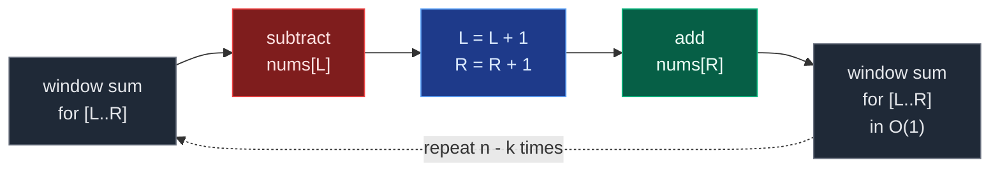
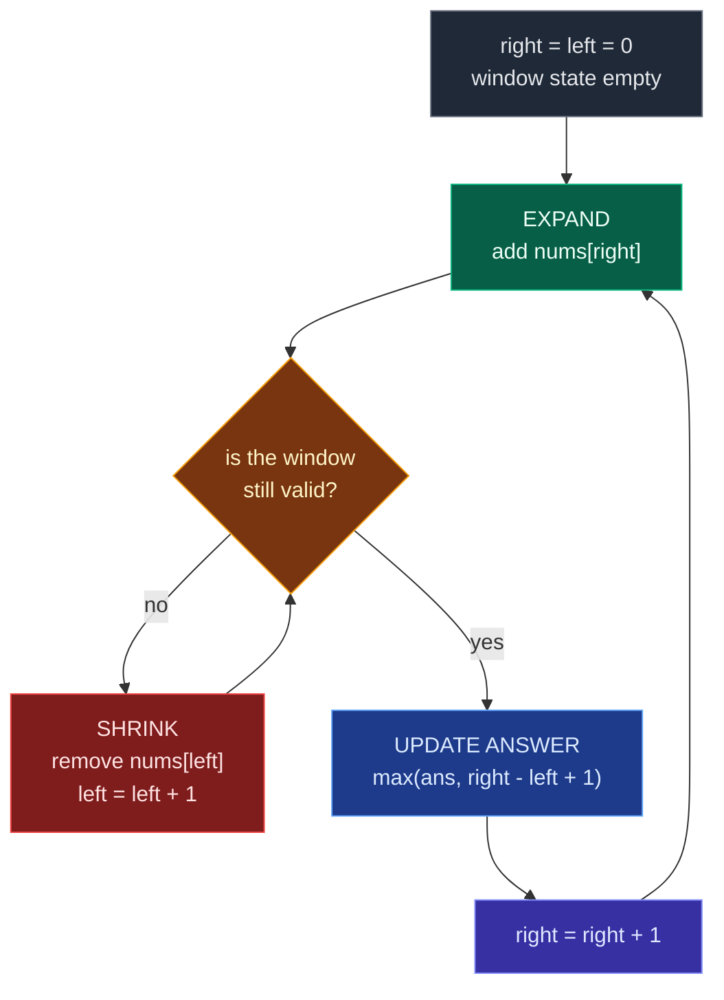

# 01. Introduction to Sliding Window

Sliding Window is the two-pointer technique for **contiguous** regions. Whenever a problem asks about a subarray or a substring, neighbouring candidates overlap almost completely — `[2,1,5]` and `[1,5,1]` share two of their three elements. Brute force throws that overlap away and recomputes every range from scratch, which costs `O(n^2)`. A sliding window keeps the *state* of the current region between a left boundary `left` and a right boundary `right`, and repairs that state incrementally as the boundaries move. Both pointers only ever move forward, so the whole scan collapses to `O(n)`.

## 1. What a Sliding Window Is

Take the array and the question the tutor opens with:

```text
nums = [2, 1, 5, 1, 3, 2]
Find the maximum sum of any 3 consecutive elements.
```

The load-bearing word is **consecutive** — equivalently, **contiguous**. Only unbroken runs count:

```text
[2,1,5] = 8
  [1,5,1] = 7
    [5,1,3] = 9
      [1,3,2] = 6
```

The answer is `9`. Visually, a fixed block of three cells travels left to right across the array — a physical window sliding along:

```text
nums = [2, 1, 5, 1, 3, 2]
        --------
window [2, 1, 5]
slide ->
           --------
          [1, 5, 1]
slide ->
              --------
             [5, 1, 3]
```

A sliding window means: **instead of recalculating every new region from scratch, maintain information about the current contiguous region and update it as the region moves.**

Two boundaries define the window at all times:

```text
index:   0  1  2  3  4  5
nums:    2  1  5  1  3  2
         ^     ^
         L     R
```

and the single most reused formula in the whole topic is the window length:

```text
window size = R - L + 1
```

The `+ 1` is there because **both** boundaries are included. With `L = 2` and `R = 4` the indices are `2, 3, 4` — three elements — but `4 - 2 = 2`. Only `4 - 2 + 1 = 3` is right. Off-by-one here is the most common sliding-window bug.

## 2. Why It Beats the Nested Loop

Brute force for the fixed-window question recomputes each window:

```python
def max_sum_subarray(nums, k):
    # Store array length.
    n = len(nums)
    # Initially there is no maximum.
    max_sum = float("-inf")
    # Try every possible starting point.
    for i in range(n - k + 1):
        # Calculate the current window from scratch.
        current_sum = 0
        # Visit exactly k elements.
        for j in range(i, i + k):
            # Add current element.
            current_sum += nums[j]
        # Update maximum.
        max_sum = max(max_sum, current_sum)
    # Return maximum.
    return max_sum
```

**How many windows are there?** For array length `n` and window length `k`, the starting positions are `0, 1, ..., n - k`, so the count is:

```text
n - k + 1
```

With `n = 6`, `k = 3` the starts are `0,1,2,3` — exactly `6 - 3 + 1 = 4`. Each of those windows costs `O(k)`, so the total is `O((n - k + 1) * k)`, usually written `O(nk)`, and when `k` is close to `n` that is `O(n^2)`.

Now look at what actually changes between two adjacent windows:

```text
old window:
[2, 1, 5]
 ^  -----
 |    |
remove  reused

new window:
   [1, 5, 1]
    -----  ^
      |    |
    reused add
```

Only **two** things changed: one element left, one element entered. The middle was already summed. So:

```text
newSum = oldSum - outgoingElement + incomingElement
7      = 8      - 2               + 1
```

That single line is the entire optimisation:

| Stage | Brute force | Sliding window |
|:---|:---|:---|
| First window | `O(k)` | `O(k)` |
| Each later window | `O(k)` recompute | `O(1)` remove + add |
| Total | `O(nk)` | `O(k) + (n - k) * O(1)` = `O(n)` |

**Reuse previous work** instead of **recalculate everything**.

## 3. Fixed-Size Windows

The window size is pinned by the problem — always `k`. Typical phrasings: maximum sum of a subarray of size `k`, average of every `k` elements, first negative number in every `k` elements, maximum in every window of size `k`.

The tutor's own setup uses `arr = [-1, 2, 3, 3, 4, 5, -1]`, `k = 4`. The first window is indices `l = 0` to `r = k - 1 = 3`, holding `[-1, 2, 3, 3]` with `sum = 7`. Then each slide drops `arr[l]` and picks up `arr[r]`:

```text
arr =  [-1   2   3   3   4   5  -1]        k = 4
index    0   1   2   3   4   5   6

l=0 r=3 [-1   2   3   3]                   sum = 7    <- first window, O(k)
          x                +
l=1 r=4      [ 2   3   3   4]              sum = 7 - (-1) + 4 = 12
              x                +
l=2 r=5          [ 3   3   4   5]          sum = 12 - 2 + 5 = 15
                  x                +
l=3 r=6              [ 3   4   5  -1]      sum = 15 - 3 + (-1) = 11
```

Maximum = `15`. Here is the same mechanism as a diagram:



**Style 1 — build the first window, then slide:**

```python
def max_sum_subarray(nums, k):
    # Store number of elements.
    n = len(nums)
    # Handle invalid k.
    if k > n:
        return None
    # Calculate the first window.
    window_sum = sum(nums[:k])
    # Initially, the first window is the maximum.
    max_sum = window_sum
    # Start adding elements from index k onward.
    for right in range(k, n):
        # Element that leaves the window.
        left = right - k
        # Remove old left element.
        window_sum -= nums[left]
        # Add the new right element.
        window_sum += nums[right]
        # Update maximum.
        max_sum = max(max_sum, window_sum)
    # Return result.
    return max_sum
```

**Style 2 — the reusable fixed-window template**, which grows the window and trims it back to size:

```python
def fixed_window(nums, k):
    left = 0
    window_state = 0
    answer = ...
    for right in range(len(nums)):
        # 1. Add nums[right] into window state.
        window_state += nums[right]
        # 2. If window becomes bigger than k,
        # remove nums[left].
        if right - left + 1 > k:
            window_state -= nums[left]
            left += 1
        # 3. Once size is exactly k,
        # process the window.
        if right - left + 1 == k:
            answer = ...
    return answer
```

Mentally: **add right -> too big? remove left -> size == k? record answer.** Time `O(n)`, auxiliary space `O(1)`.

**The invariant worth saying out loud in an interview:** *"At every iteration, `window_sum` holds the sum of exactly the current `k` elements."* Because that invariant is restored by one subtraction and one addition, the next state costs constant time.

## 4. Variable-Size Windows

Now the question changes shape:

```text
Find the longest subarray whose sum <= K.
arr = [2, 5, 1, 7, 10]     K = 14
```

No size is given. We do not know in advance whether the answer holds 2, 3, or 4 elements, so the window has to breathe. The brute force is the familiar double loop:

```text
maxLen = 0
for (i = 0 -> n-1)
    sum = 0
    for (j = i -> n-1)
        sum = sum + arr[j];
        if (sum <= K)
            maxLen = max(maxLen, j - i + 1);
        else if (sum > K) break;

TC -> O(n^2)      SC -> O(1)
```

The optimal version keeps two pointers and only two moves — **expand `r`**, **shrink `l`**:

```text
arr = [2, 5, 1, 7, 10]    K = 14

l=0 r=0  [2]               sum = 2   <= 14  valid   maxLen = 1
l=0 r=1  [2,5]             sum = 7   <= 14  valid   maxLen = 2
l=0 r=2  [2,5,1]           sum = 8   <= 14  valid   maxLen = 3
l=0 r=3  [2,5,1,7]         sum = 15  >  14  INVALID
         shrink: drop arr[0] = 2
l=1 r=3    [5,1,7]         sum = 13  <= 14  valid   maxLen stays 3
l=1 r=4    [5,1,7,10]      sum = 23  >  14  INVALID
         shrink: drop arr[1] = 5
l=2 r=4      [1,7,10]      sum = 18  >  14  INVALID
         shrink: drop arr[2] = 1
l=3 r=4        [7,10]      sum = 17  >  14  INVALID
         shrink: drop arr[3] = 7
l=4 r=4          [10]      sum = 10  <= 14  valid   maxLen stays 3
```

Answer: `3`.



**Why is this still `O(n)` when there is a loop inside a loop?** Count pointer movements, not loop nestings. `right` advances at most `n` times over the entire run. `left` also advances at most `n` times over the entire run, because it never goes backwards. Total movement is `n + n = 2n`, so the algorithm is `O(2n) = O(n)` — the tutor writes the complexity as `TC -> O(N + N)`, `SC -> O(1)` for exactly this reason. This amortized argument is a very strong interview point.

## 5. The Expand / Shrink Skeleton

This is the structure to memorise instead of fifty individual solutions:

```python
def sliding_window(nums, k):
    # Left boundary.
    left = 0
    # Information about current window.
    current = 0
    # Final answer.
    answer = 0
    # Expand the right boundary.
    for right in range(len(nums)):
        # Include nums[right].
        current += nums[right]
        # Shrink until the window becomes valid.
        while current > k:
            # Remove leftmost element.
            current -= nums[left]
            # Move left boundary.
            left += 1
        # Current window is valid.
        answer = max(
            answer,
            right - left + 1
        )
    return answer
```

In the tutor's pseudocode form:

```text
l = 0, r = 0, sum = 0, maxLen = 0

while (r < n)
{
    sum = sum + arr[r];                       <- expand

    while (sum > K)                           <- shrink
    {
        sum = sum - arr[l];
        l = l + 1;
    }

    if (sum <= K)
        maxLen = max(maxLen, r - l + 1);      <- record

    r = r + 1;
}
print(maxLen);
```

**`while`, not `if`.** This is one of the most common sliding-window mistakes. Removing a single element may not be enough to restore validity:

```text
sum = 30, K = 14
remove one -> sum = 24   still invalid
remove one -> sum = 18   still invalid
remove one -> sum = 12   now valid
```

An `if` would leave the window broken and every later answer wrong. (The `O(n)` amortized argument still holds with the `while`, because `left` is bounded by `n` in total.) There is a useful variant worth knowing: if you only ever need the *length* of the longest window and never the window itself, an `if` that shrinks at most one step per expansion works too — the window then never shrinks, it only refuses to grow, which still leaves `maxLen` correct. That is the `O(N)` single-pass trick; the `while` form is the one that is always safe.

**The three structures that cover most interview problems:**

```text
FIXED WINDOW                 LONGEST VARIABLE            SHORTEST VARIABLE
---------------------------  --------------------------  --------------------------
Add right                    Add right                   Add right
if size > k:                 while invalid:              while valid:
    remove left                  remove left                 answer = min(answer, R-L+1)
    left++                       left++                      remove left
if size == k:                answer = max(answer,             left++
    calculate answer                   R-L+1)
```

Note the inversion in the last column. For **longest**: invalid -> shrink, valid -> record. For **shortest**: valid -> record *and keep shrinking*. Mixing these two up causes a large share of interview failures.

The four families you will eventually see are:

```text
SLIDING WINDOW
|
|-- 1. Fixed Window
|      max/min of every K elements
|
|-- 2. Longest Window
|      longest subarray/substring satisfying condition
|
|-- 3. Number of Windows
|      count subarrays satisfying condition
|
|-- 4. Shortest / Minimum Window
       smallest window satisfying condition
```

Family 3 deserves one note now, because it is solved with a trick rather than a new template. To count subarrays with **sum exactly K**, do not try to build a window that is exactly right. Instead solve the easier "at most" version twice:

```text
x = number of subarrays with sum <= K
y = number of subarrays with sum <= (K - 1)
answer = x - y
```

## 6. When Sliding Window Is Valid

Sliding window is not licensed by the word "subarray". It is licensed by **monotonicity**: moving a boundary must change the window state in a *predictable direction*.

For non-negative values and a sum condition, that holds perfectly:

```text
all values >= 0
expand right -> sum stays the same or increases
shrink left  -> sum stays the same or decreases
```

Because of that, once a window is too big, the only way to repair it is to move `left` forward — and once it is valid, extending `right` is the only way to improve the length. The search space is ordered, so two forward-only pointers suffice.

**Why negatives break sum-windows.** Suppose:

```text
nums = [5, -10, 20]
```

Now a window that looks invalid right now may become valid purely by *expanding*, because the next value might be negative. And shrinking from the left might *increase* the sum, if the element you removed was negative:

```text
expand -> sum may increase OR decrease
shrink -> sum may increase OR decrease
```

The monotonic reasoning collapses, and with it the correctness of the two-pointer sweep. `left` can no longer be advanced safely, because a better answer might still start behind it. This is a favourite interviewer trap. For negative-number sum problems reach instead for **prefix sums + a hash map** (subarray sum equals K), a **monotonic deque** (shortest subarray with sum at least K), or **binary search** on the answer.

The condition generalises beyond sums. In *longest substring without repeating characters*, expanding can introduce a duplicate and shrinking can remove it — the violation is always repairable by moving `left` forward, and never by moving it backward. That is the real pattern:

```text
condition can be repaired by moving L forward   ->   sliding window applies
```

And the window state itself is not always a sum. It can be a frequency map, a count of zeros, a number of distinct characters, or a max/min maintained in a deque:

| Window state | Maintained with | Typical problem |
|:---|:---|:---|
| Sum | `window_sum += nums[right]` | Max sum of size `k` |
| Frequency map | `freq[s[right]] += 1` | Anagrams, permutation in string |
| Count of zeros | `if nums[right] == 0: zeros += 1` | Max consecutive ones III |
| Distinct count | `freq[x] += 1; if freq[x] == 1: distinct += 1` | K distinct characters |
| Max / min | monotonic `deque` | Sliding window maximum |

So sliding window is not an algorithm about sums. It is a framework: **maintain information about a contiguous range efficiently.**

## 7. Recognising the Pattern

Trigger words: *subarray, substring, contiguous, consecutive, window, longest, shortest, maximum, minimum, at most, at least, exactly*.

| Problem phrasing | Window type | What to maintain | Answer update |
|:---|:---|:---|:---|
| "maximum/minimum sum of size `k`" | Fixed, size `k` | running sum | at every `size == k` |
| "average of every `k` elements" | Fixed, size `k` | running sum | at every `size == k` |
| "maximum in every window of size `k`" | Fixed, size `k` | monotonic deque | at every `size == k` |
| "longest subarray with sum `<= K`" | Variable, longest | running sum | after shrinking to valid |
| "longest substring without repeats" | Variable, longest | frequency map / last-seen index | after shrinking to valid |
| "longest subarray with at most `K` zeros" | Variable, longest | zero count | after shrinking to valid |
| "shortest subarray with sum `>= K`" | Variable, shortest | running sum | *while still valid*, then shrink |
| "minimum window substring" | Variable, shortest | need/have frequency counts | *while still valid*, then shrink |
| "count subarrays with sum exactly `K`" | Two "at most" runs | running sum | `f(K) - f(K-1)` |
| "count subarrays with at most `K` distinct" | Variable, counting | distinct count | `ans += right - left + 1` |
| "pick from both ends, take `k`" | Fixed, size `n - k`, complement | running sum of the middle | `total - min window` |

The checklist to run in order when you meet a new problem:

```text
1. Is the problem asking about a contiguous region?
             |
            YES
             v
2. Is the window size fixed?
       /             \
     YES             NO
      v               v
 Fixed Window    Variable Window

3. What information must I maintain?
   sum? frequency? distinct count? max/min?
4. When do I expand R?
5. When does the window become invalid?
6. How do I repair it using L?
7. When should I update the answer?
8. Does moving L/R have predictable behaviour?
   If not -> sliding window may not apply.
```

**The answer to give when an interviewer asks "what is sliding window?":**

> Sliding window is a two-pointer technique used mainly for contiguous subarray or substring problems. Instead of recomputing each overlapping range from scratch, we maintain the state of the current window and update it incrementally as the boundaries move. In a fixed-size window, we remove the outgoing element and add the incoming element. In a variable-size window, we expand the right boundary and shrink the left boundary whenever a condition is violated. Since both pointers only move forward, many problems that would take `O(n^2)` reduce to `O(n)`.

## 8. Common Pitfalls

| Pitfall | Why it breaks | Fix |
|:---|:---|:---|
| Writing `R - L` for the window size | Both boundaries are inclusive, so the count is one short | `R - L + 1` |
| Using `if` instead of `while` to shrink | One removal may not restore validity, so the window stays broken for the rest of the scan | `while invalid: remove left; left += 1` |
| Recording the answer before shrinking | For longest-window problems you would record an invalid window | Shrink first, record after |
| Using the longest-window shape for a shortest-window problem | For shortest you record *while valid and keep shrinking*; the longest template records once and stops | Swap the `while` condition and move the update inside it |
| Forgetting to remove state when `left` advances | The frequency map or count drifts out of sync with `[L..R]` | Every `left += 1` must be paired with an undo of `nums[left]` |
| Applying a sum-window to arrays with negatives | Expanding and shrinking no longer move the sum monotonically | Prefix sums + hash map, or a monotonic deque |
| Moving `left` backwards to "retry" a window | Destroys the amortized `O(n)` bound and usually the correctness too | Both pointers move forward only |
| Not handling `k > n` for fixed windows | `sum(nums[:k])` silently returns a short window and the answer is wrong | Guard explicitly and return early |
| Initialising `max_sum = 0` when values can be negative | Every real window is worse than `0`, so `0` is returned | Initialise to `float("-inf")` or to the first window's value |
| Assuming "pick from both ends" is not a window problem | The *unpicked* middle is contiguous even when the picked part is not | Reframe as the complementary fixed window of size `n - k` |

**What to retain.** Do not memorise fifty solutions. Memorise the transformation — *generate every subarray and recalculate* at `O(n^2)` versus *maintain `[L..R]`, expand `R`, drop obsolete elements with `L`, reuse the previous state* at `O(n)` — plus one formula, `window length = R - L + 1`, and one thought process:

```text
Expand -> violate -> shrink -> valid -> update
```
