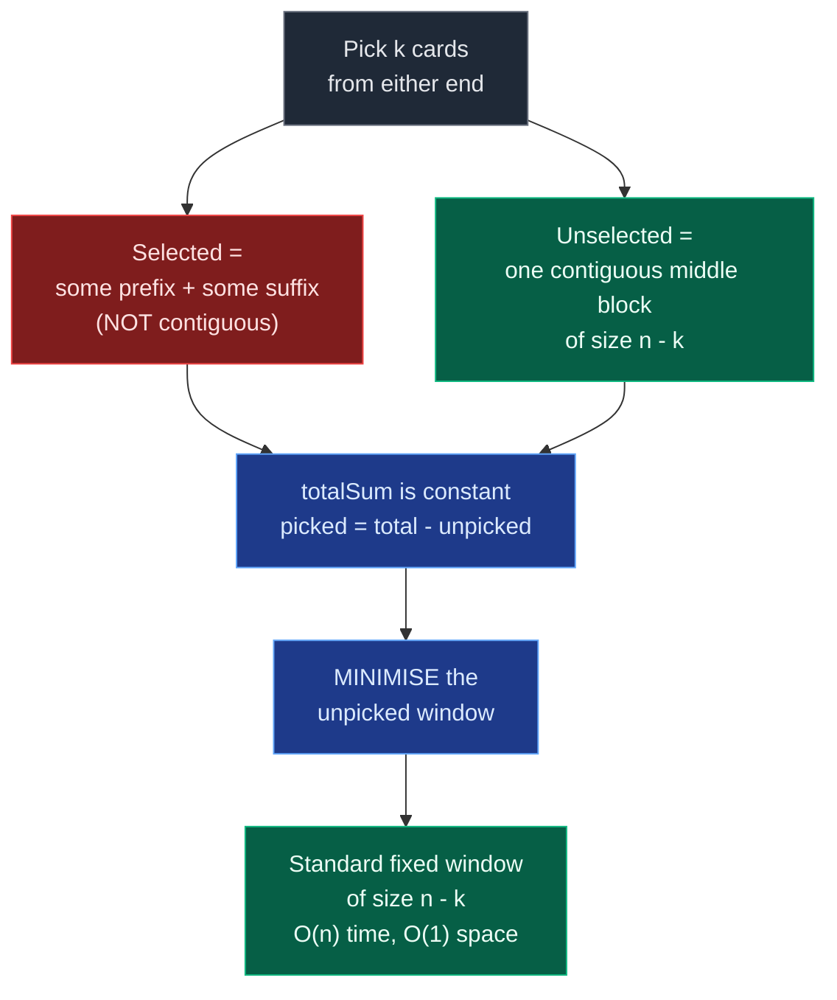

# 01. 1423. Maximum Points You Can Obtain from Cards

| Difficulty | Pattern | Source | Time | Space |
|:---:|:---:|:---:|:---:|:---:|
| **Medium** | Fixed Window / Complement | [1423. Maximum Points You Can Obtain from Cards](https://leetcode.com/problems/maximum-points-you-can-obtain-from-cards/) | `O(n)` | `O(1)` |

## 1. Problem Statement

There are several cards **arranged in a row**, and each card has an associated number of points. The points are given in the integer array `cardPoints`.

In one step, you can take one card from the beginning or from the end of the row. You have to take exactly `k` cards.

Your score is the sum of the points of the cards you have taken.

Given the integer array `cardPoints` and the integer `k`, return the *maximum score* you can obtain.

### Examples

```text
Input:  cardPoints = [1,2,3,4,5,6,1], k = 3
Output: 12
Explanation: After the first step, your score will always be 1. However, choosing
the rightmost card first will maximize your total score. The optimal strategy is
to take the three cards on the right, giving a final score of 1 + 6 + 5 = 12.
```

```text
Input:  cardPoints = [2,2,2], k = 2
Output: 4
Explanation: Regardless of which two cards you take, your score will always be 4.
```

```text
Input:  cardPoints = [9,7,7,9,7,7,9], k = 7
Output: 55
Explanation: You have to take all the cards. Your score is the sum of points of
all cards.
```

### Constraints

- `1 <= cardPoints.length <= 10^5`
- `1 <= cardPoints[i] <= 10^4`
- `1 <= k <= cardPoints.length`

## 2. Core Theory

At first glance this is not a subarray problem at all. The cards you take come from **both ends**, so the selected set is a prefix plus a suffix — two disjoint pieces, not one contiguous block. That is exactly why the problem is a good first sliding-window exercise: **the window is hidden.**

**The complement insight.** Stop asking which `k` cards to take. Ask which cards you **leave behind**. You take `k` cards out of `n`, so exactly `n - k` cards remain — and because you may only remove from the two ends, whatever remains must be **one contiguous block in the middle**. You can never produce a gap like `[3, X, 5]`, because there is no legal move that plucks a card out of the interior.

```text
Original array
[ LEFT PICKED ][     NOT PICKED     ][ RIGHT PICKED ]
 XXXXX XXXXXXX                        XXXXX XXXXXXX
                <---- window ---->
                  size = n - k
                always contiguous
```

The total sum of all cards is a constant, so:

```text
pickedSum + remainingSum = totalSum
pickedSum = totalSum - remainingSum
```

Maximising `pickedSum` is therefore *identical* to minimising `remainingSum`. And since that remaining block always has the fixed size `n - k`, the confusing two-ended choice collapses into the most standard fixed-size window problem there is:

```text
answer = totalSum - (minimum sum over all windows of size n - k)
```



**Worked on the LeetCode example.** With `cardPoints = [1,2,3,4,5,6,1]` and `k = 3`, the total is `22` and the window size is `7 - 3 = 4`:

```text
[1,2,3,4] 5 6 1     sum = 10   ->   picked = 22 - 10 = 12
1 [2,3,4,5] 6 1     sum = 14   ->   picked = 22 - 14 =  8
1 2 [3,4,5,6] 1     sum = 18   ->   picked = 22 - 18 =  4
1 2 3 [4,5,6,1]     sum = 16   ->   picked = 22 - 16 =  6

minimum window = 10   ->   answer = 12
```

Notice what the minimum window `[1,2,3,4]` corresponds to: leaving the first four cards means taking the last three, `5 + 6 + 1 = 12`. The window and the selection are two views of the same decision.

**The alternative framing — start left, then swap one at a time.** There is a second route to `O(1)` space that never mentions the middle block. Begin by taking all `k` cards from the left. Then repeatedly give back the rightmost card of your left selection and take one more card from the right end instead. Each swap is one subtraction and one addition, and the `k + 1` states you visit are exactly the `k + 1` legal distributions:

```text
cardPoints = [1,2,3,4,5,6,1], k = 3

[1,2,3] 4 5 6 1     score = 6                 3 left, 0 right
[1,2] 3 4 5 6 [1]   score = 6 - 3 + 1 =  4    2 left, 1 right
[1] 2 3 4 5 [6,1]   score = 4 - 2 + 6 =  8    1 left, 2 right
1 2 3 4 [5,6,1]     score = 8 - 1 + 5 = 12    0 left, 3 right
```

**Why only `k + 1` possibilities?** If you take `x` cards from the left you are forced to take `k - x` from the right, and `x` ranges over `0, 1, ..., k`. That is `k + 1` outcomes, not `2^k`, because the *order* of the moves is irrelevant — `L, R, L` and `R, L, L` both end up meaning "2 from the left, 1 from the right". Only the counts matter, and that is a nice observation to volunteer in an interview.

**Why `k == n` must be handled.** The complement window has size `n - k`. When `k == n` that size is `0`, and a zero-length window is meaningless — `sum(cardPoints[:0])` is `0`, the slide loop from index `0` would add and remove the same element each step, and `min_window_sum` would settle on `0`, which happens to give the right answer here but only by accident of the array being non-negative. Guard it explicitly: if you must take every card, return `sum(cardPoints)` immediately. The constraint `1 <= k <= cardPoints.length` guarantees `k == n` is reachable, and Example 3 tests it directly.

**Why greedy fails.** The obvious idea — always grab the larger of the two endpoints — is wrong, and interviewers know it:

```text
cardPoints = [1, 100, 3, 4, 5], k = 2

greedy: right end 5 > left end 1, take 5
        then right end 4 > left end 1, take 4
        score = 9

optimal: take 1 (the small card!) to expose 100, then take 100
        score = 101
```

A locally biggest endpoint does not imply a globally optimal selection, because taking a cheap card can unlock an expensive one behind it. This is why the problem needs the complement transformation rather than a one-line greedy.

## 3. Edge Cases

| Case | Input | Expected | Why it matters |
|:---|:---|:---:|:---|
| Single card | `[5], k = 1` | `5` | `n == 1` and `k == n` at once; window size is `0` |
| Take everything | `[9,7,7,9,7,7,9], k = 7` | `55` | `k == n` makes the window size `0` — needs the explicit guard |
| One card only | `[5,2,9], k = 1` | `9` | Must consider both endpoints, not just the left |
| Best card at the left end | `[9,2,5], k = 1` | `9` | Catches code that only ever inspects the suffix |
| All identical | `[2,2,2,2], k = 2` | `4` | Every window ties; `min` must still return a valid value |
| Greedy trap | `[1,100,3,4,5], k = 2` | `101` | Endpoint-greedy returns `9`; proves greedy is wrong |
| Big values at both ends | `[100,1,1,1,100], k = 2` | `200` | Optimal split is `1` left + `1` right, an interior split |
| Minimum window at the start | `[1,1,9,9,9], k = 3` | `27` | Answer is the pure suffix; window never slides off index `0` |
| Minimum window at the end | `[9,9,9,1,1], k = 3` | `27` | Answer is the pure prefix; window must reach the last index |
| Maximum size | `10^5` cards | linear | `O(nk)` or `O(k^2)` brute force with `k = n` times out |

Note the constraint `1 <= cardPoints[i] <= 10^4`: **all points are strictly positive**. That is what makes "minimise the middle" well-behaved. If negatives were allowed the complement argument would still hold — it is pure arithmetic, `picked = total - unpicked`, and does not depend on sign — but the *fixed* window size keeps it valid regardless, which is worth knowing: this problem survives negatives, unlike variable-size sum windows.

## 4. Brute Force Solution: Try Every Left/Right Split

### Intuition

We try all possible ways of taking cards. Suppose we take `i` cards from the left. Then we must take `k - i` cards from the right. Try every `i` from `0` to `k`, and for each case calculate the total points from scratch.

### Approach

1. For every `left_count` from `0` to `k`.
2. Sum the first `left_count` cards.
3. Sum the last `k - left_count` cards.
4. Track the maximum over all splits.

### Dry Run

```text
cardPoints = [1,2,3,4,5,6,1], k = 3
```

```text
3 left + 0 right:  [1,2,3] 4 5 6 1     1 + 2 + 3 =  6
2 left + 1 right:  [1,2] 3 4 5 6 [1]   1 + 2 + 1 =  4
1 left + 2 right:  [1] 2 3 4 5 [6,1]   1 + 6 + 1 =  8
0 left + 3 right:  1 2 3 4 [5,6,1]     5 + 6 + 1 = 12
```

Maximum: `12`.

### Code

```python
# Define the class solution
class Solution:

    # Define the method
    def maxScore(self, cardPoints: List[int], k: int) -> int:

        # Store total number of cards.
        n = len(cardPoints)

        # Store the best answer found so far.
        max_points = 0

        # Try taking i cards from left and k - i cards from right.
        for i in range(k + 1):

            # Store current points for this combination.
            current_points = 0

            # Take first i cards from the left.
            for left_index in range(i):

                # Add left card points.
                current_points += cardPoints[left_index]

            # Take remaining k - i cards from the right.
            for right_index in range(k - i):

                # Add right card points.
                current_points += cardPoints[n - 1 - right_index]

            # Update maximum points.
            max_points = max(max_points, current_points)

        # Return the best answer.
        return max_points
```

### Complexity

| Measure | Complexity | Why |
|:---|:---:|:---|
| **Time** | `O(k^2)` | There are `k + 1` splits, and each split re-sums up to `k` cards. |
| **Space** | `O(1)` | Only a few counters are stored. |

With `k = n = 10^5` this is `10^10` operations and will time out.

## 5. Better Solution: Prefix and Suffix Sums

### Intuition

Instead of recalculating the left and right sums again and again, precompute them once:

```text
prefix[i] = sum of first i cards
suffix[i] = sum of last i cards
```

Then every split is a single lookup:

```text
points = prefix[i] + suffix[k - i]
```

### Approach

1. Build `prefix[0..k]` where `prefix[i] = prefix[i-1] + cardPoints[i-1]`.
2. Build `suffix[0..k]` where `suffix[i] = suffix[i-1] + cardPoints[n-i]`.
3. For each `left_count` in `0..k`, score is `prefix[left_count] + suffix[k - left_count]`.
4. Return the maximum.

### Dry Run

```text
cardPoints = [1,2,3,4,5,6,1], k = 3, n = 7

prefix = [0, 1, 3, 6]        (0, 1, 1+2, 1+2+3)
suffix = [0, 1, 7, 12]       (0, 1, 1+6, 1+6+5)

left_count = 0 -> prefix[0] + suffix[3] = 0 + 12 = 12
left_count = 1 -> prefix[1] + suffix[2] = 1 +  7 =  8
left_count = 2 -> prefix[2] + suffix[1] = 3 +  1 =  4
left_count = 3 -> prefix[3] + suffix[0] = 6 +  0 =  6

max = 12
```

### Code

```python
# Define the class solution
class Solution:

    # Define the method
    def maxScore(self, cardPoints: List[int], k: int) -> int:

        # Store total number of cards.
        n = len(cardPoints)

        # prefix[i] stores sum of first i cards.
        prefix = [0] * (k + 1)

        # suffix[i] stores sum of last i cards.
        suffix = [0] * (k + 1)

        # Build prefix sum for first k cards.
        for i in range(1, k + 1):

            # Add current left card to previous prefix sum.
            prefix[i] = prefix[i - 1] + cardPoints[i - 1]

        # Build suffix sum for last k cards.
        for i in range(1, k + 1):

            # Add current right card to previous suffix sum.
            suffix[i] = suffix[i - 1] + cardPoints[n - i]

        # Store the maximum score.
        max_points = 0

        # Try every split between left and right.
        for left_count in range(k + 1):

            # Cards taken from right side.
            right_count = k - left_count

            # Calculate score for this split.
            current_points = prefix[left_count] + suffix[right_count]

            # Update answer.
            max_points = max(max_points, current_points)

        # Return maximum points.
        return max_points
```

### Complexity

| Measure | Complexity | Why |
|:---|:---:|:---|
| **Time** | `O(k)` | Three linear passes over `k + 1` entries. |
| **Space** | `O(k)` | Two arrays of length `k + 1`. |

Better than brute force, but the two arrays are avoidable.

## 6. Optimal Solution 1: Take First `k` Cards, Then Shift Choices

### Intuition

Start by taking all `k` cards from the left. Then slowly replace one card from the left side with one card from the right side. Each replacement is a constant-time update of the running score, so the `k + 1` splits are visited in `O(k)` total with no extra arrays.

### Approach

1. `current_score = sum(cardPoints[:k])`, and this is the initial `max_score`.
2. Keep `left` on the last card currently selected from the left and `right` on the next card to take from the right end.
3. Repeat `k` times: remove `cardPoints[left]`, add `cardPoints[right]`, update the maximum, then move both pointers backward.

### Dry Run

The tutor's own example:

```text
arr = [6, 2, 3, 4, 7, 2, 1, 7, 1]     k = 4
index  0  1  2  3  4  5  6  7  8

Start: take the first 4 from the left.
[6,2,3,4] 7 2 1 7 1
lsum = 15    rsum = 0     sum = 15    <- max = 15
```

Each step gives back one left card and takes one more right card:

```text
lsum   rsum   sum
 15      0     15
 11      1     12     drop arr[3]=4,  take arr[8]=1
  8      8     16     drop arr[2]=3,  take arr[7]=7    <- maximum
  6      9     15     drop arr[1]=2,  take arr[6]=1
  0     11     11     drop arr[0]=6,  take arr[5]=2
```

The best is `16`, from `[6,2] ... [7,1]` — two cards off the left, two off the right.

### Code

```python
# Define the class solution
class Solution:

    # Define the method
    def maxScore(self, cardPoints: List[int], k: int) -> int:

        # Store total number of cards.
        n = len(cardPoints)

        # Take first k cards from the left initially.
        current_score = sum(cardPoints[:k])

        # Store this as initial maximum score.
        max_score = current_score

        # Replace cards one by one from left side with right side.
        for i in range(1, k + 1):

            # Remove one card from the selected left part.
            current_score -= cardPoints[k - i]

            # Add one card from the right side.
            current_score += cardPoints[n - i]

            # Update maximum score.
            max_score = max(max_score, current_score)

        # Return maximum score.
        return max_score
```

The same idea written with two explicit pointers, which is how the tutor codes it:

```python
# Define the class solution
class Solution:

    # Define the method
    def maxScore(self, cardPoints: List[int], k: int) -> int:

        # Define the size
        size= len(cardPoints)

        # Define the left pointer
        left= k-1

        # Define the right pointer
        right= size - 1

        # Define the current pick
        current_pick= sum(cardPoints[:k])

        # Define the max pick
        max_pick= current_pick

        # Iterate on the k size
        for index in range(k):

            # Compute the current pick
            current_pick += (cardPoints[right] - cardPoints[left])

            # Update if the max found
            max_pick= max(max_pick, current_pick)

            # Update the pointers
            left= left-1
            right= right-1

        # Return the max pick
        return max_pick
```

### Complexity

| Measure | Complexity | Why |
|:---|:---:|:---|
| **Time** | `O(k)` | One `O(k)` initial sum plus `k` constant-time swaps. Since `k <= n`, worst case `O(n)`. |
| **Space** | `O(1)` | Only running counters. |

Note this approach never needs the `k == n` guard: when `k == n` the loop simply rotates the entire selection and every state sums to the total.

## 7. Optimal Solution 2: Complement Sliding Window

### Intuition

Since we take `k` cards, we leave `n - k` cards, and those must form a continuous subarray in the middle. So:

```text
answer = total_sum - minimum_sum_of_subarray_of_size(n - k)
```

This is a clean fixed-size sliding window problem — the version worth explaining in a sliding-window interview, because it shows the transformation rather than a clever shuffle.

### Approach

1. If `k == n`, return `sum(cardPoints)` — the window would have size `0`.
2. Compute `total_sum` and `window_size = n - k`.
3. Sum the first window `cardPoints[:window_size]` and treat it as the current minimum.
4. Slide: for each `right` from `window_size` to `n - 1`, add `cardPoints[right]`, remove `cardPoints[right - window_size]`, update the minimum.
5. Return `total_sum - min_window_sum`.

### Dry Run

```text
cardPoints = [1, 2, 3, 4, 5, 6, 1]
k = 3
n = 7
window_size = n - k = 7 - 3 = 4
total_sum = 1 + 2 + 3 + 4 + 5 + 6 + 1 = 22
```

Initial window:

```text
[1, 2, 3, 4] 5 6 1
window_sum = 10
min_window_sum = 10
```

Slide, remove one and add one:

```text
Window 2 — remove 1, add 5
1 [2, 3, 4, 5] 6 1
window_sum = 10 - 1 + 5 = 14
min_window_sum = 10

Window 3 — remove 2, add 6
1 2 [3, 4, 5, 6] 1
window_sum = 14 - 2 + 6 = 18
min_window_sum = 10

Window 4 — remove 3, add 1
1 2 3 [4, 5, 6, 1]
window_sum = 18 - 3 + 1 = 16
min_window_sum = 10
```

Final answer:

```text
total_sum - min_window_sum
= 22 - 10
= 12
```

### Code

```python
# Define the class solution
class Solution:

    # Define the method
    def maxScore(self, cardPoints: List[int], k: int) -> int:

        # Store total number of cards.
        n = len(cardPoints)

        # If we need to take all cards, return total sum directly.
        if k == n:

            # Return sum of all card points.
            return sum(cardPoints)

        # Calculate the number of cards that will remain unpicked.
        window_size = n - k

        # Calculate the total sum of all cards.
        total_sum = sum(cardPoints)

        # Calculate the sum of the first window of size n-k.
        window_sum = sum(cardPoints[:window_size])

        # Store the minimum window sum found so far.
        min_window_sum = window_sum

        # Start sliding the window from index window_size to n - 1.
        for right in range(window_size, n):

            # Add the new card entering the window from the right.
            window_sum += cardPoints[right]

            # Remove the old card leaving the window from the left.
            window_sum -= cardPoints[right - window_size]

            # Update the minimum window sum.
            min_window_sum = min(min_window_sum, window_sum)

        # Maximum score is total sum minus minimum unpicked subarray sum.
        return total_sum - min_window_sum
```

### Complexity

| Measure | Complexity | Why |
|:---|:---:|:---|
| **Time** | `O(n)` | `sum(cardPoints)` is `O(n)` and the slide touches each index once, so `O(n) + O(n) = O(n)`. |
| **Space** | `O(1)` | Only `total_sum`, `window_sum` and `min_window_sum`. |

## 8. Common Mistakes

| Mistake | Why it breaks | Fix |
|:---|:---|:---|
| Greedily taking the larger endpoint each step | A cheap card can shield an expensive one — `[1,100,3,4,5]`, `k = 2` gives `9` instead of `101` | Enumerate the `k + 1` splits, or use the complement window |
| Forgetting the `k == n` guard in the window solution | `window_size` becomes `0`; the slide adds and removes the same index and the loop is meaningless | `if k == n: return sum(cardPoints)` |
| Sliding a window of size `k` instead of `n - k` | Minimises the wrong block entirely; returns a number unrelated to the answer | The window is the **unpicked** middle: `window_size = n - k` |
| Returning `min_window_sum` instead of `total_sum - min_window_sum` | Returns the points you left behind, not the points you took | The complement is the whole point: subtract from the total |
| Maximising the middle window | `picked = total - unpicked`, so maximising the middle **minimises** your score | Minimise the window |
| Recomputing `sum(cardPoints[i:i+w])` inside the slide loop | Throws away the `O(1)` update and returns to `O(n * (n-k))` time | `window_sum += arr[right]; window_sum -= arr[right - w]` |
| Off-by-one on the outgoing index, e.g. `arr[right - window_size + 1]` | Removes the wrong card and the running sum drifts permanently | Outgoing index is exactly `right - window_size` |
| Initialising `max_points = 0` when using a variant that allows negatives | Every real split scores below `0`, so `0` leaks through as the answer | Seed with the first computed split, not `0` |

## 9. Interview Follow-ups

**Q: Why does the complement transformation work at all? Prove the unpicked cards are contiguous.**

A: Every legal move removes a card from one of the two current ends. So at any moment the removed set is exactly a prefix plus a suffix of the original row, and what remains is the closed interval between them. Formally, if you took `x` cards from the left and `k - x` from the right, the survivors are indices `x` through `n - (k - x) - 1`, which is one unbroken range of length `n - k`. There is no move that deletes an interior card, so a gap can never form.

**Q: Which of the two `O(1)`-space solutions would you present?**

A: For a sliding-window interview, the complement window — it demonstrates the deeper transformation of "maximise what I select" into "minimise what I do not select". Then I would add: *"we can alternatively enumerate the `k + 1` left/right splits in `O(k)` with a rolling sum,"* which is actually faster when `k` is much smaller than `n`, since it never touches the middle of the array. Mentioning both shows you understand that `O(k)` and `O(n)` differ here.

**Q: Does the solution still work if card points can be negative or zero?**

A: Yes. The identity `picked = total - unpicked` is pure arithmetic and holds for any sign. And because the window size is *fixed* at `n - k`, the usual failure mode of sum-based sliding windows — non-monotonic expansion and shrinking with negatives — never arises; we are not expanding or shrinking, only translating a rigid window. The one thing to fix is any `max_points = 0` initialisation, which silently assumes a non-negative answer.

**Q: What if you could take cards from the ends but were allowed to stop early — take *at most* `k`?**

A: With the given constraint `cardPoints[i] >= 1` every card adds value, so taking fewer than `k` is never better and the answer is unchanged. If negatives were allowed you would take the maximum over all `j` from `0` to `k` of the best score using exactly `j` cards, which the split enumeration already computes on the way — track the running maximum over every prefix length rather than only at `j = k`.

**Q: Why are there `k + 1` distributions rather than `2^k`?**

A: Each of the `k` moves is a binary left-or-right choice, so there are `2^k` move *sequences*, but many collapse to the same final selection — `L,R,L` and `R,L,L` both mean two from the left and one from the right. The outcome depends only on the count `x` taken from the left, and `x` ranges over `0..k`. So there are `k + 1` distinct results.

**Q: How would you handle `k` given as larger than `n`?**

A: The stated constraints forbid it, but defensively I would either clamp `k = min(k, n)` or reject the input. Left unguarded, `sum(cardPoints[:k])` silently returns the whole array while `window_size = n - k` goes negative, and the slicing quietly produces nonsense instead of raising.

## 10. Interview Explanation

> We need to pick exactly `k` cards from either end. Instead of directly trying all pick combinations, I observe that the cards not picked must form one continuous subarray of size `n - k`. So maximizing picked points is equivalent to minimizing the sum of this unpicked subarray. I calculate the total sum and then use a fixed-size sliding window of length `n - k` to find the minimum unpicked sum. The answer is total sum minus this minimum window sum. This takes `O(n)` time and `O(1)` extra space.

## 11. Verify

```python
from typing import List


def maxScore(cardPoints: List[int], k: int) -> int:
    # Store total number of cards.
    n = len(cardPoints)

    # If we need to take all cards, return total sum directly.
    if k == n:
        # Return sum of all card points.
        return sum(cardPoints)

    # Calculate the number of cards that will remain unpicked.
    window_size = n - k

    # Store the sum of all card points.
    total_sum = sum(cardPoints)

    # Sum the first window as the initial window sum.
    window_sum = sum(cardPoints[:window_size])

    # Track the minimum window sum seen so far.
    min_window_sum = window_sum

    # Slide the window across the remaining cards.
    for right in range(window_size, n):
        # Add the newly entered card to the window sum.
        window_sum += cardPoints[right]

        # Remove the card that has left the window.
        window_sum -= cardPoints[right - window_size]

        # Update the minimum window sum if this one is smaller.
        min_window_sum = min(min_window_sum, window_sum)

    # The picked points are the total minus the smallest unpicked window.
    return total_sum - min_window_sum


# LeetCode examples
assert maxScore([1, 2, 3, 4, 5, 6, 1], 3) == 12
assert maxScore([2, 2, 2], 2) == 4
assert maxScore([9, 7, 7, 9, 7, 7, 9], 7) == 55

# The tutor's worked example
assert maxScore([6, 2, 3, 4, 7, 2, 1, 7, 1], 4) == 16

# Single element, k == n == 1
assert maxScore([5], 1) == 5

# k == n: every card must be taken
assert maxScore([1, 2, 3], 3) == 6
assert maxScore([100, 1, 1, 1, 100], 5) == 203

# k == 1: best single endpoint, on either side
assert maxScore([5, 2, 9], 1) == 9
assert maxScore([9, 2, 5], 1) == 9

# All identical: any selection is the same
assert maxScore([2, 2, 2, 2], 2) == 4

# Greedy endpoint choice is wrong here (greedy gives 5 + 4 = 9)
assert maxScore([1, 100, 3, 4, 5], 2) == 101

# Huge values buried behind a cheap endpoint on both sides
assert maxScore([100, 1, 1, 1, 100], 2) == 200
assert maxScore([100, 1, 1, 1, 100], 3) == 201

# Minimum window may sit at the very start or the very end
assert maxScore([1, 1, 9, 9, 9], 3) == 27
assert maxScore([9, 9, 9, 1, 1], 3) == 27


def brute(cardPoints, k):
    # Enumerate every left/right split directly.
    n = len(cardPoints)

    # Store the best score found so far.
    best = 0

    # Try every count of cards taken from the left.
    for left_count in range(k + 1):
        # The remaining cards must come from the right.
        right_count = k - left_count

        # Sum the chosen left cards.
        score = sum(cardPoints[:left_count])

        # Add the chosen right cards, if any are needed.
        if right_count:
            score += sum(cardPoints[n - right_count:])

        # Update the best score seen so far.
        best = max(best, score)

    # Return the best score across all splits.
    return best


import random

random.seed(1423)
# Run many randomized trials comparing the optimal solution to brute force
for _ in range(3000):
    # Pick a random array length
    n = random.randint(1, 12)

    # Build a random array of card points
    arr = [random.randint(1, 10 ** 4) for _ in range(n)]

    # Pick a random number of cards to take
    k = random.randint(1, n)

    # Confirm the sliding window result matches the brute force result
    assert maxScore(arr, k) == brute(arr, k), (arr, k)

# Large input stays linear and correct
big = [i % 101 + 1 for i in range(10 ** 5)]
assert maxScore(big, 1) == max(big[0], big[-1])
assert maxScore(big, len(big)) == sum(big)
assert maxScore(big, 500) == brute(big, 500)

print("All tests passed")
```
