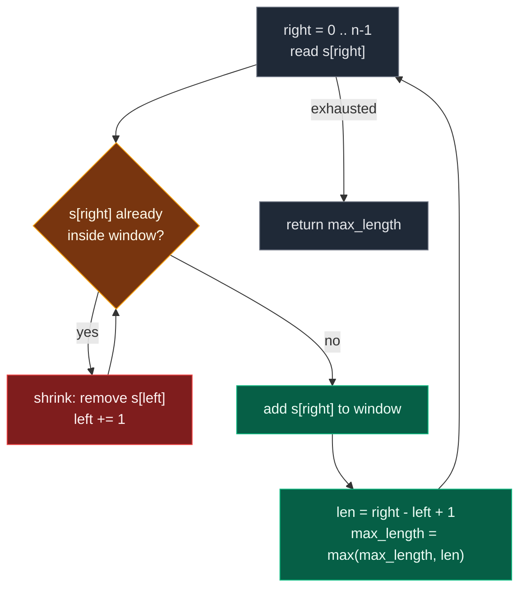

# 02. 3. Longest Substring Without Repeating Characters

| Difficulty | Pattern | Source | Time | Space |
|:---:|:---:|:---:|:---:|:---:|
| **Medium** | Variable Window + Set/Map | [3. Longest Substring Without Repeating Characters](https://leetcode.com/problems/longest-substring-without-repeating-characters/) | `O(n)` | `O(min(n, charset))` |

## 1. Problem Statement

Given a string `s`, find the length of the **longest substring** without duplicate characters.

The word **substring** is the whole problem. A substring is **contiguous** — `"pwke"` is a subsequence of `"pwwkew"`, not a substring, so it does not count.

### Examples

```text
Input:  s = "abcabcbb"
Output: 3
Explanation: The answer is "abc", with the length of 3.
             Note that "bca" and "cab" are also correct answers.
```

```text
Input:  s = "bbbbb"
Output: 1
Explanation: The answer is "b", with the length of 1.
```

```text
Input:  s = "pwwkew"
Output: 3
Explanation: The answer is "wke", with the length of 3.
             Notice that the answer must be a substring;
             "pwke" is a subsequence and not a substring.
```

### Constraints

- `0 <= s.length <= 5 * 10^4`
- `s` consists of English letters, digits, symbols and spaces

## 2. Core Theory

Three words in the title decide the whole approach:

```text
LONGEST  +  SUBSTRING  +  CONDITION
   |           |              |
maximise   contiguous   "all characters distinct"
```

`LONGEST + CONTIGUOUS + CONDITION` is the signature of a **variable-size sliding window**. Not fixed-size: there is no given `k`. The window grows while the condition holds and shrinks the moment it breaks.

**The invariant.** At every point where we read the answer, the window `s[left..right]` contains **no repeated character**. Everything the algorithm does exists only to restore that invariant after each expansion.

```text
EXPAND right
     ↓
add s[right]
     ↓
duplicate inside the window?
     ↓ yes
SHRINK from left
     ↓
window valid again
     ↓
UPDATE max_length = right - left + 1
```

Here is the same loop as a decision diagram:



**Watch the pointers walk.** Take `s = "abcabcbb"`:

```text
index:  0 1 2 3 4 5 6 7
char:   a b c a b c b b

right=0  [a]                seen={a}      len=1   max=1
right=1  [a b]              seen={a,b}    len=2   max=2
right=2  [a b c]            seen={a,b,c}  len=3   max=3
right=3   a[b c a]          'a' dup -> drop s[0]  len=3   max=3
right=4   a b[c a b]        'b' dup -> drop s[1]  len=3   max=3
right=5   a b c[a b c]      'c' dup -> drop s[2]  len=3   max=3
right=6   a b c a b[c b]?   'b' dup -> drop s[3]='a', still dup
                            -> drop s[4]='b'
          a b c a b[c b]    len=2   max=3
right=7   a b c a b c b[b]  'b' dup -> drop s[5],s[6]
          a b c a b c b[b]  len=1   max=3

answer = 3
```

**Why the inner `while` does NOT make it `O(n^2)`.** The code looks nested:

```text
for right in 0..n-1:
    while duplicate:
        left += 1
```

But `right` only ever moves forward, at most `n` steps. And `left` only ever moves forward, at most `n` steps. Total pointer movement is `n + n = 2n`. Said another way: **each character is added to the set at most once and removed at most once.** That is the amortized argument, and it gives `O(n)`, not `O(n^2)`.

At `right = 6` above, one removal was not enough — `left` pointed at `'a'`, and dropping it left `"bcb"` still holding two `b`s. This is exactly why the set template needs `while`, not `if`.

**The map-of-last-index optimization.** The set version walks `left` forward one character at a time. But if we remember *where* every character last appeared, we can jump `left` straight past the offending occurrence instead of stepping there:

```text
last_seen = { character -> most recent index }

s = a b c a b c b b
    ↑     ↑
    L     R           current char = 'a', old 'a' at index 0
          ↓
    jump L to 0 + 1 = 1
          ↓
    a [b c a]
       ↑   ↑
       L   R
```

So the shrink step collapses from a loop into one assignment:

```text
left = last_seen[s[right]] + 1
```

**Why the `max` guard is mandatory.** That assignment is a trap on its own, and the classic counterexample is `s = "abba"`:

```text
index:  0 1 2 3
char:   a b b a

right=0  'a'  last_seen={a:0}                    left=0  len=1  max=1
right=1  'b'  last_seen={a:0, b:1}               left=0  len=2  max=2
right=2  'b'  seen at 1 -> left = max(0, 1+1) = 2
              window = "b"                       left=2  len=1  max=2
right=3  'a'  seen at 0 -> naive: left = 0+1 = 1  ← WRONG, left goes 2 -> 1
              guarded:    left = max(2, 0+1) = 2  ← correct
              window = "ba"                      left=2  len=2  max=2
```

The index `0` stored for `'a'` is **stale** — that `'a'` fell out of the window two steps ago. Without the guard, `left` moves *backward*, re-admitting characters that were already evicted, and the window silently becomes invalid. The rule is absolute:

```text
left NEVER moves backward.
left = max(left, last_seen[ch] + 1)
```

`max` turns a stale index into a no-op and keeps a genuinely-inside-the-window index effective. Note the map still stores characters that have left the window; we never delete from it, so `max` is what distinguishes "inside" from "long gone".

**Set vs hashmap.** Both are `O(n)` time and `O(min(n, charset))` space. The difference is style, not complexity:

| Feature | Set sliding window | Hashmap jump |
|:---|:---|:---|
| Stores | Characters currently in the window | Last index of every character seen |
| Duplicate handling | Remove from left one by one | Jump `left` directly |
| Uses `while` | Yes | No |
| Time | `O(n)` | `O(n)` |
| Space | `O(min(n, charset))` | `O(min(n, charset))` |
| Interview value | Very intuitive, generalizes | Cleaner, fewer operations |

The set version is the one that generalizes to every other longest-valid-window problem, so learn it first. The hashmap version is the one to code once you have explained both.

**Space bound.** `O(min(n, charset))`: the structure holds at most one entry per distinct character, so lowercase-only is `26`, ASCII is `128` or `256`, and a truly arbitrary Unicode string is bounded only by `n`.

## 3. Edge Cases

| Case | Input | Expected | Why it matters |
|:---|:---|:---:|:---|
| Empty string | `s = ""` | `0` | Loop body never runs; `max_length` must start at `0`, not `1` |
| Single character | `s = "a"` | `1` | Smallest non-trivial window |
| All identical | `s = "bbbbb"` | `1` | Shrink fires on every step; window never exceeds one character |
| All distinct | `s = "abcdef"` | `6` | Shrink never fires; answer is the whole string |
| Stale index trap | `s = "abba"` | `2` | Without `max`, `left` moves backward and the answer is wrong |
| Best window at the end | `s = "aab"` | `2` | Answer is `"ab"`; updating `max` only on expansion would miss it |
| Non-letters | `s = " "` | `1` | Spaces, digits and symbols are ordinary characters here |
| Repeat far apart | `s = "abcdefa"` | `6` | The jump must skip `left` all the way, not one step |

## 4. Brute Force: Check Every Substring

### Intuition

Try every possible substring. For every starting index `i`, try every ending index `j`. Check whether `s[i..j]` has all unique characters. If yes, update the maximum length.

### Approach

1. For every `start` from `0` to `n - 1`.
2. For every `end` from `start` to `n - 1`.
3. Extract `s[start:end + 1]`.
4. Convert it to a set — if the set is the same size as the substring, every character was unique.
5. Update `max_length`.

### Dry Run

```text
s = "cadbzabcd"
```

Substrings starting at index 0:

```text
"c"         unique
"ca"        unique
"cad"       unique
"cadb"      unique
"cadbz"     unique
"cadbza"    'a' repeats  -> invalid
```

Then restart from index 1, and so on — every start re-scans everything to its right.

### Code

```python
# Define the class solution
class Solution:

    # Define the method
    def lengthOfLongestSubstring(self, s: str) -> int:

        # Store the length of the string.
        n = len(s)

        # Store the maximum length found so far.
        max_length = 0

        # Try every possible starting index.
        for start in range(n):

            # Try every possible ending index.
            for end in range(start, n):

                # Extract the current substring.
                current_substring = s[start:end + 1]

                # Check if all characters are unique.
                if len(current_substring) == len(set(current_substring)):

                    # Update the maximum length.
                    max_length = max(max_length, end - start + 1)

        # Return the maximum length.
        return max_length
```

### Complexity

| Measure | Complexity | Why |
|:---|:---:|:---|
| **Time** | `O(n^3)` | `O(n^2)` substrings, and building plus set-checking each one costs `O(n)` |
| **Space** | `O(n)` | The extracted substring and its set |

This is far too slow for `n = 5 * 10^4`.

## 5. Better Brute Force: Extend with a Set

### Intuition

Instead of rebuilding and re-checking a whole substring every time, for each starting index keep **adding** characters into a set until a duplicate shows up. The moment it does, this start can go no further — stop and move on.

### Approach

1. For each `start`, create a fresh `seen = set()`.
2. Extend `end` forward.
3. If `s[end]` is already in `seen`, `break` — uniqueness is broken for this start.
4. Otherwise add it and update `max_length` with `end - start + 1`.

### Dry Run

```text
s = "abcabcbb"

start at 'a':  "a" ok, "ab" ok, "abc" ok, "abca" -> 'a' duplicate, stop  (best 3)
start at 'b':  "b" ok, "bc" ok, "bca" ok, "bcab" -> 'b' duplicate, stop  (best 3)
start at 'c':  "c" ok, "ca" ok, "cab" ok, "cabc" -> 'c' duplicate, stop  (best 3)
...
```

### Code

```python
# Define the class solution
class Solution:

    # Define the method
    def lengthOfLongestSubstring(self, s: str) -> int:

        # Store the length of the string.
        n = len(s)

        # Store the maximum length found so far.
        max_length = 0

        # Try every starting index.
        for start in range(n):

            # Store characters of the current substring.
            seen = set()

            # Try extending substring from start to end.
            for end in range(start, n):

                # If character already exists, substring becomes invalid.
                if s[end] in seen:

                    # Stop extending this substring.
                    break

                # Add current character into the set.
                seen.add(s[end])

                # Update maximum length.
                max_length = max(max_length, end - start + 1)

        # Return the maximum length.
        return max_length
```

### Complexity

| Measure | Complexity | Why |
|:---|:---:|:---|
| **Time** | `O(n^2)` | Outer loop `n` times, inner loop up to `n` times; the set check itself is `O(1)` |
| **Space** | `O(min(n, charset))` | The set holds only distinct characters of the current attempt |

Better, but the nested loops are still there — each new start throws away everything the previous start learned.

## 6. Optimal Solution: Sliding Window + Set

### Intuition

The waste in the previous approach is obvious once you name it. After confirming `"abc"` is unique, moving to `"abca"` does not require restarting — it only requires **repairing** the current window. Drop characters from the left until the offending duplicate is gone, then carry on.

We maintain:

```text
left  = start of the current valid window
right = character currently being processed
seen  = characters currently inside the window
```

### Approach

1. For each `right`:
2. While `s[right]` is already in `seen`, remove `s[left]` and advance `left`.
3. Add `s[right]` to `seen`.
4. `current_length = right - left + 1`; update `max_length`.

### Why `while` and not `if`

One removal is not always enough. Consider the window `"abcda"` with an incoming duplicate: dropping a single character from the left may still leave the duplicate inside. At `right = 6` in `"abcabcbb"` the window is `"abc"` and the incoming `'b'` needs **two** removals (`'a'` then `'b'`) before it is safe. `if` would leave the window invalid and corrupt the answer.

### Dry Run

```text
s = "abcabcbb"
left = 0, seen = {}, max = 0
```

```text
right=0 'a'  not in seen -> seen={a}       window [a]      len 1  max 1
right=1 'b'  not in seen -> seen={a,b}     window [a b]    len 2  max 2
right=2 'c'  not in seen -> seen={a,b,c}   window [a b c]  len 3  max 3

right=3 'a'  IN seen -> remove s[0]='a', left=1, seen={b,c}
             add 'a' -> seen={b,c,a}       window [b c a]  len 3  max 3

right=4 'b'  IN seen -> remove s[1]='b', left=2, seen={c,a}
             add 'b' -> seen={c,a,b}       window [c a b]  len 3  max 3

right=5 'c'  IN seen -> remove s[2]='c', left=3, seen={a,b}
             add 'c' -> seen={a,b,c}       window [a b c]  len 3  max 3

right=6 'b'  IN seen -> remove s[3]='a', left=4  (still dup!)
             IN seen -> remove s[4]='b', left=5, seen={c}
             add 'b' -> seen={c,b}         window [c b]    len 2  max 3

right=7 'b'  IN seen -> remove s[5]='c', left=6 (still dup!)
             IN seen -> remove s[6]='b', left=7, seen={}
             add 'b' -> seen={b}           window [b]      len 1  max 3
```

Longest valid windows seen: `"abc"`, `"bca"`, `"cab"`. Answer: `3`.

### Code

```python
# Define the class solution
class Solution:

    # Define the method
    def lengthOfLongestSubstring(self, s: str) -> int:

        # Store characters currently present in the window.
        seen = set()

        # Left pointer of the sliding window.
        left = 0

        # Store the maximum valid window length.
        max_length = 0

        # Move right pointer through the string.
        for right in range(len(s)):

            # If current character is already in the window,
            # shrink the window until duplicate is removed.
            while s[right] in seen:

                # Remove the leftmost character from the window.
                seen.remove(s[left])

                # Move left pointer forward.
                left += 1

            # Add current character to the window.
            seen.add(s[right])

            # Calculate current valid window length.
            current_length = right - left + 1

            # Update the maximum length.
            max_length = max(max_length, current_length)

        # Return the maximum length.
        return max_length
```

### Complexity

| Measure | Complexity | Why |
|:---|:---:|:---|
| **Time** | `O(n)` | Each character is added to the set at most once and removed at most once; total pointer movement is `2n` |
| **Space** | `O(min(n, charset))` | The set holds only the distinct characters of the active window |

## 7. Most Optimal Solution: Sliding Window + Hashmap Jump

### Intuition

The set version may move `left` several positions in one iteration, one step at a time. If instead we store, for every character, the **last index where it appeared**, we can jump `left` straight past the old occurrence in a single assignment.

```text
last_seen = { 'a': 0, 'b': 1, 'c': 2 }

another 'a' arrives at right = 3
  -> previous 'a' was at index 0
  -> the new window must start after it: left = 0 + 1 = 1
```

### Approach

1. Keep `last_seen` mapping character to its most recent index.
2. For each `right`, let `current_char = s[right]`.
3. If `current_char` is in `last_seen`, set `left = max(left, last_seen[current_char] + 1)`.
4. Update `last_seen[current_char] = right`.
5. `current_length = right - left + 1`; update `max_length`.

The `max` is not decoration — see the `"abba"` walkthrough in Core Theory. Without it, a stale index drags `left` backward and the window stops being valid.

### The Author's Hash-Array Sketch

In the handwritten notes the same idea is written with a fixed array instead of a dictionary, initialised to `-1` so "never seen" is representable:

```text
hash[256] -> -1
n = s.size
l = 0, r = 0, maxLen = 0

while (r < n)
{
    if (hash[s[r]] != -1)          // in the map
    {
        if (hash[s[r]] >= l)       // and inside the current window
        {
            l = hash[s[r]] + 1;
        }
    }

    len = r - l + 1;
    maxLen = max(len, maxLen);

    hash[s[r]] = r;
    r++;
}

TC -> O(N)
SC -> O(256)
```

The guard `hash[s[r]] >= l` plays exactly the role of `max(left, ...)`: it accepts the jump only when the stored index actually lies inside the current window, and ignores it otherwise.

### Dry Run

```text
s = "abcabcbb"
left = 0, last_seen = {}, max = 0
```

```text
right=0 'a'  not seen                     last_seen={a:0}          len 0-0+1=1  max 1
right=1 'b'  not seen                     last_seen={a:0,b:1}      len 1-0+1=2  max 2
right=2 'c'  not seen                     last_seen={a:0,b:1,c:2}  len 2-0+1=3  max 3
right=3 'a'  seen at 0 -> left=max(0,1)=1 last_seen[a]=3  window "bca"  len 3  max 3
right=4 'b'  seen at 1 -> left=max(1,2)=2 last_seen[b]=4  window "cab"  len 3  max 3
right=5 'c'  seen at 2 -> left=max(2,3)=3 last_seen[c]=5  window "abc"  len 3  max 3
right=6 'b'  seen at 4 -> left=max(3,5)=5 last_seen[b]=6  window "cb"   len 2  max 3
right=7 'b'  seen at 6 -> left=max(5,7)=7 last_seen[b]=7  window "b"    len 1  max 3

Final answer: 3
```

And the `"abba"` case, where `max` earns its keep:

```text
s = "abba"
right=0 'a'  last_seen={a:0}                                 left=0  len 1  max 1
right=1 'b'  last_seen={a:0,b:1}                             left=0  len 2  max 2
right=2 'b'  seen at 1 -> left = max(0, 1+1) = 2  window "b"  left=2  len 1  max 2
right=3 'a'  seen at 0 -> left = max(2, 0+1) = 2  window "ba" left=2  len 2  max 2

Final answer: 2      (naive left = 0 + 1 = 1 would have moved left backward)
```

### Code

```python
# Define the class solution
class Solution:

    # Define the method
    def lengthOfLongestSubstring(self, s: str) -> int:

        # Store the latest index of every character.
        last_seen = {}

        # Left pointer of the current valid window.
        left = 0

        # Store the maximum length of substring without repeating characters.
        max_length = 0

        # Traverse the string using right pointer.
        for right in range(len(s)):

            # Store the current character.
            current_char = s[right]

            # If current character was seen before and lies inside current window,
            # move left pointer after the previous occurrence.
            if current_char in last_seen:

                # Move left forward only, never backward.
                left = max(left, last_seen[current_char] + 1)

            # Update the latest index of the current character.
            last_seen[current_char] = right

            # Calculate current window length.
            current_length = right - left + 1

            # Update maximum answer.
            max_length = max(max_length, current_length)

        # Return final maximum length.
        return max_length
```

### Complexity

| Measure | Complexity | Why |
|:---|:---:|:---|
| **Time** | `O(n)` | Every character is processed exactly once by the `right` pointer; the shrink is a single `O(1)` assignment |
| **Space** | `O(min(n, charset))` | The hashmap stores one entry per distinct character — `26` for lowercase, `128`/`256` for ASCII, up to `n` for general Unicode |

## 8. Common Mistakes

| Mistake | Why it breaks | Fix |
|:---|:---|:---|
| `left = last_seen[ch] + 1` without `max` | A stale index from before the window drags `left` backward, re-admitting evicted characters. `"abba"` returns `3` instead of `2` | `left = max(left, last_seen[ch] + 1)` |
| `if s[right] in seen` instead of `while` in the set version | One removal may not clear the duplicate; the window stays invalid | `while s[right] in seen: seen.remove(s[left]); left += 1` |
| Updating `max_length` before restoring validity | Records the length of a window that still contains a duplicate | Expand, fix, *then* update |
| Confusing substring with subsequence | `"pwke"` is a subsequence of `"pwwkew"` and would give `4` | Only contiguous windows count; the sliding window enforces this by construction |
| Forgetting to update `last_seen[ch] = right` | The map keeps the old index forever, so the same jump fires repeatedly | Write the index on every iteration, after the jump |
| Using `right - left` for the length | Off by one — an inclusive window of one element has length `1`, not `0` | `right - left + 1` |
| Initialising `max_length = 1` | Returns `1` for the empty string instead of `0` | Start at `0` |

## 9. Interview Follow-ups

**Q: Return the substring itself, not just its length.**

A: Track the window start alongside the maximum. Whenever `current_length > max_length`, record `best_start = left` as well as the new maximum. At the end return `s[best_start:best_start + max_length]`. No change to the complexity, just two extra assignments.

**Q: What if the charset were full Unicode instead of ASCII?**

A: The algorithm is unchanged — a dictionary keyed by the character works for any alphabet. What changes is the space bound: a fixed `int[256]` array is no longer valid, and the bound becomes a genuine `O(min(n, charset))`, which for arbitrary Unicode is effectively `O(n)`. Also worth mentioning: if you care about user-perceived characters you would iterate grapheme clusters, not code points, since a single emoji can be several code points.

**Q: Generalize to "longest substring with at most `k` distinct characters".**

A: Same skeleton, different state. Replace the set with a `Counter` of characters in the window. Expand `right` and increment the count; while `len(counter) > k`, decrement `counter[s[left]]`, delete the key when it hits zero, and advance `left`. Then update the maximum. Still `O(n)` time and `O(k)` space. That is LeetCode 340, and Fruit Into Baskets is the same problem with `k = 2`.

**Q: Why is the inner `while` not making this quadratic?**

A: Because `left` never resets. Across the entire run `left` advances at most `n` times total, not `n` times per iteration. Each character enters the window exactly once and leaves at most once, so the total work is bounded by `2n`. This is an amortized argument — a single iteration can do `O(n)` shrink work, but the sum over all iterations is `O(n)`.

**Q: Can you do it in one pass with `O(1)` space?**

A: Only if the charset is fixed. With ASCII you can use a `int[128]` array of last indices, which is constant space by definition and is exactly the author's `hash[256]` sketch. For an unbounded alphabet you cannot: distinguishing `n` distinct characters requires storing information about them.

## 10. Interview Explanation

> We need the longest continuous substring without duplicate characters, so I use a variable-size sliding window. The window represents the current substring with unique characters. I move the right pointer to expand the window. If the current character was already seen inside the current window, I move the left pointer directly after its previous occurrence. I store the latest index of each character in a hashmap, and I use `max(left, previous_index + 1)` so the left pointer never moves backward. At every step, I update the maximum window length. Each character is processed once by the right pointer, giving `O(n)` time and `O(min(n, charset))` space.

## 11. Verify

```python
from typing import Dict


def length_of_longest_substring(s: str) -> int:
    last_seen: Dict[str, int] = {}
    left = 0
    max_length = 0
    for right, current_char in enumerate(s):
        if current_char in last_seen:
            # Move left forward only, never backward.
            left = max(left, last_seen[current_char] + 1)
        last_seen[current_char] = right
        max_length = max(max_length, right - left + 1)
    return max_length


# LeetCode examples
assert length_of_longest_substring("abcabcbb") == 3
assert length_of_longest_substring("bbbbb") == 1
assert length_of_longest_substring("pwwkew") == 3

# Edge case: empty string
assert length_of_longest_substring("") == 0

# Edge case: single character
assert length_of_longest_substring("a") == 1

# Edge case: all identical characters
assert length_of_longest_substring("cccccccc") == 1

# Edge case: all distinct characters
assert length_of_longest_substring("abcdef") == 6

# Edge case: the stale-index trap -- without max() this returns 3
assert length_of_longest_substring("abba") == 2

# Edge case: best window sits at the very end
assert length_of_longest_substring("aab") == 2

# Edge case: spaces and symbols are ordinary characters
assert length_of_longest_substring(" ") == 1
assert length_of_longest_substring("a b!a") == 4

# Edge case: repeat far apart, left must jump all the way
assert length_of_longest_substring("abcdefa") == 6

# The author's own example string
assert length_of_longest_substring("cadbzabcd") == 5

# The set-based variant must agree everywhere
def set_window(s: str) -> int:
    seen = set()
    left = 0
    best = 0
    for right, ch in enumerate(s):
        while ch in seen:
            seen.remove(s[left])
            left += 1
        seen.add(ch)
        best = max(best, right - left + 1)
    return best


# Brute-force reference: check every substring explicitly
def brute_force(s: str) -> int:
    best = 0
    for start in range(len(s)):
        seen = set()
        for end in range(start, len(s)):
            if s[end] in seen:
                break
            seen.add(s[end])
            best = max(best, end - start + 1)
    return best


import random

random.seed(3)
for _ in range(3000):
    n = random.randint(0, 14)
    alphabet = random.choice(["ab", "abc", "abcd", "abcdefgh"])
    text = "".join(random.choice(alphabet) for _ in range(n))
    expected = brute_force(text)
    assert length_of_longest_substring(text) == expected, text
    assert set_window(text) == expected, text

# Structural check: the reported window really is duplicate-free
def best_window(s: str):
    last_seen = {}
    left = 0
    best = 0
    best_start = 0
    for right, ch in enumerate(s):
        if ch in last_seen:
            left = max(left, last_seen[ch] + 1)
        last_seen[ch] = right
        if right - left + 1 > best:
            best = right - left + 1
            best_start = left
    return s[best_start:best_start + best]


for text in ["abcabcbb", "bbbbb", "pwwkew", "abba", "cadbzabcd", "aab", ""]:
    window = best_window(text)
    assert len(window) == len(set(window)), (text, window)
    assert len(window) == length_of_longest_substring(text), (text, window)

# Performance sanity at the constraint bound
big = "abcdefghij" * 5000
assert length_of_longest_substring(big) == 10

print("All tests passed")
```
