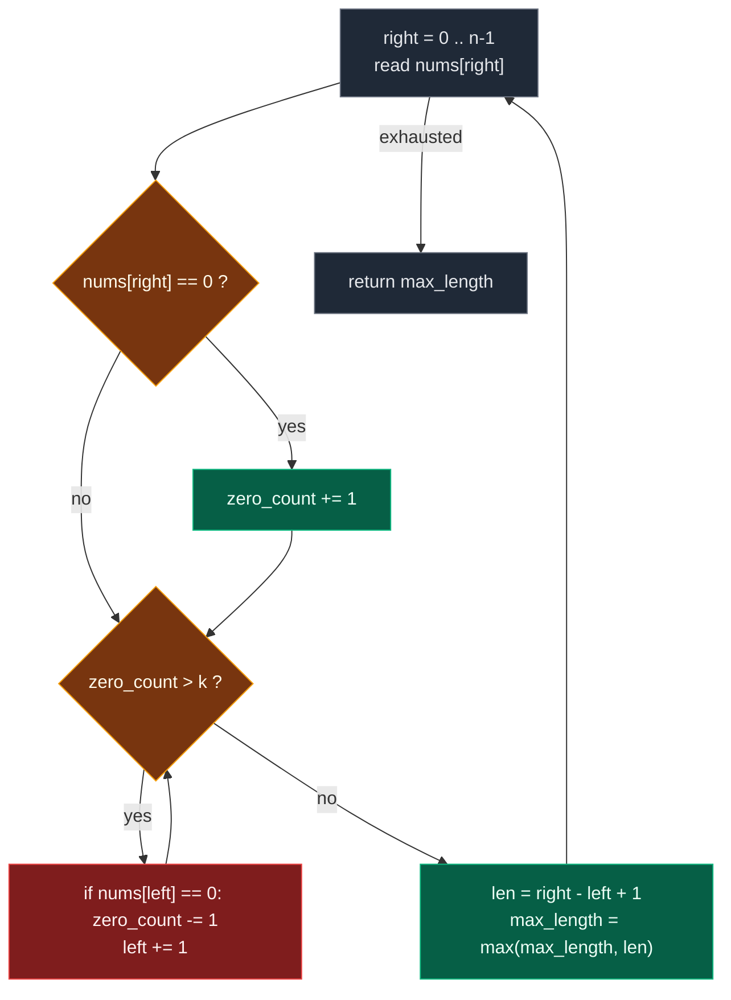

# 03. 1004. Max Consecutive Ones III

| Difficulty | Pattern | Source | Time | Space |
|:---:|:---:|:---:|:---:|:---:|
| **Medium** | Variable Window + Budget Counter | [1004. Max Consecutive Ones III](https://leetcode.com/problems/max-consecutive-ones-iii/) | `O(n)` | `O(1)` |

## 1. Problem Statement

Given a binary array `nums` and an integer `k`, return the maximum number of consecutive `1`'s in the array if you can flip at most `k` `0`'s.

### Examples

```text
Input:  nums = [1,1,1,0,0,0,1,1,1,1,0], k = 2
Output: 6
Explanation: [1,1,1,0,0,1,1,1,1,1,1]
             Bolded numbers were flipped from 0 to 1.
             The longest subarray is underlined.
```

```text
Input:  nums = [0,0,1,1,0,0,1,1,1,0,1,1,0,0,0,1,1,1,1], k = 3
Output: 10
Explanation: [0,0,1,1,1,1,1,1,1,1,1,1,0,0,0,1,1,1,1]
             Bolded numbers were flipped from 0 to 1.
             The longest subarray is underlined.
```

### Constraints

- `1 <= nums.length <= 10^5`
- `nums[i]` is either `0` or `1`
- `0 <= k <= nums.length`

## 2. Core Theory

### The reframing IS the insight

The statement talks about flipping. Do not think about flipping. The very first move in an interview is to restate the problem:

```text
"Flip at most k zeroes and maximise consecutive ones"
                      ↓
"Find the longest subarray containing at most k zeroes"
```

The two are **equivalent**, and the proof is one line. Take any window. If it holds `z` zeroes and `z <= k`, then every zero in it can be flipped, so the entire window becomes a run of ones of length `right - left + 1`. Conversely, a run of ones produced by at most `k` flips came from a window with at most `k` zeroes. Maximising one maximises the other.

```text
window = [1, 1, 0, 1, 0, 1]       zeros = 2,  k = 2
           ↓  ↓  ↓  ↓  ↓  ↓       flip both
         [1, 1, 1, 1, 1, 1]       length 6, achievable
```

Once restated, the keywords are unmistakable:

```text
LONGEST  +  CONTIGUOUS  +  AT MOST K
                 ↓
    VARIABLE-SIZE SLIDING WINDOW
```

### What state do we need?

Compare with Longest Substring Without Repeating Characters. There we had to know *which* characters were in the window, so we needed a set or a hashmap. Here the validity test is a single question — **how many zeroes are inside `[left..right]`?** — so all we need is one integer:

```text
zero_count
```

No set. No hashmap. No extra array. That is why the space is `O(1)`, not `O(charset)`.

### The budget mental model

This generalizes far beyond this problem, so name it:

```text
Every zero costs 1 flip.
Budget = k.
Window is valid  <=>  total cost <= budget.
```

Rephrased once more: *find the longest subarray whose total flip cost is at most `k`*. The same skeleton solves "longest window with at most `k` distinct values", "at most `k` replacements", "at most `k` bad elements", "sum <= `k`". Only the definition of "cost" changes.

### The expand / shrink loop



Order matters and is not negotiable: **expand, then fix invalidity, then update the answer.** Updating before the fix records the length of a window you are not allowed to use.

### Watch the pointers walk

```text
nums = [1,1,1,0,0,0,1,1,1,1,0],  k = 2
index:   0 1 2 3 4 5 6 7 8 9 10

right=0   [1]                       zeros=0   len=1   max=1
right=1   [1 1]                     zeros=0   len=2   max=2
right=2   [1 1 1]                   zeros=0   len=3   max=3
right=3   [1 1 1 0]                 zeros=1   len=4   max=4
right=4   [1 1 1 0 0]               zeros=2   len=5   max=5
right=5   [1 1 1 0 0 0]             zeros=3   INVALID -> shrink
            drop nums[0]=1  zeros=3  still invalid
            drop nums[1]=1  zeros=3  still invalid
            drop nums[2]=1  zeros=3  still invalid
            drop nums[3]=0  zeros=2  valid,  left=4
           1 1 1 0[0 0]             zeros=2   len=2   max=5
right=6    1 1 1 0[0 0 1]           zeros=2   len=3   max=5
right=7    1 1 1 0[0 0 1 1]         zeros=2   len=4   max=5
right=8    1 1 1 0[0 0 1 1 1]       zeros=2   len=5   max=5
right=9    1 1 1 0[0 0 1 1 1 1]     zeros=2   len=6   max=6   <-- answer
right=10   ...[0 0 1 1 1 1 0]       zeros=3   INVALID -> shrink
            drop nums[4]=0  zeros=2  valid,  left=5
           1 1 1 0 0[0 1 1 1 1 0]   zeros=2   len=6   max=6

answer = 6
```

Note the shrink at `right = 5` took **four** steps, and three of them changed nothing because the departing element was a `1`. That is the whole reason the shrink is a `while` in the standard template and the reason `zero_count -= 1` must be guarded by `if nums[left] == 0`.

### `while` vs `if`: two different invariants

The author deliberately saved a second write-up on this, and it is the most interesting thing in the problem. Both versions are `O(n)`. They differ in what they promise.

**The `while` version — invariant: the current window is always valid.**

```text
while zero_count > k:
    if nums[left] == 0: zero_count -= 1
    left += 1
max_length = max(max_length, right - left + 1)
```

After the loop, `zero_count <= k` is guaranteed. The window is a genuine, usable answer at every iteration, so you track its size in `max_length` and return that.

**The `if` version — invariant: the maintained window size never decreases.**

```text
if zero_count > k:
    if nums[left] == 0: zero_count -= 1
    left += 1
return len(nums) - left
```

There is no `max_length` at all. Watch what happens to the window **width** `W = right - left + 1` on each iteration. `right` always moves forward, so the candidate width becomes `W + 1`. Then exactly two cases:

| Case | Condition | Action | New width |
|:---|:---|:---|:---:|
| A — still valid | `zero_count <= k` | `left` does not move | `W + 1` (grows) |
| B — now invalid | `zero_count > k` | `left` moves exactly once | `(W + 1) - 1 = W` (unchanged) |

So the width **never decreases, and only a valid step can increase it**. The maintained width is therefore always equal to the largest valid window discovered so far. An invalid window is allowed to persist — we are not claiming it is the answer, we are using its width as *the size to beat*, sliding that fixed-width frame forward until a valid window of that size reappears and can finally grow.

At the end `right = n - 1`, so `right - left + 1 = n - left`, which is why the function returns `len(nums) - left` with no maximum variable.

Here is the `if` version on a small case, `nums = [1,1,0,0,1,1,1]`, `k = 1`:

```text
right=0  [1]              zeros=0  valid    width 1
right=1  [1 1]            zeros=0  valid    width 2
right=2  [1 1 0]          zeros=1  valid    width 3     best valid = 3
right=3  [1 1 0 0]        zeros=2  INVALID  -> move left once (drops a 1)
          1[1 0 0]        zeros=2  still invalid, and that is FINE  width 3
right=4   1[1 0 0 1]      zeros=2  INVALID  -> move left once (drops a 1)
          1 1[0 0 1]      zeros=2  still invalid                   width 3
right=5   1 1[0 0 1 1]    zeros=2  INVALID  -> move left once (drops a 0)
          1 1 0[0 1 1]    zeros=1  valid again                     width 3
right=6   1 1 0[0 1 1 1]  zeros=1  valid -> left does NOT move      width 4

return 7 - 3 = 4
```

Between `right = 3` and `right = 5` the tracked window was genuinely invalid. It never mattered, because it was never allowed to grow while invalid.

**The honest trade-off.**

| | `while` version | `if` version |
|:---|:---|:---|
| Invariant | Current window always valid | Window may be invalid; its width never shrinks |
| Needs `max_length` | Yes | No — returns `n - left` |
| Shrinks per iteration | Zero or more | At most one |
| Time | `O(n)` — pointers move `2n` total | `O(n)` — one `right` step, at most one `left` step |
| Space | `O(1)` | `O(1)` |
| Easy to prove and debug | Yes | Requires the width argument |
| Generalizes | Yes — the universal longest-window template | **No** |

The `if` trick is **not** a general substitution. It works here because we only want the maximum *length* and validity has a simple budget structure. It fails for minimum-window problems, exact-count problems, and anything where the current window's contents must be read at each step — there you genuinely need validity restored before proceeding. So: code the `while` version first, and offer the `if` version if the interviewer asks you to simplify further.

### Why `O(n)` and not `O(n^2)`

Same amortized argument as every variable window. `right` advances at most `n` times across the whole run; `left` advances at most `n` times across the whole run. Total pointer movement `2n`, so `O(n)`. A single iteration may shrink many times, but the sum over all iterations cannot exceed `n`.

## 3. Edge Cases

| Case | Input | Expected | Why it matters |
|:---|:---|:---:|:---|
| `k = 0` | `nums = [1,1,0,1,1,1]`, `k = 0` | `3` | Degenerates to "longest existing run of ones"; no special code needed |
| `k = 0`, all zeroes | `nums = [0,0,0]`, `k = 0` | `0` | Window is shrunk to empty every step; must not return a negative length |
| Single element | `nums = [0]`, `k = 1` | `1` | Smallest input under the constraints |
| All ones | `nums = [1,1,1,1]`, `k = 2` | `4` | Shrink never fires; answer is the whole array |
| All zeroes, `k` small | `nums = [0,0,0,0,0]`, `k = 2` | `2` | Only `k` zeroes can sit inside a valid window |
| `k >= number of zeroes` | `nums = [1,0,1,0,1]`, `k = 3` | `5` | Whole array is flippable; the window never shrinks |
| `k = n` | `nums = [0,0,0]`, `k = 3` | `3` | Upper bound of the constraint |
| Best window at the end | `nums = [0,0,1,1,1]`, `k = 0` | `3` | Answer is only reached on the final iterations |

## 4. Brute Force: Check Every Subarray

### Intuition

Generate every subarray, count the zeroes inside it, and if that count is at most `k` the subarray can be converted into all ones — so update the maximum length.

One small improvement over the naive version: while extending a fixed `start`, keep a running `zero_count` instead of recounting. And once the count exceeds `k`, extending further can only make it worse, so `break`.

### Approach

1. For every `start` from `0` to `n - 1`, reset `zero_count = 0`.
2. Extend `end` forward, incrementing `zero_count` on each zero.
3. While `zero_count <= k`, update `max_length` with `end - start + 1`.
4. Once `zero_count > k`, `break` out of the inner loop.

### Dry Run

```text
nums = [1,1,0,0,1],  k = 1

start = 0:
  [1]          zeros=0  valid   len 1
  [1,1]        zeros=0  valid   len 2
  [1,1,0]      zeros=1  valid   len 3
  [1,1,0,0]    zeros=2  > k  -> break

start = 1:
  [1]          zeros=0  valid   len 1
  [1,0]        zeros=1  valid   len 2
  [1,0,0]      zeros=2  > k  -> break

... best = 3
```

### Code

```python
# Define the class solution
class Solution:

    # Define the method
    def longestOnes(self, nums: List[int], k: int) -> int:

        # Store the length of the array.
        n = len(nums)

        # Store the maximum valid subarray length.
        max_length = 0

        # Try every possible starting index.
        for start in range(n):

            # Count zeroes in the current subarray.
            zero_count = 0

            # Try every possible ending index.
            for end in range(start, n):

                # If current element is zero, increase zero count.
                if nums[end] == 0:

                    # Increment zero count.
                    zero_count += 1

                # If zero count is within k, this subarray is valid.
                if zero_count <= k:

                    # Update maximum length.
                    max_length = max(max_length, end - start + 1)

                # If zero count becomes greater than k,
                # extending further will only keep it invalid or make it worse.
                else:

                    # Stop checking for this start.
                    break

        # Return the maximum valid length.
        return max_length
```

### Complexity

| Measure | Complexity | Why |
|:---|:---:|:---|
| **Time** | `O(n^2)` | Every start re-scans forward; nothing learned from the previous start is reused |
| **Space** | `O(1)` | Only counters |

Too slow for `n = 10^5`.

## 5. Optimal Solution: Variable Sliding Window

### Intuition

Watch what brute force throws away. Suppose we have processed `[1,1,0,1,0]` with `zero_count = 2` and `k = 2`, and the next element is another `0`, pushing the count to `3`. Brute force abandons this start entirely and recomputes from the next index. But we already know almost everything about this window.

```text
Don't restart. Move LEFT.
```

Maintain `left`, `right`, `zero_count`, `max_length`. Expand `right` always. When `zero_count > k`, walk `left` forward — decrementing the count only when the departing element is actually a zero — until validity returns. Then the window is valid and `right - left + 1` is a legitimate answer.

### Approach

1. `left = 0`, `zero_count = 0`, `max_length = 0`.
2. For each `right`: if `nums[right] == 0`, `zero_count += 1`.
3. While `zero_count > k`: if `nums[left] == 0`, `zero_count -= 1`; `left += 1`.
4. `current_length = right - left + 1`; update `max_length`.

### The guard on the decrement

Not every element leaving the window is a zero:

```text
[1,1,1,0,0,0]
 ↑
 left        removing this 1 must NOT reduce zero_count
```

So the decrement is conditional:

```text
while zero_count > k:
    if nums[left] == 0:
        zero_count -= 1
    left += 1
```

### Dry Run

```text
nums = [1,1,1,0,0,0,1,1,1,1,0],  k = 2
left = 0, zero_count = 0, max_length = 0
```

```text
right=0   nums[0]=1   window [1]              zeros=0  len=1  max=1
right=1   nums[1]=1   window [1,1]            zeros=0  len=2  max=2
right=2   nums[2]=1   window [1,1,1]          zeros=0  len=3  max=3
right=3   nums[3]=0   window [1,1,1,0]        zeros=1  len=4  max=4
          (one zero, one flip available -> can become 1 1 1 1)
right=4   nums[4]=0   window [1,1,1,0,0]      zeros=2  len=5  max=5
          (flip both -> 1 1 1 1 1)
right=5   nums[5]=0                           zeros=3  > k = 2  INVALID
          shrink: left 0->1  removed 1, zeros=3
          shrink: left 1->2  removed 1, zeros=3
          shrink: left 2->3  removed 1, zeros=3
          shrink: left 3->4  removed 0, zeros=2  valid
                      window [0,0]             zeros=2  len=2  max=5
right=6   nums[6]=1   window [0,0,1]           zeros=2  len=3  max=5
right=7   nums[7]=1   window [0,0,1,1]         zeros=2  len=4  max=5
right=8   nums[8]=1   window [0,0,1,1,1]       zeros=2  len=5  max=5
right=9   nums[9]=1   window [0,0,1,1,1,1]     zeros=2  len=6  max=6
          (flip both zeroes -> 1 1 1 1 1 1)
right=10  nums[10]=0                           zeros=3  > k  INVALID
          shrink: left 4->5  removed 0, zeros=2  valid
                      window [0,1,1,1,1,0]     zeros=2  len=6  max=6

Final answer: 6
```

### Code

```python
# Define the class solution
class Solution:

    # Define the method
    def longestOnes(self, nums: List[int], k: int) -> int:

        # Initialize the left boundary of the window.
        left = 0

        # Initialize the number of zeroes in the current window.
        zero_count = 0

        # Initialize the maximum length of a valid window.
        max_length = 0

        # Iterate through the array using the right boundary.
        for right in range(len(nums)):

            # If nums[right] is zero, it consumes one flip.
            if nums[right] == 0:

                # Increase the zero count for the current window.
                zero_count += 1

            # Keep shrinking the window until zero count becomes valid again.
            while zero_count > k:

                # If the leftmost element is zero, it is leaving the window.
                if nums[left] == 0:

                    # Release one used flip.
                    zero_count -= 1

                # Move the left boundary forward.
                left += 1

            # Current window is valid here.
            current_length = right - left + 1

            # Update the best answer.
            max_length = max(max_length, current_length)

        # Return the maximum number of consecutive ones possible.
        return max_length
```

### Complexity

| Measure | Complexity | Why |
|:---|:---:|:---|
| **Time** | `O(n)` | `right` visits each index once and `left` visits each index once — `O(2n) = O(n)` |
| **Space** | `O(1)` | Only `left`, `zero_count` and `max_length` |

## 6. Alternative: `if` Instead of `while`

### Intuition

Ask a sharper question. Once we have already found a valid window of length `6`, do we care about valid windows of length `3`? No — they cannot improve the answer. So there is no point paying to shrink all the way back to validity. Keep the window at its best-known size and slide it forward, waiting for a moment when it can grow again.

That changes the invariant from *"the current window is valid"* to *"the maintained window size never decreases, and only a valid step can increase it"*. The consequence is that `max_length` disappears entirely: the final window width **is** the answer.

### Approach

1. `left = 0`, `zero_count = 0`.
2. For each `right`: if `nums[right] == 0`, `zero_count += 1`.
3. **If** (not while) `zero_count > k`: if `nums[left] == 0`, `zero_count -= 1`; `left += 1`.
4. Return `len(nums) - left`.

Step 3 moves `left` at most once, exactly cancelling the one step `right` took, so the width stays put. When step 3 does not fire, the width grows by one — and it only fails to fire when the window is valid.

### Why the return value is `n - left`

```text
window length = right - left + 1

at the end     right = n - 1

             = (n - 1) - left + 1
             = n - left
```

### Dry Run

```text
nums = [1,1,0,0,1,1,1],  k = 1
left = 0, zero_count = 0
```

```text
right=0  nums[0]=1  zeros=0  valid     [1]              width 1
right=1  nums[1]=1  zeros=0  valid     [1,1]            width 2
right=2  nums[2]=0  zeros=1  valid     [1,1,0]          width 3   best valid = 3
right=3  nums[3]=0  zeros=2  > k  -> move left once, drops nums[0]=1
                             zeros=2, left=1
                             window 1[1,0,0]  INVALID but width still 3
right=4  nums[4]=1  zeros=2  > k  -> move left once, drops nums[1]=1
                             zeros=2, left=2
                             window 1 1[0,0,1]  INVALID, width still 3
right=5  nums[5]=1  zeros=2  > k  -> move left once, drops nums[2]=0
                             zeros=1, left=3
                             window 1 1 0[0,1,1]  VALID again, width 3
right=6  nums[6]=1  zeros=1  valid -> left does NOT move
                             window 1 1 0[0,1,1,1]  width 4   <-- grew

return len(nums) - left = 7 - 3 = 4
```

### Code

```python
# Define the class solution
class Solution:

    # Define the method
    def longestOnes(self, nums: List[int], k: int) -> int:

        # Left boundary of our window.
        left = 0

        # Number of zeros currently tracked
        # inside the window.
        zero_count = 0

        # Expand right pointer.
        for right in range(len(nums)):

            # Include the current element.
            if nums[right] == 0:
                zero_count += 1

            # If we exceed the allowed number
            # of zeros, move left only ONCE.
            if zero_count > k:

                # If the outgoing element is zero,
                # one zero leaves the window.
                if nums[left] == 0:
                    zero_count -= 1

                # Shift the window one position right.
                left += 1

        # right ultimately ends at n - 1.
        #
        # Final maintained window length:
        # n - left
        return len(nums) - left
```

### Complexity

| Measure | Complexity | Why |
|:---|:---:|:---|
| **Time** | `O(n)` | One `right` step and at most one `left` step per iteration |
| **Space** | `O(1)` | Two integers |

Identical Big-O to the `while` version. What it buys is simpler control flow, no `max_length` variable, and a neat invariant — **not** a better complexity class. Say so honestly; claiming it is "faster" is the wrong answer.

## 7. Common Mistakes

| Mistake | Why it breaks | Fix |
|:---|:---|:---|
| `while zero_count > k: zero_count -= 1; left += 1` | Decrements on every departure, but departing `1`s do not release a flip. On `[1,1,1,0,0,0]` the count goes wrong immediately | Guard it: `if nums[left] == 0: zero_count -= 1` |
| Updating `max_length` before the shrink loop | Records a window that still holds more than `k` zeroes | Order is expand → fix → update |
| Using `if` instead of `while` **and still** keeping `max_length` | Mixes the two invariants; `max_length` gets fed invalid window widths | Either `while` + `max_length`, or `if` + `return n - left`. Never crossed |
| Actually mutating `nums[i] = 1` | Destroys the information needed to shrink correctly, and gains nothing | Never flip; just count the cost |
| `right - left` for the length | Off by one on an inclusive window | `right - left + 1` |
| Counting ones instead of zeroes | `zeros = window_length - ones` works but is indirect — zeroes are what consume the budget | Track the quantity that determines validity: `zero_count` |
| Special-casing `k = 0` | Unnecessary; the general code already shrinks past any zero that enters | Leave it alone |

## 8. Interview Follow-ups

**Q: Return the actual subarray, not just its length.**

A: Track the start alongside the maximum in the `while` version: whenever `current_length > max_length`, also record `best_left = left`. Return `nums[best_left:best_left + max_length]`. The `if` version gives you the indices for free — the final window is `nums[left:]`.

**Q: What if the array were not binary — "longest subarray with at most `k` elements not equal to `x`"?**

A: Identical code; only the cost test changes from `nums[right] == 0` to `nums[right] != x`. This is the budget model in its general form. Longest Repeating Character Replacement (LeetCode 424) is the same idea with the additional twist that `x` is chosen dynamically as the window's most frequent character.

**Q: Why not restore validity in the `if` version? Isn't an invalid window a bug?**

A: No, it is intentional. That version does not maintain "the current window is valid". Its invariant is that the maintained window *length* equals the best valid length found so far. An invalid window is allowed to persist, but because `left` advances together with `right` whenever it is invalid, its size cannot increase. Only a valid iteration can grow the window — so the final width is exactly the maximum valid width.

**Q: Can the `if` trick be used on every sliding window problem?**

A: No, and this is the important half of the answer. It relies on two things: we want a *maximum* length, and validity has a monotone budget structure. Minimum-window problems, exact-count problems, and any problem where the window's current contents must be consumed at each step all need the `while`, because they need the window to be genuinely valid before the answer is read. Learn `while` as the template; keep `if` as a specific optimization you can defend.

**Q: What if `k` could exceed the array length, or the array were streamed?**

A: `k >= n` makes the whole array valid and the answer is `n`, which the general code already returns without a special case. For a stream you cannot keep the whole array, but you can keep a queue of the indices of the zeroes currently in the window: when the queue exceeds `k` entries, pop the oldest and set `left` to that index `+ 1`. That is `O(k)` space and still `O(1)` amortized per element.

## 9. Interview Explanation

> Instead of actually flipping zeroes, I reinterpret the problem as finding the longest contiguous subarray containing at most `k` zeroes. I maintain a variable-size sliding window with `left` and `right`, along with a `zero_count`. When I expand `right`, I increment the count if the new value is zero. If `zero_count` exceeds `k`, I move `left` forward and decrement the count whenever a zero leaves the window, until the window becomes valid again. Then I update the maximum length with `right - left + 1`. Since both pointers only move forward, the total complexity is `O(n)`, with `O(1)` extra space. If you want, I can also show a variant that shrinks with a single `if` instead of a `while` — it keeps a window whose size never decreases, so the final `n - left` is itself the answer, though the `while` form is the one that generalizes.

## 10. Verify

```python
from typing import List


def longest_ones(nums: List[int], k: int) -> int:
    # Initialize the left boundary of the window.
    left = 0
    # Initialize the number of zeroes in the current window.
    zero_count = 0
    # Initialize the maximum length of a valid window.
    max_length = 0
    # Iterate through the array using the right boundary.
    for right in range(len(nums)):
        # If nums[right] is zero, it consumes one flip.
        if nums[right] == 0:
            # Increase the zero count for the current window.
            zero_count += 1
        # Keep shrinking the window until zero count becomes valid again.
        while zero_count > k:
            # If the leftmost element is zero, it is leaving the window.
            if nums[left] == 0:
                # Release one used flip.
                zero_count -= 1
            # Move the left boundary forward.
            left += 1
        # Update the best answer with the current valid window.
        max_length = max(max_length, right - left + 1)
    # Return the maximum number of consecutive ones possible.
    return max_length


# The `if` variant: window size never decreases, so n - left is the answer
def longest_ones_if(nums: List[int], k: int) -> int:
    # Left boundary of our window.
    left = 0
    # Number of zeros currently tracked inside the window.
    zero_count = 0
    # Expand right pointer.
    for right in range(len(nums)):
        # Include the current element.
        if nums[right] == 0:
            # Increment zero count.
            zero_count += 1
        # If we exceed the allowed number of zeros, move left only ONCE.
        if zero_count > k:
            # If the outgoing element is zero, one zero leaves the window.
            if nums[left] == 0:
                # Release one used flip.
                zero_count -= 1
            # Shift the window one position right.
            left += 1
    # Final maintained window length is n - left.
    return len(nums) - left


# LeetCode examples
assert longest_ones([1, 1, 1, 0, 0, 0, 1, 1, 1, 1, 0], 2) == 6
assert longest_ones(
    [0, 0, 1, 1, 0, 0, 1, 1, 1, 0, 1, 1, 0, 0, 0, 1, 1, 1, 1], 3) == 10

# Edge case: k = 0 -> longest existing run of ones
assert longest_ones([1, 1, 0, 1, 1, 1], 0) == 3

# Edge case: k = 0 with no ones at all
assert longest_ones([0, 0, 0], 0) == 0

# Edge case: single element
assert longest_ones([0], 1) == 1
assert longest_ones([1], 0) == 1
assert longest_ones([0], 0) == 0

# Edge case: all ones, window never shrinks
assert longest_ones([1, 1, 1, 1], 2) == 4

# Edge case: all zeroes, only k of them fit
assert longest_ones([0, 0, 0, 0, 0], 2) == 2

# Edge case: k >= number of zeroes -> whole array
assert longest_ones([1, 0, 1, 0, 1], 3) == 5

# Edge case: k = n
assert longest_ones([0, 0, 0], 3) == 3

# Edge case: best window only appears at the end
assert longest_ones([0, 0, 1, 1, 1], 0) == 3

# The companion write-up's small example
assert longest_ones([1, 1, 0, 0, 1, 1, 1], 1) == 4
assert longest_ones_if([1, 1, 0, 0, 1, 1, 1], 1) == 4

# The companion write-up's second working example
assert longest_ones([0, 0, 1, 1, 0, 1, 1, 0], 2) == 6


# Brute-force reference over every subarray
def brute_force(nums: List[int], k: int) -> int:
    # Store the best valid subarray length found so far.
    best = 0
    # Try every possible starting index.
    for start in range(len(nums)):
        # Count zeroes in the current subarray.
        zeros = 0
        # Try every possible ending index.
        for end in range(start, len(nums)):
            # If current element is zero, increase zero count.
            if nums[end] == 0:
                zeros += 1
            # Stop extending once the zero budget is exceeded.
            if zeros > k:
                break
            # Update the best answer with this valid subarray.
            best = max(best, end - start + 1)
    # Return the best length found.
    return best


import random

# Fix the seed so the random comparison is reproducible.
random.seed(1004)
# Compare the optimal solution against brute force on many random inputs.
for _ in range(4000):
    # Pick a random array length.
    n = random.randint(1, 14)
    # Build a random binary array.
    arr = [random.randint(0, 1) for _ in range(n)]
    # Pick a random flip budget within range.
    kk = random.randint(0, n)
    # Compute the expected answer from brute force.
    expected = brute_force(arr, kk)
    # The while-loop solution must match brute force.
    assert longest_ones(arr, kk) == expected, (arr, kk)
    # Both invariants must produce the same maximum length
    assert longest_ones_if(arr, kk) == expected, (arr, kk)

# Structural check: the reported best window really holds at most k zeroes
def best_window(nums: List[int], k: int):
    # Initialize the left boundary of the window.
    left = 0
    # Initialize the number of zeroes in the current window.
    zeros = 0
    # Track the best window length found so far.
    best = 0
    # Track the starting index of the best window.
    best_left = 0
    # Iterate through the array using the right boundary.
    for right in range(len(nums)):
        # If nums[right] is zero, it consumes one flip.
        if nums[right] == 0:
            zeros += 1
        # Keep shrinking the window until zero count becomes valid again.
        while zeros > k:
            # If the leftmost element is zero, it is leaving the window.
            if nums[left] == 0:
                zeros -= 1
            # Move the left boundary forward.
            left += 1
        # Track the best window seen and where it starts.
        if right - left + 1 > best:
            best = right - left + 1
            best_left = left
    # Return the actual best window as a slice.
    return nums[best_left:best_left + best]


for arr, kk in [([1, 1, 1, 0, 0, 0, 1, 1, 1, 1, 0], 2),
                ([0, 0, 0, 0, 0], 2),
                ([1, 1, 0, 1, 1, 1], 0),
                ([1, 0, 1, 0, 1], 3)]:
    window = best_window(arr, kk)
    assert window.count(0) <= kk, (arr, kk, window)
    assert len(window) == longest_ones(arr, kk), (arr, kk, window)

# Performance sanity near the constraint bound
big = ([1] * 9 + [0]) * 10000
assert longest_ones(big, 0) == 9
assert longest_ones(big, 1) == 19
assert longest_ones(big, len(big)) == len(big)

print("All tests passed")
```
