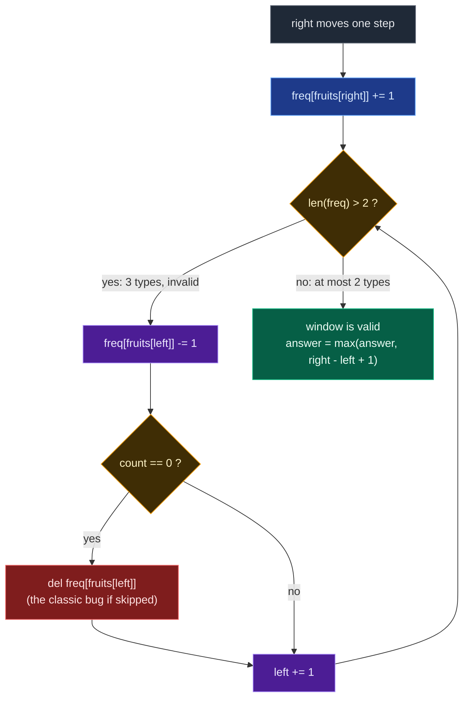

# 04. 904. Fruit Into Baskets

| Difficulty | Pattern | Source | Time | Space |
|:---:|:---:|:---:|:---:|:---:|
| **Medium** | Variable Window + Count Map | [904. Fruit Into Baskets](https://leetcode.com/problems/fruit-into-baskets/) | `O(n)` | `O(1)` |

## 1. Problem Statement

You are visiting a farm that has a single row of fruit trees arranged from left to right. The trees are represented by an integer array `fruits` where `fruits[i]` is the **type** of fruit the `i`-th tree produces.

You want to collect as much fruit as possible. However, the owner has some strict rules that you must follow:

- You only have **two** baskets, and each basket can only hold a **single type** of fruit. There is no limit on the amount of fruit each basket can hold.
- Starting from any tree of your choice, you must pick **exactly one fruit** from **every** tree (including the start tree) while moving to the right. The picked fruits must fit in one of your baskets.
- Once you reach a tree with fruit that cannot fit in your baskets, you must stop.

Given the integer array `fruits`, return *the **maximum** number of fruits you can pick*.

### Examples

```text
Input:  fruits = [1,2,1]
Output: 3
Explanation: We can pick from all 3 trees.
```

```text
Input:  fruits = [0,1,2,2]
Output: 3
Explanation: We can pick from trees [1,2,2].
If we had started at the first tree, we would only pick from trees [0,1].
```

```text
Input:  fruits = [1,2,3,2,2]
Output: 4
Explanation: We can pick from trees [2,3,2,2].
If we had started at the first tree, we would only pick from trees [1,2].
```

### Constraints

- `1 <= fruits.length <= 10^5`
- `0 <= fruits[i] < fruits.length`

## 2. Core Theory

**The hard part of this problem is not the algorithm. It is the translation.**

Everything about baskets, farms and picking rules is decoration. Strip it away one clause at a time:

| Story clause | What it actually means |
|:---|:---|
| "single row of trees, move only right" | The answer is a **contiguous subarray** |
| "two baskets, each holds one type" | The subarray may contain **at most 2 distinct values** |
| "unlimited amount per basket" | Frequency does not matter, only *how many different values* |
| "return the maximum number of fruits" | Maximise the **length** of that subarray |

Glue them together and the entire problem collapses to one sentence:

```text
Find the length of the longest contiguous subarray
containing at most 2 distinct values.
```

Once you can say that sentence out loud, the rest is a template you already know. In an interview, say the sentence *first* — it proves you decoded the story, and it is the step interviewers are actually grading.

**Why this is a variable-size window.** The signal is the triple *longest* + *contiguous* + *at most*. "Contiguous" means a window. "At most" means the validity condition is **monotone**: if a window is valid, every sub-window of it is valid too. "Longest" means we want the window as wide as possible. That combination is exactly the variable-size sliding window: push `right` forward greedily, and pull `left` forward only when forced.

**Why a count map and not a set.** In Max Consecutive Ones III the state was a single integer, `zero_count`. Here the state is richer, because when `left` moves off a value you must know whether that value has *completely* left the window. Consider:

```text
window = [1, 1, 2, 3]
          ↑
         left
```

`left` moves off a `1`, but a second `1` is still inside. A `set` would have to be rebuilt from scratch to notice that — `O(n)` per step. A frequency map answers it in `O(1)`: decrement, and only when the count reaches zero is the type genuinely gone.

So the window state is exactly:

```text
fruit type -> number of occurrences currently inside the window
```

and the validity test is a single cheap check: `len(freq) <= 2`.

**The mechanics, and the one bug everybody writes.**

```text
expand:  freq[fruits[right]] += 1
shrink:  while len(freq) > 2:
             freq[fruits[left]] -= 1
             if freq[fruits[left]] == 0:
                 del freq[fruits[left]]      <-- DO NOT FORGET THIS
             left += 1
record:  answer = max(answer, right - left + 1)
```

That `del` is the classic bug. Without it, a key whose count has dropped to `0` **stays in the map forever**, so `len(freq)` counts fruit types that are not actually in the window any more. The map becomes permanently over-full, the `while` loop keeps shrinking a window that was already valid, `left` runs away to the right, and the answer comes out far too small. The symptom is subtle — the code does not crash, it just quietly returns a wrong, too-small number. `len(freq)` is only a correct distinct-count if every zero-count key is deleted the instant it hits zero.

Here is the decision loop for one iteration of `right`:



Note that the "record answer" step sits **after** the shrink loop. That is the signature of a *maximising* window: shrink only until valid, then measure. (The mirror image — a minimising window that records *inside* the loop — is problem 209 in this same topic.)

**Why `while` and not `if` in the safe version.** Adding one fruit can only add one new type, so you might think one shrink step suffices. It does not, because the outgoing fruit may still have duplicates behind it:

```text
fruits = [1, 2, 1, 2, 3]
after adding 3:  window [1,2,1,2,3]  freq {1:2, 2:2, 3:1}  -> 3 types
shrink once:     window   [2,1,2,3]  freq {1:1, 2:2, 3:1}  -> still 3 types
shrink again:    window     [1,2,3]  freq {1:1, 2:1, 3:1}  -> still 3 types
shrink again:    window       [2,3]  freq {2:1, 3:1}       -> valid
```

Three shrinks were needed. If your invariant is "the window is valid after every iteration", `while` is mandatory. (A lazy-window variant using `if` does exist and is covered in section 7 — it works by weakening the invariant, not by fixing the count.)

**Why the total work is still `O(n)`.** The `while` loop looks nested, but `left` only ever moves forward, never back. Across the whole run `right` advances at most `n` times and `left` advances at most `n` times, so total pointer movement is `O(n + n) = O(n)`. Every element enters the window exactly once and leaves at most once.

**This is `k = 2` of a general template.** Replace the literal `2` with a parameter `k` and you have "longest subarray with at most `k` distinct values" — the same code, verbatim:

```python
while len(freq) > k:
    ...
```

Fruit Into Baskets is simply that template instantiated at `k = 2`. The author covers the general `k` version later in this topic (LeetCode 340 / 992 family). Learning the template rather than this one problem is the whole point.

## 3. Visual Intuition

Take the author's array:

```text
arr[] = [3, 3, 3, 1, 2, 1, 1, 2, 3, 3, 4]
```

Try the window that starts at index `0`:

```text
[3  3  3  1  2] 1  1  2  3  3  4
 L           R
types present = {3, 1, 2}  -> 3 types  ✗ too many
```

Pull back one step and it is legal:

```text
[3  3  3  1] 2  1  1  2  3  3  4
 L        R
types present = {3, 1}  -> 2 types  ✓   length 4
```

Now slide further right and a better window appears:

```text
 3  3  3 [1  2  1  1  2] 3  3  4
          L           R
types present = {1, 2}  -> 2 types  ✓   length 5
```

That window of length `5` is the answer for this array. Notice what the window did: it never restarted from scratch. It grew on the right, and when a third type forced the issue, it gave up just enough on the left to become legal again.

## 4. Key Observation

The whole algorithm rests on one monotonicity fact:

```text
If a window has at most 2 distinct values,
then every sub-window of it also has at most 2 distinct values.
```

Two consequences follow, and they are exactly what make the sliding window legal:

| Consequence | Why it matters |
|:---|:---|
| Shrinking never makes a window *more* invalid | So shrinking from the left always makes progress toward validity |
| A window that becomes invalid can only be fixed from the left | `right` never needs to move backwards |

Therefore `left` and `right` are both monotone non-decreasing, and the two-pointer scan is a single forward pass.

## 5. Brute Force Solution: Try Every Starting Tree

### Intuition

Try every possible starting tree. For each start, keep moving to the right and count how many different fruit types we have. If distinct fruit types become more than 2, stop. Update the maximum valid length.

### Approach

1. For every start index `start` from `0` to `n - 1`.
2. Create an empty set of fruit types.
3. Extend `end` from `start` to `n - 1`, adding `fruits[end]` to the set.
4. If the set size exceeds `2`, break out immediately.
5. Otherwise update `max_fruits` with `end - start + 1`.

### Dry Run

```text
fruits = [1, 2, 1, 2, 3]
```

From `start = 0`:

```text
[1]           -> {1}       1 type   ✓  length 1
[1,2]         -> {1,2}     2 types  ✓  length 2
[1,2,1]       -> {1,2}     2 types  ✓  length 3
[1,2,1,2]     -> {1,2}     2 types  ✓  length 4
[1,2,1,2,3]   -> {1,2,3}   3 types  ✗  break
```

Best from this start is `4`. Repeat from `start = 1`, `start = 2`, and so on. The overall best stays `4`.

### Code

```python
# Define the class solution
class Solution:

    # Define the method
    def totalFruit(self, fruits: List[int]) -> int:

        # Store total number of trees.
        n = len(fruits)

        # Store the maximum fruits collected.
        max_fruits = 0

        # Try every possible starting index.
        for start in range(n):

            # Store fruit types in the current subarray.
            basket_types = set()

            # Try every possible ending index.
            for end in range(start, n):

                # Add current fruit type to the set.
                basket_types.add(fruits[end])

                # If we have more than 2 fruit types, this window is invalid.
                if len(basket_types) > 2:

                    # Stop extending this starting index.
                    break

                # Calculate current valid window length.
                current_length = end - start + 1

                # Update maximum fruits collected.
                max_fruits = max(max_fruits, current_length)

        # Return the maximum valid length.
        return max_fruits
```

### Complexity

| Measure | Complexity | Why |
|:---|:---:|:---|
| **Time** | `O(n^2)` | For each start index we may scan many elements to the right. |
| **Space** | `O(1)` | Because the set stores at most 3 fruit types before breaking. |

## 6. Optimal Solution: Sliding Window + Hashmap

### Intuition

We maintain a window from `left` to `right`. The window is valid if it contains at most 2 distinct fruit types. We use a hashmap to count fruits inside the current window.

For each `right`:

```text
Add fruits[right] to hashmap
```

If hashmap has more than 2 fruit types:

```text
Shrink from left until only 2 fruit types remain
```

For every valid window:

```text
Update maximum length
```

The window `fruits[left:right+1]` represents the current fruits we are collecting, and the hashmap stores:

```text
fruit type -> frequency inside current window
```

### Approach

1. Initialise `fruit_count = {}`, `left = 0`, `max_fruits = 0`.
2. Move `right` across every tree and increment `fruit_count[fruits[right]]`.
3. While `len(fruit_count) > 2`, decrement `fruit_count[fruits[left]]`, delete the key if it hits `0`, and advance `left`.
4. The window is now valid — update `max_fruits` with `right - left + 1`.
5. Return `max_fruits`.

### Dry Run

```text
fruits = [1, 2, 3, 2, 2]
```

Expected answer is `4`, because the best window is `[2, 3, 2, 2]`, which contains only fruit types `2` and `3`.

Initial state:

```text
left = 0
basket = {}
answer = 0
```

#### right = 0

```text
fruit  = 1
basket = {1: 1}
window = [1]
answer = 1
```

Valid because basket has only 1 type.

```text
[1] 2  3  2  2
 L
 R
```

#### right = 1

```text
fruit  = 2
basket = {1: 1, 2: 1}
window = [1, 2]
answer = 2
```

Valid because basket has 2 types.

```text
[1  2] 3  2  2
 L  R
```

#### right = 2

```text
fruit  = 3
basket = {1: 1, 2: 1, 3: 1}
```

Invalid because basket has 3 types. Now shrink from left. Remove `fruits[left] = 1`:

```text
basket = {2: 1, 3: 1}
left   = 1
```

Key `1` hit zero and was deleted, so the map is now valid. Current window:

```text
 1 [2  3] 2  2
    L  R
```

Answer remains:

```text
2
```

#### right = 3

```text
fruit  = 2
basket = {2: 2, 3: 1}
window = [2, 3, 2]
answer = 3
```

Valid.

```text
 1 [2  3  2] 2
    L     R
```

#### right = 4

```text
fruit  = 2
basket = {2: 3, 3: 1}
window = [2, 3, 2, 2]
answer = 4
```

Valid.

```text
 1 [2  3  2  2]
    L        R
```

Final answer:

```text
4
```

### Code

```python
# Define the class solution
class Solution:

    # Define the method
    def totalFruit(self, fruits: List[int]) -> int:

        # Store frequency of each fruit type in the current window.
        fruit_count = {}

        # Left pointer of the sliding window.
        left = 0

        # Store the maximum number of fruits collected.
        max_fruits = 0

        # Move right pointer through every tree.
        for right in range(len(fruits)):

            # Store the current fruit type.
            current_fruit = fruits[right]

            # Add current fruit to the window frequency map.
            fruit_count[current_fruit] = fruit_count.get(current_fruit, 0) + 1

            # If there are more than 2 fruit types,
            # shrink the window from the left.
            while len(fruit_count) > 2:

                # Store the fruit type going out from the left side.
                left_fruit = fruits[left]

                # Decrease its frequency because it is leaving the window.
                fruit_count[left_fruit] -= 1

                # If frequency becomes zero, remove this fruit type completely.
                if fruit_count[left_fruit] == 0:

                    # Remove fruit type from hashmap.
                    del fruit_count[left_fruit]

                # Move left pointer forward.
                left += 1

            # Current window has at most 2 fruit types.
            current_length = right - left + 1

            # Update the maximum fruits collected.
            max_fruits = max(max_fruits, current_length)

        # Return the maximum valid window length.
        return max_fruits
```

### Complexity

| Measure | Complexity | Why |
|:---|:---:|:---|
| **Time** | `O(n)` | Each fruit enters the window once and leaves the window once. |
| **Space** | `O(1)` | Because the hashmap stores at most 3 types temporarily, and finally at most 2. |

## 7. Advanced Solution: Lazy Shrink with `if`

### Intuition

The standard solution keeps the invariant "the window is valid after every iteration", which forces the `while`. The lazy version uses a **weaker invariant**:

```text
The current window may temporarily be invalid,
but an invalid window is never allowed to grow.
```

Suppose the best valid width so far is `W`. `right` advances, making the temporary width `W + 1`. Two cases:

- **Still at most 2 distinct.** Valid. Do not move `left`. Width goes `W -> W + 1`, a genuinely better answer.
- **More than 2 distinct.** Invalid. Move `left` exactly once. Both pointers advanced, so the width stays `W`.

So an invalid window never increases the recorded width, and only a valid window can push past the previous best. Eventually enough old occurrences leave that a fruit type disappears from the map and the window becomes genuinely valid again.

Because the width is non-decreasing and never shrinks, no `max_length` variable is needed at all — the final maintained width *is* the maximum. At the end `right = n - 1`, so:

```text
right - left + 1 = (n - 1) - left + 1 = n - left
```

### Approach

1. Expand `right` and increment the count as usual.
2. If `len(freq) > 2`, move `left` **exactly once** (decrement, delete on zero, `left += 1`).
3. Never record an intermediate answer.
4. Return `len(fruits) - left`.

### Dry Run

```text
fruits = [1, 1, 2, 2, 3]
```

Best valid window before `3` arrives is `[1,1,2,2]`, width `4`. Add `3`:

```text
[1, 1, 2, 2, 3]  -> three types, invalid
```

Move `left` once:

```text
 1 [1, 2, 2, 3]  -> still three types!
```

That is fine. We are not claiming `[1,2,2,3]` is valid — we are only preserving the width `4` that we already know was achievable. The frame keeps sliding without growing until validity returns, and only then can the width climb to `5`.

### Code

```python
# Define the class solution
class Solution:

    # Define the method
    def totalFruit(self, fruits: List[int]) -> int:

        # Frequency map for the maintained window.
        freq = {}

        # Left boundary.
        left = 0

        # Expand right boundary.
        for right in range(len(fruits)):

            # Add incoming fruit.
            current_fruit = fruits[right]
            freq[current_fruit] = freq.get(current_fruit, 0) + 1

            # If more than two fruit types exist,
            # move left only ONE step.
            if len(freq) > 2:

                # Fruit leaving from the left.
                left_fruit = fruits[left]

                # Decrease its count.
                freq[left_fruit] -= 1

                # Remove its key if it completely
                # leaves the maintained window.
                if freq[left_fruit] == 0:
                    del freq[left_fruit]

                # Shift left once.
                left += 1

        # right finally equals n - 1,
        # so final maintained width is n - left.
        return len(fruits) - left
```

### Complexity

| Measure | Complexity | Why |
|:---|:---:|:---|
| **Time** | `O(n)` | `left` moves at most once per iteration, so `O(n)` total. Same big-O as the `while` version — this is not asymptotically faster. |
| **Space** | `O(1)` | The map holds at most 3 keys. |

### When NOT to use it

The lazy trick works only for **maximum-length** formulations of a monotone "at most" condition. It breaks when you need the current window to genuinely be valid:

| Requirement | Lazy `if` safe? |
|:---|:---:|
| Longest window with at most `k` distinct | Yes |
| Count all valid subarrays (`answer += right - left + 1`) | No — would count invalid windows |
| Minimum valid window | No |
| Exactly-`k` calculations | No |

Interview rule: use the `if` optimisation only after you can state and prove the lazy-window invariant out loud.

## 8. Standard vs Advanced

| Property | `while` version | `if` lazy version |
|:---|:---:|:---:|
| Current window always valid? | Yes | Not necessarily |
| Shrinks fully? | Yes | No |
| `left` may move many times per iteration? | Yes | At most once |
| Explicit `max_length`? | Yes | Not needed |
| Time | `O(n)` | `O(n)` |
| Easy to prove? | Yes | Harder |
| General-purpose | Better | More specialised |
| Best interview default | Yes | Follow-up optimisation |

## 9. Edge Cases

| Case | Input | Expected | Why it matters |
|:---|:---|:---:|:---|
| Single element | `[5]` | `1` | Window of size 1 is always valid; loop must record it |
| All identical | `[7,7,7,7]` | `4` | Map never exceeds 1 key, so the `while` never fires |
| Exactly two types | `[1,2,1,2]` | `4` | Boundary of validity — must not shrink at `len == 2` |
| Whole array is the answer | `[1,2,1]` | `3` | Answer can be `n`; no shrink ever happens |
| Every element distinct | `[1,2,3,4,5]` | `2` | Shrinks on every step; answer is capped at 2 |
| Third type forces a multi-step shrink | `[1,2,1,2,3]` | `4` | One shrink is not enough — proves `while` over `if` |
| Duplicate behind `left` | `[1,1,2,3]` | `3` | `left` must step twice to clear both `1`s — a set would drop the type early |
| Answer is at the tail | `[1,2,3,2,2]` | `4` | Best window is not the first one found |

## 10. Common Mistakes

| Mistake | Why it breaks | Fix |
|:---|:---|:---|
| Not deleting a zero-count key | `len(freq)` counts types that already left; the map is permanently over-full, `left` runs away and the answer is too small | `if freq[k] == 0: del freq[k]` immediately after decrementing |
| Using a `set` instead of a count map | Cannot tell whether a duplicate of the outgoing value remains inside the window | Store frequencies, delete only at zero |
| `if len(freq) > 2` while still doing `max(answer, right-left+1)` | Mixes the lazy invariant with the strict one — measures an invalid window | Use `while` with `max`, or `if` with `return n - left`. Never mix |
| Shrinking at `len(freq) >= 2` | Off-by-one on the condition; two types are legal, three are not | Condition is `> 2` |
| Updating `max_fruits` before the shrink loop | Records the width of an invalid window | Record only after the loop restores validity |
| Reading `fruits[left]` after `left += 1` | Decrements the wrong key and corrupts the map | Capture `left_fruit = fruits[left]` *before* advancing |
| Returning `len(freq)` or `left` instead of the width | Returns the number of types or an index, not a length | Return `max_fruits` (or `n - left` in the lazy version) |

## 11. Interview Follow-ups

**Q: Generalise to `k` baskets.**

A: Replace the literal `2` with `k` and nothing else changes: `while len(freq) > k`. That is LeetCode 340, "Longest Substring with At Most K Distinct Characters", still `O(n)` time with `O(k)` space. Fruit Into Baskets is the `k = 2` instance. Learning the template, not the instance, is the point.

**Q: Return the actual subarray, not just its length.**

A: Track the best `left` alongside the best length. Whenever `right - left + 1` beats the record, store `best_left = left` and `best_len = right - left + 1`. At the end return `fruits[best_left : best_left + best_len]`. Still `O(n)` time, `O(1)` extra beyond the output.

**Q: Count all subarrays with at most 2 distinct values instead of finding the longest.**

A: Same window, different accumulator: after the shrink loop, do `answer += right - left + 1`, counting every valid subarray that *ends* at `right`. Critically, this version **requires** the strict `while` invariant — the lazy `if` window would count invalid subarrays. And "exactly 2" is then `atMost(2) - atMost(1)`.

**Q: What if fruit types were arbitrary strings instead of small integers?**

A: Nothing changes algorithmically — a dict keyed by string works identically. Space stays `O(1)` in the sense of "at most 3 keys", though each key costs `O(L)` for a string of length `L`, so hashing makes the constant bigger.

**Q: Why is the nested `while` still `O(n)` and not `O(n^2)`?**

A: Amortised analysis. `left` is monotone non-decreasing and bounded by `n`, so the total number of shrink steps across the whole run is at most `n`, regardless of how they cluster. `right` also advances `n` times. Total pointer movement is `O(2n) = O(n)`.

**Q: Could you solve it with a "last occurrence" trick instead of a map?**

A: Yes — for `k = 2` specifically you can track just the two types and the index of the last block boundary, resetting `left` to that boundary when a third type appears. It is `O(1)` state and slightly faster in practice, but it is fragile and does not generalise to arbitrary `k`. The count map is the answer worth giving in an interview.

## 12. Interview Explanation

> This problem is equivalent to finding the longest subarray with at most 2 distinct values. I use a variable-size sliding window. The right pointer expands the window by adding fruits. I maintain a hashmap of fruit frequencies inside the window. If the hashmap contains more than 2 fruit types, the window becomes invalid, so I move the left pointer forward and reduce frequencies until the window again has at most 2 types. Whenever a frequency drops to zero I delete that key, otherwise the distinct count would be wrong. For every valid window, I update the maximum length. Since both pointers only move forward, the time complexity is `O(n)` and the space is `O(1)`.

## 13. Pattern Summary

```text
Problem type:
Variable-size sliding window

Window meaning:
Current continuous group of trees we are collecting from

Valid condition:
Number of distinct fruit types <= 2

Expand condition:
Always move right pointer

Shrink condition:
Number of distinct fruit types > 2

Data structure:
Hashmap of fruit frequencies

Answer update:
After making the window valid
```

Placed next to its siblings, the family is obvious — same skeleton, different window state:

| Problem | Window state | Valid condition |
|:---|:---|:---|
| LC 3 — Longest Substring Without Repeating | set / last index | no duplicates |
| LC 1004 — Max Consecutive Ones III | `zero_count` | `zeros <= k` |
| LC 904 — Fruit Into Baskets | frequency hashmap | `distinct <= 2` |
| LC 340 — At Most K Distinct | frequency hashmap | `distinct <= k` |

## 14. Verify

```python
from typing import List


def totalFruit(fruits: List[int]) -> int:
    # Store frequency of each fruit type in the current window.
    fruit_count = {}
    # Left pointer of the sliding window.
    left = 0
    # Store the maximum number of fruits collected.
    max_fruits = 0
    # Move right pointer through every tree.
    for right in range(len(fruits)):
        # Store the current fruit type.
        current_fruit = fruits[right]
        # Add current fruit to the window frequency map.
        fruit_count[current_fruit] = fruit_count.get(current_fruit, 0) + 1
        # If there are more than 2 fruit types, shrink the window from the left.
        while len(fruit_count) > 2:
            # Store the fruit type going out from the left side.
            left_fruit = fruits[left]
            # Decrease its frequency because it is leaving the window.
            fruit_count[left_fruit] -= 1
            # If frequency becomes zero, remove this fruit type completely.
            if fruit_count[left_fruit] == 0:
                del fruit_count[left_fruit]
            # Move left pointer forward.
            left += 1
        # Current window has at most 2 fruit types; update the maximum.
        max_fruits = max(max_fruits, right - left + 1)
    # Return the maximum valid window length.
    return max_fruits


def total_fruit_lazy(fruits: List[int]) -> int:
    # Store frequency of each fruit type in the current window.
    freq = {}
    # Left pointer of the sliding window.
    left = 0
    # Move right pointer through every tree.
    for right in range(len(fruits)):
        # Store the current fruit type.
        f = fruits[right]
        # Add current fruit to the window frequency map.
        freq[f] = freq.get(f, 0) + 1
        # If we exceed 2 types, move left only ONCE (lazy shrink).
        if len(freq) > 2:
            # Store the fruit type going out from the left side.
            g = fruits[left]
            # Decrease its frequency because it is leaving the window.
            freq[g] -= 1
            # If frequency becomes zero, remove this fruit type completely.
            if freq[g] == 0:
                del freq[g]
            # Move left pointer forward.
            left += 1
    # Final maintained window length is n - left.
    return len(fruits) - left


def brute(fruits: List[int]) -> int:
    # Store the size of the array.
    n = len(fruits)
    # Store the best valid subarray length found so far.
    best = 0
    # Try every possible starting index.
    for start in range(n):
        # Track the distinct fruit types in the current subarray.
        types = set()
        # Try every possible ending index.
        for end in range(start, n):
            # Add the current fruit type to the set.
            types.add(fruits[end])
            # Stop extending once more than 2 types appear.
            if len(types) > 2:
                break
            # Update the best answer with this valid subarray.
            best = max(best, end - start + 1)
    # Return the best length found.
    return best


# LeetCode examples
assert totalFruit([1, 2, 1]) == 3
assert totalFruit([0, 1, 2, 2]) == 3
assert totalFruit([1, 2, 3, 2, 2]) == 4

# Single element: a size-1 window is always valid
assert totalFruit([5]) == 1

# All identical: the shrink loop never fires
assert totalFruit([7, 7, 7, 7]) == 4

# Exactly two types: must not shrink at len(freq) == 2
assert totalFruit([1, 2, 1, 2]) == 4

# Every element distinct: answer capped at 2
assert totalFruit([1, 2, 3, 4, 5]) == 2

# Third type forces a multi-step shrink (one 'if' step is not enough)
assert totalFruit([1, 2, 1, 2, 3]) == 4

# Duplicate behind left: deleting the key too early would break this
assert totalFruit([1, 1, 2, 3]) == 3

# The author's worked array
assert totalFruit([3, 3, 3, 1, 2, 1, 1, 2, 3, 3, 4]) == 5

# Whole array is the answer
assert totalFruit([9, 9, 4, 4, 9]) == 5

# Randomised cross-check against brute force and the lazy variant
import random

# Fix the seed so the random comparison is reproducible.
random.seed(904)
for _ in range(3000):
    # Pick a random array length.
    n = random.randint(1, 14)
    # Build a random array of small fruit-type integers.
    arr = [random.randint(0, 3) for _ in range(n)]
    # Compute the expected answer from brute force.
    expected = brute(arr)
    # The while-loop solution must match brute force.
    assert totalFruit(arr) == expected, (arr, totalFruit(arr), expected)
    # The lazy invariant must produce the same maximum length.
    assert total_fruit_lazy(arr) == expected, (arr, total_fruit_lazy(arr), expected)

# Structural property: the reported window really does hold <= 2 distinct values
for _ in range(500):
    # Pick a random array length.
    n = random.randint(1, 20)
    # Build a random array with a few more fruit types.
    arr = [random.randint(0, 5) for _ in range(n)]
    # Compute the reported best length.
    k = totalFruit(arr)
    # At least one window of that length must hold <= 2 distinct values.
    ok = any(len(set(arr[i:i + k])) <= 2 for i in range(n - k + 1))
    assert ok, (arr, k)
    # and no longer window is valid
    if k < n:
        # Every window one element longer must exceed 2 distinct values.
        assert all(len(set(arr[i:i + k + 1])) > 2
                   for i in range(n - k)), (arr, k)

# Large input stays linear and correct
big = [i % 2 for i in range(100000)]
# Only two fruit types exist, so the whole array is one valid window.
assert totalFruit(big) == 100000

print("All tests passed")
```
