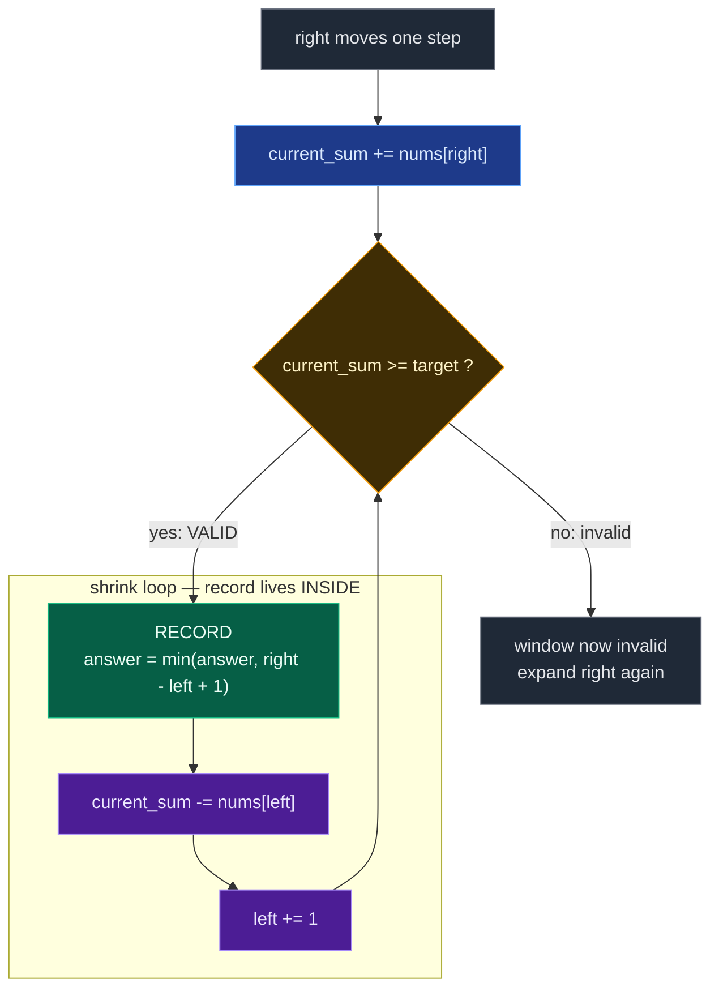

# 05. 209. Minimum Size Subarray Sum

| Difficulty | Pattern | Source | Time | Space |
|:---:|:---:|:---:|:---:|:---:|
| **Medium** | Variable Window (Minimising) | [209. Minimum Size Subarray Sum](https://leetcode.com/problems/minimum-size-subarray-sum/) | `O(n)` | `O(1)` |

## 1. Problem Statement

Given an array of **positive** integers `nums` and a positive integer `target`, return *the **minimal length** of a subarray whose sum is greater than or equal to* `target`. If there is no such subarray, return `0` instead.

### Examples

```text
Input:  target = 7, nums = [2,3,1,2,4,3]
Output: 2
Explanation: The subarray [4,3] has the minimal length under the problem constraint.
```

```text
Input:  target = 4, nums = [1,4,4]
Output: 1
```

```text
Input:  target = 11, nums = [1,1,1,1,1,1,1,1]
Output: 0
```

### Constraints

- `1 <= target <= 10^9`
- `1 <= nums.length <= 10^5`
- `1 <= nums[i] <= 10^4`

**Follow up:** If you have figured out the `O(n)` solution, try coding another solution of which the time complexity is `O(n log n)`.

## 2. Core Theory

Every sliding-window problem so far in this topic has been a **maximising** window: Longest Substring Without Repeating Characters, Max Consecutive Ones III, Fruit Into Baskets. This one is the **mirror image**, and the inversion changes the shape of the loop body.

**The inversion, stated precisely.**

| | Maximising window | Minimising window |
|:---|:---|:---|
| Goal | longest valid window | shortest valid window |
| Shrink while | **invalid** | **valid** |
| Record answer | **after** the shrink loop | **inside** the shrink loop |
| Sentinel | `answer = 0` | `answer = inf` |
| Accumulator | `max(...)` | `min(...)` |

Read the two middle rows again — they are the whole problem. In a max-window you shrink the *minimum* amount needed to restore validity, then measure once. Here you do the opposite: the moment the window becomes valid you start *actively giving ground* from the left, measuring at every step, and only stop when the window finally breaks.

**Why `while` is mandatory, not `if`.** In Max Consecutive Ones III a lazy one-step shrink was defensible, because once you already had a best length of `6`, windows of length `5`, `4`, `3` could never improve a *maximum*. Here they are exactly what you are hunting for. Concretely, with `target = 7` and `nums = [2,3,1,2,4,3]` at `right = 4`:

```text
window [3,1,2,4]  sum = 10  >= 7   length 4   -> record 4
shrink once, remove 3:
window   [1,2,4]  sum =  7  >= 7   length 3   -> record 3   <-- an 'if' never gets here
shrink again, remove 1:
window     [2,4]  sum =  6  <  7              -> stop
```

An `if` records `4`, does one shrink, and exits the block. It never sees the `3`. Since every additional shrink can only produce a *shorter* valid window, and shorter is better, you must keep shrinking until validity actually breaks. **Longest: shrink while invalid. Shortest: shrink while valid.**

**Why the update goes before the removal.** Inside the loop the order is `record -> remove -> advance`, never the reverse. At the moment you enter the loop body the window *is* valid, so its length is a legitimate candidate. If you removed `nums[left]` first and recorded afterwards, you would be measuring a window you have already broken. With `window = [4,3]`, `sum = 7`: record `2` first; remove `4` and the sum drops to `3`, and that candidate of length `2` — the actual answer — is gone forever.

Here is the loop, with the critical placement made explicit:



Compare that with the max-window diagram in the Fruit Into Baskets note: there the green "record" box hangs *below and outside* the shrink loop. Here it sits *inside* it, as the loop's first statement. That single relocation is the entire structural difference between the two families.

**Why the sentinel must be infinity, and must be converted back.** With `min`, a starting value of `0` would win every comparison and the function would always return `0`. So the sentinel has to be larger than any achievable length — `float("inf")` in Python, or `n + 1` if you prefer to stay in integers. But the problem demands `0` when no valid subarray exists, so the sentinel must be translated on the way out:

```python
if min_length == float("inf"):
    return 0
return min_length
```

Forgetting that line returns `inf` on `target = 11, nums = [1,1,1,1,1,1,1,1]` — the failure the third LeetCode example is specifically there to catch.

**Why this needs all-positive values — the load-bearing constraint.** The problem says `1 <= nums[i]`, and that is not decoration. With positives:

```text
expanding right  ->  current_sum can only INCREASE
shrinking left   ->  current_sum can only DECREASE
```

Those two facts make the validity predicate **monotone in the window boundaries**, which is exactly what a two-pointer scan requires. Once `[left..right]` is too small, no `left' > left` can fix it, so `left` never needs to move backwards; once `[left..right]` is valid, shrinking will eventually and monotonically break it, so `while` terminates meaningfully.

Introduce a single negative and the whole structure collapses:

```text
nums = [5, -10, 20], target = 15

window [5]        sum =  5   invalid
window [5,-10]    sum = -5   GROWING the window made the sum SMALLER
window [5,-10,20] sum = 15   valid again
```

The sum is no longer monotone in the window size, so "expand until valid, then shrink while valid" is meaningless — a window that is currently invalid might become valid by growing, *or* a currently-invalid prefix might hide a valid window you have already slid past. `left` would need to move backwards, which a sliding window structurally cannot do. The correct tool becomes **prefix sums plus a monotonic deque**: build `prefix[i]`, and for each `i` find the largest `j < i` with `prefix[j] <= prefix[i] - target`, maintaining a deque of indices with increasing prefix values. That is still `O(n)`, but it is a different algorithm with different state — see the follow-ups.

The same positivity is also what licenses the `break` in the brute force, and what makes the prefix-sum array *strictly increasing* so it can be binary searched. Every approach in this note leans on it.

## 3. Visual Intuition

```text
target = 7
nums   = [2, 3, 1, 2, 4, 3]
```

The valid subarrays (sum at least `7`) look like this:

```text
[2, 3, 1, 2] = 8    length = 4
[3, 1, 2, 4] = 10   length = 4
[2, 4, 3]    = 9    length = 3
[4, 3]       = 7    length = 2   <-- shortest
```

So the answer is `2`. Watch the window do it. It expands until the sum first clears `7`:

```text
[2  3  1  2] 4  3     sum = 8   >= 7   valid, length 4
 L        R
```

Now — and this is the part unique to minimising windows — it does not stop. It keeps giving ground on the left, measuring each time, until the sum falls below `7`:

```text
 2 [3  1  2] 4  3     sum = 6   <  7   invalid, stop shrinking
    L     R
```

Expand again to pick up `4`:

```text
 2 [3  1  2  4] 3     sum = 10  >= 7   valid, length 4
    L        R

 2  3 [1  2  4] 3     sum = 7   >= 7   valid, length 3   better
       L     R

 2  3  1 [2  4] 3     sum = 6   <  7   invalid, stop
          L  R
```

Expand once more to pick up the final `3`:

```text
 2  3  1 [2  4  3]    sum = 9   >= 7   valid, length 3
          L     R

 2  3  1  2 [4  3]    sum = 7   >= 7   valid, length 2   BEST
             L  R

 2  3  1  2  4 [3]    sum = 3   <  7   invalid, stop
                L
                R
```

The answer `2` was found by the *second* shrink step of the last expansion. An `if`-based shrink would have stopped one step earlier and returned `3`.

## 4. Key Observation

Two monotonicity facts, both consequences of `nums[i] >= 1`:

```text
1. For a fixed left, the window sum is non-decreasing in right.
2. For a fixed right, the window sum is non-increasing in left.
```

From (1): once `[left..right]` is valid, extending `right` further can never make it invalid *and* can never make it shorter — so there is no reason to keep extending before shrinking. Hence "expand only until valid".

From (2): the shortest valid window ending at a given `right` is found by pushing `left` as far right as possible while validity holds. Hence "shrink while valid, and record every step".

Together they mean each `right` contributes exactly one best candidate, and scanning all `right` in one forward pass finds the global minimum.

## 5. Edge Cases

| Case | Input | Expected | Why it matters |
|:---|:---|:---:|:---|
| No valid subarray | `target = 11`, `nums = [1,2,3,4]` | `0` | Total sum is `10 < 11`; the `inf` sentinel must convert to `0` |
| Single element suffices | `target = 5`, `nums = [1,2,5,1]` | `1` | Answer of `1` is the floor; a single element can be the whole window |
| Target met exactly by one element | `target = 4`, `nums = [1,4,4]` | `1` | Boundary: `>=` not `>`; `4 >= 4` is valid |
| Whole array needed | `target = 15`, `nums = [1,2,3,4,5]` | `5` | Only the full array reaches `15`; window must never over-shrink |
| Single element array, valid | `target = 3`, `nums = [3]` | `1` | Loop runs once and the shrink loop fires once |
| Single element array, invalid | `target = 4`, `nums = [3]` | `0` | Shrink loop never fires; sentinel path is the only exit |
| Multi-step shrink required | `target = 7`, `nums = [2,3,1,2,4,3]` | `2` | `if` instead of `while` returns `3` here |
| All equal, exact multiple | `target = 6`, `nums = [2,2,2,2]` | `3` | Answer sits strictly inside the array |
| Huge target | `target = 10^9`, `nums = [1,1,1]` | `0` | No overflow concerns in Python, but the sentinel path must hold |

## 6. Brute Force Solution: Try Every Subarray

### Intuition

Try every possible subarray. For each starting index, calculate the sum by extending the ending index. Whenever the sum becomes greater than or equal to `target`, update the minimum length.

Because all numbers are positive, the *first* `end` that clears the target is the best one for this `start` — extending further only makes the subarray longer. So we can `break` immediately.

### Approach

1. Initialise `min_length = inf`.
2. For each `start` from `0` to `n - 1`, reset `current_sum = 0`.
3. Extend `end` from `start` to `n - 1`, adding `nums[end]`.
4. If `current_sum >= target`, update `min_length` with `end - start + 1` and `break`.
5. If `min_length` is still `inf`, return `0`; otherwise return `min_length`.

### Dry Run

```text
target = 7
nums   = [2,3,1,2,4,3]
```

From `start = 0`:

```text
[2]         sum = 2
[2,3]       sum = 5
[2,3,1]     sum = 6
[2,3,1,2]   sum = 8  ✓   length 4, break
```

From `start = 1`:

```text
[3]         = 3
[3,1]       = 4
[3,1,2]     = 6
[3,1,2,4]   = 10 ✓   length 4, break
```

And so on. `start = 4` gives `[4,3] = 7` with length `2`, which becomes the answer.

### Code

```python
# Define the class solution
class Solution:

    # Define the method
    def minSubArrayLen(self, target: int, nums: List[int]) -> int:

        # Store the size of the array.
        n = len(nums)

        # Store a very large value as initial minimum length.
        min_length = float("inf")

        # Try every possible starting index.
        for start in range(n):

            # Store sum of current subarray.
            current_sum = 0

            # Try every possible ending index.
            for end in range(start, n):

                # Add current element into current subarray sum.
                current_sum += nums[end]

                # If current sum reaches or crosses target.
                if current_sum >= target:

                    # Update minimum length.
                    min_length = min(min_length, end - start + 1)

                    # Since all numbers are positive,
                    # extending further will only increase length,
                    # so we can stop for this start.
                    break

        # If min_length was never updated, no valid subarray exists.
        if min_length == float("inf"):

            # Return 0 as required.
            return 0

        # Return the smallest valid length.
        return min_length
```

### Complexity

| Measure | Complexity | Why |
|:---|:---:|:---|
| **Time** | `O(n^2)` | Outer loop runs `n` times; inner loop can also run up to `n` times. |
| **Space** | `O(1)` | Only a running sum and the answer are stored. |

## 7. Better Solution: Prefix Sum + Binary Search

### Intuition

Because all numbers are positive, the prefix sum array is **strictly increasing**. That means we can binary search it.

For:

```text
nums = [2,3,1,2,4,3]
```

the prefix array (with a leading zero) is:

```text
index:   0  1  2  3  4   5   6
prefix:  0  2  5  6  8  12  15
```

For each `start`, we want the smallest `end` such that:

```text
prefix[end] - prefix[start] >= target
```

which rearranges to:

```text
prefix[end] >= target + prefix[start]
```

Since `prefix` is sorted, `bisect_left` finds that `end` in `O(log n)`. This is the `O(n log n)` solution the problem's follow-up asks for.

### Approach

1. Build `prefix_sum` of length `n + 1` with `prefix_sum[0] = 0`.
2. For each `start` in `0..n-1`, compute `required_sum = target + prefix_sum[start]`.
3. Binary search `prefix_sum` for the first index at or above `required_sum`.
4. If that index is `<= n`, the subarray length is `end - start`; update the minimum.
5. Convert the `inf` sentinel to `0` before returning.

### Dry Run

```text
target = 7, prefix = [0, 2, 5, 6, 8, 12, 15]
```

```text
start = 0: required = 7 + 0 = 7  -> first prefix >= 7 is 8 at index 4  -> length 4 - 0 = 4
start = 1: required = 7 + 2 = 9  -> first prefix >= 9 is 12 at index 5 -> length 5 - 1 = 4
start = 2: required = 7 + 5 = 12 -> first prefix >= 12 is 12 at index 5 -> length 5 - 2 = 3
start = 3: required = 7 + 6 = 13 -> first prefix >= 13 is 15 at index 6 -> length 6 - 3 = 3
start = 4: required = 7 + 8 = 15 -> first prefix >= 15 is 15 at index 6 -> length 6 - 4 = 2  BEST
start = 5: required = 7 + 12 = 19 -> nothing >= 19 -> no candidate
```

Minimum is `2`.

### Code

```python
# Define the class solution
class Solution:

    # Define the method
    def minSubArrayLen(self, target: int, nums: List[int]) -> int:

        # Store the size of the array.
        n = len(nums)

        # Create prefix sum array with one extra zero at the beginning.
        prefix_sum = [0] * (n + 1)

        # Build prefix sum array.
        for i in range(n):

            # prefix_sum[i + 1] stores sum of nums[0] to nums[i].
            prefix_sum[i + 1] = prefix_sum[i] + nums[i]

        # Store very large value as answer initially.
        min_length = float("inf")

        # Try each starting position.
        for start in range(n):

            # Required prefix sum value to make subarray sum >= target.
            required_sum = target + prefix_sum[start]

            # Find the first index where prefix_sum[index] >= required_sum.
            end = bisect.bisect_left(prefix_sum, required_sum)

            # If such end exists inside prefix_sum.
            if end <= n:

                # Subarray length is end - start.
                min_length = min(min_length, end - start)

        # If no valid subarray found, return 0.
        if min_length == float("inf"):

            # Return 0.
            return 0

        # Return minimum valid length.
        return min_length
```

### Complexity

| Measure | Complexity | Why |
|:---|:---:|:---|
| **Time** | `O(n log n)` | For each starting index we do a binary search. |
| **Space** | `O(n)` | The prefix sum array. |

This is better than brute force, but not the most optimal.

## 8. Optimal Solution: Variable-Size Sliding Window

### Intuition

We use two pointers, `left` and `right`, and keep a running sum of the current window `nums[left:right+1]`.

We expand the window by moving `right`. Whenever the sum becomes at least `target`, the window is valid. Now we try to shrink from the left to make it smaller. **While** the window is valid:

```text
update answer
remove nums[left]
move left forward
```

This ensures we find the smallest window.

**Why shrinking works.** Because all elements are positive. If the current sum is already greater than or equal to `target`, removing elements from the left may still keep it valid. So we keep removing until it becomes invalid — that gives us the smallest valid window ending at this `right`.

### Approach

1. Initialise `left = 0`, `current_sum = 0`, `min_length = inf`.
2. For each `right`, add `nums[right]` to `current_sum`.
3. **While** `current_sum >= target`: record `right - left + 1`, subtract `nums[left]`, advance `left`.
4. After the scan, return `0` if `min_length` is still `inf`, else `min_length`.

### Dry Run

```text
target = 7
nums = [2, 3, 1, 2, 4, 3]
```

Initial:

```text
left = 0
current_sum = 0
min_length = infinity
```

#### right = 0

```text
nums[0] = 2
current_sum = 2
```

Current sum is less than target. No update.

```text
[2] 3  1  2  4  3
 L
 R
```

#### right = 1

```text
nums[1] = 3
current_sum = 5
```

Still less than target. No update.

```text
[2  3] 1  2  4  3
 L  R
```

#### right = 2

```text
nums[2] = 1
current_sum = 6
```

Still less than target. No update.

```text
[2  3  1] 2  4  3
 L     R
```

#### right = 3

```text
nums[3] = 2
current_sum = 8
```

Now valid because:

```text
8 >= 7
```

Current window:

```text
[2, 3, 1, 2]
length = 4
```

Update:

```text
min_length = 4
```

Now shrink from left:

```text
remove nums[0] = 2
current_sum = 6
left = 1
```

Now invalid, so stop shrinking.

```text
 2 [3  1  2] 4  3
    L     R
```

#### right = 4

```text
nums[4] = 4
current_sum = 10
```

Current window:

```text
[3, 1, 2, 4]
length = 4
```

Update:

```text
min_length = 4
```

Shrink:

```text
remove nums[1] = 3
current_sum = 7
left = 2
```

Still valid. Current window:

```text
[1, 2, 4]
length = 3
```

Update:

```text
min_length = 3
```

Shrink again:

```text
remove nums[2] = 1
current_sum = 6
left = 3
```

Now invalid.

```text
 2  3  1 [2  4] 3
          L  R
```

#### right = 5

```text
nums[5] = 3
current_sum = 9
```

Current window:

```text
[2, 4, 3]
length = 3
```

Update:

```text
min_length = 3
```

Shrink:

```text
remove nums[3] = 2
current_sum = 7
left = 4
```

Still valid. Current window:

```text
[4, 3]
length = 2
```

Update:

```text
min_length = 2
```

Shrink again:

```text
remove nums[4] = 4
current_sum = 3
left = 5
```

Now invalid.

```text
 2  3  1  2  4 [3]
                L
                R
```

Final answer:

```text
2
```

### Code

```python
# Define the class solution
class Solution:

    # Define the method
    def minSubArrayLen(self, target: int, nums: List[int]) -> int:

        # Store the left boundary of the sliding window.
        left = 0

        # Store the sum of the current window.
        current_sum = 0

        # Store a very large value as initial minimum length.
        min_length = float("inf")

        # Move the right boundary through the array.
        for right in range(len(nums)):

            # Add the current element into the window sum.
            current_sum += nums[right]

            # While current window sum is valid,
            # try to shrink it from the left.
            while current_sum >= target:

                # Calculate current valid window length.
                current_length = right - left + 1

                # Update minimum length.
                min_length = min(min_length, current_length)

                # Remove the leftmost element from current window sum.
                current_sum -= nums[left]

                # Move left boundary forward.
                left += 1

        # If no valid subarray was found, return 0.
        if min_length == float("inf"):

            # Return 0 as required by the problem.
            return 0

        # Return the minimum valid subarray length.
        return min_length
```

### Complexity

| Measure | Complexity | Why |
|:---|:---:|:---|
| **Time** | `O(n)` | Each element enters the window once using `right` and leaves once using `left`, so total operations are linear. |
| **Space** | `O(1)` | Only `current_sum`, `left` and `min_length` are stored. |

The nested `while` does not make this `O(n^2)`: `left` is monotone non-decreasing and bounded by `n`, so across the entire run the shrink loop executes at most `n` times in total.

## 9. Common Mistakes

| Mistake | Why it breaks | Fix |
|:---|:---|:---|
| Returning `inf` when nothing was found | The problem demands `0`; `inf` is not even an integer | `if min_length == float("inf"): return 0` |
| Starting `min_length = 0` | `min(0, anything)` is always `0`, so the answer is always `0` | Start at `float("inf")` (or `n + 1`) |
| Using `if current_sum >= target` instead of `while` | Records only the first valid window per `right` and misses shorter ones — returns `3` instead of `2` on the example | Use `while`, so shrinking continues until validity breaks |
| Recording the length *after* `current_sum -= nums[left]` | Measures a window that has already been broken; loses the true minimum | Order is `record -> remove -> advance` |
| Shrinking on `current_sum > target` | Off-by-one: `sum == target` is valid and often *is* the answer | Condition is `>=` |
| Copying the max-window skeleton wholesale | Puts `min(...)` after the loop, where the window is invalid | Minimising windows record *inside* the shrink loop |
| Assuming it works with negatives | The sum stops being monotone in the window boundaries; `left` would need to move backwards | Requires `nums[i] > 0`; use prefix sums + monotonic deque otherwise |
| Reading `nums[left]` after `left += 1` | Subtracts the wrong element and corrupts `current_sum` | Subtract before advancing |

## 10. Interview Follow-ups

**Q: What if negative numbers were allowed?**

A: The sliding window breaks, because growing the window can now *decrease* the sum — the validity predicate is no longer monotone in the boundaries, so `left` can no longer be assumed to only move forward. The correct approach is prefix sums plus a **monotonic deque**: build `prefix[0..n]`, scan `i` from `0` to `n`, and while `prefix[i] - prefix[deque.front()] >= target` pop the front and record `i - front`; then pop the back while `prefix[back] >= prefix[i]` (those indices can never be a better left boundary) and push `i`. Still `O(n)` time and `O(n)` space. That is LeetCode 862, "Shortest Subarray with Sum at Least K".

**Q: The follow-up asks for `O(n log n)`. How?**

A: Prefix sum plus binary search, as in section 7. Positivity makes the prefix array strictly increasing, so for each `start` you binary search for the first `prefix[end] >= target + prefix[start]`. `O(n log n)` time, `O(n)` space. It is strictly worse than the window, but it is what the problem's follow-up is fishing for — and it is the approach that *does* generalise if you later need range queries.

**Q: Return the subarray itself, not just its length.**

A: Store `best_left` alongside `min_length`. Inside the shrink loop, when `right - left + 1` beats the record, also set `best_left = left`. At the end return `nums[best_left : best_left + min_length]`, or `[]` if nothing was found. Same `O(n)` time.

**Q: What about "sum exactly equal to target" instead of "at least"?**

A: The window no longer works even with positives, because shrinking past the exact value overshoots downwards and you cannot recover. Use a hashmap of prefix sums: for each `i`, look up `prefix[i] - target`. That is `O(n)` time and `O(n)` space, and it handles negatives for free.

**Q: Why is the nested `while` still `O(n)`?**

A: Amortised analysis. `right` advances exactly `n` times. `left` only moves forward and is bounded by `n`, so the shrink loop body executes at most `n` times *in total* across the whole run, however unevenly those iterations cluster. Total work is `O(n + n) = O(n)`.

**Q: Could you binary search on the answer length instead?**

A: Yes — "is there a window of length `L` with sum at least `target`?" is monotone in `L` (if a window of length `L` works, so does one of length `L + 1`, by positivity). Check each `L` in `O(n)` with a fixed-size window, and binary search `L` over `1..n` for `O(n log n)`. Another valid answer to the follow-up, and a nice demonstration that you spotted the monotonicity.

## 11. Interview Explanation

> Since all numbers are positive, expanding the right pointer can only increase the running sum, while removing from the left can only decrease it. So I use a variable-size sliding window. I expand `right` and add each number to the current sum. Once the sum becomes at least the target, the window is valid, and because we are looking for the **minimum** length, I repeatedly record the current length and shrink from the left **while** the sum remains at least the target — not just once, since each further shrink may produce a better answer. I start the answer at infinity and convert it back to `0` if it was never updated. Both pointers move only forward, so every element enters and leaves the window at most once, giving `O(n)` time and `O(1)` extra space.

## 12. Pattern Summary

```text
Problem:
Minimum Size Subarray Sum

Window type:
Variable-size sliding window

Goal:
Minimum / shortest valid window

State:
current_sum

Valid:
current_sum >= target

Expand:
right++, current_sum += nums[right]

When valid:
update minimum

Shrink:
while current_sum >= target

Remove:
current_sum -= nums[left], left++

Answer:
minimum right - left + 1

Time:
O(n)

Space:
O(1)

Why sliding window works:
all nums[i] are positive

Advanced lazy IF optimization:
NOT APPLICABLE
```

Placed beside its siblings, the inversion is unmistakable:

| Problem | Goal | Shrink rule |
|:---|:---|:---|
| LC 3 — Longest Substring Without Repeating | Longest | while **invalid** -> shrink, then record |
| LC 1004 — Max Consecutive Ones III | Longest | while **invalid** -> shrink, then record |
| LC 904 — Fruit Into Baskets | Longest | while **invalid** -> shrink, then record |
| LC 209 — Minimum Size Subarray Sum | **Shortest** | while **valid** -> record, then shrink |

The two templates side by side:

```text
LONGEST                          SHORTEST
-------                          --------
for right:                       for right:
    add_right()                      add_right()
    while invalid():                 while valid():
        remove_left()                    answer = min(answer, len)
        left += 1                        remove_left()
    answer = max(answer, len)            left += 1
```

The one concept to retain from LC 209: **longest shrinks while invalid; shortest shrinks while valid.**

## 13. Verify

```python
from typing import List
import bisect


def minSubArrayLen(target: int, nums: List[int]) -> int:
    # Store the left boundary of the sliding window.
    left = 0
    # Store the sum of the current window.
    current_sum = 0
    # Store a very large value as initial minimum length.
    min_length = float("inf")
    # Move the right boundary through the array.
    for right in range(len(nums)):
        # Add the current element into the window sum.
        current_sum += nums[right]
        # While current window sum is valid, try to shrink it from the left.
        while current_sum >= target:
            # Calculate current valid window length.
            current_length = right - left + 1
            # Update minimum length.
            min_length = min(min_length, current_length)
            # Remove the leftmost element from current window sum.
            current_sum -= nums[left]
            # Move left boundary forward.
            left += 1
    # If no valid subarray was found, return 0.
    if min_length == float("inf"):
        return 0
    # Return the minimum valid subarray length.
    return min_length


def min_subarray_len_binary(target: int, nums: List[int]) -> int:
    # Store the size of the array.
    n = len(nums)
    # Create prefix sum array with one extra zero at the beginning.
    prefix_sum = [0] * (n + 1)
    # Build prefix sum array.
    for i in range(n):
        # prefix_sum[i + 1] stores sum of nums[0] to nums[i].
        prefix_sum[i + 1] = prefix_sum[i] + nums[i]
    # Store very large value as answer initially.
    min_length = float("inf")
    # Try each starting position.
    for start in range(n):
        # Required prefix sum value to make subarray sum >= target.
        required_sum = target + prefix_sum[start]
        # Find the first index where prefix_sum[index] >= required_sum.
        end = bisect.bisect_left(prefix_sum, required_sum)
        # If such end exists inside prefix_sum.
        if end <= n:
            # Subarray length is end - start.
            min_length = min(min_length, end - start)
    # Convert the inf sentinel to 0 before returning.
    return 0 if min_length == float("inf") else min_length


def brute(target: int, nums: List[int]) -> int:
    # Store the size of the array.
    n = len(nums)
    # Store a very large value as initial minimum length.
    best = float("inf")
    # Try every possible starting index.
    for start in range(n):
        # Store sum of current subarray.
        s = 0
        # Try every possible ending index.
        for end in range(start, n):
            # Add current element into current subarray sum.
            s += nums[end]
            # If current sum reaches or crosses target, stop for this start.
            if s >= target:
                best = min(best, end - start + 1)
                break
    # Convert the inf sentinel to 0 before returning.
    return 0 if best == float("inf") else best


# LeetCode examples
assert minSubArrayLen(7, [2, 3, 1, 2, 4, 3]) == 2
assert minSubArrayLen(4, [1, 4, 4]) == 1
assert minSubArrayLen(11, [1, 1, 1, 1, 1, 1, 1, 1]) == 0

# No valid subarray: the inf sentinel must convert to 0
assert minSubArrayLen(11, [1, 2, 3, 4]) == 0

# A single element is enough
assert minSubArrayLen(5, [1, 2, 5, 1]) == 1

# Target met exactly by one element (>= not >)
assert minSubArrayLen(4, [1, 4, 4]) == 1

# Whole array is needed
assert minSubArrayLen(15, [1, 2, 3, 4, 5]) == 5

# Single element array, valid and invalid
assert minSubArrayLen(3, [3]) == 1
assert minSubArrayLen(4, [3]) == 0

# All equal, answer sits strictly inside
assert minSubArrayLen(6, [2, 2, 2, 2]) == 3

# Huge target, tiny array
assert minSubArrayLen(10 ** 9, [1, 1, 1]) == 0

# Multi-step shrink: an 'if' instead of 'while' would return 3 here
assert minSubArrayLen(7, [2, 3, 1, 2, 4, 3]) == 2


def min_subarray_len_with_if(target, nums):
    """Deliberately wrong: one shrink per right instead of shrinking while valid."""
    left = 0
    s = 0
    best = float("inf")
    for right in range(len(nums)):
        s += nums[right]
        if s >= target:
            best = min(best, right - left + 1)
            s -= nums[left]
            left += 1
    return 0 if best == float("inf") else best


# The lazy 'if' is not merely slower, it is incorrect: here it reports 4
# where a window of length 2 exists.
assert min_subarray_len_with_if(8, [1, 1, 1, 5, 3]) == 4
assert minSubArrayLen(8, [1, 1, 1, 5, 3]) == 2

# Randomised cross-check against brute force and the O(n log n) variant
import random

random.seed(209)
for _ in range(4000):
    n = random.randint(1, 14)
    arr = [random.randint(1, 9) for _ in range(n)]
    t = random.randint(1, 40)
    expected = brute(t, arr)
    assert minSubArrayLen(t, arr) == expected, (t, arr)
    assert min_subarray_len_binary(t, arr) == expected, (t, arr)

# Structural property: the reported length really is achievable, and nothing shorter is
for _ in range(800):
    n = random.randint(1, 16)
    arr = [random.randint(1, 8) for _ in range(n)]
    t = random.randint(1, 30)
    k = minSubArrayLen(t, arr)
    if k == 0:
        assert sum(arr) < t, (t, arr)
    else:
        assert any(sum(arr[i:i + k]) >= t for i in range(n - k + 1)), (t, arr, k)
        assert all(sum(arr[i:i + k - 1]) < t for i in range(n - k + 2)), (t, arr, k)

# Large input stays linear and correct
big = [1] * 100000
assert minSubArrayLen(100000, big) == 100000
assert minSubArrayLen(100001, big) == 0

print("All tests passed")
```
