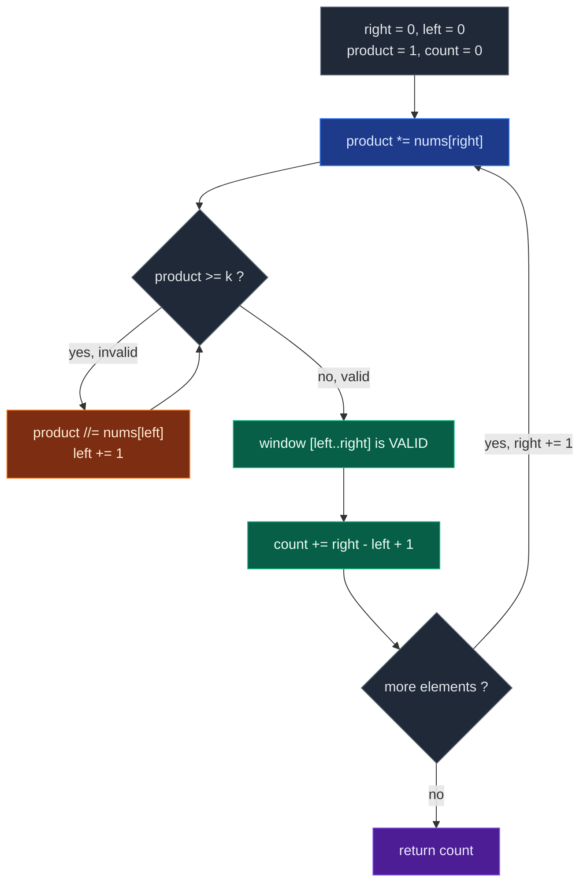

# 06. 713. Subarray Product Less Than K

| Difficulty | Pattern | Source | Time | Space |
|:---:|:---:|:---:|:---:|:---:|
| **Medium** | Counting Window | [713. Subarray Product Less Than K](https://leetcode.com/problems/subarray-product-less-than-k/) | `O(n)` | `O(1)` |

## 1. Problem Statement

Given an array of integers `nums` and an integer `k`, return *the number of contiguous subarrays where the product of all the elements in the subarray is strictly less than* `k`.

### Examples

```text
Input:  nums = [10,5,2,6], k = 100
Output: 8
Explanation: The 8 subarrays that have product less than 100 are:
[10], [5], [2], [6], [10, 5], [5, 2], [2, 6], [5, 2, 6]
Note that [10, 5, 2] is not included as the product of 100 is not strictly less than k.
```

```text
Input:  nums = [1,2,3], k = 0
Output: 0
```

### Constraints

- `1 <= nums.length <= 3 * 10^4`
- `1 <= nums[i] <= 1000`
- `0 <= k <= 10^6`

## 2. Core Theory

Every sliding-window problem so far asked for a **longest** or a **shortest** window. This one asks for **how many**. That single word changes the answer update completely, and it is the only reason 713 feels harder than it is.

**The window itself is ordinary.** The valid condition is `product < k`. Because every `nums[i]` is a positive integer, the product behaves monotonically:

```text
EXPAND RIGHT           SHRINK LEFT
product *= nums[right] product //= nums[left]
        ↓                      ↓
 never decreases        never increases
```

That monotonicity is exactly what licenses a two-pointer window. Expanding can only push the product up, shrinking can only pull it down, so `left` never has to move backwards. Both pointers march forward once each: `O(n)`.

### The counting identity

Here is the whole trick. After the `while` loop restores validity, the window `[left..right]` is valid. Ask a narrower question than "which subarrays are valid?" — ask **how many valid subarrays end exactly at `right`?**

They are the suffixes of the window:

```text
[left .. right]
[left+1 .. right]
[left+2 .. right]
...
[right .. right]
```

The starting index ranges over `left, left+1, ..., right`, and there are

```text
right - left + 1
```

such starts. So one line closes the whole iteration:

```python
count += right - left + 1
```

**Why is every one of those suffixes valid?** Because dropping elements off the left removes positive factors, and removing a positive factor can never increase a product. Concretely, with the window `[5, 2, 6]` and `k = 100`:

```text
window = [5, 2, 6]      product = 60   < 100  ✓
drop 5  → [2, 6]        product = 12   < 100  ✓
drop 2  → [6]           product = 6    < 100  ✓
```

Once the widest one is valid, all three are valid — so we count `3 = right - left + 1` in `O(1)` rather than re-multiplying anything.

**Why no double counting?** Every subarray has exactly one ending index. We count, at iteration `right`, only subarrays whose end index is `right`. Sweeping `right` from `0` to `n-1` therefore visits each valid subarray exactly once:

```text
right = 0  →  count subarrays ending at 0
right = 1  →  count subarrays ending at 1
right = 2  →  count subarrays ending at 2
right = 3  →  count subarrays ending at 3
```

Here is the full enumeration for `nums = [10, 5, 2, 6]`, `k = 100`:

```text
right = 0   window [10]        left=0   adds 1   → [10]
right = 1   window [10,5]      left=0   adds 2   → [5], [10,5]
right = 2   window [5,2]       left=1   adds 2   → [2], [5,2]
right = 3   window [5,2,6]     left=1   adds 3   → [6], [2,6], [5,2,6]
                                        total 8
```

Eight subarrays — matching the problem statement exactly, and note `[10,5,2]` never appears because `left` had already advanced past index `0` by the time `right` reached `2`.

### The decision loop



The counting step sits **after** the shrink loop, never inside it and never before it. That ordering is the correctness condition.

### Why `k <= 1` must return `0` immediately

Every `nums[i]` is at least `1`, so every non-empty subarray has product at least `1`. The required condition is `product < k`, strictly. With `k = 1` we would need `product < 1`, impossible. With `k = 0` we would need `product < 0`, also impossible. So:

```python
if k <= 1:
    return 0
```

This is not merely an optimization — without it, the `while product >= k` loop runs until `left` passes `right`, and `count += right - left + 1` then adds `0` or a negative value depending on how you wrote the loop. The guard removes the whole hazard.

### Why the shrink uses division, and why that is safe

Removing `nums[left]` from the window means dividing it out of the running product. Because all values are `>= 1`, none of them is `0`, so the division never divides by zero and never loses information: the running product is always exactly the product of the current window, and integer division `//=` is exact because `nums[left]` genuinely is one of the factors that were multiplied in.

### Why `while`, not `if`

One removal may not be enough. With `nums = [10, 10, 10]` and `k = 50`, after `right = 2` the product is `1000`; dividing out one `10` leaves `100`, still `>= 50`. A single `if` would leave the window invalid, and `right - left + 1` would then count subarrays that are not valid. **Counting problems must restore validity fully before counting** — the "lazy `if`" shortcut that works for longest-window problems (LC 1004, LC 904) is not applicable here.

### Where this sits among the patterns

| Goal | Typical answer update |
|:---|:---|
| Longest valid window | `ans = max(ans, right - left + 1)` |
| Shortest valid window | while valid: `ans = min(ans, right - left + 1)`, then shrink |
| **Count valid windows** | **`count += right - left + 1`** |

Compare LC 209 (Minimum Size Subarray Sum) directly: same positive numbers, same two pointers, completely different objective. 209 shrinks *while valid* and takes a minimum; 713 shrinks *while invalid* and then adds. The `R - L + 1` counting trick reappears in several later sliding-window problems, so it is worth internalising here.

## 3. Edge Cases

| Case | Input | Expected | Why it matters |
|:---|:---|:---:|:---|
| Single element, valid | `nums = [1], k = 2` | `1` | Smallest window must still contribute `1` |
| Single element, invalid | `nums = [5], k = 5` | `0` | Strict `<`, not `<=` |
| `k = 0` | `nums = [1,2,3], k = 0` | `0` | Guard must fire before the loop |
| `k = 1` | `nums = [1,1,1], k = 1` | `0` | Product `1` is not `< 1` |
| `k = 2`, all ones | `nums = [1,1,1], k = 2` | `6` | Every subarray valid: `n(n+1)/2 = 6` |
| All identical, large | `nums = [10,10,10], k = 50` | `3` | Shrink loop must iterate more than once |
| No valid subarray | `nums = [1000,1000], k = 100` | `0` | `left` overtakes `right` each step |
| Every subarray valid | `nums = [1,2,3], k = 1000` | `6` | `left` never moves at all |

## 4. Brute Force Solution: Try Every Subarray

### Intuition

Try every possible subarray.

For every starting index, keep multiplying elements to the right.

Whenever product is less than `k`, count it.

If product becomes greater than or equal to `k`, we can stop for that start because all numbers are positive.

### Approach

1. Fix a starting index `start`.
2. Walk `end` forward from `start`, multiplying `nums[end]` into `product`.
3. If `product < k`, this subarray is valid, so increment `count`.
4. Otherwise `break` — extending further only makes the product larger.
5. Return `count`.

### Dry Run

```text
nums = [10, 5, 2, 6], k = 100
```

```text
start = 0:  [10]        = 10   ✓ count = 1
            [10,5]      = 50   ✓ count = 2
            [10,5,2]    = 100  ✗ break

start = 1:  [5]         = 5    ✓ count = 3
            [5,2]       = 10   ✓ count = 4
            [5,2,6]     = 60   ✓ count = 5

start = 2:  [2]         = 2    ✓ count = 6
            [2,6]       = 12   ✓ count = 7

start = 3:  [6]         = 6    ✓ count = 8
```

Answer: `8`.

### Code

```python
# Define the solution
class Solution:

    # Define the method
    def numSubarrayProductLessThanK(self, nums: List[int], k: int) -> int:

        # Store the length of the array.
        n = len(nums)

        # Store the number of valid subarrays.
        count = 0

        # Try every possible starting index.
        for start in range(n):

            # Store product of current subarray.
            product = 1

            # Try every possible ending index.
            for end in range(start, n):

                # Multiply current element into product.
                product *= nums[end]

                # If product is less than k, this subarray is valid.
                if product < k:

                    # Count this valid subarray.
                    count += 1

                # If product becomes greater than or equal to k,
                # further extension will not make it smaller because nums are positive.
                else:

                    # Stop checking for this starting index.
                    break

        # Return total count of valid subarrays.
        return count
```

### Complexity

| Measure | Complexity | Why |
|:---|:---:|:---|
| **Time** | `O(n^2)` | Outer loop runs `n` times, inner loop can also run up to `n` times. |
| **Space** | `O(1)` | Only a few scalar variables. |

This can be too slow for large input.

## 5. Optimal Solution: Variable-Size Sliding Window

### Intuition

We maintain a window:

```text
nums[left:right+1]
```

This window should have product less than `k`. We keep a variable `product` which stores the product of all elements in the current window.

For every `right`:

```text
product *= nums[right]
```

If the product becomes invalid:

```text
product >= k
```

then we shrink from the left:

```text
product //= nums[left]
left += 1
```

until the product becomes valid again. Then, and only then, we count.

### Approach

1. If `k <= 1`, return `0` immediately — no positive product can be strictly less than `k`.
2. Initialise `left = 0`, `product = 1`, `count = 0`.
3. For each `right`, multiply `nums[right]` into `product`.
4. While `product >= k`, divide out `nums[left]` and advance `left`.
5. The window is now valid, so add `right - left + 1` to `count`.
6. Return `count`.

### Dry Run

```text
nums = [10, 5, 2, 6]
k = 100
```

Initial:

```text
left = 0
product = 1
count = 0
```

#### right = 0

```text
nums[0] = 10
product = 1 * 10 = 10
```

Product is valid:

```text
10 < 100
```

Number of valid subarrays ending at index 0:

```text
right - left + 1 = 0 - 0 + 1 = 1
```

Subarrays:

```text
[10]
```

Update:

```text
count = 1
```

#### right = 1

```text
nums[1] = 5
product = 10 * 5 = 50
```

Product is valid:

```text
50 < 100
```

Number of valid subarrays ending at index 1:

```text
right - left + 1 = 1 - 0 + 1 = 2
```

Subarrays:

```text
[5]
[10, 5]
```

Update:

```text
count = 1 + 2 = 3
```

#### right = 2

```text
nums[2] = 2
product = 50 * 2 = 100
```

Product is invalid:

```text
100 >= 100
```

Shrink from left. Remove `nums[0] = 10`:

```text
product = 100 / 10 = 10
left = 1
```

Now product is valid:

```text
10 < 100
```

Current valid window:

```text
[5, 2]
```

Number of valid subarrays ending at index 2:

```text
right - left + 1 = 2 - 1 + 1 = 2
```

Subarrays:

```text
[2]
[5, 2]
```

Update:

```text
count = 3 + 2 = 5
```

#### right = 3

```text
nums[3] = 6
product = 10 * 6 = 60
```

Product is valid:

```text
60 < 100
```

Current valid window:

```text
[5, 2, 6]
```

Number of valid subarrays ending at index 3:

```text
right - left + 1 = 3 - 1 + 1 = 3
```

Subarrays:

```text
[6]
[2, 6]
[5, 2, 6]
```

Update:

```text
count = 5 + 3 = 8
```

Final answer:

```text
8
```

### Code

```python
class Solution:

    # Define the method
    def numSubarrayProductLessThanK(self, nums: List[int], k: int) -> int:

        # If k is 0 or 1, no positive product can be strictly less than k.
        if k <= 1:

            # Return 0 because nums contains positive integers.
            return 0

        # Left pointer of the sliding window.
        left = 0

        # Product of elements inside the current window.
        product = 1

        # Count of valid subarrays.
        count = 0

        # Move right pointer through the array.
        for right in range(len(nums)):

            # Include current element into the window product.
            product *= nums[right]

            # If product is invalid, shrink window from the left.
            while product >= k:

                # Remove leftmost element from product.
                product //= nums[left]

                # Move left boundary forward.
                left += 1

            # Now window product is less than k.
            # All subarrays ending at right and starting from left to right are valid.
            count += right - left + 1

        # Return total valid subarray count.
        return count
```

### Complexity

| Measure | Complexity | Why |
|:---|:---:|:---|
| **Time** | `O(n)` | Each element enters the window once through `right` and leaves at most once through `left`. |
| **Space** | `O(1)` | Only the running product and two pointers. |

## 6. More Worked Examples

### Example: `k = 0`

```text
nums = [1, 2, 3]
k = 0
```

Since `k <= 1`, no positive product can be less than `0`.

Answer:

```text
0
```

### Example: `k = 2`

```text
nums = [1, 1, 1]
k = 2
```

All subarrays have product:

```text
1
```

Since:

```text
1 < 2
```

every subarray is valid. Total subarrays of a length-3 array:

```text
3 * 4 / 2 = 6
```

Answer:

```text
6
```

### Example: repeated shrinking

```text
nums = [10, 10, 10]
k = 50
```

At `right = 1` the product is `100 >= 50`, so one division leaves `10` and `left = 1` — valid, adds `1`. At `right = 2` the product is `100` again, one division leaves `10` and `left = 2` — adds `1`. Together with `right = 0`'s single subarray:

```text
count = 1 + 1 + 1 = 3
```

Only `[10]`, `[10]`, `[10]` are valid. This is the example that proves `while` is required rather than `if` when the window would otherwise need two removals.

## 7. Common Mistakes

| Mistake | Why it breaks | Fix |
|:---|:---|:---|
| Omitting the `if k <= 1: return 0` guard | The shrink loop drags `left` past `right`; the count formula then adds `0` or a negative value, or the loop indexes out of range | Return `0` up front whenever `k <= 1` |
| `count += 1` per valid window | Counts one subarray per position instead of all suffixes ending at `right`, giving roughly `n` instead of the true total | `count += right - left + 1` |
| Counting inside the shrink loop | The window is still invalid mid-shrink, so invalid subarrays get counted | Count only after the `while` loop exits |
| `if product >= k` instead of `while` | One removal may not restore validity (`[10,10,10]`, `k = 50`) and the count formula then over-counts | Use `while product >= k` |
| Using `<=` in `while product > k` | `product == k` is not strictly less than `k`, so the window stays invalid | Shrink while `product >= k` |
| Float division `product /= nums[left]` | Introduces rounding drift in the running product over many steps | Use integer division `product //= nums[left]` |
| Reusing this template with zeroes or negatives | Product is no longer monotonic under expansion, so `left` would need to move backwards | Guard the inputs, or split on zeroes and use a different technique |

## 8. Interview Follow-ups

**Q: What if `nums` could contain zeroes?**

A: The sliding window breaks, because a `0` makes the product `0` regardless of how far the window extends, so the product is no longer monotonic in the window size — and `product //= nums[left]` would divide by zero. The fix is to split the array on zeroes into maximal zero-free segments, run the standard window on each, then add back every subarray that contains at least one zero (all of which have product `0`, valid whenever `k > 0`).

**Q: What if negatives were allowed?**

A: Sliding window is dead — multiplying by a negative can flip an invalid product to valid, so extending right no longer monotonically worsens things and `left` would have to move backwards. The usual route is to take logarithms of absolute values with prefix sums plus sign bookkeeping, or fall back to a divide-and-conquer or `O(n log n)` approach. In an interview, the right answer is to state clearly *which* property broke.

**Q: Why do you only count subarrays ending at `right`?**

A: To avoid double counting. Every subarray has exactly one ending index, so partitioning the answer by ending index counts each valid subarray exactly once. The alternative — counting by starting index — would need a second pass or a different pointer discipline.

**Q: Could you use the `atMost(k) - atMost(k-1)` trick here to count subarrays with product *exactly* less than some bound?**

A: For "at most" versus "exactly" style questions, yes — that subtraction identity is the standard move, and it is what powers "exactly k distinct" variants. Here the condition is already an inequality, so one pass suffices. But the general lesson transfers: a counting window that computes `atMost(X)` can answer "exactly X" as `atMost(X) - atMost(X-1)`.

**Q: Can you do this with the "lazy `if`" optimization you used for LC 1004?**

A: No, and this is the clearest illustration of why. In longest-window problems, a temporarily invalid window is harmless because it can never produce a larger answer. Here `right - left + 1` is used as a literal count of valid subarrays, so an invalid window directly injects wrong numbers into the answer. Counting problems must restore validity before counting.

**Q: How large can `count` get?**

A: Up to `n(n+1)/2`, which for `n = 3 * 10^4` is about `4.5 * 10^8` — comfortably inside a 32-bit signed int, but worth checking in languages without arbitrary-precision integers.

## 9. Interview Explanation

> Since all numbers are positive, I can use a variable-size sliding window. I maintain a running product for the current window. I expand the window using the right pointer. If the product becomes greater than or equal to `k`, I shrink the window from the left until the product becomes less than `k`. For every valid window ending at `right`, all subarrays ending at `right` and starting from `left` to `right` are valid, so I add `right - left + 1` to the answer. Both pointers move only forward, giving `O(n)` time and `O(1)` space. One special case: if `k <= 1` the answer is `0`, because every product of positive integers is at least `1`.

## 10. Verify

```python
from typing import List


def numSubarrayProductLessThanK(nums: List[int], k: int) -> int:
    if k <= 1:
        return 0
    left = 0
    product = 1
    count = 0
    for right in range(len(nums)):
        product *= nums[right]
        while product >= k:
            product //= nums[left]
            left += 1
        count += right - left + 1
    return count


def brute(nums: List[int], k: int) -> int:
    n = len(nums)
    total = 0
    for start in range(n):
        product = 1
        for end in range(start, n):
            product *= nums[end]
            if product < k:
                total += 1
            else:
                break
    return total


# LeetCode examples
assert numSubarrayProductLessThanK([10, 5, 2, 6], 100) == 8
assert numSubarrayProductLessThanK([1, 2, 3], 0) == 0

# Single element, valid
assert numSubarrayProductLessThanK([1], 2) == 1

# Single element, invalid: strict less-than
assert numSubarrayProductLessThanK([5], 5) == 0

# k = 1: product is at least 1, never strictly less than 1
assert numSubarrayProductLessThanK([1, 1, 1], 1) == 0

# k = 2 with all ones: every subarray valid, n(n+1)/2 = 6
assert numSubarrayProductLessThanK([1, 1, 1], 2) == 6

# All identical, shrink loop must run more than once
assert numSubarrayProductLessThanK([10, 10, 10], 50) == 3

# No valid subarray at all
assert numSubarrayProductLessThanK([1000, 1000], 100) == 0

# Every subarray valid: left never moves
assert numSubarrayProductLessThanK([1, 2, 3], 1000) == 6

# Count never exceeds n(n+1)/2
for n in range(1, 40):
    assert numSubarrayProductLessThanK([1] * n, 2) == n * (n + 1) // 2

# Cross-check the counting logic against brute force on random inputs
import random

random.seed(713)
for _ in range(3000):
    n = random.randint(1, 12)
    arr = [random.randint(1, 12) for _ in range(n)]
    kk = random.randint(0, 300)
    assert numSubarrayProductLessThanK(arr, kk) == brute(arr, kk), (arr, kk)

# Larger random cross-check with wider value range
for _ in range(300):
    n = random.randint(1, 40)
    arr = [random.randint(1, 1000) for _ in range(n)]
    kk = random.randint(0, 10 ** 6)
    assert numSubarrayProductLessThanK(arr, kk) == brute(arr, kk), (arr, kk)

print("All tests passed")
```
