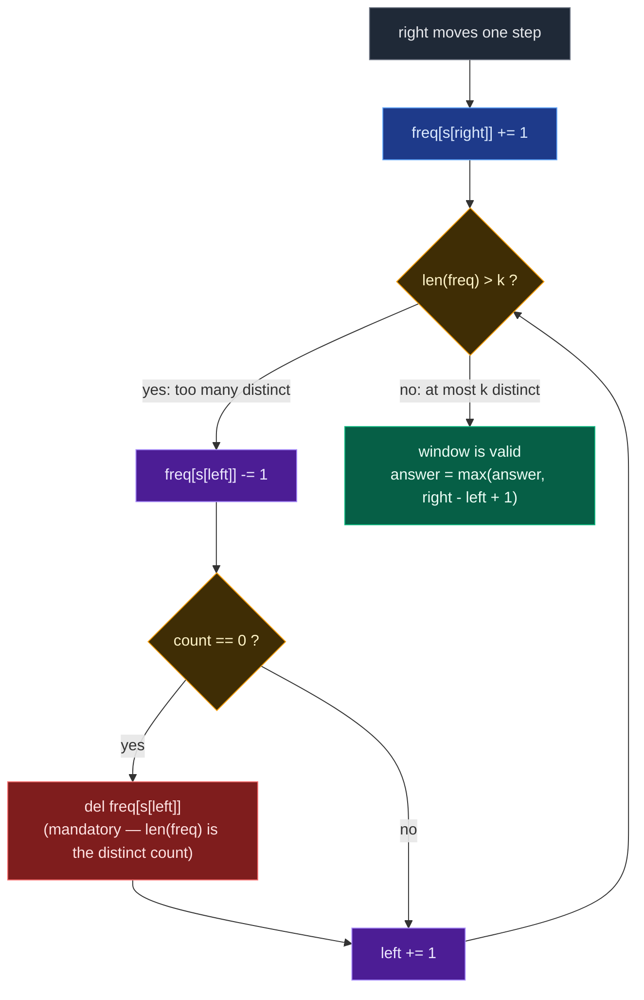

# 01. 340. Longest Substring With At Most K Distinct Characters

| Difficulty | Pattern | Source | Time | Space |
|:---:|:---:|:---:|:---:|:---:|
| **Medium** | Variable Window + Count Map | [340. Longest Substring With At Most K Distinct Characters](https://leetcode.com/problems/longest-substring-with-at-most-k-distinct-characters/) | `O(n)` | `O(k)` |

## 1. Problem Statement

Given a string `s` and an integer `k`, return *the length of the longest substring of* `s` *that contains at most* `k` ***distinct*** *characters*.

### Examples

```text
Input:  s = "eceba", k = 2
Output: 3
Explanation: The substring is "ece" with length 3.
```

```text
Input:  s = "aa", k = 1
Output: 2
Explanation: The substring is "aa" with length 2.
```

### Constraints

- `1 <= s.length <= 5 * 10^4`
- `0 <= k <= 50`

## 2. Core Theory

**This is the parent problem of the whole "At Most" section.** Everything else in this folder is a special case of it wearing different clothes:

| Problem | What it really asks | Relation to 340 |
|:---|:---|:---|
| LC 340 — At Most K Distinct | longest substring, `distinct <= k` | the template itself |
| LC 159 — At Most Two Distinct | longest substring, `distinct <= 2` | `k = 2` |
| LC 904 — Fruit Into Baskets | longest subarray, `distinct <= 2` | `k = 2`, integers instead of characters, wrapped in a farm story |

Learn this one template and all three are solved. The author's own notes say it plainly: **LC 159 is LC 340 with `k = 2`**, and LC 904 is the same pattern applied to integers rather than characters.

**How to recognise it.** The trigger is the triple:

```text
LONGEST  +  SUBSTRING / SUBARRAY  +  AT MOST <something>
        ↓
VARIABLE-SIZE SLIDING WINDOW  +  FREQUENCY HASHMAP
```

"Substring" means contiguous, so a window. "At most" means the condition is **monotone** — if a window is valid, every sub-window of it is valid too — so shrinking from the left always makes progress and `right` never needs to move backwards. "Longest" means we want the widest legal window, so we expand greedily and shrink only when forced.

**The window state.** The validity condition is:

```text
number of distinct characters in s[left .. right]  <=  k
```

so the window state has to be able to answer "how many distinct characters are inside me?" in `O(1)`. A frequency hashmap does exactly that:

```text
character -> number of occurrences currently inside the window
```

and then `len(freq)` **is** the distinct count.

**Why a map and not a set.** A set cannot tell you whether a character has *completely* left the window. Take the author's own example:

```text
window = "ece"      freq = {e: 2, c: 1}
          ↑
        left
```

`left` steps off an `e`, but a second `e` is still inside. With a plain set you would have to rebuild it from the whole window to notice — `O(n)` per step. With a count map it is one decrement: `e: 2 -> 1`, and the key stays. Only when the count actually reaches `0` has the character genuinely left.

**The template, once, cleanly.**

```text
expand:  freq[s[right]] += 1

shrink:  while len(freq) > k:
             freq[s[left]] -= 1
             if freq[s[left]] == 0:
                 del freq[s[left]]        <-- MANDATORY
             left += 1

record:  answer = max(answer, right - left + 1)
```

**Why deleting the zero-count key is mandatory.** `len(freq)` is the distinct count *only if* the map contains exactly the characters present in the window. A key sitting at `0` is a character that already left — but Python still counts it, so `len(freq)` is permanently inflated. The consequences cascade:

```text
without the del:
  len(freq) reports  k + 1  even though the window holds only  k  types
  the while loop keeps shrinking a window that was already valid
  left runs away to the right
  every recorded width is too small
  the function returns a wrong, too-small answer — and never crashes
```

That silence is what makes it the classic bug. There is no exception, no index error, just a number that is quietly wrong. **`len(freq)` is a correct distinct-count only if every zero-count key is deleted the instant it hits zero.**

Here is one iteration of `right` as a decision loop:



Notice where the recording step sits: **after** the shrink loop. That is the signature of a *maximising* window — shrink only until valid, then measure. The mirror image, a minimising window that records *inside* the loop, is LC 209 in this same topic.

**Why `while` and not `if`.** Adding one character can only introduce one new type, so one shrink step feels like it should be enough. It is not, because the outgoing character may have duplicates behind it. The author's example:

```text
s = "aaabbbc"   k = 2

add c:        "aaabbbc"   freq {a:3, b:3, c:1}  -> 3 types  invalid
shrink once:   "aabbbc"   freq {a:2, b:3, c:1}  -> 3 types  still invalid
shrink again:   "abbbc"   freq {a:1, b:3, c:1}  -> 3 types  still invalid
shrink again:    "bbbc"   freq {b:3, c:1}       -> 2 types  valid
```

Three shrinks. If your invariant is "the window is valid before I record the answer", `while` is mandatory. (A lazy `if` variant does exist — it works by *weakening* the invariant, not by fixing the count — and is covered in section 8.)

**Why the nested loop is still `O(n)`.** Amortised analysis. `left` is monotone non-decreasing and bounded by `n`, so across the entire run it advances at most `n` times, no matter how those steps cluster. `right` advances `n` times. Total pointer movement is `O(n + n) = O(n)`. Every character enters the window exactly once and leaves at most once.

**Space is `O(k)`.** The map holds at most `k` keys after the shrink loop, and momentarily `k + 1` at the instant of violation, so `O(k + 1) = O(k)`. With a fixed alphabet this is also `O(1)` — the author writes `O(256)` for extended ASCII — but `O(k)` is the honest answer when `k` is a parameter.

## 3. Visual Intuition

Take the author's string:

```text
s = a a a b b c c d       k = 2
    0 1 2 3 4 5 6 7
```

Start at index `0` and grow:

```text
[a a a] b b c c d
 L   R
freq = {a: 3}                 1 type   ✓   length 3
```

Keep going — `b` arrives, still legal:

```text
[a a a b b] c c d
 L       R
freq = {a: 3, b: 2}           2 types  ✓   length 5
```

Now `c` arrives and breaks it:

```text
[a a a b b c] c d
 L         R
freq = {a: 3, b: 2, c: 1}     3 types  ✗   too many
```

Shrink from the left until legal again. All three `a`s must go before the key `a` disappears:

```text
 a a a [b b c] c d
        L   R
freq = {b: 2, c: 1}           2 types  ✓   length 3
```

The best window was `"aabbb"`-shaped — length `5` — found before the third type forced a retreat. Notice what the window never did: restart. It grew on the right, and when a third type forced the issue it gave up exactly as much on the left as it had to.

## 4. Key Observation

Everything rests on one monotonicity fact:

```text
If a window has at most k distinct characters,
then every sub-window of it also has at most k distinct characters.
```

Two consequences follow, and they are precisely what legalise the sliding window:

| Consequence | Why it matters |
|:---|:---|
| Shrinking never makes a window *more* invalid | Shrinking from the left always moves toward validity |
| An invalid window can only be fixed from the left | `right` never needs to move backwards |

So both pointers are monotone non-decreasing, and the whole scan is a single forward pass.

## 5. Edge Cases

| Case | Input | Expected | Why it matters |
|:---|:---|:---:|:---|
| Empty string | `s = ""`, `k = 2` | `0` | No substring exists; the loop body never runs |
| `k = 0` | `s = "abc"`, `k = 0` | `0` | No character is allowed — without an early return, the shrink loop runs forever or `left` outruns `right` |
| `k = 1` | `s = "abaccc"`, `k = 1` | `3` | Degenerates to "longest run of one character" |
| `k >= distinct count` | `s = "abcba"`, `k = 5` | `5` | Whole string is valid; the shrink loop never fires |
| All identical | `s = "zzzzz"`, `k = 2` | `5` | Map never exceeds 1 key |
| Single character | `s = "x"`, `k = 1` | `1` | A size-1 window is always valid and must be recorded |
| Multi-step shrink | `s = "aaabbbc"`, `k = 2` | `6` | One shrink step is not enough — proves `while` over `if` |
| Duplicate behind `left` | `s = "aabbc"`, `k = 2` | `4` | `left` must clear both `a`s before the key vanishes — a set would drop the type early |

The `k = 0` guard is the one that actually bites. With `k = 0` the shrink condition `len(freq) > 0` is true the moment any character is added, so the loop shrinks until the window is empty — and then `s[left]` reads a character that is no longer inside it. Return `0` up front.

## 6. Brute Force Solution: Try Every Starting Index

### Intuition

Try every possible substring. For every starting index, keep expanding the ending index and track the distinct characters. If the distinct count exceeds `k`, stop for that starting index. Otherwise update the answer.

### Approach

1. For every `start` from `0` to `n - 1`.
2. Create an empty set (or map) of characters.
3. Extend `end` from `start` to `n - 1`, adding `s[end]`.
4. If the distinct count exceeds `k`, break out immediately — extending further can only make it worse.
5. Otherwise update `max_length` with `end - start + 1`.

### Dry Run

```text
s = "eceba"   k = 2
```

From `start = 0`:

```text
"e"       -> {e}        1 distinct  ✓  length 1
"ec"      -> {e,c}      2 distinct  ✓  length 2
"ece"     -> {e,c}      2 distinct  ✓  length 3
"eceb"    -> {e,c,b}    3 distinct  ✗  break
```

Best from this start is `3`. Repeat from `start = 1`, `start = 2`, and so on; the overall best stays `3`.

### Code

```python
# Define the class solution
class Solution:

    # Define the method
    def lengthOfLongestSubstringKDistinct(self, s: str, k: int) -> int:

        # Store the length of the string.
        n = len(s)

        # Store the maximum valid substring length.
        max_length = 0

        # Try every possible starting index.
        for start in range(n):

            # Store distinct characters in current substring.
            distinct_chars = set()

            # Try every possible ending index.
            for end in range(start, n):

                # Add current character into the set.
                distinct_chars.add(s[end])

                # If distinct characters are more than k, substring is invalid.
                if len(distinct_chars) > k:

                    # Stop expanding this starting index.
                    break

                # Calculate current valid substring length.
                current_length = end - start + 1

                # Update maximum length.
                max_length = max(max_length, current_length)

        # Return longest valid substring length.
        return max_length
```

### Complexity

| Measure | Complexity | Why |
|:---|:---:|:---|
| **Time** | `O(n^2)` | For every start index we may scan many characters to the right. |
| **Space** | `O(k)` | Because the set stores at most `k + 1` distinct characters before breaking. |

## 7. Optimal Solution: Sliding Window + Hashmap

### Intuition

Maintain a window `s[left : right + 1]` together with a hashmap:

```text
character -> frequency inside current window
```

For each `right`:

```text
Add s[right] into the hashmap
```

If the window has more than `k` distinct characters:

```text
Shrink from left until distinct characters become <= k
```

For every valid window:

```text
Update the maximum length
```

### Approach

1. If `k == 0`, return `0` immediately — no non-empty window is valid.
2. Initialise `frequency = {}`, `left = 0`, `answer = 0`.
3. Move `right` across the string, incrementing `frequency[s[right]]`.
4. While `len(frequency) > k`, decrement `frequency[s[left]]`, **delete the key if it hits `0`**, and advance `left`.
5. The window is now valid — update `answer` with `right - left + 1`.
6. Return `answer`.

### Dry Run

```text
s = "eceba"   k = 2

index:  0 1 2 3 4
char:   e c e b a
```

Initial state:

```text
left = 0
frequency = {}
answer = 0
```

#### right = 0

```text
s[0] = "e"
frequency = {e: 1}
distinct  = 1 <= 2   valid
answer    = 1
```

```text
[e] c  e  b  a
 L
 R
```

#### right = 1

```text
s[1] = "c"
frequency = {e: 1, c: 1}
distinct  = 2 <= 2   valid
answer    = 2
```

```text
[e  c] e  b  a
 L  R
```

#### right = 2

```text
s[2] = "e"
frequency = {e: 2, c: 1}
distinct  = 2 <= 2   valid   (frequency grew, distinct count did not)
answer    = 3
```

```text
[e  c  e] b  a
 L     R
```

#### right = 3 — the third distinct character arrives

```text
s[3] = "b"
frequency = {e: 2, c: 1, b: 1}
distinct  = 3 > 2    INVALID
```

Shrink from the left. Remove `s[left] = "e"`:

```text
frequency = {e: 1, c: 1, b: 1}     left = 1
distinct  = 3 > 2    still invalid
```

The key `e` survived because a second `e` is still inside — exactly why the map beats a set. Shrink again, removing `s[left] = "c"`:

```text
frequency = {e: 1, b: 1}           left = 2
distinct  = 2 <= 2   valid
```

`c` hit zero and was deleted. Current window:

```text
 e  c [e  b] a
       L  R
```

Length is `2`, so the answer remains:

```text
3
```

#### right = 4

```text
s[4] = "a"
frequency = {e: 1, b: 1, a: 1}
distinct  = 3 > 2    INVALID
```

Shrink once, removing `s[left] = "e"` — its count hits zero, so delete it:

```text
frequency = {b: 1, a: 1}           left = 3
distinct  = 2 <= 2   valid
```

```text
 e  c  e [b  a]
          L  R
```

Length is `2`, answer remains `3`.

Final answer:

```text
3
```

### Code

```python
# Define the class solution
class Solution:

    # Define the method
    def lengthOfLongestSubstringKDistinct(self, s: str, k: int) -> int:

        # If k is 0, we cannot include any character.
        if k == 0:

            # Return 0 because only empty substring is valid.
            return 0

        # This hashmap stores frequency of each character inside current window.
        frequency = {}

        # This pointer represents the start of the current window.
        left = 0

        # This variable stores the best answer found so far.
        answer = 0

        # This pointer represents the end of the current window.
        for right in range(len(s)):

            # Add the current right character into the window.
            frequency[s[right]] = frequency.get(s[right], 0) + 1

            # If current window contains more than k distinct characters,
            # keep shrinking it from the left side.
            while len(frequency) > k:

                # Decrease frequency of the leftmost character.
                frequency[s[left]] -= 1

                # If the leftmost character frequency becomes zero,
                # it is no longer present in the window.
                if frequency[s[left]] == 0:

                    # Remove the character from hashmap to reduce distinct count.
                    del frequency[s[left]]

                # Move the left boundary forward.
                left += 1

            # Current window is valid here.
            current_window_length = right - left + 1

            # Update the maximum valid window length.
            answer = max(answer, current_window_length)

        # Return the longest substring length with at most k distinct characters.
        return answer
```

### Complexity

| Measure | Complexity | Why |
|:---|:---:|:---|
| **Time** | `O(n)` | Each character enters the window once and leaves the window once. |
| **Space** | `O(k)` | The hashmap may temporarily store `k + 1` characters before shrinking, so `O(k + 1) = O(k)`. |

## 8. Advanced Solution: Lazy Shrink with `if`

### Intuition

The standard version keeps the invariant "the window is valid before I record the answer", which forces the `while`. The lazy version uses a **weaker** invariant:

```text
The maintained window may temporarily be invalid,
but an invalid window is never allowed to grow.
```

Suppose the best valid width so far is `W`. `right` advances, making the temporary width `W + 1`. Two cases:

- **Still at most `k` distinct.** Valid. `left` does not move. Width goes `W -> W + 1` — a genuinely better answer.
- **More than `k` distinct.** Invalid. Move `left` exactly once. Both pointers advanced, so the width stays `W`.

So an invalid expansion can never increase the maintained width, and only a valid one can push past the previous best. Because the width is non-decreasing and never shrinks, **no `max_length` variable is needed at all** — the final maintained width *is* the maximum. At the end `right = n - 1`, so:

```text
right - left + 1 = (n - 1) - left + 1 = n - left
```

### Approach

1. Guard `k == 0` and return `0`.
2. Expand `right` and increment the count as usual.
3. If `len(freq) > k`, move `left` **exactly once** (decrement, delete on zero, `left += 1`).
4. Never record an intermediate answer.
5. Return `len(s) - left`.

### Dry Run

```text
s = "aaabbbc"   k = 2
```

Best valid window before `c` arrives is `"aaabbb"`, width `6`. Add `c`:

```text
"aaabbbc"   -> {a, b, c}   three types, invalid
```

Move `left` once:

```text
 a "aabbbc"  -> still {a, b, c}, still invalid
```

That is fine. We are not claiming `"aabbbc"` is a valid answer — we are only *preserving* the width `6` that we already know was achievable, since `"aaabbb"` really did occur. The frame keeps sliding forward without growing until the constraint becomes satisfiable again, and only then can the width climb to `7`.

### Code

```python
# Define the class solution
class Solution:

    # Define the method
    def lengthOfLongestSubstringKDistinct(self, s: str, k: int) -> int:

        # If k is zero, no non-empty window is valid.
        if k == 0:
            return 0

        # Store frequencies inside the maintained window.
        freq = {}

        # Left boundary.
        left = 0

        # Expand the right pointer.
        for right in range(len(s)):

            # Get incoming character.
            current_char = s[right]

            # Add incoming character.
            freq[current_char] = freq.get(current_char, 0) + 1

            # If distinct count exceeds k, shrink ONLY ONCE.
            if len(freq) > k:

                # Get outgoing left character.
                left_char = s[left]

                # Reduce its frequency.
                freq[left_char] -= 1

                # Delete its key when count reaches zero.
                if freq[left_char] == 0:
                    del freq[left_char]

                # Move left once.
                left += 1

        # Final maintained width.
        return len(s) - left
```

### Complexity

| Measure | Complexity | Why |
|:---|:---:|:---|
| **Time** | `O(n)` | `left` moves at most once per iteration. Same big-O as the `while` version — this is not asymptotically faster. |
| **Space** | `O(k)` | The map holds at most `k + 1` keys. |

### When NOT to use it

The lazy trick works only for **maximum-length** formulations of a monotone "at most" condition. It breaks the moment you need the current window to genuinely be valid:

| Requirement | Lazy `if` safe? |
|:---|:---:|
| Longest window with at most `k` distinct | Yes |
| Count all valid substrings (`answer += right - left + 1`) | No — would count invalid windows |
| Minimum valid window | No |
| Exactly-`k` calculations | No |

Interview rule: reach for the `if` optimisation only after you can state and prove the lazy-window invariant out loud. Code the `while` version first.

## 9. Standard vs Advanced

| Property | `while` version | `if` lazy version |
|:---|:---:|:---:|
| Current window always valid? | Yes | Not necessarily |
| Shrinks fully? | Yes | No |
| `left` may move many times per iteration? | Yes | At most once |
| Explicit `max_length`? | Yes | Not needed |
| Time | `O(n)` | `O(n)` |
| Space | `O(k)` | `O(k)` |
| Easy to prove? | Yes | Harder |
| General-purpose | Better | More specialised |
| Best interview default | Yes | Follow-up optimisation |

## 10. Common Mistakes

| Mistake | Why it breaks | Fix |
|:---|:---|:---|
| Not deleting a zero-count key | `len(freq)` counts characters that already left, so it is permanently inflated; `left` runs away and every answer is too small — silently, with no crash | `if freq[c] == 0: del freq[c]` immediately after decrementing |
| Forgetting the `k == 0` guard | The shrink loop keeps running until the window is empty, then reads `s[left]` outside the window | `if k == 0: return 0` at the top |
| Using a `set` instead of a count map | Cannot tell whether a duplicate of the outgoing character remains inside the window | Store frequencies, delete only at zero |
| `if` instead of `while` while still doing `max(answer, right-left+1)` | Mixes the lazy invariant with the strict one — measures a window that is not actually valid | Use `while` with `max`, or `if` with `return n - left`. Never mix the two |
| Shrinking at `len(freq) >= k` | Off-by-one: `k` distinct characters are legal, `k + 1` are not | The condition is `> k` |
| Updating `answer` before the shrink loop | Records the width of an invalid window | Record only after the loop restores validity |
| Reading `s[left]` after `left += 1` | Decrements the wrong key and corrupts the map | Capture `left_char = s[left]` *before* advancing, or decrement before the increment |

## 11. Interview Follow-ups

**Q: How does this relate to LC 159 and LC 904?**

A: They are the same algorithm. LC 159 is this code with the literal `2` substituted for `k`. LC 904 is the same again, with integers instead of characters and a farm story wrapped around it. Learning the template, not the instance, is the entire point — one function `atMost(s, k)` solves all three.

**Q: Count the number of substrings with at most `k` distinct characters, instead of finding the longest.**

A: Same window, different accumulator: after the shrink loop, do `answer += right - left + 1`, which counts every valid substring *ending* at `right`. Critically this version **requires** the strict `while` invariant — the lazy `if` window would count substrings that are not actually valid.

**Q: What about *exactly* `k` distinct characters?**

A: For counting, the classic identity is `exactly(k) = atMost(k) - atMost(k - 1)`, because every substring with at most `k` distinct either has at most `k - 1` or exactly `k`. That is LC 992's trick. Note it works for **counts**, not for lengths — the longest substring with exactly `k` distinct is a different question and needs its own window (shrink while `len(freq) > k`, and only record when `len(freq) == k`).

**Q: What if the charset is Unicode rather than ASCII?**

A: Nothing changes algorithmically — a dict keyed by code point works identically, and space stays `O(k)` since the map never holds more than `k + 1` keys regardless of how large the alphabet is. If you switched to a fixed-size array indexed by character you would need `O(charset)` space, which is why the map is the better choice here. Be careful iterating by code point rather than by UTF-16 code unit if the language exposes surrogate pairs.

**Q: Return the actual substring, not just its length.**

A: Track the best `left` alongside the best length. Whenever `right - left + 1` beats the record, store `best_left = left` and `best_len = right - left + 1`. At the end return `s[best_left : best_left + best_len]`. Still `O(n)` time and `O(k)` extra beyond the output.

**Q: Why is the nested `while` still `O(n)` and not `O(n^2)`?**

A: Amortised analysis. `left` is monotone non-decreasing and bounded by `n`, so the total number of shrink steps across the whole run is at most `n`, however they cluster. `right` also advances `n` times. Total pointer movement is `O(2n) = O(n)`.

## 12. Interview Explanation

> This problem asks for the longest continuous substring with at most `k` distinct characters, so I use a variable-size sliding window. I maintain a hashmap of character frequencies inside the current window. I expand the window using the right pointer and increment that character's count. If the number of distinct characters becomes greater than `k`, I shrink from the left, reducing frequencies and deleting any character whose count reaches zero — that deletion matters, because `len(map)` is my distinct count and a stale zero-count key would inflate it forever. After the window becomes valid again, I update the maximum length with `right - left + 1`. Since both pointers only move forward, the time complexity is `O(n)` with `O(k)` auxiliary space. This is the general template: LeetCode 159 is this with `k = 2`, and Fruit Into Baskets is the same thing on integers.

## 13. Pattern Summary

```text
Problem type:
Variable-size sliding window

Window meaning:
Current substring under consideration

Valid condition:
Number of distinct characters <= k

Expand condition:
Always move right pointer

Shrink condition:
While number of distinct characters > k

Data structure:
Hashmap storing character frequency

Remove:
freq[s[left]] -= 1

Delete:
when frequency becomes 0

Answer update:
After making the window valid

Time:
O(n)

Space:
O(k)

Advanced lazy IF:
Applicable for the maximum-length version
```

The family, side by side — same skeleton, different window state:

| Problem | Window state | Valid condition |
|:---|:---|:---|
| LC 3 — Longest Substring Without Repeating | set / last index | no duplicates |
| LC 1004 — Max Consecutive Ones III | `zero_count` | `zeros <= k` |
| LC 159 — At Most Two Distinct | frequency hashmap | `distinct <= 2` |
| LC 904 — Fruit Into Baskets | frequency hashmap | `distinct <= 2` |
| LC 340 — At Most K Distinct | frequency hashmap | `distinct <= k` |

## 14. Verify

```python
def lengthOfLongestSubstringKDistinct(s: str, k: int) -> int:
    # If k is 0, we cannot include any character.
    if k == 0:
        # Return 0 because only empty substring is valid.
        return 0
    # This hashmap stores frequency of each character inside current window.
    frequency = {}
    # This pointer represents the start of the current window.
    left = 0
    # This variable stores the best answer found so far.
    answer = 0
    # This pointer represents the end of the current window.
    for right in range(len(s)):
        # Add the current right character into the window.
        frequency[s[right]] = frequency.get(s[right], 0) + 1
        # If current window contains more than k distinct characters, keep shrinking.
        while len(frequency) > k:
            # Decrease frequency of the leftmost character.
            frequency[s[left]] -= 1
            # If the leftmost character frequency becomes zero, remove its key.
            if frequency[s[left]] == 0:
                del frequency[s[left]]
            # Move the left boundary forward.
            left += 1
        # Update the maximum valid window length.
        answer = max(answer, right - left + 1)
    # Return the longest substring length with at most k distinct characters.
    return answer


def lazy_k_distinct(s: str, k: int) -> int:
    # If k is zero, no non-empty window is valid.
    if k == 0:
        return 0
    # Store frequencies inside the maintained window.
    freq = {}
    # Left boundary of the window.
    left = 0
    # Expand the right pointer.
    for right in range(len(s)):
        # Get incoming character.
        c = s[right]
        # Add incoming character.
        freq[c] = freq.get(c, 0) + 1
        # If distinct count exceeds k, shrink ONLY ONCE.
        if len(freq) > k:
            # Get outgoing left character.
            g = s[left]
            # Reduce its frequency.
            freq[g] -= 1
            # Delete its key when count reaches zero.
            if freq[g] == 0:
                del freq[g]
            # Move left once.
            left += 1
    # Final maintained width is the answer.
    return len(s) - left


def brute(s: str, k: int) -> int:
    # Store the length of the string.
    n = len(s)
    # Store the maximum valid substring length.
    best = 0
    # Try every possible starting index.
    for start in range(n):
        # Store distinct character frequencies in current substring.
        freq = {}
        # Try every possible ending index.
        for end in range(start, n):
            # Add current character into the frequency map.
            freq[s[end]] = freq.get(s[end], 0) + 1
            # If distinct characters exceed k, stop expanding this start.
            if len(freq) > k:
                break
            # Update the best length found so far.
            best = max(best, end - start + 1)
    # Return longest valid substring length.
    return best


# LeetCode examples
assert lengthOfLongestSubstringKDistinct("eceba", 2) == 3
assert lengthOfLongestSubstringKDistinct("aa", 1) == 2

# Empty string: no substring exists
assert lengthOfLongestSubstringKDistinct("", 2) == 0

# k = 0: no character is allowed at all
assert lengthOfLongestSubstringKDistinct("abc", 0) == 0
assert lengthOfLongestSubstringKDistinct("", 0) == 0

# k = 1: longest run of a single repeated character
assert lengthOfLongestSubstringKDistinct("abaccc", 1) == 3

# k >= number of distinct characters: whole string is valid
assert lengthOfLongestSubstringKDistinct("abcba", 5) == 5
assert lengthOfLongestSubstringKDistinct("abcdef", 10) == 6

# All identical characters
assert lengthOfLongestSubstringKDistinct("zzzzz", 2) == 5

# Single character
assert lengthOfLongestSubstringKDistinct("x", 1) == 1
assert lengthOfLongestSubstringKDistinct("x", 3) == 1

# The author's worked string
assert lengthOfLongestSubstringKDistinct("aaabbccd", 2) == 5

# Multi-step shrink: one 'if' step would not restore validity
assert lengthOfLongestSubstringKDistinct("aaabbbc", 2) == 6

# Duplicate behind left: deleting the key too early would break this
assert lengthOfLongestSubstringKDistinct("aabbc", 2) == 4

# 159 is exactly this template at k = 2
assert lengthOfLongestSubstringKDistinct("ccaabbb", 2) == 5

# Randomised cross-check against brute force and the lazy variant
import random

random.seed(340)
for _ in range(4000):
    # Pick a random string length.
    n = random.randint(0, 14)
    # Build a random string over a small alphabet.
    t = "".join(random.choice("abcd") for _ in range(n))
    # Pick a random k value.
    k = random.randint(0, 4)
    # Compute expected answer using brute force.
    expected = brute(t, k)
    # Sliding window result must match brute force.
    assert lengthOfLongestSubstringKDistinct(t, k) == expected, (t, k)
    # Lazy variant must also match brute force.
    assert lazy_k_distinct(t, k) == expected, (t, k)

# atMost is non-decreasing in k, and saturates at the full length
for _ in range(500):
    # Build a random string over a slightly larger alphabet.
    t = "".join(random.choice("abcde") for _ in range(random.randint(1, 20)))
    # Compute the answer for every k from 0 to 6.
    lengths = [lengthOfLongestSubstringKDistinct(t, k) for k in range(0, 7)]
    # Lengths must be non-decreasing as k grows.
    assert lengths == sorted(lengths), (t, lengths)
    # Largest k must cover the entire string.
    assert lengths[-1] == len(t)

# Structural property: a window of the reported length really is valid,
# and no longer window is
for _ in range(500):
    # Build a random string over a small alphabet.
    t = "".join(random.choice("abc") for _ in range(random.randint(1, 20)))
    # Pick a random k value.
    k = random.randint(1, 3)
    # Get the reported longest length.
    w = lengthOfLongestSubstringKDistinct(t, k)
    # Some window of length w must actually satisfy the distinct-count limit.
    assert any(len(set(t[i:i + w])) <= k for i in range(len(t) - w + 1))
    if w < len(t):
        # No window one longer than w may satisfy the distinct-count limit.
        assert all(len(set(t[i:i + w + 1])) > k for i in range(len(t) - w))

# Large input stays linear and correct
big = "ab" * 50000
# k allows both letters: entire string is valid.
assert lengthOfLongestSubstringKDistinct(big, 2) == 100000
# k allows only one letter: longest run of a single repeated character.
assert lengthOfLongestSubstringKDistinct(big, 1) == 1

print("All tests passed")
```
