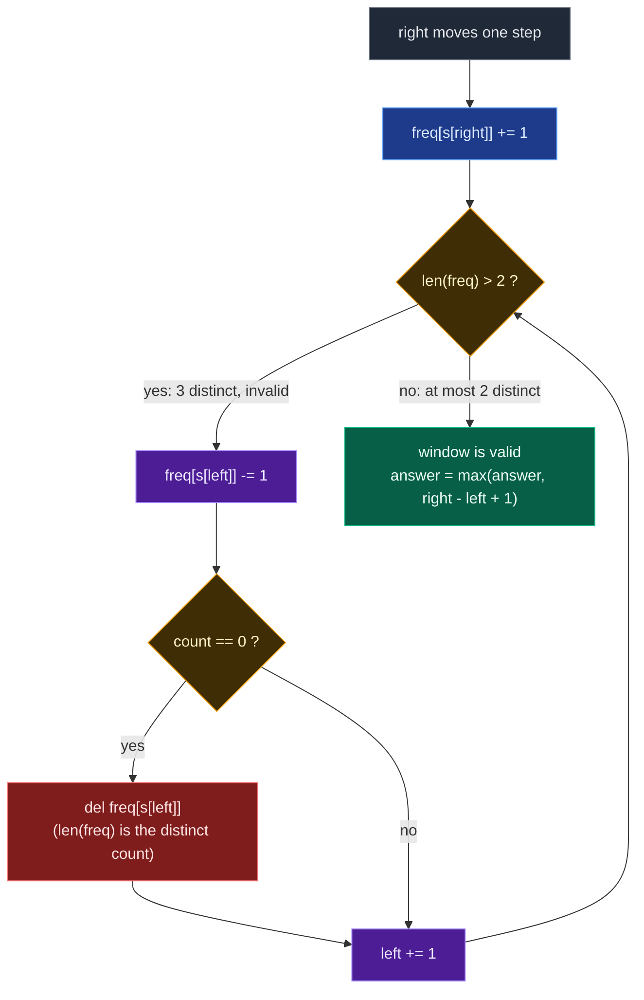

# 02. 159. Longest Substring with At Most Two Distinct Characters

| Difficulty | Pattern | Source | Time | Space |
|:---:|:---:|:---:|:---:|:---:|
| **Medium** | Variable Window + Count Map | [159. Longest Substring with At Most Two Distinct Characters](https://leetcode.com/problems/longest-substring-with-at-most-two-distinct-characters/) | `O(n)` | `O(1)` |

## 1. Problem Statement

Given a string `s`, return *the length of the longest substring that contains at most* ***two distinct characters***.

### Examples

```text
Input:  s = "eceba"
Output: 3
Explanation: The substring is "ece" which its length is 3.
```

```text
Input:  s = "ccaabbb"
Output: 5
Explanation: The substring is "aabbb" which its length is 5.
```

### Constraints

- `1 <= s.length <= 10^5`
- `s` consists of English letters.

## 2. Core Theory

**This problem is LeetCode 340 with `k = 2`. That is the whole theory.**

The previous note in this folder builds the general "at most `k` distinct" template in full. This one is that template with the parameter fixed at `2`, so the honest way to learn it is: recognise the reduction, write the template, substitute the literal.

```text
LC 340:  longest substring with at most  k  distinct characters
LC 159:  longest substring with at most  2  distinct characters
                                         ↑
                                       k = 2
```

And the sibling in the folder next door, LC 904 Fruit Into Baskets, is the same `k = 2` instance again — integers instead of characters, wrapped in a story about baskets. Three LeetCode numbers, one function.

**The reduction, spelled out.** If you already have the general solution, 159 is a one-line call:

```python
def lengthOfLongestSubstringTwoDistinct(s):
    return at_most_k_distinct(s, 2)
```

If you are writing it fresh, it is the same skeleton with `2` substituted for `k`:

```text
expand:  freq[s[right]] += 1

shrink:  while len(freq) > 2:
             freq[s[left]] -= 1
             if freq[s[left]] == 0:
                 del freq[s[left]]        <-- still mandatory
             left += 1

record:  answer = max(answer, right - left + 1)
```

**Why the recognition matters more than the code.** In an interview, saying *"this is the `k = 2` case of at-most-`k`-distinct, which is a variable-size sliding window with a frequency map"* is the graded step. It shows you see the pattern rather than the puzzle, and it buys you the generalisation follow-up for free.

**The two facts that carry over unchanged from 340.**

First, the state must be a **frequency map**, not a set, because when `left` steps off a character you need to know whether that character has *completely* left the window. The author's own example:

```text
window = "ece"     freq = {e: 2, c: 1}
          ↑
        left
```

`left` steps off an `e`, but a second `e` is still inside. A set would have to be rebuilt from scratch to notice; the map answers in `O(1)` with a single decrement.

Second, the **zero-count key must be deleted**. `len(freq)` is the distinct count only if the map contains exactly the characters actually present. A key sitting at `0` is a character that already left, but Python still counts it, so `len(freq)` reads `3` for a window holding `2` types. The `while` loop then shrinks a window that was already legal, `left` runs away to the right, and every recorded width is too small — silently, with no crash. That silence is what makes it the classic bug in this family.



**Why `while` and not `if`.** Same reason as 340 — the outgoing character may have duplicates behind it, so one shrink step need not restore validity:

```text
window = "aabbc"
after adding c:  freq {a:2, b:2, c:1}  -> 3 distinct
shrink once:     freq {a:1, b:2, c:1}  -> still 3 distinct
shrink again:    freq {b:2, c:1}       -> valid
```

**What `k = 2` actually changes.** Only the space bound, and only cosmetically. The map holds at most `2` keys (momentarily `3` at the instant of violation), so space is `O(3) = O(1)` rather than `O(k)`. And because the state is that small, a genuinely `O(1)`-space variant becomes practical: track the two live characters explicitly along with each one's **last-seen index**, and when a third character arrives, evict whichever of the two was seen less recently, jumping `left` to just past that index. It is covered in section 8. It does not generalise to arbitrary `k` — which is exactly why the count map, not this trick, is the answer worth giving in an interview.

## 3. Visual Intuition

```text
s = "eceba"
index:  0 1 2 3 4
char:   e c e b a
```

Grow from the left:

```text
[e  c  e] b  a
 L     R
freq = {e: 2, c: 1}     2 distinct  ✓   length 3
```

Then `b` arrives and breaks it:

```text
[e  c  e  b] a
 L        R
freq = {e: 2, c: 1, b: 1}     3 distinct  ✗
```

Shrink from the left. The first step removes one `e` but the key survives — a second `e` is still inside — so a second step is needed, which clears `c`:

```text
 e  c [e  b] a
       L  R
freq = {e: 1, b: 1}     2 distinct  ✓   length 2
```

The best window was the earlier `"ece"`, length `3`. The window never restarted: it grew right, and gave up exactly as much on the left as legality demanded.

## 4. Key Observation

The monotonicity fact that legalises the window:

```text
If a window has at most 2 distinct characters,
then every sub-window of it also has at most 2 distinct characters.
```

| Consequence | Why it matters |
|:---|:---|
| Shrinking never makes a window *more* invalid | Shrinking from the left always moves toward validity |
| An invalid window can only be fixed from the left | `right` never needs to move backwards |

Both pointers are therefore monotone non-decreasing, and the scan is one forward pass.

Worth separating from its close cousin, LC 3:

| Problem | Valid condition | `"aaaaabbbbb"` |
|:---|:---|:---:|
| LC 3 — Longest Substring Without Repeating | every character appears at most **once** | `2` |
| LC 159 — At Most Two Distinct | at most **two distinct** characters, each unlimited | `10` |

Characters may repeat freely here. Only the *variety* is capped.

## 5. Edge Cases

| Case | Input | Expected | Why it matters |
|:---|:---|:---:|:---|
| Empty string | `s = ""` | `0` | Loop body never runs; must not crash or return garbage |
| Single character | `s = "a"` | `1` | A size-1 window is always valid and must be recorded |
| All identical | `s = "aaaa"` | `4` | Map never exceeds 1 key, so the shrink loop never fires |
| Exactly two distinct | `s = "abab"` | `4` | Boundary of validity — must not shrink at `len == 2` |
| Whole string valid | `s = "aabb"` | `4` | Answer can be `n`; no shrink ever happens |
| Every character distinct | `s = "abcde"` | `2` | Shrinks on every step; answer is capped at 2 |
| Multi-step shrink | `s = "aabbc"` | `4` | One shrink step is not enough — proves `while` over `if` |
| Answer is at the tail | `s = "ccaabbb"` | `5` | Best window is not the first one found |

There is no `k = 0` guard to worry about here — `k` is fixed at `2`, so the degenerate case that bites in LC 340 cannot arise. That is the one simplification `k = 2` buys you.

## 6. Brute Force Solution: Try Every Starting Index

### Intuition

Try every possible substring. For every starting index, expand the ending index one by one, tracking distinct characters in a set. If distinct characters are at most `2`, update the answer. If they become more than `2`, stop for that starting index.

### Approach

1. For every `start` from `0` to `n - 1`.
2. Create an empty set of characters.
3. Extend `end` from `start` to `n - 1`, adding `s[end]`.
4. If the set size exceeds `2`, break out immediately.
5. Otherwise update `max_length` with `end - start + 1`.

### Dry Run

```text
s = "eceba"
```

From `start = 0`:

```text
"e"       -> {e}       1 distinct  ✓  length 1
"ec"      -> {e,c}     2 distinct  ✓  length 2
"ece"     -> {e,c}     2 distinct  ✓  length 3
"eceb"    -> {e,c,b}   3 distinct  ✗  break
```

Best from this start is `3`. Repeat from every other start; the overall best stays `3`.

### Code

```python
# Define the class solution
class Solution:

    # Define the method
    def lengthOfLongestSubstringTwoDistinct(self, s: str) -> int:

        # Store the length of the string.
        n = len(s)

        # Store the maximum valid substring length.
        max_length = 0

        # Try every possible starting index.
        for start in range(n):

            # Store distinct characters in the current substring.
            distinct_chars = set()

            # Try every possible ending index.
            for end in range(start, n):

                # Add current character into the set.
                distinct_chars.add(s[end])

                # If distinct characters become more than 2,
                # this substring is invalid.
                if len(distinct_chars) > 2:

                    # Stop expanding for this starting index.
                    break

                # Calculate current valid substring length.
                current_length = end - start + 1

                # Update maximum length.
                max_length = max(max_length, current_length)

        # Return longest valid substring length.
        return max_length
```

### Complexity

| Measure | Complexity | Why |
|:---|:---:|:---|
| **Time** | `O(n^2)` | For each starting index we may scan to the right. |
| **Space** | `O(1)` | Because the set stores at most 3 characters before breaking. |

## 7. Optimal Solution: Sliding Window + Hashmap

### Intuition

Maintain a window `s[left : right + 1]` with a hashmap:

```text
character -> frequency inside current window
```

For every `right`, add `s[right]`. If the hashmap size becomes more than `2`, the window is invalid, so shrink from the left until the size is at most `2` again. After the window is valid, update the answer.

```text
Expand right
      ↓
Add s[right] to hashmap
      ↓
len(freq) > 2 ?
      ↓ yes
Shrink from left
      ↓
Decrease frequencies
      ↓
Delete character when frequency becomes 0
      ↓
Valid again
      ↓
Update maximum
```

### Approach

1. Initialise `char_count = {}`, `left = 0`, `answer = 0`.
2. Move `right` across the string, incrementing `char_count[s[right]]`.
3. While `len(char_count) > 2`, decrement `char_count[s[left]]`, **delete the key if it hits `0`**, and advance `left`.
4. The window is now valid — update `answer` with `right - left + 1`.
5. Return `answer`.

### Dry Run

```text
s = "eceba"
index:  0 1 2 3 4
char:   e c e b a
```

Initial state:

```text
left = 0
char_count = {}
answer = 0
```

#### right = 0

```text
s[0] = "e"
char_count = {e: 1}
window = "e"
```

Valid because distinct count is 1.

```text
[e] c  e  b  a
 L
 R
answer = 1
```

#### right = 1

```text
s[1] = "c"
char_count = {e: 1, c: 1}
window = "ec"
```

Valid because distinct count is 2.

```text
[e  c] e  b  a
 L  R
answer = 2
```

#### right = 2

```text
s[2] = "e"
char_count = {e: 2, c: 1}
window = "ece"
```

Valid because distinct count is still 2 — the frequency grew, the variety did not.

```text
[e  c  e] b  a
 L     R
answer = 3
```

#### right = 3 — the third distinct character arrives

```text
s[3] = "b"
char_count = {e: 2, c: 1, b: 1}
```

Now invalid because distinct count is 3. Shrink from the left. Remove `s[left] = "e"`:

```text
char_count = {e: 1, c: 1, b: 1}
left = 1
```

Still invalid — the key `e` survived because a second `e` remains inside. Shrink again, removing `s[left] = "c"`:

```text
char_count = {e: 1, b: 1}
left = 2
```

`c` hit zero and was deleted, so it is now valid.

```text
 e  c [e  b] a
       L  R
window = "eb"   length = 2
answer remains 3
```

#### right = 4

```text
s[4] = "a"
char_count = {e: 1, b: 1, a: 1}
```

Invalid because distinct count is 3. Shrink from the left, removing `s[left] = "e"` — its count becomes zero, so delete it:

```text
char_count = {b: 1, a: 1}
left = 3
```

Now valid.

```text
 e  c  e [b  a]
          L  R
window = "ba"   length = 2
answer remains 3
```

Final answer:

```text
3
```

### Code

```python
# Define the class solution
class Solution:

    # Define the method
    def lengthOfLongestSubstringTwoDistinct(self, s: str) -> int:

        # This hashmap stores character frequencies in the current window.
        char_count = {}

        # This pointer marks the start of the current window.
        left = 0

        # This variable stores the maximum valid window length.
        answer = 0

        # This pointer marks the end of the current window.
        for right in range(len(s)):

            # Add the current right character into the current window.
            char_count[s[right]] = char_count.get(s[right], 0) + 1

            # If we have more than 2 distinct characters,
            # shrink the window until it becomes valid.
            while len(char_count) > 2:

                # Remove one occurrence of the leftmost character.
                char_count[s[left]] -= 1

                # If the leftmost character count becomes zero,
                # remove it from the map to reduce distinct count.
                if char_count[s[left]] == 0:

                    # Delete that character from the hashmap.
                    del char_count[s[left]]

                # Move the left pointer forward.
                left += 1

            # Current window has at most 2 distinct characters.
            current_window_length = right - left + 1

            # Update answer with the current valid window length.
            answer = max(answer, current_window_length)

        # Return the longest valid substring length.
        return answer
```

### Complexity

| Measure | Complexity | Why |
|:---|:---:|:---|
| **Time** | `O(n)` | Each character enters the window once and leaves the window once. |
| **Space** | `O(1)` | The hashmap stores at most 3 characters temporarily, then shrinks back to 2, so `O(3) = O(1)`. |

## 8. Advanced Solution: `O(1)` Space with Two Characters and Last-Seen Indices

### Intuition

Because `k` is fixed at `2`, the window state is small enough to hold in named variables instead of a map. Keep:

```text
first_char,  first_last    -> one live character and the last index it was seen at
second_char, second_last   -> the other live character and its last-seen index
left                       -> window start
```

When a third character arrives, one of the two incumbents has to go. Which one? The one whose **last occurrence is earlier**, because everything from `left` up to and including that last occurrence must be discarded, and evicting the more recently seen character would throw away more than necessary. So:

```text
evict the character with the smaller last-seen index
left = (that index) + 1
the incoming character takes the evicted slot
```

This is exactly the `k = 2` specialisation of "shrink until valid": instead of stepping `left` one position at a time, the last-seen index tells you where to jump to in one move.

### Approach

1. Track `first_char` / `first_last` and `second_char` / `second_last`, both initially unset.
2. For each `right`, if `s[right]` matches a tracked character, refresh that character's last-seen index.
3. If a slot is still free, fill it.
4. Otherwise a third character has arrived: compare `first_last` and `second_last`, set `left` to one past the smaller, and replace that slot with the incoming character.
5. Update `answer` with `right - left + 1` every iteration.

### Dry Run

```text
s = "eceba"
```

```text
right=0  'e'  -> slot1 = (e, 0)                  left=0  window "e"     answer=1
right=1  'c'  -> slot2 = (c, 1)                  left=0  window "ec"    answer=2
right=2  'e'  -> refresh slot1 = (e, 2)          left=0  window "ece"   answer=3
right=3  'b'  -> third char. last seen: e@2, c@1
                 c is older -> left = 1 + 1 = 2
                 slot2 = (b, 3)                  left=2  window "eb"    answer=3
right=4  'a'  -> third char. last seen: e@2, b@3
                 e is older -> left = 2 + 1 = 3
                 slot1 = (a, 4)                  left=3  window "ba"    answer=3
```

Final answer `3`, matching the hashmap version exactly — but `left` jumped straight to its destination instead of stepping.

### Code

```python
# Define the class solution
class Solution:

    # Define the method
    def lengthOfLongestSubstringTwoDistinct(self, s: str) -> int:

        # The two characters currently alive in the window, and
        # the last index at which each of them was seen.
        first_char = second_char = None
        first_last = second_last = -1

        # Left boundary of the window.
        left = 0

        # Store the maximum valid window length.
        answer = 0

        # Expand the right boundary.
        for right, current_char in enumerate(s):

            # Already tracked as the first character: refresh its last index.
            if current_char == first_char:
                first_last = right

            # Already tracked as the second character: refresh its last index.
            elif current_char == second_char:
                second_last = right

            # A slot is still free, so simply occupy it.
            elif first_char is None:
                first_char, first_last = current_char, right
            elif second_char is None:
                second_char, second_last = current_char, right

            # A third distinct character arrived: evict the one
            # whose last occurrence is older.
            else:

                # The first character is the older one.
                if first_last < second_last:

                    # Everything up to its last occurrence must leave.
                    left = first_last + 1

                    # The incoming character takes that slot.
                    first_char, first_last = current_char, right

                # Otherwise the second character is the older one.
                else:

                    # Everything up to its last occurrence must leave.
                    left = second_last + 1

                    # The incoming character takes that slot.
                    second_char, second_last = current_char, right

            # The window is valid at this point.
            answer = max(answer, right - left + 1)

        # Return the longest valid substring length.
        return answer
```

### Complexity

| Measure | Complexity | Why |
|:---|:---:|:---|
| **Time** | `O(n)` | One pass, and `left` jumps rather than steps — no inner loop at all. |
| **Space** | `O(1)` | Four scalars and two pointers. Genuinely constant, with no hashing. |

### When NOT to use it

| Requirement | This trick safe? |
|:---|:---:|
| Longest substring with at most 2 distinct | Yes |
| Longest substring with at most `k` distinct | No — you would need `k` slots and a min-lookup, which *is* a map |
| Count all valid substrings | Yes, but the map version is far easier to get right |
| Minimum window / exactly-`k` | No |

It is faster in practice and fun to know, but it is fragile and it does not generalise. **Code the hashmap version first in an interview**, then offer this as the optimisation.

## 9. Advanced Solution: Lazy Shrink with `if`

### Intuition

The standard version keeps the invariant "the window is valid before I record the answer", which forces the `while`. The lazy version uses a **weaker** invariant:

```text
The maintained window may temporarily be invalid,
but an invalid window is never allowed to grow.
```

Suppose the best valid width so far is `W`. `right` advances, making the temporary width `W + 1`. Two cases:

- **Still at most 2 distinct.** Valid. `left` does not move. Width goes `W -> W + 1`.
- **More than 2 distinct.** Invalid. Move `left` exactly once. Both pointers advanced, so the width stays `W`.

An invalid expansion therefore cannot increase the maintained width. Since the width never shrinks, the final maintained width *is* the maximum, and no `answer` variable is needed — at the end `right = n - 1`, so `right - left + 1 = n - left`.

### Dry Run

```text
s = "aabbc"
```

Best valid window before `c` arrives is `"aabb"`, width `4`. Add `c`:

```text
"aabbc"   -> {a, b, c}   invalid
```

Move `left` once:

```text
 a "abbc"  -> still {a, b, c}, still invalid
```

That is fine. We are not claiming `"abbc"` is valid — we are preserving the width `4` we already know was achievable, because `"aabb"` really did occur. The frame slides forward without growing until validity returns.

### Code

```python
# Define the class solution
class Solution:

    # Define the method
    def lengthOfLongestSubstringTwoDistinct(self, s: str) -> int:

        # Store character frequencies in the current window.
        char_count = {}

        # Left boundary of current window.
        left = 0

        # Expand the right boundary.
        for right in range(len(s)):

            # Add current character to the window.
            char_count[s[right]] = char_count.get(s[right], 0) + 1

            # If window becomes invalid, shrink only one step.
            if len(char_count) > 2:

                # Remove one occurrence of the leftmost character.
                char_count[s[left]] -= 1

                # If its frequency becomes zero, delete it.
                if char_count[s[left]] == 0:
                    del char_count[s[left]]

                # Move left one step.
                left += 1

        # Since right ends at n - 1, final maintained width is n - left.
        return len(s) - left
```

### Complexity

| Measure | Complexity | Why |
|:---|:---:|:---|
| **Time** | `O(n)` | `left` moves at most once per iteration. Same big-O as the `while` version. |
| **Space** | `O(1)` | The map holds at most 3 keys. |

### When NOT to use it

The lazy trick works only for **maximum-length** formulations of a monotone "at most" condition:

| Requirement | Lazy `if` safe? |
|:---|:---:|
| Longest window with at most 2 distinct | Yes |
| Count all valid substrings (`answer += right - left + 1`) | No — would count invalid windows |
| Minimum valid window | No |
| Exactly-2 calculations | No |

The author's own note is blunt about the ordering: **use the `while` version first in interviews.** It is easier to explain and less error-prone.

## 10. Approach Comparison

| Property | Brute force | `while` hashmap | Lazy `if` | `O(1)` last-seen |
|:---|:---:|:---:|:---:|:---:|
| Current window always valid? | n/a | Yes | No | Yes |
| Explicit `max_length`? | Yes | Yes | Not needed | Yes |
| Time | `O(n^2)` | `O(n)` | `O(n)` | `O(n)` |
| Space | `O(1)` | `O(1)` | `O(1)` | `O(1)` |
| Generalises to any `k`? | Yes | Yes | Yes | No |
| Easy to prove? | Trivial | Yes | Harder | Moderate |
| Best interview default | No | **Yes** | Follow-up | Follow-up |

## 11. Common Mistakes

| Mistake | Why it breaks | Fix |
|:---|:---|:---|
| Not deleting a zero-count key | `len(char_count)` counts characters that already left; the map is permanently over-full, `left` runs away and the answer is too small — with no crash | `if char_count[c] == 0: del char_count[c]` immediately after decrementing |
| Using a `set` instead of a count map | Cannot tell whether a duplicate of the outgoing character remains inside the window | Store frequencies, delete only at zero |
| Shrinking at `len(char_count) >= 2` | Off-by-one: two distinct characters are legal, three are not | The condition is `> 2` |
| `if` instead of `while` while still doing `max(answer, right-left+1)` | Mixes the lazy invariant with the strict one — measures a window that is not actually valid | Use `while` with `max`, or `if` with `return n - left`. Never mix |
| Updating `answer` before the shrink loop | Records the width of an invalid window | Record only after the loop restores validity |
| Solving it as LC 3 (no repeats) | Caps repeats as well as variety, so `"aaaaabbbbb"` returns `2` instead of `10` | Only the *number of distinct* characters is capped; frequencies are unlimited |

## 12. Interview Follow-ups

**Q: Generalise to `k` distinct characters.**

A: Replace the literal `2` with `k` and nothing else changes: `while len(freq) > k`. That is LeetCode 340, the previous note in this folder — still `O(n)` time, now `O(k)` space, plus a `k == 0` guard since an empty window is then the only valid one. LC 159 is that template's `k = 2` instance.

**Q: Can you do it in `O(1)` space without a hashmap?**

A: Yes, and only because `k = 2`. Track the two live characters plus each one's last-seen index; when a third arrives, evict whichever was seen less recently and jump `left` to one past that index. Section 8 has it. It does not extend to arbitrary `k` — with `k` slots you would need a minimum-lookup over them, which is a map again.

**Q: Count all substrings with at most 2 distinct characters instead of finding the longest.**

A: Same window, different accumulator: after the shrink loop, `answer += right - left + 1`, which counts every valid substring *ending* at `right`. This version **requires** the strict `while` invariant — the lazy `if` window would count substrings that are not valid. And "exactly 2" is then `atMost(2) - atMost(1)`.

**Q: What if the input were Unicode rather than English letters?**

A: Nothing changes algorithmically — a dict keyed by code point works identically, and the map still never holds more than 3 keys, so space stays `O(1)`. Only a fixed-size array indexed by character would suffer, since it would need `O(charset)` space. Be careful iterating by code point rather than UTF-16 code unit if the language exposes surrogate pairs.

**Q: Return the actual substring, not just its length.**

A: Track the best `left` alongside the best length. Whenever `right - left + 1` beats the record, store `best_left = left` and `best_len = right - left + 1`. At the end return `s[best_left : best_left + best_len]`. Still `O(n)` time and `O(1)` extra beyond the output.

## 13. Interview Explanation

> This problem asks for the longest continuous substring with at most two distinct characters. I use a variable-size sliding window. I expand the window using the right pointer and keep a frequency hashmap of characters inside the current window. If the number of distinct characters becomes more than two, I shrink the window from the left and reduce frequencies until the window becomes valid again — deleting any character whose count reaches zero, since `len(map)` is my distinct count and a stale zero key would inflate it. After each valid window, I update the maximum length. Each character enters and leaves the window at most once, so the solution runs in `O(n)` time with `O(1)` space. This is really the `k = 2` case of the general at-most-`k`-distinct template, which is LeetCode 340, and it is the same pattern as Fruit Into Baskets applied to characters instead of integers.

## 14. Pattern Summary

```text
Problem type:
Variable-size sliding window

Window meaning:
Current substring being checked

Valid condition:
Number of distinct characters <= 2

Expand condition:
Move right pointer and add s[right]

Shrink condition:
While distinct characters > 2

Data structure:
Hashmap of character frequencies

Remove:
freq[s[left]] -= 1

Delete:
if freq[s[left]] == 0: remove key

Answer update:
After window becomes valid

Time:
O(n)

Space:
O(1) for k = 2
```

The family, side by side:

| Problem | Window state | Valid condition |
|:---|:---|:---|
| LC 3 — Longest Substring Without Repeating | set / last index | no duplicates |
| LC 1004 — Max Consecutive Ones III | `zero_count` | `zeros <= k` |
| LC 159 — At Most Two Distinct | frequency hashmap | `distinct <= 2` |
| LC 904 — Fruit Into Baskets | frequency hashmap | `distinct <= 2` (integers) |
| LC 340 — At Most K Distinct | frequency hashmap | `distinct <= k` |

## 15. Verify

```python
def lengthOfLongestSubstringTwoDistinct(s: str) -> int:
    # Frequency map of characters inside the current window
    char_count = {}
    # Left edge of the window
    left = 0
    # Best window length seen so far
    answer = 0
    # Expand the window one character at a time
    for right in range(len(s)):
        # Add the incoming character to the window's frequency map
        char_count[s[right]] = char_count.get(s[right], 0) + 1
        # Shrink from the left while more than 2 distinct characters are present
        while len(char_count) > 2:
            # Remove the outgoing character's count
            char_count[s[left]] -= 1
            # Delete the key once its count hits zero so it stops counting as distinct
            if char_count[s[left]] == 0:
                del char_count[s[left]]
            # Move the left edge forward
            left += 1
        # Window is valid here, so update the best length
        answer = max(answer, right - left + 1)
    return answer


def at_most_k_distinct(s: str, k: int) -> int:
    """The LC 340 template; LC 159 is this with k = 2."""
    # An empty window is the only valid one when k is 0
    if k == 0:
        return 0
    # Frequency map of characters inside the current window
    freq = {}
    # Left edge of the window
    left = 0
    # Best window length seen so far
    answer = 0
    # Expand the window one character at a time
    for right in range(len(s)):
        # Add the incoming character to the window's frequency map
        freq[s[right]] = freq.get(s[right], 0) + 1
        # Shrink from the left while more than k distinct characters are present
        while len(freq) > k:
            # Remove the outgoing character's count
            freq[s[left]] -= 1
            # Delete the key once its count hits zero so it stops counting as distinct
            if freq[s[left]] == 0:
                del freq[s[left]]
            # Move the left edge forward
            left += 1
        # Window is valid here, so update the best length
        answer = max(answer, right - left + 1)
    return answer


def lazy_two_distinct(s: str) -> int:
    # Frequency map of characters inside the current window
    char_count = {}
    # Left edge of the window
    left = 0
    # Expand the window one character at a time
    for right in range(len(s)):
        # Add the incoming character to the window's frequency map
        char_count[s[right]] = char_count.get(s[right], 0) + 1
        # Lazily nudge left by one step instead of looping until valid
        if len(char_count) > 2:
            # Remove the outgoing character's count
            char_count[s[left]] -= 1
            # Delete the key once its count hits zero so it stops counting as distinct
            if char_count[s[left]] == 0:
                del char_count[s[left]]
            # Move the left edge forward
            left += 1
    # Window width is fixed at n - left since right always ends at n - 1
    return len(s) - left


def two_distinct_o1(s: str) -> int:
    # The two characters currently allowed in the window
    first_char = second_char = None
    # Last index each of those characters was seen at
    first_last = second_last = -1
    # Left edge of the window
    left = 0
    # Best window length seen so far
    answer = 0
    for right, c in enumerate(s):
        # Current character matches the first tracked character: refresh its last-seen index
        if c == first_char:
            first_last = right
        # Current character matches the second tracked character: refresh its last-seen index
        elif c == second_char:
            second_last = right
        # No first character claimed yet: claim this one
        elif first_char is None:
            first_char, first_last = c, right
        # No second character claimed yet: claim this one
        elif second_char is None:
            second_char, second_last = c, right
        # A third character arrived: evict whichever tracked character was seen less recently
        elif first_last < second_last:
            left = first_last + 1
            first_char, first_last = c, right
        else:
            left = second_last + 1
            second_char, second_last = c, right
        # Window is valid here, so update the best length
        answer = max(answer, right - left + 1)
    return answer


def brute(s: str) -> int:
    # Size of the input string
    n = len(s)
    # Best window length seen so far
    best = 0
    # Try every possible starting index
    for start in range(n):
        # Distinct characters seen since this start
        seen = set()
        for end in range(start, n):
            # Extend the substring by one character
            seen.add(s[end])
            # Stop extending once a third distinct character appears
            if len(seen) > 2:
                break
            # Record this substring's length as a candidate answer
            best = max(best, end - start + 1)
    return best


# LeetCode examples
assert lengthOfLongestSubstringTwoDistinct("eceba") == 3
assert lengthOfLongestSubstringTwoDistinct("ccaabbb") == 5

# Empty string
assert lengthOfLongestSubstringTwoDistinct("") == 0

# Single character
assert lengthOfLongestSubstringTwoDistinct("a") == 1

# All identical: the shrink loop never fires
assert lengthOfLongestSubstringTwoDistinct("aaaa") == 4

# Exactly two distinct: must not shrink at len == 2
assert lengthOfLongestSubstringTwoDistinct("abab") == 4

# Whole string is the answer
assert lengthOfLongestSubstringTwoDistinct("aabb") == 4

# Every character distinct: answer capped at 2
assert lengthOfLongestSubstringTwoDistinct("abcde") == 2

# Multi-step shrink: one 'if' step would not restore validity
assert lengthOfLongestSubstringTwoDistinct("aabbc") == 4

# Repeats are unlimited — this is NOT LeetCode 3
assert lengthOfLongestSubstringTwoDistinct("aaaaabbbbb") == 10

# The reduction: LC 159 is exactly LC 340 at k = 2
assert lengthOfLongestSubstringTwoDistinct("eceba") == at_most_k_distinct("eceba", 2)

# Randomised cross-check: brute force vs all four implementations
import random

random.seed(159)
for _ in range(5000):
    # Random short string over a small alphabet
    n = random.randint(0, 16)
    t = "".join(random.choice("abcd") for _ in range(n))
    # Brute force is the ground truth
    expected = brute(t)
    assert lengthOfLongestSubstringTwoDistinct(t) == expected, t
    assert at_most_k_distinct(t, 2) == expected, t
    assert lazy_two_distinct(t) == expected, t
    assert two_distinct_o1(t) == expected, t

# Structural property: a window of the reported length really is valid,
# and no longer window is
for _ in range(500):
    t = "".join(random.choice("abc") for _ in range(random.randint(1, 20)))
    w = lengthOfLongestSubstringTwoDistinct(t)
    # Some window of length w has at most 2 distinct characters
    assert any(len(set(t[i:i + w])) <= 2 for i in range(len(t) - w + 1)), t
    if w < len(t):
        # Every window one longer than w has more than 2 distinct characters
        assert all(len(set(t[i:i + w + 1])) > 2 for i in range(len(t) - w)), t

# Large input stays linear and correct: repeated 2-char pattern spans the whole string
big = "ab" * 50000
assert lengthOfLongestSubstringTwoDistinct(big) == 100000
assert lengthOfLongestSubstringTwoDistinct("abc" * 30000) == 2

print("All tests passed")
```
