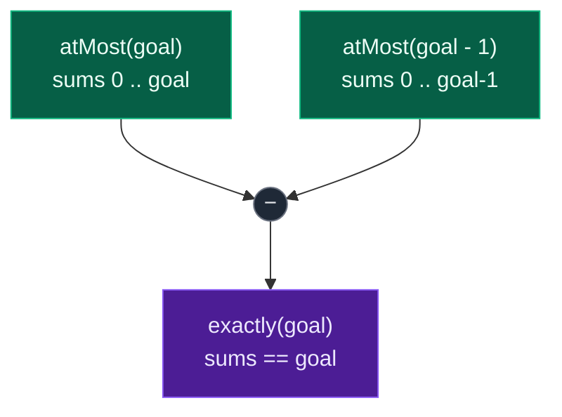
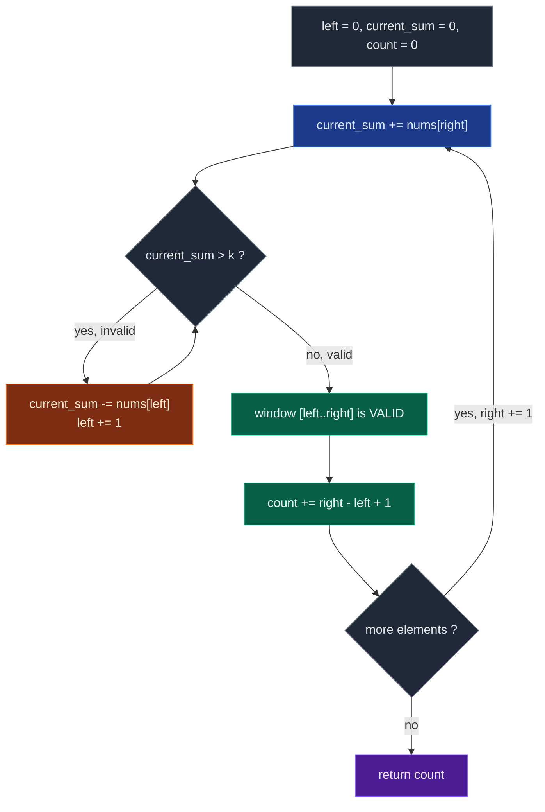

# 01. 930. Binary Subarrays With Sum

| Difficulty | Pattern | Source | Time | Space |
|:---:|:---:|:---:|:---:|:---:|
| **Medium** | At-Most Trick | [930. Binary Subarrays With Sum](https://leetcode.com/problems/binary-subarrays-with-sum/) | `O(n)` | `O(1)` |

## 1. Problem Statement

Given a **binary array** `nums` and an integer `goal`, return *the number of non-empty **subarrays** with a sum* `goal`.

A **subarray** is a contiguous part of the array.

### Examples

```text
Input:  nums = [1,0,1,0,1], goal = 2
Output: 4
Explanation: The 4 subarrays are bolded and underlined below:
[1,0,1,0,1]
[1,0,1,0,1]
[1,0,1,0,1]
[1,0,1,0,1]
```

```text
Input:  nums = [0,0,0,0,0], goal = 0
Output: 15
```

### Constraints

- `1 <= nums.length <= 3 * 10^4`
- `nums[i]` is either `0` or `1`
- `0 <= goal <= nums.length`

## 2. Core Theory

This is the first problem in the **at-most trick** family. Every problem in this group asks for a count of subarrays satisfying an *exact* condition, and every one of them is solved by the same two-line identity:

```text
exactly(k) = atMost(k) - atMost(k - 1)
```

For this problem specifically, with a 0/1 array and a target `goal`:

```text
answer = atMost(goal) - atMost(goal - 1)
```

### Why we cannot count "exactly" with one window

A sliding window needs a **shrink condition**: when the window is invalid, the algorithm must know that moving `left` forward is the right move, and that `left` never has to move backwards. That requires the property to be **monotonic** in the window.

"Sum at most `k`" is monotonic. Removing `nums[left]` from a 0/1 window can only keep the sum the same or lower it, so once the window is too heavy, shrinking always moves toward validity and never away from it:

```text
ATMOST(k)                  shrink while sum > k
  sum too big  ──shrink──▶  sum smaller  ──▶ eventually valid
  never needs to widen back
```

"Sum exactly `k`" is **not** monotonic. Look at a window whose sum is `3` with `goal = 2`:

```text
window [1, 0, 1, 1]   sum = 3   too big, so shrink?
drop 1 → [0, 1, 1]    sum = 2   ✓ exactly goal
drop 0 → [1, 1]       sum = 2   ✓ exactly goal, another valid one
drop 1 → [1]          sum = 1   ✗ now too small
```

Shrinking passed *through* the valid region and out the other side. From the window state alone you cannot decide whether to keep shrinking, because the property is not "get smaller until it is fine" — it is "land on one precise value". There is no stopping rule a single window can follow, which is exactly why the naive one-window approach fails.

### The subtraction recovers the exact count

Let `A` be the number of subarrays with sum `<= goal` and `B` the number with sum `<= goal - 1`. Both are computable by a plain monotonic window. Then `A` counts every subarray whose sum is `0, 1, ..., goal`, and `B` counts every subarray whose sum is `0, 1, ..., goal - 1`. Subtracting removes everything strictly below the target and leaves exactly the target:



Concretely for `nums = [1,0,1,0,1]`, `goal = 2`:

```text
atMost(2) = 14
atMost(1) = 10
answer    = 14 - 10 = 4
```

### The counting identity inside `atMost`

Inside `atMost(k)`, once the shrink loop has restored `current_sum <= k`, the window `[left..right]` is valid. Every **suffix** of that window is also valid, because dropping leading `0`s and `1`s can only lower the sum. Those suffixes are precisely the subarrays that end at `right`:

```text
[left     .. right]
[left + 1 .. right]
[left + 2 .. right]
...
[right    .. right]
```

There are `right - left + 1` of them, so a single line closes the iteration:

```python
count += right - left + 1
```

There is no double counting, because every subarray has exactly one ending index, and at iteration `right` we count only the subarrays ending at `right`.

Here is the atMost loop as a flow:



### The `goal = 0` guard

`goal = 0` is a legal input — it asks for subarrays containing only zeroes. The formula then calls `atMost(-1)`, and no binary subarray can have sum `<= -1`. Without a guard, the shrink loop `while current_sum > -1` runs forever relative to `left`, dragging `left` past `right` and producing nonsense. So `atMost` opens with:

```python
if k < 0:
    return 0
```

With that guard, `[0,0,0,0,0]` and `goal = 0` gives `atMost(0) - atMost(-1) = 15 - 0 = 15`, the correct total `n(n+1)/2`.

### Why the window works at all here

Every `nums[i]` is non-negative. Expanding right can only increase `current_sum`; shrinking left can only decrease it. That is the entire licence for two forward-only pointers, and it is why the prefix-sum + hashmap solution (which *does* handle negatives) is unnecessary here.

## 3. Edge Cases

| Case | Input | Expected | Why it matters |
|:---|:---|:---:|:---|
| Single one, hit | `nums = [1], goal = 1` | `1` | Smallest possible window must still count |
| Single one, miss | `nums = [1], goal = 0` | `0` | `atMost(-1)` guard must fire |
| Single zero | `nums = [0], goal = 0` | `1` | A zero-only subarray is a valid answer |
| All zeroes, `goal = 0` | `nums = [0,0,0,0,0], goal = 0` | `15` | `n(n+1)/2` — the classic guard test |
| Zeroes around ones | `nums = [0,1,0,0], goal = 0` | `4` | Counts runs of zeroes: `[0]`,`[0]`,`[0]`,`[0,0]` |
| All ones | `nums = [1,1,1], goal = 2` | `2` | Windows of fixed length; shrink runs every step |
| All ones, `goal = 0` | `nums = [1,1,1], goal = 0` | `0` | No zero-sum subarray exists |
| Goal exceeds total ones | `nums = [1,0,1], goal = 3` | `0` | Both at-most counts are equal, difference is `0` |

## 4. Brute Force Solution: Try Every Subarray

### Intuition

Try every possible subarray.

For each start index, expand the end index and keep adding the current value.

Whenever the sum becomes equal to `goal`, increase the answer.

### Approach

1. Fix a starting index `start`.
2. Walk `end` forward from `start`, adding `nums[end]` into `current_sum`.
3. If `current_sum == goal`, increment `count`.
4. Do **not** break early — a following `0` keeps the sum unchanged and yields another valid subarray.
5. Return `count`.

### Dry Run

```text
nums = [1, 0, 1, 0, 1], goal = 2
```

```text
start = 0:  [1]              = 1   ✗
            [1,0]            = 1   ✗
            [1,0,1]          = 2   ✓ count = 1
            [1,0,1,0]        = 2   ✓ count = 2
            [1,0,1,0,1]      = 3   ✗

start = 1:  [0]              = 0   ✗
            [0,1]            = 1   ✗
            [0,1,0]          = 1   ✗
            [0,1,0,1]        = 2   ✓ count = 3

start = 2:  [1]              = 1   ✗
            [1,0]            = 1   ✗
            [1,0,1]          = 2   ✓ count = 4

start = 3:  [0] = 0, [0,1] = 1      ✗

start = 4:  [1] = 1                 ✗
```

Answer: `4`.

### Code

```python
class Solution:
    def numSubarraysWithSum(self, nums: List[int], goal: int) -> int:

        # Store the length of the array.
        n = len(nums)

        # Store the number of valid subarrays.
        count = 0

        # Try every possible starting index.
        for start in range(n):

            # Store sum of current subarray.
            current_sum = 0

            # Try every possible ending index.
            for end in range(start, n):

                # Add current element to current subarray sum.
                current_sum += nums[end]

                # If current subarray sum equals goal, count it.
                if current_sum == goal:

                    # Increase valid subarray count.
                    count += 1

        # Return total valid subarrays.
        return count
```

### Complexity

| Measure | Complexity | Why |
|:---|:---:|:---|
| **Time** | `O(n^2)` | Outer loop runs `n` times, inner loop up to `n` times. |
| **Space** | `O(1)` | Only a few scalar variables. |

This is too slow for `n = 3 * 10^4`.

## 5. Better Solution: Prefix Sum + Hashmap

### Intuition

For each index, calculate the prefix sum.

Let:

```text
prefix_sum = sum from nums[0] to nums[i]
```

We need a previous prefix sum such that:

```text
prefix_sum - previous_prefix_sum = goal
```

So:

```text
previous_prefix_sum = prefix_sum - goal
```

If we have seen `prefix_sum - goal` before, then each of those earlier positions forms a valid subarray ending at the current index.

### Approach

1. Keep a hashmap `prefix_count` of how many times each prefix sum has been seen, seeded with `prefix_count[0] = 1` (the empty prefix).
2. Sweep the array, maintaining `current_sum`.
3. At each index, add `prefix_count[current_sum - goal]` to the answer.
4. Record `current_sum` in the map.
5. Return the total.

### Dry Run

```text
nums = [1, 0, 1, 0, 1], goal = 2
prefix_count = {0: 1}
```

```text
num = 1  current_sum = 1  need -1  found 0  count = 0   map {0:1, 1:1}
num = 0  current_sum = 1  need -1  found 0  count = 0   map {0:1, 1:2}
num = 1  current_sum = 2  need  0  found 1  count = 1   map {0:1, 1:2, 2:1}
num = 0  current_sum = 2  need  0  found 1  count = 2   map {0:1, 1:2, 2:2}
num = 1  current_sum = 3  need  1  found 2  count = 4   map {..., 3:1}
```

Answer: `4`.

### Code

```python
# Define the the class solution
class Solution:

    # Define the method
    def numSubarraysWithSum(self, nums: List[int], goal: int) -> int:

        # This hashmap stores how many times each prefix sum has appeared.
        prefix_count = {}

        # Prefix sum 0 appears once before starting.
        prefix_count[0] = 1

        # Store current running prefix sum.
        current_sum = 0

        # Store number of valid subarrays.
        count = 0

        # Traverse each number in nums.
        for num in nums:

            # Add current number to running prefix sum.
            current_sum += num

            # Find the prefix sum needed to make subarray sum equal to goal.
            required_sum = current_sum - goal

            # If required prefix sum exists, add its frequency to count.
            count += prefix_count.get(required_sum, 0)

            # Store current prefix sum frequency.
            prefix_count[current_sum] = prefix_count.get(current_sum, 0) + 1

        # Return total valid subarrays.
        return count
```

### Complexity

| Measure | Complexity | Why |
|:---|:---:|:---|
| **Time** | `O(n)` | One pass with `O(1)` hashmap operations. |
| **Space** | `O(n)` | The hashmap can hold up to `n + 1` distinct prefix sums. |

This is a very good solution and works even when the array has negative numbers. But since this problem has only `0` and `1`, we can also solve it using a sliding window with `O(1)` space.

## 6. Optimal Solution: Sliding Window with the At-Most Trick

### Intuition

We cannot directly count subarrays with sum exactly `goal` using one simple window.

Instead, we define a helper function:

```text
atMost(k)
```

This function returns:

```text
number of subarrays whose sum is at most k
```

Then the final answer is:

```text
atMost(goal) - atMost(goal - 1)
```

For a binary array all numbers are non-negative, so `atMost` is a clean monotonic window: expand with `right`, shrink while `current_sum > k`, and once valid add `right - left + 1`.

### Approach

1. Write `at_most(k)`; if `k < 0` return `0` immediately.
2. Initialise `left = 0`, `current_sum = 0`, `count = 0`.
3. For each `right`, add `nums[right]` to `current_sum`.
4. While `current_sum > k`, subtract `nums[left]` and advance `left`.
5. Add `right - left + 1` to `count`.
6. Return `at_most(goal) - at_most(goal - 1)`.

### Dry Run

```text
nums = [1, 0, 1, 0, 1]
goal = 2
```

We calculate:

```text
answer = atMost(2) - atMost(1)
```

#### First calculate `atMost(2)`

Initial:

```text
left = 0
current_sum = 0
count = 0
```

##### right = 0

```text
nums[0] = 1
current_sum = 1
window = [1]
```

Valid because `1 <= 2`. Add `0 - 0 + 1 = 1`.

```text
count = 1
```

##### right = 1

```text
nums[1] = 0
current_sum = 1
window = [1, 0]
```

Valid. Add `1 - 0 + 1 = 2`.

```text
count = 3
```

Subarrays ending at index 1:

```text
[0]
[1, 0]
```

##### right = 2

```text
nums[2] = 1
current_sum = 2
window = [1, 0, 1]
```

Valid. Add `2 - 0 + 1 = 3`.

```text
count = 6
```

##### right = 3

```text
nums[3] = 0
current_sum = 2
window = [1, 0, 1, 0]
```

Valid. Add `3 - 0 + 1 = 4`.

```text
count = 10
```

##### right = 4

```text
nums[4] = 1
current_sum = 3
```

Invalid because `3 > 2`. Shrink:

```text
remove nums[0] = 1
current_sum = 2
left = 1
```

Now valid. Window:

```text
[0, 1, 0, 1]
```

Add `4 - 1 + 1 = 4`.

```text
count = 14
```

So:

```text
atMost(2) = 14
```

#### Now calculate `atMost(1)`

We count all subarrays whose sum is at most `1`.

```text
right = 0   sum = 1   valid    add 1              count = 1
right = 1   sum = 1   valid    add 2              count = 3
right = 2   sum = 2   invalid  drop nums[0]=1 → sum 1, left = 1
                      add 2 - 1 + 1 = 2           count = 5
right = 3   sum = 1   valid    add 3 - 1 + 1 = 3  count = 8
right = 4   sum = 2   invalid  drop nums[1]=0 → sum 2, left = 2  (still invalid)
                      drop nums[2]=1 → sum 1, left = 3  (now valid)
                      add 4 - 3 + 1 = 2           count = 10
```

So:

```text
atMost(1) = 10
```

#### Final answer

```text
atMost(2) - atMost(1)
= 14 - 10
= 4
```

### Code

```python
# Define the the class solution
class Solution:

    # Define the method
    def numSubarraysWithSum(self, nums: List[int], goal: int) -> int:

        # Helper function to count subarrays with sum at most k.
        def at_most(k: int) -> int:

            # If k is negative, no subarray can have sum <= negative k
            # because nums contains only 0 and 1.
            if k < 0:

                # Return 0 for invalid negative target.
                return 0

            # Left pointer of the sliding window.
            left = 0

            # Store current window sum.
            current_sum = 0

            # Store number of valid subarrays.
            count = 0

            # Move right pointer through nums.
            for right in range(len(nums)):

                # Add current element to window sum.
                current_sum += nums[right]

                # If current sum is greater than k,
                # shrink window from the left until valid.
                while current_sum > k:

                    # Remove leftmost element from current sum.
                    current_sum -= nums[left]

                    # Move left pointer forward.
                    left += 1

                # Current window sum is now <= k.
                # All subarrays ending at right and starting from left to right are valid.
                count += right - left + 1

            # Return number of subarrays with sum at most k.
            return count

        # Exact goal count = at most goal - at most goal - 1.
        return at_most(goal) - at_most(goal - 1)
```

### Complexity

| Measure | Complexity | Why |
|:---|:---:|:---|
| **Time** | `O(2n) = O(n)` | The helper runs in `O(n)` and we call it twice; two linear passes are still linear. |
| **Space** | `O(1)` | Only two pointers and two running scalars — no hashmap. |

This is the best sliding-window solution.

## 7. Another Important Example

```text
nums = [0, 0, 0, 0, 0]
goal = 0
```

Every subarray has sum `0`. Total subarrays:

```text
n * (n + 1) / 2
= 5 * 6 / 2
= 15
```

Our sliding window handles this correctly:

```text
atMost(0) - atMost(-1)
```

Since `atMost(-1) = 0`, the answer is `15 - 0 = 15`.

Here is what each window contributes when `k = 0`:

```text
right = 0   window [0]              adds 1   → [0]
right = 1   window [0,0]            adds 2   → [0], [0,0]
right = 2   window [0,0,0]          adds 3   → [0], [0,0], [0,0,0]
right = 3   window [0,0,0,0]        adds 4
right = 4   window [0,0,0,0,0]      adds 5
                                    total 15
```

## 8. Pattern Summary

```text
Problem type:
Variable-size sliding window + counting

Window meaning:
Current subarray with sum at most k

Direct exact-sum approach:
Difficult with normal sliding window

Conversion:
exact(goal) = atMost(goal) - atMost(goal - 1)

Expand condition:
Move right and add nums[right]

Shrink condition:
While current_sum > k

Answer update:
After window becomes valid

Counting formula:
right - left + 1

Final best approach:
Use atMost(goal) - atMost(goal - 1).
```

## 9. Common Mistakes

| Mistake | Why it breaks | Fix |
|:---|:---|:---|
| Calling `at_most(goal - 1)` without the `k < 0` guard | `goal = 0` produces `atMost(-1)`; `while current_sum > -1` never exits with `left <= right`, so `left` runs past `right` and the count goes wrong or the code crashes | Start `at_most` with `if k < 0: return 0` |
| Trying to count "exactly `goal`" with one window | Exact sum is not monotonic, so no shrink rule exists — shrinking can skip straight past the valid region | Compute two at-most counts and subtract |
| `count += 1` per valid window | Counts one subarray per `right` instead of all suffixes ending at `right` | `count += right - left + 1` |
| Counting inside the shrink loop | The window is still invalid mid-shrink, so invalid subarrays get counted | Count only after the `while` loop exits |
| `if current_sum > k` instead of `while` | One removal may not be enough (`[1,1,1]` with `k = 1` needs two) and the count formula then over-counts | Use `while current_sum > k` |
| Shrinking while `current_sum >= k` | `current_sum == k` is valid for at-most; shrinking it away undercounts | Shrink only while `current_sum > k` |
| Breaking out of the brute-force inner loop when `current_sum > goal` | Unlike the product problem, a trailing `0` can still yield more valid subarrays at the same sum | Do not break; or only break when the sum has strictly exceeded `goal` **and** you understand it is safe |

## 10. Interview Follow-ups

**Q: Why can't a single sliding window count subarrays with sum exactly `goal`?**

A: Because "sum equals `goal`" is not monotonic in the window. A window whose sum is too large might, after one shrink, land exactly on `goal` — and after another shrink, land on `goal` again, and after a third, fall below. There is no rule of the form "shrink while invalid" that stops in the right place, so `left` has no well-defined position. "Sum at most `k`" *is* monotonic, so it gives a clean shrink condition, and the subtraction recovers the exact count.

**Q: Generalise the trick — where else does it apply?**

A: Anywhere you can compute `atMost(k)` cheaply and the quantity is integer-valued and monotone in the window. LC 1248 (exactly `k` odd numbers, which is literally this problem after mapping odd → 1) and LC 992 (exactly `k` distinct integers) are the standard companions. The template is always `exactly(k) = atMost(k) - atMost(k - 1)`.

**Q: Two passes instead of one — does that hurt the complexity?**

A: No. Two `O(n)` passes are `O(2n) = O(n)`. Constants do not change the asymptotic class, and in exchange we drop from `O(n)` hashmap space to `O(1)`.

**Q: What if the array contained negative numbers?**

A: The sliding window dies immediately — expanding right no longer monotonically increases the sum, so `left` would have to move backwards. The prefix-sum + hashmap solution in section 5 still works, in `O(n)` time and `O(n)` space. That is exactly why it is worth knowing both.

**Q: Why is `goal = 0` a real case rather than a degenerate one?**

A: Because a binary subarray can legitimately sum to `0` — any maximal run of zeroes of length `L` contributes `L(L+1)/2` such subarrays. LeetCode's own second example, `[0,0,0,0,0]` with `goal = 0`, has answer `15`. The `k < 0` guard is what makes the formula produce it.

**Q: How large can the answer get?**

A: Up to `n(n+1)/2`, which for `n = 3 * 10^4` is about `4.5 * 10^8` — inside a 32-bit signed int, but close enough that it is worth mentioning in a language without arbitrary-precision integers.

## 11. Interview Explanation

> Since the array contains only non-negative values, I can use sliding window to count the number of subarrays with sum at most `k`. For every right pointer, I expand the window and shrink from the left while the sum is greater than `k`. Once the window is valid, all subarrays ending at `right` and starting from `left` to `right` are valid, so I add `right - left + 1`. To get subarrays with sum exactly equal to `goal`, I subtract `atMost(goal - 1)` from `atMost(goal)`.

## 12. Verify

```python
from typing import List


def numSubarraysWithSum(nums: List[int], goal: int) -> int:
    def at_most(k: int) -> int:
        # A negative target has no valid subarrays
        if k < 0:
            return 0
        # Left edge of the window
        left = 0
        # Sum of the current window
        current_sum = 0
        # Number of subarrays with sum at most k
        count = 0
        # Expand the window one element at a time
        for right in range(len(nums)):
            # Add the incoming element to the window sum
            current_sum += nums[right]
            # Shrink from the left while the sum exceeds k
            while current_sum > k:
                current_sum -= nums[left]
                left += 1
            # Every subarray ending at right, starting between left and right, is valid
            count += right - left + 1
        return count

    # Exactly goal = atMost(goal) minus atMost(goal - 1)
    return at_most(goal) - at_most(goal - 1)


def brute(nums: List[int], goal: int) -> int:
    # Size of the input array
    n = len(nums)
    # Count of subarrays with sum exactly goal
    total = 0
    # Try every possible starting index
    for start in range(n):
        # Running sum of the current subarray
        s = 0
        for end in range(start, n):
            # Extend the subarray by one element
            s += nums[end]
            # Count it if the sum matches the target exactly
            if s == goal:
                total += 1
    return total


# LeetCode examples
assert numSubarraysWithSum([1, 0, 1, 0, 1], 2) == 4
assert numSubarraysWithSum([0, 0, 0, 0, 0], 0) == 15

# Single element
assert numSubarraysWithSum([1], 1) == 1
assert numSubarraysWithSum([1], 0) == 0
assert numSubarraysWithSum([0], 0) == 1

# goal = 0 counts runs of zeroes only
assert numSubarraysWithSum([0, 1, 0, 0], 0) == 4

# All ones
assert numSubarraysWithSum([1, 1, 1], 2) == 2
assert numSubarraysWithSum([1, 1, 1], 3) == 1

# No valid subarray: goal larger than total number of ones
assert numSubarraysWithSum([1, 0, 1], 3) == 0

# atMost(-1) guard: goal = 0 on an all-ones array
assert numSubarraysWithSum([1, 1, 1], 0) == 0

# All zeroes with goal 0 is n(n+1)/2
for n in range(1, 40):
    assert numSubarraysWithSum([0] * n, 0) == n * (n + 1) // 2

# Cross-check against brute force on random binary inputs
import random

random.seed(930)
for _ in range(5000):
    # Random small binary array and target sum
    n = random.randint(1, 12)
    arr = [random.randint(0, 1) for _ in range(n)]
    g = random.randint(0, n)
    assert numSubarraysWithSum(arr, g) == brute(arr, g), (arr, g)

# Larger random cross-check, zero-heavy arrays
for _ in range(500):
    # Larger array skewed toward zeroes
    n = random.randint(1, 40)
    arr = [1 if random.random() < 0.25 else 0 for _ in range(n)]
    g = random.randint(0, n)
    assert numSubarraysWithSum(arr, g) == brute(arr, g), (arr, g)

print("All tests passed")
```
