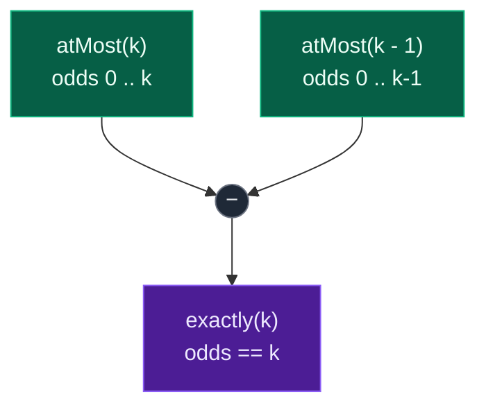
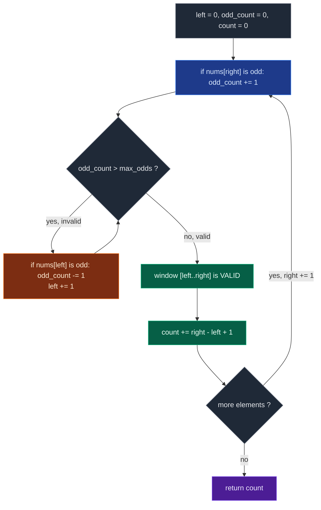

# 02. 1248. Count Number of Nice Subarrays

| Difficulty | Pattern | Source | Time | Space |
|:---:|:---:|:---:|:---:|:---:|
| **Medium** | At-Most Trick | [1248. Count Number of Nice Subarrays](https://leetcode.com/problems/count-number-of-nice-subarrays/) | `O(n)` | `O(1)` |

## 1. Problem Statement

Given an array of integers `nums` and an integer `k`. A continuous subarray is called **nice** if there are `k` odd numbers on it.

Return *the number of **nice** sub-arrays*.

### Examples

```text
Input:  nums = [1,1,2,1,1], k = 3
Output: 2
Explanation: The only sub-arrays with 3 odd numbers are [1,1,2,1] and [1,2,1,1].
```

```text
Input:  nums = [2,4,6], k = 1
Output: 0
Explanation: There are no odd numbers in the array.
```

```text
Input:  nums = [2,2,2,1,2,2,1,2,2,2], k = 2
Output: 16
```

### Constraints

- `1 <= nums.length <= 50000`
- `1 <= nums[i] <= 10^5`
- `1 <= k <= nums.length`

## 2. Core Theory

### The insight: this *is* problem 930

The values in `nums` go up to `10^5`, but the problem never asks about their magnitude — only about their **parity**. Nothing else about a number matters. So map:

```text
odd  -> 1
even -> 0
```

and the array collapses to a binary array:

```text
nums       = [1, 1, 2, 1, 1]
transformed= [1, 1, 0, 1, 1]
```

"Exactly `k` odd numbers in a subarray" is now literally "sum exactly `k` in a binary subarray" — which is **930. Binary Subarrays With Sum**. The whole problem reduces to a problem you already solved, and the reduction costs nothing: you never need to materialise the transformed array, you just test `nums[i] % 2 == 1` inside the window.

```text
exactly k odds = exactly sum k in transformed binary array
```

### The at-most trick

Having reduced to 930, the same identity applies:

```text
exactly(k) = atMost(k) - atMost(k - 1)
```

where `atMost(k)` counts subarrays containing **at most** `k` odd numbers.

**Why the detour through at-most is necessary.** A sliding window needs a shrink rule, and a shrink rule needs monotonicity. "At most `k` odds" is monotonic: dropping `nums[left]` can only decrease `odd_count`, never increase it, so a too-heavy window always improves by shrinking and `left` never has to move backwards.

"Exactly `k` odds" has no such rule. Consider `k = 2` and a window that currently holds three odds:

```text
window [1, 2, 1, 2, 1]   odds = 3   too many, shrink?
drop 1 → [2, 1, 2, 1]    odds = 2   ✓ exactly k
drop 2 → [1, 2, 1]       odds = 2   ✓ exactly k, still valid
drop 1 → [2, 1]          odds = 1   ✗ now too few
```

Shrinking walks straight through the valid band and out the far side. From the window state alone, there is no signal that says "stop here" — and every position inside the band was a distinct valid window. One pointer pair cannot express that, which is why the exact count is assembled from two at-most counts instead.

### Why the subtraction is exact

`atMost(k)` counts every subarray whose odd count is `0, 1, ..., k`. `atMost(k - 1)` counts every subarray whose odd count is `0, 1, ..., k - 1`. The two agree on everything below `k`, so subtracting annihilates all of it and leaves precisely the subarrays with `k` odds:



For `nums = [1,1,2,1,1]`, `k = 3`:

```text
atMost(3) = 14
atMost(2) = 12
answer    = 14 - 12 = 2
```

### The counting identity inside `atMost`

After the shrink loop restores `odd_count <= max_odds`, the window `[left..right]` is valid, and so is every suffix of it — removing elements from the left can only remove odds, never add them. Those suffixes are exactly the subarrays ending at `right`:

```text
window = [1, 2, 1]   at right, with left pointing at the first 1

subarrays ending at right:
  [1]           (start = right)
  [2, 1]        (start = right - 1)
  [1, 2, 1]     (start = left)
```

There are `right - left + 1` of them, so:

```python
count += right - left + 1
```

No subarray is counted twice, because a subarray has exactly one ending index and we only ever count at that index.



### The negative guard

The constraints promise `k >= 1`, so `k - 1 >= 0` and `atMost(-1)` is never reached through the public entry point. Keep the guard anyway — it costs one line, it makes `at_most` safe to reuse, and it documents the intent:

```python
if max_odds < 0:
    return 0
```

(In 930 the guard is mandatory, because `goal = 0` is a legal input there. Same helper, same guard, different necessity.)

## 3. Edge Cases

| Case | Input | Expected | Why it matters |
|:---|:---|:---:|:---|
| Single odd, `k = 1` | `nums = [1], k = 1` | `1` | Smallest possible nice subarray |
| Single even, `k = 1` | `nums = [2], k = 1` | `0` | No odd exists to satisfy `k` |
| No odd numbers at all | `nums = [2,4,6], k = 1` | `0` | `atMost(1)` and `atMost(0)` are equal, difference is `0` |
| All odd, `k = 1` | `nums = [1,3,5], k = 1` | `3` | Any longer subarray holds more than one odd |
| All odd, `k = n` | `nums = [1,3,5], k = 3` | `1` | Only the whole array qualifies |
| `k` exceeds odd count | `nums = [1,2,1], k = 3` | `0` | Both at-most counts saturate to the same value |
| Even padding around odds | `nums = [2,1,2], k = 1` | `4` | Surrounding evens multiply valid ranges: `2 * 2` |
| Sparse odds | `nums = [2,2,2,1,2,2,1,2,2,2], k = 2` | `16` | `3` evens left `*` `2` between-gap positions... the padding effect at scale |

## 4. Brute Force Solution: Try Every Subarray

### Intuition

Try every possible subarray.

For each starting index, move ending index one by one.

Count how many odd numbers are present.

If odd count becomes exactly `k`, increase the answer.

### Approach

1. Fix a starting index `start`.
2. Walk `end` forward, incrementing `odd_count` whenever `nums[end]` is odd.
3. If `odd_count == k`, increment `count`.
4. If `odd_count > k`, break — extending further can only add more odds.
5. Return `count`.

### Dry Run

```text
nums = [1, 1, 2, 1, 1], k = 3
```

```text
start = 0:  [1]              odds = 1  ✗
            [1,1]            odds = 2  ✗
            [1,1,2]          odds = 2  ✗
            [1,1,2,1]        odds = 3  ✓ count = 1
            [1,1,2,1,1]      odds = 4  ✗ break

start = 1:  [1]              odds = 1  ✗
            [1,2]            odds = 1  ✗
            [1,2,1]          odds = 2  ✗
            [1,2,1,1]        odds = 3  ✓ count = 2

start = 2:  [2] odds 0, [2,1] odds 1, [2,1,1] odds 2   ✗
start = 3:  [1] odds 1, [1,1] odds 2                   ✗
start = 4:  [1] odds 1                                 ✗
```

Answer: `2`.

### Code

```python
# Define the class solution
class Solution:

    # Helper method to count subarrays with at most x odd numbers
    def numberOfSubarrays(self, nums: List[int], k: int) -> int:

        # Store total number of elements.
        n = len(nums)

        # Store total number of nice subarrays.
        count = 0

        # Try every possible starting index.
        for start in range(n):

            # Store number of odd numbers in current subarray.
            odd_count = 0

            # Try every possible ending index.
            for end in range(start, n):

                # If current number is odd, increase odd count.
                if nums[end] % 2 == 1:

                    # Increase odd count.
                    odd_count += 1

                # If current subarray has exactly k odd numbers.
                if odd_count == k:

                    # Count this nice subarray.
                    count += 1

                # If odd count becomes greater than k,
                # further extension will not reduce odd count.
                if odd_count > k:

                    # Stop checking for this starting index.
                    break

        # Return total nice subarrays.
        return count
```

### Complexity

| Measure | Complexity | Why |
|:---|:---:|:---|
| **Time** | `O(n^2)` | For each start index, we may scan to the right. |
| **Space** | `O(1)` | Only scalar counters. |

Too slow for `n = 50000`.

## 5. Better Solution: Prefix Sum + Hashmap

### Intuition

Treat odd as `1` and even as `0`.

Maintain a running count of odds seen so far.

Let:

```text
prefix_odd = number of odd numbers from nums[0] to current index
```

We need a previous prefix such that:

```text
prefix_odd - previous_prefix_odd = k
```

So:

```text
previous_prefix_odd = prefix_odd - k
```

If we have seen `prefix_odd - k` before, then those previous positions can form nice subarrays ending at the current index.

### Approach

1. Seed a hashmap with `prefix_count[0] = 1` (the empty prefix).
2. Sweep the array, incrementing `odd_prefix` on every odd number.
3. Add `prefix_count[odd_prefix - k]` to the answer.
4. Record `odd_prefix` in the map.
5. Return the total.

### Dry Run

```text
nums = [1, 1, 2, 1, 1], k = 3
prefix_count = {0: 1}
```

```text
num = 1  odd_prefix = 1  need -2  none   count = 0   map {0:1, 1:1}
num = 1  odd_prefix = 2  need -1  none   count = 0   map {0:1, 1:1, 2:1}
num = 2  odd_prefix = 2  need -1  none   count = 0   map {0:1, 1:1, 2:2}
num = 1  odd_prefix = 3  need  0  x1     count = 1   map {..., 3:1}
num = 1  odd_prefix = 4  need  1  x1     count = 2   map {..., 4:1}
```

Answer: `2`.

### Code

```python
# Define the class solution
class Solution:

    # Helper method to count subarrays with at most x odd numbers
    def numberOfSubarrays(self, nums: List[int], k: int) -> int:

        # This hashmap stores frequency of prefix odd counts.
        prefix_count = {}

        # Prefix odd count 0 appears once before processing starts.
        prefix_count[0] = 1

        # Store running count of odd numbers.
        odd_prefix = 0

        # Store total number of nice subarrays.
        count = 0

        # Traverse every number.
        for num in nums:

            # If current number is odd, add 1 to odd prefix.
            if num % 2 == 1:

                # Increase odd prefix.
                odd_prefix += 1

            # We need a previous prefix count equal to odd_prefix - k.
            required_prefix = odd_prefix - k

            # Add all previous occurrences that can form exactly k odd numbers.
            count += prefix_count.get(required_prefix, 0)

            # Store current odd prefix frequency.
            prefix_count[odd_prefix] = prefix_count.get(odd_prefix, 0) + 1

        # Return total nice subarrays.
        return count
```

### Complexity

| Measure | Complexity | Why |
|:---|:---:|:---|
| **Time** | `O(n)` | Single pass, `O(1)` hashmap operations. |
| **Space** | `O(n)` | The map holds up to `n + 1` distinct prefix odd counts. |

This is a very clean and powerful solution. But since all values after transformation are `0` or `1`, we can also solve it using a sliding window in `O(1)` space.

## 6. Optimal Solution: Sliding Window with the At-Most Trick

### Intuition

We create a helper function:

```text
atMost(k)
```

This returns:

```text
number of subarrays with at most k odd numbers
```

Then:

```text
nice subarrays with exactly k odds
=
atMost(k) - atMost(k - 1)
```

**Why this works.** `atMost(3)` counts all subarrays with `0 odd`, `1 odd`, `2 odds`, `3 odds`. `atMost(2)` counts all subarrays with `0 odd`, `1 odd`, `2 odds`. So when we subtract `atMost(3) - atMost(2)`, only subarrays with exactly `3` odds remain.

### Approach

1. Write `at_most(max_odds)`; return `0` if `max_odds < 0`.
2. Maintain `left`, `odd_count`, `count`.
3. For each `right`, increment `odd_count` if `nums[right]` is odd.
4. While `odd_count > max_odds`, decrement `odd_count` if `nums[left]` is odd, then advance `left`.
5. Add `right - left + 1` to `count`.
6. Return `at_most(k) - at_most(k - 1)`.

Note we never build a transformed array — the parity test happens inline, so space stays `O(1)`.

### Dry Run

```text
nums = [1, 1, 2, 1, 1]
k = 3
```

We calculate:

```text
answer = atMost(3) - atMost(2)
```

#### First calculate `atMost(3)`

Initial:

```text
left = 0
odd_count = 0
count = 0
```

##### right = 0

```text
nums[0] = 1
odd_count = 1
window = [1]
```

Valid because `1 <= 3`. Add `0 - 0 + 1 = 1`.

```text
count = 1
```

##### right = 1

```text
nums[1] = 1
odd_count = 2
window = [1, 1]
```

Valid. Add `1 - 0 + 1 = 2`.

```text
count = 3
```

##### right = 2

```text
nums[2] = 2
odd_count = 2
window = [1, 1, 2]
```

Valid (even contributes nothing). Add `2 - 0 + 1 = 3`.

```text
count = 6
```

##### right = 3

```text
nums[3] = 1
odd_count = 3
window = [1, 1, 2, 1]
```

Valid. Add `3 - 0 + 1 = 4`.

```text
count = 10
```

##### right = 4

```text
nums[4] = 1
odd_count = 4
```

Invalid because `4 > 3`. Shrink from left, removing `nums[0] = 1`:

```text
odd_count = 3
left = 1
```

Now valid. Current window:

```text
[1, 2, 1, 1]
```

Add `4 - 1 + 1 = 4`.

```text
count = 14
```

So:

```text
atMost(3) = 14
```

#### Now calculate `atMost(2)`

```text
right = 0   odd_count = 1   valid    add 1              count = 1
right = 1   odd_count = 2   valid    add 2              count = 3
right = 2   odd_count = 2   valid    add 3              count = 6
right = 3   odd_count = 3   invalid  drop nums[0]=1 → odds 2, left = 1
                            add 3 - 1 + 1 = 3           count = 9
right = 4   odd_count = 3   invalid  drop nums[1]=1 → odds 2, left = 2
                            add 4 - 2 + 1 = 3           count = 12
```

So:

```text
atMost(2) = 12
```

#### Final answer

```text
atMost(3) - atMost(2)
= 14 - 12
= 2
```

### Code

```python
# Define the class solution
class Solution:

    # Helper method to count subarrays with at most x odd numbers
    def numberOfSubarrays(self, nums: List[int], k: int) -> int:

        # Helper function to count subarrays with at most max_odds odd numbers.
        def at_most(max_odds: int) -> int:

            # If max_odds is negative, no subarray can have at most negative odds.
            if max_odds < 0:

                # Return 0 for invalid negative limit.
                return 0

            # Left pointer of the sliding window.
            left = 0

            # Count of odd numbers inside the current window.
            odd_count = 0

            # Count of valid subarrays.
            count = 0

            # Move right pointer through the array.
            for right in range(len(nums)):

                # If current number is odd, increase odd_count.
                if nums[right] % 2 == 1:

                    # Add one odd number to the current window.
                    odd_count += 1

                # If window has more than max_odds odd numbers,
                # shrink from the left until it becomes valid.
                while odd_count > max_odds:

                    # If the leftmost number is odd, it is leaving the window.
                    if nums[left] % 2 == 1:

                        # Remove one odd number from the current window.
                        odd_count -= 1

                    # Move left pointer forward.
                    left += 1

                # Current window has at most max_odds odd numbers.
                # All subarrays ending at right and starting from left to right are valid.
                count += right - left + 1

            # Return number of subarrays with at most max_odds odds.
            return count

        # Exactly k odds = at most k odds - at most k - 1 odds.
        return at_most(k) - at_most(k - 1)
```

### Complexity

| Measure | Complexity | Why |
|:---|:---:|:---|
| **Time** | `O(2n) = O(n)` | The helper runs in `O(n)` and we call it twice. |
| **Space** | `O(1)` | Two pointers and one counter — no hashmap, no transformed array. |

This is the best sliding-window solution.

## 7. More Worked Examples

### Example: no odd numbers

```text
nums = [2, 4, 6]
k = 1
```

There are no odd numbers, so no subarray can contain exactly `1` odd number.

Answer:

```text
0
```

Using the formula:

```text
atMost(1) - atMost(0)
```

Both values count all-even subarrays equally (`6` each), so the difference becomes `0`.

### Example: all odd numbers

```text
nums = [1, 3, 5]
k = 1
```

Subarrays with exactly one odd number:

```text
[1]
[3]
[5]
```

Answer:

```text
3
```

Because any longer subarray contains more than one odd.

### Example: even padding

```text
nums = [2, 2, 2, 1, 2, 2, 1, 2, 2, 2]
k = 2
```

The two odds sit at indices `3` and `6`. A nice subarray must contain both and no third odd — and there is no third odd, so it must start at or before index `3` and end at or after index `6`:

```text
start can be 0, 1, 2, 3   → 4 choices
end   can be 6, 7, 8, 9   → 4 choices
total = 4 * 4 = 16
```

Answer `16`. This shows the shape of the pattern: the evens surrounding a block of exactly `k` odds multiply into the count, and the at-most subtraction captures that product automatically.

## 8. Can We Solve This Directly with One Window?

There is a clever direct approach, but the `atMost(k) - atMost(k - 1)` method is more reusable and easier for interviews.

The direct approach counts how many even numbers are around groups of exactly `k` odd numbers — essentially the `4 * 4` computation from the previous example, generalised: for each block of `k` consecutive odds, multiply the number of even-padding choices on the left by the number on the right. It works, but it needs careful boundary bookkeeping and does not transfer to problems like 992.

But for sliding window patterns, this formula is cleaner:

```text
exactly k = atMost(k) - atMost(k - 1)
```

## 9. Pattern Summary

```text
Problem type:
Variable-size sliding window + counting

Window meaning:
Current subarray with at most k odd numbers

Direct exact-k approach:
Tricky

Conversion:
exactly(k) = atMost(k) - atMost(k - 1)

Expand condition:
Move right and add one if nums[right] is odd

Shrink condition:
While odd_count > k

Answer update:
After window becomes valid

Counting formula:
right - left + 1

Final best approach:
Use atMost(k) - atMost(k - 1).
```

## 10. Common Mistakes

| Mistake | Why it breaks | Fix |
|:---|:---|:---|
| Comparing values instead of parity | `nums[i]` goes up to `10^5`; only `nums[i] % 2` matters | Test `nums[right] % 2 == 1`, never the magnitude |
| Building a transformed `0/1` array | Correct, but wastes `O(n)` space for nothing | Test parity inline and keep `O(1)` space |
| Trying to count "exactly `k`" with one window | Odd count is not monotonic around the target, so no shrink rule exists | Compute two at-most counts and subtract |
| Forgetting to decrement `odd_count` only for odd `nums[left]` | Decrementing unconditionally makes the counter drift below the truth, so the window never shrinks correctly | Guard the decrement with `if nums[left] % 2 == 1` |
| `count += 1` per valid window | Counts one subarray per `right` instead of all suffixes ending at `right` | `count += right - left + 1` |
| Counting inside the shrink loop | The window is still invalid mid-shrink | Count only after the `while` loop exits |
| Dropping the `max_odds < 0` guard | Safe here because `k >= 1`, but the helper then breaks the moment it is reused for a problem where `k = 0` is legal (like 930) | Keep `if max_odds < 0: return 0` |

## 11. Interview Follow-ups

**Q: Why can't a single sliding window count subarrays with exactly `k` odd numbers?**

A: Because the property is not monotonic around the target. When a window holds `k + 1` odds, shrinking lands it on `k` — but continuing to shrink keeps it on `k` for a while (every leading even can be dropped) and then drops it to `k - 1`. There is no single stopping rule for `left`, and each intermediate position was a distinct valid window. "At most `k`" has a clean rule, so we build the answer from two of those.

**Q: How exactly does this reduce to 930?**

A: Map every odd to `1` and every even to `0`. "Exactly `k` odds in a subarray" becomes "sum exactly `k` in a binary subarray", which is 930 verbatim. The only difference in code is that instead of `current_sum += nums[right]` you write `odd_count += nums[right] % 2` — and you never materialise the transformed array. Recognising this saves you from re-deriving anything.

**Q: Does calling the helper twice hurt the complexity?**

A: No. `O(n) + O(n) = O(2n) = O(n)`. In exchange for the second pass we drop from the hashmap's `O(n)` space to `O(1)`.

**Q: When would you prefer the prefix-sum + hashmap solution?**

A: When the quantity being counted is not a window-monotonic non-negative count — for example a signed sum with negative numbers, where the sliding window has no valid shrink rule at all. For parity, both work; the window wins on space, the hashmap wins on generality.

**Q: `k = 0` is excluded by the constraints — what would it mean?**

A: It would ask for subarrays containing no odd numbers at all, i.e. maximal runs of evens. The formula would then need `atMost(-1)`, and the `max_odds < 0` guard returning `0` makes it come out right: `atMost(0) - 0` is exactly the count of all-even subarrays.

**Q: How large can the answer get?**

A: Up to `n(n+1)/2`, about `1.25 * 10^9` for `n = 50000` — that **overflows a 32-bit signed int**. Python is fine, but in Java or C++ the accumulator should be `long`.

## 12. Interview Explanation

> A nice subarray is one with exactly `k` odd numbers. I treat each odd number as `1` and each even number as `0`, so the problem becomes counting subarrays with sum exactly `k`. Instead of directly counting exactly `k`, I count subarrays with at most `k` odd numbers and subtract subarrays with at most `k - 1` odd numbers. The helper function uses a sliding window where the window is valid if `odd_count <= k`. For every valid window ending at `right`, all subarrays starting from `left` to `right` are valid, so I add `right - left + 1`.

## 13. Verify

```python
from typing import List


def numberOfSubarrays(nums: List[int], k: int) -> int:
    def at_most(max_odds: int) -> int:
        # A negative target has no valid subarrays
        if max_odds < 0:
            return 0
        # Left edge of the window
        left = 0
        # Count of odd numbers inside the current window
        odd_count = 0
        # Number of subarrays with at most max_odds odd numbers
        count = 0
        # Expand the window one element at a time
        for right in range(len(nums)):
            # Track the incoming element if it is odd
            if nums[right] % 2 == 1:
                odd_count += 1
            # Shrink from the left while too many odd numbers are in the window
            while odd_count > max_odds:
                if nums[left] % 2 == 1:
                    odd_count -= 1
                left += 1
            # Every subarray ending at right, starting between left and right, is valid
            count += right - left + 1
        return count

    # Exactly k = atMost(k) minus atMost(k - 1)
    return at_most(k) - at_most(k - 1)


def brute(nums: List[int], k: int) -> int:
    # Size of the input array
    n = len(nums)
    # Count of subarrays with exactly k odd numbers
    total = 0
    # Try every possible starting index
    for start in range(n):
        # Count of odd numbers in the current subarray
        odds = 0
        for end in range(start, n):
            # Extend the subarray by one element
            odds += nums[end] % 2
            # Count it if the odd count matches the target exactly
            if odds == k:
                total += 1
    return total


# LeetCode examples
assert numberOfSubarrays([1, 1, 2, 1, 1], 3) == 2
assert numberOfSubarrays([2, 4, 6], 1) == 0
assert numberOfSubarrays([2, 2, 2, 1, 2, 2, 1, 2, 2, 2], 2) == 16

# Single odd, k = 1: smallest possible nice subarray
assert numberOfSubarrays([1], 1) == 1
# Single even, k = 1: no odd exists to satisfy k
assert numberOfSubarrays([2], 1) == 0

# All odd, k = 1: any longer subarray holds more than one odd
assert numberOfSubarrays([1, 3, 5], 1) == 3
# All odd, k = n: only the whole array qualifies
assert numberOfSubarrays([1, 3, 5], 3) == 1

# No odd numbers at all: atMost(1) and atMost(0) are equal, difference is 0
for n in range(1, 20):
    assert numberOfSubarrays([2] * n, 1) == 0

# k exceeds odd count: both at-most counts saturate to the same value
assert numberOfSubarrays([1, 2, 1], 3) == 0

# Even padding around odds: surrounding evens multiply valid ranges (2 * 2)
assert numberOfSubarrays([2, 1, 2], 1) == 4

# Cross-check against brute force on random inputs
import random

# Fix the seed for reproducible random testing
random.seed(1248)
for _ in range(5000):
    # Random small array and target odd-count
    n = random.randint(1, 12)
    # Values between 1 and 8 give a mix of odd and even numbers
    arr = [random.randint(1, 8) for _ in range(n)]
    # Target odd-count within the array length
    kk = random.randint(1, n)
    # Optimized answer must match the brute force answer
    assert numberOfSubarrays(arr, kk) == brute(arr, kk), (arr, kk)

# Larger random cross-check, even-heavy arrays
for _ in range(500):
    # Larger array skewed toward even numbers
    n = random.randint(1, 40)
    # Mostly even values with an occasional odd one
    arr = [random.choice([2, 4, 6, 1]) for _ in range(n)]
    # Target odd-count within the array length
    kk = random.randint(1, n)
    # Optimized answer must match the brute force answer
    assert numberOfSubarrays(arr, kk) == brute(arr, kk), (arr, kk)


# 1248 really is 930 under the odd/even mapping
def binsum(nums: List[int], goal: int) -> int:
    def at_most(k: int) -> int:
        # A negative target has no valid subarrays
        if k < 0:
            return 0
        # Left edge, current window sum, and running count
        left = s = c = 0
        # Expand the window one element at a time
        for right in range(len(nums)):
            # Add the incoming element to the window sum
            s += nums[right]
            # Shrink from the left while the sum exceeds k
            while s > k:
                s -= nums[left]
                left += 1
            # Every subarray ending at right, starting between left and right, is valid
            c += right - left + 1
        return c

    # Exactly goal = atMost(goal) minus atMost(goal - 1)
    return at_most(goal) - at_most(goal - 1)


# Mapping each number to odd(1)/even(0) reduces this problem to LC 930
for _ in range(1000):
    # Random small array and target odd-count
    n = random.randint(1, 14)
    arr = [random.randint(1, 9) for _ in range(n)]
    kk = random.randint(1, n)
    assert numberOfSubarrays(arr, kk) == binsum([x % 2 for x in arr], kk)

print("All tests passed")
```
