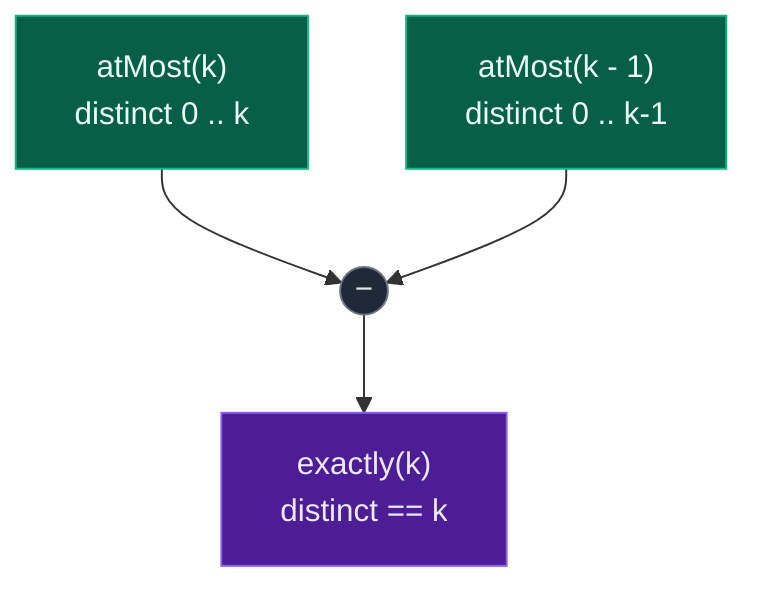
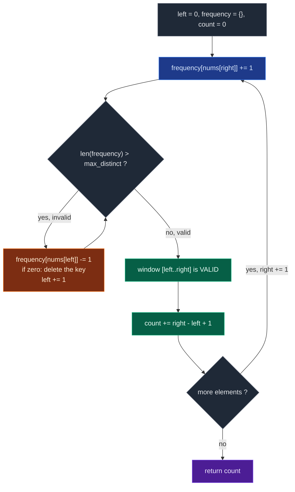

# 03. 992. Subarrays with K Different Integers

| Difficulty | Pattern | Source | Time | Space |
|:---:|:---:|:---:|:---:|:---:|
| **Hard** | At-Most Trick | [992. Subarrays with K Different Integers](https://leetcode.com/problems/subarrays-with-k-different-integers/) | `O(n)` | `O(k)` |

## 1. Problem Statement

Given an integer array `nums` and an integer `k`, return *the number of **good subarrays** of* `nums`.

A **good array** is an array where the number of different integers in that array is exactly `k`.

- For example, `[1,2,3,1,2]` has `3` different integers: `1`, `2`, and `3`.

A **subarray** is a **contiguous** part of an array.

### Examples

```text
Input:  nums = [1,2,1,2,3], k = 2
Output: 7
Explanation: Subarrays formed with exactly 2 different integers: [1,2], [2,1],
[1,2], [2,3], [1,2,1], [2,1,2], [1,2,1,2]
```

```text
Input:  nums = [1,2,1,3,4], k = 3
Output: 3
Explanation: Subarrays formed with exactly 3 different integers: [1,2,1,3],
[2,1,3], [1,3,4].
```

### Constraints

- `1 <= nums.length <= 2 * 10^4`
- `1 <= nums[i], k <= nums.length`

## 2. Core Theory

This is the hardest of the three at-most-trick problems, and the one where the identity really earns its keep. It is the same conversion as 930 and 1248:

```text
exactly(k) = atMost(k) - atMost(k - 1)
```

but the quantity inside the window is no longer a running sum you can add and subtract with arithmetic. It is the **size of a set**, maintained by a frequency hashmap, and that changes what can go wrong.

### Why "exactly `k` distinct" defeats a single window

A sliding window needs a shrink rule, and a shrink rule needs the validity condition to be monotonic in the window. **Distinct count is monotonic in the at-most direction**: dropping `nums[left]` can only remove a distinct value or leave the count unchanged. It can never *add* one. So "at most `k` distinct" has a clean rule — shrink while `len(frequency) > k`, and `left` never moves backwards.

"Exactly `k` distinct" has no such rule, and the author's own example shows why. Take `nums = [1, 2, 1, 2]`, `k = 2`, at `right = 3`. The subarrays ending at index `3` are:

```text
[2]              1 distinct   ✗
[1, 2]           2 distinct   ✓
[2, 1, 2]        2 distinct   ✓
[1, 2, 1, 2]     2 distinct   ✓
```

Three of them are valid, and they are **not** all the suffixes of any single window position — there is a whole *band* of valid start indices, bounded below by "far enough left to have seen `k` distinct" and above by "not so far left that a `(k+1)`-th value enters". A single `left` pointer names one position. It cannot name a band. Counting exactly `k` directly requires tracking two boundaries, which is real extra logic.

That is why:

```text
exactly(k) = atMost(k) - atMost(k - 1)
```

is cleaner.

### Why the subtraction is exact

`atMost(k)` counts all subarrays with `0, 1, 2, ..., k` distinct integers. `atMost(k - 1)` counts all subarrays with `0, 1, 2, ..., k - 1` distinct integers. They agree on every subarray with fewer than `k` distinct values, so subtracting cancels all of those and leaves exactly the subarrays with `k` distinct:



For `nums = [1,2,1,2,3]`, `k = 2`:

```text
atMost(2) = 12
atMost(1) = 5
answer    = 12 - 5 = 7
```

### The counting identity inside `atMost`

After the shrink loop restores `len(frequency) <= max_distinct`, the window `[left..right]` is valid — and so is every suffix of it, because removing elements from the left can only reduce the distinct count. Those suffixes are exactly the subarrays ending at `right`:

```text
window = [1, 2, 1]   at right, with left at index 0, k = 2

subarrays ending at right:
  [1]           start = right
  [2, 1]        start = right - 1
  [1, 2, 1]     start = left
```

Three of them, and in general:

```python
count += right - left + 1
```

This counting formula is the heart of the problem. It counts each valid subarray exactly once, because every subarray has exactly one ending index and we only count at that index.



### The one trap unique to 992: deleting zero-count keys

In 930 and 1248 the window state is a single integer. Here it is a dictionary, and **the validity test is `len(frequency)`**. If you decrement a count to `0` but leave the key in the map, `len(frequency)` still counts it. The window then looks like it holds more distinct values than it does, the shrink loop keeps running, `left` marches too far, and every subsequent `right - left + 1` is too small.

```text
window [1, 2, 1] → drop the leading 1

WITHOUT deleting:        WITH deleting:
  {1: 1, 2: 1}             {1: 1, 2: 1}
  len = 2   ✓ correct      len = 2   ✓ correct

window [1, 2] → drop the 1

WITHOUT deleting:        WITH deleting:
  {1: 0, 2: 1}             {2: 1}
  len = 2   ✗ WRONG        len = 1   ✓ correct
```

So the shrink body must be:

```python
frequency[nums[left]] -= 1
if frequency[nums[left]] == 0:
    del frequency[nums[left]]
left += 1
```

(An alternative is to keep a separate `distinct` integer that you increment when a count goes `0 -> 1` and decrement when it goes `1 -> 0`. Same idea, same discipline.)

### Why `while`, not a lazy `if`

Adding one new value can push the distinct count to `k + 1`, and removing one element from the left may not remove a distinct value at all — it might only decrement a frequency from `2` to `1`. So one shrink step is not enough in general. In the dry run below, at `right = 4` the window needs **three** removals before it becomes valid. Counting problems must restore validity fully before adding `right - left + 1`; the lazy-`if` shortcut that works for longest-window problems is wrong here.

### Why the window is still `O(n)` per call

`left` and `right` each move forward at most `n` times across the whole call, and each move does `O(1)` hashmap work. Two calls give `O(2n) = O(n)`. Space is `O(k)`: the map holds at most `k + 1` distinct keys at any instant — `k` valid ones plus the one that just arrived and triggered the shrink.

## 3. Edge Cases

| Case | Input | Expected | Why it matters |
|:---|:---|:---:|:---|
| Single element, `k = 1` | `nums = [1], k = 1` | `1` | Smallest good subarray |
| All identical, `k = 1` | `nums = [5,5,5], k = 1` | `6` | Every subarray qualifies: `n(n+1)/2` |
| All identical, `k = 2` | `nums = [5,5,5], k = 2` | `0` | Only one distinct value exists |
| All distinct, `k = 1` | `nums = [1,2,3], k = 1` | `3` | Only the singletons |
| All distinct, `k = n` | `nums = [1,2,3], k = 3` | `1` | Only the whole array |
| `k` exceeds distinct count | `nums = [1,2,1,2], k = 3` | `0` | Both at-most counts saturate equally |
| Repeats inside the window | `nums = [1,2,1,2,3], k = 2` | `7` | Duplicates must not inflate the distinct count |
| Shrink must run repeatedly | `nums = [1,2,1,2,3], k = 2` at `right = 4` | three removals | Proves `while` is required, not `if` |

## 4. Brute Force Solution: Try Every Subarray

### Intuition

Try every possible subarray.

For every starting index, expand the ending index one by one.

Use a set to count distinct integers.

If distinct count is exactly `k`, increase the answer.

If distinct count becomes greater than `k`, we can stop for that starting index.

### Approach

1. Fix `start`.
2. Walk `end` forward, adding `nums[end]` to a set.
3. If `len(set) == k`, increment `count`.
4. If `len(set) > k`, break — extending can only add more distinct values.
5. Return `count`.

### Dry Run

```text
nums = [1, 2, 1, 2, 3], k = 2
```

```text
start = 0:  [1]              distinct 1  ✗
            [1,2]            distinct 2  ✓ count = 1
            [1,2,1]          distinct 2  ✓ count = 2
            [1,2,1,2]        distinct 2  ✓ count = 3
            [1,2,1,2,3]      distinct 3  ✗ break

start = 1:  [2]              distinct 1  ✗
            [2,1]            distinct 2  ✓ count = 4
            [2,1,2]          distinct 2  ✓ count = 5
            [2,1,2,3]        distinct 3  ✗ break

start = 2:  [1]              distinct 1  ✗
            [1,2]            distinct 2  ✓ count = 6
            [1,2,3]          distinct 3  ✗ break

start = 3:  [2]              distinct 1  ✗
            [2,3]            distinct 2  ✓ count = 7

start = 4:  [3]              distinct 1  ✗
```

Answer: `7`.

### Code

```python
# Define the class solution
class Solution:

    # Helper function to count subarrays with at most k distinct integers
    def subarraysWithKDistinct(self, nums: List[int], k: int) -> int:

        # Store the length of the array.
        n = len(nums)

        # Store the number of valid subarrays.
        count = 0

        # Try every possible starting index.
        for start in range(n):

            # Store distinct numbers in the current subarray.
            distinct_numbers = set()

            # Try every possible ending index.
            for end in range(start, n):

                # Add current number into the set.
                distinct_numbers.add(nums[end])

                # If distinct count is exactly k, this subarray is valid.
                if len(distinct_numbers) == k:

                    # Increase valid subarray count.
                    count += 1

                # If distinct count becomes greater than k,
                # extending more will not reduce distinct count.
                if len(distinct_numbers) > k:

                    # Stop for this starting index.
                    break

        # Return total valid subarrays.
        return count
```

### Complexity

| Measure | Complexity | Why |
|:---|:---:|:---|
| **Time** | `O(n^2)` | For every start index, we may scan to the right. |
| **Space** | `O(k)` | Space is technically `O(k + 1)` before breaking, which is `O(k)`. |

Too slow for `n = 2 * 10^4`.

## 5. Optimal Solution: Sliding Window with the At-Most Trick

### Intuition

We define one helper function:

```text
at_most(k)
```

This function returns:

```text
number of subarrays with at most k distinct integers
```

Then the final answer becomes:

```text
at_most(k) - at_most(k - 1)
```

### How to calculate `at_most(k)`

Use a variable-size sliding window. Maintain:

```text
left
right
frequency hashmap
```

The window is:

```text
nums[left:right+1]
```

The window is valid when:

```text
len(frequency) <= k
```

For each `right`:

```text
add nums[right]
```

If the distinct count becomes greater than `k`:

```text
shrink from left until distinct count <= k
```

After the window is valid, all subarrays ending at `right` and starting anywhere from `left` to `right` are valid, so we add:

```text
right - left + 1
```

### Counting trick

Suppose the current valid window is:

```text
[1, 2, 1]
```

ending at the current `right`. It contains at most `k = 2` distinct integers. Then all subarrays ending at this `right` are also valid:

```text
[1]
[2, 1]
[1, 2, 1]
```

Number of valid subarrays ending at `right`:

```text
right - left + 1
```

This counting formula is the heart of the problem.

### Approach

1. Write `at_most(max_distinct)`; return `0` if `max_distinct < 0`.
2. Maintain `frequency = {}`, `left = 0`, `count = 0`.
3. For each `right`, increment `frequency[nums[right]]`.
4. While `len(frequency) > max_distinct`, decrement `frequency[nums[left]]`, **delete the key when it hits zero**, and advance `left`.
5. Add `right - left + 1` to `count`.
6. Return `at_most(k) - at_most(k - 1)`.

### Dry Run

```text
nums = [1, 2, 1, 2, 3]
k = 2
```

We calculate:

```text
answer = atMost(2) - atMost(1)
```

#### First calculate `atMost(2)`

Initial:

```text
left = 0
frequency = {}
count = 0
```

##### right = 0

```text
nums[0] = 1
frequency = {1: 1}
window = [1]
```

Valid because `distinct = 1 <= 2`. Add `0 - 0 + 1 = 1`.

```text
count = 1
```

##### right = 1

```text
nums[1] = 2
frequency = {1: 1, 2: 1}
window = [1, 2]
```

Valid. Add `1 - 0 + 1 = 2`.

```text
count = 3
```

Subarrays ending at index 1:

```text
[2]
[1, 2]
```

##### right = 2

```text
nums[2] = 1
frequency = {1: 2, 2: 1}
window = [1, 2, 1]
```

Valid — the duplicate `1` raises its frequency but not the distinct count. Add `2 - 0 + 1 = 3`.

```text
count = 6
```

Subarrays ending at index 2:

```text
[1]
[2, 1]
[1, 2, 1]
```

##### right = 3

```text
nums[3] = 2
frequency = {1: 2, 2: 2}
window = [1, 2, 1, 2]
```

Valid. Add `3 - 0 + 1 = 4`.

```text
count = 10
```

##### right = 4

```text
nums[4] = 3
frequency = {1: 2, 2: 2, 3: 1}
```

Invalid because `distinct = 3 > 2`. Shrink from left.

Remove `nums[0] = 1`:

```text
frequency = {1: 1, 2: 2, 3: 1}
left = 1
```

Still invalid — the `1` is still present with frequency `1`.

Remove `nums[1] = 2`:

```text
frequency = {1: 1, 2: 1, 3: 1}
left = 2
```

Still invalid.

Remove `nums[2] = 1`:

```text
frequency = {2: 1, 3: 1}
left = 3
```

Now valid — the key `1` hit zero and was **deleted**, so `len(frequency)` dropped to `2`. Current window:

```text
[2, 3]
```

Add `4 - 3 + 1 = 2`.

```text
count = 12
```

So:

```text
atMost(2) = 12
```

This is the step that proves `while` is required: three removals were needed at a single `right`.

#### Now calculate `atMost(1)`

```text
right = 0   freq {1:1}        valid    add 1                  count = 1
right = 1   freq {1:1, 2:1}   invalid  drop nums[0]=1 → {2:1}, left = 1
                              add 1 - 1 + 1 = 1               count = 2
right = 2   freq {2:1, 1:1}   invalid  drop nums[1]=2 → {1:1}, left = 2
                              add 2 - 2 + 1 = 1               count = 3
right = 3   freq {1:1, 2:1}   invalid  drop nums[2]=1 → {2:1}, left = 3
                              add 3 - 3 + 1 = 1               count = 4
right = 4   freq {2:1, 3:1}   invalid  drop nums[3]=2 → {3:1}, left = 4
                              add 4 - 4 + 1 = 1               count = 5
```

So:

```text
atMost(1) = 5
```

Every window collapsed to a single element, which is right: with `k = 1` and no adjacent duplicates, the only valid subarrays are the five singletons.

#### Final answer

```text
atMost(2) - atMost(1)
= 12 - 5
= 7
```

### Code

```python
# Define the class solution
class Solution:

    # Helper function to count subarrays with at most k distinct integers
    def subarraysWithKDistinct(self, nums: List[int], k: int) -> int:

        # Helper function to count subarrays with at most max_distinct distinct integers.
        def at_most(max_distinct: int) -> int:

            # If max_distinct is negative, no subarray can have at most negative distinct values.
            if max_distinct < 0:

                # Return 0 for invalid case.
                return 0

            # Store frequency of numbers inside the current window.
            frequency = {}

            # Left pointer of the sliding window.
            left = 0

            # Store count of valid subarrays.
            count = 0

            # Move right pointer through the array.
            for right in range(len(nums)):

                # Add current number into the window frequency map.
                frequency[nums[right]] = frequency.get(nums[right], 0) + 1

                # If distinct count becomes greater than max_distinct,
                # shrink the window from the left.
                while len(frequency) > max_distinct:

                    # Decrease frequency of the leftmost number.
                    frequency[nums[left]] -= 1

                    # If frequency becomes zero,
                    # remove this number completely from the hashmap.
                    if frequency[nums[left]] == 0:

                        # Delete number from hashmap.
                        del frequency[nums[left]]

                    # Move left boundary forward.
                    left += 1

                # Current window has at most max_distinct distinct integers.
                # All subarrays ending at right and starting from left to right are valid.
                count += right - left + 1

            # Return total number of subarrays with at most max_distinct distinct integers.
            return count

        # Exactly k distinct = at most k distinct - at most k - 1 distinct.
        return at_most(k) - at_most(k - 1)
```

### Complexity

| Measure | Complexity | Why |
|:---|:---:|:---|
| **Time** | `O(2n) = O(n)` | The helper runs in `O(n)` — each pointer moves forward at most `n` times — and we call it twice. |
| **Space** | `O(k)` | The hashmap stores at most `k + 1` distinct numbers temporarily, so `O(k + 1) = O(k)`. |

## 6. Another Example

```text
nums = [1, 2, 1, 3, 4]
k = 3
```

Subarrays with exactly 3 different integers:

```text
[1, 2, 1, 3]
[2, 1, 3]
[1, 3, 4]
```

Answer:

```text
3
```

Note `[1,2,1,3]` has four elements but only three distinct values — the repeated `1` costs nothing. The frequency map is what makes that free: `{1: 2, 2: 1, 3: 1}` has `len` `3`, not `4`.

## 7. Why Direct Exact-`k` Sliding Window Is Hard

If a window has exactly `k` distinct integers, there may be **many valid starts**, not one.

```text
nums = [1, 2, 1, 2]
k = 2
```

At `right` index 3, all subarrays ending there are:

```text
[2]
[1, 2]
[2, 1, 2]
[1, 2, 1, 2]
```

But only these have exactly 2 distinct:

```text
[1, 2]
[2, 1, 2]
[1, 2, 1, 2]
```

Counting exact directly requires extra logic — you would need two left pointers, one marking the leftmost start that still has `k` distinct and one marking the leftmost start that has at most `k`, and the answer per `right` is the gap between them. That is a real technique (it is essentially `atMost(k) - atMost(k-1)` fused into one pass), but it is fiddlier to get right under interview pressure.

That is why:

```text
exactly(k) = atMost(k) - atMost(k - 1)
```

is cleaner.

## 8. Can We Use `if` Instead of `while` Here?

No, do **not** use a lazy `if` here.

For counting problems like this, the window must be fully valid before we add:

```text
right - left + 1
```

If we use only `if`, the window may still be invalid, and the counting formula becomes wrong.

So for this problem, always use:

```python
while len(frequency) > max_distinct:
```

Not:

```python
if len(frequency) > max_distinct:
```

The `right = 4` step of the dry run is the proof: three removals were needed there, and an `if` would have performed one, left the window at `[2, 1, 2, 3]` with three distinct values, and then added `4 - 1 + 1 = 4` instead of `2`.

## 9. Pattern Summary

```text
Problem type:
Variable-size sliding window + counting

Window meaning:
Current subarray with at most k distinct integers

Direct exact-k approach:
Tricky

Conversion:
exactly(k) = atMost(k) - atMost(k - 1)

Expand condition:
Move right and add nums[right] into hashmap

Shrink condition:
While distinct count > k

Answer update:
After window becomes valid

Counting formula:
right - left + 1

Data structure:
Hashmap frequency count

Final best approach:
Use atMost(k) - atMost(k - 1) with sliding window.
```

## 10. Common Mistakes

| Mistake | Why it breaks | Fix |
|:---|:---|:---|
| Not deleting zero-count keys from `frequency` | `len(frequency)` still counts the dead key, so the window looks invalid forever, `left` overshoots, and every count is too small | `if frequency[nums[left]] == 0: del frequency[nums[left]]` — or track a separate `distinct` counter |
| Trying to count "exactly `k`" with one window | A band of valid starts exists at each `right`; one `left` pointer cannot name a band | Compute two at-most counts and subtract |
| `if len(frequency) > max_distinct` instead of `while` | One removal often does not restore validity (three were needed in the dry run), so `right - left + 1` counts invalid subarrays | Use `while` |
| Counting inside the shrink loop | The window is still invalid mid-shrink | Count only after the `while` loop exits |
| `count += 1` per valid window | Counts one subarray per `right` instead of all suffixes ending at `right` | `count += right - left + 1` |
| Using a `set` instead of a frequency map | A set cannot tell whether a value still occurs elsewhere in the window, so you cannot know when to remove it on shrink | Use a `dict` of counts |
| Shrinking while `len(frequency) >= max_distinct` | Exactly `max_distinct` distinct values is valid for at-most; shrinking it away undercounts | Shrink only while `>` |

## 11. Interview Follow-ups

**Q: Why can't a single sliding window count subarrays with exactly `k` distinct integers?**

A: At each `right` there is a *range* of valid start indices, not a single one — bounded below by the leftmost start that still contains `k` distinct values and above by the leftmost start that contains at most `k`. One `left` pointer names one index, so it cannot express that range. The at-most window has a single well-defined boundary because its condition is monotonic, and subtracting two of those recovers the band width for free.

**Q: Could you do it in one pass instead of two?**

A: Yes — maintain two left pointers, `left_far` (the at-most-`k` boundary) and `left_near` (the at-most-`k-1` boundary), and add `left_near - left_far` per `right`. It is exactly the subtraction fused into one sweep, same `O(n)`, and strictly harder to get right. The two-call version is the one to write in an interview and the one to reach for under time pressure.

**Q: Does calling the helper twice change the complexity?**

A: No. `O(n) + O(n) = O(2n) = O(n)`. Space stays `O(k)` because the two calls run sequentially and each frees its map.

**Q: Why is space `O(k)` and not `O(n)`?**

A: The shrink loop runs immediately after each insertion, so the map never holds more than `k + 1` keys at any instant — the `k` allowed distinct values plus the newcomer that triggered the shrink. `O(k + 1) = O(k)`. Contrast this with the prefix-sum solutions for 930 and 1248, which genuinely need `O(n)`.

**Q: How does this relate to 930 and 1248?**

A: All three are the same identity. In 930 the window quantity is a sum over a 0/1 array; in 1248 it is the same sum after mapping odd to `1`; here it is the size of a frequency map. The shape of the code is identical — expand, shrink while invalid, add `right - left + 1` — only the "quantity" and its update rules differ. Once you see that, 992 stops being a Hard problem and becomes a Medium with a dictionary.

**Q: How large can the answer get?**

A: Up to `n(n+1)/2`, about `2 * 10^8` for `n = 2 * 10^4` — inside a 32-bit signed int, but the intermediate `atMost(k)` is the same magnitude, so use a wide enough accumulator in Java or C++.

## 12. Interview Explanation

> The problem asks for subarrays with exactly `k` distinct integers. Counting exactly `k` directly with a sliding window is tricky, so I convert it into `atMost(k) - atMost(k - 1)`. The helper function counts subarrays with at most `k` distinct integers using a variable-size sliding window and a frequency hashmap. For each right pointer, after shrinking the window until it has at most `k` distinct values, every subarray ending at `right` and starting from `left` to `right` is valid. So I add `right - left + 1`.

## 13. Verify

```python
from typing import List


def subarraysWithKDistinct(nums: List[int], k: int) -> int:
    def at_most(max_distinct: int) -> int:
        if max_distinct < 0:
            return 0
        frequency = {}
        left = 0
        count = 0
        for right in range(len(nums)):
            frequency[nums[right]] = frequency.get(nums[right], 0) + 1
            while len(frequency) > max_distinct:
                frequency[nums[left]] -= 1
                if frequency[nums[left]] == 0:
                    del frequency[nums[left]]
                left += 1
            count += right - left + 1
        return count

    return at_most(k) - at_most(k - 1)


def brute(nums: List[int], k: int) -> int:
    n = len(nums)
    total = 0
    for start in range(n):
        seen = set()
        for end in range(start, n):
            seen.add(nums[end])
            if len(seen) == k:
                total += 1
            elif len(seen) > k:
                break
    return total


# LeetCode examples
assert subarraysWithKDistinct([1, 2, 1, 2, 3], 2) == 7
assert subarraysWithKDistinct([1, 2, 1, 3, 4], 3) == 3

# Single element
assert subarraysWithKDistinct([1], 1) == 1

# All identical: only k = 1 is achievable
assert subarraysWithKDistinct([5, 5, 5], 1) == 6
assert subarraysWithKDistinct([5, 5, 5], 2) == 0

# All distinct
assert subarraysWithKDistinct([1, 2, 3], 1) == 3
assert subarraysWithKDistinct([1, 2, 3], 3) == 1

# k larger than the number of distinct values in the array
assert subarraysWithKDistinct([1, 2, 1, 2], 3) == 0

# Structural properties across sizes
for n in range(1, 30):
    arr = list(range(n))
    assert subarraysWithKDistinct(arr, n) == 1
    assert subarraysWithKDistinct(arr, 1) == n
    # all identical: every subarray has exactly 1 distinct value
    assert subarraysWithKDistinct([7] * n, 1) == n * (n + 1) // 2

# Cross-check against brute force on random inputs
import random

random.seed(992)
for _ in range(5000):
    n = random.randint(1, 12)
    arr = [random.randint(1, 4) for _ in range(n)]
    kk = random.randint(1, n)
    assert subarraysWithKDistinct(arr, kk) == brute(arr, kk), (arr, kk)

# Wider alphabet so many windows exceed k and the shrink loop runs hard
for _ in range(2000):
    n = random.randint(1, 30)
    arr = [random.randint(1, 10) for _ in range(n)]
    kk = random.randint(1, n)
    assert subarraysWithKDistinct(arr, kk) == brute(arr, kk), (arr, kk)

# Summing over all k must account for every subarray exactly once
for _ in range(300):
    n = random.randint(1, 15)
    arr = [random.randint(1, 6) for _ in range(n)]
    assert sum(subarraysWithKDistinct(arr, kk)
               for kk in range(1, n + 1)) == n * (n + 1) // 2

print("All tests passed")
```
