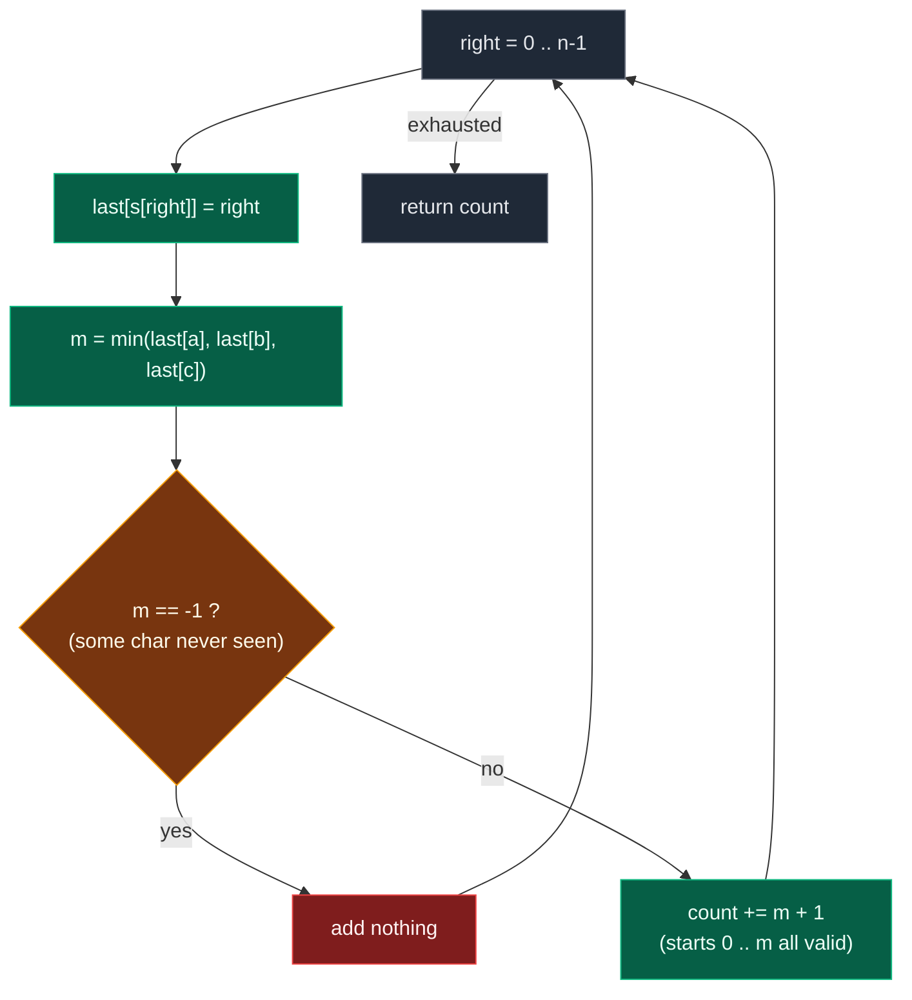

# 01. 1358. Number of Substrings Containing All Three Characters

| Difficulty | Pattern | Source | Time | Space |
|:---:|:---:|:---:|:---:|:---:|
| **Medium** | Counting Window | [1358. Number of Substrings Containing All Three Characters](https://leetcode.com/problems/number-of-substrings-containing-all-three-characters/) | `O(n)` | `O(1)` |

## 1. Problem Statement

Given a string `s` consisting only of characters `a`, `b` and `c`.

Return the number of substrings containing **at least one** occurrence of all these characters `a`, `b` and `c`.

### Examples

```text
Input:  s = "abcabc"
Output: 10
Explanation: The substrings containing at least one occurrence of the
             characters a, b and c are "abc", "abca", "abcab", "abcabc",
             "bca", "bcab", "bcabc", "cab", "cabc" and "abc" (again).
```

```text
Input:  s = "aaacb"
Output: 3
Explanation: The substrings containing at least one occurrence of the
             characters a, b and c are "aaacb", "aacb" and "acb".
```

```text
Input:  s = "abc"
Output: 1
```

### Constraints

- `3 <= s.length <= 5 * 10^4`
- `s` only consists of `a`, `b` or `c` characters

## 2. Core Theory

This problem is **counting**, not maximising. That single word changes everything about how the window is used.

```text
COUNT  +  SUBSTRING  +  CONDITION
  |          |             |
how many  contiguous   "contains a, b and c"
```

In a longest-window problem you read one number off the window per step. In a counting problem you read a **whole family of substrings** off the window per step. Getting that family right — without double counting and without missing any — is the entire difficulty.

**The organising idea: count by ending index.** Every substring has exactly one last character. So instead of enumerating pairs `(start, end)`, fix the ending index `right` and ask: *how many valid substrings end here?* Sum that over all `right` and every substring is counted exactly once.

```text
With every character, there is a substring that ends.
```

That is the author's own phrasing, and it is the whole reframing.

### The last-seen-index solution

Fix `right`. A substring ending at `right` is `s[start..right]`. It is valid exactly when it contains at least one `a`, one `b` and one `c`.

Keep three numbers:

```text
last[a] = most recent index of 'a' at or before right   (-1 if never seen)
last[b] = most recent index of 'b' at or before right
last[c] = most recent index of 'c' at or before right
```

The substring `s[start..right]` contains an `a` if and only if `start <= last[a]` — because `last[a]` is the *rightmost* `a` available, so if `start` is past it, no `a` survives inside. Same for `b` and `c`. All three conditions at once:

```text
start <= last[a]  AND  start <= last[b]  AND  start <= last[c]
        ⇓
start <= min(last[a], last[b], last[c])
```

So the valid starts are `0, 1, 2, ..., min(...)`, and there are exactly:

```text
min(last[a], last[b], last[c]) + 1
```

of them. If any of the three is still `-1`, the `min` is `-1` and the formula yields `0` — the arithmetic handles "not all three seen yet" for free.

**Why it is correct — the monotone direction.** Moving `start` further right can only *drop* characters, never add them. The first character you lose as you slide `start` rightward is whichever of `a`, `b`, `c` was seen **least recently** — that is precisely the `min`. Once you pass it, that character is gone from the window and the substring is invalid, and every further `start` is invalid too. So validity as a function of `start` is a clean prefix: valid, valid, …, valid, then invalid forever. Counting the prefix is a single subtraction.



**Walk it on the author's string** `s = "bbacba"`:

```text
index:  0 1 2 3 4 5
char:   b b a c b a

right=0 'b'  last = {a:-1, b:0,  c:-1}   min=-1  add 0    total 0
right=1 'b'  last = {a:-1, b:1,  c:-1}   min=-1  add 0    total 0
right=2 'a'  last = {a:2,  b:1,  c:-1}   min=-1  add 0    total 0
right=3 'c'  last = {a:2,  b:1,  c:3}    min=1   add 2    total 2
right=4 'b'  last = {a:2,  b:4,  c:3}    min=2   add 3    total 5
right=5 'a'  last = {a:5,  b:4,  c:3}    min=3   add 4    total 9

answer = 0 + 0 + 0 + 2 + 3 + 4 = 9
```

At `right = 3` the `min` is `1`, the index of the most recent `b`. Starts `0` and `1` work (`"bbac"`, `"bac"`); start `2` gives `"ac"`, which lost the `b`. Exactly as the theory says — the least-recently-seen character is the one that falls out first.

### The expand/shrink counting window

The same answer, counted from the other side. Keep a frequency map for the window `s[left..right]` and expand `right`. The moment the window is valid:

```text
window s[left..right] is valid
        ⇓
so is s[left..right+1], s[left..right+2], ..., s[left..n-1]
        ⇓
that is (n - right) substrings, all starting at left
```

Adding characters on the right can never *remove* an `a`, `b` or `c` — validity is monotone in the end index too. So one valid window instantly certifies `n - right` substrings. Add them, then shrink `left` by one and check again; the loop must be a `while`, because a single `right` can certify several different `left` values.

```text
s = "abcabc",  n = 6

right=2  window [a b c]        valid -> += 6-2 = 4   ("abc","abca","abcab","abcabc")
         drop 'a', left=1      invalid
right=3  window [b c a]        valid -> += 6-3 = 3   ("bca","bcab","bcabc")
         drop 'b', left=2      invalid
right=4  window [c a b]        valid -> += 6-4 = 2   ("cab","cabc")
         drop 'c', left=3      invalid
right=5  window [a b c]        valid -> += 6-5 = 1   ("abc")
         drop 'a', left=4      invalid

total = 4 + 3 + 2 + 1 = 10
```

Notice the two methods count *different families*: the window version groups by **starting** index (`n - right` substrings sharing a start), the last-seen version groups by **ending** index (`min + 1` substrings sharing an end). Both partition the same set, so both totals agree.

| Feature | Counting window | Last-seen index |
|:---|:---|:---|
| State | Frequency map of the window | Three integers |
| Counts per step | `n - right`, grouped by `left` | `min + 1`, grouped by `right` |
| Loop shape | `for right` with inner `while` | Single `for`, no inner loop |
| Time | `O(n)` amortized | `O(n)` strict |
| Space | `O(1)` (three counters) | `O(1)` (three integers) |
| Interview value | Shows the sliding-window template | Shorter, but less transferable |

The window version is the one to lead with, because the template generalizes to "at least `k` distinct", "at least one of each of `t`" and every relative. The last-seen version is the clean punchline to offer afterwards.

**Why `O(1)` space.** The alphabet is fixed at three characters. Whether you store a dict of three keys or three named integers, the state does not grow with `n`.

## 3. Edge Cases

| Case | Input | Expected | Why it matters |
|:---|:---|:---:|:---|
| Minimum valid length | `s = "abc"` | `1` | The whole string is the only valid substring |
| Missing a character | `s = "aaabbb"` | `0` | `last[c]` stays `-1` forever; `min + 1` must be `0`, not `-1` |
| All identical | `s = "aaaaa"` | `0` | Window never becomes valid; the inner `while` never runs |
| Valid only at the very end | `s = "aaacb"` | `3` | Counting must fire on the last two indices, not earlier |
| Long prefix of one char | `s = "aaaaabc"` | `5` | Starts `0..4` all valid at `right = 6`; the `min` does the work |
| Every character valid | `s = "abcabc"` | `10` | Multiple shrinks per `right`; `if` instead of `while` undercounts |
| Repeats far apart | `s = "cba"` | `1` | Order does not matter, only presence |
| Maximum length | `5 * 10^4` chars | fits in 64-bit | Answer can approach `n^2/2 ≈ 1.25 * 10^9` — larger than a 32-bit int |

## 4. Brute Force: Check Every Substring

### Intuition

Try every possible substring. For every starting index, expand the ending index. Track whether the substring contains `a`, `b` and `c`. Whenever it contains all three, count it.

### Approach

1. For every `start` from `0` to `n - 1`.
2. Reset a frequency map `{a: 0, b: 0, c: 0}`.
3. For every `end` from `start` to `n - 1`, add `s[end]` to the map.
4. If all three counts are positive, increment `count`.

Note the map is *not* rebuilt from scratch for each `end` — it is extended incrementally, which already saves a factor of `n` over slicing the substring out each time.

### Dry Run

```text
s = "bbacba"

start = 0:  "b"      no    "bb"     no    "bba"    no
            "bbac"   YES   "bbacb"  YES   "bbacba" YES     -> 3
start = 1:  "b"      no    "ba"     no    "bac"    YES
            "bacb"   YES   "bacba"  YES                    -> 3
start = 2:  "a"      no    "ac"     no    "acb"    YES
            "acba"   YES                                   -> 2
start = 3:  "c"      no    "cb"     no    "cba"    YES      -> 1
start = 4:  "b"      no    "ba"     no                     -> 0
start = 5:  "a"      no                                    -> 0

total = 9
```

### The Author's Pseudocode

The handwritten page writes it with a `hash[3]` array indexed by `s[j] - 'a'`:

```text
cnt = 0
for (i = 0 -> n)
{
    hash[3] = {0}

    for (j = i -> n)
    {
        hash[ s[j] - 'a' ] = 1;

        if ( hash[0] + hash[1] + hash[2] == 3 )
            cnt = cnt + 1;
    }
}
print(cnt);

TC -> O(N^2)
SC -> O(1)
```

Setting the slot to `1` rather than incrementing is enough here, because only *presence* matters — and then the three slots summing to `3` is exactly "all three seen".

### Code

```python
# Define the class solution
class Solution:

    # Deifne the method
    def numberOfSubstrings(self, s: str) -> int:

        # Store length of the string.
        n = len(s)

        # Store total number of valid substrings.
        count = 0

        # Try every possible starting index.
        for start in range(n):

            # Store frequency of a, b, c in current substring.
            freq = {"a": 0, "b": 0, "c": 0}

            # Try every possible ending index.
            for end in range(start, n):

                # Add current character to frequency map.
                freq[s[end]] += 1

                # If current substring contains all three characters.
                if freq["a"] > 0 and freq["b"] > 0 and freq["c"] > 0:

                    # Count this valid substring.
                    count += 1

        # Return total valid substrings.
        return count
```

### Complexity

| Measure | Complexity | Why |
|:---|:---:|:---|
| **Time** | `O(n^2)` | Two nested loops; the frequency update and the check are both `O(1)` |
| **Space** | `O(1)` | Only counts of three characters are stored |

At `n = 5 * 10^4` this is `2.5 * 10^9` iterations — far too slow.

## 5. Better Brute Force: Break Early and Count in Bulk

### Intuition

For a fixed `start`, once we find an `end` where the substring becomes valid, then **every longer substring starting at `start` will also be valid**.

Why? Because adding more characters cannot remove an existing `a`, `b`, or `c`.

So if `s[start:end]` is valid, then `s[start:end+1]`, `s[start:end+2]`, …, `s[start:n-1]` are also valid. We can add `n - end` in one shot and `break`.

### Approach

1. For each `start`, extend `end` until the window `s[start..end]` first becomes valid.
2. Add `n - end` to the count — all the longer extensions at once.
3. `break` out of the inner loop; this `start` has nothing left to contribute.

### Dry Run

```text
s = "bbacba",  n = 6

start = 0:  first valid at end = 3 ("bbac")  -> += 6 - 3 = 3, break
start = 1:  first valid at end = 3 ("bac")   -> += 6 - 3 = 3, break
start = 2:  first valid at end = 4 ("acb")   -> += 6 - 4 = 2, break
start = 3:  first valid at end = 5 ("cba")   -> += 6 - 5 = 1, break
start = 4:  never valid                      -> += 0
start = 5:  never valid                      -> += 0

total = 9
```

### Code

```python
# Define the class solution
class Solution:

    # Define the method
    def numberOfSubstrings(self, s: str) -> int:

        # Store length of the string.
        n = len(s)

        # Store total valid substrings.
        count = 0

        # Try every possible starting index.
        for start in range(n):

            # Store frequency of a, b, c.
            freq = {"a": 0, "b": 0, "c": 0}

            # Expand the substring from start to end.
            for end in range(start, n):

                # Add current character into frequency map.
                freq[s[end]] += 1

                # If current substring contains all three characters.
                if freq["a"] > 0 and freq["b"] > 0 and freq["c"] > 0:

                    # All substrings from end to n - 1 are valid.
                    count += n - end

                    # No need to expand this start further.
                    break

        # Return total count.
        return count
```

### Complexity

| Measure | Complexity | Why |
|:---|:---:|:---|
| **Time** | `O(n^2)` | Worst case still scans many pairs — a string like `"aaaa...abc"` makes every start walk far |
| **Space** | `O(1)` | Three counters |

This is better practically, but not optimal. The waste is obvious once named: after `start = 0` has walked to index `3`, `start = 1` throws that knowledge away and walks again.

## 6. Optimal Solution: Sliding Window + Counting

### Intuition

We maintain a window `s[left:right+1]` and expand using `right`. When the window contains all three characters, it becomes valid.

Now here is the important counting trick: if the current window `s[left:right+1]` is valid, then **every substring that starts at `left` and ends at any index from `right` to `n - 1` is also valid**. So we add `n - right`. Then we shrink from the left to find more valid substrings for the same `right`.

```text
window valid, left fixed:

    left            right          n-1
     |                |             |
     [  a  b  c  ]  ?  ?  ?  ?  ?  ?
     └────valid────┘
     └──────valid──────┘
     └────────valid────────┘   ...  all the way to n-1

     that is (n - right) substrings, added in O(1)
```

### Approach

1. Keep `freq` of `a`, `b`, `c` inside the window, `left = 0`, `count = 0`.
2. For each `right`, add `s[right]` to `freq`.
3. **While** the window is valid: `count += n - right`, then remove `s[left]` and advance `left`.
4. Return `count`.

### Why `while` and not `if`

One `right` can generate multiple valid substrings by moving `left` multiple times. Take `s = "aaacb"`. At `right = 4` the window contains all three characters, and the valid substrings ending there are:

```text
"aaacb"
"aacb"
"acb"
```

All three must be counted at the same `right`. With `if` we would count only the first and miss the other two. The shrink loop is where the answer is produced, so it has to run to exhaustion.

### Why the answer is recorded *before* the shrink

`count += n - right` sits at the top of the `while` body, before `freq[s[left]] -= 1`. That order matters: the count describes the window *as it currently stands*. Decrementing first would describe a window that may no longer be valid.

### Dry Run

```text
s = "abcabc"
left = 0, freq = {a:0, b:0, c:0}, count = 0, n = 6
```

```text
right=0  s[0]='a'   freq={a:1,b:0,c:0}   invalid                    count=0
right=1  s[1]='b'   freq={a:1,b:1,c:0}   invalid (c missing)        count=0
right=2  s[2]='c'   freq={a:1,b:1,c:1}   VALID  window "abc"
                    += n - right = 6 - 2 = 4                        count=4
                       ("abc", "abca", "abcab", "abcabc")
                    shrink: remove s[0]='a', freq={a:0,b:1,c:1}, left=1
                    now invalid

right=3  s[3]='a'   freq={a:1,b:1,c:1}   VALID  window "bca"
                    += 6 - 3 = 3                                    count=7
                       ("bca", "bcab", "bcabc")
                    shrink: remove s[1]='b', freq={a:1,b:0,c:1}, left=2
                    now invalid

right=4  s[4]='b'   freq={a:1,b:1,c:1}   VALID  window "cab"
                    += 6 - 4 = 2                                    count=9
                       ("cab", "cabc")
                    shrink: remove s[2]='c', freq={a:1,b:1,c:0}, left=3
                    now invalid

right=5  s[5]='c'   freq={a:1,b:1,c:1}   VALID  window "abc"
                    += 6 - 5 = 1                                    count=10
                       ("abc")
                    shrink: remove s[3]='a', freq={a:0,b:1,c:1}, left=4
                    now invalid

Final answer: 10
```

And the `"aaacb"` case, where one `right` fires three times:

```text
s = "aaacb",  n = 5

right=0..3   window never contains 'b'                     count=0
right=4  s[4]='b'   freq={a:3,b:1,c:1}
         VALID  window "aaacb"  -> += 5 - 4 = 1            count=1
         shrink: remove s[0]='a', left=1
         VALID  window "aacb"   -> += 1                    count=2
         shrink: remove s[1]='a', left=2
         VALID  window "acb"    -> += 1                    count=3
         shrink: remove s[2]='a', freq={a:0,...}, left=3
         now invalid

Final answer: 3
```

### Code

```python
# Define the class solution
class Solution:

    # Define the method
    def numberOfSubstrings(self, s: str) -> int:

        # Store length of the string.
        n = len(s)

        # Store frequency of a, b, c inside current window.
        freq = {"a": 0, "b": 0, "c": 0}

        # Left pointer of sliding window.
        left = 0

        # Store total number of valid substrings.
        count = 0

        # Move right pointer through the string.
        for right in range(n):

            # Add current character into the window.
            freq[s[right]] += 1

            # While current window contains all three characters,
            # count valid substrings and shrink from left.
            while freq["a"] > 0 and freq["b"] > 0 and freq["c"] > 0:

                # Since window s[left:right+1] is valid,
                # all substrings starting at left and ending from right to n - 1 are valid.
                count += n - right

                # Remove leftmost character from the window.
                freq[s[left]] -= 1

                # Move left pointer forward.
                left += 1

        # Return total valid substring count.
        return count
```

### Complexity

| Measure | Complexity | Why |
|:---|:---:|:---|
| **Time** | `O(n)` | Each character enters the window once and leaves once; total pointer movement is `2n` |
| **Space** | `O(1)` | Only counts for `a`, `b`, `c` are stored |

The nested `while` does not make this quadratic: `left` never resets, so across the whole run it advances at most `n` times in total.

## 7. Alternative Optimal Solution: Last Seen Index

This is also a very popular solution.

### Intuition

For every index `right`, store the last seen position of `a`, `b`, `c`. If all three characters have appeared, then the number of valid substrings ending at `right` is:

```text
min(last_seen['a'], last_seen['b'], last_seen['c']) + 1
```

Why? Because the earliest last occurrence among `a`, `b`, and `c` decides how far left we can start. Push `start` one step past that index and the corresponding character disappears from the substring.

### Approach

1. Initialise `last_seen = {"a": -1, "b": -1, "c": -1}` so "never seen" is representable.
2. For each `right`, set `last_seen[s[right]] = right`.
3. Let `earliest = min(last_seen["a"], last_seen["b"], last_seen["c"])`.
4. If `earliest != -1`, add `earliest + 1` to the count.
5. Return the count.

The `-1` sentinel is doing double duty: it marks "not yet seen", and it also makes `earliest + 1 = 0`, so the guard is arguably optional — but writing it out states the intent.

### Dry Run

```text
s = "abcabc"
last_seen = {a:-1, b:-1, c:-1}, count = 0
```

```text
right=0 'a'  last_seen={a:0,  b:-1, c:-1}  min=-1  add 0           count=0
right=1 'b'  last_seen={a:0,  b:1,  c:-1}  min=-1  add 0           count=0
right=2 'c'  last_seen={a:0,  b:1,  c:2}   min=0   add 0+1 = 1     count=1
             valid substring ending here: "abc"
right=3 'a'  last_seen={a:3,  b:1,  c:2}   min=1   add 1+1 = 2     count=3
             valid substrings ending here: "abca", "bca"
right=4 'b'  last_seen={a:3,  b:4,  c:2}   min=2   add 2+1 = 3     count=6
             valid: "abcab", "bcab", "cab"
right=5 'c'  last_seen={a:3,  b:4,  c:5}   min=3   add 3+1 = 4     count=10
             valid: "abcabc", "bcabc", "cabc", "abc"

Final answer: 10
```

### The Author's Pseudocode

```text
func(s)
{
    lastSeen[3] = { -1, -1, -1 };   cnt = 0;

    for (i = 0 -> n)
    {
        lastSeen[ s[i] - 'a' ] = i;

        if ( lastSeen[0] != -1 && ... )
            cnt = cnt + ( 1 + min( lastSeen[0], lastSeen[1], lastSeen[2] ) );
    }
    return cnt;
}

TC -> O(N)
SC -> O(1)
```

The page also notes the degenerate arithmetic explicitly: when the minimum is `-1`, `1 + (-1) = 0`, so nothing is added.

### Code

```python
# Define the class solution
class Solution:

    # Define the method
    def numberOfSubstrings(self, s: str) -> int:

        # Store last seen index of a, b, and c.
        last_seen = {"a": -1, "b": -1, "c": -1}

        # Store total valid substrings.
        count = 0

        # Traverse each character using right pointer.
        for right in range(len(s)):

            # Update last seen position of current character.
            last_seen[s[right]] = right

            # Find earliest last seen index among a, b, and c.
            earliest_last_seen = min(last_seen["a"], last_seen["b"], last_seen["c"])

            # If all three characters have appeared,
            # earliest_last_seen will not be -1.
            if earliest_last_seen != -1:

                # Number of valid substrings ending at right.
                count += earliest_last_seen + 1

        # Return total count.
        return count
```

### Complexity

| Measure | Complexity | Why |
|:---|:---:|:---|
| **Time** | `O(n)` | One pass, constant work per index — no inner loop at all |
| **Space** | `O(1)` | Three integers |

This is also optimal, and strictly simpler to write. For sliding-window *practice*, prefer the window version, because the `while freq["a"] > 0 and freq["b"] > 0 and freq["c"] > 0:` line shows the pattern clearly. If the interviewer asks for something shorter or cleverer, offer the last-seen-index method.

## 8. Pattern Summary

```text
Problem type:
Variable-size sliding window + counting

Window meaning:
Current substring

Valid condition:
freq['a'] > 0 and freq['b'] > 0 and freq['c'] > 0

Expand condition:
Move right and add s[right]

Shrink condition:
While window contains all three characters

Answer update:
Inside while loop before removing s[left]

Counting formula:
n - right

Data structure:
Frequency map of a, b, c
```

## 9. Common Mistakes

| Mistake | Why it breaks | Fix |
|:---|:---|:---|
| Using `if` instead of `while` for the shrink | One `right` can certify several `left` values; `"aaacb"` returns `1` instead of `3` | `while freq["a"] > 0 and freq["b"] > 0 and freq["c"] > 0:` |
| Adding `n - right` *after* decrementing `freq[s[left]]` | The count describes a window that may already be invalid | Record the answer at the top of the `while` body |
| Adding `1` per valid window instead of `n - right` | Counts only the minimal window, not its extensions; `"abcabc"` gives `4` instead of `10` | `count += n - right` |
| Counting `right - left + 1` (the length) | That is the longest-window habit misfiring; it has no meaning here | The family is indexed by *end*, so it is `n - right` |
| Initialising `last_seen` to `0` instead of `-1` | `0` is a real index, so an unseen character looks like it appeared at position `0` | Use `-1`, and let `min + 1 = 0` handle it |
| Using a set of characters seen so far instead of counts | A set cannot tell you when the *last* `a` leaves the window during the shrink | Keep integer counts and decrement them |
| Assuming the answer fits a 32-bit int | At `n = 5 * 10^4` the answer approaches `1.25 * 10^9`, which overflows signed 32-bit in C++/Java | Use `long long` / `long` outside Python |

## 10. Interview Follow-ups

**Q: Why is `n - right` the right amount to add, and not `right - left + 1`?**

A: Because validity is monotone in *both* directions, but in opposite senses. Extending the end keeps a valid window valid, so a valid `s[left..right]` certifies `s[left..right]`, `s[left..right+1]`, …, `s[left..n-1]` — that is `n - right` substrings, all sharing the same start. `right - left + 1` is the window's length, which answers a longest-window question, not a counting one.

**Q: Generalize to an arbitrary required set, not just `a`, `b`, `c`.**

A: Replace the three-way check with a `have == required` counter. Keep a `need` set of `k` distinct characters, a window frequency map, and an integer `have` counting how many of the `k` requirements are currently met. Increment `have` when a character's count reaches `1`, decrement when it drops back to `0`, and the valid test becomes `have == k`. Same `O(n)` time, now `O(k)` space. That is exactly the machinery Minimum Window Substring needs.

**Q: Count substrings containing all three characters **exactly** once each.**

A: Different problem — that condition is not monotone, so the bulk-count trick dies. A valid substring must have length exactly `3` and be a permutation of `"abc"`, so a fixed window of size `3` with a single equality check solves it in `O(n)`.

**Q: What about "number of substrings containing at most `k` distinct characters"?**

A: The complementary template. Expand `right`, shrink while `len(window) > k`, and add `right - left + 1` at every step — the count of valid substrings *ending* at `right`. Note the formula flips from `n - right` to `right - left + 1` because "at most" is monotone in the shrinking direction rather than the growing one. Subtracting two such counts (`atMost(k) - atMost(k-1)`) gives "exactly `k`".

**Q: Can the answer overflow?**

A: In Python no. Elsewhere, yes: the maximum is roughly `n(n-1)/2` for a string like `"abcabc..."`, which at `n = 5 * 10^4` is about `1.25 * 10^9` — past the signed 32-bit limit of `2.1 * 10^9` only narrowly, but close enough that a `long` is the safe choice.

**Q: Why does the inner `while` not make the solution `O(n^2)`?**

A: `left` only moves forward and never resets. Over the entire run it advances at most `n` times total, not `n` times per iteration. Each character enters the window exactly once and leaves at most once, so total work is bounded by `2n`. A single iteration of the outer loop may do `O(n)` shrink work, but the sum across all iterations is `O(n)` — the standard amortized argument.

## 11. Interview Explanation

> I use a variable-size sliding window. The window is valid when it contains at least one a, one b, and one c. I expand the window with the right pointer and update character frequencies. Whenever the window becomes valid, every substring starting at the current left and ending anywhere from right to the end is valid, so I add `n - right`. Then I shrink from the left to find more valid substrings for the same right pointer. This gives an `O(n)` solution because each character enters and leaves the window at most once.

## 12. Verify

```python
from typing import Dict


def number_of_substrings(s: str) -> int:
    n = len(s)
    freq: Dict[str, int] = {"a": 0, "b": 0, "c": 0}
    left = 0
    count = 0
    for right in range(n):
        freq[s[right]] += 1
        while freq["a"] > 0 and freq["b"] > 0 and freq["c"] > 0:
            # Window s[left:right+1] is valid, so every extension is too.
            count += n - right
            freq[s[left]] -= 1
            left += 1
    return count


def last_seen_version(s: str) -> int:
    last_seen = {"a": -1, "b": -1, "c": -1}
    count = 0
    for right, ch in enumerate(s):
        last_seen[ch] = right
        earliest = min(last_seen["a"], last_seen["b"], last_seen["c"])
        if earliest != -1:
            count += earliest + 1
    return count


def brute_force(s: str) -> int:
    n = len(s)
    total = 0
    for start in range(n):
        freq = {"a": 0, "b": 0, "c": 0}
        for end in range(start, n):
            freq[s[end]] += 1
            if freq["a"] > 0 and freq["b"] > 0 and freq["c"] > 0:
                total += 1
    return total


# LeetCode examples
assert number_of_substrings("abcabc") == 10
assert number_of_substrings("aaacb") == 3
assert number_of_substrings("abc") == 1

# Edge case: minimum valid length, every ordering works
assert number_of_substrings("cba") == 1
assert number_of_substrings("bca") == 1

# Edge case: a required character never appears
assert number_of_substrings("aaabbb") == 0
assert number_of_substrings("abababab") == 0

# Edge case: all identical characters
assert number_of_substrings("aaaaa") == 0

# Edge case: valid only at the very end
assert number_of_substrings("aaacb") == 3

# Edge case: long prefix of one character, starts 0..4 all valid
assert number_of_substrings("aaaaabc") == 5

# The author's own example string
assert number_of_substrings("bbacba") == 9
assert last_seen_version("bbacba") == 9

# Both optimal versions agree with brute force on every short string
from itertools import product

for length in range(1, 10):
    for tup in product("abc", repeat=length):
        text = "".join(tup)
        expected = brute_force(text)
        assert number_of_substrings(text) == expected, text
        assert last_seen_version(text) == expected, text

# Randomised cross-check on longer, skewed inputs
import random

random.seed(7)
for _ in range(2000):
    n = random.randint(0, 40)
    alphabet = random.choice(["abc", "aab", "aaabc", "ab", "c"])
    text = "".join(random.choice(alphabet) for _ in range(n))
    expected = brute_force(text)
    assert number_of_substrings(text) == expected, text
    assert last_seen_version(text) == expected, text

# Structural property: for "abcabc..." the answer is the triangular sum
for repeats in range(1, 12):
    text = "abc" * repeats
    n = len(text)
    # Every start index 0..n-3 yields exactly one first-valid end,
    # and the counts form a descending run.
    assert number_of_substrings(text) == brute_force(text)

# Performance sanity at the constraint bound
big = "abc" * 16666 + "ab"
assert number_of_substrings(big) == last_seen_version(big)
assert number_of_substrings(big) > 10 ** 9  # overflows 32-bit in other languages

print("All tests passed")
```
