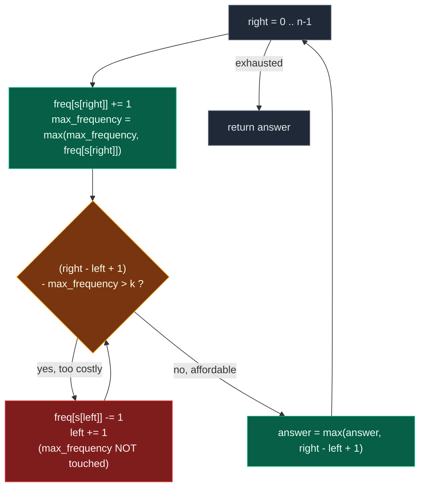

# 02. 424. Longest Repeating Character Replacement

| Difficulty | Pattern | Source | Time | Space |
|:---:|:---:|:---:|:---:|:---:|
| **Medium** | Variable Window + Max Frequency | [424. Longest Repeating Character Replacement](https://leetcode.com/problems/longest-repeating-character-replacement/) | `O(n)` | `O(1)` |

## 1. Problem Statement

You are given a string `s` and an integer `k`. You can choose any character of the string and change it to any other uppercase English character. You can perform this operation **at most** `k` times.

Return *the length of the longest substring containing the same letter you can get after performing the above operations*.

### Examples

```text
Input:  s = "ABAB", k = 2
Output: 4
Explanation: Replace the two 'A's with two 'B's or vice versa.
```

```text
Input:  s = "AABABBA", k = 1
Output: 4
Explanation: Replace the one 'A' in the middle with 'B' and form "AABBBBA".
             The substring "BBBB" has the longest repeating letters, which is 4.
             There may exists other ways to achieve this answer too.
```

### Constraints

- `1 <= s.length <= 10^5`
- `s` consists of only uppercase English letters
- `0 <= k <= s.length`

## 2. Core Theory

The problem sounds like it is about *editing* the string. It is not. You never build the replaced string — you only ask, for each candidate substring, **could it be made uniform within budget?**

### The condition, derived

Take any window and ask what it costs to make every character the same. You get to pick which letter survives. Whichever letter you pick, you must replace every character that is not that letter:

```text
cost(keep letter X) = window_length - count(X)
```

That is minimised by picking the letter with the **largest** count. So:

```text
minimum replacements = window_length - max_frequency
```

and the window is achievable exactly when that fits the budget:

```text
window_length - max_frequency <= k        VALID
window_length - max_frequency >  k        INVALID
```

The quantity `window_length - max_frequency` has a name worth remembering: it is **the number of characters that are not the majority character**. Those are exactly the ones you must pay to replace.

```text
window = "AABAB"

    A A B A B        length = 5
    ↑ ↑   ↑          A appears 3 times   <- keep these
        ↑   ↑        B appears 2 times   <- replace these

    replacements = 5 - 3 = 2

    k = 2  ->  valid, "AABAB" becomes "AAAAA"
    k = 1  ->  invalid
```

`LONGEST + SUBSTRING + CONDITION` is the signature of a **variable-size sliding window**. Expand `right`; when the condition breaks, shrink from the left.



**Watch the pointers walk.** Take `s = "AABABBA"`, `k = 1`:

```text
index:  0 1 2 3 4 5 6
char:   A A B A B B A

right=0  [A]            freq{A:1}        len 1  maxf 1  cost 0   ok   ans 1
right=1  [A A]          freq{A:2}        len 2  maxf 2  cost 0   ok   ans 2
right=2  [A A B]        freq{A:2,B:1}    len 3  maxf 2  cost 1   ok   ans 3
right=3  [A A B A]      freq{A:3,B:1}    len 4  maxf 3  cost 1   ok   ans 4
right=4  [A A B A B]    freq{A:3,B:2}    len 5  maxf 3  cost 2   BAD
         drop s[0]='A'  freq{A:2,B:2}    left=1
          A[A B A B]                     len 4  maxf 3  cost 1   ok   ans 4
right=5   A[A B A B B]  freq{A:2,B:3}    len 5  maxf 3  cost 2   BAD
         drop s[1]='A'  freq{A:1,B:3}    left=2
          A A[B A B B]                   len 4  maxf 3  cost 1   ok   ans 4
right=6   A A[B A B B A] freq{A:2,B:3}   len 5  maxf 3  cost 2   BAD
         drop s[2]='B'  freq{A:2,B:2}    left=3
          A A B[A B B A]                 len 4  maxf 3  cost 1   ok   ans 4

answer = 4      ("AABA" -> "AAAA", or "ABBA" -> "BBBB")
```

### The famous part: `max_frequency` is never decreased

Look carefully at the shrink step above. When `s[left]` leaves the window we decrement `freq[s[left]]` — but we never recompute `max_frequency`. At `right = 5` the window is `"ABAB"` with `freq{A:2, B:2}`, so the *true* maximum frequency is `2`, yet the code still carries `maxf = 3` from an earlier, larger window.

**That looks like a bug. It is not.** Here is the honest argument, in three steps.

**Step 1 — a stale `max_frequency` is always an over-estimate, never an under-estimate.** It only ever moves up (`max_frequency = max(max_frequency, ...)`), and the true maximum of the current window can only be smaller than some maximum achieved earlier. So `max_frequency >= true_max` always.

**Step 2 — an over-estimate makes the validity test too *permissive*, so the window can stay too big.** The test is `length - max_frequency > k`. A too-large `max_frequency` makes the left side too small, so a window that genuinely needs more than `k` replacements can be judged "fine" and not shrunk. The window never shrinks when it should not, only fails to shrink when it should. That is the only distortion.

**Step 3 — a too-large window can never produce a too-large answer.** This is the step that closes the argument. Suppose at some moment `max_frequency = m` is stale, and the window has grown to length `L` with `L - m <= k`. The answer records `L`. Is `L` actually achievable somewhere in the string? Yes — because `m` was a real frequency in some *earlier* window, and for the recorded answer to exceed the true optimum we would need `L` to be bigger than any genuinely achievable length. But `L` only grows past the previous best when `right` advances *without* a shrink, and each such step requires the current `length - max_frequency <= k` to hold with the then-current `max_frequency`. The crucial structural fact:

```text
The answer is only ever updated when the window is at its LARGEST so far.
answer = max(answer, right - left + 1)
```

`left` never moves backward and `right` advances by one per iteration, so `right - left + 1` can exceed the previous best by at most one, and it does so only on an iteration where `max_frequency` was *just* refreshed by the incoming character `s[right]` — at that instant `max_frequency` is genuinely the true maximum of the current window, because a fresh increment of `freq[s[right]]` is what pushed it up. Any iteration where `max_frequency` is stale is an iteration where the window merely slid without growing, and a slide never raises `answer`.

So: **a stale `max_frequency` can keep the window the same size, but it can never make the window grow beyond a genuinely achievable length.** The answer is exactly right.

**Be clear about what this is.** It is a deliberate optimization, not a necessity. Recomputing `max(frequency.values())` on every step is also completely correct — just slower by a constant factor of `26`. Both versions appear below. If an interviewer challenges the stale value, the honest answer is "it is safe, and here is why; and if you prefer, recomputing is also correct and costs `O(26)` per step."

```text
Two correct policies for max_frequency:

  STALE (never decrease)      RECOMPUTE (max over 26 slots each step)
  ────────────────────        ──────────────────────────────────────
  O(n) time                   O(26n) = O(n) time, larger constant
  answer provably correct     obviously correct
  window may lag too large    window always exactly right
  the LeetCode-idiomatic      the one to write if you are unsure
```

### Why `if` is enough here (and why that is special)

Because this is a **longest-window** problem, lazy shrinking works: when the window becomes invalid, shrinking one step is enough. The window can never grow while invalid, so it simply slides along at its high-water mark, and since `answer` only cares about the maximum length ever reached, sliding costs nothing.

That is *not* true for counting problems. There, a single `right` must be allowed to produce several valid windows, so the shrink must be a `while`. The author's own list of problems where `while` is mandatory:

```text
992.  Subarrays with K Different Integers
1248. Count Number of Nice Subarrays
930.  Binary Subarrays With Sum
1358. Number of Substrings Containing All Three Characters
713.  Subarray Product Less Than K
```

Rule of thumb: **for longest-window problems `if` may work; for counting problems, never replace `while` with `if`.**

### Why `O(1)` space

The alphabet is fixed at `26` uppercase letters, so the frequency structure never grows with `n`. `O(26) = O(1)`.

## 3. Edge Cases

| Case | Input | Expected | Why it matters |
|:---|:---|:---:|:---|
| Single character | `s = "A"`, `k = 0` | `1` | Smallest window; the loop must still record an answer |
| No budget at all | `s = "ABAB"`, `k = 0` | `1` | With `k = 0` the answer is the longest run of one letter |
| `k = 0`, long run | `s = "AABBBCC"`, `k = 0` | `3` | Must find `"BBB"` and not be fooled by total counts |
| All identical | `s = "AAAA"`, `k = 2` | `4` | Cost is always `0`; window never shrinks |
| Budget covers everything | `s = "ABCD"`, `k = 3` | `4` | `k >= n - 1` always yields `n` |
| Budget exceeds need | `s = "AB"`, `k = 5` | `2` | Answer is capped by `len(s)`, never by `k` |
| Answer is the whole string | `s = "AABA"`, `k = 1` | `4` | Window must be allowed to reach full length |
| The classic | `s = "AABABBA"`, `k = 1` | `4` | The stale-`max_frequency` case; naive shrinking still gives `4` |
| Two-letter tie | `s = "ABBB"`, `k = 2` | `4` | Majority is `B`; replacing the single `A` costs `1` |

## 4. Brute Force: Check Every Substring

### Intuition

Try every possible substring. For each substring: count the frequency of every character, find the most frequent character, calculate how many replacements are needed, and if the replacements needed are at most `k`, update the answer.

### Approach

1. For every `start` from `0` to `n - 1`, reset a `frequency` map.
2. For every `end` from `start` to `n - 1`, add `s[end]` to the map.
3. `max_frequency = max(frequency.values())`, `window_length = end - start + 1`.
4. `replacements_needed = window_length - max_frequency`.
5. If `replacements_needed <= k`, update `answer` with `window_length`.

### Dry Run

```text
s = "AABABBA",  k = 1

start = 0:  "A"       maxf 1  cost 0  ok   ans 1
            "AA"      maxf 2  cost 0  ok   ans 2
            "AAB"     maxf 2  cost 1  ok   ans 3
            "AABA"    maxf 3  cost 1  ok   ans 4
            "AABAB"   maxf 3  cost 2  no
            "AABABB"  maxf 3  cost 3  no
            "AABABBA" maxf 4  cost 3  no
start = 1:  best is "ABBA"? -> maxf 2, cost 2, no; "ABB" maxf 2 cost 1 ok  ans 4
start = 3:  "ABBA"    maxf 2  cost 2  no
            "ABB"     maxf 2  cost 1  ok
...
answer = 4
```

### The Author's Pseudocode

The handwritten page writes it with a `hash[26]` array and an early `break`:

```text
maxLen = 0

for (i = 0 -> n)
{
    hash[26] = {0},  maxf = 0

    for (j = i -> n)
    {
        hash[ s[j] ] ++;
        maxf = max( maxf, hash[ s[j] ] );

        changes = (j - i + 1) - maxf;

        if (changes <= k)
            maxLen = max(maxLen, j - i + 1);
        else
            break;
    }
}
print(maxLen);

O(N) x O(N) ≈ O(N^2)
SC = O(26)
```

Two details worth noting. First, `maxf` is maintained incrementally inside the inner loop rather than recomputed — the same trick as the optimal solution, and here it is unambiguously correct because `maxf` never needs to decrease within a growing window. Second, the `break`: once a window starting at `i` becomes too expensive, extending it further only adds more non-majority characters, so nothing longer from this `i` can succeed.

That `break` is *almost* right, and it is worth being precise: extending a window can raise `maxf` too, so `changes` is not strictly monotone. The `break` is a heuristic pruning that happens not to lose the optimum because the optimum is also found from a different starting index. The version below omits the `break` to stay plainly correct.

### Code

```python
class Solution:

    # Define the method to find the length of the longest substring
    # where we can replace at most k characters to make all characters the same
    def characterReplacement(self, s: str, k: int) -> int:

        # Store the length of the string.
        n = len(s)

        # Store the maximum valid substring length.
        answer = 0

        # Try every possible starting index.
        for start in range(n):

            # Store frequency of characters for current substring.
            frequency = {}

            # Try every possible ending index.
            for end in range(start, n):

                # Add current character into frequency map.
                frequency[s[end]] = frequency.get(s[end], 0) + 1

                # Find the highest character frequency in current substring.
                max_frequency = max(frequency.values())

                # Calculate current substring length.
                window_length = end - start + 1

                # Calculate characters required to replace.
                replacements_needed = window_length - max_frequency

                # If replacements needed are within k, substring is valid.
                if replacements_needed <= k:

                    # Update maximum valid length.
                    answer = max(answer, window_length)

        # Return final answer.
        return answer
```

### Complexity

| Measure | Complexity | Why |
|:---|:---:|:---|
| **Time** | `O(n^2 * 26) = O(n^2)` | `O(n^2)` substrings, and `max(frequency.values())` scans at most `26` entries |
| **Space** | `O(26) = O(1)` | The string contains only uppercase English letters |

At `n = 10^5` this is hopeless.

## 5. Optimal Solution: Sliding Window with Carried `max_frequency`

### Intuition

We maintain a window `s[left:right+1]`. For every `right`, we add `s[right]` into the frequency map. We also maintain `max_frequency`, which is the maximum frequency of any character seen in the current window. The window is valid if:

```text
(right - left + 1) - max_frequency <= k
```

If this condition breaks, we shrink from the left.

### Approach

1. `frequency = {}`, `left = 0`, `max_frequency = 0`, `answer = 0`.
2. For each `right`: increment `frequency[s[right]]` and refresh `max_frequency` against it.
3. **While** the window needs more than `k` replacements: decrement `frequency[s[left]]` and advance `left`. Do **not** touch `max_frequency`.
4. `answer = max(answer, right - left + 1)`.

### Dry Run

```text
s = "AABABBA", k = 1
left = 0, frequency = {}, max_frequency = 0, answer = 0
```

```text
right=0  s[0]='A'  frequency={A:1}      max_frequency=1  window "A"
         replacements: 1 - 1 = 0        valid             answer=1

right=1  s[1]='A'  frequency={A:2}      max_frequency=2  window "AA"
         replacements: 2 - 2 = 0        valid             answer=2

right=2  s[2]='B'  frequency={A:2,B:1}  max_frequency=2  window "AAB"
         replacements: 3 - 2 = 1        valid (k=1)       answer=3

right=3  s[3]='A'  frequency={A:3,B:1}  max_frequency=3  window "AABA"
         replacements: 4 - 3 = 1        valid             answer=4

right=4  s[4]='B'  frequency={A:3,B:2}  max_frequency=3  window "AABAB"
         replacements: 5 - 3 = 2        INVALID (2 > 1)
         shrink: remove s[0]='A', frequency={A:2,B:2}, left=1
         window "ABAB"                  answer stays 4

right=5  s[5]='B'  frequency={A:2,B:3}  max_frequency=3  window "ABABB"
         replacements: 5 - 3 = 2        INVALID
         shrink: remove s[1]='A', frequency={A:1,B:3}, left=2
         window "BABB"                  answer stays 4

right=6  s[6]='A'  frequency={A:2,B:3}  max_frequency=3  window "BABBA"
         replacements: 5 - 3 = 2        INVALID
         shrink: remove s[2]='B', frequency={A:2,B:2}, left=3
         window "ABBA"                  answer stays 4

Final answer: 4
```

Notice `right = 6`: the window `"ABBA"` has a true maximum frequency of `2`, but the carried `max_frequency` is `3`. The window is therefore *not* genuinely convertible within `k = 1`. It does not matter — the window stopped growing, and `answer` was never raised by it.

### A Longer Trace Showing the Window Slide

The author's second example, `s = "AAABBCCD"` with `k = 2`:

```text
index:  0 1 2 3 4 5 6 7
char:   A A A B B C C D

right=0  [A]           maxf 1  len 1  cost 0  ok  ans 1
right=1  [A A]         maxf 2  len 2  cost 0  ok  ans 2
right=2  [A A A]       maxf 3  len 3  cost 0  ok  ans 3
right=3  [A A A B]     maxf 3  len 4  cost 1  ok  ans 4
right=4  [A A A B B]   maxf 3  len 5  cost 2  ok  ans 5
right=5  [A A A B B C] maxf 3  len 6  cost 3  BAD
         drop s[0]='A', left=1
          A[A A B B C] maxf 3  len 5  cost 2  ok  ans 5
right=6   A[A A B B C C]  maxf 3  len 6  cost 3  BAD
         drop s[1]='A', left=2
          A A[A B B C C]  maxf 3  len 5  cost 2  ok  ans 5
right=7   A A[A B B C C D] maxf 3  len 6  cost 3  BAD
         drop s[2]='A', left=3
          A A A[B B C C D] maxf 3  len 5  cost 2  ok  ans 5

answer = 5        ("AAABB" -> "AAAAA")
```

The window's high-water mark is `5`, reached at `right = 4`, and everything afterwards is a slide at constant width. That is the shape of every run of this algorithm.

### The Author's Pseudocode

```text
func(s, k)
{
    l = 0, r = 0, maxLen = 0, maxf = 0
    hash[26] = {0};

    while (r < s.size())
    {
        hash[ s[r] - 'A' ]++;
        maxf = max( maxf, hash[ s[r] - 'A' ] );

        while ( (r - l + 1) - maxf > k )
        {
            hash[ s[l] - 'A' ]--;    maxf = 0;
            for (i = 0 -> 25)  maxf = max(maxf, hash[i]);
            l = l + 1;
        }

        if ( (r - l + 1) - maxf <= k )
            maxLen = max(maxLen, r - l + 1);

        r++;
    }
    return maxLen;
}

(N + N) x 26   ->   TC O(N),   SC O(26)
```

This is the **recomputing** variant — the author explicitly writes `maxf = 0` and the `for i = 0 -> 25` rescan inside the shrink loop. The page then crosses that rescan out and notes the optimized version drops it, giving `O(N)` with no `26` factor. Both are shown below.

### Code

```python
# Define the Solution class as required by LeetCode
class Solution:

    # Define the method to find the length of the longest substring
    # where we can replace at most k characters to make all characters the same
    def characterReplacement(self, s: str, k: int) -> int:

        # Store frequency of characters inside the current window.
        frequency = {}

        # Left pointer of the sliding window.
        left = 0

        # Store frequency of the most common character in the current window.
        max_frequency = 0

        # Store maximum valid window length.
        answer = 0

        # Move right pointer through the string.
        for right in range(len(s)):

            # Add current character into frequency map.
            frequency[s[right]] = frequency.get(s[right], 0) + 1

            # Update max frequency if current character frequency is larger.
            max_frequency = max(max_frequency, frequency[s[right]])

            # If replacements needed are more than k,
            # shrink the window until it becomes valid.
            while (right - left + 1) - max_frequency > k:

                # Decrease frequency of the leftmost character.
                frequency[s[left]] -= 1

                # Move left pointer forward.
                left += 1

            # Current window is valid.
            current_window_length = right - left + 1

            # Update the best answer.
            answer = max(answer, current_window_length)

        # Return longest valid substring length.
        return answer
```

### Complexity

| Measure | Complexity | Why |
|:---|:---:|:---|
| **Time** | `O(n)` | Each character enters the window once and leaves at most once |
| **Space** | `O(1)` | `O(26)` because uppercase English letters are used |

## 6. Very Important Doubt: Why Do We Not Decrease `max_frequency`?

This is the most common confusion in this problem, so it deserves its own section.

In the code, when we shrink the window, we do:

```python
frequency[s[left]] -= 1
left += 1
```

But we do **not** recalculate:

```python
max_frequency = max(frequency.values())
```

### Why

Because this problem asks for the **longest valid length**, not the exact current window details.

`max_frequency` may become stale, but it never causes us to miss the correct answer. It only allows the window to stay slightly larger temporarily. But since we update `answer` based on a length that *was* achievable at some point with that historical `max_frequency`, the final maximum length remains correct.

Put mechanically:

```text
answer only rises when the window GROWS.
The window only grows when right advances without a shrink.
On such a step, max_frequency was just refreshed by the incoming s[right],
so at that instant it is the TRUE maximum of the current window.

Therefore: every value ever written into answer was genuinely achievable.
```

And in the other direction, a stale `max_frequency` never causes an *under*-count either, because it is always an over-estimate — it can only delay a shrink, never force one.

### Being honest about it

This is a deliberate optimization, not a mathematical necessity. Recomputing the maximum on every shrink is **equally correct** and only costs a constant factor of `26`. If you are writing this under pressure and are not certain of the stale-value argument, write the recomputing version — it is `O(26n) = O(n)` and it is obviously right.

### For interviews, you can say

> We keep `max_frequency` as the highest frequency seen in any window so far. Even if it becomes stale after shrinking, it does not affect the final maximum length because we only care about the best possible window length, not reconstructing the actual substring.

## 7. Alternative Solution: Recompute the Maximum Each Step

### Intuition

Remove all subtlety. At every step, compute the true maximum frequency of the current window by scanning the `26` counters. The validity test is then exactly what it claims to be, and no argument about staleness is needed.

### Approach

Identical to the optimal solution, except the shrink condition calls `max(frequency.values())` fresh each time instead of carrying a running maximum.

### Code

```python
class Solution:

    # Define the method to find the length of the longest substring
    # where we can replace at most k characters to make all characters the same
    def characterReplacement(self, s: str, k: int) -> int:

        # Store character frequencies in current window.
        frequency = {}

        # Left pointer of sliding window.
        left = 0

        # Store maximum valid length.
        answer = 0

        # Expand right pointer.
        for right in range(len(s)):

            # Add current character to window.
            frequency[s[right]] = frequency.get(s[right], 0) + 1

            # Shrink while current window needs more than k replacements.
            while (right - left + 1) - max(frequency.values()) > k:

                # Decrease frequency of leftmost character.
                frequency[s[left]] -= 1

                # Move left pointer.
                left += 1

            # Update answer after window becomes valid.
            answer = max(answer, right - left + 1)

        # Return answer.
        return answer
```

### Complexity

| Measure | Complexity | Why |
|:---|:---:|:---|
| **Time** | `O(26n) = O(n)` | The `26`-slot scan runs on every shrink test |
| **Space** | `O(1)` | At most `26` counters |

This is also accepted because the alphabet size is fixed. But the first optimal version is preferred.

## 8. Alternative Solution: Lazy Shrinking with `if`

### Intuition

Because this is a longest-window problem, when the window becomes invalid, shrinking **one step** is enough to maintain the maximum window length trend. We are not counting all valid windows. We only need the longest length.

The window then never shrinks below its high-water mark; it simply slides. Since `answer` is a running maximum, sliding is free.

### Approach

Replace the `while` with a single `if`. Everything else is identical. Note that with `if`, the window may be invalid at the moment `answer` is updated — but its *length* is never more than a length that was genuinely achieved earlier, by the same argument as before.

### Code

```python
class Solution:
    def characterReplacement(self, s: str, k: int) -> int:

        # Store character frequencies in current window.
        frequency = {}

        # Left boundary of sliding window.
        left = 0

        # Store maximum character frequency seen so far.
        max_frequency = 0

        # Store best valid length.
        answer = 0

        # Expand right boundary.
        for right in range(len(s)):

            # Add current character to frequency map.
            frequency[s[right]] = frequency.get(s[right], 0) + 1

            # Update max frequency seen so far.
            max_frequency = max(max_frequency, frequency[s[right]])

            # If current window needs more than k replacements,
            # shrink only one step.
            if (right - left + 1) - max_frequency > k:

                # Remove one occurrence of leftmost character.
                frequency[s[left]] -= 1

                # Move left boundary forward by one.
                left += 1

            # Update answer with current window size.
            answer = max(answer, right - left + 1)

        # Return longest repeating character replacement length.
        return answer
```

This is the most common LeetCode version.

### Complexity

| Measure | Complexity | Why |
|:---|:---:|:---|
| **Time** | `O(n)` | One pass, one constant-time step per index, no inner loop at all |
| **Space** | `O(1)` | At most `26` counters |

### Which Version in an Interview?

Use the `while` version first if you are explaining sliding window, because it clearly says *"shrink until the window becomes valid."* But for this problem, using `if` is also accepted and commonly used.

**Important rule:** for **longest window** problems, `if` may work. For **counting** problems, do not replace `while` with `if`.

## 9. Pattern Summary

```text
Problem type:
Variable-size sliding window

Window meaning:
Current substring that we are trying to convert into one repeated character

Valid condition:
window_length - max_frequency <= k

Expand condition:
Move right and add s[right]

Shrink condition:
while window_length - max_frequency > k

Data structure:
Hashmap / array frequency count

Answer update:
After window is valid
```

## 10. Common Mistakes

| Mistake | Why it breaks | Fix |
|:---|:---|:---|
| Decrementing `max_frequency` when a character leaves | Tempting "symmetry", but `s[left]` is often not the majority character, so the decrement is simply wrong and under-counts | Leave `max_frequency` alone, or recompute it from all `26` counters |
| Recomputing `max(frequency.values())` on every iteration "to be safe" | Not wrong, just needlessly `26x` slower; and it signals you did not understand the invariant | Carry the running maximum, and be ready to justify it |
| Using `k` as the answer cap | `k` bounds the *replacements*, not the length; `s = "AB"`, `k = 5` must return `2`, not `5` | The answer is a window length, capped by `len(s)` |
| Testing `window_length - max_frequency < k` | Off by one — the budget is "at most `k`", so equality is allowed | Use `<= k`, i.e. shrink while `> k` |
| Updating `answer` before the shrink loop | Records a window that still needs more than `k` replacements in the `while` version | Update after the loop, once validity is restored |
| Forgetting `max_frequency` must be refreshed with the *incoming* character | Without `max_frequency = max(max_frequency, frequency[s[right]])` the window never grows | Refresh immediately after the increment |
| Using `if` on a counting variant of this pattern | `if` works only because we want the longest length; counting problems need every valid window | `while` for 992, 1248, 930, 1358, 713 |

## 11. Interview Follow-ups

**Q: Why is the stale `max_frequency` safe? Convince me.**

A: Two halves. First, it is always an over-estimate, since it only moves up, so it can only make the validity test *too permissive* — the window may fail to shrink when it should, but it never shrinks when it should not. Second, `answer` is only ever raised on an iteration where the window grew, and the window grows only when `right` advances without a shrink — on exactly those iterations `max_frequency` was just refreshed by the incoming character, so it equals the window's true maximum at that instant. Every value written into `answer` was therefore genuinely achievable. If I wanted to avoid the argument entirely I would recompute the max over `26` counters, which is also `O(n)`.

**Q: What happens when `k = 0`?**

A: The condition collapses to `window_length == max_frequency`, meaning every character in the window is identical. So the answer is the length of the longest run of a single repeated letter. The sliding window handles it without any special case.

**Q: What if the alphabet were arbitrary Unicode instead of 26 uppercase letters?**

A: The carried-`max_frequency` version is unchanged and still `O(n)` time, with space now `O(min(n, charset))` instead of `O(1)`. The *recomputing* version degrades badly: scanning all counters becomes `O(charset)` per step rather than `O(26)`, so it becomes `O(n * charset)`. That asymmetry is a real practical argument for the carried version.

**Q: Return the actual substring, not just its length.**

A: Track `best_start` alongside the maximum. Whenever `right - left + 1 > answer`, record `best_start = left` as well. One caveat worth flagging: with the stale-max or lazy-`if` versions the *current* window at that instant is genuinely valid (that is the same instant where `max_frequency` is fresh), so `s[best_start:best_start + answer]` is a correct witness. If you want certainty, use the recomputing version for this variant.

**Q: Generalize to "replace at most `k` characters to get the longest substring with at most `d` distinct characters".**

A: Two conditions on one window, so shrink while *either* is violated. Keep the frequency map, `max_frequency` and `len(frequency)` with zero-valued keys pruned. Still `O(n)` amortized, but now you must delete keys on decrement to zero so `len(frequency)` stays honest — which also means the stale-max shortcut needs re-examining, since pruning changes what the map contains.

**Q: Why does `if` suffice here but not for 1358?**

A: Because the two problems read different things off the window. A longest-window problem reads one number — the length — and takes a running maximum, so a window that merely slides contributes nothing and costs nothing. A counting problem reads a whole family of substrings per step, and a single `right` can certify several different `left` positions; with `if` you would count only the first and silently lose the rest.

## 12. Interview Explanation

> For any substring, to make all characters the same, the best choice is to keep the most frequent character and replace all other characters. So replacements needed are `window_length - max_frequency`. I use a sliding window and maintain character frequencies and the maximum frequency in the current window. If replacements needed become greater than `k`, I shrink from the left. At every step, I update the longest valid window length.

## 13. Verify

```python
from typing import Dict


# Define the optimal sliding window solution
def character_replacement(s: str, k: int) -> int:
    # Store frequency of characters in the current window
    frequency: Dict[str, int] = {}
    # Store the left boundary of the window
    left = 0
    # Store the highest frequency seen so far in any window
    max_frequency = 0
    # Store the best window length found so far
    answer = 0
    # Grow the window one character at a time
    for right in range(len(s)):
        # Add current character into frequency map
        frequency[s[right]] = frequency.get(s[right], 0) + 1
        # Never decreased on shrink -- deliberate, and provably safe.
        max_frequency = max(max_frequency, frequency[s[right]])
        # Shrink the window while replacements needed exceed k
        while (right - left + 1) - max_frequency > k:
            # Remove the leftmost character from the frequency map
            frequency[s[left]] -= 1
            # Advance the left boundary
            left += 1
        # Update the best answer with the current window length
        answer = max(answer, right - left + 1)
    # Return the longest valid window length
    return answer


# Define a variant that recomputes max frequency from scratch every step
def recomputing_version(s: str, k: int) -> int:
    # Store frequency of characters in the current window
    frequency: Dict[str, int] = {}
    # Store the left boundary of the window
    left = 0
    # Store the best window length found so far
    answer = 0
    # Grow the window one character at a time
    for right in range(len(s)):
        # Add current character into frequency map
        frequency[s[right]] = frequency.get(s[right], 0) + 1
        # Shrink the window while replacements needed exceed k
        while (right - left + 1) - max(frequency.values()) > k:
            # Remove the leftmost character from the frequency map
            frequency[s[left]] -= 1
            # Advance the left boundary
            left += 1
        # Update the best answer with the current window length
        answer = max(answer, right - left + 1)
    # Return the longest valid window length
    return answer


# Define a variant that uses "if" instead of "while" to shrink
def lazy_if_version(s: str, k: int) -> int:
    # Store frequency of characters in the current window
    frequency: Dict[str, int] = {}
    # Store the left boundary of the window
    left = 0
    # Store the highest frequency seen so far in any window
    max_frequency = 0
    # Store the best window length found so far
    answer = 0
    # Grow the window one character at a time
    for right in range(len(s)):
        # Add current character into frequency map
        frequency[s[right]] = frequency.get(s[right], 0) + 1
        # Refresh the carried max frequency
        max_frequency = max(max_frequency, frequency[s[right]])
        # Shrink the window by at most one step if it is invalid
        if (right - left + 1) - max_frequency > k:
            # Remove the leftmost character from the frequency map
            frequency[s[left]] -= 1
            # Advance the left boundary
            left += 1
        # Update the best answer with the current window length
        answer = max(answer, right - left + 1)
    # Return the longest valid window length
    return answer


# Define the brute force reference solution
def brute_force(s: str, k: int) -> int:
    # Store the length of the string
    n = len(s)
    # Store the best window length found so far
    best = 0
    # Try every possible starting index
    for start in range(n):
        # Store frequency of characters for current substring
        freq: Dict[str, int] = {}
        # Try every possible ending index
        for end in range(start, n):
            # Add current character into frequency map
            freq[s[end]] = freq.get(s[end], 0) + 1
            # If replacements needed are within k, update the answer
            if (end - start + 1) - max(freq.values()) <= k:
                best = max(best, end - start + 1)
    # Return the longest valid window length
    return best


# LeetCode examples
assert character_replacement("ABAB", 2) == 4
assert character_replacement("AABABBA", 1) == 4

# Edge case: single character, no budget
assert character_replacement("A", 0) == 1

# Edge case: k = 0 reduces to the longest run of one letter
assert character_replacement("ABAB", 0) == 1
assert character_replacement("AABBBCC", 0) == 3
assert character_replacement("AAAA", 0) == 4

# Edge case: all identical characters
assert character_replacement("AAAA", 2) == 4

# Edge case: budget covers every replacement needed
assert character_replacement("ABCD", 3) == 4

# Edge case: budget far exceeds the string; answer is capped by len(s)
assert character_replacement("AB", 5) == 2
assert character_replacement("A", 100) == 1

# Edge case: answer is the whole string
assert character_replacement("AABA", 1) == 4

# Edge case: single minority character
assert character_replacement("ABBB", 2) == 4

# The author's second worked example
assert character_replacement("AAABBCCD", 2) == 5

# All three optimal variants must agree with brute force everywhere.
# This is the check that catches a subtly wrong stale-max optimization.
from itertools import product

for length in range(1, 9):
    for tup in product("AB", repeat=length):
        text = "".join(tup)
        for k in range(0, length + 1):
            expected = brute_force(text, k)
            assert character_replacement(text, k) == expected, (text, k)
            assert recomputing_version(text, k) == expected, (text, k)
            assert lazy_if_version(text, k) == expected, (text, k)

# Three-letter alphabet, shorter strings (exhaustive)
for length in range(1, 7):
    for tup in product("ABC", repeat=length):
        text = "".join(tup)
        for k in range(0, length + 1):
            expected = brute_force(text, k)
            assert character_replacement(text, k) == expected, (text, k)
            assert recomputing_version(text, k) == expected, (text, k)
            assert lazy_if_version(text, k) == expected, (text, k)

# Randomised cross-check on longer, skewed inputs
import random

random.seed(11)
for _ in range(3000):
    n = random.randint(1, 45)
    alphabet = random.choice(["AB", "ABC", "AAB", "ABCDE", "A", "AAAB"])
    text = "".join(random.choice(alphabet) for _ in range(n))
    k = random.randint(0, n)
    expected = brute_force(text, k)
    assert character_replacement(text, k) == expected, (text, k)
    assert recomputing_version(text, k) == expected, (text, k)
    assert lazy_if_version(text, k) == expected, (text, k)

# Structural property: k >= n - 1 always allows the whole string
for text in ["ABCD", "AABBCC", "XYZ", "A"]:
    assert character_replacement(text, len(text) - 1) == len(text)

# Structural property: the answer is monotone non-decreasing in k
random.seed(12)
for _ in range(200):
    text = "".join(random.choice("ABC") for _ in range(random.randint(1, 30)))
    previous = 0
    for k in range(0, len(text) + 1):
        current = character_replacement(text, k)
        assert current >= previous, (text, k)
        assert current <= len(text), (text, k)
        previous = current

# Performance sanity at the constraint bound
big = "AABABBA" * 14285
assert character_replacement(big, 1) == lazy_if_version(big, 1)
assert character_replacement(big, len(big)) == len(big)

print("All tests passed")
```
