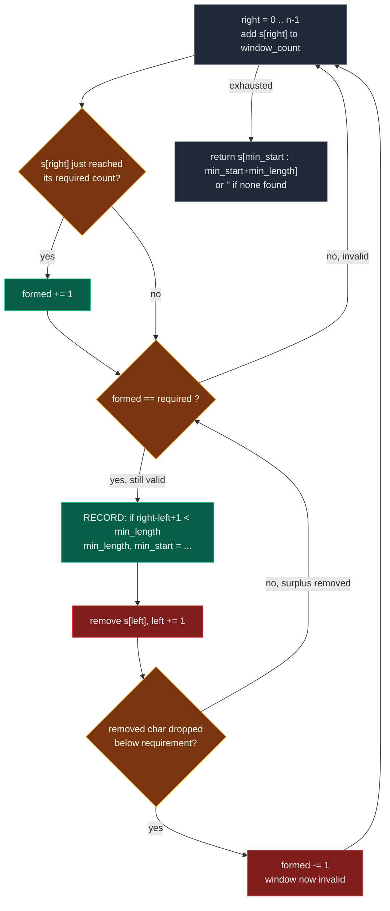

# 01. 76. Minimum Window Substring

| Difficulty | Pattern | Source | Time | Space |
|:---:|:---:|:---:|:---:|:---:|
| **Hard** | Minimum Window + Formed Counter | [76. Minimum Window Substring](https://leetcode.com/problems/minimum-window-substring/) | `O(n + m)` | `O(n + m)` |

## 1. Problem Statement

Given two strings `s` and `t` of lengths `n` and `m` respectively, return *the **minimum window substring** of* `s` *such that every character in* `t` *(**including duplicates**) is included in the window*. If there is no such substring, return *the empty string* `""`.

The testcases will be generated such that the answer is **unique**.

### Examples

```text
Input:  s = "ADOBECODEBANC", t = "ABC"
Output: "BANC"
Explanation: The minimum window substring "BANC" includes 'A', 'B', and 'C' from string t.
```

```text
Input:  s = "a", t = "a"
Output: "a"
Explanation: The entire string s is the minimum window.
```

```text
Input:  s = "a", t = "aa"
Output: ""
Explanation: Both 'a's from t must be included in the window.
             Since the largest window of s only has one 'a', return empty string.
```

### Constraints

- `m == s.length`
- `n == t.length`
- `1 <= m, n <= 10^5`
- `s` and `t` consist of uppercase and lowercase English letters

## 2. Core Theory

This is one of the most important and slightly tricky **variable-size sliding window** problems, and it is the hardest in the topic. Three separate ideas have to click at once: what "contains `t`" actually means, how to test it cheaply, and which loop the answer gets recorded in.

### Idea 1: containment means counts, not membership

The single most common way to get this problem wrong is to treat `t` as a *set* of characters. It is not. If `t` has duplicate characters, the window must include those duplicates too.

```text
t = "AABC"

the window must contain:
    A -> 2 times
    B -> 1 time
    C -> 1 time

a window with only one 'A' is NOT valid
```

So a set is not enough — we must use a **frequency count**. The test for a window is not "does every character of `t` appear?" but "does every character of `t` appear *at least as many times as `t` needs it*?"

```text
window is valid  ⟺  for every character c in t:
                        window_count[c] >= target_count[c]
```

Note `>=`, not `==`. Extra copies are fine. `"BANC"` is a valid window for `t = "ABC"` even though it carries an `N` that `t` never asked for, and `"AABBC"` is valid for `t = "AABC"` despite having a spare `B`.

### Idea 2: the `formed` counter replaces whole-map comparison

The naive way to test validity is to loop over `target_count` and compare each entry — but checking all characters again and again is expensive. Doing that at every step costs `O(m)` per index and drags the whole solution to `O(n * m)`.

Instead, maintain two integers:

```text
required = number of unique characters needed from t
formed   = number of unique characters currently satisfied in window
```

A character is **satisfied** when `window_count[char] == target_count[char]`, and the window is valid when `formed == required`. That turns an `O(m)` scan into an `O(1)` integer comparison.

```text
t = "ABC"
target_count = {A:1, B:1, C:1}
required = 3

window has  A->1, B->1, C->0    ->  formed = 2   (A and B satisfied)
window has  A->1, B->1, C->1    ->  formed = 3   ->  formed == required, VALID
```

**The `==` in the update is the whole trick.** When adding a character, `formed` increments only on the exact step where its count *reaches* the requirement:

```python
window_count[right_char] += 1
if right_char in target_count and window_count[right_char] == target_count[right_char]:
    formed += 1
```

Going from `1` to `2` copies of a character that needs only `1` does not fire (`2 != 1`), so `formed` is never double-counted. Symmetrically on removal, `formed` decrements only when the count *drops below* the requirement:

```python
window_count[left_char] -= 1
if left_char in target_count and window_count[left_char] < target_count[left_char]:
    formed -= 1
```

Dropping a surplus copy leaves the character still satisfied and `formed` untouched. The two guards are exact mirrors, and together they keep `formed` correct with `O(1)` work per pointer move.

### Idea 3: expand until valid, then shrink *while* valid — and record inside the shrink

Every other sliding-window problem in this topic expands and shrinks the same way. This one inverts the shrink condition, and that inversion is the defining feature of a **minimum** window problem.

```text
Longest window:
Usually expand more and shrink when INVALID.

Minimum window:
Expand until VALID, then shrink while VALID.
```

Why: a valid window can often be trimmed and stay valid. The minimum is found at the *last* moment before validity breaks, so the loop must keep shrinking while `formed == required`, and the answer must be recorded **inside** that loop, before each removal.



Trace the cycle on `s = "ADOBECODEBANC"`, `t = "ABC"`:

```text
index:  0  1  2  3  4  5  6  7  8  9 10 11 12
char:   A  D  O  B  E  C  O  D  E  B  A  N  C

EXPAND  [A D O B E C]              formed 3 == required  VALID   len 6  best "ADOBEC"
SHRINK   drop 'A' -> A count 0 < 1, formed 2             INVALID
EXPAND   A[D O B E C O D E B A]    formed 3              VALID   len 10 (worse)
SHRINK   drop 'D','O','B'? -> "ECODEBA" ... trims to
         A D O B[E C O D E B A]                          VALID   len 7 (worse)
         drop 'E' -> still valid   "CODEBA"              VALID   len 6 (tie, not better)
         drop 'C' -> C count 0 < 1, formed 2             INVALID
EXPAND   ...[B A N C]              formed 3              VALID   len 4  best "BANC"
SHRINK   drop 'B' -> B count 0 < 1, formed 2             INVALID

answer = "BANC"
```

Each valid window is trimmed as far as it will go, and only then does `right` move again. The best length ever recorded is the answer.

### Why the answer must be recorded inside the shrink loop

Consider `s = "AAABC"`, `t = "ABC"`. When `right` reaches `C`, the window is `"AAABC"` — valid, length `5`. But the minimum valid window is `"ABC"`, length `3`. We need to remove the extra `A`s one by one, and that requires `while`. If we use only `if`, we may stop at `"AABC"` or a larger window and miss the minimum.

```text
s = "AAABC",  t = "ABC"

while-shrink:  "AAABC"(5) -> "AABC"(4) -> "ABC"(3) -> drop 'A', invalid
               best recorded = 3   ✓

if-shrink:     "AAABC"(5) -> "AABC"(4), loop exits
               best recorded = 4   ✗  WRONG
```

Recording *outside* the loop is the same bug in different clothing: by the time the loop exits, the window is invalid, so its length is meaningless.

### Two maps, or one map plus a counter?

The two-map formulation (`target_count` and `window_count` plus `formed`/`required`) is the one written out above and is the clearest to explain. There is an equivalent single-map formulation that the author uses in the handwritten pages, and it is worth knowing because it is shorter to code.

**The single-map trick.** Seed one map with the requirements of `t`. Then treat a *positive* value as "still needed" and let values go negative for surplus:

```text
hash[c] > 0   ->  c is still needed
hash[c] <= 0  ->  c is fully supplied (0 exactly), or surplus (negative)
```

Expanding: if `hash[s[right]] > 0` the incoming character satisfied a genuine need, so increment a `cnt` of satisfied *character slots*; then decrement `hash[s[right]]` unconditionally. The window is valid when `cnt == len(t)`.

Shrinking: increment `hash[s[left]]` back; if it becomes `> 0` a genuine need has reopened, so decrement `cnt`.

Note the subtle difference: here `cnt` counts **total characters matched** (so it reaches `m = len(t)`), whereas `formed` counts **distinct characters satisfied** (so it reaches `required = len(target_count)`). Both are correct; they just measure different things.

| Feature | Two maps + `formed` | One map + `cnt` |
|:---|:---|:---|
| State | `target_count`, `window_count`, `formed`, `required` | `hash`, `cnt` |
| Validity test | `formed == required` | `cnt == len(t)` |
| Counter measures | distinct characters satisfied | total character slots matched |
| Duplicates in `t` | handled by `==` on counts | handled by `> 0` sign test |
| Readability | explicit, easy to explain | compact, easy to mis-derive |
| Time | `O(n + m)` | `O(n + m)` |

Lead with the two-map version in an interview — the invariants are easier to state out loud.

### Complexity reasoning

Each character enters the window once via `right` and leaves once via `left`, so pointer movement is `O(n)` total; building `target_count` is `O(m)`. That gives `O(n + m)` time. Space is `O(n + m)` in the general case for the two maps, or `O(unique characters in s and t)` practically — and if the character set is fixed ASCII, `O(1)`.

## 3. Edge Cases

| Case | Input | Expected | Why it matters |
|:---|:---|:---:|:---|
| `t` longer than `s` | `s = "A"`, `t = "AA"` | `""` | Impossible by length alone; the early guard avoids wasted work |
| Duplicate chars in `t` | `s = "a"`, `t = "aa"` | `""` | Set-based membership wrongly returns `"a"`; counts are mandatory |
| No valid window | `s = "ABC"`, `t = "D"` | `""` | `formed` never reaches `required`; `min_length` stays infinite |
| Whole string is the answer | `s = "ABC"`, `t = "ABC"` | `"ABC"` | Window must be allowed to span everything; no shrink applies |
| Single character match | `s = "a"`, `t = "a"` | `"a"` | Smallest possible valid window |
| Surplus must be trimmed | `s = "AAABC"`, `t = "ABC"` | `"ABC"` | `if` instead of `while` returns `"AABC"` — the classic bug |
| Duplicates needed, out of order | `s = "ABAACBAB"`, `t = "AAB"` | `"ABA"` | Answer need not contain `t` in order, only in count |
| Extra characters allowed | `s = "AAABBC"`, `t = "AABC"` | `"AABBC"` | An unneeded `B` inside the window is fine |
| Answer at the very end | `s = "ADOBECODEBANC"`, `t = "ABC"` | `"BANC"` | Best window found last; must not stop early |
| Case sensitivity | `s = "aA"`, `t = "A"` | `"A"` | Upper and lower case are distinct characters |

## 4. Brute Force: Check Every Substring

### Intuition

Try every possible substring of `s`. For each substring, check whether it contains all characters of `t` with the required frequency. If yes, update the minimum substring.

### Approach

1. If `len(t) > len(s)`, return `""` immediately.
2. Build `target_count` from `t`.
3. For every `start`, reset `window_count` and extend `end` forward, adding `s[end]`.
4. Check every character of `target_count` against `window_count`; if all are satisfied the substring is valid.
5. If valid and shorter than the best so far, record it — then `break`, since extending this `start` only makes it longer.

### Dry Run

```text
s = "ADOBECODEBANC",  t = "ABC"

start = 0:  extend until "ADOBEC" is valid (end = 5)  -> length 6, record "ADOBEC", break
start = 1:  "DOBECODEBA" valid at end = 10            -> length 10, worse, break
start = 2:  "OBECODEBA"  valid at end = 10            -> length 9,  worse, break
start = 3:  "BECODEBA"   valid at end = 10            -> length 8,  worse, break
...
start = 9:  "BANC"       valid at end = 12            -> length 4,  record "BANC", break
start = 10: "ANC"        never gets a 'B'             -> no valid window
...
answer = "BANC"
```

Every `start` re-scans the whole tail to its right, throwing away everything the previous `start` already learned. That is the waste the sliding window removes.

### Code

```python
# Define the class solution
class Solution:

    # Define the method
    def minWindow(self, s: str, t: str) -> str:

        # If t is longer than s, no valid window is possible.
        if len(t) > len(s):
            return ""

        # Build frequency map of target string t.
        target_count = {}

        # Count every character in t.
        for char in t: target_count[char] = target_count.get(char, 0) + 1

        # Store the minimum window length.
        min_length = float("inf")

        # Store the answer substring.
        answer = ""

        # Try every possible starting index.
        for start in range(len(s)):

            # Store frequency of current substring.
            window_count = {}

            # Try every possible ending index.
            for end in range(start, len(s)):

                # Add current character to current window frequency.
                window_count[s[end]] = window_count.get(s[end], 0) + 1

                # Assume current window is valid.
                is_valid = True

                # Check if current window contains all required characters.
                for char in target_count:

                    # If current window does not have enough of this character.
                    if window_count.get(char, 0) < target_count[char]:

                        # Mark current window invalid.
                        is_valid = False

                        # Stop checking further.
                        break

                # If current substring is valid.
                if is_valid:

                    # Calculate current substring length.
                    current_length = end - start + 1

                    # If current substring is smaller than previous answer.
                    if current_length < min_length:

                        # Update minimum length.
                        min_length = current_length

                        # Store current answer.
                        answer = s[start:end + 1]

                    # Since we need minimum for this start,
                    # no need to extend further.
                    break

        # Return final answer.
        return answer
```

### Complexity

| Measure | Complexity | Why |
|:---|:---:|:---|
| **Time** | `O(n^2 * m)` | `O(n^2)` substrings, and each validity check scans up to `m` unique characters of `t` |
| **Space** | `O(m)` | The two frequency maps, bounded by the distinct characters of `t` |

Here `n = len(s)` and `m = number of unique characters in t`. This is too slow for large inputs.

## 5. Optimal Solution: Sliding Window with `formed` and `required`

### Core Intuition

We need a window in `s` that satisfies all character requirements of `t`. We maintain two hashmaps:

```text
target_count -> required frequency from t
window_count -> current frequency inside window
```

But checking all characters again and again is expensive. So we also maintain:

```text
required = number of unique characters needed from t
formed   = number of unique characters currently satisfied in window
```

A character is satisfied when `window_count[char] == target_count[char]`, and the window is valid when `formed == required`.

### Sliding Window Logic

We use two pointers, `left` and `right`. First, expand using `right`. For every `s[right]`:

```text
Add it to window_count
If it satisfies required count, increase formed
```

Once `formed == required` the window is valid. Now shrink from `left` while it remains valid:

```text
update answer
remove s[left]
if removing breaks requirement, decrease formed
move left
```

This gives the minimum window.

### Approach

1. Guard: if either string is empty, or `len(t) > len(s)`, return `""`.
2. Build `target_count` from `t`; set `required = len(target_count)`.
3. Initialise `window_count = {}`, `formed = 0`, `left = 0`, `min_length = inf`, `min_start = 0`.
4. For each `right`: add `s[right]`; if it exactly reaches its target, `formed += 1`.
5. **While** `formed == required`: record the window if shorter than the best; remove `s[left]`; if that drops it below its target, `formed -= 1`; advance `left`.
6. Return `""` if `min_length` is still infinite, else `s[min_start : min_start + min_length]`.

### Dry Run

```text
s = "ADOBECODEBANC"
t = "ABC"

target_count = {A:1, B:1, C:1}
required = 3
formed = 0
```

Expand window — we move `right`:

```text
right=0  char 'A'  window "A"       formed=1   (A requirement satisfied)
right=1  char 'D'  window "AD"      formed=1   (D is not required)
right=2  char 'O'  window "ADO"     formed=1   (O is not required)
right=3  char 'B'  window "ADOB"    formed=2   (B requirement satisfied)
right=4  char 'E'  window "ADOBE"   formed=2
right=5  char 'C'  window "ADOBEC"  formed=3   formed == required -> VALID
```

Current valid window is `"ADOBEC"`, length `6`, so the answer becomes `"ADOBEC"`.

Now shrink from left:

```text
record length 6, min_start = 0
remove 'A'  ->  window "DOBEC",  A count 0 < 1,  formed=2   INVALID
left = 1
```

Window becomes invalid, so we continue expanding `right`.

```text
right=6  'O'  window "DOBECO"                      formed=2
right=7  'D'  window "DOBECOD"                     formed=2
right=8  'E'  window "DOBECODE"                    formed=2
right=9  'B'  window "DOBECODEB"                   formed=2   (surplus B, no change)
right=10 'A'  window "DOBECODEBA"  formed=3        VALID      length 10, worse
         shrink: drop 'D','O' -> "BECODEBA"        still valid, length 8, worse
                 drop 'B' -> B count 1 >= 1        still valid  "ECODEBA" length 7
                 drop 'E' -> not required          still valid  "CODEBA"  length 6, tie
                 drop 'C' -> C count 0 < 1, formed=2  INVALID,  left = 11? no: left = 6
```

Eventually, when `right` reaches index `10` a valid window `"CODEBA"` appears, and shrinking improves it. The best so far is still length `6`.

Final best — when `right` reaches index `12`:

```text
right=11 'N'  window "...N"                        formed=2
right=12 'C'  window "BANC"       formed=3         VALID
```

We get valid window `"BANC"`. It contains:

```text
B -> 1
A -> 1
N -> extra
C -> 1
```

Length `4`. This is minimum.

```text
record length 4, min_start = 9
remove 'B'  ->  B count 0 < 1,  formed=2   INVALID
```

Final answer:

```text
"BANC"
```

### Another Example with Duplicates

```text
s = "AAABBC"
t = "AABC"

target_count = {A:2, B:1, C:1}
required = 3
```

Valid windows:

```text
"AAABBC"
"AABBC"
```

Minimum is `"AABBC"`, because it contains:

```text
A -> 2
B -> 2
C -> 1
```

Extra `B` is allowed. Note that `"ABBC"` is *not* valid — it has only one `A`, and `t` needs two. This is exactly the case a set-based solution gets wrong.

### The Author's Pseudocode

The handwritten pages use the single-map `cnt` formulation:

```text
func(s, t)
{
    n = s.size,  m = t.size
    hash[256] = {0};   l = 0,  r = 0,  minLen = 10^9
    for (i = 0 -> m)                       // O(m)
        hash[ t[i] ]++;
    sIndex = -1,  cnt = 0

    while (r < s.size())                   // O(n)
    {
        if ( hash[ s[r] ] > 0 )  cnt = cnt + 1;
        hash[ s[r] ]--;

        while ( cnt == m )                 // O(n)
        {
            if ( r - l + 1 < minLen )
            {
                minLen = r - l + 1;
                sIndex = l;
            }

            hash[ s[l] ]++;
            if ( hash[ s[l] ] > 0 )  cnt = cnt - 1;
            l = l + 1;
        }

        r = r + 1;
    }

    return sIndex == -1 ? "" : s.substr(sIndex, minLen);
}

TC -> O(2N) + O(M)
SC -> O(256)
```

Three details make this version work. `hash` is seeded with `t`'s requirements, so `hash[c] > 0` means "still needed". On expansion the `> 0` test fires *before* the decrement, so only characters that filled a genuine need bump `cnt`; surplus characters push `hash` negative and are ignored. On shrink the increment happens *before* the `> 0` test, so `cnt` drops only when the removal reopens a real need. And `cnt` is compared against `m = len(t)` — total characters, not distinct ones — because it counts matched slots.

The `sIndex = -1` sentinel is how "no window found" is represented, playing the same role as `min_length == inf` in the Python version.

### Code

```python
# Define the class solution
class Solution:

    # Define the method
    def minWindow(self, s: str, t: str) -> str:

        # If either string is empty, no valid window exists.
        if not s or not t:
            return ""

        # If target string is longer than source string, impossible.
        if len(t) > len(s):
            return ""

        # Store frequency requirement of every character in t.
        target_count = {}

        # Build target frequency map.
        for char in t:

            # Count each required character.
            target_count[char] = target_count.get(char, 0) + 1

        # Store how many unique characters need to be satisfied.
        required = len(target_count)

        # Store frequency of characters inside current window.
        window_count = {}

        # Store how many required characters are currently satisfied.
        formed = 0

        # Left pointer of sliding window.
        left = 0

        # Store minimum window length found so far.
        min_length = float("inf")

        # Store start index of the best window.
        min_start = 0

        # Move right pointer through the source string.
        for right in range(len(s)):

            # Store current character.
            right_char = s[right]

            # Add current character to window frequency.
            window_count[right_char] = window_count.get(right_char, 0) + 1

            # If current character is required and its frequency is exactly satisfied.
            if right_char in target_count and window_count[right_char] == target_count[right_char]:

                # Increase formed count.
                formed += 1

            # While all required characters are satisfied,
            # try shrinking window from the left.
            while formed == required:

                # Calculate current valid window length.
                current_length = right - left + 1

                # If current valid window is smaller than previous best.
                if current_length < min_length:

                    # Update minimum length.
                    min_length = current_length

                    # Store start index of best window.
                    min_start = left

                # Store leftmost character before removing it.
                left_char = s[left]

                # Remove leftmost character from current window.
                window_count[left_char] -= 1

                # If removed character was required and now its frequency is below requirement,
                # window is no longer valid.
                if left_char in target_count and window_count[left_char] < target_count[left_char]:

                    # Decrease formed because one required character is no longer satisfied.
                    formed -= 1

                # Move left pointer forward.
                left += 1

        # If no valid window was found, return empty string.
        if min_length == float("inf"):

            # Return empty string.
            return ""

        # Return the minimum window substring.
        return s[min_start:min_start + min_length]
```

### Complexity

| Measure | Complexity | Why |
|:---|:---:|:---|
| **Time** | `O(n + m)` | Each character enters the window once using `right` and leaves once using `left`; building `target_count` is `O(m)` |
| **Space** | `O(n + m)` | The two frequency maps; practically `O(unique characters in s and t)`, and `O(1)` for a fixed ASCII charset |

## 6. Can We Use `if` Instead of `while` Here?

**No.**

For this problem, we need the **minimum** valid window. Once the window becomes valid, we must shrink as much as possible. So we need:

```python
while formed == required:
```

Not:

```python
if formed == required:
```

### Why

Because one valid window may be shrinkable multiple times.

```text
s = "AAABC"
t = "ABC"
```

When `right` reaches `C`, the window is `"AAABC"`. This is valid. But the minimum valid window is `"ABC"`. We need to remove the extra `A`s one by one. That requires `while`. If we use only `if`, we may stop at `"AABC"` or a larger window and miss the minimum.

### Important Interview Point

This problem is different from many longest-window problems. For longest-window problems, sometimes lazy shrinking with `if` works — 424 Longest Repeating Character Replacement is the canonical example. But here we need the **minimum window**, so we must keep shrinking while valid.

```text
Longest window:
Usually expand more and shrink when invalid.

Minimum window:
Expand until valid, then shrink while valid.
```

## 7. Pattern Summary

```text
Problem type:
Variable-size sliding window + minimum window

Window meaning:
Current substring of s

Valid condition:
Window contains all required characters of t with correct frequency

Expand condition:
Move right until formed == required

Shrink condition:
While formed == required

Answer update:
Inside while loop before removing s[left]

Data structures:
target_count hashmap
window_count hashmap

Important variables:
required = unique characters needed from t
formed = unique characters currently satisfied
```

## 8. Common Mistakes

| Mistake | Why it breaks | Fix |
|:---|:---|:---|
| Using set membership instead of counts | Duplicates in `t` are mishandled; `s = "a"`, `t = "aa"` wrongly returns `"a"` | Build a frequency map and compare counts, not membership |
| Using `if formed == required` instead of `while` | Stops shrinking too early; `s = "AAABC"`, `t = "ABC"` returns `"AABC"` instead of `"ABC"` | `while formed == required:` — shrink as far as validity allows |
| Recording the answer outside the shrink loop | By the time the loop exits the window is invalid, so its length is meaningless | Record at the top of the `while` body, before removing `s[left]` |
| Incrementing `formed` with `>=` instead of `==` | A surplus copy re-fires the increment, so `formed` overshoots `required` and windows are judged valid too early | `if window_count[c] == target_count[c]: formed += 1` |
| Decrementing `formed` with `<=` instead of `<` | Removing a surplus copy wrongly invalidates the window and the true minimum is skipped | `if window_count[c] < target_count[c]: formed -= 1` |
| Comparing the whole `window_count` map to `target_count` each step | Correct but `O(m)` per index, making the solution `O(n * m)` | Maintain the `formed` / `required` counters in `O(1)` |
| Returning `s[min_start:min_length]` | Slices from `min_start` to absolute index `min_length`, not a window of that length | `s[min_start:min_start + min_length]` |
| Forgetting the "no window found" case | `min_length` stays `inf` and the slice misbehaves or throws | Guard on `min_length == float("inf")` and return `""` |

## 9. Interview Follow-ups

**Q: Why does a `formed`/`have` counter beat comparing the two maps each step?**

A: Comparing maps costs `O(m)` per pointer move, where `m` is the number of distinct characters in `t`, so the solution degrades to `O(n * m)`. The counter turns that into an `O(1)` integer comparison, because validity changes by at most one character-requirement per pointer move. The exact `==` and `<` guards are what make the incremental update sound: `formed` changes precisely on the boundary crossings, never on surplus.

**Q: How do you handle duplicate characters in `t` correctly?**

A: By storing counts rather than membership. `target_count["A"] = 2` means the window needs two `A`s, and `formed` counts `A` as satisfied only when `window_count["A"]` reaches `2`. Surplus is harmless: a third `A` does not re-fire the increment (`3 != 2`), and removing it does not fire the decrement (`2 < 2` is false). That is the whole mechanism, and it is why `s = "a"`, `t = "aa"` correctly returns `""`.

**Q: What if the charset were full Unicode instead of English letters?**

A: The algorithm is unchanged — a dictionary keyed by character works for any alphabet, and the time stays `O(n + m)`. What changes is the space bound: a fixed `int[128]` or `int[256]` array is no longer valid, and the bound becomes a genuine `O(min(n, charset) + m)`. If you care about user-perceived characters rather than code points you would also need to iterate grapheme clusters, since a single emoji can span several code points, and "containing" it means containing the whole cluster.

**Q: Return *all* minimum windows, not just one.**

A: Keep `min_length` as now, but collect starts in a list instead of a single `min_start`. When a strictly shorter window is found, clear the list and start it with this `left`; when an equal-length window is found, append `left`. At the end map each start to `s[start:start + min_length]`. Still `O(n + m)` time, with output-proportional extra space. Note LeetCode guarantees uniqueness, so this is a genuine extension rather than a restatement.

**Q: What changes if you need the *maximum* window containing `t`?**

A: The problem becomes trivial rather than harder — the largest window containing all of `t` is bounded only by the ends of `s`, so it is the span from the first to the last character needed, and typically the whole string whenever any valid window exists. The interesting direction is always the minimum, which is why the shrink-while-valid structure is the point of this problem.

**Q: Could you solve it with a different data structure, like a sorted list of positions?**

A: Yes, though not better. You could store, for each required character, the sorted list of its positions in `s`, then for each candidate window start binary-search the earliest position that supplies each requirement and take the maximum — `O(n * m * log n)`. It is strictly worse than the two-pointer sweep, but it generalizes nicely to offline queries where `t` changes and `s` is fixed.

## 10. Interview Explanation

> I use a variable-size sliding window. First, I build a frequency map for `t`. Then I expand the window with the right pointer and maintain the frequency of characters in the current window. I also maintain `formed`, which tells how many required characters have reached their needed frequency. When `formed == required`, the window contains all characters of `t`, so I try shrinking from the left to minimize it. Before removing from the left, I update the answer. If removing a required character breaks its needed frequency, I decrease `formed` and stop shrinking.

## 11. Verify

```python
from typing import Dict


def min_window(s: str, t: str) -> str:
    if not s or not t:
        return ""
    if len(t) > len(s):
        return ""

    target_count: Dict[str, int] = {}
    for char in t:
        target_count[char] = target_count.get(char, 0) + 1

    required = len(target_count)
    window_count: Dict[str, int] = {}
    formed = 0
    left = 0
    min_length = float("inf")
    min_start = 0

    for right in range(len(s)):
        right_char = s[right]
        window_count[right_char] = window_count.get(right_char, 0) + 1
        # Exactly == so a surplus copy never re-fires the increment.
        if right_char in target_count and window_count[right_char] == target_count[right_char]:
            formed += 1

        # Shrink WHILE valid, recording the answer INSIDE the loop.
        while formed == required:
            current_length = right - left + 1
            if current_length < min_length:
                min_length = current_length
                min_start = left

            left_char = s[left]
            window_count[left_char] -= 1
            # Strict < so removing a surplus copy never invalidates the window.
            if left_char in target_count and window_count[left_char] < target_count[left_char]:
                formed -= 1
            left += 1

    if min_length == float("inf"):
        return ""
    return s[min_start:min_start + min_length]


def single_map_version(s: str, t: str) -> str:
    """The author's hash + cnt formulation."""
    if not s or not t or len(t) > len(s):
        return ""
    hash_map: Dict[str, int] = {}
    for char in t:
        hash_map[char] = hash_map.get(char, 0) + 1

    left = 0
    cnt = 0
    min_length = float("inf")
    s_index = -1

    for right in range(len(s)):
        if hash_map.get(s[right], 0) > 0:
            cnt += 1
        hash_map[s[right]] = hash_map.get(s[right], 0) - 1

        while cnt == len(t):
            if right - left + 1 < min_length:
                min_length = right - left + 1
                s_index = left
            hash_map[s[left]] += 1
            if hash_map[s[left]] > 0:
                cnt -= 1
            left += 1

    return "" if s_index == -1 else s[s_index:s_index + min_length]


def brute_force(s: str, t: str) -> str:
    """Reference: shortest valid substring, earliest on ties."""
    from collections import Counter
    need = Counter(t)
    best = ""
    for start in range(len(s)):
        window = Counter()
        for end in range(start, len(s)):
            window[s[end]] += 1
            if all(window[c] >= need[c] for c in need):
                candidate = s[start:end + 1]
                if best == "" or len(candidate) < len(best):
                    best = candidate
                break
    return best


def is_valid_window(window: str, t: str) -> bool:
    from collections import Counter
    wc, need = Counter(window), Counter(t)
    return all(wc[c] >= need[c] for c in need)


# LeetCode examples
assert min_window("ADOBECODEBANC", "ABC") == "BANC"
assert min_window("a", "a") == "a"
assert min_window("a", "aa") == ""

# Edge case: t longer than s
assert min_window("A", "AA") == ""
assert min_window("AB", "ABC") == ""

# Edge case: no valid window at all
assert min_window("ABC", "D") == ""
assert min_window("XYZ", "A") == ""

# Edge case: the whole string is the answer
assert min_window("ABC", "ABC") == "ABC"

# Edge case: surplus characters must be trimmed (the if-vs-while bug)
assert min_window("AAABC", "ABC") == "ABC"

# Edge case: duplicates in t, answer out of order
# Both "ABA" and "BAA" are valid length-3 windows here; the sweep finds the
# earliest one. LeetCode guarantees a unique answer, but hand-made inputs may not.
assert min_window("ABAACBAB", "AAB") == "ABA"
assert is_valid_window("BAA", "AAB") and len("BAA") == 3

# Edge case: extra unneeded characters inside the window are allowed
assert min_window("AAABBC", "AABC") == "AABBC"

# Edge case: case sensitivity -- upper and lower are distinct
assert min_window("aA", "A") == "A"
assert min_window("aA", "a") == "a"

# Edge case: empty inputs are handled without crashing
assert min_window("", "A") == ""
assert min_window("A", "") == ""

# The single-map variant must agree on every case above
for text, target in [
    ("ADOBECODEBANC", "ABC"), ("a", "a"), ("a", "aa"), ("A", "AA"),
    ("ABC", "D"), ("ABC", "ABC"), ("AAABC", "ABC"), ("ABAACBAB", "AAB"),
    ("AAABBC", "AABC"), ("aA", "A"),
]:
    assert single_map_version(text, target) == min_window(text, target), (text, target)

# Exhaustive cross-check against brute force on a small alphabet.
# This is what catches an off-by-one in the ==/< guards.
from itertools import product

for s_len in range(1, 8):
    for s_tup in product("ab", repeat=s_len):
        text = "".join(s_tup)
        for t_len in range(1, 4):
            for t_tup in product("ab", repeat=t_len):
                target = "".join(t_tup)
                expected_len = len(brute_force(text, target))
                got = min_window(text, target)
                got_single = single_map_version(text, target)
                assert len(got) == expected_len, (text, target, got)
                assert len(got_single) == expected_len, (text, target, got_single)
                if got:
                    assert is_valid_window(got, target), (text, target, got)
                    assert is_valid_window(got_single, target), (text, target, got_single)

# Three-letter alphabet, exhaustive over shorter strings
for s_len in range(1, 6):
    for s_tup in product("abc", repeat=s_len):
        text = "".join(s_tup)
        for t_len in range(1, 4):
            for t_tup in product("abc", repeat=t_len):
                target = "".join(t_tup)
                expected_len = len(brute_force(text, target))
                got = min_window(text, target)
                assert len(got) == expected_len, (text, target, got)
                if got:
                    assert is_valid_window(got, target), (text, target, got)

# Randomised cross-check on longer, skewed inputs
import random

random.seed(19)
for _ in range(3000):
    n = random.randint(0, 30)
    m = random.randint(0, 5)
    alphabet = random.choice(["ab", "abc", "aab", "abcde"])
    text = "".join(random.choice(alphabet) for _ in range(n))
    target = "".join(random.choice(alphabet) for _ in range(m))
    if not target:
        assert min_window(text, target) == ""
        continue
    expected_len = len(brute_force(text, target))
    got = min_window(text, target)
    got_single = single_map_version(text, target)
    assert len(got) == expected_len, (text, target, got)
    assert len(got_single) == expected_len, (text, target, got_single)
    if got:
        assert is_valid_window(got, target), (text, target, got)
        assert is_valid_window(got_single, target), (text, target, got_single)

# Structural property: any returned window is valid and is a real substring
random.seed(20)
for _ in range(500):
    text = "".join(random.choice("abcd") for _ in range(random.randint(1, 40)))
    target = "".join(random.choice("abcd") for _ in range(random.randint(1, 5)))
    got = min_window(text, target)
    if got:
        assert got in text, (text, target, got)
        assert is_valid_window(got, target), (text, target, got)
        # No shorter valid window exists anywhere in text.
        for length in range(1, len(got)):
            for start in range(len(text) - length + 1):
                assert not is_valid_window(text[start:start + length], target), (text, target)

# Performance sanity at the constraint bound
big = "ADOBECODEBANC" * 7000
assert min_window(big, "ABC") == "BANC"
# 'D' is present, so a window exists and spans a repeat boundary.
assert min_window(big, "ABCD") == "CADOB"
# 'Z' never occurs, so no window exists.
assert min_window(big, "ABCZ") == ""

print("All tests passed")
```
