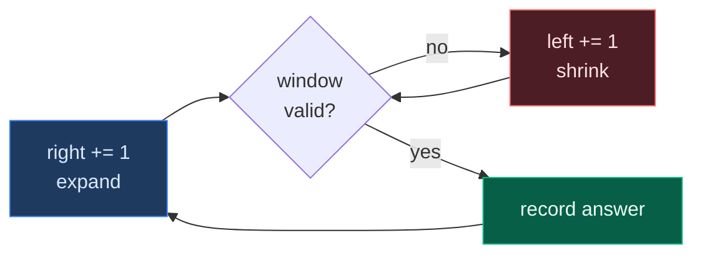
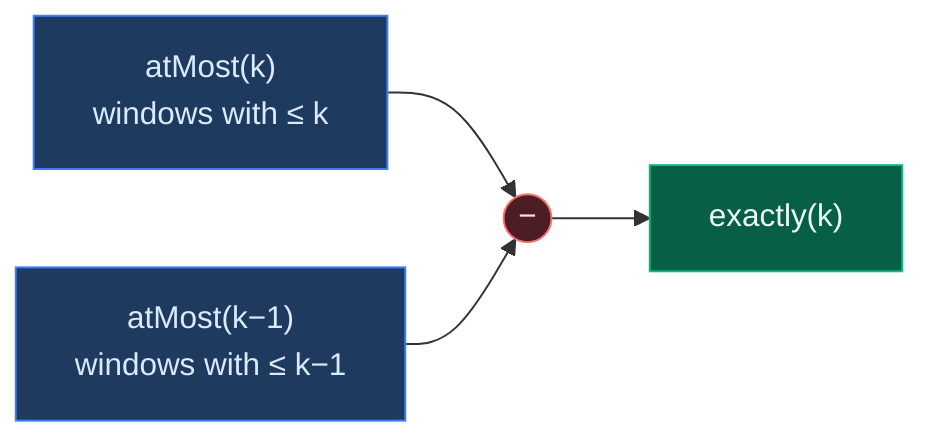

# 04. Sliding Window

A sliding window turns an `O(n^2)` scan over every subarray into a single `O(n)` pass. Two pointers bound a region; the region grows on the right and shrinks on the left, and no element is ever re-examined from scratch.

This page teaches the topic from zero: the two window shapes, the universal skeleton every problem specialises, why the technique is only valid under a monotonicity condition, and the counting trick that unlocks the "exactly k" family.

## Contents

1. [The Core Idea](#1-the-core-idea)
2. [Fixed-Size Windows](#2-fixed-size-windows)
3. [Variable-Size Windows](#3-variable-size-windows)
4. [The Universal Skeleton](#4-the-universal-skeleton)
5. [Maximising vs Minimising](#5-maximising-vs-minimising)
6. [Counting Windows](#6-counting-windows)
7. [The At-Most Trick](#7-the-at-most-trick)
8. [When Sliding Window Is Valid](#8-when-sliding-window-is-valid)
9. [While vs If When Shrinking](#9-while-vs-if-when-shrinking)
10. [Common Traps](#10-common-traps)
11. [Pattern Recognition Cheat Sheet](#11-pattern-recognition-cheat-sheet)
12. [Problems](#12-problems)

## 1. The Core Idea

Brute force examines every subarray:

```python
for start in range(n):
    for end in range(start, n):
        check(nums[start:end + 1])      # O(n^2) windows
```

A sliding window keeps one region and *edits* it instead of rebuilding it:

```text
[ 1  3  2  5  4  1 ]
  └──────┘                 window [0..2]
     └──────┘              slide right: drop 1, add 5
```

Adding and removing one element each costs `O(1)`, and each pointer only moves forward, so total work is `O(n)`.



**The amortisation argument:** the inner shrink loop looks like it makes the algorithm quadratic. It does not. `left` only ever increases, and it can never pass `right`, so across the entire run the shrink loop executes at most `n` times *in total* — not `n` times per iteration. Both pointers together travel at most `2n` steps.

## 2. Fixed-Size Windows

The window size `k` never changes. Compute the first window, then slide: add the entering element, remove the leaving one.

```python
def max_sum_fixed(nums, k):
    window = sum(nums[:k])              # first window
    best = window
    for right in range(k, len(nums)):
        window += nums[right]           # element enters
        window -= nums[right - k]       # element leaves
        best = max(best, window)
    return best
```

```text
nums = [1, 3, 2, 5, 4],  k = 3

[1 3 2] 5  4     sum = 6
 1 [3 2 5] 4     sum = 10   (+5 -1)
 1  3 [2 5 4]    sum = 11   (+4 -3)
```

No inner loop at all. The window is always exactly `k` wide, so there is nothing to decide.

## 3. Variable-Size Windows

The window grows and shrinks to satisfy a condition. This is the far more common shape.

```python
def longest_valid(nums):
    left = 0
    best = 0
    for right in range(len(nums)):
        add(nums[right])                # expand
        while not valid():
            remove(nums[left])          # shrink
            left += 1
        best = max(best, right - left + 1)
    return best
```

Three decisions define any variable-window problem:

| Decision | Question |
|:---|:---|
| What state to carry | A sum, a count map, a set, a frequency table? |
| What "valid" means | `sum <= target`, `len(map) <= k`, no repeats? |
| When to record | After the shrink loop (maximise) or inside it (minimise)? |

## 4. The Universal Skeleton

Nearly every problem in this topic is this template with the three decisions filled in:

```python
def template(nums, limit):
    state = init()
    left = 0
    answer = init_answer()

    for right in range(len(nums)):
        state.add(nums[right])                 # 1. expand

        while violates(state, limit):          # 2. restore validity
            state.remove(nums[left])
            left += 1

        answer = update(answer, left, right)   # 3. record

    return answer
```

Learn this shape once. Then each problem is just: *what is `state`, what is `violates`, and where does `update` go?*

## 5. Maximising vs Minimising

The update position flips depending on the goal. This trips people up constantly.

| | Maximise (longest) | Minimise (shortest) |
|:---|:---|:---|
| Shrink while | window is **invalid** | window is **valid** |
| Record answer | **after** the shrink loop | **inside** the shrink loop |
| Reason | You want the biggest still-valid window | You want the smallest window that still qualifies |
| Example | 3, 424, 1004 | 209, 76 |

```python
# Maximise: shrink until valid, then measure
while len(window_map) > k:
    shrink()
best = max(best, right - left + 1)

# Minimise: measure at every valid size, then shrink further
while current_sum >= target:
    best = min(best, right - left + 1)      # record BEFORE removing
    shrink()
```

## 6. Counting Windows

A third shape: instead of a longest or shortest window, count how many subarrays qualify.

The identity that makes it work — when the window `[left..right]` is valid, it contributes exactly:

```text
right - left + 1
```

new subarrays, namely every subarray that **ends at `right`** and starts anywhere inside the window.

```text
window = [2, 5, 1]  with left=0, right=2

subarrays ending at right:
  [1]          start = 2
  [5, 1]       start = 1
  [2, 5, 1]    start = 0

count = 3 = right - left + 1
```

Because each `right` is processed once, summing these contributions counts every valid subarray exactly once, with no double-counting.

Used in: 713, 930, 1248, 992, 1358.

## 7. The At-Most Trick

The most important idea in the topic. To count subarrays with **exactly** k of something:

```text
exactly(k) = atMost(k) - atMost(k - 1)
```



**Why the detour is necessary.** "At most k" is monotonic: shrinking a window can only lower the count, so there is a clean shrink condition. "Exactly k" is not. Looking at the window alone, you cannot decide whether to shrink — shrinking might move you from k to k-1 and discard valid windows you still needed. Subtracting two at-most counts sidesteps that impossible decision entirely.

Both passes are `O(n)`, so the total stays `O(n)`.

```python
def exactly(nums, k):
    return at_most(nums, k) - at_most(nums, k - 1)
```

Guard the `k = 0` case: `at_most(nums, -1)` must return `0`.

## 8. When Sliding Window Is Valid

The technique requires **monotonicity**: growing the window must move the measured quantity in one direction, and shrinking must move it the other way.

| Situation | Valid? | Why |
|:---|:---:|:---|
| Sum, all values positive | Yes | Adding grows the sum, removing shrinks it |
| Sum, negatives present | **No** | Adding can *lower* the sum; shrink test breaks |
| Count of distinct characters | Yes | Removing can only reduce the distinct count |
| Product, all values >= 1 | Yes | Same monotonic argument as sum |
| Fixed-size window | Yes always | No shrink decision exists to get wrong |

```text
nums = [1, -1, 5, -2, 3],  target = 3

A later negative pulls an over-large sum back down,
so "sum > target, therefore shrink" is simply wrong.
```

**When negatives break it:** use prefix sums plus a hash map instead. That is exactly what [560. Subarray Sum Equals K](../01.%20Array/02.%20Medium/13.%20560.%20Subarray%20Sum%20Equals%20K.md) does, and it is why that problem lives in the Array topic rather than this one.

## 9. While vs If When Shrinking

A genuine subtlety worth knowing.

```python
while invalid():     # window always valid; true size each step
    shrink()

if invalid():        # window never shrinks, only slides
    shrink_once()
```

For **longest-window-length** problems, the `if` variant also works, and is slightly faster. The window never gets smaller than the best valid size found so far, so the final `right - left + 1` *is* the answer — you can return it directly without tracking a maximum.

The `if` form is **not** general. It fails whenever you need:

- the true window contents at each step (not just a length),
- a minimising window (209, 76),
- a count of valid subarrays.

Use `while` by default. Reach for `if` only on longest-length problems, and know why it is safe.

## 10. Common Traps

| Trap | Broken | Correct |
|:---|:---|:---|
| Stale zero-count key | `map[c] -= 1` only | Also `del map[c]` when it hits `0`, or `len(map)` lies |
| `left` moving backwards | `left = last[ch] + 1` | `left = max(left, last[ch] + 1)` |
| Recording at the wrong time | Measuring a still-invalid window | Maximise records after the shrink loop |
| Minimising with `if` | Finds *a* valid window, not the smallest | Minimising needs `while` |
| Returning the sentinel | `return best` when `best` is `inf` | Return `0` if never updated |
| Negative values in a sum window | Shrink condition is not monotonic | Prefix sums + hash map |
| Counting `1` per valid window | Undercounts badly | Add `right - left + 1` |
| `atMost(-1)` unguarded | Negative limit loops or miscounts | Return `0` immediately |

## 11. Pattern Recognition Cheat Sheet

| Signal in the problem | Shape | Cost |
|:---|:---|:---:|
| "subarray of size exactly k" | Fixed window | `O(n)` / `O(1)` |
| "longest substring with ..." | Variable, maximise | `O(n)` |
| "minimum size subarray such that ..." | Variable, minimise | `O(n)` |
| "at most k distinct / k zeroes / k flips" | Count map or counter | `O(n)` |
| "how many subarrays satisfy ..." | Counting window | `O(n)` |
| "**exactly** k ..." | At-most trick | `O(n)`, two passes |
| "take from both ends" | Complement — fix the middle window | `O(n)` |
| Values can be **negative** | Not a window; use prefix sums | `O(n)` |

## 12. Problems

### Introduction

| # | Note | What it covers |
|:---:|:---|:---|
| 1 | [Introduction to Sliding Window](01.%20Introduction/01.%20Introduction%20to%20Sliding%20Window.md) | The technique end to end, both window shapes, the skeleton |

### Basic

| # | Problem | Difficulty | Key Idea | Time | Space |
|:---:|:---|:---:|:---|:---:|:---:|
| 1 | [1423. Maximum Points You Can Obtain from Cards](02.%20Basic/01.%201423.%20Maximum%20Points%20You%20Can%20Obtain%20from%20Cards.md) | Medium | Taking from both ends = leaving a middle window | `O(n)` | `O(1)` |
| 2 | [3. Longest Substring Without Repeating Characters](02.%20Basic/02.%203.%20Longest%20Substring%20Without%20Repeating%20Characters.md) | Medium | Window holds distinct chars; jump `left` with `max` | `O(n)` | `O(min(n,charset))` |
| 3 | [1004. Max Consecutive Ones III](02.%20Basic/03.%201004.%20Max%20Consecutive%20Ones%20III.md) | Medium | "Flip k zeroes" = "window with at most k zeroes" | `O(n)` | `O(1)` |
| 4 | [904. Fruit Into Baskets](02.%20Basic/04.%20904.%20Fruit%20Into%20Baskets.md) | Medium | Story for "at most 2 distinct values" | `O(n)` | `O(1)` |
| 5 | [209. Minimum Size Subarray Sum](02.%20Basic/05.%20209.%20Minimum%20Size%20Subarray%20Sum.md) | Medium | Minimising: record inside the shrink loop | `O(n)` | `O(1)` |
| 6 | [713. Subarray Product Less Than K](02.%20Basic/06.%20713.%20Subarray%20Product%20Less%20Than%20K.md) | Medium | Valid window contributes `right - left + 1` | `O(n)` | `O(1)` |

### At Most

| # | Problem | Difficulty | Key Idea | Time | Space |
|:---:|:---|:---:|:---|:---:|:---:|
| 1 | [340. Longest Substring With At Most K Distinct Characters](03.%20At%20Most/01.%20340.%20Longest%20Substring%20With%20At%20Most%20K%20Distinct%20Characters.md) | Medium | The parent count-map template | `O(n)` | `O(k)` |
| 2 | [159. Longest Substring with At Most Two Distinct Characters](03.%20At%20Most/02.%20159.%20Longest%20Substring%20with%20At%20Most%20Two%20Distinct%20Characters.md) | Medium | The `k = 2` instance of 340 | `O(n)` | `O(1)` |

### At Most Trick

| # | Problem | Difficulty | Key Idea | Time | Space |
|:---:|:---|:---:|:---|:---:|:---:|
| 1 | [930. Binary Subarrays With Sum](04.%20At%20Most%20Trick/01.%20930.%20Binary%20Subarrays%20With%20Sum.md) | Medium | `exactly(goal) = atMost(goal) - atMost(goal-1)` | `O(n)` | `O(1)` |
| 2 | [1248. Count Number of Nice Subarrays](04.%20At%20Most%20Trick/02.%201248.%20Count%20Number%20of%20Nice%20Subarrays.md) | Medium | Map odd to 1, even to 0, and it becomes 930 | `O(n)` | `O(1)` |
| 3 | [992. Subarrays with K Different Integers](04.%20At%20Most%20Trick/03.%20992.%20Subarrays%20with%20K%20Different%20Integers.md) | Hard | Same trick over the count-map template | `O(n)` | `O(k)` |

### Repeating Characters

| # | Problem | Difficulty | Key Idea | Time | Space |
|:---:|:---|:---:|:---|:---:|:---:|
| 1 | [1358. Number of Substrings Containing All Three Characters](05.%20Repeating%20Characters/01.%201358.%20Number%20of%20Substrings%20Containing%20All%20Three%20Characters.md) | Medium | Add `min(last_a, last_b, last_c) + 1` per index | `O(n)` | `O(1)` |
| 2 | [424. Longest Repeating Character Replacement](05.%20Repeating%20Characters/02.%20424.%20Longest%20Repeating%20Character%20Replacement.md) | Medium | Valid when `size - max_freq <= k`; stale max is safe | `O(n)` | `O(1)` |

### Hard

| # | Problem | Difficulty | Key Idea | Time | Space |
|:---:|:---|:---:|:---|:---:|:---:|
| 1 | [76. Minimum Window Substring](06.%20Hard/01.%2076.%20Minimum%20Window%20Substring.md) | Hard | `have == required` counter; record inside the shrink | `O(n+m)` | `O(charset)` |

## Where This Leads

| Skill built here | Used later in |
|:---|:---|
| Expand / shrink invariants | Monotonic deque problems, two-pointer proofs |
| Count maps with zero-key deletion | Anagram and permutation matching |
| The at-most trick | Any "exactly k" counting problem |
| Amortised pointer analysis | Proving linear time on nested-looking loops |
| Knowing when monotonicity fails | Choosing prefix sums over a window |
