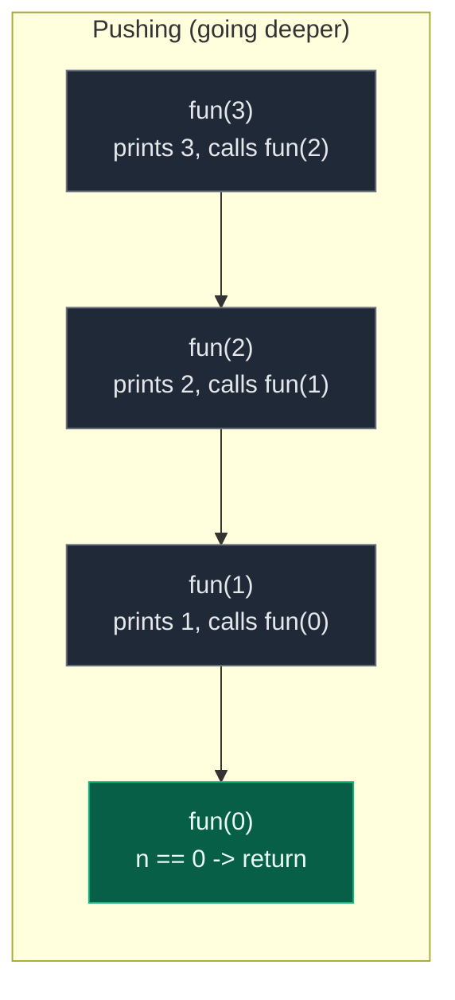
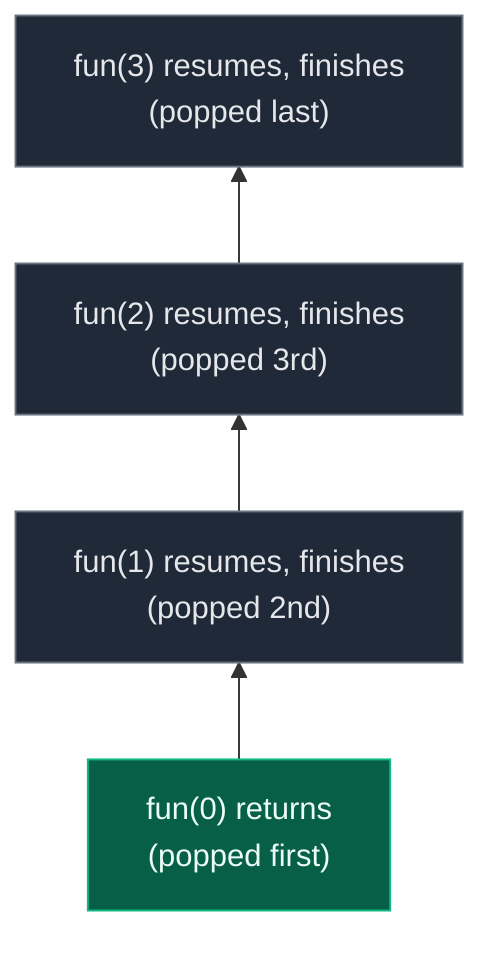
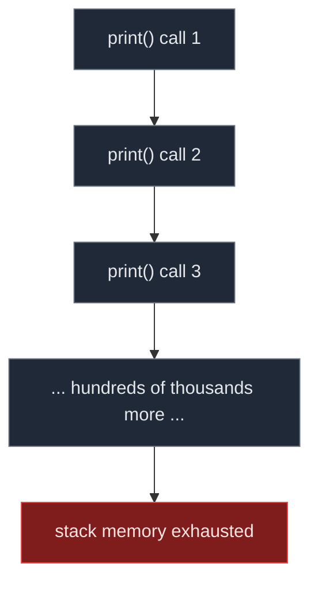
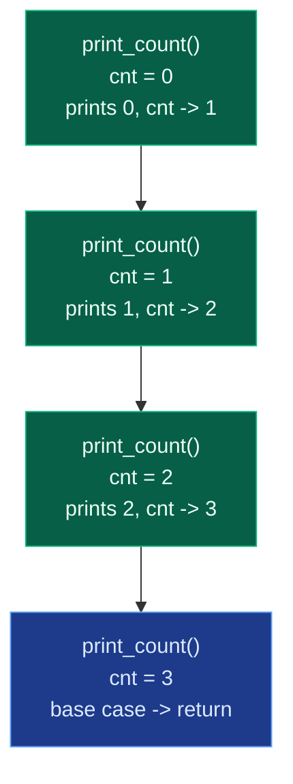

# 01. Introduction to Recursion

Recursion means a function calling itself to solve a problem. Instead of solving the complete problem directly, recursion solves a smaller version of the same problem again and again until it reaches a point where the answer is already known. It looks like magic the first time you see it, but it is really just a disciplined way of trusting a function to handle a smaller input while you focus only on how to build the current answer from that smaller result. Almost everything harder later in DSA — backtracking, trees, graphs, dynamic programming — is recursion wearing a costume, so getting comfortable with the call stack and the base case here pays off for the rest of the course.

## 1. What Recursion Is

A recursive function is a function that calls itself:

```python
def function():
    function()
```

This alone is dangerous — it will run forever. So every recursive function must have a stopping condition, called the **base case**. The tutor's opening whiteboard example is exactly this skeleton before any stopping condition is added:

```text
void f() {
    print(1);
    f();
}
main() {
    f();
}
```

Running it prints `1` forever (`1 1 1 1 1 ...`) until the program crashes — which is exactly the segfault demo in Section 4.

## 2. The Call Stack

When a function calls itself, the current call does not finish — it **pauses** and waits for the call it just made to return. Each paused call sits in memory as a **stack frame**. This waiting is stored using something called the call stack.

Take:

```python
def fun(n):
    if n == 0:
        return
    print(n)
    fun(n - 1)
```

For `fun(3)`, frames are pushed one on top of another as each call goes deeper, then popped off one by one as each call finishes:



`fun(0)` hits the base case and returns immediately. Then, because every earlier call was only *paused*, control unwinds back down the stack in the reverse order it was built — `fun(0)` pops, then `fun(1)` finishes and pops, then `fun(2)`, then `fun(3)`:



For `fun(n)` in general, the stack grows to depth `n` before any frame pops, so the space used is `O(n)` — one frame per outstanding call. This "last one paused is first one resumed" behavior is exactly a stack (LIFO), which is why it is called the call stack.

## 3. Base Case and Recursive Case

Every recursive solution has two parts.

**1. Base case** — the condition where recursion stops. Without it, recursion keeps calling itself forever.

```python
if n == 0:
    return
```

**2. Recursive case** — the part where the function calls itself with a smaller input, moving the problem toward the base case.

```python
print_numbers(n - 1)
```

The three questions worth asking for any new recursion problem, in order:

| Question | What it answers |
|:---|:---|
| What is the base case? | Where should recursion stop? |
| What is the recursive relation? | How do I solve the bigger problem using the smaller problem's answer? |
| What should I do before or after the recursive call? | Does work happen on the way down, on the way back up, or both? |

## 4. Why Missing a Base Case Causes Stack Overflow

The video demonstrates this live. The starting code has no base case at all:

```text
void print() {
    cout << 1 << endl;
    print();
}
int main() {
    print();
    return 0;
}
```

Running it does not print forever in practice — it crashes:

```text
bash: line 1: 32711 Segmentation fault: 11
[Finished in 2.6s with exit code 139]
```

The `output.txt` fills with hundreds of thousands of lines (`523024 1`, `523025 1`, ...) before the process dies. **Why does it crash instead of looping forever?** Every call to `print()` pushes a new frame onto the call stack, and since the base case never triggers, no frame is ever popped. The stack is a fixed, finite region of memory, and once frame number ~500,000 or so is pushed, there is no room left — the operating system kills the process with a **segmentation fault**, also called a **stack overflow**.



Adding a base case that never becomes true has the identical effect. The tutor's next attempt still fails because the counter never changes:

```python
cnt = 0

def fun(n):
    if cnt == 3:      # condition never becomes true...
        return
    print(cnt)
    cnt += 1
    fun(n)            # ...because cnt is reset / not threaded through correctly
```

**Mistake: input not reducing.**

```python
def fun(n):
    if n == 0:
        return
    fun(n)   # n never changes, so recursion never stops
```

Here `n` never changes, so recursion never stops — same crash, different cause. A base case is only useful if the recursive call actually moves the input toward it.

## 5. Worked Example

The video's central demo is a global counter `cnt`, printed and incremented inside the recursive function, with a base case that stops once `cnt` reaches 3:

```text
int cnt = 0;
void print() {
    if (cnt == 3) return;
    cout << cnt << endl;
    cnt++;
    print();
}
int main() {
    print();
    return 0;
}
```

Output:

```text
0
1
2
```

Translated faithfully to Python with a class-scoped counter (avoiding a mutable global):

```python
class Solution:
    def __init__(self):
        self.cnt = 0

    def print_count(self):
        # Base case: stop once cnt reaches 3
        if self.cnt == 3:
            return
        # Work done before the recursive call
        print(self.cnt)
        self.cnt += 1
        # Recursive case
        self.print_count()
```

Tracing it frame by frame (the recursion tree the tutor draws is a straight line, since each call makes exactly one further call):



**Two classic variants worth contrasting**, both built on `print_numbers`:

**Print before the recursive call** (prints while going *deeper*):

```python
def print_numbers_down(n):
    if n == 0:
        return
    print(n)
    print_numbers_down(n - 1)

# print_numbers_down(5) -> 5 4 3 2 1
```

**Print after the recursive call** (prints while *coming back*):

```python
def print_numbers_up(n):
    if n == 0:
        return
    print_numbers_up(n - 1)
    print(n)

# print_numbers_up(5) -> 1 2 3 4 5
```

The dry run for the second version makes the "coming back" behavior explicit — nothing prints until the base case is hit, then each paused call prints as it resumes:

```text
printNumbers(5)
  printNumbers(4)
    printNumbers(3)
      printNumbers(2)
        printNumbers(1)
          printNumbers(0)
            return
          print 1
        print 2
      print 3
    print 4
  print 5
```

## 6. Common Mistakes

| Mistake | Why it breaks | Fix |
|:---|:---|:---|
| No base case | Recursion never stops -> stack fills up -> segmentation fault | Always define a condition where the function returns without recursing |
| Base case never becomes true | Same crash as having no base case at all | Make sure the recursive call actually moves the input toward the base case |
| Input not reducing | `fun(n)` calling `fun(n)` instead of `fun(n - 1)` never approaches the base case | Pass a strictly smaller/simpler argument on every call |
| Wrong return handling | Computing `n * factorial(n - 1)` but not `return`-ing it | Explicitly `return` the combined result |
| Confusing print-before vs print-after | Expecting descending output from a print-after version, or vice versa | Print before the call for "going deeper" order, after the call for "coming back" order |
| Assuming deep recursion is free | Every call keeps a stack frame alive -> `O(n)` extra space, and very large `n` can itself overflow the stack | Track space complexity as `O(depth)` and consider iteration for very large inputs |

## 7. Try It Yourself

```python
class Solution:
    def __init__(self):
        self.cnt = 0

    def print_count(self):
        if self.cnt == 3:
            return
        print(self.cnt)
        self.cnt += 1
        self.print_count()


def print_numbers_down(n, acc=None):
    if acc is None:
        acc = []
    if n == 0:
        return acc
    acc.append(n)
    return print_numbers_down(n - 1, acc)


def print_numbers_up(n, acc=None):
    if acc is None:
        acc = []
    if n == 0:
        return acc
    print_numbers_up(n - 1, acc)
    acc.append(n)
    return acc


def factorial(n):
    # Base case: factorial of 0 is 1
    if n == 0:
        return 1
    # Recursive case: n multiplied by factorial of n - 1
    return n * factorial(n - 1)


# Worked example: mirrors the video's cnt demo, output 0, 1, 2
sol = Solution()
sol.print_count()
assert sol.cnt == 3

# Print-before prints while going deeper: descending order
assert print_numbers_down(5) == [5, 4, 3, 2, 1]

# Print-after prints while coming back: ascending order
assert print_numbers_up(5) == [1, 2, 3, 4, 5]

# Classic factorial recursion
assert factorial(5) == 120
assert factorial(0) == 1

# A missing/never-true base case would recurse without bound;
# Python raises RecursionError instead of segfaulting like C++,
# but the failure mode is the same idea: an exhausted call stack.
import sys

def no_base_case(n):
    return no_base_case(n)

try:
    sys.setrecursionlimit(2000)
    no_base_case(1)
    assert False, "should never reach here"
except RecursionError:
    pass

print("All tests passed")
```
