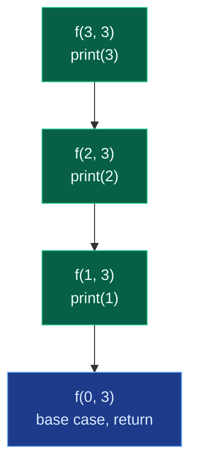
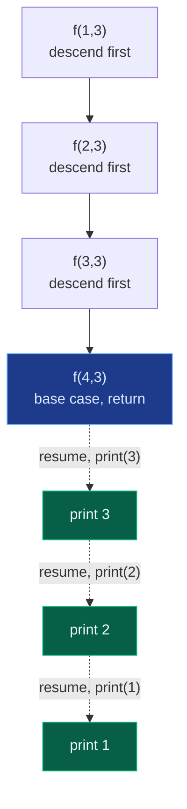

# 02. Problems on Recursion

Five small problems, solved interview-style, that build the full vocabulary of recursion mechanics: printing a fixed number of times, printing forwards, printing backwards, and then the same two orders again but forced to happen **while the function returns** instead of **while it descends**. That last pair is the first real taste of **backtracking** — go all the way down first, do the work on the way back up.

```text
Basic Recursion Problems
--> Print Name 5 times
--> Print linearly from 1 to N
--> Print from N to 1
--> Print linearly from 1 to N (but by backtracking)
--> Print from N to 1 (by backtracking)
```

## 1. Print Name `N` Times

**Problem.** Print your name exactly 5 times using recursion.

```text
Ajay
Ajay
Ajay
Ajay
Ajay
```

**Intuition.** Print the name once, then recursively solve the same problem for the remaining count:

```text
printName(1)
printName(2)
printName(3)
printName(4)
printName(5)
stop
```

Base case: `if count > 5: return`. Recursive call: `printName(count + 1)`.

```python
class Solution:
    def print_name(self, count: int, n: int) -> None:
        # Base case: once count exceeds n, stop recursion
        if count > n:
            return
        # Print for the current recursion call
        print("Ajay")
        # Recursive call for the next count
        self.print_name(count + 1, n)
```

Time `O(n)`, space `O(n)` — one stack frame per outstanding call.

## 2 & 3. Print `1..N` and `N..1` (Normal Recursion)

Both problems share one skeleton; only the base case and the direction of the step change.

**Print linearly from 1 to N** — start at `1`, print, move up:

```python
class Solution:
    def print_one_to_n(self, current: int, n: int) -> None:
        # Base case: current went past n, stop
        if current > n:
            return
        # Print the current number
        print(current)
        # Recursive call for the next number
        self.print_one_to_n(current + 1, n)
```

**Print from N to 1** — start at `N`, print, move down:

```python
class Solution:
    def print_n_to_one(self, n: int) -> None:
        # Base case: n hit 0, stop
        if n == 0:
            return
        # Print the current number
        print(n)
        # Recursive call for the previous number
        self.print_n_to_one(n - 1)
```

In both, the print happens **before** the recursive call — the video labels this the "going deeper" order. The recursion tree for `print_n_to_one(3)` is a straight line, each call printing on the way in:



## 4 & 5. Print `1..N` and `N..1` Using Backtracking

Same two outputs, but now the **call must start from the "wrong" end**, and the order is achieved by moving the print to **after** the recursive call. This is the core idea the video repeats:

```text
Normal recursion:  print first, then call recursion   -> prints while going deeper
Backtracking:      call recursion first, then print    -> prints while coming back
```

**Print linearly from 1 to N using backtracking** — the call itself starts from `N`, counting down, but nothing is printed until the base case is hit, and printing happens as each frame resumes:

```python
class Solution:
    def print_one_to_n_backtrack(self, n: int) -> None:
        # Base case: n hit 0, stop recursing further
        if n == 0:
            return
        # First go to the smaller problem
        self.print_one_to_n_backtrack(n - 1)
        # Print while returning from recursion
        print(n)
```

For `n = 5` the call chain goes all the way down to `0` before anything prints, then prints unwind in increasing order:

```text
printOneToNBacktracking(5)
  printOneToNBacktracking(4)
    printOneToNBacktracking(3)
      printOneToNBacktracking(2)
        printOneToNBacktracking(1)
          printOneToNBacktracking(0)
            return
          print 1
        print 2
      print 3
    print 4
  print 5
```

**Print from N to 1 using backtracking** — mirror the first argument's direction, printing on the way back again:

```python
class Solution:
    def print_n_to_one_backtrack(self, current: int, n: int) -> None:
        # Base case: current passed n, stop recursing further
        if current > n:
            return
        # First go to the next number
        self.print_n_to_one_backtrack(current + 1, n)
        # Print while returning from recursion
        print(current)
```

Here the recursion descends `1 -> 2 -> 3 -> 4 -> 5 -> 6 (base case)`, then unwinds printing `5, 4, 3, 2, 1`.

The recursion tree for the backtracking version makes the "descend all the way, then work on the way up" shape explicit — compare it to the straight-print tree in Section 2/3, where work happens on the way *down* instead:



## 6. Summary Table

| Problem | Start value | Print position | Output |
|:---|:---:|:---|:---|
| Print name 5 times | `1` | Before recursion | Name printed 5 times |
| Print 1 to N | `1` | Before recursion | `1 2 3 ... N` |
| Print N to 1 | `N` | Before recursion | `N ... 3 2 1` |
| Print 1 to N by backtracking | `N` | After recursion | `1 2 3 ... N` |
| Print N to 1 by backtracking | `1` | After recursion | `N ... 3 2 1` |

**The core interview point:** print before recursion means the work happens *while going down*; print after recursion means the work happens *while coming back*. This is the same idea as file 1's `print_numbers_down` / `print_numbers_up`, now generalized into a reusable trick: whichever direction the input argument moves, you can always get the *opposite* printed order for free just by moving the `print` to the other side of the recursive call — this is the seed of backtracking, seen again in subsets, permutations, and N-Queens.

## 7. Common Mistakes

| Mistake | Why it breaks | Fix |
|:---|:---|:---|
| Starting the backtracking call from the same end as the normal version | Produces the same order as plain recursion, defeating the exercise's point | Backtracking versions deliberately start from the *opposite* end and rely on the print-after-call trick to fix the order |
| Forgetting the base case check on the "wrong" boundary | `print_n_to_one_backtrack` needs `current > n`, not `current == n`, since the walk overshoots by one before returning | Match the base case to whichever direction the argument moves and where it must stop |
| Printing before **and** after the call by mistake | Duplicates output or produces both orders interleaved | Pick exactly one position for the print statement per problem |
| Assuming backtracking here means "undo a choice" | These five problems don't undo anything — they just delay printing until the unwind phase | True backtracking (subsets, N-Queens) adds an undo step; this is only the "delay work until return" half of the idea |

## 8. Try It Yourself

```python
class Solution:
    def print_name(self, count, n, acc):
        if count > n:
            return acc
        acc.append("Ajay")
        return self.print_name(count + 1, n, acc)

    def print_one_to_n(self, current, n, acc):
        if current > n:
            return acc
        acc.append(current)
        return self.print_one_to_n(current + 1, n, acc)

    def print_n_to_one(self, n, acc):
        if n == 0:
            return acc
        acc.append(n)
        return self.print_n_to_one(n - 1, acc)

    def print_one_to_n_backtrack(self, n, acc):
        if n == 0:
            return acc
        self.print_one_to_n_backtrack(n - 1, acc)
        acc.append(n)
        return acc

    def print_n_to_one_backtrack(self, current, n, acc):
        if current > n:
            return acc
        self.print_n_to_one_backtrack(current + 1, n, acc)
        acc.append(current)
        return acc


sol = Solution()

# 1. Print name 5 times
assert sol.print_name(1, 5, []) == ["Ajay"] * 5

# 2. Print 1 to N (before recursion -> ascending as it descends)
assert sol.print_one_to_n(1, 5, []) == [1, 2, 3, 4, 5]

# 3. Print N to 1 (before recursion -> descending as it descends)
assert sol.print_n_to_one(5, []) == [5, 4, 3, 2, 1]

# 4. Print 1 to N by backtracking (starts at N, prints while returning)
assert sol.print_one_to_n_backtrack(5, []) == [1, 2, 3, 4, 5]

# 5. Print N to 1 by backtracking (starts at 1, prints while returning)
assert sol.print_n_to_one_backtrack(1, 5, []) == [5, 4, 3, 2, 1]

print("All tests passed")
```
