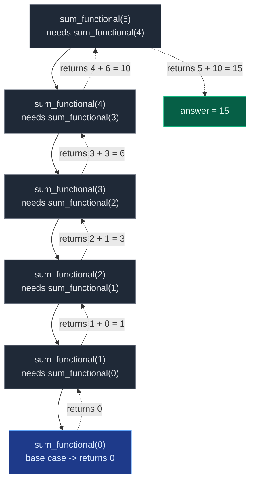
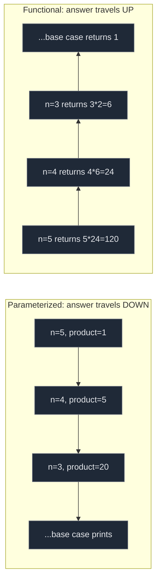

# 03. Parameterized and Functional Recursion

There are two common ways to solve the same recursion problem, and interviewers care about the distinction: **parameterized recursion** carries the answer inside function parameters as it goes down, while **functional recursion** has the function *return* the answer as it comes back up. Both reach the same result, but they read differently, and knowing which style a problem wants is a real interview signal — for example subsets and backtracking naturally want parameterized recursion, while "return the sum" or "return the factorial" naturally wants functional recursion.

```text
Parameterized Recursion:
We carry the answer inside function parameters.

Functional Recursion:
The function returns the answer.
```

## 1. Parameterized Recursion

**Meaning.** Pass the result as an extra parameter. The function does not wait for answers from recursive calls — instead, it keeps carrying the current answer forward.

**Problem.** Sum of first `N` numbers. For `N = 5`: `1 + 2 + 3 + 4 + 5 = 15`.

**Intuition.** Maintain one extra variable, `total` (called `sum` on the whiteboard). At every step: add the current number to `total`, reduce `n`, call recursion again.

```text
sum(5, 0)
sum(4, 5)
sum(3, 9)
sum(2, 12)
sum(1, 14)
sum(0, 15)
print 15
```

```python
class Solution:
    def sum_parameterized(self, n: int, total: int) -> None:
        # Base case: once n reaches 0, total already holds everything added
        if n == 0:
            # Print the final accumulated sum
            print(total)
            # Stop the recursion
            return
        # Add current n into total and move to n - 1
        self.sum_parameterized(n - 1, total + n)
```

**Why the answer is "ready at the base case":** `total` is a running accumulator threaded through every call. By the time `n == 0`, `total` already equals the full answer — nothing is left to combine on the way back up, so there is no need for a return value at all. The whiteboard's original version even skips the `n == 0` guard and instead checks `i < 1` before printing, but the mechanism is identical: pass the partial answer forward, print it once the base case fires.

## 2. Functional Recursion

**Meaning.** The function returns the answer. The current call depends on the smaller call's *return value* to build its own.

**Same problem, sum of first `N` numbers**, this time using the formula `sum(n) = n + sum(n - 1)`, base case `sum(0) = 0`:

```text
sum(5)
= 5 + sum(4)
= 5 + 4 + sum(3)
= 5 + 4 + 3 + sum(2)
= 5 + 4 + 3 + 2 + sum(1)
= 5 + 4 + 3 + 2 + 1 + sum(0)
= 15
```

```python
class Solution:
    def sum_functional(self, n: int) -> int:
        # Base case: sum of first 0 numbers is 0
        if n == 0:
            # Return 0 because nothing is left to add
            return 0
        # Return current number plus sum of remaining smaller problem
        return n + self.sum_functional(n - 1)
```

Here nothing is printed while descending. Each call is genuinely stuck waiting for `self.sum_functional(n - 1)` to return before it can compute its own answer — "the answer is built while returning."



## 3. Contrast: Factorial Both Ways

The same split appears with factorial of `N` (`5! = 5 x 4 x 3 x 2 x 1 = 120`).

**Parameterized** — carry the running `product`:

```text
factorial(5, 1)
factorial(4, 5)
factorial(3, 20)
factorial(2, 60)
factorial(1, 120)
factorial(0, 120)
print 120
```

```python
class Solution:
    def factorial_parameterized(self, n: int, product: int) -> None:
        # Base case: when n becomes 0, product contains the final factorial
        if n == 0:
            # Print the final factorial answer
            print(product)
            # Stop recursion
            return
        # Multiply current n into product and move to n - 1
        self.factorial_parameterized(n - 1, product * n)
```

**Functional** — return `n * factorial(n - 1)`:

```text
factorial(5)
= 5 * factorial(4)
= 5 * 4 * factorial(3)
= 5 * 4 * 3 * factorial(2)
= 5 * 4 * 3 * 2 * factorial(1)
= 5 * 4 * 3 * 2 * 1 * factorial(0)
= 120
```

```python
class Solution:
    def factorial_functional(self, n: int) -> int:
        # Base case: factorial of 0 is 1
        if n == 0:
            # Return 1 because multiplying by 1 changes nothing
            return 1
        # Return current n multiplied by factorial of n - 1
        return n * self.factorial_functional(n - 1)
```

Both give `factorial(5) == 120`. The difference is purely *where the combining work happens*:



## 4. Main Difference

| Point | Parameterized recursion | Functional recursion |
|:---|:---|:---|
| Answer handling | Passed as a parameter | Returned by the function |
| Extra variable | Yes, an accumulator parameter | Usually no accumulator |
| Return value | Often `None` | Returns the answer |
| Style | Carry the answer forward | Build the answer while returning |
| Recursive call shape | `solve(n - 1, total + n)` | `return n + solve(n - 1)` |
| When the answer is known | At the base case, already complete | Only after every call has returned |

**In one line each:**

> Parameterized recursion is like saying: *"I will carry the answer with me."*
> Functional recursion is like saying: *"I will ask the smaller problem for its answer, then add my contribution."*

## 5. Which One to Use

**Use functional recursion when the problem naturally asks you to return an answer:**

```text
Sum of N numbers
Factorial
Power calculation
Fibonacci
Height of tree
Maximum depth
```

**Use parameterized recursion when you want to carry some value along the recursion:**

```text
Print answer directly
Carry sum/product
Carry path/list
Backtracking
Generate subsequences
```

Both are `O(n)` time and `O(n)` space (the call stack holds `n` frames either way) for the sum and factorial examples above — the choice is about clarity and what the caller needs, not about efficiency. For interviews, functional recursion is usually cleaner when the function needs to hand back an answer to its caller; parameterized recursion is usually cleaner when the function's job is to accumulate state (a path, a partial subsequence, a running total) that only makes sense as a side channel, not as a single return value.

## 6. Common Mistakes

| Mistake | Why it breaks | Fix |
|:---|:---|:---|
| Forgetting to `return` in functional recursion | `n * self.factorial_functional(n - 1)` computed but discarded; the function implicitly returns `None` | Always `return` the combined expression, never just call it |
| Forgetting to update the accumulator in parameterized recursion | `total` never grows, so the base case prints the wrong value | Pass `total + n` (or the reduced value), not the stale `total` |
| Mixing the two styles in one function | Half the calls expect a return value, the other half expect a side-effect print, and callers get `None` | Pick one style per function: either it returns the answer, or it carries and prints it — not both |
| Printing inside a functional-recursion function instead of returning | Breaks composability — the caller can no longer use the value in a larger expression | Functional recursion should return; let the *caller* decide whether to print |
| Assuming parameterized recursion is "worse" | Parameterized recursion is the right shape for backtracking and subsequence generation, not a workaround | Choose based on whether the caller needs a return value or an accumulated side-channel |

## 7. Try It Yourself

```python
class Solution:
    def sum_parameterized(self, n, total, out):
        if n == 0:
            out.append(total)
            return
        self.sum_parameterized(n - 1, total + n, out)

    def sum_functional(self, n):
        if n == 0:
            return 0
        return n + self.sum_functional(n - 1)

    def factorial_parameterized(self, n, product, out):
        if n == 0:
            out.append(product)
            return
        self.factorial_parameterized(n - 1, product * n, out)

    def factorial_functional(self, n):
        if n == 0:
            return 1
        return n * self.factorial_functional(n - 1)


sol = Solution()

# Sum of first 5 numbers: both styles agree
param_out = []
sol.sum_parameterized(5, 0, param_out)
assert param_out == [15]
assert sol.sum_functional(5) == 15

# Factorial of 5: both styles agree
fact_out = []
sol.factorial_parameterized(5, 1, fact_out)
assert fact_out == [120]
assert sol.factorial_functional(5) == 120

# Base cases match the video's stated identities
assert sol.sum_functional(0) == 0
assert sol.factorial_functional(0) == 1

print("All tests passed")
```
