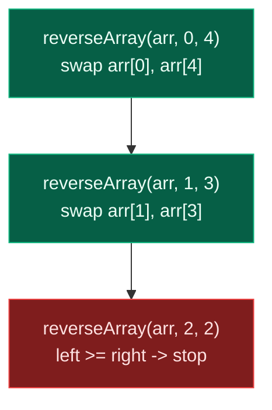
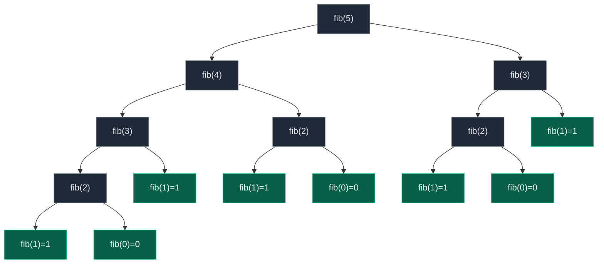

# 04. Problems on Functional Recursion

Functional recursion means **the function returns the answer** instead of carrying it around as a mutable parameter. We do not write `solve(n, answer)` and mutate `answer` on the way down. We write `return current_work + solve(smaller_problem)` and let each call hand its piece back up the stack. This file works through five classic functional-recursion problems — sum of first `N` numbers, factorial, reversing an array, checking a palindrome, and Fibonacci — building the same shape each time: identify the recursive formula, write the base case, and let the return value do the work.

## 1. Sum of First N Numbers

Given an integer `n`, return `1 + 2 + 3 + ... + n`. For `n = 5` the answer is `15`.

Break the problem into a smaller version of itself:

```text
sum(5) = 5 + sum(4)
sum(4) = 4 + sum(3)
sum(3) = 3 + sum(2)
sum(2) = 2 + sum(1)
sum(1) = 1 + sum(0)
```

Base case: `sum(0) = 0`. Recursive formula: `sum(n) = n + sum(n - 1)`.

```python
class Solution:
    def sumOfN(self, n: int) -> int:
        # Base case: sum of first 0 numbers is 0
        if n == 0:
            return 0
        # Recursively calculate sum of first n - 1 numbers
        smaller_sum = self.sumOfN(n - 1)
        # Add current n to the smaller answer and return
        return n + smaller_sum
```

Trace for `n = 5`:

```text
sumOfN(5)
= 5 + sumOfN(4)
= 5 + 4 + sumOfN(3)
= 5 + 4 + 3 + sumOfN(2)
= 5 + 4 + 3 + 2 + sumOfN(1)
= 5 + 4 + 3 + 2 + 1 + sumOfN(0)
= 5 + 4 + 3 + 2 + 1 + 0
= 15
```

Time `O(N)` (one call per number from `n` down to `0`), space `O(N)` (the call stack holds `N` frames). There is also a direct `O(1)` formula, `sum = n * (n + 1) // 2`, but the recursive version is what interviewers want to see first.

## 2. Factorial of N

Given `n`, return `n! = n * (n - 1) * (n - 2) * ... * 1`. For `n = 5`, `5! = 120`.

```text
factorial(5) = 5 * factorial(4)
factorial(4) = 4 * factorial(3)
factorial(3) = 3 * factorial(2)
factorial(2) = 2 * factorial(1)
factorial(1) = 1 * factorial(0)
```

Base case: `factorial(0) = 1`. Formula: `factorial(n) = n * factorial(n - 1)`.

```python
class Solution:
    def factorial(self, n: int) -> int:
        # Base case: factorial of 0 or 1 is 1
        if n == 0 or n == 1:
            return 1
        # Recursively calculate factorial of n - 1
        smaller_factorial = self.factorial(n - 1)
        # Multiply current n with smaller factorial and return
        return n * smaller_factorial
```

Trace for `n = 5`: `5 * 4 * 3 * 2 * 1 = 120`. Time `O(N)`, space `O(N)` for the call stack. An iterative version trades the recursion for a loop and drops space to `O(1)`:

```python
class Solution:
    def factorial(self, n: int) -> int:
        # Initialize answer as 1 because multiplying by 1 changes nothing
        answer = 1
        # Traverse from 1 to n
        for number in range(1, n + 1):
            # Multiply current number into answer
            answer *= number
        # Return final factorial
        return answer
```

## 3. Reverse an Array Using Functional Recursion

Given an array, reverse it recursively. `[1, 2, 3, 4, 5] -> [5, 4, 3, 2, 1]`.

**Intuition:** swap the leftmost element with the rightmost, then solve the remaining inner array — `swap arr[0] and arr[4]`, `swap arr[1] and arr[3]`, middle reached, stop.

A brute-force version returns a *new* list by slicing:

```python
from typing import List

class Solution:
    def reverseArray(self, arr: List[int]) -> List[int]:
        # Base case: if array has 0 or 1 element, it is already reversed
        if len(arr) <= 1:
            return arr
        # Recursively reverse the remaining array after first element
        reversed_remaining = self.reverseArray(arr[1:])
        # Put first element at the end after reversing remaining part
        return reversed_remaining + [arr[0]]
```

That costs `O(N^2)` time and `O(N^2)` space, because every call slices and concatenates new lists. The optimal version uses two pointers and swaps in place:

```python
from typing import List

class Solution:
    def reverseArray(self, arr: List[int], left: int, right: int) -> List[int]:
        # Base case: if left becomes greater than or equal to right, return array
        if left >= right:
            return arr
        # Swap the elements at left and right positions
        arr[left], arr[right] = arr[right], arr[left]
        # Recursively reverse the remaining inner array
        return self.reverseArray(arr, left + 1, right - 1)
```

Call flow for `arr = [1, 2, 3, 4, 5]`:

```text
reverseArray(arr, 0, 4)
swap arr[0] and arr[4]
arr = [5, 2, 3, 4, 1]

reverseArray(arr, 1, 3)
swap arr[1] and arr[3]
arr = [5, 4, 3, 2, 1]

reverseArray(arr, 2, 2)
left >= right, stop
```

Final output: `[5, 4, 3, 2, 1]`. Time `O(N)`, space `O(N)` for roughly `N / 2` stacked calls.



## 4. Check If a String Is Palindrome

A palindrome reads the same left to right and right to left. `"madam" -> True`, `"hello" -> False`.

**Intuition:** compare the first and last characters. If they differ, the string is not a palindrome. If they match, recurse on the inner substring: `m == m`, `a == a`, `d` is the middle -> `True`.

Reversing and comparing is the brute-force way:

```python
class Solution:
    def isPalindrome(self, s: str) -> bool:
        # Reverse the string using slicing
        reversed_string = s[::-1]
        # Compare original string with reversed string
        return s == reversed_string
```

That costs `O(N)` time and `O(N)` extra space for the reversed copy. The functional-recursion version compares from both ends inward without building a new string:

```python
class Solution:
    def isPalindrome(self, s: str, left: int, right: int) -> bool:
        # Base case: if left crosses right, all characters matched
        if left >= right:
            return True
        # If current left and right characters are different, it is not a palindrome
        if s[left] != s[right]:
            return False
        # Recursively check the inner substring
        return self.isPalindrome(s, left + 1, right - 1)
```

There is also a single-index version, which is the cleanest one for interview practice:

```python
class Solution:
    def isPalindrome(self, s: str, index: int) -> bool:
        # Base case: if index reaches half of string, all pairs are checked
        if index >= len(s) // 2:
            return True
        # If opposite characters do not match, return False
        if s[index] != s[len(s) - index - 1]:
            return False
        # Recursively check the next pair of characters
        return self.isPalindrome(s, index + 1)
```

Call flow for `"madam"`:

```text
isPalindrome("madam", 0)
compare s[0] and s[4] => m == m

isPalindrome("madam", 1)
compare s[1] and s[3] => a == a

isPalindrome("madam", 2)
index >= len(s)//2
return True
```

Output `True`. For `"hello"`: compare `h` and `o`, not equal, return `False` immediately. Time `O(N)`, space `O(N)` for up to `N / 2` stacked calls.

## 5. Fibonacci Number

Return the `n`-th Fibonacci number: `0, 1, 1, 2, 3, 5, 8, 13, ...`. For `n = 5`, `fib(5) = 5`.

Formula: `fib(n) = fib(n - 1) + fib(n - 2)`, base cases `fib(0) = 0` and `fib(1) = 1`.

Unlike sum, factorial, or palindrome check — which make exactly **one** recursive call per invocation — Fibonacci makes **two**:

```text
fib(5) = fib(4) + fib(3)
fib(4) = fib(3) + fib(2)
fib(3) = fib(2) + fib(1)
```

This creates a branching recursion tree instead of a straight chain, and the naive version recomputes the same subproblems many times over:



`fib(2)` is recomputed three separate times, `fib(3)` twice — the same work redone from scratch at every branch.

```python
class Solution:
    def fibonacci(self, n: int) -> int:
        # Base case: fib(0) = 0
        if n == 0:
            return 0
        # Base case: fib(1) = 1
        if n == 1:
            return 1
        # Return sum of previous two Fibonacci numbers
        return self.fibonacci(n - 1) + self.fibonacci(n - 2)
```

Time `O(2^N)` because each call spawns two more calls, so the number of calls roughly doubles with each increase in `n`. Space is `O(N)` — the deepest single chain of calls is `N` frames, even though the tree itself is exponential in size.

**Memoization** fixes the repeated work by caching each `n` the first time it is computed:

```python
class Solution:
    def fibonacci(self, n: int, dp: dict) -> int:
        # Base case: fib(0) = 0
        if n == 0:
            return 0
        # Base case: fib(1) = 1
        if n == 1:
            return 1
        # If answer is already calculated, return it directly
        if n in dp:
            return dp[n]
        # Calculate and store answer for current n
        dp[n] = self.fibonacci(n - 1, dp) + self.fibonacci(n - 2, dp)
        # Return stored answer
        return dp[n]
```

Time drops to `O(N)` because every Fibonacci state from `0` to `n` is calculated exactly once; space is `O(N)` for the recursion stack plus the memo dictionary. The most optimal solution is iterative and is not functional recursion at all — it just walks forward keeping the last two values:

```python
class Solution:
    def fibonacci(self, n: int) -> int:
        # Base case: if n is 0, return 0
        if n == 0:
            return 0
        # Base case: if n is 1, return 1
        if n == 1:
            return 1
        # Store fib(0)
        previous_second = 0
        # Store fib(1)
        previous_first = 1
        # Calculate Fibonacci from 2 to n
        for current in range(2, n + 1):
            # Current fibonacci is sum of previous two
            current_fib = previous_first + previous_second
            # Move previous_first to previous_second
            previous_second = previous_first
            # Move current_fib to previous_first
            previous_first = current_fib
        # Return final fibonacci number
        return previous_first
```

`O(N)` time, `O(1)` space.

## 6. Final Summary

| Problem | Functional Formula | Base Case | Time | Space |
|:---|:---|:---|:---:|:---:|
| Sum of N | `n + sum(n - 1)` | `n == 0` | `O(N)` | `O(N)` |
| Factorial | `n * fact(n - 1)` | `n == 0` or `n == 1` | `O(N)` | `O(N)` |
| Reverse Array | swap + recurse inward | `left >= right` | `O(N)` | `O(N)` |
| Palindrome | check pair + recurse | `index >= n/2` | `O(N)` | `O(N)` |
| Fibonacci | `fib(n-1) + fib(n-2)` | `n == 0` or `n == 1` | `O(2^N)` brute | `O(N)` stack |

The core functional recursion pattern behind every row above:

```python
def solve(n):
    # Base case
    if smallest_condition:
        return known_answer
    # Ask smaller problem for answer
    smaller_answer = solve(smaller_input)
    # Build current answer using smaller answer
    return current_work + smaller_answer
```

Functional recursion is all about:

```text
Do not print the answer.
Do not carry the answer in parameters.
Return the answer from every function call.
```

## 7. Common Mistakes

| Mistake | Why it breaks | Fix |
|:---|:---|:---|
| Printing inside the recursive call instead of returning | Nothing is passed back up the call chain, so the caller has no answer to use | Always `return`, never `print`, from the working function |
| Carrying the answer as a mutable parameter (`solve(n, answer)`) | Turns functional recursion into disguised iteration and hides the base case's true return value | Compute `smaller_answer = solve(smaller_input)` and combine it on the way back up |
| Forgetting the second base case in factorial/Fibonacci | `factorial(0)` and `factorial(1)` both terminate correctly, but omitting one still works for factorial \| omitting `fib(1)` breaks Fibonacci at `n = 1` | Write out every base case the formula actually needs |
| Slicing the array/string on every call (`arr[1:]`, `s[::-1]`) | Each slice is `O(N)`, so total time and space blow up to `O(N^2)` | Pass index pointers (`left`, `right`) instead of new sliced copies |
| Not caching repeated Fibonacci subcalls | `fib(2)` and smaller values are recomputed exponentially many times | Add memoization (a `dict` keyed by `n`) or switch to the iterative `O(N)` version |
| Using `left > right` instead of `left >= right` as the stop condition | For even-length arrays the pointers meet exactly (`left == right`) and an `>` check recurses one call too far or under-swaps | Use `>=` so the crossing and meeting cases both terminate |

## 8. Try It Yourself

```python
class Solution:
    def sumOfN(self, n: int) -> int:
        if n == 0:
            return 0
        return n + self.sumOfN(n - 1)

    def factorial(self, n: int) -> int:
        if n == 0 or n == 1:
            return 1
        return n * self.factorial(n - 1)

    def reverseArray(self, arr, left: int, right: int):
        if left >= right:
            return arr
        arr[left], arr[right] = arr[right], arr[left]
        return self.reverseArray(arr, left + 1, right - 1)

    def isPalindrome(self, s: str, index: int) -> bool:
        if index >= len(s) // 2:
            return True
        if s[index] != s[len(s) - index - 1]:
            return False
        return self.isPalindrome(s, index + 1)

    def fibonacci(self, n: int, dp: dict) -> int:
        if n == 0:
            return 0
        if n == 1:
            return 1
        if n in dp:
            return dp[n]
        dp[n] = self.fibonacci(n - 1, dp) + self.fibonacci(n - 2, dp)
        return dp[n]


sol = Solution()

assert sol.sumOfN(5) == 15
assert sol.factorial(5) == 120
assert sol.reverseArray([1, 2, 3, 4, 5], 0, 4) == [5, 4, 3, 2, 1]
assert sol.reverseArray([1, 2, 3, 4], 0, 3) == [4, 3, 2, 1]
assert sol.isPalindrome("madam", 0) is True
assert sol.isPalindrome("hello", 0) is False
assert sol.fibonacci(5, {}) == 5
assert sol.fibonacci(0, {}) == 0
assert sol.fibonacci(1, {}) == 1

print("All functional recursion checks passed.")
```
