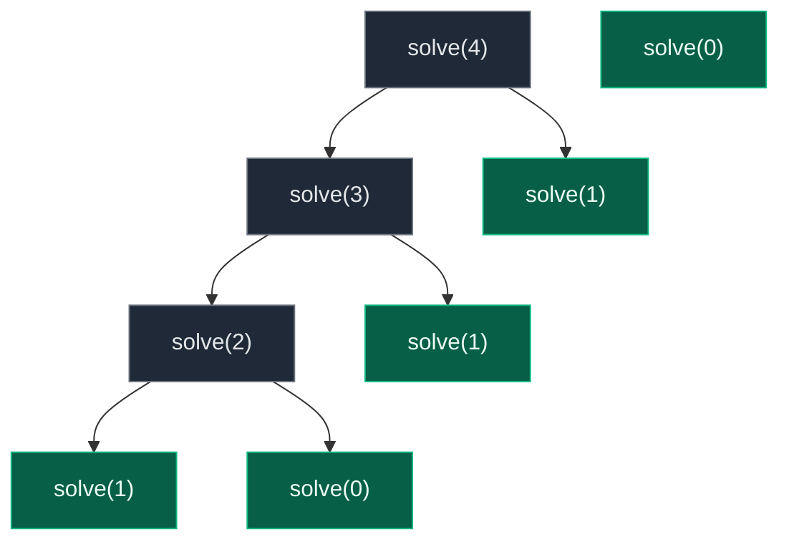
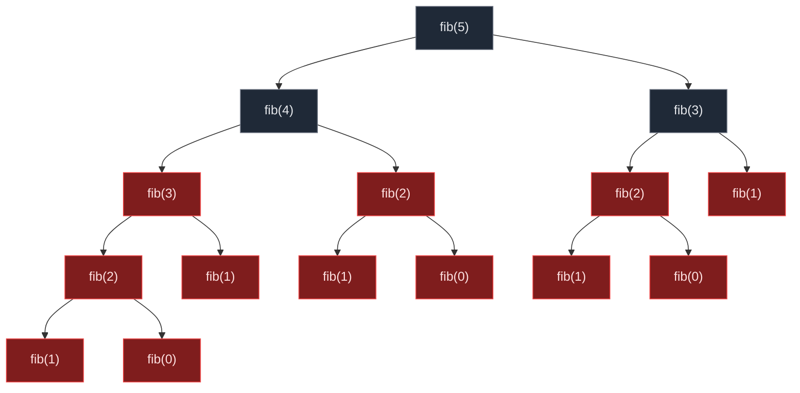
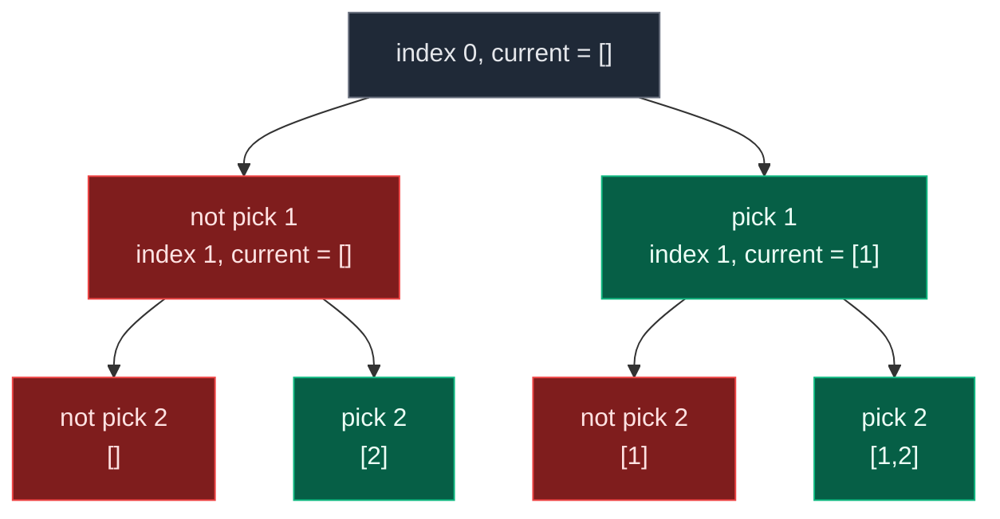
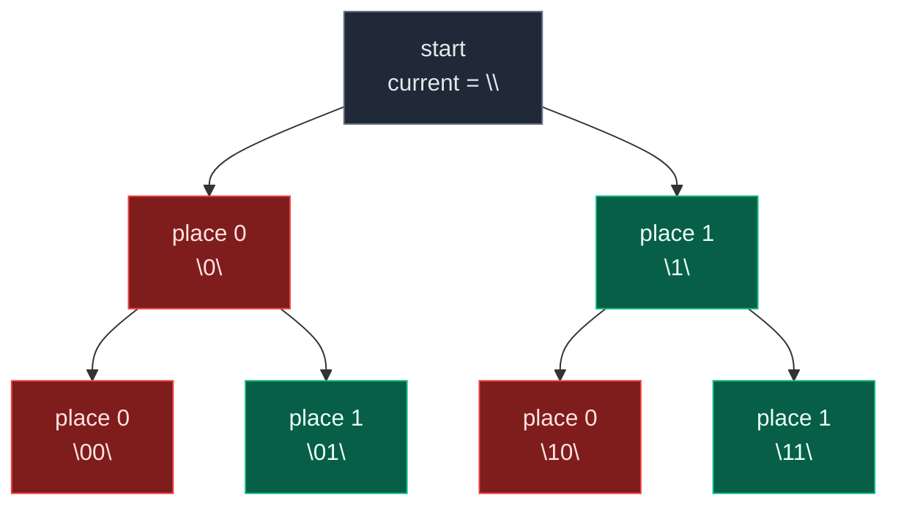

# 05. Multiple Recursion Calls

Every recursive function seen so far — sum, factorial, reverse array, palindrome check — makes **exactly one** recursive call per invocation, so the call chain is a straight line. Multiple recursion is different: **a function calls itself more than once inside the same function body.** Once a call branches into two (or more) further calls, the recursion structure stops being a line and becomes a tree, and that tree's size — not the input size — is what drives the time complexity. This file covers Fibonacci, climbing stairs, generating all subsequences, and generating all binary strings — the four problems that introduce the pick/not-pick pattern that later becomes the backbone of backtracking.

## 1. What Is Multiple Recursion?

Single recursion usually has one recursive call:

```python
def solve(n):
    solve(n - 1)
```

Multiple recursion has two or more recursive calls:

```python
def solve(n):
    solve(n - 1)
    solve(n - 2)
```

Here, for every function call, we are creating two more recursive calls, so the recursion structure becomes a tree instead of a chain. Most common examples: Fibonacci, subsequences, power set, permutations, combination sum, N-Queens, tree recursion, and backtracking problems in general.

## 2. Single Recursion vs Multiple Recursion

Single recursion for `solve(3)` is a straight line:

```text
solve(3)
  |
solve(2)
  |
solve(1)
  |
solve(0)
```

Multiple recursion for `solve(4)` with `solve(n) = solve(n-1) + solve(n-2)` fans out into a tree:

```text
solve(4)
   /        \
solve(3)     solve(2)
  /    \       /    \
solve(2) solve(1) solve(1) solve(0)
 /   \
solve(1) solve(0)
```



One call becomes two, and each of those becomes two more — that branching is the defining shape of multiple recursion.

## 3. Problem 1: Fibonacci Number

Given an integer `n`, return the `n`-th Fibonacci number: `0, 1, 1, 2, 3, 5, 8, 13, 21, ...`. Formula `fib(n) = fib(n - 1) + fib(n - 2)`, base cases `fib(0) = 0` and `fib(1) = 1`. For `n = 5`, `fib(5) = 5`.

To find `fib(5)` we need `fib(4) + fib(3)`. To find `fib(4)` we need `fib(3) + fib(2)`. Every call depends on **two** smaller calls — this is why Fibonacci is the classic example of multiple recursion.

**Brute force — pure multiple recursion:**

```python
class Solution:
    def fibonacci(self, n: int) -> int:
        # Base case: if n is 0, return 0
        if n == 0:
            return 0
        # Base case: if n is 1, return 1
        if n == 1:
            return 1
        # First recursive call calculates fib(n - 1)
        left_answer = self.fibonacci(n - 1)
        # Second recursive call calculates fib(n - 2)
        right_answer = self.fibonacci(n - 2)
        # Current answer is sum of both smaller answers
        return left_answer + right_answer
```

Trace for `n = 5`:

```text
fib(5) = fib(4) + fib(3)
fib(4) = fib(3) + fib(2)
fib(3) = fib(2) + fib(1)
fib(2) = fib(1) + fib(0) = 1 + 0 = 1
fib(3) = 1 + 1 = 2
fib(4) = 2 + 1 = 3
fib(5) = 3 + 2 = 5
```

Output `5`. Time complexity is `O(2^N)` because every call branches into two more calls, building a large recursion tree. Space is `O(N)` — even though the total number of calls is exponential, the maximum height of the call stack at any single moment is only `N`.

**Why brute force is slow.** For `fib(5)`, `fib(3)`, `fib(2)`, and `fib(1)` are each calculated multiple times:

```text
fib(5)
             /                    \
        fib(4)                  fib(3)
       /      \                /      \
   fib(3)    fib(2)        fib(2)    fib(1)
   /   \      /   \         /   \
fib(2) fib(1) fib(1) fib(0) fib(1) fib(0)
 /   \
fib(1) fib(0)
```



Repeated work causes the exponential time — `fib(3)` is recomputed twice, `fib(2)` three times, and `fib(1)` five times, all from scratch.

**Better: multiple recursion + memoization.** Store the answer of every `fib(n)` the first time it is calculated; if the same `n` comes again, return the stored answer directly.

```python
from typing import Dict

class Solution:
    def fibonacci(self, n: int, dp: Dict[int, int]) -> int:
        # Base case: fib(0) is 0
        if n == 0:
            return 0
        # Base case: fib(1) is 1
        if n == 1:
            return 1
        # If fib(n) is already calculated, return it
        if n in dp:
            return dp[n]
        # Calculate fib(n - 1) using recursion
        left_answer = self.fibonacci(n - 1, dp)
        # Calculate fib(n - 2) using recursion
        right_answer = self.fibonacci(n - 2, dp)
        # Store the current answer in dp dictionary
        dp[n] = left_answer + right_answer
        # Return the stored current answer
        return dp[n]
```

Time drops to `O(N)` because each Fibonacci state from `0` to `n` is calculated only once. Space is `O(N)` — recursion stack `O(N)` plus the DP dictionary `O(N)`.

**Most optimal: iterative Fibonacci.** Not multiple recursion at all, but the most optimal way to solve it:

```python
class Solution:
    def fibonacci(self, n: int) -> int:
        # Base case: if n is 0, return 0
        if n == 0:
            return 0
        # Base case: if n is 1, return 1
        if n == 1:
            return 1
        # Store fib(0)
        prev2 = 0
        # Store fib(1)
        prev1 = 1
        # Start calculating from fib(2) to fib(n)
        for current_index in range(2, n + 1):
            # Current fibonacci is sum of previous two values
            current_value = prev1 + prev2
            # Move prev1 one step back
            prev2 = prev1
            # Move current value to prev1
            prev1 = current_value
        # Return fib(n)
        return prev1
```

`O(N)` time, `O(1)` space — only two previous values are ever stored.

## 2. Problem 2: Count Ways to Climb Stairs

You are standing at step `0` and need to reach step `n`. At each move you can climb either `1` step or `2` steps. Return the number of distinct ways to reach step `n`. For `n = 3`, the answer is `3`: `1+1+1`, `1+2`, `2+1`.

To reach step `n`, the last jump could be from step `n - 1` using `1` step, or from step `n - 2` using `2` steps. So `ways(n) = ways(n - 1) + ways(n - 2)` — this is also multiple recursion, structurally identical to Fibonacci.

```python
class Solution:
    def climbStairs(self, n: int) -> int:
        # Base case: there is 1 way to reach step 0
        if n == 0:
            return 1
        # Base case: there is 1 way to reach step 1
        if n == 1:
            return 1
        # Count ways by taking last jump from n - 1
        one_step = self.climbStairs(n - 1)
        # Count ways by taking last jump from n - 2
        two_steps = self.climbStairs(n - 2)
        # Total ways is sum of both possibilities
        return one_step + two_steps
```

Time `O(2^N)`, space `O(N)` — same shape as brute-force Fibonacci. Memoization brings it to `O(N)` time / `O(N)` space:

```python
from typing import Dict

class Solution:
    def climbStairs(self, n: int, dp: Dict[int, int]) -> int:
        # Base case: there is 1 way to reach step 0
        if n == 0:
            return 1
        # Base case: there is 1 way to reach step 1
        if n == 1:
            return 1
        # If result is already calculated, return from dp
        if n in dp:
            return dp[n]
        # Calculate ways by using one-step movement
        one_step = self.climbStairs(n - 1, dp)
        # Calculate ways by using two-step movement
        two_steps = self.climbStairs(n - 2, dp)
        # Store result for current n
        dp[n] = one_step + two_steps
        # Return result
        return dp[n]
```

And the most optimal iterative version is `O(N)` time, `O(1)` space:

```python
class Solution:
    def climbStairs(self, n: int) -> int:
        # If n is 0 or 1, there is only 1 way
        if n == 0 or n == 1:
            return 1
        # Ways to reach step 0
        prev2 = 1
        # Ways to reach step 1
        prev1 = 1
        # Calculate ways from step 2 to step n
        for step in range(2, n + 1):
            # Ways to current step is sum of previous two steps
            current = prev1 + prev2
            # Shift previous step values
            prev2 = prev1
            # Store current as previous one for next iteration
            prev1 = current
        # Return ways to reach nth step
        return prev1
```

Working example for `n = 3`: `climbStairs(3) = climbStairs(2) + climbStairs(1)`, `climbStairs(2) = climbStairs(1) + climbStairs(0) = 1 + 1 = 2`, so `climbStairs(3) = 2 + 1 = 3`.

## 3. Problem 3: Generate All Subsequences

Given an array, print all subsequences. A subsequence is formed by choosing or not choosing each element while maintaining order. For `[1, 2, 3]`, the `8` subsequences are `[]`, `[3]`, `[2]`, `[2,3]`, `[1]`, `[1,3]`, `[1,2]`, `[1,2,3]` (order may vary).

For every element we have two choices — **do not pick** the element, or **pick** the element — so every index creates two recursive calls. This is the **pick / not-pick pattern**, the foundational shape behind subsequence, subset, and combination problems in backtracking.



**Brute force / standard backtracking solution** (prints each subsequence when complete):

```python
from typing import List

class Solution:
    def generateSubsequences(self, index: int, arr: List[int], current: List[int]) -> None:
        # Base case: if index reaches array length, one subsequence is complete
        if index == len(arr):
            # Print the current subsequence
            print(current)
            # Stop this recursion path
            return
        # Choice 1: do not pick the current element
        self.generateSubsequences(index + 1, arr, current)
        # Choice 2: pick the current element
        current.append(arr[index])
        # Recurse after picking current element
        self.generateSubsequences(index + 1, arr, current)
        # Backtrack: remove the picked element before returning
        current.pop()
```

Time `O(2^N * N)` — there are `2^N` subsequences, and printing/copying each can take up to `O(N)`. Space is `O(N)` for the recursion stack and `current` list; if every subsequence is stored, space becomes `O(2^N * N)`.

**Functional version — return all subsequences instead of printing:**

```python
from typing import List

class Solution:
    def generateSubsequences(self, index: int, arr: List[int]) -> List[List[int]]:
        # Base case: if index reaches end, return list containing empty subsequence
        if index == len(arr):
            return [[]]
        # Get all subsequences from remaining part
        smaller_subsequences = self.generateSubsequences(index + 1, arr)
        # Create result list for current index
        result = []
        # Add all subsequences where current element is not picked
        for subsequence in smaller_subsequences:
            result.append(subsequence)
        # Add all subsequences where current element is picked
        for subsequence in smaller_subsequences:
            result.append([arr[index]] + subsequence)
        # Return all subsequences for current index
        return result
```

Working example for `arr = [1, 2]`, call `generateSubsequences(0, [1, 2])`:

```text
For index 1 (element 2):
subsequences are: [], [2]

For index 0 (element 1):
not pick 1: [], [2]
pick 1:     [1], [1, 2]
```

Final answer: `[[], [2], [1], [1, 2]]`. Time and space are both `O(2^N * N)` since every subsequence is built and stored.

## 4. Problem 4: Generate All Binary Strings of Length N

Given `n`, generate all binary strings of length `n`. For `n = 3`: `000, 001, 010, 011, 100, 101, 110, 111`.

At every position we have two choices — place `0` or place `1` — so the recursive function makes two calls per index, exactly the same pick/not-pick shape as subsequences.

```python
class Solution:
    def generateBinaryStrings(self, index: int, n: int, current: str) -> None:
        # Base case: if current length becomes n, print it
        if index == n:
            print(current)
            return
        # Choice 1: place 0 at current position
        self.generateBinaryStrings(index + 1, n, current + "0")
        # Choice 2: place 1 at current position
        self.generateBinaryStrings(index + 1, n, current + "1")
```

Time `O(2^N * N)` — there are `2^N` binary strings, and building/printing each string takes `O(N)`. Space is `O(N)` for the maximum recursion depth; if every string is stored, space becomes `O(2^N * N)`.

Working example for `n = 2`, starting with `current = ""`:

```text
place 0:
  "0"
    place 0 -> "00"
    place 1 -> "01"
place 1:
  "1"
    place 0 -> "10"
    place 1 -> "11"
```

Output: `00, 01, 10, 11`.



## 5. Core Pattern of Multiple Recursion

```python
def solve(index, n):
    # Base case
    if index == n:
        return
    # First choice / first recursive call
    solve(index + 1, n)
    # Second choice / second recursive call
    solve(index + 1, n)
```

For choice-based problems that build up an answer as they go:

```python
def solve(index, arr, n, current):
    # Base case: one answer is formed
    if index == n:
        print(current)
        return
    # Choice 1: do not take
    solve(index + 1, arr, n, current)
    # Choice 2: take
    current.append(arr[index])
    solve(index + 1, arr, n, current)
    current.pop()
```

## 6. Final Summary

| Problem | Recursive Calls | Pattern | Time | Space |
|:---|:---:|:---|:---:|:---:|
| Fibonacci | 2 | `fib(n-1) + fib(n-2)` | `O(2^N)` brute | `O(N)` |
| Climbing Stairs | 2 | `ways(n-1) + ways(n-2)` | `O(2^N)` brute | `O(N)` |
| Subsequences | 2 per index | pick / not-pick | `O(2^N * N)` | `O(N)` auxiliary |
| Binary Strings | 2 per position | place 0 / place 1 | `O(2^N * N)` | `O(N)` auxiliary |

**Most important interview point.** Multiple recursion usually means: at every step, there are multiple choices, and for each choice, one recursive call is made — so the recursion tree branches. For two choices per index, total possibilities are `2^N`; for three choices per index, total possibilities are `3^N`. That is why multiple recursion is usually exponential unless memoization or DP is applied.

## 7. Common Mistakes

| Mistake | Why it breaks | Fix |
|:---|:---|:---|
| Treating a two-call recursion like a one-call recursion when reasoning about complexity | Counting calls as `O(N)` when the tree actually has `O(2^N)` nodes drastically underestimates runtime | Count branching factor and depth: `branches^depth`, not just depth |
| Not memoizing overlapping subproblems (Fibonacci, climbing stairs) | The same `n` gets recomputed exponentially many times, one full subtree per repeat | Cache results in a `dict` keyed by the parameter, check it before recursing |
| Forgetting to `pop()` after appending in pick/not-pick recursion | The `current` list keeps growing across sibling branches, corrupting every later subsequence | Always undo the mutation (`current.pop()`) right after the "pick" recursive call returns |
| Building a new string/list by concatenation at every call (`current + "0"`) | Each concatenation is `O(N)`, so total work becomes `O(2^N * N)` even when it looks constant per call | Acceptable for small `N`, but for large inputs prefer in-place mutation with backtracking |
| Assuming multiple recursion is always exponential even after memoization | Memoization collapses the tree to one node per distinct state, bringing Fibonacci-shaped problems to `O(N)` | Check whether subproblems overlap — if they do, memoize before concluding the algorithm must be slow |
| Confusing "two recursive calls" with "two return values" | The tree still branches even if the function returns a single combined value; the exponential blow-up is about calls made, not what is returned | Draw the recursion tree explicitly when counting complexity, not just the return statement |

## 8. Try It Yourself

```python
from typing import Dict, List


class Solution:
    def fibonacci(self, n: int, dp: Dict[int, int]) -> int:
        if n == 0:
            return 0
        if n == 1:
            return 1
        if n in dp:
            return dp[n]
        dp[n] = self.fibonacci(n - 1, dp) + self.fibonacci(n - 2, dp)
        return dp[n]

    def climbStairs(self, n: int, dp: Dict[int, int]) -> int:
        if n == 0 or n == 1:
            return 1
        if n in dp:
            return dp[n]
        dp[n] = self.climbStairs(n - 1, dp) + self.climbStairs(n - 2, dp)
        return dp[n]

    def generateSubsequences(self, index: int, arr: List[int]) -> List[List[int]]:
        if index == len(arr):
            return [[]]
        smaller = self.generateSubsequences(index + 1, arr)
        result = []
        for sub in smaller:
            result.append(sub)
        for sub in smaller:
            result.append([arr[index]] + sub)
        return result

    def generateBinaryStrings(self, index: int, n: int, current: str, out: List[str]) -> None:
        if index == n:
            out.append(current)
            return
        self.generateBinaryStrings(index + 1, n, current + "0", out)
        self.generateBinaryStrings(index + 1, n, current + "1", out)


sol = Solution()

assert sol.fibonacci(5, {}) == 5
assert sol.fibonacci(0, {}) == 0
assert sol.climbStairs(3, {}) == 3
assert sol.climbStairs(1, {}) == 1

subs = sol.generateSubsequences(0, [1, 2])
assert sorted(subs) == sorted([[], [2], [1], [1, 2]])

binaries = []
sol.generateBinaryStrings(0, 2, "", binaries)
assert sorted(binaries) == ["00", "01", "10", "11"]

print("All multiple recursion checks passed.")
```
