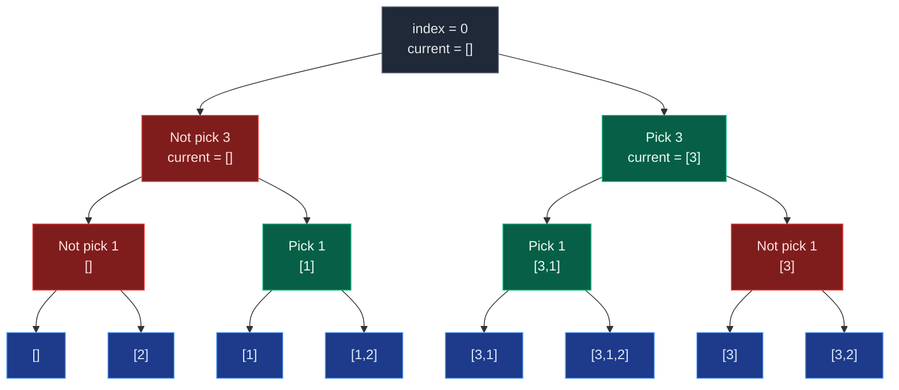

# 06. Recursion on Subsequences

Almost every backtracking problem later in this topic — Combination Sum, Subsets, Permutations, Palindrome Partitioning, N-Queens — is a variation of one idea: **at every index, either include the element or skip it.** This "pick / not-pick" decision, applied recursively, is the single most load-bearing pattern in the whole Recursion topic. Master it here and the rest of the topic becomes recognising the same skeleton with a different base case.

A **subsequence** is formed by taking some elements from the array while keeping the original relative order. Elements do not need to be contiguous, but order can never be rearranged.

```text
arr = [3, 1, 2]

[3, 2]  is a valid subsequence -> 3 comes before 2 in arr
[2, 3]  is NOT valid           -> in arr, 2 comes after 3
```

## 1. The Pick / Not-Pick Decision

For every index in the array there are exactly two choices: do not pick `arr[index]`, or pick it. Both choices move to `index + 1`, so the recursion branches into two calls at every level:

```text
solve(index + 1, ...)               # choice 1: skip arr[index]
current.append(arr[index])
solve(index + 1, ...)               # choice 2: take arr[index]
current.pop()                       # backtrack
```

This is why subsequence recursion always has **two recursive calls per index** rather than one — it is a binary decision tree, not a linear chain.



(Index 2, the last level before the leaves, is folded into the leaves above to keep the diagram readable — each leaf is the state right after the pick/not-pick decision on `arr[2] = 2` was made.)

## 2. Why This Generates All 2^n Subsequences

Every index contributes an independent binary choice — pick or not-pick — and choices at different indices never interact. With `n` elements there are `n` independent binary decisions, so the total number of distinct outcomes is `2^n`:

```text
n = 3  ->  2 * 2 * 2 = 8 subsequences   (including the empty one)
```

For `arr = [3, 1, 2]`, all 8 subsequences:

```text
[]
[2]
[1]
[1, 2]
[3]
[3, 2]
[3, 1]
[3, 1, 2]
```

The recursion tree has exactly `2^n` leaves (one full root-to-leaf path per leaf) and depth `n`, so printing every subsequence costs `O(2^n * n)` — `2^n` leaves, up to `n` elements to print at each.

## 3. Base Case: index == n

The recursion stops the moment every index has been decided:

```python
if index == len(arr):
    # current now holds one complete, valid subsequence
    print(current)
    return
```

There is no separate "did we run out of elements" check beyond this — `index == n` simultaneously means "no more pick/not-pick decisions to make" and "current is a finished subsequence, emit it."

## 4. Worked Example

Trace `arr = [3, 1, 2]` completely, always trying **not-pick before pick** at each index:

```text
f(0, [])
├── not pick 3 -> f(1, [])
│   ├── not pick 1 -> f(2, [])
│   │   ├── not pick 2 -> f(3, [])        => []
│   │   └── pick 2     -> f(3, [2])       => [2]
│   └── pick 1     -> f(2, [1])
│       ├── not pick 2 -> f(3, [1])       => [1]
│       └── pick 2     -> f(3, [1,2])     => [1, 2]
└── pick 3     -> f(1, [3])
    ├── not pick 1 -> f(2, [3])
    │   ├── not pick 2 -> f(3, [3])       => [3]
    │   └── pick 2     -> f(3, [3,2])     => [3, 2]
    └── pick 1     -> f(2, [3,1])
        ├── not pick 2 -> f(3, [3,1])     => [3, 1]
        └── pick 2     -> f(3, [3,1,2])   => [3, 1, 2]
```

Reading the 8 leaves left to right gives exactly the output order of "not-pick first, then pick":

```text
[], [2], [1], [1, 2], [3], [3, 2], [3, 1], [3, 1, 2]
```

```python
from typing import List

class Solution:
    def print_subsequences(self, index: int, arr: List[int], current: List[int]) -> None:
        # Base case: all elements processed, one subsequence is ready
        if index == len(arr):
            print(current)
            return
        # Choice 1: do not pick the current element
        self.print_subsequences(index + 1, arr, current)
        # Choice 2: pick the current element
        current.append(arr[index])
        self.print_subsequences(index + 1, arr, current)
        # Backtrack: remove it before trying other paths higher up
        current.pop()

# Input array
arr = [3, 1, 2]
Solution().print_subsequences(0, arr, [])
```

**Why `current.pop()` matters.** `current` is a single shared list mutated across the whole recursion, not a fresh list per call. Once `[3, 1]` has been explored, popping `1` restores `current` to `[3]` so the sibling branch (not-pick 1, or moving on to index 2 differently) sees the correct prefix. Skip the `pop()` and old choices leak into unrelated branches, corrupting every later subsequence.

**Time complexity:** `O(2^n * n)` — `2^n` subsequences, each up to `n` elements to copy or print. **Space complexity:** `O(n)` for the recursion stack plus the `current` list; `O(2^n * n)` if every subsequence is also stored (e.g. returned as a list of lists).

## 5. Variant: Print Only One Valid Subsequence

Sometimes only *one* subsequence matching a condition is needed — for example, one whose sum equals `k`. Exploring all `2^n` branches after the answer is already found wastes work. The fix is to make the recursive function return a boolean "found" flag and stop branching the instant it is `True`:

```python
from typing import List

class Solution:
    def print_one_subsequence_with_sum_k(
        self, index: int, arr: List[int], current: List[int], current_sum: int, k: int
    ) -> bool:
        # Base case: all elements processed
        if index == len(arr):
            if current_sum == k:
                print(current)
                return True   # found an answer, stop exploring
            return False      # this path failed, let the caller try the other choice

        # Choice 1: pick current element
        current.append(arr[index])
        if self.print_one_subsequence_with_sum_k(index + 1, arr, current, current_sum + arr[index], k):
            return True
        current.pop()  # backtrack

        # Choice 2: do not pick current element
        if self.print_one_subsequence_with_sum_k(index + 1, arr, current, current_sum, k):
            return True

        return False  # neither choice worked from here

arr = [1, 2, 1]
k = 2
Solution().print_one_subsequence_with_sum_k(0, arr, [], 0, k)   # prints [1, 1]
```

The `if ...: return True` after each recursive call is the early-exit — it propagates "found" all the way back up the call stack, so no sibling branch below the first hit is ever visited. Worst case (no valid subsequence exists) is still `O(2^n)`, but the best case — the first path explored is already valid — drops to `O(n)`.

## 6. Variant: Count Subsequences Matching a Condition

To count rather than print, return an `int` from every call instead of printing at the leaves, and sum the two branches:

```python
from typing import List

class Solution:
    def count_subsequences_with_sum_k(
        self, index: int, arr: List[int], current_sum: int, k: int
    ) -> int:
        # Base case: all elements processed
        if index == len(arr):
            return 1 if current_sum == k else 0

        # Count subsequences that pick the current element
        pick_count = self.count_subsequences_with_sum_k(index + 1, arr, current_sum + arr[index], k)
        # Count subsequences that skip the current element
        not_pick_count = self.count_subsequences_with_sum_k(index + 1, arr, current_sum, k)

        return pick_count + not_pick_count

arr = [1, 2, 1]
k = 2
print(Solution().count_subsequences_with_sum_k(0, arr, 0, k))   # 2  ([1,1] and [2])
```

This is **functional recursion**: no shared mutable `current` list, no explicit backtracking, because nothing is appended anywhere — each call simply reports a count upward. It reads exactly like the mathematical recurrence `f(i) = f(i+1, pick) + f(i+1, skip)`.

**Full dry run for `arr = [1, 2, 1]`, `k = 2`:**

```text
f(0, sum=0)
              /  pick 1              \  not pick 1
        f(1, sum=1)                    f(1, sum=0)
        /  pick 2   \ not pick 2       /  pick 2    \ not pick 2
   f(2, sum=3)    f(2, sum=1)      f(2, sum=2)     f(2, sum=0)
   /  \            /   \            /    \           /   \
f(3,4) f(3,3)   f(3,3) f(3,1)   f(3,3)  f(3,2)    f(3,1) f(3,0)
                                          valid              

valid leaves: f(3, sum=2) from the [2] path, and f(3, sum=2) from picking both 1's -> [1, 1]
answer = 2
```

**Important optimization — pruning (positive numbers only).** If every element is non-negative, the running sum can only grow, so once it exceeds `k` there is no way picking more elements ever brings it back down:

```python
if current_sum > k:
    return 0
```

This does not change the worst-case complexity (`O(2^n)` still holds if no subsequence exceeds `k` early), but it cuts real branches whenever the array has larger values. **This pruning is unsafe with zero or negative numbers** — e.g. `arr = [5, -3]`, `k = 2`: a running sum of `5` looks like it has overshot, but `-3` can still bring it down to exactly `2`. Only prune when the array is guaranteed non-negative.

## 7. Common Mistakes

| Mistake | Why it breaks | Fix |
|:---|:---:|:---|
| Forgetting `current.pop()` after the pick branch | Stale elements leak into sibling branches, corrupting every subsequence discovered afterward | Every `append` before a recursive call must be undone with `pop()` right after it returns |
| Treating this as one recursive call per index | Only one branch gets explored; half of all subsequences are silently missed | Always make **two** calls per index: one skipping, one picking |
| Using `if current_sum == k: return` instead of a boolean flag for "find one" | Recursion keeps exploring every remaining branch even after an answer is found | Return `True`/`False` and short-circuit with `if solve(...): return True` |
| Pruning with `if current_sum > k: return 0` on arrays with negative numbers | A sum that looks too big can still be reduced by a later negative value | Only prune when every element is confirmed non-negative |
| Confusing "count" (functional, returns int) with "print" (procedural, mutates a shared list) | Mixing the two styles causes either wrong counts or nothing being printed | Pick one style per function: functional recursion returns values, procedural recursion mutates and prints |
| Assuming subsequence order does not matter | `[2, 3]` from `arr = [3, 2]` looks tempting but violates original order | A subsequence must preserve the array's original relative order, always |

## 8. Try It Yourself

```python
from typing import List


def print_all_subsequences(index: int, arr: List[int], current: List[int], result: List[List[int]]) -> None:
    if index == len(arr):
        result.append(list(current))
        return
    # not pick
    print_all_subsequences(index + 1, arr, current, result)
    # pick
    current.append(arr[index])
    print_all_subsequences(index + 1, arr, current, result)
    current.pop()


def count_subsequences_with_sum_k(index: int, arr: List[int], current_sum: int, k: int) -> int:
    if index == len(arr):
        return 1 if current_sum == k else 0
    pick = count_subsequences_with_sum_k(index + 1, arr, current_sum + arr[index], k)
    not_pick = count_subsequences_with_sum_k(index + 1, arr, current_sum, k)
    return pick + not_pick


if __name__ == "__main__":
    arr = [3, 1, 2]
    all_subseq = []
    print_all_subsequences(0, arr, [], all_subseq)

    # There must be exactly 2^n subsequences.
    assert len(all_subseq) == 2 ** len(arr) == 8

    # Every one of the known 8 subsequences must appear, in any order.
    expected = [[], [2], [1], [1, 2], [3], [3, 2], [3, 1], [3, 1, 2]]
    assert sorted(all_subseq) == sorted(expected)

    # Counting variant: arr = [1, 2, 1], k = 2 -> [1,1] and [2] -> 2 matches.
    assert count_subsequences_with_sum_k(0, [1, 2, 1], 0, 2) == 2

    print("All assertions passed.")
```

```text
All assertions passed.
```
