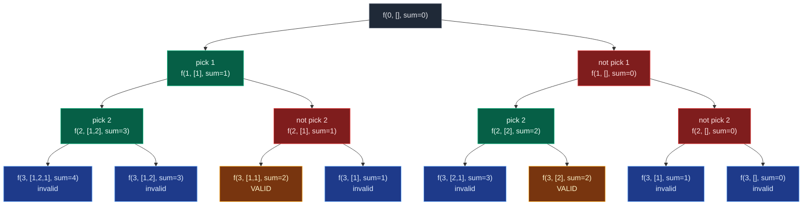

# 07. All Kinds of Patterns in Recursion

Every recursive function written so far returns `None` and communicates through a shared mutable structure (a `current` list, printing directly). But the **same pick/not-pick recursion tree** can be wrapped in three different function signatures depending on what the problem actually asks for — print everything, find one answer, or count answers. Recognising which signature a problem needs, before writing a single line of code, is the pattern that separates fluent recursion from copy-pasted templates.

All three variants below solve the identical problem — **print (or find, or count) subsequences of `arr` whose sum equals `k`** — so the pick/not-pick tree is shared; only the base case and the return type change.

```text
arr = [1, 2, 1]        k = 2        valid answers: [1, 1] and [2]
```

## 1. The Shared Recursion Tree

Regardless of what the function returns, the *shape* of the recursion is always the same binary pick/not-pick tree from the subsequences primer, now carrying a running `sum` alongside `current`:



What changes between the three variants below is only what happens **at the leaves** and **what the function hands back up** — never the shape of the tree itself.

## 2. Pattern Taxonomy

| Pattern | Return type | What happens at a valid leaf | Caller behaviour | Typical use |
|:---|:---:|:---|:---|:---|
| Print all matches | `None` (`void`) | print `current`, then `return` | both branches always explored | print all subsequences, all subsequences with sum `k` |
| Find one match | `bool` | print `current`, `return True` | `if solve(...): return True` short-circuits the sibling branch | print *only one* subsequence with sum `k`, any valid Sudoku/N-Queens placement |
| Count matches | `int` (`0` or `1` at the base case) | `return 1` if valid else `return 0` | `return left_count + right_count` | count subsequences with sum `k`, count paths/ways |

The tutor's own shorthand for this, drawn directly on the whiteboard:

```text
print   -> params            (mutate a shared structure, return nothing)
print 1 -> return T/F        (avoid further recursion calls once you get True)
count   -> return 0 / 1      (sum results of both branches upward)
```

## 3. Pattern: Print All Matches (`void`)

The base case never stops the search — it just decides whether to print, then returns control to the caller regardless. Both the pick and not-pick branches are *always* explored, all the way to `2^n` leaves.

```python
from typing import List

class Solution:
    def print_subsequences_with_sum_k(
        self, index: int, arr: List[int], current: List[int], current_sum: int, k: int
    ) -> None:
        # Base case: all elements processed
        if index == len(arr):
            if current_sum == k:
                print(current)
            return
        # Choice 1: pick the current element
        current.append(arr[index])
        self.print_subsequences_with_sum_k(index + 1, arr, current, current_sum + arr[index], k)
        current.pop()  # backtrack
        # Choice 2: do not pick the current element
        self.print_subsequences_with_sum_k(index + 1, arr, current, current_sum, k)

arr = [1, 2, 1]
k = 2
Solution().print_subsequences_with_sum_k(0, arr, [], 0, k)
# [1, 1]
# [2]
```

**Time:** `O(2^n * n)` — every one of the `2^n` leaves is visited, and printing a subsequence costs up to `O(n)`. **Space:** `O(n)` for the recursion stack and `current`.

## 4. Pattern: Find One Match (`bool`)

Once a single valid answer is found there is no reason to keep searching. Returning `True`/`False` from every call lets each caller decide, immediately, whether to stop:

```python
from typing import List

class Solution:
    def find_one_subsequence_with_sum_k(
        self, index: int, arr: List[int], current: List[int], current_sum: int, k: int
    ) -> bool:
        # Base case: condition satisfied -> return True; not satisfied -> return False
        if index == len(arr):
            if current_sum == k:
                print(current)
                return True
            return False

        # Choice 1: pick the current element
        current.append(arr[index])
        if self.find_one_subsequence_with_sum_k(index + 1, arr, current, current_sum + arr[index], k):
            return True          # an answer was already found downstream, stop here too
        current.pop()  # backtrack, this pick did not lead anywhere

        # Choice 2: do not pick the current element
        if self.find_one_subsequence_with_sum_k(index + 1, arr, current, current_sum, k):
            return True

        return False  # neither choice from this call led to a valid answer

arr = [1, 2, 1]
k = 2
Solution().find_one_subsequence_with_sum_k(0, arr, [], 0, k)   # prints [1, 1] and stops
```

The load-bearing line is `if solve(...): return True` — it is what turns a full `O(2^n)` sweep into an early exit. **Time:** worst case `O(2^n)` (no valid subsequence exists, every branch must be tried); best case `O(n)` (the very first path explored is already valid). **Space:** `O(n)`.

## 5. Pattern: Count Matches (`int`)

Counting needs no shared mutable state and no early exit — every leaf reports `1` or `0`, and every internal call simply adds its two children's counts together. This is pure functional recursion:

```python
from typing import List

class Solution:
    def count_subsequences_with_sum_k(
        self, index: int, arr: List[int], current_sum: int, k: int
    ) -> int:
        # Base case: condition satisfied -> 1, not satisfied -> 0
        if index == len(arr):
            return 1 if current_sum == k else 0

        # Count matches where the current element is picked
        left = self.count_subsequences_with_sum_k(index + 1, arr, current_sum + arr[index], k)
        # Count matches where the current element is skipped
        right = self.count_subsequences_with_sum_k(index + 1, arr, current_sum, k)

        return left + right

arr = [1, 2, 1]
k = 2
print(Solution().count_subsequences_with_sum_k(0, arr, 0, k))   # 2
```

There is no `current` list at all here — nothing is appended or popped, because nothing needs to be printed. **Time:** `O(2^n)` always, since counting must aggregate every leaf; no early exit is possible. **Space:** `O(n)` for the recursion stack only.

## 6. One More Axis: Pruning

Independent of which of the three return-type patterns is used, the search can sometimes be cut short with a **pruning** guard at the top of the function:

```python
if current_sum > k:
    return   # or `return False`, or `return 0`, matching the pattern's return type
```

This is only valid when every array element is non-negative — a sum that has already exceeded `k` can never come back down by adding more non-negative numbers. It fails for `arr = [5, -3], k = 2`: stopping at `current_sum = 5 > 2` misses `[5, -3]`, which sums to exactly `2`. Pruning changes constants, never the worst-case complexity — the worst case (no valid subsequence, or all elements needed to reach one) is still `O(2^n)`.

## 7. Common Mistakes

| Mistake | Why it breaks | Fix |
|:---|:---:|:---|
| Writing the "find one" pattern without checking the return value of the recursive call | The search keeps exploring every branch even after finding an answer, defeating the whole point of returning `bool` | Always wrap the recursive call: `if solve(...): return True` |
| Returning `None` from a `bool`-typed recursive function on some path | Python silently returns `None`, which is falsy but not `False` — callers checking `is True` break, and it signals a bug even where `if` alone still works | Every path through a `bool` function must explicitly `return True` or `return False` |
| Mixing the counting pattern with a shared mutable `current` list | Counting needs no shared state; adding one invites accidental mutation bugs with no benefit | Pass `current_sum` (and other scalars) by value; only the print variants need `current.append()` / `current.pop()` |
| Applying the positive-only pruning guard to arrays that may contain negatives or zero | A sum that looks too big can still be reduced later by a negative value | Only prune when every element is confirmed `>= 0` |
| Assuming the "find one" pattern is automatically faster in the worst case | If no valid subsequence exists, every branch must still be tried — same `O(2^n)` as the others | State the best case (`O(n)`, found immediately) and worst case (`O(2^n)`, not found) separately |
| Forgetting the base case must return a value in `bool`/`int` patterns | Falling off the end of a Python function returns `None`, corrupting `left + right` or `if solve(...)` checks | Base case must `return True/False` or `return 1/0`, matching the function's declared return type |

## 8. Try It Yourself

```python
from typing import List


def print_all(index: int, arr: List[int], current: List[int], current_sum: int, k: int, out: List[List[int]]) -> None:
    if index == len(arr):
        if current_sum == k:
            out.append(list(current))
        return
    current.append(arr[index])
    print_all(index + 1, arr, current, current_sum + arr[index], k, out)
    current.pop()
    print_all(index + 1, arr, current, current_sum, k, out)


def find_one(index: int, arr: List[int], current: List[int], current_sum: int, k: int) -> bool:
    if index == len(arr):
        return current_sum == k
    current.append(arr[index])
    if find_one(index + 1, arr, current, current_sum + arr[index], k):
        return True
    current.pop()
    if find_one(index + 1, arr, current, current_sum, k):
        return True
    return False


def count_matches(index: int, arr: List[int], current_sum: int, k: int) -> int:
    if index == len(arr):
        return 1 if current_sum == k else 0
    left = count_matches(index + 1, arr, current_sum + arr[index], k)
    right = count_matches(index + 1, arr, current_sum, k)
    return left + right


if __name__ == "__main__":
    arr = [1, 2, 1]
    k = 2

    # Print-all pattern: exactly the two known valid subsequences.
    matches: List[List[int]] = []
    print_all(0, arr, [], 0, k, matches)
    assert sorted(matches) == sorted([[1, 1], [2]])

    # Find-one pattern: True whenever at least one valid subsequence exists.
    assert find_one(0, arr, [], 0, k) is True
    assert find_one(0, [1, 1, 1], [], 0, 100) is False

    # Count pattern: matches the number found by print-all.
    assert count_matches(0, arr, 0, k) == len(matches) == 2

    print("All assertions passed.")
```

```text
All assertions passed.
```
