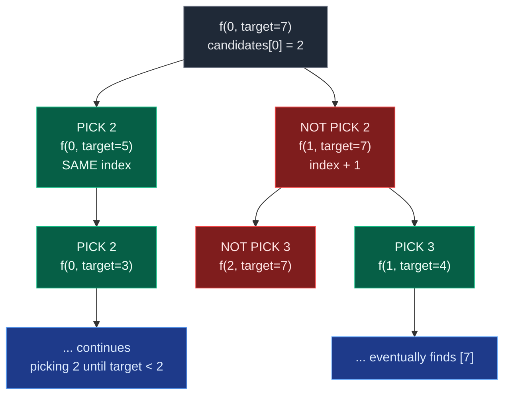

# 01. 39. Combination Sum

| Difficulty | Pattern | Source | Time | Space |
|:---:|:---:|:---:|:---:|:---:|
| **Medium** | Backtracking (Pick/Not-Pick with Repetition) | [39. Combination Sum](https://leetcode.com/problems/combination-sum/) | `O(2^(target/min))` worst case | `O(target/min)` |

## 1. Problem Statement

Given an array of **distinct** integers `candidates` and a target integer `target`, return a list of all **unique combinations** of `candidates` where the chosen numbers sum to `target`. You may return the combinations in **any order**.

The **same** number may be chosen from `candidates` an **unlimited** number of times. Two combinations are unique if the frequency of at least one of the chosen numbers is different.

### Examples

```text
Input:  candidates = [2,3,6,7], target = 7
Output: [[2,2,3],[7]]
Explanation: 2 and 3 are candidates, and 2 + 2 + 3 = 7. Note that 2 can be used multiple
times. 7 is a candidate, and 7 = 7. These are the only two combinations.
```

```text
Input:  candidates = [2,3,5], target = 8
Output: [[2,2,2,2],[2,3,3],[3,5]]
```

```text
Input:  candidates = [2], target = 1
Output: []
```

### Constraints

- `1 <= candidates.length <= 30`
- `2 <= candidates[i] <= 40`
- All elements of `candidates` are **distinct**.
- `1 <= target <= 40`

## 2. Core Theory

This looks like the ordinary subsequence pick/not-pick recursion (see [Recursion on Subsequences](../01.%20Introduction/06.%20Recursion%20on%20Subsequences.md)), but there is one crucial twist: **the same candidate can be picked again immediately after picking it once.**

In a normal subsequence recursion, picking an element always advances to `index + 1` — every element is considered exactly once. Here, picking a candidate keeps the recursion at the **same index**, because nothing stops us from using it again:

```text
Normal subsequence:              Combination Sum:
pick:     solve(index+1, ...)    pick:     solve(index,   target - candidates[index])
not pick: solve(index+1, ...)    not pick: solve(index+1, target)
```

Only the "not pick" branch ever moves forward. Once we decide we are done with `candidates[index]` (the not-pick branch), we permanently move past it — we never go back. That forward-only rule is what prevents generating the same combination as multiple permutations (e.g. `[2,2,3]`, `[2,3,2]`, `[3,2,2]` would all be found by a naive "try every candidate at every step" recursion; restricting moves to same-index-or-forward collapses them to one canonical order).



**Base cases.** Two conditions stop the recursion:

- `remaining_target == 0` — a valid combination is complete; store a **copy** of `current` (it keeps mutating during backtracking).
- `index == len(candidates)` — no candidates left to try; dead end, return without saving anything.

**Why `candidates[index] <= remaining_target` guards the pick branch.** All candidates are positive, so picking a candidate larger than what remains can only produce a negative remaining target — a path that can never reach zero. Checking this before recursing prunes hopeless branches early.

**Backtracking is the "choose → explore → undo" pattern**: append the candidate, recurse, then `pop()` it back off before trying the next possibility. Skipping the `pop()` leaves stale values in `current` that leak into unrelated branches.

**Two equivalent formulations** are commonly used:

1. **Pick/Not-Pick recursion** — mirrors subsequence recursion exactly, best for learning.
2. **For-loop backtracking** — a `for i in range(start, n)` loop plays the role of "try every candidate from here onward"; recursing with `i` (not `i + 1`) is what allows reuse. This is the version preferred for interviews and clean LeetCode submissions.

## 3. Edge Cases

| Case | Input | Expected | Why it matters |
|:---|:---|:---|:---|
| Single candidate equals target | `candidates=[7], target=7` | `[[7]]` | Minimal valid pick path |
| Target unreachable | `candidates=[2], target=1` | `[]` | Every candidate exceeds target; pick branch never fires |
| Candidate larger than target | `candidates=[2,3,6,7], target=1` | `[]` | Guard `candidates[i] <= remaining` must reject immediately |
| Target requires many repeats | `candidates=[2], target=8` | `[[2,2,2,2]]` | Confirms unlimited reuse at the same index |
| Multiple valid combinations | `candidates=[2,3,6,7], target=7` | `[[2,2,3],[7]]` | The canonical worked example |
| Target = smallest candidate exactly | `candidates=[3,5], target=3` | `[[3]]` | Base case fires on the very first pick |

## 4. Brute Force: Track Index Freely (Generates Duplicate Permutations)

### Intuition

A naive recursion tries every candidate at every step without any forward-only restriction. This finds all combinations, but also finds the same combination multiple times as different orderings — `[2,2,3]`, `[2,3,2]`, `[3,2,2]` are three permutations of one answer.

### Approach

1. At each call, loop over **every** candidate index (`0` to `n-1`), not just those `>= start`.
2. Pick a candidate, recurse with the reduced target, backtrack.
3. Normalize each found combination (e.g. `tuple(sorted(combination))`) and insert into a set to remove duplicates.

### Why It's Bad

Generating permutations first and deduplicating afterward wastes recursion — the fix is to never generate the duplicates at all, by only ever moving the starting index forward or staying put (never backward).

### Complexity

| Measure | Complexity | Why |
|:---|:---:|:---|
| **Time** | Exponential, strictly worse than the forward-only version | Explores every ordering of every combination |
| **Space** | `O(2^(target/min)) ` extra for the dedup set | Every permutation is briefly materialized |

## 5. Optimal Approach 1: Pick / Not-Pick Recursion

### Intuition

At every index there are exactly two choices: pick `candidates[index]` (staying at the same index, since reuse is allowed) or move on and never consider it again.

### Approach

```text
solve(index, remaining_target):
    if remaining_target == 0: save copy of current; return
    if index == len(candidates): return
    if candidates[index] <= remaining_target:
        current.append(candidates[index])
        solve(index, remaining_target - candidates[index])   # SAME index — reuse allowed
        current.pop()
    solve(index + 1, remaining_target)                       # move forward — never revisit
```

### Dry Run

For `candidates = [2,3,6,7]`, `target = 7`:

```text
solve(0,7) current=[]
  pick 2 -> solve(0,5) current=[2]
    pick 2 -> solve(0,3) current=[2,2]
      pick 2 -> solve(0,1) current=[2,2,2]      2 > 1, cannot pick
        not pick -> solve(1,1) ... eventually fails, backtrack
      backtrack -> current=[2,2]
      not pick 2 -> solve(1,3) current=[2,2]
        pick 3 -> solve(1,0) current=[2,2,3]    remaining=0 -> SAVE [2,2,3]
  ... (backtracking all the way up)
  not pick 2 -> solve(1,7) current=[]
    not pick 3 -> solve(2,7)
      not pick 6 -> solve(3,7)
        pick 7 -> solve(3,0) current=[7]        remaining=0 -> SAVE [7]

Final answer: [[2,2,3],[7]]
```

### Code

```python
from typing import List

class Solution:
    # Find all unique combinations whose sum equals target.
    def combinationSum(self, candidates: List[int], target: int) -> List[List[int]]:
        # Store the final valid combinations.
        answer = []
        # Store the combination currently being constructed.
        current = []

        # Define the recursive function.
        def solve(index: int, remaining_target: int) -> None:
            # If target becomes zero, we found a valid answer.
            if remaining_target == 0:
                # Store a copy because current will change later.
                answer.append(current.copy())
                return
            # If all candidates have been processed, stop.
            if index == len(candidates):
                return
            # Pick the current candidate only if it can fit.
            if candidates[index] <= remaining_target:
                current.append(candidates[index])
                # Stay at the SAME index because reuse is allowed.
                solve(index, remaining_target - candidates[index])
                # Undo the choice.
                current.pop()
            # Do not pick the current candidate; move permanently to the next index.
            solve(index + 1, remaining_target)

        solve(0, target)
        return answer
```

### Complexity

| Measure | Complexity | Why |
|:---|:---:|:---|
| **Time** | `O(2^(target/min_candidate))` worst case | Deepest recursion path repeatedly subtracts the smallest candidate |
| **Space** | `O(target/min_candidate)` recursion depth, ignoring output | `current`'s maximum length matches the deepest path |

## 6. Optimal Approach 2: For-Loop Backtracking (Interview-Preferred)

### Intuition

Instead of an explicit pick/not-pick pair of calls, loop over every candidate available **from the current starting index onward**. Recursing with the *same* index `i` (not `i + 1`) inside the loop is exactly what allows unlimited reuse.

### Approach

```text
backtrack(start, remaining):
    if remaining == 0: save copy of current; return
    for i from start to n-1:
        if candidates[i] > remaining: break     # sorted -> everything after is too big too
        current.append(candidates[i])
        backtrack(i, remaining - candidates[i]) # SAME i -> reuse allowed
        current.pop()
```

Sorting first turns the "skip if too large" check into a `break` instead of a `continue`: once one candidate exceeds the remaining target, every later (larger) candidate does too.

### Dry Run

For sorted `candidates = [2,3,6,7]`, `target = 7`:

```text
backtrack(0,7) current=[]
  i=0: choose 2 -> current=[2], backtrack(0,5)
    i=0: choose 2 -> current=[2,2], backtrack(0,3)
      i=0: choose 2 -> current=[2,2,2], backtrack(0,1)
        i=0: 2 > 1 -> break               (empty branch, nothing saved)
      pop -> current=[2,2]
      i=1: choose 3 -> current=[2,2,3], backtrack(0,0)
        remaining == 0 -> SAVE [2,2,3]
      pop -> current=[2,2]
      i=2: 6 > 3 -> break
    pop -> current=[2]
  pop -> current=[]
  i=1: choose 3 -> current=[3], backtrack(1,4) ... no combination completes on this branch
  i=2: 6 > 7? no, choose 6 -> backtrack(2,1) ... fails, backtrack
  i=3: choose 7 -> current=[7], backtrack(3,0)
    remaining == 0 -> SAVE [7]

Final answer: [[2,2,3],[7]]
```

### Code

```python
from typing import List

class Solution:
    # Return all unique combinations whose sum equals target.
    def combinationSum(self, candidates: List[int], target: int) -> List[List[int]]:
        # Sort candidates so we can prune once a value exceeds the target.
        candidates.sort()
        # Store all valid combinations.
        answer = []
        # Store the combination currently being constructed.
        current = []

        # Build combinations using candidates from start_index onward.
        def backtrack(start_index: int, remaining_target: int) -> None:
            # If nothing remains, the current combination is valid.
            if remaining_target == 0:
                answer.append(current.copy())
                return
            # Try every allowed candidate from this index onward.
            for index in range(start_index, len(candidates)):
                # Since candidates are sorted, no later value can fit either.
                if candidates[index] > remaining_target:
                    break
                current.append(candidates[index])
                # Reuse is allowed, so recurse with the SAME index.
                backtrack(index, remaining_target - candidates[index])
                current.pop()

        backtrack(0, target)
        return answer
```

### Complexity

| Measure | Complexity | Why |
|:---|:---:|:---|
| **Time** | `O(N log N)` sort + `O(2^(target/min))` backtracking | Sort cost is dominated by the exponential search in the worst case |
| **Space** | `O(target/min_candidate)` recursion depth | Same as Approach 1, ignoring output storage |

Both approaches solve the same recursion; the for-loop version is shorter and is the one recommended for interview submission, while pick/not-pick is the better teaching tool for the underlying subsequence pattern.

## 7. Common Mistakes

| Mistake | Why it breaks | Fix |
|:---|:---|:---|
| Advancing to `index + 1` (or `i + 1`) after picking | Candidate can never be reused, so repeats like `[2,2,3]` are missed entirely | Recurse with the **same** index/`i` in the pick branch |
| Looping `for i in range(len(candidates))` instead of `range(start_index, ...)` | Regenerates earlier candidates, producing permutations like `[3,2,2]` | Always start the loop at `start_index`, never `0` |
| Forgetting `current.pop()` after the recursive call | The next sibling branch inherits stale elements from the previous branch | Every `append` must be matched by a `pop()` right after its recursive call returns |
| `answer.append(current)` instead of `current.copy()` | All saved answers alias the same mutating list; final output is wrong | Always append a copy at the moment a valid combination is found |
| Using `break` on the size check without sorting first | An unsorted array means a later candidate could still be small enough to fit | `candidates.sort()` before relying on `break` for pruning |
| Missing the `candidates[i] <= remaining_target` guard in Approach 1 | Recursion can go arbitrarily deep down paths that can never reach exactly 0 | Guard the pick branch so only feasible candidates are chosen |

## 8. Interview Follow-ups

**Q: What if we only need the count of combinations, not the combinations themselves?**
A: Return an `int` from the recursive function instead of mutating a shared list: `return count_pick + count_not_pick` (functional recursion), with the same same-index-for-reuse rule. No `current` list or backtracking is needed at all.

**Q: What is the one-line difference between Combination Sum I and Combination Sum II?**
A: In Combination Sum I, reuse is allowed, so picking recurses with the **same** index. In Combination Sum II, each element can be used at most once, so picking recurses with `index + 1` — and because the input can contain duplicate values, a same-level duplicate-skip check is also needed.

**Q: What if candidates could be negative?**
A: The `candidates[i] <= remaining_target` pruning becomes unsafe — a negative candidate could bring an over-shot sum back down. You would lose that pruning and need a different termination strategy (e.g. a maximum combination length bound), since the recursion could otherwise not terminate cleanly.

**Q: Why does sorting help even though it isn't strictly required for correctness?**
A: Sorting turns the "reject too-large candidate" check into an early-exit `break` instead of scanning every remaining candidate with `continue`, which meaningfully prunes the search tree in practice.

**Q: How would you bound the recursion depth precisely?**
A: The deepest possible path keeps picking the smallest candidate until the target is exhausted, giving a depth of `target / min(candidates)` — this bounds both the auxiliary space and factors into the informal exponential time bound.

## 9. Interview Explanation

> I use backtracking and maintain a starting index so that combinations are generated only in forward order, which prevents duplicate permutations. At each recursion level, I try candidates starting from the current index. After selecting a candidate, I recurse using the same index because the problem allows unlimited reuse. I reduce the remaining target by that candidate, and after the recursive call I remove the candidate to backtrack. I sort the candidates first so that once a candidate exceeds the remaining target, I can stop exploring that branch.

## 10. Verify

```python
from typing import List


def combination_sum(candidates: List[int], target: int) -> List[List[int]]:
    candidates.sort()
    answer = []
    current = []

    def backtrack(start_index: int, remaining_target: int) -> None:
        if remaining_target == 0:
            answer.append(current.copy())
            return
        for index in range(start_index, len(candidates)):
            if candidates[index] > remaining_target:
                break
            current.append(candidates[index])
            backtrack(index, remaining_target - candidates[index])
            current.pop()

    backtrack(0, target)
    return answer


def as_set(combos):
    return sorted(sorted(c) for c in combos)


# LeetCode examples
assert as_set(combination_sum([2, 3, 6, 7], 7)) == as_set([[2, 2, 3], [7]])
assert as_set(combination_sum([2, 3, 5], 8)) == as_set([[2, 2, 2, 2], [2, 3, 3], [3, 5]])
assert as_set(combination_sum([2], 1)) == []

# Edge cases
assert as_set(combination_sum([7], 7)) == [[7]]
assert as_set(combination_sum([2, 3, 6, 7], 1)) == []
assert as_set(combination_sum([2], 8)) == [[2, 2, 2, 2]]
assert as_set(combination_sum([3, 5], 3)) == [[3]]

print("All tests passed")
```
