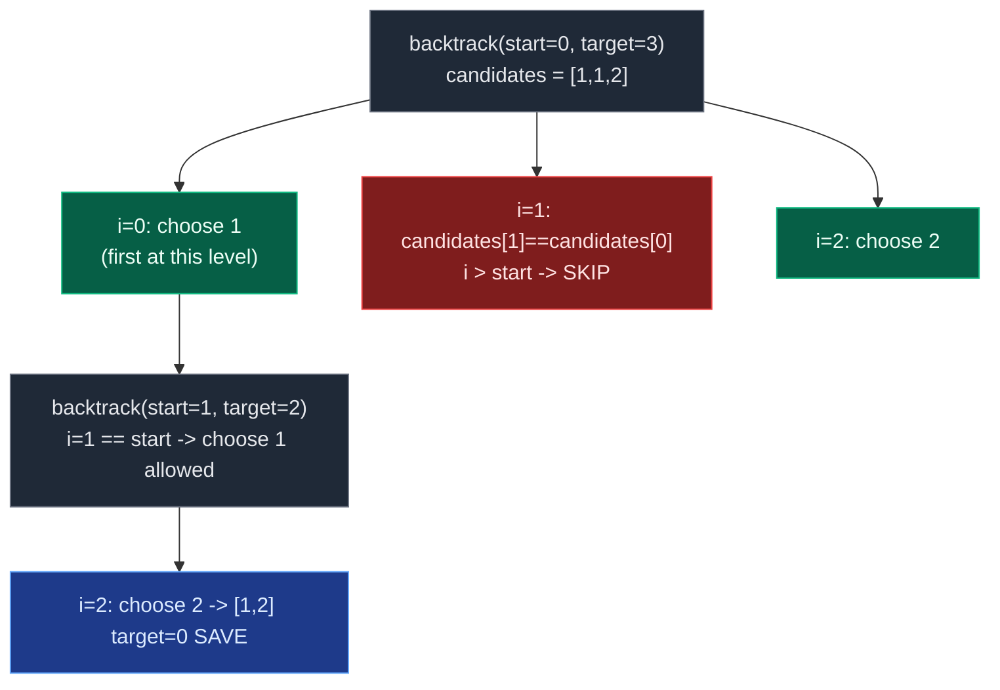

# 02. 40. Combination Sum II

| Difficulty | Pattern | Source | Time | Space |
|:---:|:---:|:---:|:---:|:---:|
| **Medium** | Backtracking (Pick/Not-Pick, No Reuse, Duplicate Skipping) | [40. Combination Sum II](https://leetcode.com/problems/combination-sum-ii/) | `O(2^N)` worst case | `O(N)` |

## 1. Problem Statement

Given a collection of candidate numbers `candidates` and a target number `target`, find all unique combinations in `candidates` where the candidate numbers sum to `target`.

Each number in `candidates` may only be used **once** in the combination.

**Note:** The solution set must not contain duplicate combinations.

### Examples

```text
Input:  candidates = [10,1,2,7,6,1,5], target = 8
Output: [[1,1,6],[1,2,5],[1,7],[2,6]]
```

```text
Input:  candidates = [2,5,2,1,2], target = 5
Output: [[1,2,2],[5]]
```

### Constraints

- `1 <= candidates.length <= 100`
- `1 <= candidates[i] <= 50`
- `1 <= target <= 30`

## 2. Core Theory

This is the direct sibling of [Combination Sum I](01.%2039.%20Combination%20Sum.md), and the contrast between them is the entire problem.

**Combination Sum I:** the same candidate can be reused, so picking recurses with the **same index**.

**Combination Sum II:** each candidate can be used **at most once** — but unlike Combination Sum I, the input array itself can contain duplicate values (e.g. two `1`s). So picking now always advances to `index + 1`, exactly like a plain subsequence recursion:

```text
Combination Sum I                  Combination Sum II
pick:     solve(i,   t - c[i])     pick:     backtrack(i+1, t - c[i])
not pick: solve(i+1, t)            not pick handled by the for-loop moving on
```

Moving forward on pick solves "no reuse of the same element" — but it does **not** solve duplicate *combinations*, because two distinct indices can hold equal values. `candidates = [1,1,2]` has two `1`s at index 0 and 1; one recursive path can choose index 0, another can choose index 1, and both produce the identical combination `[1,2]`. Since a set-based dedup afterward wastes work generating the duplicates in the first place, the trick is to never generate them.

**The fix: sort, then skip same-level duplicates.** After sorting, equal values become adjacent. In the for-loop-backtracking form, at a given recursion level (a given `start`), skip a candidate if it equals its immediate predecessor **and** we are not at the very first choice of this level:

```python
if i > start and candidates[i] == candidates[i - 1]:
    continue
```

**Why `i > start` specifically — not just `candidates[i] == candidates[i-1]`.** The condition must allow the *first* occurrence of a value at each recursion depth while skipping only its *duplicate siblings* at that same depth:

- `i == start` is always the first candidate tried at this level, so it is never skipped even if it equals `candidates[i-1]` from an *earlier, already-consumed* level. Example: after picking `candidates[0] = 1`, the recursion continues with `start = 1`. At that new level, `i = 1` equals `start`, so the second `1` (`candidates[1]`) is tried — correctly, since it represents a genuinely different array element being added on top of the first.
- `i > start` means we have already tried an earlier candidate at *this same level* and are now looking at a later one. If it equals the one just before it, starting a new branch here would explore a subtree that is structurally identical to a sibling subtree already explored — a redundant same-level duplicate.

In one line: **skip duplicates horizontally (across siblings at the same level), never vertically (down through recursion depth)** — a duplicate value at a deeper level represents a genuinely different array element being combined with what came before.



**Base cases** mirror Combination Sum I: `remaining_target == 0` saves a copy of `current`; running out of candidates (loop simply ends) means dead end.

**Pruning:** since candidates are sorted, `if candidates[i] > remaining_target: break` stops the whole loop — every later candidate is at least as large. This is a `break` (stop everything at this level) whereas the duplicate check is a `continue` (skip just this one branch, later candidates might still work).

## 3. Edge Cases

| Case | Input | Expected | Why it matters |
|:---|:---|:---|:---|
| Duplicates required in output | `[2,5,2,1,2], target=5` | `[[1,2,2],[5]]` | Two `2`s from different indices legitimately combine |
| Duplicate candidates fully consumed | `[1,1,2], target=4` | `[[1,1,2]]` | Uses both `1`s at different recursion depths — allowed |
| Target unreachable | `[5,10], target=3` | `[]` | No candidate small enough to start |
| Candidate larger than target | `[10], target=5` | `[]` | Pruned immediately by the `break` |
| Single candidate equals target | `[6], target=6` | `[[6]]` | Minimal valid path |
| All identical candidates | `[2,2,2], target=4` | `[[2,2]]` | Dedup must not also block *different* indices producing `[2,2]` once |

## 4. Brute Force: Generate Then Deduplicate With a Set

### Intuition

Recurse with `index + 1` on pick (correctly preventing element reuse) but without any same-level duplicate skip. This produces every combination, sometimes more than once from different index paths, then relies on a `set` of `tuple(sorted(combo))` to remove repeats afterward.

### Approach

1. Standard pick/not-pick recursion, `index + 1` on pick.
2. At each complete combination, normalize with `tuple(sorted(current))` and insert into a set.
3. Convert the set back to a list of lists at the end.

### Why It's Wasteful

The recursion still explores every duplicate branch before throwing the result away — for inputs with many repeated values this can multiply the search space unnecessarily. The optimal approach prevents the duplicate branch from being explored at all.

### Complexity

| Measure | Complexity | Why |
|:---|:---:|:---|
| **Time** | `O(2^N * N)` plus dedup overhead | Full binary recursion tree, normalized and hashed at every leaf |
| **Space** | `O(2^N * N)` | Set holds up to `2^N` combinations before filtering |

## 5. Optimal Approach: Sort + For-Loop Backtracking with Same-Level Duplicate Skip

### Intuition

Sort first so duplicates become adjacent (enabling both the duplicate skip and the pruning `break`). Loop over candidates from `start_index` onward; skip a candidate that repeats the previous one at the same level; recurse with `i + 1` since reuse is not allowed; backtrack.

### Approach

```text
backtrack(start, remaining):
    if remaining == 0: save copy of current; return
    for i from start to n-1:
        if i > start and candidates[i] == candidates[i-1]: continue   # same-level dedup
        if candidates[i] > remaining: break                          # sorted -> prune
        current.append(candidates[i])
        backtrack(i + 1, remaining - candidates[i])                  # i+1 -> no reuse
        current.pop()
```

### Dry Run

For `candidates = [1,1,2,5,6,7,10]` (sorted), `target = 8`:

```text
backtrack(0,8) current=[]
  i=0: choose 1 -> current=[1], backtrack(1,7)
    i=1: choose 1 -> current=[1,1], backtrack(2,6)
      i=2: choose 2 -> current=[1,1,2], backtrack(3,4)
        i=3: 5 > 4 -> break                          (dead end)
      pop -> [1,1]
      i=3: choose 5 -> current=[1,1,5], backtrack(4,1)
        i=4: 6 > 1 -> break                          (dead end)
      pop -> [1,1]
      i=4: choose 6 -> current=[1,1,6], backtrack(5,0)
        remaining == 0 -> SAVE [1,1,6]
      pop -> [1,1]
      i=5: 7 > 6 -> break
    pop -> [1]
    i=2: choose 2 -> current=[1,2], backtrack(3,5)
      i=3: choose 5 -> current=[1,2,5], backtrack(4,0)
        remaining == 0 -> SAVE [1,2,5]
      pop -> [1,2]
      i=4: 6 > 5 -> break
    pop -> [1]
    i=3: choose 5 -> current=[1,5], backtrack(4,2) ... fails
    i=4: choose 6 -> current=[1,6], backtrack(5,1) ... fails
    i=5: choose 7 -> current=[1,7], backtrack(6,0)
      remaining == 0 -> SAVE [1,7]
  pop -> []
  i=1: i > start(0) and candidates[1]==candidates[0] -> SKIP (prevents duplicate [1,...] branch)
  i=2: choose 2 -> current=[2], backtrack(3,6)
    i=3: choose 5 -> fails; i=4: choose 6 -> current=[2,6], backtrack(5,0) -> SAVE [2,6]
  ...

Final answer: [[1,1,6],[1,2,5],[1,7],[2,6]]
```

### Code

```python
from typing import List

class Solution:
    # Return all unique combinations whose sum equals target.
    def combinationSum2(self, candidates: List[int], target: int) -> List[List[int]]:
        # Sort so duplicate values become adjacent
        # and so we can prune when a value exceeds remaining target.
        candidates.sort()
        answer = []
        current = []

        # Explore candidates beginning from start_index.
        def backtrack(start_index: int, remaining_target: int) -> None:
            # If target becomes zero, current is a valid combination.
            if remaining_target == 0:
                answer.append(current.copy())
                return
            # Try every candidate available from start_index onward.
            for i in range(start_index, len(candidates)):
                # Skip duplicate values at the SAME recursion level.
                if i > start_index and candidates[i] == candidates[i - 1]:
                    continue
                # Since candidates are sorted, if this value is too large,
                # all later values will also be too large.
                if candidates[i] > remaining_target:
                    break
                current.append(candidates[i])
                # Move to i + 1 because this element cannot be reused.
                backtrack(i + 1, remaining_target - candidates[i])
                current.pop()

        backtrack(0, target)
        return answer
```

### Complexity

| Measure | Complexity | Why |
|:---|:---:|:---|
| **Time** | `O(N log N)` sort + `O(2^N)` backtracking worst case | Each element still fundamentally has a take/don't-take choice |
| **Space** | `O(N)` recursion depth (ignoring output) | At most `N` elements can be chosen, one per index |

## 6. Common Mistakes

| Mistake | Why it breaks | Fix |
|:---|:---|:---|
| Recursing with `i` instead of `i + 1` after picking | Allows unlimited reuse — this is Combination Sum I's rule, not II's | Always advance to `i + 1` on pick here |
| Skipping duplicates with `candidates[i] == candidates[i-1]` alone (no `i > start`) | Incorrectly removes valid answers like `[1,1,6]` that legitimately use two occurrences | Require `i > start_index` so the first occurrence at each level is never skipped |
| Forgetting `candidates.sort()` first | Duplicates aren't adjacent, so the dedup check can't detect them; `break`-based pruning also becomes invalid | Sort before backtracking |
| Forgetting `current.pop()` after the recursive call | Next sibling branch inherits stale elements from the previous branch | Every `append` must be matched by a `pop()` right after |
| `answer.append(current)` instead of `current.copy()` | All saved answers alias the same mutating list | Always append a copy at the moment a valid combination is found |
| Starting the loop from `0` every call instead of `start_index` | Reuses earlier elements and produces permutations of the same combination | Loop must begin at `start_index`, not `0` |

## 7. Interview Follow-ups

**Q: 39 vs 40 — what's the one-line difference?**
A: 39 allows unlimited reuse (`backtrack(i, ...)` on pick); 40 allows each element once (`backtrack(i+1, ...)` on pick) but needs a same-level duplicate skip because the input itself may contain repeated values.

**Q: Why not just dedupe with a set of tuples at the end?**
A: It works but is wasteful — you generate every duplicate combination via recursion before throwing most of them away. Sorting plus the `i > start` skip prevents the duplicate branch from ever being explored.

**Q: What if the input has no duplicate values at all?**
A: The duplicate-skip condition simply never triggers (`candidates[i] == candidates[i-1]` is never true), and the algorithm behaves exactly like a "pick each element once" backtracking search — correctness is unaffected either way.

**Q: Why is it `continue` for duplicates but `break` for values too large?**
A: A duplicate only invalidates *that one* branch — later, larger candidates may still be perfectly valid, so skip and keep looping (`continue`). A too-large candidate invalidates *every remaining* candidate too, since the array is sorted, so stop the loop entirely (`break`).

**Q: Could you solve this by counting occurrences of each distinct value instead of sorting + skipping?**
A: Yes — group into `(value, count)` pairs, then at each recursion level decide "use this value 0 to min(count, remaining/value) times" as one loop, rather than treating each raw index separately. It avoids the `i > start` idiom entirely and generalizes cleanly to problems with heavy duplication.

## 8. Interview Explanation

> I first sort the candidates so duplicate values become adjacent and I can prune once a candidate exceeds the remaining target. I then use backtracking with a starting index. At every recursion level I try candidates from that index onward. Since each element may be used only once, after choosing index `i` I recurse from `i + 1`. To prevent duplicate combinations, if the current candidate is equal to the previous candidate and both are being considered at the same recursion level, I skip the current one using `i > start && candidates[i] == candidates[i-1]`. Once the remaining target becomes zero, I store the current combination.

## 9. Verify

```python
from typing import List


def combination_sum2(candidates: List[int], target: int) -> List[List[int]]:
    candidates.sort()
    answer = []
    current = []

    def backtrack(start_index: int, remaining_target: int) -> None:
        if remaining_target == 0:
            answer.append(current.copy())
            return
        for i in range(start_index, len(candidates)):
            if i > start_index and candidates[i] == candidates[i - 1]:
                continue
            if candidates[i] > remaining_target:
                break
            current.append(candidates[i])
            backtrack(i + 1, remaining_target - candidates[i])
            current.pop()

    backtrack(0, target)
    return answer


def as_set(combos):
    return sorted(sorted(c) for c in combos)


# LeetCode examples
assert as_set(combination_sum2([10, 1, 2, 7, 6, 1, 5], 8)) == as_set(
    [[1, 1, 6], [1, 2, 5], [1, 7], [2, 6]]
)
assert as_set(combination_sum2([2, 5, 2, 1, 2], 5)) == as_set([[1, 2, 2], [5]])

# Edge cases
assert as_set(combination_sum2([1, 1, 2], 4)) == [[1, 1, 2]]
assert as_set(combination_sum2([5, 10], 3)) == []
assert as_set(combination_sum2([10], 5)) == []
assert as_set(combination_sum2([6], 6)) == [[6]]
assert as_set(combination_sum2([2, 2, 2], 4)) == [[2, 2]]

print("All tests passed")
```
