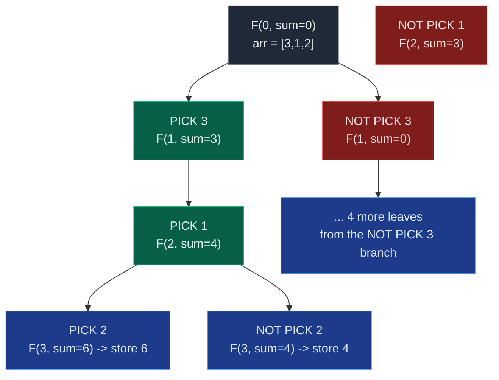

# 03. Subset Sums

| Difficulty | Pattern | Source | Time | Space |
|:---:|:---:|:---:|:---:|:---:|
| **Medium** | Pick/Not-Pick (Collect Sum at Every Leaf) | [Subset Sums — GfG](https://www.geeksforgeeks.org/problems/subset-sums2234/1) | `O(2^N)` (or `O(N * 2^N)` with sort) | `O(N)` auxiliary |

## 1. Problem Statement

Given an array `arr` of integers, return the sums of all subsets in the list. Return the sums in any order.

### Examples

```text
Input:  arr[] = [2, 3]
Output: [0, 2, 3, 5]
Explanation: When no elements are taken then Sum = 0. When only 2 is taken then Sum = 2.
When only 3 is taken then Sum = 3. When elements 2 and 3 are taken then Sum = 2+3 = 5.
```

```text
Input:  arr[] = [1, 2, 1]
Output: [0, 1, 1, 2, 2, 3, 3, 4]
Explanation: The possible subset sums are 0 (no elements), 1 (either of the 1's), 2 (the
element 2), and their combinations.
```

```text
Input:  arr[] = [5, 6, 7]
Output: [0, 5, 6, 7, 11, 12, 13, 18]
```

### Constraints

- `1 <= arr.size() <= 15`
- `0 <= arr[i] <= 10^4`

## 2. Core Theory

This is the simplest of the three problems in this section, and the purest form of the pick/not-pick pattern from [Recursion on Subsequences](../01.%20Introduction/06.%20Recursion%20on%20Subsequences.md). Unlike Combination Sum I and II, there is no target to match and no reuse rule to reason about — at every index we still make exactly one binary choice, and it always advances to `index + 1`:

```text
solve(index, current_sum):
    pick:     solve(index + 1, current_sum + arr[index])
    not pick: solve(index + 1, current_sum)
```

The key difference from ordinary subsequence recursion (which collects the *elements*) is that here we collect only the running **sum** at each leaf — the actual subset contents are irrelevant to the answer, so there is no need to build or backtrack a `current` list at all.



**Base case:** `index == len(arr)` means a decision has been made for every element — `current_sum` at that point is exactly the sum of one complete subset, so it is appended to the answer. There is no other stopping condition (no target to reach), which is why every one of the `2^N` root-to-leaf paths contributes exactly one value to the output.

**No backtracking needed for the sum-only version.** Combination Sum mutates a shared `current` list, so every `append` must be undone with a matching `pop()`. Here, `current_sum` is passed as a plain integer argument — each recursive call receives its own copy of the value. When a child call returns, the parent's `current_sum` is untouched, because integers are passed by value in the recursion. There is nothing to undo.

**Duplicate sums are expected, not a bug.** `arr = [3,1,2]` produces sum `3` twice — once from subset `[3]` and once from `[1,2]`. These are two different subsets that happen to share a sum, and both must appear in the output. A `set` would silently and incorrectly collapse them.

**Two approaches worth showing:**

1. **Recursion collecting into a list** — either store full subsets and sum them at the end (brute force), or carry only the running sum (optimal).
2. **Iterative bitmask** — treat each of the `2^N` numbers from `0` to `2^N - 1` as a bitmask over which elements are included, and sum the corresponding elements directly, no recursion at all.

## 3. Edge Cases

| Case | Input | Expected | Why it matters |
|:---|:---|:---|:---|
| Empty array | `[]` | `[0]` | Only the empty subset exists, sum `0` |
| Single element | `[5]` | `[0, 5]` | Smallest non-trivial case, exactly `2^1` sums |
| All zeros | `[0, 0]` | `[0, 0, 0, 0]` | Every subset sums to `0`; duplicates must all be kept |
| Duplicate values produce duplicate sums | `[1, 2, 1]` | `[0,1,1,2,2,3,3,4]` | Two different subsets legitimately share a sum |
| Maximum size (`N = 15`) | 15 elements | `2^15 = 32768` sums | Confirms exponential output size is expected, not a bug |
| Sum requiring all elements | `[5,6,7]` | includes `18` | The full-array subset is always present |

## 4. Brute Force: Store Full Subsets, Sum Them Afterward

### Intuition

Generate every subset explicitly (the standard subsequence recursion), then compute `sum(subset)` for each one afterward. This works, but stores far more information than the problem actually needs.

### Approach

1. Standard pick/not-pick recursion that appends/pops `arr[index]` into a shared `current_subset` list.
2. At `index == len(arr)`, store a **copy** of `current_subset`.
3. After all `2^N` subsets are generated, iterate over them and compute `sum(subset)` for each, appending to the answer.

### Code

```python
from typing import List

class Solution:
    # Return the sum of every possible subset.
    def subsetSums(self, arr: List[int]) -> List[int]:
        # Create a list to store all generated subsets.
        all_subsets = []
        # Create a list to represent the subset currently being constructed.
        current_subset = []

        # Define the recursive function that generates all subsets.
        def generate_subsets(index: int) -> None:
            # Check whether every array element has been processed.
            if index == len(arr):
                # Store a copy because current_subset changes during backtracking.
                all_subsets.append(current_subset.copy())
                return
            # Add the current element for the pick decision.
            current_subset.append(arr[index])
            generate_subsets(index + 1)
            # Remove the current element before exploring the not-pick branch.
            current_subset.pop()
            generate_subsets(index + 1)

        generate_subsets(0)
        # Create the list that will store every subset sum.
        answer = []
        for subset in all_subsets:
            answer.append(sum(subset))
        answer.sort()
        return answer
```

### Complexity

| Measure | Complexity | Why |
|:---|:---:|:---|
| **Time** | `O(N * 2^N)` | `2^N` subsets, each costing up to `O(N)` to build and sum |
| **Space** | `O(N * 2^N)` | Every subset is stored in full before summing |

## 5. Optimal Approach 1: Carry Only the Running Sum

### Intuition

We never actually need the subset's contents — only its sum. Instead of building a list and summing it at the leaf, carry the running sum as a plain function argument and update it directly on the pick branch.

### Approach

```text
solve(index, current_sum):
    if index == len(arr): store current_sum; return
    solve(index + 1, current_sum + arr[index])   # pick
    solve(index + 1, current_sum)                # not pick
```

### Dry Run

For `arr = [2, 3]`:

```text
solve(0,0)
  pick 2 -> solve(1,2)
    pick 3 -> solve(2,5)      index==2 -> STORE 5
    not pick 3 -> solve(2,2)  index==2 -> STORE 2
  not pick 2 -> solve(1,0)
    pick 3 -> solve(2,3)      index==2 -> STORE 3
    not pick 3 -> solve(2,0)  index==2 -> STORE 0

Generated order: [5, 2, 3, 0]
Sorted:          [0, 2, 3, 5]
```

### Code

```python
from typing import List

class Solution:
    # Return the sum of every possible subset.
    def subsetSums(self, arr: List[int]) -> List[int]:
        answer = []

        # Define the recursive function using only index and running sum.
        def solve(index: int, current_sum: int) -> None:
            # Check whether every element has already been considered.
            if index == len(arr):
                answer.append(current_sum)
                return
            # Explore the pick branch by adding the current element.
            solve(index + 1, current_sum + arr[index])
            # Explore the not-pick branch without changing the current sum.
            solve(index + 1, current_sum)

        solve(0, 0)
        # Sort the subset sums if the platform expects sorted output.
        answer.sort()
        return answer
```

**Why no backtracking is required here.** `current_sum + arr[index]` creates a *new* integer value that is passed to the child call; the parent's own `current_sum` variable is never mutated. Compare with Combination Sum, where `current.append(value)` mutates a *shared* list object that must be explicitly restored with `current.pop()`. Passing an immutable value down the call stack needs no undo step at all.

### Complexity

| Measure | Complexity | Why |
|:---|:---:|:---|
| **Time** | `O(2^N)` recursion, `O(N * 2^N)` if sorted | `2^N` leaves each doing `O(1)` work; sorting `2^N` sums costs `O(N * 2^N)` since `log(2^N) = N` |
| **Space** | `O(N)` auxiliary (recursion depth) | `O(2^N)` for the output itself, which is unavoidable since the answer size is exponential |

## 6. Optimal Approach 2: Iterative Bitmask

### Intuition

Every subset corresponds to exactly one bit pattern over `N` positions — bit `j` set means "element `j` is included." Looping over every integer from `0` to `2^N - 1` and checking its bits directly enumerates every subset without any recursion at all.

### Approach

```text
for mask in range(2^N):
    subset_sum = 0
    for j in range(N):
        if mask & (1 << j):
            subset_sum += arr[j]
    answer.append(subset_sum)
```

### Code

```python
from typing import List

class Solution:
    # Return the sum of every possible subset using bitmasking.
    def subsetSums(self, arr: List[int]) -> List[int]:
        n = len(arr)
        answer = []
        # Every mask from 0 to 2^n - 1 represents one subset.
        for mask in range(1 << n):
            current_sum = 0
            # Check each bit to decide whether arr[j] is included.
            for j in range(n):
                if mask & (1 << j):
                    current_sum += arr[j]
            answer.append(current_sum)
        answer.sort()
        return answer
```

### Complexity

| Measure | Complexity | Why |
|:---|:---:|:---|
| **Time** | `O(N * 2^N)` | `2^N` masks, each requiring an `O(N)` bit scan to compute its sum |
| **Space** | `O(1)` auxiliary | No recursion stack; only the output list is stored |

This trades the `O(N)` recursion stack for an `O(1)`-auxiliary iterative loop, at the same overall time complexity once the inner bit-sum work is counted.

## 7. Common Mistakes

| Mistake | Why it breaks | Fix |
|:---|:---|:---|
| Storing sums in a `set` | Silently discards legitimately duplicate sums from different subsets (e.g. `[3]` and `[1,2]` both sum to `3`) | Use a plain list — every one of the `2^N` leaves contributes one entry |
| Appending `current_sum` at every recursive call instead of only at `index == len(arr)` | Records partial, incomplete subset sums as if they were final answers | Only append at the base case, where a decision has been made for every element |
| Forgetting the empty subset | Manually seeding `answer = [0]` before running, then double-counting it | Do nothing special — the "not pick everything" path naturally reaches the base case with `current_sum == 0` |
| Mutating `current_sum` in place (e.g. `current_sum += arr[index]` before two recursive calls) | The not-pick branch then incorrectly inherits the pick branch's already-added value | Pass `current_sum + arr[index]` as a fresh argument to the pick call only; never reassign the shared variable |
| Assuming this needs backtracking like Combination Sum | Leads to unnecessary `current.append()`/`pop()` bookkeeping for a value that doesn't need it | Since only an integer sum is carried (not a list), no undo step is required |

## 8. Interview Follow-ups

**Q: How is this different from Combination Sum, structurally?**
A: Subset Sums has no target — every path is explored to completion regardless of its sum, and the "answer" is the sum itself, not the subset. Combination Sum has a target, stops early on `remaining_target == 0`, and must record which elements were chosen (hence the shared mutable list and backtracking).

**Q: Why is `O(2^N)` unavoidable here?**
A: The output itself has `2^N` entries (one per subset), so any correct algorithm must produce at least that many values — this is an output-bound lower limit, the same reasoning as Pascal's Triangle being `O(n^2)`-bound by its output size.

**Q: What if you needed only distinct subset sums?**
A: Wrap the final list in `set()` (or build the answer into a set directly) — but note the problem intentionally wants every subset represented, duplicates included, so a "distinct sums" variant is a different problem.

**Q: How would you count subsets that sum to a specific value `k`, rather than list all sums?**
A: Same recursion shape, but return a count instead of appending: `return count(index+1, sum+arr[index]) + count(index+1, sum)`, with the base case `1 if current_sum == k else 0`. This is the "count subsequences with sum k" variant from the subsequence primer.

**Q: Which approach would you actually write in an interview?**
A: The running-sum recursion (Approach 1) — it is the cleanest to explain, matches the standard pick/not-pick vocabulary interviewers expect, and needs no backtracking bookkeeping. The bitmask version is a good follow-up to mention as an iterative alternative.

## 9. Interview Explanation

> At every index I have two choices: include the current element in the subset or exclude it. I use recursion with two parameters: the current index and the running subset sum. For the pick branch, I add `arr[index]` to the running sum; for the not-pick branch, I leave the sum unchanged. In both cases I move to `index + 1`. When `index == n`, I have made a decision for every element, so the current sum corresponds to one complete subset and I store it. Since each of the `N` elements has two choices, there are `2^N` subset paths, and the auxiliary recursion space is `O(N)`.

## 10. Verify

```python
from typing import List


# Return the sum of every possible subset using the running-sum recursion.
def subset_sums(arr: List[int]) -> List[int]:
    answer = []

    # Define the recursive function using only index and running sum.
    def solve(index: int, current_sum: int) -> None:
        # Check whether every element has already been considered.
        if index == len(arr):
            answer.append(current_sum)
            return
        # Explore the pick branch by adding the current element.
        solve(index + 1, current_sum + arr[index])
        # Explore the not-pick branch without changing the current sum.
        solve(index + 1, current_sum)

    solve(0, 0)
    # Sort the subset sums if the platform expects sorted output.
    answer.sort()
    return answer


# Return the sum of every possible subset using bitmasking.
def subset_sums_bitmask(arr: List[int]) -> List[int]:
    n = len(arr)
    answer = []
    # Every mask from 0 to 2^n - 1 represents one subset.
    for mask in range(1 << n):
        s = 0
        # Check each bit to decide whether arr[j] is included.
        for j in range(n):
            if mask & (1 << j):
                s += arr[j]
        answer.append(s)
    answer.sort()
    return answer


# LeetCode/GfG examples
assert subset_sums([2, 3]) == [0, 2, 3, 5]
assert subset_sums([1, 2, 1]) == [0, 1, 1, 2, 2, 3, 3, 4]
assert subset_sums([5, 6, 7]) == [0, 5, 6, 7, 11, 12, 13, 18]

# Empty array: only the empty subset exists, sum 0
assert subset_sums([]) == [0]
# Single element: smallest non-trivial case, exactly 2^1 sums
assert subset_sums([5]) == [0, 5]
# All zeros: every subset sums to 0; duplicates must all be kept
assert subset_sums([0, 0]) == [0, 0, 0, 0]

# Both approaches must always agree
import random
for _ in range(20):
    trial = [random.randint(0, 10) for _ in range(random.randint(0, 6))]
    assert subset_sums(trial) == subset_sums_bitmask(trial), trial

# Maximum-size-style check: output size is exactly 2^N for growing N
for n in range(0, 8):
    trial = list(range(1, n + 1))
    assert len(subset_sums(trial)) == 2 ** n

print("All tests passed")
```
