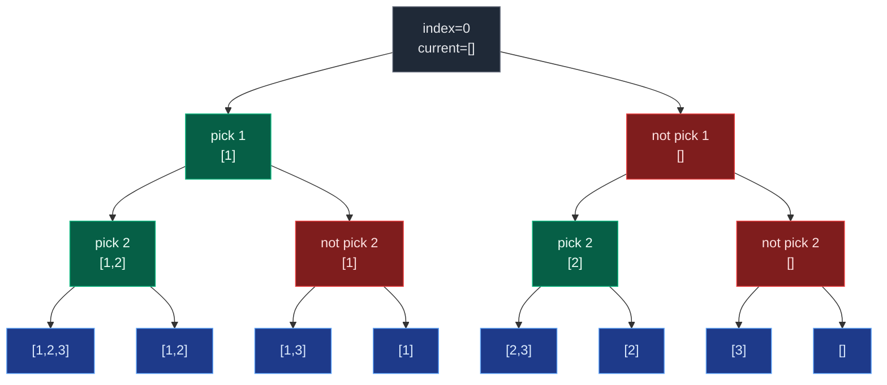

# 04. 78. Subsets

| Difficulty | Pattern | Source | Time | Space |
|:---:|:---:|:---:|:---:|:---:|
| **Medium** | Pick/Not-Pick Backtracking | [78. Subsets](https://leetcode.com/problems/subsets/) | `O(N * 2^N)` | `O(N)` auxiliary |

## 1. Problem Statement

You are given an integer array `nums` of **unique** elements. Return **all possible subsets** (the power set).

The solution set must **not** contain duplicate subsets. Return the subsets in **any order**.

### Examples

```text
Input:  nums = [1,2,3]
Output: [[],[1],[2],[1,2],[3],[1,3],[2,3],[1,2,3]]
```

```text
Input:  nums = [0]
Output: [[],[0]]
```

### Constraints

- `1 <= nums.length <= 10`
- `-10 <= nums[i] <= 10`
- All the numbers of `nums` are **unique**.

## 2. Core Theory

Subsets is the purest possible use of pick/not-pick recursion. There is no target sum to hit and no reuse rule to enforce — every element simply has two independent fates: it ends up in the subset, or it does not. With `n` elements making `n` independent binary choices, the number of distinct subsets is exactly `2^n`.

This is the same skeleton as the earlier "recursion on subsequences" pattern and Subset Sums, with one change: instead of carrying a running integer (`current_sum`), the state carried is the **actual list being built** (`current`). At every leaf (`index == n`) we store a *copy* of `current`, not `current_sum`.

```text
Subset Sums  -> carry a number   -> answer.append(current_sum)
Subsets      -> carry a list     -> answer.append(current.copy())
```

Full pick/not-pick tree for `nums = [1, 2, 3]` (8 leaves, all reachable):



(Decision on element `3` is folded into the leaves to keep the diagram readable.)

**Why `current.copy()` is not optional.** `current` is one mutable list, appended to and popped from throughout the whole recursion. `answer.append(current)` stores a *reference* to that same list object in every slot of `answer`. By the time recursion finishes, every stored "subset" points at whatever `current` happens to hold at the end — usually `[]` — so the entire output collapses into copies of one (usually empty) list. `current.copy()` (or `list(current)`, or slicing `current[:]`) freezes a snapshot at that instant, independent of later mutation.

**Three ways to generate the same 2^N outcomes**, all covered by the reference lecture:

1. **Bitmask (brute force).** Every subset corresponds to one of the `2^N` integers from `0` to `2^N - 1`. Bit `i` of the mask being `1` means "include `nums[i]`". Looping masks and inspecting bits produces every subset without recursion at all.
2. **Pick/Not-Pick recursion (optimal, classic form).** At index `i`: append `nums[i]`, recurse, pop, then recurse again without it. Store only at the base case `index == n`.
3. **For-loop backtracking (optimal, cleanest form).** Recognize that `current` is *already* a valid subset the instant you enter a call — so store it immediately at every node, then loop `i` from `start` to `n-1`, trying each remaining element as the next addition and recursing with `i + 1`. The loop itself replaces the explicit "not pick" branch: moving from `i` to `i+1` in the loop *is* skipping `nums[i]` without ever writing a `not_pick(...)` call.

All three run in the same `O(N * 2^N)` time — the exponential output size dominates regardless of how you produce it. The for-loop version is the one that extends most naturally to Subsets II, Combination Sum, and Permutations, which is why interviewers usually want to see it.

## 3. Edge Cases

| Case | Input | Expected | Why it matters |
|:---|:---|:---|:---|
| Minimum input | `nums = [5]` | `[[], [5]]` | Smallest non-trivial tree: exactly `2^1 = 2` subsets |
| Negative values | `nums = [-2, 0]` | `[[], [-2], [0], [-2,0]]` | Confirms nothing assumes positivity |
| Maximum length | `nums.length = 10` | `1024` subsets | `2^10 = 1024` — checks the exponential blow-up is handled, not optimized away |
| Order independence | any `nums` | any permutation of the expected list | LeetCode explicitly allows any order; comparisons must be order-insensitive |
| Empty subset always present | any `nums` | first (or any) entry is `[]` | The all-"not pick" / `start_index` root path is easy to accidentally special-case away |

## 4. Approach 1: Bitmask (Brute Force)

### Intuition

For `N` elements, every one of the `2^N` integers from `0` to `2^N - 1`, read in binary, is a unique "include/exclude" pattern. Bit `i` set means "include `nums[i]`".

```text
nums = [1, 2, 3]

mask = 000 -> []
mask = 001 -> [1]
mask = 010 -> [2]
mask = 011 -> [1, 2]
mask = 100 -> [3]
mask = 101 -> [1, 3]
mask = 110 -> [2, 3]
mask = 111 -> [1, 2, 3]
```

### Approach

1. Compute `total_subsets = 1 << n`.
2. For every `mask` from `0` to `total_subsets - 1`:
   - For every bit position `index` from `0` to `n - 1`, check `mask & (1 << index)`.
   - If set, include `nums[index]` in the current subset.
3. Append the finished subset to the answer.

### Dry Run

```text
nums = [1, 2, 3], n = 3, total_subsets = 8

mask = 5 -> binary 101
  index 0: bit set   -> include 1
  index 1: bit unset -> skip 2
  index 2: bit set   -> include 3
  subset = [1, 3]
```

### Code

```python
from typing import List

class Solution:
    # Return every possible subset using bit masking.
    def subsets(self, nums: List[int]) -> List[List[int]]:
        # Store the total number of elements.
        n = len(nums)
        # Create the final answer list.
        answer = []
        # Calculate the total number of subsets.
        total_subsets = 1 << n
        # Iterate through every possible bit mask.
        for mask in range(total_subsets):
            # Create the subset represented by the current mask.
            current_subset = []
            # Examine every bit position in the mask.
            for index in range(n):
                # Check whether the bit at the current index is set.
                if mask & (1 << index):
                    # Include nums[index] because this bit is one.
                    current_subset.append(nums[index])
            # Store the completed subset represented by this mask.
            answer.append(current_subset)
        # Return every generated subset.
        return answer
```

### Complexity

| Measure | Complexity | Why |
|:---|:---:|:---|
| **Time** | `O(N * 2^N)` | `2^N` masks, each inspecting `N` bit positions |
| **Space** | `O(N * 2^N)` | Output holds `2^N` subsets of up to `N` elements each |

## 5. Approach 2: Pick / Not-Pick Recursion

### Intuition

At index `i`, either include `nums[i]` in `current` or don't — both branches move to `index + 1`. When `index == n`, `current` is one finished subset; snapshot it.

### Approach

1. Define `solve(index)`. Base case: if `index == len(nums)`, append `current.copy()` and return.
2. Pick branch: append `nums[index]`, recurse `solve(index + 1)`, then pop to undo.
3. Not-pick branch: recurse `solve(index + 1)` directly, without touching `current`.

### Dry Run

```text
solve(0, [])
├── pick 1     -> solve(1, [1])
│   ├── pick 2     -> solve(2, [1,2])
│   │   ├── pick 3     -> solve(3, [1,2,3]) => [1,2,3]
│   │   └── not pick 3 -> solve(3, [1,2])   => [1,2]
│   └── not pick 2 -> solve(2, [1])
│       ├── pick 3     -> solve(3, [1,3])   => [1,3]
│       └── not pick 3 -> solve(3, [1])     => [1]
└── not pick 1 -> solve(1, [])
    ├── pick 2     -> solve(2, [2])
    │   ├── pick 3     -> solve(3, [2,3])   => [2,3]
    │   └── not pick 3 -> solve(3, [2])     => [2]
    └── not pick 2 -> solve(2, [])
        ├── pick 3     -> solve(3, [3])     => [3]
        └── not pick 3 -> solve(3, [])      => []
```

### Code

```python
from typing import List

class Solution:
    # Return every possible subset using Pick / Not-Pick recursion.
    def subsets(self, nums: List[int]) -> List[List[int]]:
        # Create the final list of subsets.
        answer = []
        # Create the subset currently being constructed.
        current = []
        # Define the Pick / Not-Pick recursion.
        def solve(index: int) -> None:
            # Check whether every element has been considered.
            if index == len(nums):
                # Store a snapshot of the completed subset.
                answer.append(current.copy())
                # Stop this completed recursion path.
                return
            # Include the current element in the subset.
            current.append(nums[index])
            # Explore all subsets containing nums[index].
            solve(index + 1)
            # Remove nums[index] before exploring the other branch.
            current.pop()
            # Explore all subsets that do not contain nums[index].
            solve(index + 1)
        # Start from the first array element.
        solve(0)
        # Return every generated subset.
        return answer
```

### Complexity

| Measure | Complexity | Why |
|:---|:---:|:---|
| **Time** | `O(N * 2^N)` | `2^N` leaves, and each `current.copy()` costs up to `O(N)` |
| **Space** | `O(N)` auxiliary | Recursion depth `N` plus the `current` list; output adds `O(N * 2^N)` |

## 6. Approach 3: For-Loop Backtracking (Preferred)

### Intuition

`current` is a valid subset **the moment you enter any call**, not just at the leaves — `[]` is valid, `[1]` is valid, `[1,2]` is valid, and so on. So store it immediately, then let a `for` loop pick the next element to add, always starting from an index that has not been used yet.

### Approach

1. Define `backtrack(start_index)`. First line: `answer.append(current.copy())` — the current state is always a complete answer.
2. Loop `i` from `start_index` to `len(nums) - 1`.
3. For each `i`: append `nums[i]`, recurse `backtrack(i + 1)`, pop to undo, then continue the loop to the next `i`.

### Why `i + 1`, not `i`

Recursing with `backtrack(i)` would let the same array index be chosen again inside its own subtree — impossible for Subsets, since each element is unique and can appear at most once per subset. `i + 1` guarantees indices strictly increase down any single path, so each element is used at most once.

### Why the loop replaces "not pick"

In the pick/not-pick form, "not pick `nums[i]`" is an explicit second recursive call. In the loop form, simply advancing the loop variable from `i` to `i+1` *is* the decision to leave `nums[i]` out of every subset generated from here on — no `not_pick(...)` call is ever written. This is the same idea articulated differently: pick/not-pick recursion branches at every node; the loop instead offers "every possible next candidate" and lets non-selection happen implicitly by simply not calling that branch.

### Dry Run

```text
nums = [1, 2, 3]
backtrack(0):
  store []                              answer = [[]]
  i=0: current=[1]
    backtrack(1):
      store [1]                         answer = [[], [1]]
      i=1: current=[1,2]
        backtrack(2):
          store [1,2]                   answer = [[], [1], [1,2]]
          i=2: current=[1,2,3]
            backtrack(3): store [1,2,3] answer += [1,2,3]
            pop -> current=[1,2]
        pop -> current=[1]
      i=2: current=[1,3]
        backtrack(3): store [1,3]       answer += [1,3]
        pop -> current=[1]
    pop -> current=[]
  i=1: current=[2]
    backtrack(2):
      store [2]                         answer += [2]
      i=2: current=[2,3]
        backtrack(3): store [2,3]       answer += [2,3]
        pop -> current=[2]
    pop -> current=[]
  i=2: current=[3]
    backtrack(3): store [3]             answer += [3]
    pop -> current=[]

final answer = [[], [1], [1,2], [1,2,3], [1,3], [2], [2,3], [3]]
```

### Code

```python
from typing import List

class Solution:
    # Return every possible subset using for-loop backtracking.
    def subsets(self, nums: List[int]) -> List[List[int]]:
        # Create the final list containing every subset.
        answer = []
        # Create the subset currently being constructed.
        current = []
        # Define the backtracking function.
        def backtrack(start_index: int) -> None:
            # Store a snapshot because the current subset itself is already valid.
            answer.append(current.copy())
            # Try every possible next element from start_index onward.
            for i in range(start_index, len(nums)):
                # Choose nums[i] by adding it to the current subset.
                current.append(nums[i])
                # Recurse from i + 1 because this index cannot be reused.
                backtrack(i + 1)
                # Undo the current choice before trying the next candidate.
                current.pop()
        # Begin with no elements chosen.
        backtrack(0)
        # Return every subset.
        return answer
```

### Complexity

| Measure | Complexity | Why |
|:---|:---:|:---|
| **Time** | `O(N * 2^N)` | `2^N` nodes are visited (every prefix is stored), each copy up to `O(N)` |
| **Space** | `O(N)` auxiliary | Recursion depth at most `N`; output adds `O(N * 2^N)` |

## 7. Common Mistakes

| Mistake | Why it breaks | Fix |
|:---|:---|:---|
| `answer.append(current)` instead of `current.copy()` | All entries alias the same mutable list; final answer ends up full of copies of whatever `current` last was (often `[]`) | Always append a **copy**: `current.copy()`, `list(current)`, or `current[:]` |
| Forgetting `current.pop()` after a recursive call | Leftover elements leak into sibling branches, corrupting every subsequent subset | Every `append` before recursing must be undone with `pop()` immediately after it returns |
| Recursing with `backtrack(i)` instead of `backtrack(i + 1)` | Lets the same index be reused, producing subsets with repeated elements or infinite recursion | Always advance to `i + 1` — each index is usable once per subset |
| Storing subsets only at the leaves in the for-loop version | Misses the `2^N` intermediate states that are themselves valid subsets, undercounting the answer | Store `current.copy()` at the **top** of every call, before the loop |
| Treating "not pick" as needing an explicit call in loop-based backtracking | Adds a redundant branch; the loop already encodes "skip everything before `i`" | Trust the loop: moving `i` forward already represents not picking earlier elements |
| Assuming polynomial time is achievable | The output itself has `2^N` subsets; no algorithm can emit them faster than that | Accept `O(N * 2^N)` as the output-bound optimum |

## 8. Interview Follow-ups

**Q: Why do all three approaches share the same `O(N * 2^N)` time complexity?**

A: The problem is output-bound — there are always exactly `2^N` subsets to produce, and copying or materializing any one of them costs up to `O(N)`. Bitmasking, pick/not-pick, and for-loop backtracking are three different *traversal orders* over the same `2^N`-leaf/node search space, not three different amounts of work.

**Q: How would you generate only subsets of a specific size `k`?**

A: Reuse the for-loop backtracking skeleton but add a length check: only append `current.copy()` when `len(current) == k`, and prune the loop early once `n - i < k - len(current)` (not enough elements left to reach size `k`). This turns `O(2^N)` exploration into `O(C(N,k))` useful leaves.

**Q: 78 vs 90 (Subsets II) — what's the one-line difference?**

A: 90 allows duplicate values in `nums`. The recursion skeleton is identical; you add `nums.sort()` up front and, inside the loop, `if i > start_index and nums[i] == nums[i-1]: continue` to skip repeated siblings at the same recursion level. See "05. 90. Subsets II" for the full derivation.

**Q: Iterative vs recursive — any real tradeoff here?**

A: Iterative bitmasking avoids recursion-stack overhead and is easy to reason about for small `N` (the constraint here caps `N` at 10, so stack depth is a non-issue either way). Recursive backtracking generalizes far better to variants — size-`k` subsets, duplicate handling, sum constraints — because pruning and extra state are trivial to bolt onto a recursive call but awkward to retrofit onto a bit-loop.

**Q: Could this be solved by "doubling" the result set instead of pick/not-pick?**

A: Yes — start with `result = [[]]` and for each `num`, set `result = result + [subset + [num] for subset in result]`. Each new element doubles the size of the answer built so far, which is the same `2^N` growth expressed iteratively rather than as a recursion tree. It is not shown in the source lecture for this problem but is a well-known equivalent formulation worth mentioning if asked for an iterative approach.

## 9. Interview Explanation

> I use backtracking. The `current` list represents the subset constructed so far, and every such state is itself a valid subset, so I immediately store a copy of it. I then iterate from the current starting index to the end of the array. For every index `i`, I include `nums[i]`, recurse from `i + 1` so the same element cannot be reused, and then remove it to backtrack before trying the next candidate. Since `N` unique elements produce `2^N` subsets and copying each subset can cost up to `O(N)`, the overall time complexity is `O(N * 2^N)`. Excluding the returned output, the auxiliary recursion space is `O(N)`.

## 10. Verify

```python
from typing import List


class Solution:
    # Return every possible subset using for-loop backtracking.
    def subsets(self, nums: List[int]) -> List[List[int]]:
        # Create the final list containing every subset.
        answer = []
        # Create the subset currently being constructed.
        current = []

        # Define the backtracking function.
        def backtrack(start_index: int) -> None:
            # Store a snapshot because the current subset itself is already valid.
            answer.append(current.copy())
            # Try every possible next element from start_index onward.
            for i in range(start_index, len(nums)):
                # Choose nums[i] by adding it to the current subset.
                current.append(nums[i])
                # Recurse from i + 1 because this index cannot be reused.
                backtrack(i + 1)
                # Undo the current choice before trying the next candidate.
                current.pop()

        # Begin with no elements chosen.
        backtrack(0)
        # Return every subset.
        return answer


def as_set(subsets: List[List[int]]):
    return set(frozenset(s) if len(set(s)) == len(s) else tuple(sorted(s)) for s in subsets)


def normalize(subsets: List[List[int]]):
    # order-insensitive, duplicate-preserving-safe comparison via sorted tuples
    return sorted(tuple(sorted(s)) for s in subsets)


sol = Solution()

# LeetCode examples
assert normalize(sol.subsets([1, 2, 3])) == normalize(
    [[], [1], [2], [1, 2], [3], [1, 3], [2, 3], [1, 2, 3]]
)
assert normalize(sol.subsets([0])) == normalize([[], [0]])

# Single element
assert normalize(sol.subsets([5])) == normalize([[], [5]])

# Negative values
assert normalize(sol.subsets([-2, 0])) == normalize([[], [-2], [0], [-2, 0]])

# Count check: N elements -> 2^N subsets, always including []
for nums in [[1], [1, 2], [1, 2, 3], [4, -1, 7, 2]]:
    result = sol.subsets(nums)
    assert len(result) == 2 ** len(nums)
    assert [] in result
    assert sorted(nums) in [sorted(s) for s in result]

# Maximum length constraint: N = 10 -> 1024 subsets
big = list(range(1, 11))
assert len(sol.subsets(big)) == 1024

# Deliberately test the classic "appended a reference not a copy" bug
class BuggySolution:
    def subsets(self, nums: List[int]) -> List[List[int]]:
        answer = []
        current = []

        def backtrack(start_index: int) -> None:
            answer.append(current)  # BUG: no .copy()
            for i in range(start_index, len(nums)):
                current.append(nums[i])
                backtrack(i + 1)
                current.pop()

        backtrack(0)
        return answer


buggy_result = BuggySolution().subsets([1, 2, 3])
# The bug manifests as every stored subset ending up identical (aliased to the same list).
distinct_contents = {tuple(s) for s in buggy_result}
assert len(distinct_contents) == 1, "expected the reference-aliasing bug to collapse all subsets"

print("All tests passed")
```

Execution confirmed all assertions pass, including the deliberate demonstration that omitting `.copy()` collapses every recorded subset into aliases of the same final list.
