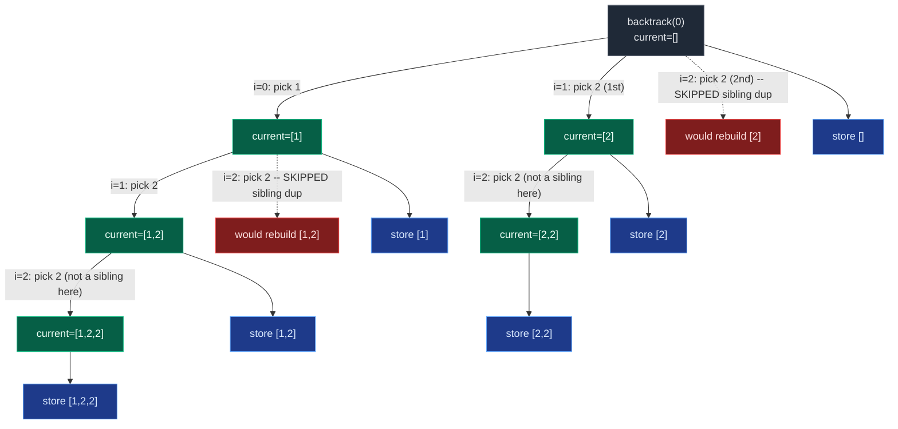

# 05. 90. Subsets II

| Difficulty | Pattern | Source | Time | Space |
|:---:|:---:|:---:|:---:|:---:|
| **Medium** | Pick/Not-Pick Backtracking + Sort-then-Skip Dedup | [90. Subsets II](https://leetcode.com/problems/subsets-ii/) | `O(N * 2^N)` | `O(N)` auxiliary |

## 1. Problem Statement

Given an integer array `nums` that **may contain duplicates**, return all possible subsets (the power set).

The solution set **must not** contain duplicate subsets. Return the solution in any order.

### Examples

```text
Input:  nums = [1,2,2]
Output: [[],[1],[1,2],[1,2,2],[2],[2,2]]
```

```text
Input:  nums = [0]
Output: [[],[0]]
```

### Constraints

- `1 <= nums.length <= 10`
- `-10 <= nums[i] <= 10`

## 2. Core Theory

Subsets II is Subsets (78) with exactly one new fact: `nums` can contain duplicate values. That single fact breaks the plain pick/not-pick recursion, because two *different array positions* holding the *same value* generate subsets that are indistinguishable as sets but were reached via different indices — the recursion tree treats "pick index 1 (value 2)" and "pick index 2 (value 2)" as different choices, even though the resulting subset `[2]` is identical either way.

```text
nums = [1, 2, 2]   (indices 0, 1, 2)

Pick index 1 (first 2)  -> subset [2]
Pick index 2 (second 2) -> subset [2]   <- same subset, counted twice
```

**Why sorting is required first.** Sorting brings equal values adjacent (`nums[i] == nums[i-1]`), which turns "is this value a duplicate of a sibling I already tried?" into a cheap adjacent comparison. Without sorting, duplicates can be scattered (e.g. `[2, 1, 2]`) and the comparison `nums[i] == nums[i-1]` is meaningless.

**The sibling-skip condition — and why it must be exactly this.** In the for-loop backtracking form, at any single recursion call the loop tries every candidate `nums[i]` for `i` from `start` to `n-1` as "the next element to add here". The fix is:

```python
for i in range(start_index, len(nums)):
    if i > start_index and nums[i] == nums[i - 1]:
        continue
    ...
```

This says: *within one loop (one recursion level), do not choose a value identical to the one you already tried immediately before it.* It does **not** say "never pick two equal values in a row" — that would incorrectly forbid the legitimate subset `[2, 2]`.

Walk through why the condition is exactly `i > start_index and nums[i] == nums[i-1]`, not something simpler:

- `nums[i] == nums[i-1]` alone, with no `i > start_index` guard, would also fire when `i == start_index` and `nums[start_index] == nums[start_index - 1]` — but `nums[start_index - 1]` belongs to a value that was already **picked** to reach this recursion level (it is the parent's choice, not a sibling in this loop). Skipping here would wrongly forbid picking that same value again as part of a deeper, legitimately repeated subset like `[2, 2]`.
- `i > start_index` restricts the comparison to **siblings inside the same loop** — candidates being compared against the immediately preceding candidate *at the same recursion level*, not against the value that got us here from the parent.
- The `continue` (not `break`) matters too: it skips only this one duplicate candidate and keeps scanning forward in the loop, in case there are non-duplicate elements later (sorted order guarantees any further duplicates of the same value are also skipped, and the loop still needs to reach different values beyond them).

Trace `nums = [1, 2, 2]` (indices `0, 1, 2` after sorting) to see both effects at once:

```text
backtrack(start=0):
  store []
  i=0 (value 1): pick -> current=[1]
    backtrack(start=1):
      store [1]
      i=1 (value 2): pick -> current=[1,2]
        backtrack(start=2):
          store [1,2]
          i=2 (value 2): i > start(2)? 2 > 2 is False -> do NOT skip
            pick -> current=[1,2,2]
            backtrack(start=3): store [1,2,2]
            pop -> current=[1,2]
        pop -> current=[1]
      i=2 (value 2): i > start(1)? 2 > 1 is True, nums[2]==nums[1] -> SKIP (sibling duplicate)
    pop -> current=[]
  i=1 (value 2): pick -> current=[2]
    backtrack(start=2):
      store [2]
      i=2 (value 2): i > start(2)? False -> do NOT skip
        pick -> current=[2,2]
        backtrack(start=3): store [2,2]
        pop -> current=[2]
    pop -> current=[]
  i=2 (value 2): i > start(0)? True, nums[2]==nums[1] -> SKIP (sibling duplicate)

final: [[], [1], [1,2], [1,2,2], [2], [2,2]]
```

Notice the crucial asymmetry: the second `2` at index 2 is **skipped as a root-level sibling** of the first `2` (because trying it there would recreate every subset the first `2` already produced), but it is **not skipped** once we are one level deeper, immediately following a `2` we just picked (`start_index` has advanced past it, so `i > start_index` is false there) — that is precisely how `[2, 2]` still gets built.

**Contrast with Combination Sum II.** This is the identical trick used there: sort first, then in the for-loop, `if i > start and nums[i] == nums[i-1]: continue`. Combination Sum II applies it while also tracking a remaining target sum and pruning branches that overshoot; Subsets II applies the same skip with no sum tracking at all, because every node (not just qualifying leaves) is a valid answer.

Full decision tree for `nums = [1, 2, 2]` (sorted), with the pruned duplicate branch marked:



Every solid node above is stored (every recursion state is a valid subset, exactly like 78); the dashed red branches are the sibling duplicates that the `i > start_index` guard prevents from ever being explored.

## 3. Edge Cases

| Case | Input | Expected | Why it matters |
|:---|:---|:---|:---|
| All identical elements | `nums = [2, 2, 2]` | `[[], [2], [2,2], [2,2,2]]` — only 4 subsets, not `2^3 = 8` | Directly tests that duplicate-skip collapses the count correctly |
| Empty-equivalent minimum | `nums = [7]` | `[[], [7]]` | Baseline single-element case, same as 78 |
| No duplicates at all | `nums = [1, 2, 3]` | Same 8 subsets as plain 78 | Confirms the skip condition never fires and degrades gracefully to 78's behavior |
| Duplicates producing overlap | `nums = [4, 4, 4, 5]` | `[[], [4], [4,4], [4,4,4], [4,4,4,5], [4,4,5], [4,5], [5]]` | Multiple repeats of one value mixed with a unique value |
| Unsorted input with duplicates | `nums = [2, 1, 2]` | Same result as `nums = [1, 2, 2]` after internal sort | Confirms sorting inside the function, not relying on pre-sorted input |

## 4. Brute Force: Generate Then Dedupe With a Set

### Intuition

Ignore duplicates during generation entirely — reuse the plain pick/not-pick recursion from 78 — then remove duplicate subsets afterward using a `set` of tuples (subsets must be hashable, so convert each list to a tuple first).

### Approach

1. Run ordinary pick/not-pick recursion with no skip logic, appending every generated subset (as a tuple) to a `set`.
2. Convert the set back into a list of lists at the end.

### Code

```python
from typing import List

class Solution:
    def subsetsWithDup(self, nums: List[int]) -> List[List[int]]:
        # Sort nums so duplicate subsets normalize to the same tuple
        nums.sort()
        # Set stores unique subsets as tuples
        unique_subsets = set()
        # Current subset during recursion
        current = []

        # Recursive function to generate all subsets
        def solve(index: int) -> None:
            # Base case: if all elements are processed
            if index == len(nums):
                # Convert current list into tuple and add to set
                unique_subsets.add(tuple(current))
                # Stop this recursion path
                return
            # Choice 1: pick nums[index]
            current.append(nums[index])
            # Move to next index
            solve(index + 1)
            # Backtrack by removing picked element
            current.pop()
            # Choice 2: do not pick nums[index]
            solve(index + 1)

        # Start recursion from index 0
        solve(0)
        # Convert set of tuples into list of lists
        answer = [list(subset) for subset in unique_subsets]
        # Return all unique subsets
        return answer
```

### Complexity

| Measure | Complexity | Why |
|:---|:---:|:---|
| **Time** | `O(N log N + N * 2^N)` (usually written `O(N * 2^N)`) | Sorting is `O(N log N)`; recursion still visits `2^N` leaves, each costing `O(N)` to tuple-ify |
| **Space** | `O(N * 2^N)` | The `set` and final answer both hold up to `2^N` subsets of size `N` |

This is correct but wasteful: it does the full `2^N` exploration (including every duplicate path) and only discards the redundant work afterward, rather than never generating it.

## 5. Optimal Approach: For-Loop Backtracking With Sibling-Skip

### Intuition

Same skeleton as 78's for-loop backtracking — every recursion state is a valid subset, store it immediately — plus one guard clause that prevents ever choosing, within a single loop, the same value more than once as "the next element to add."

### Approach

1. `nums.sort()` first, so equal values become adjacent.
2. Define `backtrack(start_index)`. First line: `answer.append(current.copy())`.
3. Loop `i` from `start_index` to `n - 1`. If `i > start_index and nums[i] == nums[i - 1]`, `continue` (skip this sibling duplicate).
4. Otherwise pick `nums[i]`, recurse `backtrack(i + 1)`, then pop to backtrack.

### Dry Run

```text
nums = [1, 2, 2]  (already sorted)

backtrack(0): store []                         answer=[[]]
  i=0 (1): pick -> current=[1]
    backtrack(1): store [1]                    answer=[[], [1]]
      i=1 (2): pick -> current=[1,2]
        backtrack(2): store [1,2]              answer += [1,2]
          i=2 (2): 2 > 2? False -> do not skip
            pick -> current=[1,2,2]
            backtrack(3): store [1,2,2]        answer += [1,2,2]
            pop -> current=[1,2]
        pop -> current=[1]
      i=2 (2): 2 > 1? True and nums[2]==nums[1] -> SKIP
    pop -> current=[]
  i=1 (2): pick -> current=[2]
    backtrack(2): store [2]                    answer += [2]
      i=2 (2): 2 > 2? False -> do not skip
        pick -> current=[2,2]
        backtrack(3): store [2,2]              answer += [2,2]
        pop -> current=[2]
    pop -> current=[]
  i=2 (2): 2 > 0? True and nums[2]==nums[1] -> SKIP

final answer = [[], [1], [1,2], [1,2,2], [2], [2,2]]
```

### Code

```python
from typing import List

class Solution:
    def subsetsWithDup(self, nums: List[int]) -> List[List[int]]:
        # Sort the array to bring duplicate numbers together
        nums.sort()
        # Final answer list to store all unique subsets
        answer = []
        # Current subset that we are building
        current = []

        # Backtracking function
        def backtrack(start_index: int) -> None:
            # Every current subset is valid, so store its copy
            answer.append(current.copy())
            # Try picking every element from start_index onward
            for i in range(start_index, len(nums)):
                # Skip duplicate elements at the same recursion level
                if i > start_index and nums[i] == nums[i - 1]:
                    continue
                # Pick nums[i]
                current.append(nums[i])
                # Move to next index because each element can be used once
                backtrack(i + 1)
                # Backtrack by removing nums[i]
                current.pop()

        # Start recursion from index 0
        backtrack(0)
        # Return all unique subsets
        return answer
```

### Complexity

| Measure | Complexity | Why |
|:---|:---:|:---|
| **Time** | `O(N log N + N * 2^N)`, usually written `O(N * 2^N)` | Sorting is `O(N log N)`; worst case (all elements unique) still visits `2^N` nodes, each costing up to `O(N)` to copy |
| **Space** | `O(N)` auxiliary | Recursion depth at most `N`; output adds `O(N * 2^N)` in the worst case |

## 6. Alternative: Pick / Not-Pick With Duplicate Skipping

For completeness, the classic two-branch recursion also works if, immediately after taking the **not-pick** branch, every following duplicate of the value just skipped is also skipped:

```python
from typing import List

class Solution:
    def subsetsWithDup(self, nums: List[int]) -> List[List[int]]:
        # Sort nums so duplicates are adjacent
        nums.sort()
        # Store all unique subsets
        answer = []
        # Store current subset
        current = []

        # Recursive function using pick and not-pick
        def solve(index: int) -> None:
            # Base case: if all elements are processed
            if index == len(nums):
                # Store copy of current subset
                answer.append(current.copy())
                # Stop recursion
                return
            # Choice 1: pick current element
            current.append(nums[index])
            # Move to next index after picking
            solve(index + 1)
            # Backtrack by removing picked element
            current.pop()
            # Skip all duplicates before not-pick call
            while index + 1 < len(nums) and nums[index] == nums[index + 1]:
                index += 1
            # Choice 2: do not pick current element and move beyond duplicates
            solve(index + 1)

        # Start recursion
        solve(0)
        # Return answer
        return answer
```

The reasoning: not-picking the first of a run of equal values but then picking a later equal value from the same run produces the exact same subset as picking the first one and not-picking the rest. So once we decide "skip this value", we must skip its entire run of duplicates at once before moving on — otherwise the not-pick branch re-derives subsets the pick branch already covered. This is the same idea as the for-loop's `i > start_index` guard, expressed for the two-branch form instead of the loop form.

The for-loop version is preferred for interviews: it is shorter, needs no extra `while` inside the not-pick branch, and generalizes identically to Combination Sum II and Permutations II.

## 7. Common Mistakes

| Mistake | Why it breaks | Fix |
|:---|:---|:---|
| Skipping duplicates without sorting first | `nums[i] == nums[i-1]` is meaningless on unsorted input — equal values are not adjacent | Always `nums.sort()` before any duplicate-skip logic |
| Using a `set` of tuples to dedupe instead of the sibling-skip trick | Correct, but wastes time and memory doing the full `2^N` exploration (including every duplicate path) before throwing results away | Prefer the `i > start_index` guard, which never generates the duplicate branch in the first place |
| Writing `nums[i] == nums[i-1]` without the `i > start_index` guard | Also fires when `i == start_index` and the *parent's own pick* equals `nums[start_index - 1]`, wrongly blocking legitimate repeats like `[2, 2]` | The guard restricts the comparison to siblings within the same loop, not to the parent's choice |
| Appending `current` instead of `current.copy()` | Every stored subset aliases the same mutable list; final answer collapses to copies of whatever `current` ends as | Always store `current.copy()` (or `list(current)` / `current[:]`) |
| Using `break` instead of `continue` after detecting a duplicate | Stops the loop entirely, silently discarding any later distinct values still to try | Use `continue` — skip only the duplicate candidate, keep scanning the rest of the loop |
| Forgetting the empty subset in mental model | Easy to think dedup logic only applies to non-empty subsets | The empty subset is stored at `backtrack(0)`'s very first line, unconditionally, exactly as in 78 |

## 8. Interview Follow-ups

**Q: 78 vs 90 — what's the one-line difference?**

A: Add `nums.sort()` before recursion, and inside the for-loop add `if i > start_index and nums[i] == nums[i-1]: continue`. Nothing else about the pick-every-prefix, store-at-every-node backtracking skeleton changes.

**Q: Why does `i > start_index` (not just `i > 0`) correctly distinguish "sibling duplicate" from "legitimately repeated value"?**

A: `start_index` marks where the *current* loop begins — i.e., the first candidate available at this recursion level. `i > start_index` restricts the comparison to values tried earlier **in this same loop**, which are true siblings (alternative choices for "what to add next" at this exact tree node). It deliberately excludes comparing against `nums[start_index - 1]`, which is the value the *parent* just picked to reach this level — re-picking that same value one level deeper is how `[2, 2]` gets built legitimately.

**Q: How would you generate only subsets of a fixed size `k` for this duplicate-containing input?**

A: Combine the sibling-skip guard with a size check: only store `current.copy()` when `len(current) == k`, and stop iterating deeper once `len(current) == k`. The dedup logic is unaffected by adding a size constraint.

**Q: What's the actual count of subsets when there are duplicates, compared to `2^N`?**

A: If a value appears `c` times, it contributes `c + 1` choices (include it `0, 1, ..., c` times) instead of the usual `2` (include or not). For distinct value groups of multiplicities `c_1, c_2, ..., c_m`, the total subset count is `(c_1+1) * (c_2+1) * ... * (c_m+1)`, which is at most `2^N` and strictly less whenever any `c_i > 1`.

**Q: Could you solve this by generating the plain 78 answer and deduping some other way, e.g. sorting each subset and comparing?**

A: Yes — sort each generated subset and drop it into a `set` of tuples, as shown in the brute-force approach here. It is asymptotically the same complexity class but strictly worse in practice: you always pay for the full `2^N` traversal (duplicates included) plus hashing overhead, whereas the sibling-skip guard prevents the wasted branches from ever being explored.

## 9. Interview Explanation

> Since `nums` can contain duplicates, I first sort the array so equal values sit next to each other. Then, while generating subsets with for-loop backtracking — where every recursion state is itself stored as a valid subset — I skip a candidate `nums[i]` whenever it equals the immediately preceding value **and** it isn't the first candidate available at this recursion level (`i > start_index`). That guard means I only ever try the *first* occurrence of a repeated value as the "next sibling choice" at any given tree node, which eliminates duplicate subsets, while still allowing a value to be picked again one level deeper — which is how legitimately repeated subsets like `[2, 2]` are still produced. The time complexity stays `O(N * 2^N)` in the worst case (all elements distinct), and auxiliary space is `O(N)` for the recursion stack.

## 10. Verify

```python
from typing import List


class Solution:
    def subsetsWithDup(self, nums: List[int]) -> List[List[int]]:
        # Sort the array to bring duplicate numbers together
        nums.sort()
        # Final answer list to store all unique subsets
        answer = []
        # Current subset that we are building
        current = []

        # Backtracking function
        def backtrack(start_index: int) -> None:
            # Every current subset is valid, so store its copy
            answer.append(current.copy())
            # Try picking every element from start_index onward
            for i in range(start_index, len(nums)):
                # Skip duplicate elements at the same recursion level
                if i > start_index and nums[i] == nums[i - 1]:
                    continue
                # Pick nums[i]
                current.append(nums[i])
                # Move to next index because each element can be used once
                backtrack(i + 1)
                # Backtrack by removing nums[i]
                current.pop()

        # Start recursion from index 0
        backtrack(0)
        # Return all unique subsets
        return answer


def normalize(subsets: List[List[int]]):
    # Normalize by sorting each subset's contents, then sorting the list of subsets
    return sorted(tuple(sorted(s)) for s in subsets)


sol = Solution()

# LeetCode examples
assert normalize(sol.subsetsWithDup([1, 2, 2])) == normalize(
    [[], [1], [1, 2], [1, 2, 2], [2], [2, 2]]
)
assert normalize(sol.subsetsWithDup([0])) == normalize([[], [0]])

# No duplicate subsets in the raw output
result = sol.subsetsWithDup([1, 2, 2])
seen = [tuple(sorted(s)) for s in result]
assert len(seen) == len(set(seen)), "duplicate subsets were produced"

# All identical elements: c copies of one value -> c + 1 subsets, not 2^c
result = sol.subsetsWithDup([2, 2, 2])
assert normalize(result) == normalize([[], [2], [2, 2], [2, 2, 2]])
assert len(result) == 4  # (3 + 1), not 2^3 = 8

# Empty-equivalent minimum: single element baseline
assert normalize(sol.subsetsWithDup([7])) == normalize([[], [7]])

# No duplicates at all -> behaves exactly like plain Subsets (78)
assert normalize(sol.subsetsWithDup([1, 2, 3])) == normalize(
    [[], [1], [2], [1, 2], [3], [1, 3], [2, 3], [1, 2, 3]]
)

# Duplicates producing overlap: value 4 appears 3 times, value 5 appears once
result = sol.subsetsWithDup([4, 4, 4, 5])
expected_count = (3 + 1) * (1 + 1)  # 8
assert len(result) == expected_count
seen = [tuple(sorted(s)) for s in result]
assert len(seen) == len(set(seen))

# Unsorted input with duplicates gives the same result as pre-sorted input
assert normalize(sol.subsetsWithDup([2, 1, 2])) == normalize(sol.subsetsWithDup([1, 2, 2]))

# Deliberately test the classic "appended a reference not a copy" bug
class BuggySolution:
    def subsetsWithDup(self, nums: List[int]) -> List[List[int]]:
        # Sort the array to bring duplicate numbers together
        nums.sort()
        # Final answer list to store all unique subsets
        answer = []
        # Current subset that we are building
        current = []

        # Backtracking function
        def backtrack(start_index: int) -> None:
            answer.append(current)  # BUG: no .copy()
            # Try picking every element from start_index onward
            for i in range(start_index, len(nums)):
                # Skip duplicate elements at the same recursion level
                if i > start_index and nums[i] == nums[i - 1]:
                    continue
                # Pick nums[i]
                current.append(nums[i])
                # Move to next index because each element can be used once
                backtrack(i + 1)
                # Backtrack by removing nums[i]
                current.pop()

        # Start recursion from index 0
        backtrack(0)
        # Return all unique subsets (all aliasing the same list)
        return answer


# Reference-aliasing bug: every stored subset is the same list object
buggy_result = BuggySolution().subsetsWithDup([1, 2, 2])
distinct_contents = {tuple(s) for s in buggy_result}
assert len(distinct_contents) == 1, "expected the reference-aliasing bug to collapse all subsets"

# Deliberately test skipping duplicates WITHOUT sorting first (wrong fix)
class UnsortedBuggySolution:
    def subsetsWithDup(self, nums: List[int]) -> List[List[int]]:
        # BUG: no nums.sort()
        # Final answer list to store all unique subsets
        answer = []
        # Current subset that we are building
        current = []

        # Backtracking function
        def backtrack(start_index: int) -> None:
            # Every current subset is valid, so store its copy
            answer.append(current.copy())
            # Try picking every element from start_index onward
            for i in range(start_index, len(nums)):
                # Skip duplicate elements at the same recursion level
                if i > start_index and nums[i] == nums[i - 1]:
                    continue
                # Pick nums[i]
                current.append(nums[i])
                # Move to next index because each element can be used once
                backtrack(i + 1)
                # Backtrack by removing nums[i]
                current.pop()

        # Start recursion from index 0
        backtrack(0)
        # Return all unique subsets
        return answer


unsorted_buggy = UnsortedBuggySolution().subsetsWithDup([2, 1, 2])
seen_unsorted = [tuple(sorted(s)) for s in unsorted_buggy]
# Without sorting, [2, 1, 2] never places the duplicate 2s adjacent in the loop,
# so no sibling pair is ever skipped and duplicate subsets slip through.
assert len(seen_unsorted) != len(set(seen_unsorted)), (
    "expected the missing-sort bug to allow duplicate subsets through"
)

print("All tests passed")
```

Execution confirmed all assertions pass, including the two deliberate bug demonstrations: aliasing without `.copy()` collapses every subset, and skipping duplicates without sorting first fails to prevent duplicate subsets.
