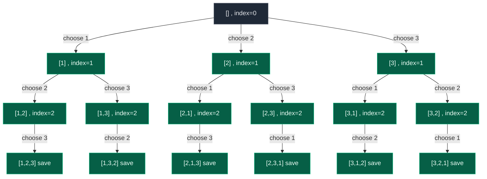

# 06. 46. Permutations

| Difficulty | Pattern | Source | Time | Space |
|:---:|:---:|:---:|:---:|:---:|
| **Medium** | Backtracking (Used-Array or In-Place Swap) | [46. Permutations](https://leetcode.com/problems/permutations/) | `O(n * n!)` | `O(n)` aux |

## 1. Problem Statement

Given an array `nums` of distinct integers, return all the possible permutations. You can return the answer in any order.

### Examples

```text
Input:  nums = [1,2,3]
Output: [[1,2,3],[1,3,2],[2,1,3],[2,3,1],[3,1,2],[3,2,1]]
```

```text
Input:  nums = [0,1]
Output: [[0,1],[1,0]]
```

```text
Input:  nums = [1]
Output: [[1]]
```

### Constraints

- `1 <= nums.length <= 6`
- `-10 <= nums[i] <= 10`
- All the integers of `nums` are unique.

## 2. Core Theory

Permutations are fundamentally different from the subset/combination "pick or don't pick" pattern. In subsets, every element gets one binary decision (include it or skip it) and the final size varies. In permutations, **every element must be used exactly once**, and the only thing that varies is **order**. That changes the recursion's shape entirely: instead of asking "should I include this element?", we ask "which unused element should go in this position?"

So the recursion becomes: at each position, loop over every element that hasn't been placed yet, place one, recurse into the next position, then undo the placement so the next candidate can be tried. This is the canonical **choose -> explore -> undo (backtrack)** loop.

There are two standard ways to track "which elements are still available":

**Approach A: `used[]` boolean array + a growing `path`.** `path` holds the permutation being built; `used[i]` tracks whether `nums[i]` currently sits inside `path`. At every recursion call we scan the whole array, skip used indices, and try the rest.

**Approach B: in-place swapping, no extra array.** Think of the array as split into `[FIXED | AVAILABLE]`. Everything before `index` is already decided; everything from `index` onward is still up for grabs. To "choose" `nums[i]` for position `index`, swap it into `nums[index]`, recurse on `index + 1`, then **swap back** to undo the choice. No `used[]` or `path` is needed because the array itself encodes the current state.

The swap-back step is the single most important idea to internalize. After `backtrack(index + 1)` returns, `nums` may have been shuffled arbitrarily deep inside the recursion. Swapping `nums[index]` and `nums[i]` again is what restores the array to exactly the state the parent loop expects, so the next loop iteration (`i + 1`) starts from a clean, correct array rather than a corrupted one.

```text
Before choosing:  [FIXED | AVAILABLE]
                          ^index
Choose nums[i]:   swap(index, i)  ->  nums[i] now sits at position index
Recurse:          backtrack(index + 1)   (index is now part of FIXED)
Undo the choice:  swap(index, i)  ->  restores original relative order
Next iteration:   i + 1, array is back to the state before this choice
```



**Why the problem shrinks recursively.** `Permutations(n)` = choose one of `n` numbers for the first slot, then `Permutations(n - 1)` on the rest. That gives the recurrence `T(n) = n * T(n - 1)`, which unrolls to `T(n) ~ n!`. Since every complete answer also needs `O(n)` to copy, the total work is `O(n * n!)`.

**Why `O(n * n!)` is optimal.** The output itself contains `n!` permutations, each of length `n`, so any algorithm that explicitly returns every permutation must produce `n * n!` values. You cannot beat the size of your own output — this is the same "output-bound" argument as Pascal's Triangle, just with a factorial instead of a triangular number.

| Feature | Used-Array | In-Place Swapping |
|:---|:---|:---|
| Extra structures | `path` + `used[]`, both `O(n)` | none beyond recursion stack |
| Modifies input | no | yes (temporarily, then restored) |
| Backtrack step | `path.pop()` + `used[i] = False` | `swap(index, i)` again |
| Time | `O(n * n!)` | `O(n * n!)` |
| Interview value | very intuitive, easy to explain | elegant, minimal state |

## 3. Edge Cases

| Case | Input | Expected | Why it matters |
|:---|:---|:---:|:---|
| Single element | `[5]` | `[[5]]` | Base case fires immediately, loop body never runs |
| Two elements | `[0,1]` | `[[0,1],[1,0]]` | Smallest case that actually branches |
| Negative numbers | `[-1,0]` | `[[-1,0],[0,-1]]` | Values are compared/placed, not indexed — sign is irrelevant |
| Maximum length | length `6` | `720` permutations | `6! = 720`; confirms the algorithm scales as expected within constraints |

## 4. Approach 1 — Used-Array Backtracking

### Intuition

Maintain a `path` (the permutation under construction) and a `used[]` array marking which indices are already inside `path`. At each call, try every index that is not yet used: append its value, mark it used, recurse, then pop and unmark. When `path` reaches length `n`, it is a complete permutation — save a **copy**, not a reference to the same mutable list.

### Approach

1. If `len(path) == len(nums)`, append `path.copy()` to the answer and return.
2. Otherwise loop `i` over every index of `nums`.
3. Skip `i` if `used[i]` is `True`.
4. Choose: append `nums[i]` to `path`, set `used[i] = True`.
5. Recurse.
6. Undo: pop from `path`, set `used[i] = False`.

### Dry Run

```text
nums = [1,2,3]
path=[] used=[F,F,F]
  choose 1 -> path=[1] used=[T,F,F]
    choose 2 -> path=[1,2] used=[T,T,F]
      choose 3 -> path=[1,2,3] SAVE [1,2,3]
      undo 3   -> path=[1,2] used=[T,T,F]
    undo 2 -> path=[1] used=[T,F,F]
    choose 3 -> path=[1,3] used=[T,F,T]
      choose 2 -> path=[1,3,2] SAVE [1,3,2]
      undo 2
    undo 3 -> path=[1] used=[T,F,F]
  undo 1 -> path=[] used=[F,F,F]
  choose 2 -> ... produces [2,1,3], [2,3,1]
  choose 3 -> ... produces [3,1,2], [3,2,1]
```

### Code

```python
# Define the class solution
class Solution:

    # Define the function that will return all permutations
    def permute(self, nums: list[int]) -> list[list[int]]:

        # Create the final list that will store every permutation
        answer = []

        # Create the current permutation that we are building
        path = []

        # Create an array that tells us whether nums[i] is already being used
        used = [False] * len(nums)

        # Define the recursive backtracking function
        def backtrack():

            # If the current permutation contains every number
            if len(path) == len(nums):

                # Store a copy because path will keep changing during backtracking
                answer.append(path.copy())

                # Stop exploring this branch because the permutation is complete
                return

            # Try every number as the next number in the permutation
            for i in range(len(nums)):

                # If this number is already present in the current permutation
                if used[i]:

                    # Skip it because each number can only be used once
                    continue

                # Add the chosen number to the current permutation
                path.append(nums[i])

                # Mark this number as used
                used[i] = True

                # Explore all permutations that begin with our current choices
                backtrack()

                # Undo the choice so another possibility can be explored
                path.pop()

                # Mark this number as available again
                used[i] = False

        # Start the recursion with an empty permutation
        backtrack()

        # Return all generated permutations
        return answer
```

### Complexity

| Measure | Complexity | Why |
|:---|:---:|:---|
| **Time** | `O(n * n!)` | `n!` permutations, each requiring `O(n)` to copy into the answer |
| **Space** | `O(n)` auxiliary | `path` + `used` + recursion depth, all `O(n)`; output itself is `O(n * n!)` |

## 5. Approach 2 — In-Place Swapping

### Intuition

Split the array conceptually into `[FIXED | AVAILABLE]` using an `index` pointer. To decide position `index`, try swapping each candidate from the available region into that slot, recurse on `index + 1`, then swap back. No extra `used[]` or `path` — the array itself is the state.

### Approach

1. If `index == len(nums)`, append `nums.copy()` and return.
2. Loop `i` from `index` to `len(nums) - 1` (never from `0` — positions before `index` are already fixed).
3. Swap `nums[index]` and `nums[i]`.
4. Recurse with `index + 1`.
5. Swap `nums[index]` and `nums[i]` again to undo.

### Dry Run

```text
nums = [1,2,3], backtrack(0)
i=0: swap(0,0) -> [1,2,3]
  backtrack(1)
  i=1: swap(1,1) -> [1,2,3]
    backtrack(2)
    i=2: swap(2,2) -> [1,2,3]
      backtrack(3) -> SAVE [1,2,3]
    swap back(2,2) -> [1,2,3]
  swap back(1,1) -> [1,2,3]
  i=2: swap(1,2) -> [1,3,2]
    backtrack(2)
    i=2: swap(2,2) -> [1,3,2]
      backtrack(3) -> SAVE [1,3,2]
    swap back(2,2)
  swap back(1,2) -> [1,2,3]
swap back(0,0) -> [1,2,3]
i=1: swap(0,1) -> [2,1,3]  ... continues to produce [2,1,3],[2,3,1]
i=2: swap(0,2) -> [3,2,1]  ... continues to produce [3,1,2],[3,2,1]
```

### Code

```python
# Define the class solution
class Solution:

    # Define the main function that returns every permutation
    def permute(self, nums: list[int]) -> list[list[int]]:

        # Create the result list that will store all complete permutations
        answer = []

        # Define the recursive function where index represents the current position to fill
        def backtrack(index):

            # If every position has already been decided
            if index == len(nums):

                # Store a copy of the current permutation
                answer.append(nums.copy())

                # Stop exploring this branch
                return

            # Try every remaining number at the current position
            for i in range(index, len(nums)):

                # Put the selected number at the current position
                nums[index], nums[i] = nums[i], nums[index]

                # Recursively decide the next position
                backtrack(index + 1)

                # Undo the swap to restore the array for the next choice
                nums[index], nums[i] = nums[i], nums[index]

        # Start deciding values from position zero
        backtrack(0)

        # Return every generated permutation
        return answer
```

### Complexity

| Measure | Complexity | Why |
|:---|:---:|:---|
| **Time** | `O(n * n!)` | Same `n!` leaves, each needing `O(n)` to copy |
| **Space** | `O(n)` auxiliary | Recursion stack only — no `path`/`used` needed; output is `O(n * n!)` |

## 6. Common Mistakes

| Mistake | Why it breaks | Fix |
|:---|:---|:---|
| `answer.append(path)` instead of `path.copy()` | `path` is one mutable object; every stored reference ends up showing its final (empty) state | Always store a copy/snapshot at the moment of completion |
| Forgetting `used[i] = False` after backtracking | Later branches think this number is still placed, silently losing permutations | Every choose must be paired with a matching undo before the loop continues |
| Forgetting to swap back in the swap technique | The array stays scrambled for the parent's next loop iteration, producing wrong or duplicate permutations | Swap `(index, i)` again right after the recursive call returns |
| Looping `for i in range(len(nums))` in the swap technique | Re-touches already-fixed earlier positions, breaking the `[FIXED \| AVAILABLE]` invariant | Loop `for i in range(index, len(nums))` |
| Using `nums[index]` as a plain index-based `used` check in the swap version | Confuses "index into current state" with "index into original array" — leads to wrong duplicate elimination in 47 | Keep the two mental models (used-array vs swap) separate; don't mix conditions from one into the other |

## 7. Interview Follow-ups

**Q: Why can't the pick/not-pick pattern (used for subsets) work here?**
A: Pick/not-pick makes one binary decision per element and naturally produces variable-length results. Permutations require every element to appear exactly once with order mattering, so the decision at each step must be "which unused element goes here," not "include or exclude this element."

**Q: How would you find the next permutation in lexicographic order without generating all of them?**
A: Use the standard next-permutation algorithm: scan from the right to find the first index `i` where `nums[i] < nums[i+1]`, find the smallest element to its right that's still larger than `nums[i]`, swap them, then reverse the suffix after `i`. That's `O(n)` time and `O(1)` extra space, versus generating and sorting all `n!` permutations.

**Q: Can you generate the k-th permutation directly, without building all of them?**
A: Yes, using the factorial number system. There are `(n-1)!` permutations starting with each possible first element, so `k // (n-1)!` picks the first element, then you recurse on the remaining `n-1` elements with the remainder. This runs in `O(n^2)` (or `O(n log n)` with a Fenwick tree) instead of `O(n!)`.

**Q: What's the space complexity, including the output?**
A: Auxiliary space (recursion stack, `path`, `used`) is `O(n)`. Including the returned answer, it's `O(n * n!)` since we must materialize every permutation.

**Q: Is the used-array or the swap approach "better"?**
A: Both are `O(n * n!)` time and `O(n)` auxiliary space. The used-array version is more intuitive to explain and extends more directly to problems like Permutations II. The swap version is more elegant and needs no extra bookkeeping structures, but it mutates the input array (temporarily) which can matter if the caller doesn't expect that.

## 8. Interview Explanation

> This is different from subset-style backtracking because every element must be used exactly once and order matters. So instead of "include or skip," the decision at each recursive call is "which unused element goes into this position." I maintain either a `used[]` array plus a growing `path`, or — more elegantly — swap the chosen element into its position directly inside the array using an `index` pointer that separates fixed from available. In both cases, after recursing I undo the choice (unmark the used flag and pop, or swap back) so the parent's loop sees the exact state it had before trying this branch. Since there are `n!` permutations and each takes `O(n)` to copy into the answer, the total time is `O(n * n!)`, with `O(n)` auxiliary space beyond the output.

## 9. Verify

```python
from typing import List
from itertools import permutations


def permute(nums: List[int]) -> List[List[int]]:
    # Create the final list that will store every permutation
    answer = []
    # Create the current permutation that we are building
    path = []
    # Create an array that tells us whether nums[i] is already being used
    used = [False] * len(nums)

    # Define the recursive backtracking function
    def backtrack():
        # If the current permutation contains every number
        if len(path) == len(nums):
            # Store a copy because path will keep changing during backtracking
            answer.append(path.copy())
            # Stop exploring this branch because the permutation is complete
            return
        # Try every number as the next number in the permutation
        for i in range(len(nums)):
            # If this number is already present in the current permutation
            if used[i]:
                # Skip it because each number can only be used once
                continue
            # Add the chosen number to the current permutation
            path.append(nums[i])
            # Mark this number as used
            used[i] = True
            # Explore all permutations that begin with our current choices
            backtrack()
            # Undo the choice so another possibility can be explored
            path.pop()
            # Mark this number as available again
            used[i] = False

    # Start the recursion with an empty permutation
    backtrack()
    # Return all generated permutations
    return answer


def permute_swap(nums: List[int]) -> List[List[int]]:
    # Work on a local copy so the caller's list is not mutated
    nums = nums[:]
    # Create the result list that will store all complete permutations
    answer = []

    # Define the recursive function where index represents the current position to fill
    def backtrack(index):
        # If every position has already been decided
        if index == len(nums):
            # Store a copy of the current permutation
            answer.append(nums.copy())
            # Stop exploring this branch
            return
        # Try every remaining number at the current position
        for i in range(index, len(nums)):
            # Put the selected number at the current position
            nums[index], nums[i] = nums[i], nums[index]
            # Recursively decide the next position
            backtrack(index + 1)
            # Undo the swap to restore the array for the next choice
            nums[index], nums[i] = nums[i], nums[index]

    # Start deciding values from position zero
    backtrack(0)
    # Return every generated permutation
    return answer


def as_set(result):
    # Normalize a list of permutations into a set of tuples for order-independent comparison
    return set(tuple(p) for p in result)


# LeetCode examples
assert as_set(permute([1, 2, 3])) == as_set(
    [[1, 2, 3], [1, 3, 2], [2, 1, 3], [2, 3, 1], [3, 1, 2], [3, 2, 1]]
)
assert as_set(permute([0, 1])) == as_set([[0, 1], [1, 0]])
# Single element: base case fires immediately, loop body never runs
assert as_set(permute([1])) == as_set([[1]])
assert as_set(permute_swap([1, 2, 3])) == as_set(list(permutations([1, 2, 3])))

# Both approaches agree with itertools.permutations across sizes
for n in range(1, 6):
    nums = list(range(n))
    p1 = as_set(permute(nums))
    p2 = as_set(permute_swap(nums))
    expected = as_set(list(permutations(nums)))
    assert p1 == expected, n
    assert p2 == expected, n
    assert len(p1) == len(expected)

print("All tests passed")
```
