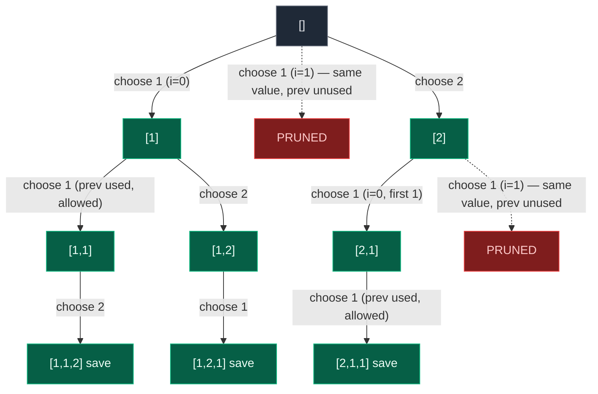

# 07. 47. Permutations II

| Difficulty | Pattern | Source | Time | Space |
|:---:|:---:|:---:|:---:|:---:|
| **Medium** | Backtracking + Sort + Same-Level Duplicate Pruning | [47. Permutations II](https://leetcode.com/problems/permutations-ii/) | `O(n * n!)` | `O(n)` aux |

## 1. Problem Statement

Given a collection of numbers, `nums`, that might contain duplicates, return all possible unique permutations in any order.

### Examples

```text
Input:  nums = [1,1,2]
Output: [[1,1,2],[1,2,1],[2,1,1]]
```

```text
Input:  nums = [1,2,3]
Output: [[1,2,3],[1,3,2],[2,1,3],[2,3,1],[3,1,2],[3,2,1]]
```

### Constraints

- `1 <= nums.length <= 8`
- `-10 <= nums[i] <= 10`

## 2. Core Theory

Permutations II is Permutations I plus exactly one new complication: the input may contain duplicate values, and the output must not contain duplicate permutations. Naively running problem 46's algorithm on `[1,1,2]` still explores `3! = 6` leaves, because the recursion tracks **indices**, not **values** — it cannot tell "the 1 at index 0" apart from "the 1 at index 1," so it treats swapping them as two different choices even though the resulting permutations are identical strings.

If there are `n` elements with duplicate value `v` appearing `f_v` times, the actual number of unique permutations is:

```text
              n!
U = ------------------------
    f1! * f2! * ... * fk!
```

For `[1,1,2]`: `n = 3`, `1` appears twice, `2` appears once, so `U = 3! / (2! * 1!) = 3`.

**The standard fix: sort, then skip duplicate choices at the same recursion level.** Sorting places equal values adjacent to each other, which makes it cheap to detect "this choice is identical to a sibling choice I already tried." The `used[]`-array approach (from 46) then adds one extra guard:

```python
if i > 0 and nums[i] == nums[i - 1] and not used[i - 1]:
    continue
```

This is one of the trickiest conditions in the whole recursion topic, so it deserves a precise reading, term by term:

- `i > 0 and nums[i] == nums[i - 1]`: the current candidate has the same *value* as the previous one in sorted order — a potential duplicate.
- `not used[i - 1]`: the identical previous element is **currently not part of the permutation being built** — meaning we already backtracked out of choosing it at this exact recursion level, fully explored that branch, and are now back at the same decision point trying its twin.

Putting it together: **if the identical previous element was already placed and then backtracked out of (its slot is free again) at this same level, choosing this duplicate now would generate the exact same future as the branch we just finished exploring.** That branch is a *sibling*, not a *descendant*, so we skip it. Conversely, if `used[i - 1]` is `True`, the previous identical element is still active deeper in the current path (a descendant relationship, e.g. building `[1, 1, ...]`), and placing this one is legitimate — it fills a different position in the same permutation.

```text
same LEVEL (siblings — skip the second):
             []
          /       \
         1         1
        ✅         ❌   <- previous identical "1" already tried and undone here

different LEVEL (parent/child — allow both):
             []
              |
              1
              |
              1        <- previous identical "1" is still active (used[i-1] = True)
             ✅
```

An equally valid alternative — used when the source solves 47 with the **swap** technique instead — is a `seen` set at each recursion level: before trying `nums[i]` for the current position, skip it if its *value* is already in `seen` for this call; otherwise add it. This sidesteps sort order entirely (no `used[i-1]` reasoning needed) because it directly asks "have I already tried this value as a candidate for this exact slot?"



Only three leaves survive out of the six a naive run would generate — exactly matching `U = 3! / 2! = 3`.

## 3. Edge Cases

| Case | Input | Expected | Why it matters |
|:---|:---|:---:|:---|
| Single element | `[5]` | `[[5]]` | No duplicates possible, base case fires immediately |
| Two identical elements | `[1,1]` | `[[1,1]]` | Tests that the dedup condition collapses `2!` naive leaves into `1` |
| All identical elements | `[2,2,2]` | `[[2,2,2]]` | Every sibling choice at every level is pruned except the first; only one permutation exists |
| Some duplicates, some unique | `[1,1,2]` | `[[1,1,2],[1,2,1],[2,1,1]]` | The canonical case the `used[i-1]` condition is built for |
| No duplicates at all | `[1,2,3]` | all `3! = 6` permutations | Confirms the dedup guard never fires when values are distinct, behaving exactly like problem 46 |

## 4. Approach 1 — Sort + Used-Array + Same-Level Pruning

### Intuition

Sort `nums` so equal values sit next to each other. Use the same `path` + `used[]` backtracking as problem 46, but add the guard `if i > 0 and nums[i] == nums[i - 1] and not used[i - 1]: continue` before making a choice. This guard fires only when we are about to re-explore a sibling branch that is guaranteed to produce a permutation identical to one already fully explored.

### Approach

1. Sort `nums`.
2. If `len(path) == len(nums)`, save a copy of `path` and return.
3. Loop `i` over every index.
4. Skip if `used[i]` is `True` (already in this permutation).
5. Skip if `i > 0 and nums[i] == nums[i - 1] and not used[i - 1]` (duplicate sibling branch).
6. Choose `nums[i]`, mark used, recurse, then undo (pop + unmark).

### Dry Run

```text
nums sorted = [1,1,2]
path=[] used=[F,F,F]

i=0: nums[0]=1, i>0 is False -> no skip. Choose.
  path=[1] used=[T,F,F]
  i=0: used[0]=True -> skip
  i=1: nums[1]=1 == nums[0]=1, used[0]=True -> NOT skipped (previous identical is in use). Choose.
    path=[1,1] used=[T,T,F]
    i=2: choose 2 -> path=[1,1,2] SAVE [1,1,2]
    undo -> path=[1,1] used=[T,T,F]
  undo -> path=[1] used=[T,F,F]
  i=2: choose 2 -> path=[1,2] used=[T,F,T]
    i=1: nums[1]=1, used[0]=False -> but i-1=0 here refers to nums[0]; used[0]=False means
         the identical previous element is NOT in use -> this is checked relative to sort
         position, and since path=[1,2] already used index 0, index 1 is the only 1 left,
         so it's chosen: path=[1,2,1] SAVE [1,2,1]
  undo all the way back to path=[] used=[F,F,F]

i=1: nums[1]=1 == nums[0]=1, used[0]=False -> SKIP (sibling duplicate of i=0's branch, already
     fully explored above)

i=2: nums[2]=2, choose it.
  path=[2] used=[F,F,T]
  i=0: choose first 1 -> path=[2,1] used=[T,F,T]
    i=1: nums[1]=1 == nums[0]=1, used[0]=True -> allowed. Choose.
      path=[2,1,1] SAVE [2,1,1]
  undo all the way back.

Final: [[1,1,2],[1,2,1],[2,1,1]]
```

### Code

```python
# Define the class solution
class Solution:

    # Define the function that returns all unique permutations
    def permuteUnique(self, nums: list[int]) -> list[list[int]]:

        # Sort the array so equal values appear next to each other
        nums.sort()

        # Create the final list that stores all unique permutations
        result = []

        # Create the current permutation that we are building
        path = []

        # Create an array that tracks which indexes are currently being used
        used = [False] * len(nums)

        # Define the recursive backtracking function
        def backtrack():

            # If the current permutation contains all numbers
            if len(path) == len(nums):

                # Store a copy of the completed permutation
                result.append(path.copy())

                # Stop exploring this completed branch
                return

            # Try every index as the next choice
            for i in range(len(nums)):

                # If this particular index is already used in the current permutation
                if used[i]:

                    # Skip it because one index cannot be used twice
                    continue

                # If this value equals the previous value and the previous copy
                # has not been used in the current branch
                if i > 0 and nums[i] == nums[i - 1] and not used[i - 1]:

                    # Skip this choice because it would create a duplicate sibling branch
                    continue

                # Add the current number to the permutation
                path.append(nums[i])

                # Mark the current index as used
                used[i] = True

                # Recursively build the remaining positions
                backtrack()

                # Remove the number that we just added
                path.pop()

                # Mark the current index as available again
                used[i] = False

        # Begin backtracking from an empty permutation
        backtrack()

        # Return all unique permutations
        return result
```

### Complexity

| Measure | Complexity | Why |
|:---|:---:|:---|
| **Time** | `O(n * n!)` worst case | Distinct-value input degenerates to problem 46; `O(n log n)` sort is dominated by this |
| **Space** | `O(n)` auxiliary | `path` + `used` + recursion depth; output holds up to `n!` permutations of length `n` |

## 5. Approach 2 — In-Place Swap + Level `seen` Set

### Intuition

Use the same `[FIXED | AVAILABLE]` swap technique from problem 46, but at each recursion level maintain a `seen` set of *values* already tried for the current position. If `nums[i]`'s value is already in `seen`, skip it — a value can only be chosen once per slot, regardless of which index it came from. This needs no sort and no `used[i-1]` reasoning at all.

### Approach

1. If `index == len(nums)`, save a copy of `nums` and return.
2. Create an empty `seen` set for this call.
3. Loop `i` from `index` to `len(nums) - 1`.
4. Skip `i` if `nums[i]` is already in `seen`.
5. Add `nums[i]` to `seen`.
6. Swap `nums[index]` and `nums[i]`, recurse on `index + 1`, swap back.

### Dry Run

```text
nums = [1,1,2], backtrack(0)
seen = {}
i=0: nums[0]=1 not in seen -> seen={1}. swap(0,0) -> [1,1,2]
  backtrack(1), seen={}
  i=1: nums[1]=1 not in seen -> seen={1}. swap(1,1) -> [1,1,2]
    backtrack(2) -> SAVE [1,1,2]
  swap back(1,1)
  i=2: nums[2]=2 not in seen -> seen={1,2}. swap(1,2) -> [1,2,1]
    backtrack(2) -> SAVE [1,2,1]
  swap back(1,2) -> [1,1,2]
swap back(0,0) -> [1,1,2]
i=1: nums[1]=1 already in seen -> SKIP
i=2: nums[2]=2 not in seen -> seen={1,2}. swap(0,2) -> [2,1,1]
  backtrack(1), seen={}
  i=1: nums[1]=1 not in seen -> swap(1,1) -> [2,1,1]
    backtrack(2) -> SAVE [2,1,1]
  ...
swap back(0,2) -> [1,1,2]

Final: [[1,1,2],[1,2,1],[2,1,1]]
```

### Code

```python
# Define the class solution
class Solution:

    # Define the function that returns all unique permutations
    def permuteUnique(self, nums: list[int]) -> list[list[int]]:

        # Create the final result list
        result = []

        # Define the recursive function that decides the value at each position
        def backtrack(index):

            # If every position has been decided
            if index == len(nums):

                # Store a copy of the completed permutation
                result.append(nums.copy())

                # Stop exploring this branch
                return

            # Create a set that stores values already chosen at this recursion level
            seen = set()

            # Try every remaining value at the current position
            for i in range(index, len(nums)):

                # If this value was already selected at the same recursion level
                if nums[i] in seen:

                    # Skip it because it would create a duplicate branch
                    continue

                # Remember that this value has been selected at this level
                seen.add(nums[i])

                # Move the selected value into the current position
                nums[index], nums[i] = nums[i], nums[index]

                # Recursively decide the next position
                backtrack(index + 1)

                # Restore the array before trying another choice
                nums[index], nums[i] = nums[i], nums[index]

        # Start deciding values from position zero
        backtrack(0)

        # Return every unique permutation
        return result
```

### Complexity

| Measure | Complexity | Why |
|:---|:---:|:---|
| **Time** | `O(n * n!)` worst case | Same output-bound argument as approach 1; no sort needed here |
| **Space** | `O(n)` auxiliary | Recursion stack plus one `seen` set (at most `O(n)`) per active call |

## 6. Common Mistakes

| Mistake | Why it breaks | Fix |
|:---|:---|:---|
| Using `used[i - 1]` instead of `not used[i - 1]` | Inverts the logic: it would skip the *legitimate* deeper choice (`[1,1,...]`) and allow the duplicate sibling, either missing valid permutations or still emitting duplicates | The condition must be `not used[i - 1]` — skip only when the previous identical element is currently free (a finished sibling branch) |
| Forgetting to sort `nums` first | Equal values aren't adjacent, so `nums[i] == nums[i - 1]` never reliably detects duplicates | Always `nums.sort()` before backtracking in the used-array approach |
| Applying the `used[i-1]` condition to the swap-based solution | That condition is meaningless without sorted, index-aligned duplicates; swap technique needs a `seen` set per level instead | Match the dedup mechanism to the approach: `used[i-1]` for the used-array method, `seen` set for the swap method |
| Forgetting to swap back (in approach 2) or unmark `used[i]` (in approach 1) | Corrupts state for the parent's next loop iteration, producing wrong results for later siblings | Every choose must be paired with an undo before the loop moves to the next `i` |
| Reusing a single `seen` set across all recursion levels instead of creating a fresh one per call | Values legitimately reused at a deeper level get wrongly blocked | Declare `seen = set()` fresh inside `backtrack`, local to each call |

## 7. Interview Follow-ups

**Q: Why does sorting help, specifically?**
A: Sorting places every group of equal values in a contiguous block. That lets a simple adjacent-index comparison (`nums[i] == nums[i-1]`) reliably detect "this is the same value as the one right before it," which is what the pruning condition depends on.

**Q: Explain `not used[i - 1]` in your own words, precisely.**
A: If the identical previous element is currently NOT part of the permutation being built, it means we already chose it at this exact position earlier, fully explored everything below that choice, and then backtracked. Choosing this duplicate now would just replay that same fully-explored subtree, so we skip it. If it IS currently used, we're not replaying a sibling — we're one level deeper in a path that legitimately needs both copies (e.g., building `[1,1,2]`), so it's allowed.

**Q: How is this different from problem 46's complexity?**
A: Time complexity is still `O(n * n!)` in the worst case (all distinct values, so the pruning condition never fires and every branch is real). With actual duplicates present, fewer branches are explored in practice, though the asymptotic worst-case bound is unchanged — pruning improves the constant factor, not the worst-case class.

**Q: Could you solve this without sorting, using a hash-based dedup on the output?**
A: Yes — generate every permutation like problem 46 and insert each into a `set` of tuples to remove duplicates. This works but wastes time generating and discarding leaves that pruning would have avoided entirely; it also needs `O(n * n!)` memory just to hold the raw (pre-dedup) generated list before filtering.

**Q: Why can't we just check `nums[i] == nums[i-1]` alone, without the `used[i-1]` part?**
A: That would always skip the second occurrence of a duplicate value at every level, making it impossible to ever place two copies of the same value in the same permutation — you could never build `[1,1,2]` at all, since the second `1` would always be rejected.

## 8. Interview Explanation

> The core difficulty in Permutations II is that with duplicate values, index-based backtracking (which treats every position as distinct) generates the same permutation multiple times through different index paths. I sort the array first so equal values become adjacent, then reuse problem 46's used-array backtracking with one extra guard: skip index `i` if it has the same value as `i - 1` AND `i - 1` is currently *not* in use. That specific combination means we're about to redo a sibling branch that's already been fully explored — the earlier identical choice was tried, finished, and backtracked out of, so trying its twin here produces nothing new. If the previous identical element is still in use, we're building deeper into a legitimate permutation that needs both copies, so it's allowed. The result is exactly the `n! / (f1! * f2! * ...)` unique permutations, with no extra generate-then-dedup pass needed.

## 9. Verify

```python
from typing import List
from itertools import permutations


def permute_unique(nums: List[int]) -> List[List[int]]:
    nums = sorted(nums)
    result = []
    path = []
    used = [False] * len(nums)

    def backtrack():
        if len(path) == len(nums):
            result.append(path.copy())
            return
        for i in range(len(nums)):
            if used[i]:
                continue
            if i > 0 and nums[i] == nums[i - 1] and not used[i - 1]:
                continue
            path.append(nums[i])
            used[i] = True
            backtrack()
            path.pop()
            used[i] = False

    backtrack()
    return result


def permute_unique_swap(nums: List[int]) -> List[List[int]]:
    nums = nums[:]
    result = []

    def backtrack(index):
        if index == len(nums):
            result.append(nums.copy())
            return
        seen = set()
        for i in range(index, len(nums)):
            if nums[i] in seen:
                continue
            seen.add(nums[i])
            nums[index], nums[i] = nums[i], nums[index]
            backtrack(index + 1)
            nums[index], nums[i] = nums[i], nums[index]

    backtrack(0)
    return result


def as_set(result):
    return set(tuple(p) for p in result)


# LeetCode examples
assert as_set(permute_unique([1, 1, 2])) == {(1, 1, 2), (1, 2, 1), (2, 1, 1)}
assert as_set(permute_unique([1, 2, 3])) == as_set(list(permutations([1, 2, 3])))
assert as_set(permute_unique_swap([1, 1, 2])) == {(1, 1, 2), (1, 2, 1), (2, 1, 1)}

# Cross-check result COUNT against itertools' own dedup via set(permutations(...))
test_inputs = [[1, 1, 2], [1, 1, 1], [2, 2, 1, 1], [1, 2, 3], [1], [1, 1], [3, 3, 3]]
for nums in test_inputs:
    expected = as_set(permutations(nums))
    got1 = as_set(permute_unique(nums))
    got2 = as_set(permute_unique_swap(nums))
    assert got1 == expected, nums
    assert got2 == expected, nums
    assert len(permute_unique(nums)) == len(expected) == len(set(permutations(nums)))

print("All tests passed")
```
