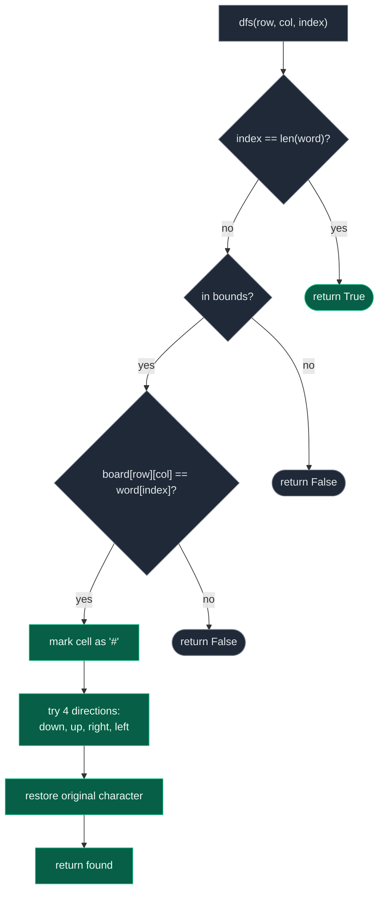

# 02. 79. Word Search

| Difficulty | Pattern | Source | Time | Space |
|:---:|:---:|:---:|:---:|:---:|
| **Medium** | Grid Backtracking (DFS with Mark/Unmark) | [79. Word Search](https://leetcode.com/problems/word-search/) | `O(M * N * 3^L)` | `O(L)` |

## 1. Problem Statement

Given an `m x n` grid of characters `board` and a string `word`, return `true` if `word` exists in the grid.

The word can be constructed from letters of sequentially adjacent cells, where adjacent cells are horizontally or vertically neighboring. The same cell may not be used more than once within a single word path.

### Examples

```text
Input:
board = [["A","B","C","E"],
         ["S","F","C","S"],
         ["A","D","E","E"]]
word = "ABCCED"
Output: true
```

```text
Input:
board = [["A","B","C","E"],
         ["S","F","C","S"],
         ["A","D","E","E"]]
word = "SEE"
Output: true
```

```text
Input:
board = [["A","B","C","E"],
         ["S","F","C","S"],
         ["A","D","E","E"]]
word = "ABCB"
Output: false
```

### Constraints

- `m == board.length`
- `n == board[i].length`
- `1 <= m, n <= 6`
- `1 <= word.length <= 15`
- `board` and `word` consist of only lowercase and uppercase English letters

## 2. Core Theory

Word Search is grid backtracking, a different flavor from string/array backtracking such as Palindrome Partitioning. Instead of choosing which prefix of a string to cut next, the "choice" at each step is which of up to four neighboring grid cells to move into, and the constraint is that the destination cell's character must match the next character of `word`.

**The recursive contract.** Define `dfs(row, col, index)` to mean: *characters `word[0:index]` have already been matched by the path so far; can the rest, `word[index:]`, be matched starting from `board[row][col]`?* Three checks gate every call, in order:

1. **Base case (success):** if `index == len(word)`, every character has already been matched — return `True` immediately without touching `(row, col)`.
2. **Boundary check:** `row`/`col` must be inside `[0, rows)` / `[0, cols)`.
3. **Character match:** `board[row][col] == word[index]` — if the current cell doesn't hold the character we need next, this branch is dead; prune it.

**Marking and unmarking — the heart of the backtracking.** Once a cell matches, it must not be reused later in the *same* path (e.g. searching `"ABA"` on a 2x1 board of `A`/`B` must not bounce back and forth on the same two cells). The standard trick avoids a separate `visited` matrix: temporarily overwrite the board cell with a sentinel that cannot match any word character, typically `'#'`:

```python
original = board[row][col]
board[row][col] = "#"          # mark: this cell is now "used" for this path
found = dfs(...) or dfs(...) or dfs(...) or dfs(...)   # explore all 4 directions
board[row][col] = original     # unmark: restore before returning
return found
```

**Why the cell must be restored before returning — explicitly.** The mark only means "used by *this* attempted path." A completely different path, tried later from a different starting cell or a different branch of the same search, may legitimately need to pass through that exact same cell. If we never restore it, the cell stays permanently blocked (`'#'`) for every subsequent attempt, even ones that have nothing to do with the failed path — causing valid word paths to be wrongly rejected. This is why the restore line runs unconditionally after the four-direction exploration, not only on the failure branch: even a *successful* branch must restore the board before returning `True`, otherwise the caller's board is left mutated with stray `'#'` characters.

**Four-directional exploration.** From `(row, col)`, the next character `word[index + 1]` may live in any of the four axis-aligned neighbors — no diagonals:

```text
dfs(row + 1, col, index + 1)   # down
dfs(row - 1, col, index + 1)   # up
dfs(row, col + 1, index + 1)   # right
dfs(row, col - 1, index + 1)   # left
```

Python's `or` short-circuits: as soon as one direction returns `True`, the rest are skipped — but the code structure still runs the restore line after the `or` chain, guaranteeing the cell is unmarked regardless of which branch (or none) succeeded.

**Early pruning on dimensions.** Since a path can never reuse a cell, it can use at most `rows * cols` distinct cells. If `len(word) > rows * cols`, no path can possibly exist, so the whole search can be skipped:

```python
if len(word) > rows * cols:
    return False
```

**Outer loop over every starting cell.** The word does not have to begin at `(0, 0)`, so every cell is a candidate root of its own backtracking tree:

```python
for row in range(rows):
    for col in range(cols):
        if dfs(row, col, 0):
            return True
```

Small grid, DFS path with mark/unmark, matching `word = "ABCCED"`:

```text
Board:                 Path so far: A -> B -> C -> C -> E -> D
     0   1   2   3
0    A   B   C   E        Step-by-step marking (board mutated in place):
1    S   F   C   S        (0,0)A -> '#'   match word[0]='A'
2    A   D   E   E        (0,1)B -> '#'   match word[1]='B'
                          (0,2)C -> '#'   match word[2]='C'
Marked path cells:        (1,2)C -> '#'   match word[3]='C'
  (0,0) (0,1) (0,2)       (2,2)E -> '#'   match word[4]='E'
        (1,2)             (2,1)D -> '#'   match word[5]='D' -> index==len(word) -> True
        (2,2)(2,1)

All six cells are restored to their original letters as the
recursion unwinds, whether or not the branch above them succeeds.
```

Decision flow at each DFS call:



**Why recursion depth stays `O(L)`.** Every successful recursive step consumes exactly one character of `word` (`index` increases by 1 each time), so the deepest the call stack ever goes is `L = len(word)`. The board itself can be arbitrarily larger without affecting recursion depth — only the branching factor at each level.

**Time complexity intuition.** There are `M * N` possible starting cells. From the first matched cell there are up to 4 directions to try; from every cell after that, one direction leads back to the cell just came from (which is now marked, so it's pruned automatically), leaving at most 3 productive directions. That gives roughly `O(M * N * 4 * 3^(L-1))`, usually simplified to `O(M * N * 3^L)`. In practice, wrong-character and boundary pruning make real runtimes far smaller than this worst-case bound.

## 3. Edge Cases

| Case | Input | Expected | Why it matters |
|:---|:---|:---|:---|
| Single-cell board, matching word | `board = [["A"]]`, `word = "A"` | `True` | Base case fires immediately at `index == 1 == len(word)` after one mark/restore |
| Single-cell board, longer word | `board = [["A"]]`, `word = "AA"` | `False` | Word longer than the board has cells — dimension pruning (`len(word) > rows*cols`) applies |
| Word longer than total board cells | `2x2` board, `word` of length 5 | `False` | No path can use a cell twice, so the search is impossible before any DFS runs |
| Word not present at all | valid board, word with a character absent from the board | `False` | Every starting cell fails the first character-match check; search terminates quickly |
| Word requires revisiting a cell | `board = [["A","B"],["B","A"]]`, `word = "ABA"` | Only `True` if a **different** `A` cell exists reachable without reuse | Tests that the same path cannot bounce back onto its own starting cell |
| Word starts mid-grid, not at `(0,0)` | `word`'s first character only appears away from `(0,0)` | Search must still find it | Confirms every cell is tried as a starting root, not just the top-left |

## 4. Solution: Grid DFS with In-Place Marking (Optimal)

### Intuition

Try every cell as a possible start of the word. From a matching cell, mark it used by overwriting it with `'#'`, explore all four neighbors looking for the next character, and restore the original character once that exploration is done — regardless of whether it succeeded.

### Approach

1. Read `rows`, `cols` from `board`.
2. Define `dfs(row, col, index)`:
   - If `index == len(word)`: return `True` (everything already matched).
   - If out of bounds, or `board[row][col] != word[index]`: return `False`.
   - Save `original = board[row][col]`, set `board[row][col] = '#'`.
   - `found = dfs(down) or dfs(up) or dfs(right) or dfs(left)` (each with `index + 1`).
   - Restore `board[row][col] = original`.
   - Return `found`.
3. Loop over every `(row, col)`; if `dfs(row, col, 0)` returns `True`, return `True`.
4. If no starting cell works, return `False`.

### Dry Run

```text
board = [["A","B","C","E"],
         ["S","F","C","S"],
         ["A","D","E","E"]]
word = "ABCCED"

Start search, eventually try (row=0, col=0):

dfs(0,0,0): board[0][0]='A' == word[0]='A' -> match
  mark (0,0) = '#'
  try dfs(1,0,1): board[1][0]='S' != word[1]='B' -> False
  try dfs(-1,0,1): out of bounds -> False
  try dfs(0,1,1): board[0][1]='B' == word[1]='B' -> match
    mark (0,1) = '#'
    try dfs(1,1,2): board[1][1]='F' != word[2]='C' -> False
    try dfs(-1,1,2): out of bounds -> False
    try dfs(0,2,2): board[0][2]='C' == word[2]='C' -> match
      mark (0,2) = '#'
      try dfs(1,2,3): board[1][2]='C' == word[3]='C' -> match
        mark (1,2) = '#'
        try dfs(2,2,4): board[2][2]='E' == word[4]='E' -> match
          mark (2,2) = '#'
          try dfs(3,2,5): out of bounds -> False
          try dfs(1,2,5): now '#' (visited) != 'D' -> False
          try dfs(2,3,5): board[2][3]='E' != word[5]='D' -> False
          try dfs(2,1,5): board[2][1]='D' == word[5]='D' -> match
            mark (2,1) = '#'
            index == 6 == len(word) -> return True (before touching neighbors)
          restore (2,1) = 'D'
          found = True
        restore (2,2) = 'E'
      restore (1,2) = 'C'
    restore (0,2) = 'C'
  restore (0,1) = 'B'
restore (0,0) = 'A'

Overall result: True. Every cell is restored to its original
letter as the successful call stack unwinds.
```

### Code

```python
# Define the class solution
class Solution:

    # Return whether word can be traced through adjacent board cells
    def exist(self, board: List[List[str]], word: str) -> bool:

        # Board dimensions
        rows = len(board)
        cols = len(board[0])

        # Early pruning: word cannot use more distinct cells than exist
        if len(word) > rows * cols:
            return False

        # Search for word[index:] starting from (row, col)
        def dfs(row, col, index):

            # Every character has already been matched
            if index == len(word):
                return True

            # Reject coordinates outside the board
            if row < 0 or row >= rows or col < 0 or col >= cols:
                return False

            # Current cell must hold the character we need next
            if board[row][col] != word[index]:
                return False

            # Save the original character before mutating the board
            original = board[row][col]

            # MARK: temporarily use this cell for the current path
            board[row][col] = "#"

            # EXPLORE: try matching the next character in all 4 directions
            found = (
                dfs(row + 1, col, index + 1)
                or dfs(row - 1, col, index + 1)
                or dfs(row, col + 1, index + 1)
                or dfs(row, col - 1, index + 1)
            )

            # UNDO: restore the original character before returning,
            # so other attempted paths can still use this cell
            board[row][col] = original

            # Return whether any direction completed the word
            return found

        # Every board cell could be the first character of the word
        for row in range(rows):
            for col in range(cols):

                # Only launch DFS from cells that already match
                if board[row][col] == word[0] and dfs(row, col, 0):
                    return True

        # No starting cell produced the complete word
        return False
```

### Complexity

| Measure | Complexity | Why |
|:---|:---:|:---|
| **Time** | `O(M * N * 3^L)` | `M * N` possible starts; from the second step onward at most 3 productive directions (the 4th leads back to a marked cell); `L = len(word)` |
| **Space** | `O(L)` | No separate `visited` matrix — recursion depth is bounded by the word length, since each call consumes one character |

## 5. Common Mistakes

| Mistake | Why it breaks | Fix |
|:---|:---|:---|
| Forgetting to restore the marked cell after exploring | The cell stays permanently blocked (`'#'`), so later valid paths — from other starting cells or other branches — are wrongly rejected | Always run `board[row][col] = original` after the 4-direction exploration, whether it succeeded or failed |
| Returning immediately from inside a successful recursive call without restoring first | Leaves stray `'#'` characters in the caller's board even though the answer was `True`, corrupting the board for anyone using it afterward | Compute `found = dfs(...) or ...`, restore, **then** `return found` — never `return True` before the restore line |
| Using a global/shared `visited` matrix across all starting cells instead of per-path marking | A cell used (and correctly abandoned) by one failed path stays blocked for a completely different, otherwise-valid path | Mark and unmark per path (in-place `'#'` swap, or a `visited` set cleared as you backtrack) — never leave a mark set after a branch finishes |
| Allowing diagonal moves | The problem only permits horizontal/vertical adjacency; diagonals silently accept invalid words or explore a wrong search space | Only try `(row+1,col)`, `(row-1,col)`, `(row,col+1)`, `(row,col-1)` |
| Not checking board dimensions before searching (skipping the `len(word) > rows*cols` prune) | Wastes time launching DFS from every cell when no path could possibly be long enough | Add the early return `if len(word) > rows * cols: return False` |
| Reusing the same cell within one path (e.g. treating the start cell as available again mid-path) | Produces false positives for words like `"ABA"` on a 2-cell board by bouncing between the same two cells | Marking (`'#'`) makes a cell fail the character-match check if revisited within the same path |

## 6. Interview Follow-ups

**Q: How would you search for multiple words at once, e.g. LeetCode 212 (Word Search II)?**

A: Build a Trie out of all the target words first, then run one combined DFS/backtracking pass over the board that walks the Trie alongside the board path. Whenever the DFS reaches a Trie node marked as the end of a word, record that word as found. This avoids re-running a separate full board search per word and lets many words share common-prefix exploration.

**Q: How would you return the actual path of coordinates instead of just true/false?**

A: Maintain a `path` list of `(row, col)` tuples, append the coordinate on mark and pop it on restore (the same CHOOSE/EXPLORE/UNDO discipline used in Palindrome Partitioning), and return a copy of `path` once `index == len(word)`.

**Q: Why use `'#'` instead of an explicit `visited` boolean matrix?**

A: It saves the `O(M*N)` space of a separate matrix, since the board itself doubles as the state store — auxiliary space drops to `O(L)` for the recursion stack alone. The tradeoff is that it mutates the input in place; if the board must remain unmodified for the caller, an explicit `visited` matrix (or a per-path `visited` set) is the safer choice.

**Q: How is this different from Rat in a Maze?**

A: Both are 4-directional grid backtracking, but Rat in a Maze asks "find all paths to the destination" (so it must keep exploring even after finding one path), while Word Search asks "does at least one path exist" (so it can stop immediately once `True` is returned, thanks to short-circuiting `or`). Word Search also adds a character-match constraint at every step, not just an open/blocked constraint.

**Q: Can you improve the constant factor further?**

A: Yes — precompute character frequency counts for the board and for `word`; if the board doesn't have enough of some required character, return `False` immediately without any DFS. Additionally, if `word`'s last character is rarer on the board than its first character, reverse `word` before searching, since a valid path can be traversed in either direction — this can shrink the number of practical starting cells.

## 7. Interview Explanation

> I run a DFS from every board cell that matches `word[0]`. The recursive function `dfs(row, col, index)` asks whether `word[index:]` can be matched starting at `(row, col)`. If the current cell is out of bounds or doesn't match the required character, I prune that branch. Otherwise I temporarily mark the cell as used — by overwriting it with a sentinel character like `'#'` — so the same path can't reuse it, then recurse into all four neighboring cells looking for the next character. After exploring, I restore the cell's original character before returning, whether or not that branch succeeded, because a completely different search path might legitimately need that same cell later. Recursion depth never exceeds the word's length, so auxiliary space is `O(L)` with no separate visited matrix needed.

## 8. Verify

```python
from typing import List


def exist(board: List[List[str]], word: str) -> bool:
    # Board dimensions
    rows = len(board)
    cols = len(board[0])

    # Early pruning: word cannot use more distinct cells than exist
    if len(word) > rows * cols:
        return False

    # Search for word[index:] starting from (row, col)
    def dfs(row, col, index):
        # Every character has already been matched
        if index == len(word):
            return True
        # Reject coordinates outside the board
        if row < 0 or row >= rows or col < 0 or col >= cols:
            return False
        # Current cell must hold the character we need next
        if board[row][col] != word[index]:
            return False

        # Save the original character before mutating the board
        original = board[row][col]
        # MARK: temporarily use this cell for the current path
        board[row][col] = "#"

        # EXPLORE: try matching the next character in all 4 directions
        found = (
            dfs(row + 1, col, index + 1)
            or dfs(row - 1, col, index + 1)
            or dfs(row, col + 1, index + 1)
            or dfs(row, col - 1, index + 1)
        )

        # UNDO: restore the original character before returning,
        # so other attempted paths can still use this cell
        board[row][col] = original
        # Return whether any direction completed the word
        return found

    # Every board cell could be the first character of the word
    for row in range(rows):
        for col in range(cols):
            # Only launch DFS from cells that already match
            if board[row][col] == word[0] and dfs(row, col, 0):
                return True
    # No starting cell produced the complete word
    return False


# LeetCode examples
board1 = [["A", "B", "C", "E"],
          ["S", "F", "C", "S"],
          ["A", "D", "E", "E"]]
# Word exists via a winding path through the grid
assert exist([row[:] for row in board1], "ABCCED") is True
# Word exists via a short path
assert exist([row[:] for row in board1], "SEE") is True
# Word does not exist (no valid adjacent path spells it out)
assert exist([row[:] for row in board1], "ABCB") is False

# Single-cell board, matching word
assert exist([["A"]], "A") is True

# Single-cell board, word longer than the board has cells
assert exist([["A"]], "AA") is False

# Word longer than total board cells (2x2 = 4 cells, word length 5)
board_2x2 = [["A", "B"], ["C", "D"]]
assert exist([row[:] for row in board_2x2], "ABCDE") is False

# Word not present at all (character missing from board)
assert exist([row[:] for row in board1], "Z") is False
assert exist([row[:] for row in board1], "ABCX") is False

# Word requires revisiting the same cell -> must fail if no alternate path exists
board_reuse = [["A", "B"], ["B", "A"]]
# "ABA": A(0,0) -> B(0,1) -> need A, neighbors of (0,1) are (0,0) used and (1,1) 'A' -> valid via a DIFFERENT A cell
assert exist([row[:] for row in board_reuse], "ABA") is True
# "AAAA" cannot work: only 2 'A' cells exist, and no path can revisit within itself, but this needs 4 uses of 'A'
assert exist([row[:] for row in board_reuse], "AAAA") is False

# Board is restored after the search (no leftover '#')
board_check = [row[:] for row in board1]
exist(board_check, "ABCCED")
assert board_check == board1

# Word starting away from (0,0)
board_mid = [["X", "X", "X"],
             ["X", "A", "B"],
             ["X", "X", "C"]]
assert exist([row[:] for row in board_mid], "ABC") is True

print("All tests passed")
```
