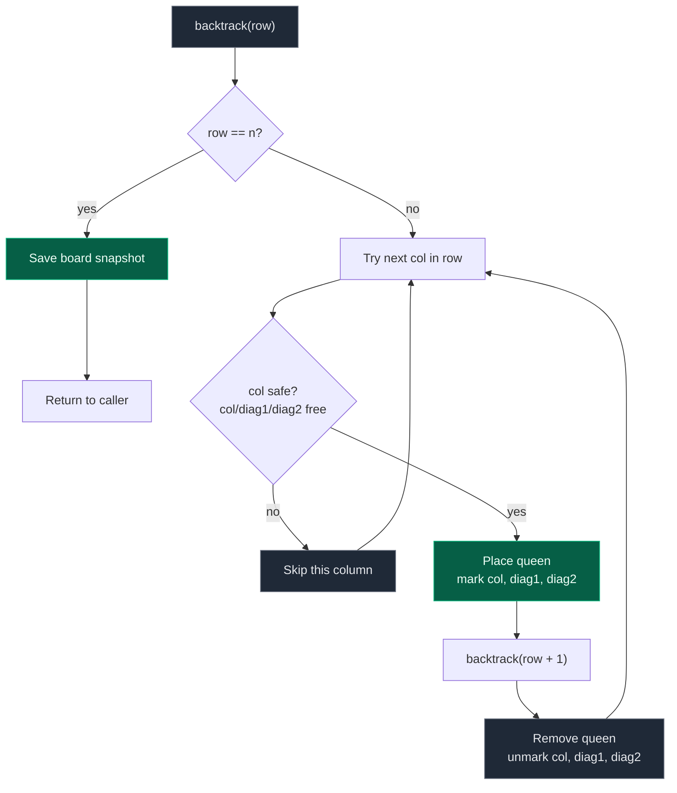

# 03. 51. N-Queens

| Difficulty | Pattern | Source | Time | Space |
|:---:|:---:|:---:|:---:|:---:|
| **Hard** | Constraint Backtracking | [51. N-Queens](https://leetcode.com/problems/n-queens/) | `O(N!)` | `O(N^2)` |

## 1. Problem Statement

Given an integer `n`, place `n` queens on an `n x n` chessboard so that no two queens attack each other.

Return all distinct board configurations. Each solution is a list of strings where `'Q'` marks a queen and `'.'` marks an empty cell.

### Examples

```text
Input:  n = 4
Output: [[".Q..","...Q","Q...","..Q."],
         ["..Q.","Q...","...Q",".Q.."]]
```

```text
Input:  n = 1
Output: [["Q"]]
```

### Constraints

- `1 <= n <= 9`

## 2. Core Theory

A queen attacks along its row, its column, and both diagonals. The first useful observation: if two queens ever share a row, they attack each other immediately, so **every valid solution has exactly one queen per row** (and, by the same argument, exactly one per column). That collapses the search space from "choose `n` cells out of `n^2`" down to "for each row, choose one column" — the recursion never needs a rows-used set, because row conflicts are impossible by construction.

**The recursive decision.** Process rows top to bottom. `backtrack(row)` assumes rows `0 .. row-1` already hold safely placed queens, and tries every column `0 .. n-1` for the current row:

```text
for col in 0..n-1:
    if placing a queen at (row, col) is safe:
        place it
        backtrack(row + 1)
        remove it (undo)
```

When `row == n`, all `n` queens are placed safely — save a snapshot and return. Unlike Sudoku, N-Queens asks for **every** solution, so after saving one we do not stop; the parent call keeps trying its remaining columns.

**Naive safety check — scan the board, O(N).** Since we fill top-down, only rows `0..row-1` can contain queens, so the check inspects three rays going upward: straight up (same column), upper-left diagonal, upper-right diagonal. Any queen found on those rays makes the position unsafe. Each check costs `O(N)`, and it runs for every candidate cell across roughly `O(N!)` placements, giving `O(N! * N)` overall.

**Optimized safety check — O(1) via three tracking sets.** Instead of rescanning, maintain three sets while we place queens:

- `cols` — occupied columns.
- `diag1` — occupied `\` diagonals, keyed by `row - col`.
- `diag2` — occupied `/` diagonals, keyed by `row + col`.

A cell `(row, col)` is unsafe exactly when `col in cols or (row - col) in diag1 or (row + col) in diag2`. Three set lookups replace three linear scans.

**Why `row - col` identifies a `\` diagonal.** Walk down that diagonal from any cell: each step goes to `(row+1, col+1)`. The new key is `(row+1) - (col+1) = row - col` — unchanged. So every cell on the same `\` diagonal shares one `row - col` value, and cells on different `\` diagonals never collide on this key. A concrete 4x4 grid makes it visible — every cell holds `row - col`:

```text
       col
        0   1   2   3
r=0     0  -1  -2  -3
r=1     1   0  -1  -2
r=2     2   1   0  -1
r=3     3   2   1   0
```

Reading any `\` diagonal (top-left to bottom-right), the value is constant: `(0,0),(1,1),(2,2),(3,3)` are all `0`; `(0,1),(1,2),(2,3)` are all `-1`.

**Why `row + col` identifies a `/` diagonal.** Moving along a `/` diagonal goes from `(row, col)` to `(row+1, col-1)`. The new key is `(row+1) + (col-1) = row + col` — again unchanged. Same grid, this time filled with `row + col`:

```text
       col
        0   1   2   3
r=0     0   1   2   3
r=1     1   2   3   4
r=2     2   3   4   5
r=3     3   4   5   6
```

`(0,3),(1,2),(2,1),(3,0)` all equal `3` — exactly the anti-diagonal.

Together these two integers act as perfect diagonal fingerprints, turning an `O(N)` scan into an `O(1)` set/array lookup. This is the single most reusable trick in this problem, and it reappears anywhere diagonal adjacency needs to be tested cheaply (bishops, Sudoku-style board games, image processing along diagonals).

**Array version and the offset.** `row - col` ranges from `-(n-1)` to `n-1` — it can be negative, which is illegal as an array index. Adding an offset of `n - 1` remaps it to `0 .. 2n-2`, so `diag1` becomes an array of size `2n - 1` indexed by `row - col + (n - 1)`. `row + col` is already non-negative and ranges `0 .. 2n-2`, so `diag2` needs no offset, just size `2n - 1`.

**Complexity shape.** Search behaves like placing non-attacking column choices row by row: roughly `n * (n-1) * (n-2) * ... ~ O(n!)` candidate placements once columns can't repeat, with diagonal pruning cutting it further in practice. With the O(1) safety check the search itself is `~O(n!)`; building and copying the boards for `S` solutions adds `O(S * n^2)`. With the naive O(N) scan, it becomes `O(n! * n)`.

## 3. Edge Cases

| Case | Input | Expected | Why it matters |
|:---|:---|:---:|:---|
| Trivial board | `n = 1` | `[["Q"]]` | Single cell, no constraints to violate — verifies the base case fires immediately |
| No solution (small board) | `n = 2` | `[]` | Only 4 cells; every placement of 2 queens conflicts diagonally or shares a line |
| No solution (small board) | `n = 3` | `[]` | Same story — too tight a board for 3 mutually safe queens |
| Smallest board with solutions | `n = 4` | 2 solutions | Classic sanity check, matches the textbook example |
| Larger board | `n = 8` | 92 solutions | Standard benchmark value used to validate a correct implementation |

## 4. Approach 1 — Backtracking with Board Scan (Naive Safety Check)

### Intuition

Place one queen per row. To check if `(row, col)` is safe, look upward along the three rays that could contain an earlier queen: straight up, upper-left diagonal, upper-right diagonal. Rows below `row` are still empty, so they need no check.

### Approach

1. Maintain an `n x n` board of `'.'`.
2. `backtrack(row)`: if `row == n`, save a copy of the board as a solution and return.
3. Otherwise, for each `col` in `0..n-1`, check safety by scanning upward on the three rays.
4. If safe: place `'Q'`, recurse to `row + 1`, then remove the queen (backtrack).

### Dry Run

For `n = 4`, starting `backtrack(0)`:

```text
row 0: board empty -> col 0 is safe -> place (0,0)
row 1: col 0 -> same column as (0,0), reject
       col 1 -> diagonal conflict with (0,0), reject
       col 2 -> safe -> place (1,2)
row 2: col 0 -> same column as row0    reject
       col 1 -> diagonal with row1     reject
       col 2 -> same column as row1    reject
       col 3 -> diagonal with row1     reject
       DEAD END -> backtrack, remove (1,2)
row 1: try col 3 -> safe -> place (1,3)
row 2: col 1 -> safe -> place (2,1)... eventually dead end too
       backtrack further, remove (0,0)
row 0: try col 1 -> place (0,1)
row 1: col 3 -> safe -> place (1,3)
row 2: col 0 -> safe -> place (2,0)
row 3: col 2 -> safe -> place (3,2)
row 4 == n -> SAVE ".Q..","...Q","Q...","..Q."
```

Backtracking continues further, unwinding all the way to row 0, and trying `col = 2` there eventually finds the second solution.

### Code

```python
# Define the class solution
class Solution:

    # Return all distinct n-queens board configurations
    def solveNQueens(self, n: int) -> list[list[str]]:

        # Create an empty chessboard
        board = [['.'] * n for _ in range(n)]

        # Store every valid board configuration
        answer = []

        # Check whether a queen can safely be placed at (row, col)
        def is_safe(row, col):

            # Check same column above
            r = row - 1
            while r >= 0:
                if board[r][col] == 'Q':
                    return False
                r -= 1

            # Check upper-left diagonal
            r, c = row - 1, col - 1
            while r >= 0 and c >= 0:
                if board[r][c] == 'Q':
                    return False
                r -= 1
                c -= 1

            # Check upper-right diagonal
            r, c = row - 1, col + 1
            while r >= 0 and c < n:
                if board[r][c] == 'Q':
                    return False
                r -= 1
                c += 1

            return True

        # Place one queen in each row
        def backtrack(row):

            # All n queens have been placed
            if row == n:
                answer.append(["".join(r) for r in board])
                return

            # Try every column in the current row
            for col in range(n):
                if is_safe(row, col):
                    # CHOOSE
                    board[row][col] = 'Q'
                    # EXPLORE
                    backtrack(row + 1)
                    # UNDO
                    board[row][col] = '.'

        # Begin with row 0
        backtrack(0)
        return answer
```

### Complexity

| Measure | Complexity | Why |
|:---|:---:|:---|
| **Time** | `O(N! * N)` | ~`N!` candidate placements, each safety check costs `O(N)` |
| **Space** | `O(N^2)` | The board, plus `O(N)` recursion stack |

## 5. Approach 2 — Optimized with Three Sets (O(1) Safety Check)

### Intuition

Track occupied columns and both diagonal families with sets, keyed by `col`, `row - col`, and `row + col`. Checking safety becomes three `in` lookups instead of three linear scans.

### Approach

1. Maintain `cols`, `diag1` (keyed by `row - col`), `diag2` (keyed by `row + col`).
2. `backtrack(row)`: if `row == n`, save the board.
3. For each `col`, compute `d1 = row - col`, `d2 = row + col`. Skip if `col in cols or d1 in diag1 or d2 in diag2`.
4. Otherwise place the queen, add `col`, `d1`, `d2` to the sets, recurse, then remove the queen and undo all three set updates.

### Dry Run

Building one `n = 4` solution and tracing the sets:

```text
place (0,1): cols={1}  diag1={-1}    diag2={1}
place (1,3): cols={1,3} diag1={-1,-2} diag2={1,4}
place (2,0): cols={0,1,3} diag1={-2,-1,2} diag2={1,2,4}
place (3,2): cols={0,1,2,3} diag1={-2,-1,1,2} diag2={1,2,4,5}
row == 4 -> SAVE ".Q..","...Q","Q...","..Q."

backtrack: remove (3,2) -> sets restored to the (2,0) state
           try other columns in row 3 (none work here)
           backtrack further, remove (2,0), try next candidate...
```

### Code

```python
# Define the class solution
class Solution:

    # Return all distinct n-queens board configurations
    def solveNQueens(self, n: int) -> list[list[str]]:

        # Create the chessboard
        board = [['.'] * n for _ in range(n)]

        # Store all valid board configurations
        answer = []

        # Columns that already contain a queen
        cols = set()

        # Occupied "\" diagonals: same diagonal => row - col is equal
        diag1 = set()

        # Occupied "/" diagonals: same diagonal => row + col is equal
        diag2 = set()

        # Place a queen in the given row
        def backtrack(row):

            # Successfully placed n queens
            if row == n:
                answer.append(["".join(r) for r in board])
                return

            # Try placing the queen in every column
            for col in range(n):

                # Identify both diagonals
                d1 = row - col
                d2 = row + col

                # Skip attacked positions
                if col in cols or d1 in diag1 or d2 in diag2:
                    continue

                # CHOOSE: place queen and mark constraints
                board[row][col] = 'Q'
                cols.add(col)
                diag1.add(d1)
                diag2.add(d2)

                # EXPLORE: place a queen in the next row
                backtrack(row + 1)

                # UNDO: remove queen and restore constraint state
                board[row][col] = '.'
                cols.remove(col)
                diag1.remove(d1)
                diag2.remove(d2)

        # Start from the first row
        backtrack(0)
        return answer
```

### Complexity

| Measure | Complexity | Why |
|:---|:---:|:---|
| **Time** | `O(N!)` for the search, plus `O(S * N^2)` to build `S` solutions | Safety check is `O(1)`; search behaves like placing non-repeating column choices |
| **Space** | `O(N^2)` | Board dominates; the three sets and recursion stack are each `O(N)` |

## 6. Approach 3 — Optimized with Boolean Arrays (Offset Diagonals)

### Intuition

Same idea as Approach 2, but replace sets with fixed-size boolean arrays for slightly faster constant-time access. Arrays need an offset because `row - col` can be negative.

### Approach

1. `cols = [False] * n`.
2. `diag1 = [False] * (2n - 1)`, indexed by `row - col + (n - 1)` to avoid negative indices.
3. `diag2 = [False] * (2n - 1)`, indexed by `row + col` directly (already `0 .. 2n-2`).
4. Same backtracking shape as Approach 2, toggling array entries instead of set membership.

### Dry Run

For `n = 4`, `diag1` has `2*4 - 1 = 7` slots (indices `0..6`), representing `row - col` values `-3..3` after adding the offset `3`. Placing `(1, 3)`: `d1 = 1 - 3 + 3 = 1`, `d2 = 1 + 3 = 4`. Marking `diag1[1] = True` and `diag2[4] = True` is the array equivalent of adding `-2` and `4` to the sets in Approach 2.

### Code

```python
# Define the class solution
class Solution:

    # Return all distinct n-queens board configurations
    def solveNQueens(self, n: int) -> list[list[str]]:

        # Create empty board
        board = [['.'] * n for _ in range(n)]

        # Final solutions
        answer = []

        # Track occupied columns
        cols = [False] * n

        # Track "\" diagonals, offset by (n - 1) to avoid negative indices
        diag1 = [False] * (2 * n - 1)

        # Track "/" diagonals, naturally in range 0 .. 2n-2
        diag2 = [False] * (2 * n - 1)

        def backtrack(row):

            # All queens successfully placed
            if row == n:
                answer.append(["".join(r) for r in board])
                return

            # Try every column for this row
            for col in range(n):

                # Compute offset diagonal indexes
                d1 = row - col + (n - 1)
                d2 = row + col

                # Skip attacked positions
                if cols[col] or diag1[d1] or diag2[d2]:
                    continue

                # CHOOSE
                board[row][col] = 'Q'
                cols[col] = True
                diag1[d1] = True
                diag2[d2] = True

                # EXPLORE
                backtrack(row + 1)

                # UNDO
                board[row][col] = '.'
                cols[col] = False
                diag1[d1] = False
                diag2[d2] = False

        backtrack(0)
        return answer
```

### Complexity

| Measure | Complexity | Why |
|:---|:---:|:---|
| **Time** | `O(N!)` search, plus `O(S * N^2)` output construction | Identical asymptotics to the set version, smaller constants |
| **Space** | `O(N^2)` | Board dominates; the tracking arrays are `O(N)` |

## 7. ASCII Diagram — Valid 4x4 Solution with Markers

```text
       col
        0   1   2   3
row 0   .   Q   .   .     row-col=-1  row+col=1
row 1   .   .   .   Q     row-col=-2  row+col=4
row 2   Q   .   .   .     row-col=2   row+col=2
row 3   .   .   Q   .     row-col=1   row+col=5

cols used   : {0, 1, 2, 3}   (one per row, all distinct)
diag1 (\)   : {-1, -2, 2, 1} (all distinct -> no \ conflicts)
diag2 (/)   : {1, 4, 2, 5}   (all distinct -> no / conflicts)
```

## 8. Mermaid — Row-by-Row Backtracking Decision



## 9. Common Mistakes

| Mistake | Why it breaks | Fix |
|:---|:---|:---|
| Rescanning the full column/diagonal every call | Correct, but costs `O(N)` per check instead of `O(1)`, making the naive version `N` times slower | Track `cols`, `diag1`, `diag2` incrementally with sets or arrays |
| Using `row - col` directly as an array index | Negative for cells above the main diagonal, causing wrap-around or `IndexError` | Offset by `+ (n - 1)`: `diag1[row - col + (n - 1)]` |
| Forgetting to undo the sets/arrays after recursion | Later branches see stale occupied columns/diagonals and wrongly skip valid placements | Always pair every `add`/`True` with a matching `remove`/`False` after the recursive call |
| Returning after the first solution is found | Only Sudoku-style "find one" problems do this; LC 51 wants all of them | Append to `answer` and `return` without stopping the parent loop |
| Tracking a "rows used" set | Redundant — recursion already guarantees exactly one queen per row by construction | Only track columns and the two diagonals |
| Mixing up `\` and `/` diagonal formulas | Swapping `row - col` and `row + col` lets true conflicts slip through | Remember: moving down-right (`\`) keeps `row - col` constant; moving down-left (`/`) keeps `row + col` constant |

## 10. Interview Follow-ups

**Q: How would you count solutions only, without building the boards (LeetCode 52)?**

A: Drop the board array and the string-joining step entirely; just increment a counter when `row == n`. The sets/arrays for `cols`, `diag1`, `diag2` stay the same. This removes the `O(S * N^2)` output-construction cost, leaving just the `O(N!)`-ish search.

**Q: Why is space `O(N^2)` if the tracking sets are only `O(N)`?**

A: The board itself is an `n x n` grid, which dominates every other structure — the sets/arrays and the recursion stack are each `O(N)`. If you avoid materializing the board (store just `positions[row] = col` and only build board strings when a solution completes), you can shrink internal state to `O(N)`, though each individual solution string is still `O(N^2)` to emit.

**Q: Could you use bitmasks instead of sets?**

A: Yes — represent `cols`, `diag1`, `diag2` as integers and use bit operations (`|`, `&`, shifts) to check and mark occupied positions. This keeps the same `O(1)` check with smaller constants, and is especially useful for the counting-only variant (LC 52) where no board needs to be built. For a first pass in an interview, sets/arrays are usually clearer.

**Q: What's the actual size of the diagonal arrays and why?**

A: There are `2n - 1` diagonals of each family on an `n x n` board (from a single corner cell up to the full-length diagonal and back down to one cell on the opposite corner). `row - col` ranges over `-(n-1) .. (n-1)`, which is `2n - 1` distinct values; `row + col` ranges over `0 .. 2(n-1)`, also `2n - 1` values.

**Q: Why does exactly-one-queen-per-row let you skip a "rows used" check entirely?**

A: Because the recursion structure itself enforces it — `backtrack(row)` only ever places a queen in that one row and then calls `backtrack(row + 1)`. There is no code path that revisits an earlier row, so a row-collision is structurally impossible, not just avoided by a check.

## 11. Interview Explanation

> Since every valid solution must contain exactly one queen per row, I recursively process one row at a time. For each row, I try every column. A position is safe if its column, its `row - col` diagonal, and its `row + col` diagonal are not already occupied — I maintain three sets so this safety check is `O(1)` instead of rescanning the board. When a position is safe, I place the queen, mark those three constraints, and recurse to the next row. After the recursive call returns, I remove the queen and restore the sets so other placements can be explored. When `row == n`, all `n` queens are placed, so I save the board and let the parent continue searching for other solutions.

## 12. Verify

```python
def solve_n_queens(n: int) -> list[list[str]]:
    board = [['.'] * n for _ in range(n)]
    answer = []
    cols = set()
    diag1 = set()  # row - col
    diag2 = set()  # row + col

    def backtrack(row):
        if row == n:
            answer.append(["".join(r) for r in board])
            return
        for col in range(n):
            d1 = row - col
            d2 = row + col
            if col in cols or d1 in diag1 or d2 in diag2:
                continue
            board[row][col] = 'Q'
            cols.add(col)
            diag1.add(d1)
            diag2.add(d2)
            backtrack(row + 1)
            board[row][col] = '.'
            cols.remove(col)
            diag1.remove(d1)
            diag2.remove(d2)

    backtrack(0)
    return answer


def normalize(solutions):
    return sorted(tuple(board) for board in solutions)


# n = 1: trivial single solution
assert solve_n_queens(1) == [["Q"]]

# n = 2, n = 3: no solution exists
assert solve_n_queens(2) == []
assert solve_n_queens(3) == []

# n = 4: exactly the two classic solutions (order-independent compare)
expected_4 = normalize([
    [".Q..", "...Q", "Q...", "..Q."],
    ["..Q.", "Q...", "...Q", ".Q.."],
])
assert normalize(solve_n_queens(4)) == expected_4

# Solution counts against known values
assert len(solve_n_queens(4)) == 2
assert len(solve_n_queens(8)) == 92

# Every returned board is structurally valid: one queen per row/col, no diagonal conflicts
for n in range(1, 9):
    for board in solve_n_queens(n):
        assert len(board) == n
        queens = [(r, row.index('Q')) for r, row in enumerate(board)]
        cols_seen = [c for _, c in queens]
        assert len(set(cols_seen)) == n  # one per column
        assert len({r - c for r, c in queens}) == n  # no \ diagonal shared
        assert len({r + c for r, c in queens}) == n  # no / diagonal shared

print("All tests passed")
```

Executed via `python3` — all assertions pass, including the `n=4 -> 2` and `n=8 -> 92` solution-count checks.
