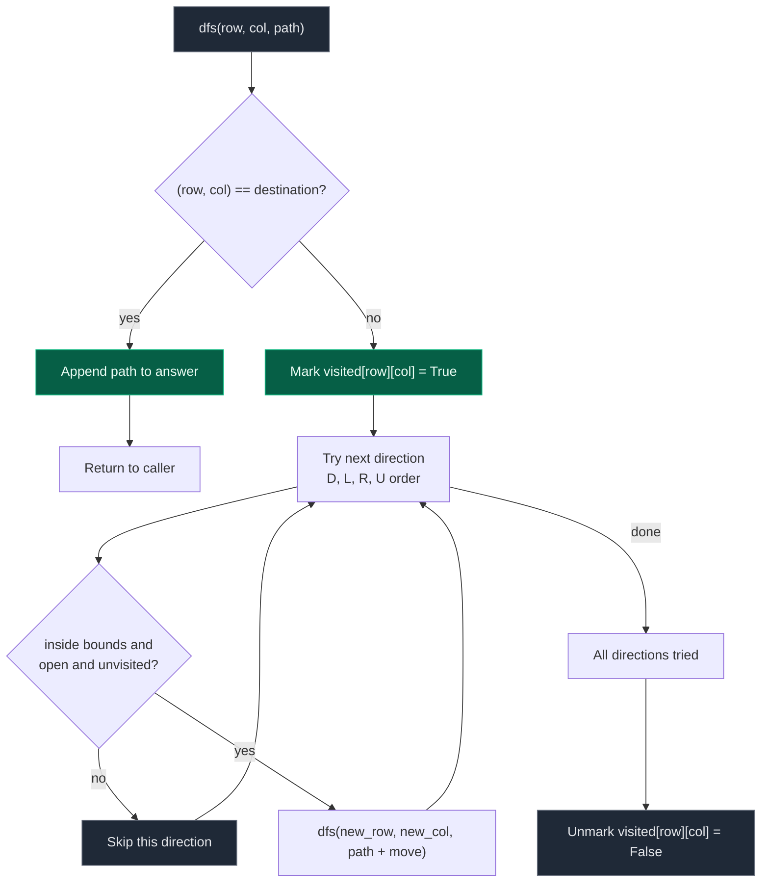

# 04. Rat in a Maze

| Difficulty | Pattern | Source | Time | Space |
|:---:|:---:|:---:|:---:|:---:|
| **Hard** | Grid Backtracking (DFS with mark/unmark) | [Rat in a Maze — GfG](https://www.geeksforgeeks.org/problems/rat-in-a-maze-problem/1) | `O(4^(N^2))` worst case | `O(N^2)` |

## 1. Problem Statement

Given an `n x n` binary matrix `maze`, a rat starts at `(0, 0)` and must reach `(n-1, n-1)`.

- `1` marks an open cell the rat can enter; `0` marks a blocked cell.
- The rat can move `D`own, `L`eft, `R`ight, or `U`p.
- The rat cannot revisit a cell already used in the current path.
- Return every valid path as a direction string, sorted in lexicographically increasing order.

### Examples

```text
Input:  maze = [[1,0,0,0],
                [1,1,0,1],
                [1,1,0,0],
                [0,1,1,1]]
Output: ["DDRDRR", "DRDDRR"]
```

```text
Input:  maze = [[1,0],
                [0,1]]
Output: []          (destination unreachable)
```

### Constraints

- `2 <= n <= 5` (typical GfG-style constraint; small board because output is exponential)
- `maze[0][0] == 1` and `maze[n-1][n-1] == 1` for any path to exist

## 2. Core Theory

This is the same backtracking skeleton as Permutations, M-Coloring, and Word Search, specialized to grid movement: **choose a direction, recurse, undo**.

**The decision at each cell.** From `(row, col)`, the rat has up to four moves. A move to `(new_row, new_col)` is only taken if it passes three checks:

1. Inside the grid: `0 <= new_row < n and 0 <= new_col < n`.
2. Open cell: `maze[new_row][new_col] == 1`.
3. Not already used in the current path: `not visited[new_row][new_col]`.

Only when all three hold do we recurse.

**Visited-and-restore (mark on the way down, unmark on the way back up).** This is the exact same principle as Word Search's board marking. A cell must be `True` in `visited` only while it is part of the path currently being explored — not permanently. Consider reaching `(1,1)` via `"DR"` (down then right) versus `"RD"` (right then down): both are legitimate, different paths through the same cell. If the first path finished and left `(1,1)` permanently marked, the second path could never explore it. So after all four directions have been tried from a cell, that cell's mark must be undone before returning to the caller — this is what makes "explore every path" different from ordinary graph traversal, where a node is marked visited once and never unmarked (there the goal is "touch every node once"; here the goal is "enumerate every route", and the same cell legitimately belongs to many different routes).

**Base case.** When `(row, col) == (n-1, n-1)`, the path built so far is complete and valid — append it to the answer and return, without marking or recursing further from the destination.

**Pre-checks.** Before starting the DFS at all, if `maze[0][0] == 0` or `maze[n-1][n-1] == 0`, no path can possibly exist, so return `[]` immediately.

**Direction order controls output order.** The problem wants lexicographically increasing paths. Comparing the letters alphabetically: `D < L < R < U`. If the DFS tries directions in exactly that order — `D, L, R, U` — at every cell, the generated paths come out already sorted, with no separate `sort()` needed at the end. This is a direct consequence of DFS: trying options in sorted order and appending to a growing string produces sorted output, the same way generating permutations in sorted input order yields sorted permutations.

**Returning all paths vs. one path vs. a count.** The template here returns every valid path. To get only one path, return `True` immediately from the base case and propagate that success up through the calls without exploring remaining directions. To get only a count, drop the path string entirely and just increment a counter at the base case — cheaper because no string concatenation happens per call.

## 3. Edge Cases

| Case | Input | Expected | Why it matters |
|:---|:---|:---:|:---|
| Start blocked | `maze[0][0] == 0` | `[]` | The rat can never take a first step; must be checked before DFS starts |
| Destination blocked | `maze[n-1][n-1] == 0` | `[]` | No path can ever finish there, however open the rest of the maze is |
| No path exists | e.g. destination walled off by `0`s | `[]` | DFS must terminate cleanly with an empty result, not hang or error |
| Single-cell effectively trivial | `n = 1`, `maze = [[1]]` (if allowed) | `[""]` | Start and destination coincide; base case fires with an empty path |
| Fully open maze | all `1`s | Multiple paths | Stresses the visited-and-restore logic across many overlapping routes through shared cells |

## 4. Approach 1 — DFS Backtracking with a Visited Matrix

### Intuition

Keep an explicit `n x n` boolean `visited` grid separate from the maze itself. Mark a cell `True` when entering it as part of the current path, try all four directions in `D, L, R, U` order, then unmark it before returning — making the cell available again for other paths.

### Approach

1. If `maze[0][0] == 0` or `maze[n-1][n-1] == 0`, return `[]`.
2. Define `directions = [('D', 1, 0), ('L', 0, -1), ('R', 0, 1), ('U', -1, 0)]` — already in lexicographic order.
3. `dfs(row, col, path)`:
   - If `(row, col) == (n-1, n-1)`: append `path` to `answer`, return.
   - Mark `visited[row][col] = True`.
   - For each `(move, dr, dc)` in `directions`: compute `(new_row, new_col)`; if inside bounds, open, and unvisited, call `dfs(new_row, new_col, path + move)`.
   - Unmark `visited[row][col] = False` (backtrack).
4. Start with `dfs(0, 0, "")`.

### Dry Run

For the 2x2 maze `[[1,1],[1,1]]`:

```text
dfs(0,0,""): mark (0,0)
  try D -> (1,0) valid -> dfs(1,0,"D")
      mark (1,0)
      try D -> (2,0) out of bounds, skip
      try L -> (1,-1) out of bounds, skip
      try R -> (1,1) valid, not destination check passes -> dfs(1,1,"DR")
          (1,1) == (n-1,n-1) -> SAVE "DR"
      try U -> (0,0) visited, skip
      unmark (1,0)
  try L -> (0,-1) out of bounds, skip
  try R -> (0,1) valid -> dfs(0,1,"R")
      mark (0,1)
      try D -> (1,1) valid -> dfs(1,1,"RD")
          (1,1) == (n-1,n-1) -> SAVE "RD"
      try L -> (0,0) visited, skip
      try R -> (0,2) out of bounds, skip
      try U -> (-1,1) out of bounds, skip
      unmark (0,1)
  try U -> (-1,0) out of bounds, skip
  unmark (0,0)

answer = ["DR", "RD"]   (already lexicographically sorted)
```

### Code

```python
# Define the class solution
class Solution:

    # Return all valid paths from (0, 0) to (n - 1, n - 1)
    def ratInMaze(self, maze: list[list[int]]) -> list[str]:

        # Get the dimension of the square maze
        n = len(maze)

        # Store every valid path
        answer = []

        # If starting or destination cell is blocked, no path can exist
        if maze[0][0] == 0 or maze[n - 1][n - 1] == 0:
            return answer

        # Track cells already used in the current path
        visited = [[False] * n for _ in range(n)]

        # Explore directions in lexicographical order: D < L < R < U
        directions = [
            ('D', 1, 0),
            ('L', 0, -1),
            ('R', 0, 1),
            ('U', -1, 0),
        ]

        # Perform DFS/backtracking from the current cell
        def dfs(row, col, path):

            # Destination reached: record the complete path
            if row == n - 1 and col == n - 1:
                answer.append(path)
                return

            # Mark this cell as used in the current path
            visited[row][col] = True

            # Try every possible movement direction
            for move, dr, dc in directions:
                new_row, new_col = row + dr, col + dc

                # Check bounds, openness, and that it is unused in this path
                if (0 <= new_row < n and 0 <= new_col < n
                        and maze[new_row][new_col] == 1
                        and not visited[new_row][new_col]):
                    # Explore this movement choice
                    dfs(new_row, new_col, path + move)

            # BACKTRACK: make this cell available for another path
            visited[row][col] = False

        # Begin from the top-left cell
        dfs(0, 0, "")

        # Already lexicographically sorted because directions were D, L, R, U
        return answer
```

### Complexity

| Measure | Complexity | Why |
|:---|:---:|:---|
| **Time** | `O(4^(N^2))` worst case | Loose upper bound: up to 4 choices from each of `N^2` cells along a path; actual work is far less due to blocked/visited pruning |
| **Space** | `O(N^2)` | `visited` matrix is `O(N^2)`; recursion depth and path length are each at most `N^2 - 1` |

## 5. Approach 2 — In-Place Marking (Mutate the Maze Instead of a Visited Matrix)

### Intuition

Instead of a separate `visited` grid, temporarily flip the current cell's value to `0` (blocked) while exploring from it, then restore it to `1` when backtracking. This reuses the maze itself as the visited structure and saves `O(N^2)` extra memory, at the cost of mutating the input.

### Approach

Identical DFS shape to Approach 1, except: set `maze[row][col] = 0` in place of `visited[row][col] = True`, and check `maze[new_row][new_col] == 1` instead of checking a separate array; restore with `maze[row][col] = 1` on the way back up.

### Dry Run

Same 2x2 maze. Entering `(0,0)` sets `maze[0][0] = 0`; while inside that call, neighbor checks see `maze[0][0] == 0` and correctly refuse to step back into it. On unwind, `maze[0][0]` is restored to `1` so the next branch (starting again from `(0,0)`) sees the original open cell.

### Code

```python
# Define the class solution
class Solution:

    # Return all valid paths from (0, 0) to (n - 1, n - 1)
    def ratInMaze(self, maze: list[list[int]]) -> list[str]:

        # Store maze size
        n = len(maze)

        # Store every valid path
        answer = []

        # Handle blocked start or destination
        if maze[0][0] == 0 or maze[n - 1][n - 1] == 0:
            return answer

        # Explore directions in lexicographical order
        directions = [
            ('D', 1, 0),
            ('L', 0, -1),
            ('R', 0, 1),
            ('U', -1, 0),
        ]

        # DFS/backtracking using the maze itself as the visited structure
        def dfs(row, col, path):

            # Destination reached
            if row == n - 1 and col == n - 1:
                answer.append(path)
                return

            # Mark current cell as blocked for this path
            maze[row][col] = 0

            # Try all four directions
            for move, dr, dc in directions:
                new_row, new_col = row + dr, col + dc

                # Check bounds and openness (visited cells now read as 0)
                if (0 <= new_row < n and 0 <= new_col < n
                        and maze[new_row][new_col] == 1):
                    dfs(new_row, new_col, path + move)

            # UNDO: restore the cell so other paths can use it
            maze[row][col] = 1

        # Begin at source
        dfs(0, 0, "")
        return answer
```

### Complexity

| Measure | Complexity | Why |
|:---|:---:|:---|
| **Time** | `O(4^(N^2))` worst case | Same search shape as Approach 1 |
| **Space** | `O(N^2)` | No separate visited matrix, but recursion stack and path string are still `O(N^2)`; mutates caller's input, which is a real trade-off, not free space savings for the caller |

## 6. ASCII Diagram — One Discovered Path

For the maze `[[1,0,0,0],[1,1,0,1],[1,1,0,0],[0,1,1,1]]`, the path `"DRDDRR"` drawn with directional arrows:

```text
       col
        0   1   2   3
row 0 [ 1 ] 0   0   0
        |
row 1 [ 1 ]→[ 1 ] 0  [1]
              |
row 2 [ 1 ] [ 1 ] 0   0
              |
row 3   0   [ 1 ]→[1]→[1]
```

Reading the arrows: `D` (0,0)->(1,0), `R` (1,0)->(1,1), `D` (1,1)->(2,1), `D` (2,1)->(3,1), `R` (3,1)->(3,2), `R` (3,2)->(3,3) — the destination. A second valid path, `"DDRDRR"`, reaches the same destination via `(2,0)` before cutting right; both are returned because the visited-and-restore backtracking lets each path reuse cells the other path also used.

## 7. Mermaid — DFS-with-Restore Cycle



## 8. Common Mistakes

| Mistake | Why it breaks | Fix |
|:---|:---|:---|
| Forgetting to unmark the visited cell on backtrack | Other valid paths that need to pass through the same cell disappear entirely | Always pair `visited[row][col] = True` with `visited[row][col] = False` after trying all directions |
| Not checking boundaries before indexing `maze[new_row][new_col]` | Negative or out-of-range indices either wrap around (Python) or throw (most languages), corrupting the search | Check `0 <= new_row < n and 0 <= new_col < n` before touching `maze`/`visited` at that cell |
| Treating `visited` like ordinary graph traversal (mark once, never unmark) | A cell used by one discovered path becomes permanently unavailable to every other path | Remember the goal is "all paths", not "visit every node once" — unmark on the way back up |
| Using direction order other than `D, L, R, U` | Paths come out in the wrong order, failing a lexicographic-order requirement even though every individual path is still correct | Use `[('D',1,0), ('L',0,-1), ('R',0,1), ('U',-1,0)]` so DFS naturally emits sorted output |
| Mutating the maze in place (Approach 2) without restoring it before returning to the caller | If the caller reuses the input maze afterward, it appears fully blocked instead of restored | Ensure the top-level `dfs(0, 0, "")` call also gets its cell restored, leaving the original maze unchanged after `ratInMaze` returns |
| Checking the destination only after marking `visited` | Not strictly wrong, but appending the base case before marking keeps the destination cell available for other paths that might also need to terminate there in different move sequences | Check `if (row, col) == destination` first, before doing any marking |

## 9. Interview Follow-ups

**Q: How would you return just one path instead of all valid paths?**

A: Change the base case to append the path and return `True` immediately. Propagate `True` from each recursive `dfs` call up through the loop — as soon as one direction returns `True`, stop trying further directions and return `True` without unmarking (or unmark only along the failed branches). The first path found via `D, L, R, U` order is also the lexicographically smallest.

**Q: What if diagonal moves are also allowed?**

A: Add four more entries to `directions` for the diagonal deltas (`(-1,-1), (-1,1), (1,-1), (1,1)`), each with its own letter. If lexicographic order still matters, sort all eight direction labels alphabetically and list them in that order in the `directions` array — the DFS logic itself does not change at all.

**Q: How would you count valid paths without building path strings?**

A: Drop the `path` parameter and the string concatenation; keep a `count = 0` closure variable and increment it at the base case instead of appending. This avoids `O(N^2)` string-building per path and is strictly cheaper when only the count is needed.

**Q: Why can't you just do BFS here?**

A: BFS is the right tool for shortest path or reachability, where you stop at the first time you touch a node. Here the requirement is to enumerate every valid simple path, which means continuing to explore even after reaching the destination via one route — that is fundamentally a DFS-with-backtracking task, not a shortest-path task.

**Q: What is the actual worst-case complexity, more precisely than `O(4^(N^2))`?**

A: `O(4^(N^2))` is a loose bound treating every cell as having 4 free choices independently, which overcounts massively because cells cannot be revisited and many branches die early to blocked cells or boundaries. In practice, the runtime is bounded by the number of simple paths from source to destination in the grid graph, which is still exponential in the worst case (a fully open grid) but much smaller than the loose bound suggests.

## 10. Interview Explanation

> I use DFS with backtracking starting from `(0, 0)`. At every cell, I try the four directions in `D, L, R, U` order, which guarantees the collected paths come out lexicographically sorted with no extra sort step. A move is valid only if the next cell is inside the matrix, open, and not already used in the current path. I mark the current cell as visited before exploring its neighbors to prevent cycles, and unmark it after trying all four directions so the same cell remains available to other, different paths. Before starting the search at all, I check that both the source and destination cells are open — otherwise no path can exist and I return immediately. Whenever I reach `(n-1, n-1)`, I record the movement string built so far as one valid answer.

## 11. Verify

```python
def rat_in_maze(maze: list[list[int]]) -> list[str]:
    n = len(maze)
    answer = []

    if maze[0][0] == 0 or maze[n - 1][n - 1] == 0:
        return answer

    visited = [[False] * n for _ in range(n)]
    directions = [
        ('D', 1, 0),
        ('L', 0, -1),
        ('R', 0, 1),
        ('U', -1, 0),
    ]

    def dfs(row, col, path):
        if row == n - 1 and col == n - 1:
            answer.append(path)
            return
        visited[row][col] = True
        for move, dr, dc in directions:
            new_row, new_col = row + dr, col + dc
            if (0 <= new_row < n and 0 <= new_col < n
                    and maze[new_row][new_col] == 1
                    and not visited[new_row][new_col]):
                dfs(new_row, new_col, path + move)
        visited[row][col] = False

    dfs(0, 0, "")
    return answer


# Fully open 2x2 maze: two symmetric paths, already lexicographically sorted
assert rat_in_maze([[1, 1], [1, 1]]) == ["DR", "RD"]

# Blocked start
assert rat_in_maze([[0, 1], [1, 1]]) == []

# Blocked destination
assert rat_in_maze([[1, 1], [1, 0]]) == []

# No path exists even though start/destination are open
no_path_maze = [
    [1, 0, 0],
    [0, 0, 0],
    [0, 0, 1],
]
assert rat_in_maze(no_path_maze) == []

# Single path forced by a corridor maze
corridor = [
    [1, 0, 0],
    [1, 1, 0],
    [0, 1, 1],
]
assert rat_in_maze(corridor) == ["DRDR"]

# Larger maze with multiple valid paths: order-independent structural check
maze4 = [
    [1, 0, 0, 0],
    [1, 1, 0, 1],
    [1, 1, 0, 0],
    [0, 1, 1, 1],
]
paths = rat_in_maze(maze4)
# Result must already be sorted (DFS order D<L<R<U guarantees this)
assert paths == sorted(paths)
# Every path must be composed only of D, L, R, U
assert all(set(p) <= {'D', 'L', 'R', 'U'} for p in paths)
# Every path, when walked, must land exactly on (n-1, n-1) and stay in-bounds/open
deltas = {'D': (1, 0), 'L': (0, -1), 'R': (0, 1), 'U': (-1, 0)}
n = len(maze4)
for p in paths:
    r, c = 0, 0
    seen = {(0, 0)}
    for move in p:
        dr, dc = deltas[move]
        r, c = r + dr, c + dc
        assert 0 <= r < n and 0 <= c < n
        assert maze4[r][c] == 1
        assert (r, c) not in seen
        seen.add((r, c))
    assert (r, c) == (n - 1, n - 1)

print("All tests passed")
```

Executed via `python3` — all assertions pass, including the walk-replay check that every returned path is collision-free, in-bounds, and ends exactly at the destination.
