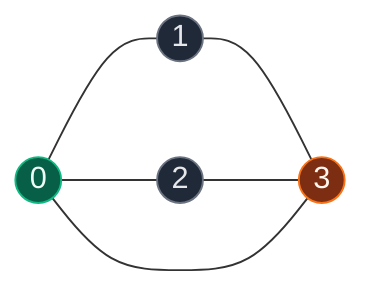
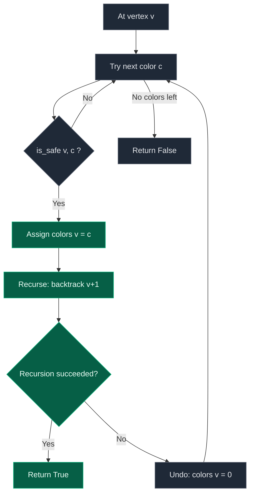

# 05. M-Coloring Problem

| Difficulty | Pattern | Source | Time | Space |
|:---:|:---:|:---:|:---:|:---:|
| **Hard** | Graph Constraint Backtracking | [M-Coloring Problem](https://www.geeksforgeeks.org/problems/m-coloring-problem-1587115620/1) | `O(M^V)` | `O(V)` |

## 1. Problem Statement

Given an undirected graph with `V` vertices and `E` edges (as an edge list `edges[][]`), and an integer `m`, determine whether the graph's vertices can be colored using **at most `m` colors** such that no two adjacent vertices share the same color. Return `true` if such a coloring exists, `false` otherwise. The graph is 0-indexed.

### Examples

```text
Input:  V = 4, edges = [[0,1],[1,3],[2,3],[3,0],[0,2]], m = 3
Output: true
Explanation: One valid coloring —
  Vertex 0: Color 1
  Vertex 1: Color 2
  Vertex 2: Color 2
  Vertex 3: Color 3
```

```text
Input:  V = 3, edges = [[0,1],[1,2],[0,2]], m = 2
Output: false
Explanation: Vertices 0, 1, 2 form a triangle, so all three need
pairwise-distinct colors. Two colors are not enough.
```

### Constraints

- `1 <= V <= 10`
- `1 <= E = edges.size() <= (V*(V-1))/2`
- `0 <= edges[i][j] <= V-1`
- `1 <= m <= V`

## 2. Core Theory

M-Coloring asks a yes/no question: can every vertex be labeled with one of `m` colors so that **adjacent** vertices always differ? Nothing is said about non-adjacent vertices — they are free to repeat a color. This is the single most common misconception: the task is *not* "give every vertex a unique color," it is "give every **edge** two differently-colored endpoints."

**The recursive idea.** Process vertices `0, 1, 2, ..., V-1` in order. At vertex `v`, try each color `1..m`. Before committing to a color, ask `is_safe(v, color)`: scan every neighbor of `v` in the adjacency list and reject the color if any neighbor already holds it. If safe, assign the color and recurse to vertex `v + 1`. If the recursive call eventually returns `False` (no way to complete the coloring from here), **undo** the assignment (reset it to uncolored) and try the next color. If all `m` colors fail at some vertex, that branch is a dead end and the function returns `False` up to its caller.

```text
colors = [0] * V         # 0 means "uncolored"

def backtrack(vertex):
    if vertex == V:
        return True                     # every vertex successfully colored
    for color in range(1, m + 1):
        if is_safe(vertex, color):
            colors[vertex] = color       # CHOOSE
            if backtrack(vertex + 1):    # EXPLORE
                return True
            colors[vertex] = 0           # UNDO
    return False
```

**Why this is graph backtracking, not array/string backtracking.** In array-based backtracking (permutations, subsets) the "conflict" is checked against previous elements of a single sequence. Here the conflict is checked against a *graph structure* — only vertices connected by an edge to the current vertex matter, and that neighbor set comes from the adjacency list, not from position in some sequence. A vertex with no colored neighbors yet is always safe for any color; validity is structural (edges), not positional.

**Connection to N-Queens.** Both problems share the exact same skeleton: **try an option → check a safety constraint against everything committed so far → recurse → undo if the branch fails.** In N-Queens the "option" is a column and the "constraint" is no shared column/diagonal; here the "option" is a color and the "constraint" is no shared color with an adjacent vertex. Once you see this template, M-Coloring, N-Queens, Sudoku, and Word Search are all the same idea wearing different constraint-checking clothes.

A valid 3-coloring of the example graph:



The try-color / check-safe / recurse / backtrack cycle:



## 3. Edge Cases

| Case | Input | Expected | Why it matters |
|:---|:---|:---:|:---|
| M=1 with an edge | `V=2, edges=[[0,1]], m=1` | `false` | A single color can never satisfy any edge constraint |
| M=1, no edges | `V=3, edges=[], m=1` | `true` | With zero edges every vertex is trivially safe with color 1 |
| Complete graph K_n | `K4, m=4` | `true`, but `m=3` fails | Every pair is adjacent, so exactly `n` colors are forced |
| Disconnected graph | `V=4, edges=[[0,1],[2,3]], m=1` | `false`; `m=2` -> `true` | Each component independently needs its own safe coloring |
| Isolated vertex | vertex with no edges | always colorable | `is_safe` trivially returns `True` — no neighbors to conflict with |

## 4. Brute Force: Generate Every Assignment, Validate at the End

### Intuition

Ignore the graph while assigning colors. Every vertex independently picks one of `m` colors, giving `m^V` total assignments. Only after a full assignment is built do we check every edge for a conflict.

### Approach

1. Recursively assign a color to each vertex from `0` to `V-1`, trying all `m` values with no safety check.
2. When all `V` vertices are colored, validate the whole assignment by scanning every edge.
3. If any full assignment passes, the graph is colorable.

### Dry Run

For `V=3, m=2` the brute-force tree explores all `2^3 = 8` leaves — `[C1,C1,C1]`, `[C1,C1,C2]`, ..., `[C2,C2,C2]` — even though several of them (like `[C1,C1,C1]`) obviously violate an edge the moment vertex 1 is assigned. No pruning happens until the very end.

### Code

```python
# Define the class solution
class Solution:

    # Brute force: try all color assignments, validate at the end
    def graphColoring(self, V, edges, m):

        # Try every color for every vertex, no early pruning
        def assign(vertex, colors):

            # All vertices colored — validate against every edge
            if vertex == V:
                for u, v in edges:
                    if colors[u] == colors[v]:
                        return False
                return True

            # Try each of the m colors blindly
            for color in range(1, m + 1):
                if assign(vertex + 1, colors + [color]):
                    return True

            return False

        return assign(0, [])
```

### Complexity

| Measure | Complexity | Why |
|:---|:---:|:---|
| **Time** | `O(m^V * (V + E))` | `m^V` full assignments, each validated in `O(V + E)` |
| **Space** | `O(V + E)` | Recursion depth `O(V)` plus the edge list |

## 5. Optimal Solution: Backtracking with Immediate Safety Check

### Intuition

Instead of waiting until the end, check the safety constraint the instant we consider a color for a vertex. Building an adjacency list lets `is_safe` look only at the current vertex's neighbors, which prunes invalid branches immediately instead of discovering the conflict many levels later.

### Approach

1. Build an adjacency list from the edge list (undirected, so add both directions).
2. Maintain a `colors` array, `0` meaning uncolored.
3. Define `is_safe(vertex, color)`: reject if any neighbor already has this color.
4. Define `backtrack(vertex)`: base case `vertex == V` returns `True`. Otherwise try each color `1..m`; if safe, assign, recurse, and undo on failure.
5. Start with `backtrack(0)`.

### Dry Run

Triangle graph `0-1, 1-2, 2-0`, `m = 2`:

```text
colors = [0,0,0]

backtrack(0): try C1 -> safe (no neighbors colored) -> colors=[1,0,0]
  backtrack(1): try C1 -> vertex 0 is adjacent and has C1 -> unsafe, skip
                try C2 -> safe -> colors=[1,2,0]
    backtrack(2): try C1 -> vertex 0 has C1, adjacent -> unsafe
                  try C2 -> vertex 1 has C2, adjacent -> unsafe
                  no color works -> return False
  backtrack(1) undoes: colors=[1,0,0], no more colors -> return False
backtrack(0) undoes: colors=[0,0,0], try C2 -> symmetric failure -> return False

Final answer: False (triangle cannot be 2-colored)
```

### Code

```python
# Define the class solution
class Solution:

    # Return whether the graph can be colored using at most m colors
    def graphColoring(self, V, edges, m):

        # Build an adjacency list for all V vertices
        graph = [[] for _ in range(V)]

        # Convert each undirected edge into two adjacency-list entries
        for u, v in edges:
            graph[u].append(v)
            graph[v].append(u)

        # 0 means currently uncolored
        colors = [0] * V

        # Check whether assigning 'color' to 'vertex' is safe
        def is_safe(vertex, color):

            # Examine every neighbor of the current vertex
            for neighbor in graph[vertex]:

                # If a neighbor already has the same color, reject
                if colors[neighbor] == color:
                    return False

            return True

        # Try to color vertices starting from the given vertex
        def backtrack(vertex):

            # If all vertices have been successfully colored
            if vertex == V:
                return True

            # Try every possible color
            for color in range(1, m + 1):

                # Only continue if this color is safe
                if is_safe(vertex, color):

                    # CHOOSE: assign the color
                    colors[vertex] = color

                    # EXPLORE: try coloring the remaining vertices
                    if backtrack(vertex + 1):
                        return True

                    # UNDO: remove the color because this branch failed
                    colors[vertex] = 0

            # None of the m colors worked for this vertex
            return False

        # Begin by coloring vertex 0
        return backtrack(0)
```

### Complexity

| Measure | Complexity | Why |
|:---|:---:|:---|
| **Time** | `O(M^V)` worst case | Each of `V` vertices may try up to `m` colors; `is_safe` costs `O(degree)`, so a tighter bound is `O(m^V * V)` |
| **Space** | `O(V)` | Recursion depth is `V`; `colors` array is `O(V)`; adjacency list itself is `O(V + E)` |

## 6. Common Mistakes

| Mistake | Why it breaks | Fix |
|:---|:---|:---|
| Forgetting to reset `colors[vertex] = 0` on backtrack | The next branch sees a stale color and may wrongly treat the vertex as already resolved, corrupting later safety checks | Always undo the assignment immediately after a failed recursive call |
| Checking `is_safe` against ALL vertices instead of only neighbors | Wastes time and can misfire if you compare against unrelated, non-adjacent vertices | Iterate only over `graph[vertex]` (the adjacency list) |
| Treating "no edge between u and v" as "u and v must differ" | Confuses the constraint direction — non-adjacent vertices are explicitly allowed to share a color | Only enforce `color[u] != color[v]` when `(u, v)` is an edge |
| Validating the whole assignment only at the end (brute force) | Misses the chance to prune early, making the search far slower in practice even though the worst case is the same order | Check `is_safe` before each assignment, not after the full coloring is built |

## 7. Interview Follow-ups

**Q: What is the minimum number of colors needed (the chromatic number)?**

A: You can binary-search or linearly increase `m` from `1` upward, calling `graphColoring` for each value until it first returns `True`. Finding the exact chromatic number of a general graph is NP-hard, so this is inherently exponential in the worst case — there is no known polynomial algorithm.

**Q: Why can 2-coloring be solved much faster than general M-coloring?**

A: 2-coloring is equivalent to checking whether the graph is bipartite, solvable with a simple BFS/DFS in `O(V + E)`: color the start vertex, then force every neighbor to the opposite color — there is no ambiguity, so no backtracking is needed. With 3+ colors, a vertex genuinely has multiple valid choices, and a choice that looks fine locally can create a conflict much later, which is exactly what forces a search.

**Q: Does vertex ordering matter? Can we speed this up in practice?**

A: Yes — coloring the highest-degree (most constrained) vertex first tends to expose failures earlier, pruning larger subtrees sooner. This is the same idea as "most constrained variable first" in general constraint satisfaction problems (heuristics like DSATUR formalize it). It doesn't change the worst-case complexity, only the practical search size.

**Q: Is this the same kind of problem as Sudoku or N-Queens?**

A: Yes — all three are Constraint Satisfaction Problems: variables (vertices / cells / rows), a domain (colors / digits / columns), and constraints (adjacent vertices differ / row-col-box uniqueness / no shared column-diagonal). Backtracking with a safety check is the general-purpose solver for this whole family.

## 8. Interview Explanation

> I build an adjacency list from the edge list. I maintain a `colors` array where `0` means uncolored. I try to color vertices one at a time: for the current vertex, I try each of the `m` colors and check `is_safe` — whether any already-colored neighbor has that color. If it's safe, I assign it and recurse to the next vertex. If the recursion eventually fails, I undo the assignment and try the next color. If I reach `vertex == V`, every vertex has a valid color and I return `True`; if no color works at some vertex, I return `False` so the caller backtracks. This mirrors N-Queens exactly — try an option, check a constraint, recurse, undo.

## 9. Verify

```python
# Return whether the graph can be colored using at most m colors
def graph_coloring(V, edges, m):

    # Build an adjacency list for all V vertices
    graph = [[] for _ in range(V)]

    # Convert each undirected edge into two adjacency-list entries
    for u, v in edges:
        graph[u].append(v)
        graph[v].append(u)

    # 0 means currently uncolored
    colors = [0] * V

    # Check whether assigning 'color' to 'vertex' is safe
    def is_safe(vertex, color):

        # Examine every neighbor of the current vertex
        for neighbor in graph[vertex]:

            # If a neighbor already has the same color, reject
            if colors[neighbor] == color:
                return False

        return True

    # Try to color vertices starting from the given vertex
    def backtrack(vertex):

        # If all vertices have been successfully colored
        if vertex == V:
            return True

        # Try every possible color
        for color in range(1, m + 1):

            # Only continue if this color is safe
            if is_safe(vertex, color):

                # CHOOSE: assign the color
                colors[vertex] = color

                # EXPLORE: try coloring the remaining vertices
                if backtrack(vertex + 1):
                    return True

                # UNDO: remove the color because this branch failed
                colors[vertex] = 0

        # None of the m colors worked for this vertex
        return False

    # Begin by coloring vertex 0
    return backtrack(0)


# GfG example 1
assert graph_coloring(4, [[0, 1], [1, 3], [2, 3], [3, 0], [0, 2]], 3) == True
# GfG example 2: triangle, m=2 -> false
assert graph_coloring(3, [[0, 1], [1, 2], [0, 2]], 2) == False
# M=1 with any edge present -> impossible
assert graph_coloring(2, [[0, 1]], 1) == False
# M=1 with no edges -> possible
assert graph_coloring(3, [], 1) == True
# Complete graph K4 needs exactly 4 colors
assert graph_coloring(4, [[0, 1], [0, 2], [0, 3], [1, 2], [1, 3], [2, 3]], 4) == True
assert graph_coloring(4, [[0, 1], [0, 2], [0, 3], [1, 2], [1, 3], [2, 3]], 3) == False
# Disconnected graph: two separate edges
assert graph_coloring(4, [[0, 1], [2, 3]], 1) == False
assert graph_coloring(4, [[0, 1], [2, 3]], 2) == True

print("All tests passed")
```
