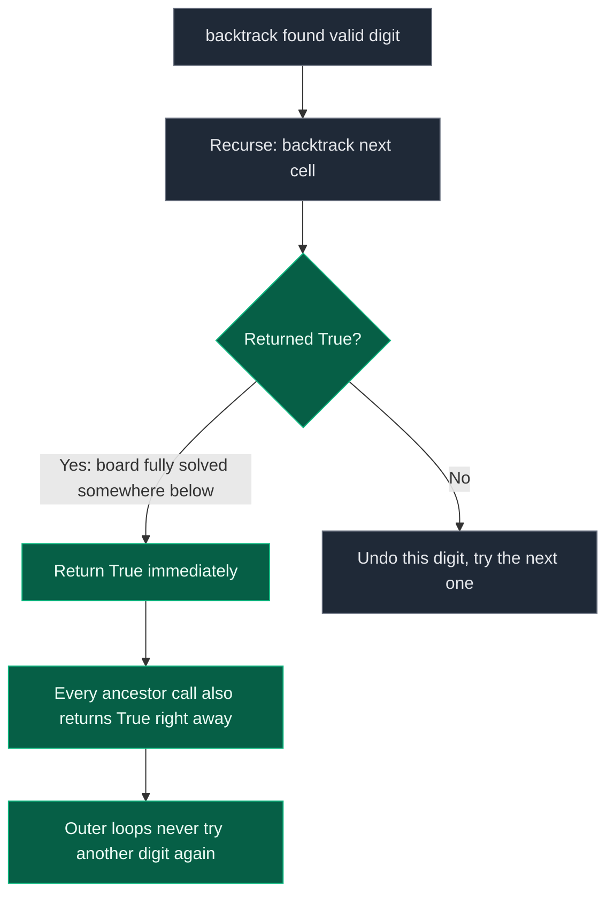

# 06. Sudoku Solver

| Difficulty | Pattern | Source | Time | Space |
|:---:|:---:|:---:|:---:|:---:|
| **Hard** | Grid Constraint Backtracking | [37. Sudoku Solver](https://leetcode.com/problems/sudoku-solver/) | `O(9^E)` | `O(E)` |

## 1. Problem Statement

Write a program to solve a Sudoku puzzle by filling the empty cells. A 9x9 board is given, partially filled, where empty cells are marked `'.'`. Fill the board **in-place** so that:

- Each row contains the digits `1-9` exactly once.
- Each column contains the digits `1-9` exactly once.
- Each of the nine 3x3 sub-boxes contains the digits `1-9` exactly once.

It is guaranteed that the input board has a unique solution.

### Examples

```text
Input:
5 3 . | . 7 . | . . .
6 . . | 1 9 5 | . . .
. 9 8 | . . . | . 6 .
------+-------+------
8 . . | . 6 . | . . 3
4 . . | 8 . 3 | . . 1
7 . . | . 2 . | . . 6
------+-------+------
. 6 . | . . . | 2 8 .
. . . | 4 1 9 | . . 5
. . . | . 8 . | . 7 9

Output: the same board with every '.' replaced so all
row / column / 3x3-box constraints hold.
```

### Constraints

- `board.length == 9`, `board[i].length == 9`
- `board[i][j]` is a digit `1-9` or `'.'`
- It is guaranteed that the input board has only one solution.

## 2. Core Theory

Sudoku is the same backtracking template as M-Coloring and N-Queens — try an option, check a constraint, recurse, undo — but with three overlapping constraint systems checked simultaneously, and one crucial new requirement: **stop the entire search the instant one full solution is found.**

**The algorithm.** Scan for the next empty cell. Try digits `1` through `9` in it. A digit is valid only if it does not already appear in the same row, the same column, or the same 3x3 box. If valid, place it and recurse to solve the rest of the board; if the recursive call reports success, we are done. If no digit works (or the recursive call always fails), clear the cell back to `'.'` and let the caller try a different digit for the *previous* cell.

**The box-index arithmetic.** Given `(row, col)`, the top-left corner of its 3x3 box is:

```text
box_row = 3 * (row // 3)
box_col = 3 * (col // 3)
```

`row // 3` collapses rows `0,1,2 -> 0`, rows `3,4,5 -> 1`, rows `6,7,8 -> 2`; multiplying by 3 converts that back into the row where the box *starts*. The same logic applies to columns. So for `row=4, col=7`: `4 // 3 = 1 -> box_row = 3`, `7 // 3 = 2 -> box_col = 6`, meaning the box spans rows `3-5` and columns `6-8`. An equivalent flattened box index is `(row // 3) * 3 + (col // 3)`, which numbers the nine boxes `0..8` left-to-right, top-to-bottom — useful when you want a single array of 9 sets instead of a 2D box grid.

**Why the recursive function MUST return a boolean.** This is the single biggest conceptual difference from N-Queens or Subsets. Those problems want **every** valid arrangement, so they keep exploring after finding one and never need a "stop" signal. Sudoku wants **exactly one** solved board. Once a full solution is found deep in the recursion, that success has to propagate all the way back up through every parent call — each level must immediately stop trying more digits and return `True` to its own caller. If the function returned nothing (or a list, as in the all-solutions problems), the outer loops would keep iterating after the board is already solved, potentially overwriting the very digits that made it valid. The `if backtrack(...): return True` pattern is what turns "explore everything" into "stop at the first success and unwind cleanly."

```text
solve empty cell
      |
  try digit 1..9
      |
  valid in row/col/box?
      |
     yes
      |
   place digit
      |
   recurse on next empty cell
      |
  recursion returned True? ----> YES ----> return True immediately (propagate up, stop everything)
      |
      NO
      |
  remove digit, try next digit
```

A small excerpt of the grid showing the box arithmetic:

```text
col:        0   1   2 | 3   4   5 | 6   7   8
row 0     [ .   .   . | .   .   . | .   .   . ]   box_row = 3*(0//3) = 0
row 1     [ .   .   . | .   .   . | .   .   . ]
row 2     [ .   .   . | .   .   . | .   .   . ]
          ------------+-----------+------------
row 3     [ .   .   . | .   .   . | .   .   . ]   box_row = 3*(3//3) = 3
row 4     [ .   .   . | .   .  (4,7)| . [X] . ]   box_col = 3*(7//3) = 6
row 5     [ .   .   . | .   .   . | .   .   . ]
          ------------+-----------+------------
row 6     [ .   .   . | .   .   . | .   .   . ]   box_row = 3*(6//3) = 6
row 7     [ .   .   . | .   .   . | .   .   . ]
row 8     [ .   .   . | .   .   . | .   .   . ]

cell (4,7) -> box top-left = (3, 6) -> box spans rows 3-5, cols 6-8
```

The boolean-propagation mechanism, drawn explicitly:



## 3. Edge Cases

| Case | Input | Expected | Why it matters |
|:---|:---|:---:|:---|
| Already-solved grid | no `'.'` cells at all | board unchanged | The empty-cell list is empty, so `backtrack(0)` hits the base case immediately and returns `True` without touching the board |
| Single empty cell | exactly one `'.'` | exactly one digit fills it | Confirms the constraint check alone (no deep recursion) can pick the unique correct digit |
| Multiple valid-looking digits early, only one leads to a solution | typical hard puzzle | solver eventually backtracks to the right digit | Demonstrates why the boolean-propagating recursion (not a greedy first-valid-digit choice) is necessary |
| Puzzle needing many backtracks | sparsely filled board | still terminates with a valid board | Confirms undo of both the board cell and the row/col/box tracking sets is correct on every failed branch |

## 4. Brute Force: Rescan the Board for the Next Empty Cell Every Time

### Intuition

Don't pre-store empty cells. On every recursive call, scan the whole board row by row to find the first `'.'`. Try digits `1-9` there, validating against row, column, and box by scanning them directly each time.

### Approach

1. Scan rows `0..8`, columns `0..8` for the first `'.'`.
2. If none found, the board is fully and validly filled — return `True`.
3. Otherwise try each digit `1-9`; if `is_valid`, place it, recurse, and return `True` on success; else undo and continue.
4. If no digit works, return `False`.

### Dry Run

```text
Board has cell (0,2) empty first. Candidates found valid: 1, 2, 4.

Try 1 -> board[0][2] = '1' -> recurse -> eventually a deep cell has no
         legal digit -> that call returns False -> propagates back up
Undo:    board[0][2] = '.'
Try 2 -> recurse -> also eventually fails -> undo
Try 4 -> recurse -> this time every downstream cell resolves -> True
         propagates all the way back to the top -> solve() returns True,
         board is left filled in with '4' at (0,2) and everything below it
```

### Code

```python
# Define the class solution
class Solution:

    # Solve the Sudoku board in-place
    def solveSudoku(self, board: list[list[str]]) -> None:

        # Check whether placing 'digit' at (row, col) is valid
        def is_valid(row, col, digit):

            # Check all cells in the same row
            for i in range(9):
                if board[row][i] == digit:
                    return False

            # Check all cells in the same column
            for i in range(9):
                if board[i][col] == digit:
                    return False

            # Find top-left corner of this cell's 3x3 box
            box_row = 3 * (row // 3)
            box_col = 3 * (col // 3)

            # Check all cells inside the 3x3 box
            for r in range(box_row, box_row + 3):
                for c in range(box_col, box_col + 3):
                    if board[r][c] == digit:
                        return False

            return True

        # Backtracking function: rescans the board each call
        def solve():

            # Search for the next empty cell
            for row in range(9):
                for col in range(9):
                    if board[row][col] == '.':

                        # Try every possible digit
                        for digit in '123456789':
                            if is_valid(row, col, digit):

                                # CHOOSE
                                board[row][col] = digit

                                # EXPLORE
                                if solve():
                                    return True

                                # UNDO
                                board[row][col] = '.'

                        # No digit worked for this empty cell
                        return False

            # No empty cells remain — board solved
            return True

        solve()
```

### Complexity

| Measure | Complexity | Why |
|:---|:---:|:---|
| **Time** | `O(9^E)` loose bound, plus re-scanning the board (`O(81)`) on every call | `E` empty cells, each trying up to 9 digits; each `is_valid` call costs `O(27)` (row + col + box), a constant |
| **Space** | `O(E)` | Recursion depth equals the number of empty cells filled so far |

## 5. Optimal Solution: Pre-collect Empty Cells and Track Constraints with Sets

### Intuition

Rescanning all 81 cells on every recursive call is wasted work once you realize the set of empty cells never changes — only which ones are filled. Pre-store their coordinates once, and maintain `rows[9]`, `cols[9]`, `boxes[9]` as sets of digits already used, so validity becomes an `O(1)` set-membership check instead of an `O(27)` scan.

### Approach

1. Scan the board once: for filled cells, record the digit in `rows[r]`, `cols[c]`, `boxes[b]`; for empty cells, append `(r, c)` to a list `empty`.
2. `backtrack(index)`: base case `index == len(empty)` means every empty cell is filled — return `True`.
3. Otherwise take `empty[index]`, compute its box, and try digits `1-9` not already in `rows[r]`, `cols[c]`, or `boxes[b]`.
4. Place the digit on the board and in all three sets, recurse to `index + 1`. If that returns `True`, return `True` immediately (propagate the stop signal).
5. Otherwise undo — remove the digit from the board and all three sets — and try the next digit.
6. If no digit works, return `False`.

### Dry Run

```text
empty = [(0,2), (0,3), (0,5), ...]

backtrack(0): cell (0,2), box = (0//3)*3 + (2//3) = 0
  try '1' -> not in rows[0]/cols[2]/boxes[0] -> place -> recurse backtrack(1)
    ... eventually deep failure -> backtrack(1) returns False
  undo '1' from board + all three sets
  try '2' -> valid -> place -> recurse backtrack(1)
    ... this path eventually reaches index == len(empty) -> return True
  backtrack(0) returns True immediately, no more digits tried at (0,2)
```

### Code

```python
# Define the class solution
class Solution:

    # Solve the Sudoku board in-place using constraint sets
    def solveSudoku(self, board: list[list[str]]) -> None:

        # Track used digits for each row, column, and 3x3 box
        rows = [set() for _ in range(9)]
        cols = [set() for _ in range(9)]
        boxes = [set() for _ in range(9)]

        # Store positions of all empty cells
        empty = []

        # Build the initial constraint state from the given board
        for row in range(9):
            for col in range(9):
                if board[row][col] == '.':
                    empty.append((row, col))
                else:
                    digit = board[row][col]
                    box = (row // 3) * 3 + (col // 3)
                    rows[row].add(digit)
                    cols[col].add(digit)
                    boxes[box].add(digit)

        # Fill empty cells one by one
        def backtrack(index):

            # Every empty cell has been filled
            if index == len(empty):
                return True

            # Current empty cell and its box index
            row, col = empty[index]
            box = (row // 3) * 3 + (col // 3)

            # Try every candidate digit
            for digit in '123456789':

                # Skip any digit that violates a constraint
                if (digit in rows[row] or digit in cols[col]
                        or digit in boxes[box]):
                    continue

                # CHOOSE: place the digit and update constraints
                board[row][col] = digit
                rows[row].add(digit)
                cols[col].add(digit)
                boxes[box].add(digit)

                # EXPLORE: solve the next empty cell
                if backtrack(index + 1):
                    return True

                # UNDO: clear the cell and restore constraints
                board[row][col] = '.'
                rows[row].remove(digit)
                cols[col].remove(digit)
                boxes[box].remove(digit)

            # No digit works in this cell
            return False

        backtrack(0)
```

### Complexity

| Measure | Complexity | Why |
|:---|:---:|:---|
| **Time** | `O(9^E)` where `E` is the number of empty cells | Each empty cell may try up to 9 digits; validity is now `O(1)` via set lookup instead of `O(27)` |
| **Space** | `O(E)` | Recursion depth `E`, plus `O(81)` constant for the constraint sets and empty-cell list |

## 6. Common Mistakes

| Mistake | Why it breaks | Fix |
|:---|:---|:---|
| Not stopping recursion once solved | Continuing to search after `backtrack(...)` returns `True` wastes time and can overwrite the correct digits back to `'.'` if the outer loop keeps undoing | Return `True` immediately the moment the recursive call succeeds — never fall through to the undo step |
| Wrong box formula, e.g. `row // 3 + col // 3` instead of `(row // 3) * 3 + (col // 3)` | Collapses multiple distinct boxes into the same index, corrupting the constraint sets | Always multiply the row-box by 3 before adding the column-box: `(row // 3) * 3 + (col // 3)` |
| Forgetting to restore all three constraint sets on undo | Leaves a stale digit in `rows`/`cols`/`boxes`, making a genuinely valid digit look taken in a later branch | Remove the digit from `rows`, `cols`, AND `boxes` together, symmetric to how it was added |

## 7. Interview Follow-ups

**Q: Why must the function return a boolean instead of collecting all solutions?**

A: LeetCode 37 guarantees a unique solution and only asks to fill the board — not enumerate every possible completion. Returning a boolean lets each recursive level immediately stop and propagate success upward, so the search halts the instant a full valid board is found, rather than continuing to explore (and potentially corrupt) an already-solved board.

**Q: How would you speed this up further?**

A: Use the Minimum Remaining Values (MRV) heuristic — always fill the empty cell with the fewest legal candidate digits next, rather than processing cells in row-major order. A cell with only one legal digit resolves immediately and shrinks the branching factor everywhere else; a highly constrained cell chosen early also exposes dead ends much sooner. This doesn't change the worst-case complexity but dramatically reduces the explored search tree in practice.

**Q: How is this related to M-Coloring as a CSP?**

A: Both are Constraint Satisfaction Problems. In Sudoku, variables are empty cells, the domain is digits `1-9`, and constraints are row/column/box uniqueness. In M-Coloring, variables are vertices, the domain is the `m` colors, and the constraint is that adjacent vertices differ. The same backtracking-with-safety-check template solves both; only the constraint-checking function and the domain differ.

## 8. Interview Explanation

> I use backtracking over the empty cells. I first collect their positions and pre-populate `rows`, `cols`, and `boxes` sets from the given digits so validity checks are `O(1)`. For each empty cell, I try digits 1-9 that aren't already in its row, column, or 3x3 box (found via `(row // 3) * 3 + (col // 3)`). I place a valid digit, update the three sets, and recurse to the next empty cell. Because the problem wants just one solved board, the recursive function returns a boolean: the instant a deeper call returns `True`, every level above it returns `True` immediately without trying more digits. If a cell has no legal digit, I return `False`, which tells the caller to undo its own choice and try a different one.

## 9. Verify

```python
# Solve the Sudoku board in-place using constraint sets
def solve_sudoku(board):
    # Track used digits for each row, column, and 3x3 box
    rows = [set() for _ in range(9)]
    cols = [set() for _ in range(9)]
    boxes = [set() for _ in range(9)]
    # Store positions of all empty cells
    empty = []
    # Build the initial constraint state from the given board
    for r in range(9):
        for c in range(9):
            if board[r][c] == '.':
                empty.append((r, c))
            else:
                d = board[r][c]
                b = (r // 3) * 3 + (c // 3)
                rows[r].add(d)
                cols[c].add(d)
                boxes[b].add(d)

    # Fill empty cells one by one
    def backtrack(idx):
        # Every empty cell has been filled
        if idx == len(empty):
            return True
        # Current empty cell and its box index
        r, c = empty[idx]
        b = (r // 3) * 3 + (c // 3)
        # Try every candidate digit
        for d in '123456789':
            # Skip any digit that violates a constraint
            if d in rows[r] or d in cols[c] or d in boxes[b]:
                continue
            # CHOOSE: place the digit and update constraints
            board[r][c] = d
            rows[r].add(d); cols[c].add(d); boxes[b].add(d)
            # EXPLORE: solve the next empty cell
            if backtrack(idx + 1):
                return True
            # UNDO: clear the cell and restore constraints
            board[r][c] = '.'
            rows[r].remove(d); cols[c].remove(d); boxes[b].remove(d)
        # No digit works in this cell
        return False

    backtrack(0)
    return board


# Check that every row, column, and 3x3 box holds digits 1-9 exactly once
def is_valid_solved_board(board):
    # Check every row and column
    for i in range(9):
        row_vals = [board[i][c] for c in range(9)]
        col_vals = [board[r][i] for r in range(9)]
        if sorted(row_vals) != list('123456789'):
            return False
        if sorted(col_vals) != list('123456789'):
            return False
    # Check every 3x3 box
    for br in range(0, 9, 3):
        for bc in range(0, 9, 3):
            box_vals = [board[r][c] for r in range(br, br + 3) for c in range(bc, bc + 3)]
            if sorted(box_vals) != list('123456789'):
                return False
    return True


# A standard solvable puzzle
puzzle = [
    list("53..7...."),
    list("6..195..."),
    list(".98....6."),
    list("8...6...3"),
    list("4..8.3..1"),
    list("7...2...6"),
    list(".6....28."),
    list("...419..5"),
    list("....8..79"),
]
solved = solve_sudoku([row[:] for row in puzzle])
assert is_valid_solved_board(solved)

# Already-solved grid: solve() is effectively a no-op
already_solved = [
    list("534678912"),
    list("672195348"),
    list("198342567"),
    list("859761423"),
    list("426853791"),
    list("713924856"),
    list("961537284"),
    list("287419635"),
    list("345286179"),
]
solved2 = solve_sudoku([row[:] for row in already_solved])
assert is_valid_solved_board(solved2)
assert solved2 == already_solved

# Single empty cell: confirms the constraint check alone can pick the unique correct digit
single_empty = [row[:] for row in already_solved]
single_empty[0][0] = '.'
solved3 = solve_sudoku(single_empty)
assert is_valid_solved_board(solved3)
assert solved3[0][0] == '5'

print("All tests passed")
```
