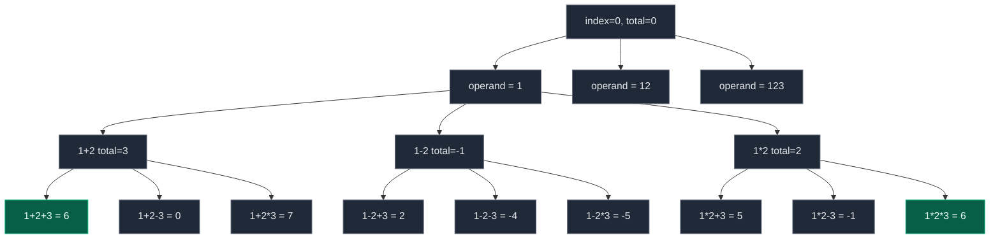

# 07. Expression Add Operators

| Difficulty | Pattern | Source | Time | Space |
|:---:|:---:|:---:|:---:|:---:|
| **Hard** | String Partitioning Backtracking with Incremental Evaluation | [282. Expression Add Operators](https://leetcode.com/problems/expression-add-operators/) | `O(N * 4^N)` | `O(N)` |

## 1. Problem Statement

Given a string `num` that contains only digits, and an integer `target`, return **all possibilities** to insert the binary operators `'+'`, `'-'`, or `'*'` between the digits of `num` so that the resulting expression evaluates to `target`. Digits may also be left un-separated (concatenated into a multi-digit number). Note that operands in the returned expressions **cannot** contain leading zeros (e.g. `"05"` is invalid, but `"0"` alone is valid).

### Examples

```text
Input:  num = "123", target = 6
Output: ["1+2+3", "1*2*3"]
```

```text
Input:  num = "232", target = 8
Output: ["2*3+2", "2+3*2"]
```

```text
Input:  num = "105", target = 5
Output: ["1*0+5", "10-5"]
Explanation: "1+05" and "1*05" are invalid because "05" has a leading zero.
```

### Constraints

- `1 <= num.length <= 10`
- `num` consists of only digits.
- `-2^31 <= target <= 2^31 - 1`

## 2. Core Theory

This problem is two backtracking decisions fused together: **where does the next operand end** (string partitioning, exactly like Palindrome Partitioning), and **which operator precedes it** (`+`, `-`, or `*`). The hard part isn't generating these choices — it's updating the running total correctly when `*` appears, because multiplication binds tighter than the addition/subtraction already folded into the total so far.

**The naive trap.** If the running total is `3` after `"1+2"` and we append `*3`, doing `total * 3 = 9` is wrong: `1+2*3` must evaluate as `1 + (2*3) = 7`, not `(1+2)*3 = 9`. The last-added operand (`2`) needs to be pulled back out of the total and reintroduced as part of a multiplication, not multiplied along with everything before it.

**The fix: track `prev`, the most recent term's contribution.** Alongside `total` (the correctly-evaluated running value), carry `prev` — the value that the *last* operator contributed to `total`. To undo and redo that contribution under multiplication:

```text
new_total = total - prev + prev * current
new_prev  = prev * current
```

- **Addition** (`+current`): `new_total = total + current`, `new_prev = current`.
- **Subtraction** (`-current`): `new_total = total - current`, `new_prev = -current` (stored negative, so a *following* multiplication can uniformly reuse the same formula).
- **Multiplication** (`*current`): remove the old `prev` from the total, then add back `prev * current` instead — this retroactively rewrites the last term as a product, correctly handling chains like `3*4*5` since `prev` itself becomes `prev * current` each time, carrying the whole chain as one unit.

**Worked example — `"1-2*3"`.** After `"1-2"`: `total = -1`, `prev = -2` (subtraction stored the operand negated). Now append `*3`: `new_total = -1 - (-2) + (-2)*3 = -1 + 2 - 6 = -5`, and indeed `1 - (2*3) = 1 - 6 = -5`. Storing `prev` as `-2` rather than `2` is exactly what makes the same multiplication formula work uniformly after both `+` and `-`.

**The leading-zero rule.** A multi-digit operand cannot start with `'0'` — `"05"`, `"00"`, `"012"` are all illegal — but the single digit `"0"` by itself is perfectly valid. While extending the operand's end index, the moment the start digit is `'0'` and the operand has more than one digit, stop growing it (`break`, not `continue` — every longer operand starting at that same zero is equally invalid).

**The first operand is special.** No operator can precede the very first number (there's nothing before it to combine with), so it just initializes `expression`, `total`, and `prev` directly instead of branching into `+`/`-`/`*`.

Recursion tree for `"123"`, target `6` (only the operator choices are drawn under `"1"`; the successful leaves are marked):



The recursive invariant to hold onto: at the start of `backtrack(index, expression, total, prev)`, `expression` uses exactly `num[0:index]`, `total` is its correctly-evaluated value respecting precedence, and `prev` is the contribution of its most recent multiplicative term. The job at each call is simply: choose the next operand starting at `index`, attach an operator, update `total`/`prev` with the formulas above, and recurse.

## 3. Edge Cases

| Case | Input | Expected | Why it matters |
|:---|:---|:---:|:---|
| Single digit equal to target | `num="5", target=5` | `["5"]` | No operator is ever placed; the first-operand special case must produce output on its own |
| Single digit not equal to target | `num="5", target=2` | `[]` | Confirms the base case correctly filters on `total == target` rather than accepting any leaf |
| String of all zeros | `num="000", target=0` | 9 expressions (every `+`/`-`/`*` combination of `"0","0","0"`) | Leading-zero rule must still allow single `"0"` operands even though the whole string is zeros |
| Multi-digit operand with leading zero | `num="105", target=5` | `["1*0+5", "10-5"]`, never `"1+05"` | Verifies the `break` on `num[index]=='0'` and `end>index` correctly rules out `"05"` |
| Target unreachable | `num="99", target=1000` | `[]` | Confirms the search terminates and returns empty rather than erroring when no leaf matches |

## 4. Brute Force: Generate Every Expression, Then Evaluate It

### Intuition

Build every syntactically valid expression string first — choosing operand boundaries and operators without tracking a running value — then parse and evaluate each complete expression from scratch (respecting `*` precedence) and keep the ones equal to `target`.

### Approach

1. Recursively pick each operand's end index and, for non-first operands, each of `+`/`-`/`*`, building up only the expression *string*.
2. When the string is complete, evaluate it properly (e.g. a small two-pass evaluator: first resolve all `*`, then sum the rest) and compare to `target`.
3. Collect matching expressions.

### Dry Run

For `"123"`, this generates 16 candidate strings (`123`, `12+3`, `12-3`, `12*3`, `1+23`, ..., `1*2*3`) before evaluating any of them — including strings whose value could have been detected as impossible far earlier if we had tracked the value incrementally.

### Code

```python
# Define the class solution
class Solution:

    # Brute force: build the full expression string, evaluate it afterward
    def addOperators(self, num: str, target: int) -> list[str]:

        answer = []

        # Evaluate a complete expression respecting * before + / -
        def evaluate(expression: str) -> int:
            tokens = []
            number = ""
            sign = "+"
            for ch in expression + "+":
                if ch.isdigit():
                    number += ch
                else:
                    if sign == "+":
                        tokens.append(int(number))
                    elif sign == "-":
                        tokens.append(-int(number))
                    elif sign == "*":
                        tokens.append(tokens.pop() * int(number))
                    sign = ch
                    number = ""
            return sum(tokens)

        # Build the expression string only, one operand at a time
        def build(index, expression):
            if index == len(num):
                if evaluate(expression) == target:
                    answer.append(expression)
                return

            for end in range(index, len(num)):
                if end > index and num[index] == '0':
                    break
                operand = num[index:end + 1]

                if index == 0:
                    build(end + 1, operand)
                else:
                    build(end + 1, expression + "+" + operand)
                    build(end + 1, expression + "-" + operand)
                    build(end + 1, expression + "*" + operand)

        build(0, "")
        return answer
```

### Complexity

| Measure | Complexity | Why |
|:---|:---:|:---|
| **Time** | `O(N * 4^N)` | Up to `4^(N-1)` candidate expressions (concatenate / `+` / `-` / `*` at each of `N-1` gaps), each re-evaluated in `O(N)` |
| **Space** | `O(N)` | Recursion depth plus the per-call expression string, ignoring output storage |

## 5. Optimal Solution: Backtrack with Incremental `total` and `prev`

### Intuition

Never re-parse or re-evaluate a complete expression. Carry the correctly-precedence-respecting running value (`total`) and the last term's contribution (`prev`) through the recursion, updating both in `O(1)` per operator choice using the formulas from Core Theory.

### Approach

1. `backtrack(index, expression, total, prev)`. Base case: `index == len(num)` — if `total == target`, record `expression`.
2. For each `end` from `index` to `len(num) - 1`, extract `operand_str = num[index:end+1]`; if `end > index and num[index] == '0'`, `break` (leading-zero rule).
3. If `index == 0`, this is the first operand: recurse with `expression = operand_str`, `total = operand = prev`.
4. Otherwise branch into three recursive calls — addition, subtraction, multiplication — each updating `expression`, `total`, and `prev` per the formulas above.

### Dry Run

`num = "123", target = 6`, focusing on the winning branch `1*2*3`:

```text
backtrack(0, "", 0, 0)
  index=0: operand "1" -> backtrack(1, "1", total=1, prev=1)

    operand "2", multiply:
    new_total = 1 - 1 + 1*2 = 2
    new_prev  = 1*2 = 2
    -> backtrack(2, "1*2", total=2, prev=2)

      operand "3", multiply:
      new_total = 2 - 2 + 2*3 = 6
      new_prev  = 2*3 = 6
      -> backtrack(3, "1*2*3", total=6, prev=6)

        index == len(num) == 3, total == target == 6 -> record "1*2*3"
```

### Code

```python
# Define the class solution
class Solution:

    def addOperators(self, num: str, target: int) -> list[str]:

        # Store all expressions that evaluate to target
        answer = []

        # index      -> next unprocessed digit
        # expression -> expression built so far
        # total      -> evaluated value so far (respects precedence)
        # prev       -> most recent operand's contribution (for *)
        def backtrack(index, expression, total, prev):

            # All digits are used
            if index == len(num):
                if total == target:
                    answer.append(expression)
                return

            # Try every possible next operand
            for end in range(index, len(num)):

                # Avoid operands like "05" or "00"
                if end > index and num[index] == '0':
                    break

                operand_str = num[index:end + 1]
                operand = int(operand_str)

                # First operand has no operator before it
                if index == 0:
                    backtrack(end + 1, operand_str, operand, operand)
                else:
                    # Addition
                    backtrack(
                        end + 1,
                        expression + "+" + operand_str,
                        total + operand,
                        operand,
                    )
                    # Subtraction
                    backtrack(
                        end + 1,
                        expression + "-" + operand_str,
                        total - operand,
                        -operand,
                    )
                    # Multiplication: undo prev's old contribution,
                    # replace it with prev * operand
                    backtrack(
                        end + 1,
                        expression + "*" + operand_str,
                        total - prev + prev * operand,
                        prev * operand,
                    )

        backtrack(0, "", 0, 0)
        return answer
```

### Complexity

| Measure | Complexity | Why |
|:---|:---:|:---|
| **Time** | `O(N * 4^N)` | Same `4^(N-1)`-shaped search tree as brute force, but each node now does `O(1)` arithmetic instead of `O(N)` re-evaluation; the `O(N)` factor comes from building each expression string along the way |
| **Space** | `O(N)` | Recursion depth is at most `N` (one digit consumed per level); output storage is excluded |

## 6. Common Mistakes

| Mistake | Why it breaks | Fix |
|:---|:---|:---|
| Allowing leading zeros in multi-digit operands | Produces invalid operands like `"05"` or `"012"`, which are not legitimate numbers in the expected output | `if end > index and num[index] == '0': break` — stop extending as soon as a multi-digit operand would start with `'0'` |
| Mishandling the very first operand | Trying to prepend `+`/`-`/`*` before the first number produces a malformed expression (e.g. `"+1+2+3"`) | Special-case `index == 0`: initialize `expression`, `total`, and `prev` directly from the first operand with no operator |
| Multiplying the whole running total instead of just the last term | `total * operand` incorrectly applies `*` to everything accumulated so far, ignoring operator precedence (e.g. turns `1+2*3` into `(1+2)*3` instead of `1+(2*3)`) | Use `total - prev + prev * operand` to retroactively rewrite only the last term as a product |

## 7. Interview Follow-ups

**Q: Why do we need to track `prev` at all — why not just re-evaluate the expression string each time?**

A: Re-evaluating from scratch would cost `O(N)` per node in an already-exponential search tree, and more importantly it hides the actual insight the problem is testing: understanding that `*` only rewrites the *last* term, not the whole accumulated total. Tracking `prev` turns each operator choice into `O(1)` incremental work and makes the precedence handling explicit rather than delegated to a string parser.

**Q: Why is subtraction's `prev` stored as `-operand` instead of `operand`?**

A: So the exact same multiplication formula (`total - prev + prev * operand`) works uniformly after either `+` or `-`. If `prev` were stored as the positive `operand` after a subtraction, a following `*` would need a separate sign-aware formula; storing it negative means "the last term's signed contribution" is always what `prev` holds, regardless of which operator produced it.

**Q: How would you extend this to handle division as well?**

A: Division breaks the clean `total - prev + prev * operand` trick because integer division isn't simply invertible the same way multiplication is (order and sign matter, and truncation is lossy), and LeetCode-style division is often truncating toward zero, which is not associative with the running total in the same manner. A working approach still tracks `prev` for the last term, but requires being careful that `prev` reflects the exact last operand's value so a following `/` can compute `total - prev + prev / operand` (with truncation applied consistently) — the same overall shape, but you must verify the semantics division vs. multiplication require for negative operands.

## 8. Interview Explanation

> I backtrack over the digit string. At each index I try every possible substring as the next operand, skipping any multi-digit operand that starts with `'0'`. The first operand has no operator and just initializes the running `total` and `prev`. For every later operand, I branch into `+`, `-`, and `*`. Addition and subtraction update `total` directly and set `prev` to the (possibly negated) operand. Multiplication is the tricky part: because it binds tighter than the already-folded-in previous terms, I remove `prev`'s old contribution from `total` and add back `prev * operand` instead, using `total - prev + prev * operand`, and set the new `prev` to `prev * operand` so that multiplication chains work correctly too. When all digits are consumed, if `total == target` I record the expression.

## 9. Verify

```python
def add_operators(num, target):
    # Store all expressions that evaluate to target
    answer = []

    # index      -> next unprocessed digit
    # expression -> expression built so far
    # total      -> evaluated value so far (respects precedence)
    # prev       -> most recent operand's contribution (for *)
    def backtrack(index, expression, total, prev):
        # All digits are used
        if index == len(num):
            if total == target:
                answer.append(expression)
            return
        # Try every possible next operand
        for end in range(index, len(num)):
            # Avoid operands like "05" or "00"
            if end > index and num[index] == '0':
                break
            operand_str = num[index:end + 1]
            operand = int(operand_str)
            # First operand has no operator before it
            if index == 0:
                backtrack(end + 1, operand_str, operand, operand)
            else:
                # Addition
                backtrack(end + 1, expression + "+" + operand_str, total + operand, operand)
                # Subtraction
                backtrack(end + 1, expression + "-" + operand_str, total - operand, -operand)
                # Multiplication: undo prev's old contribution, replace it with prev * operand
                backtrack(end + 1, expression + "*" + operand_str, total - prev + prev * operand, prev * operand)

    # Kick off backtracking with an empty expression and zeroed total/prev
    backtrack(0, "", 0, 0)
    return answer


# LeetCode examples
assert sorted(add_operators("123", 6)) == sorted(["1+2+3", "1*2*3"])
assert sorted(add_operators("232", 8)) == sorted(["2*3+2", "2+3*2"])
assert sorted(add_operators("105", 5)) == sorted(["1*0+5", "10-5"])

# Single digit equal to target
assert add_operators("5", 5) == ["5"]
# Single digit not equal to target
assert add_operators("5", 2) == []
# String of all zeros: leading-zero rule must still allow single "0" operands
assert sorted(add_operators("000", 0)) == sorted(
    ["0+0+0", "0+0-0", "0-0+0", "0-0-0", "0*0+0", "0*0-0", "0+0*0", "0-0*0", "0*0*0"]
)
# Target unreachable: search terminates and returns empty rather than erroring
assert add_operators("99", 1000) == []
# Multi-digit operand with leading zero: "05" must never appear in any result
for expr in add_operators("105", 5):
    assert "05" not in expr

print("All tests passed")
```
