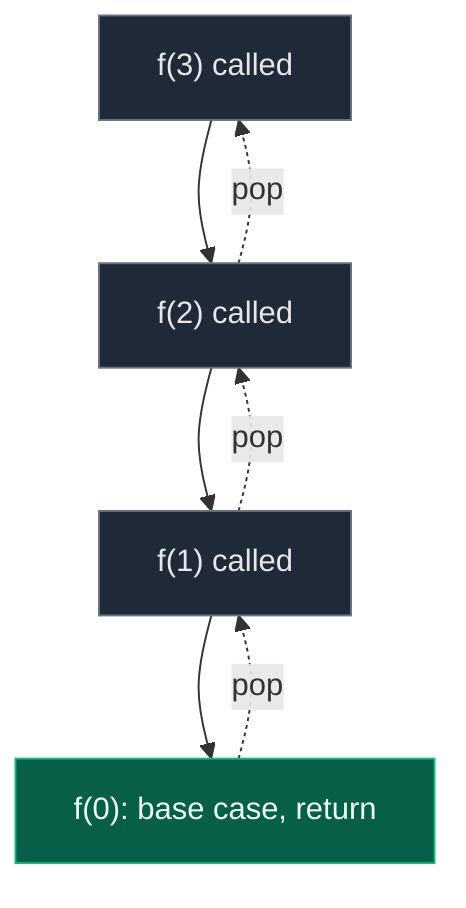
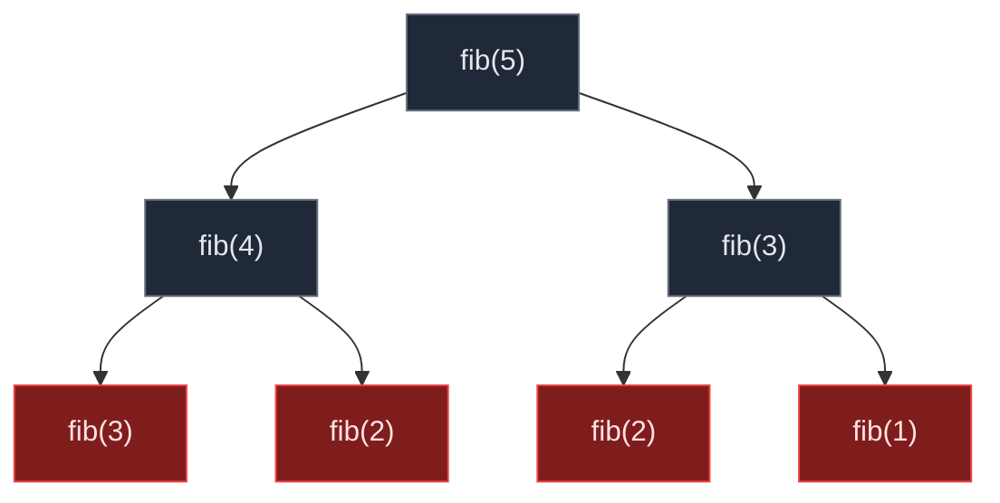
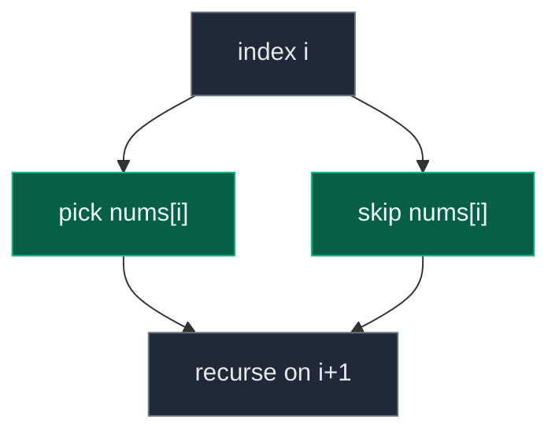
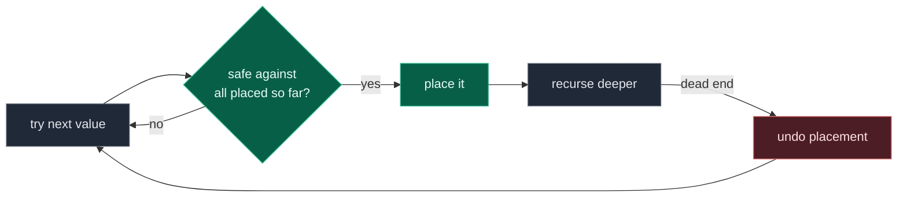

# 07. Recursion

Recursion is a function calling itself, with a rule that guarantees it stops. Every problem in this topic is a variation on one decision: **at this step, what are my choices, and which one do I try next?**

This page teaches the topic from zero: the call stack, why a missing base case crashes, the branching that turns one call into a tree, and the pick/not-pick pattern that becomes backtracking. Read the introduction notes in order first — each later problem assumes the vocabulary built there.

## Contents

1. [The Call Stack](#1-the-call-stack)
2. [Base Case vs Recursive Case](#2-base-case-vs-recursive-case)
3. [Parameterized vs Functional Recursion](#3-parameterized-vs-functional-recursion)
4. [Single vs Multiple Recursion](#4-single-vs-multiple-recursion)
5. [Pick / Not-Pick: The Core Pattern](#5-pick--not-pick-the-core-pattern)
6. [From Pick/Not-Pick to Backtracking](#6-from-picknot-pick-to-backtracking)
7. [The Duplicate-Skip Trick](#7-the-duplicate-skip-trick)
8. [Grid Backtracking](#8-grid-backtracking)
9. [Constraint Backtracking](#9-constraint-backtracking)
10. [Common Traps](#10-common-traps)
11. [Pattern Recognition Cheat Sheet](#11-pattern-recognition-cheat-sheet)
12. [Problems](#12-problems)

## 1. The Call Stack

Every function call gets a stack frame holding its parameters and local state. A recursive call pushes a new frame on top of the current one; returning pops it off.



```python
def f(n):
    if n == 0:                # base case: stop pushing frames
        return
    print(n)
    f(n - 1)                  # push a new frame, wait for it to return
```

The stack depth equals the recursion depth. A chain of `n` calls needs `O(n)` stack space, whether or not each call does `O(1)` work.

## 2. Base Case vs Recursive Case

Every recursive function needs both:

| Part | Job | Missing it causes |
|:---|:---|:---|
| Base case | Stops the recursion | Infinite recursion, stack overflow |
| Recursive case | Makes progress toward the base case | Wrong answer, or same crash if progress stalls |

```text
Segmentation fault: 11
```

is what an unbounded recursion looks like in practice — the call stack has a real, finite size, and every unreturned frame consumes it. `f()` calling `f()` with no shrinking parameter exhausts that space in a fraction of a second.

## 3. Parameterized vs Functional Recursion

Two ways to carry an answer through a recursion.

**Functional recursion** — the function *returns* the answer, combined at each level:

```python
def sum_functional(n):
    if n == 0:
        return 0
    return n + sum_functional(n - 1)      # combine on the way back up
```

**Parameterized recursion** — the answer is an extra parameter, updated on the way down:

```python
def sum_parameterized(n, accumulator=0):
    if n == 0:
        return accumulator
    return sum_parameterized(n - 1, accumulator + n)   # no work left to do on the way back
```

| | Functional | Parameterized |
|:---|:---|:---|
| Answer built | On the way back up (post-order) | On the way down (pre-order) |
| Combining step | After the recursive call returns | Before the recursive call is made |
| Natural fit | Divide and conquer, tree problems | Accumulating counters, backtracking paths |

## 4. Single vs Multiple Recursion

A function with **one** recursive call produces a straight-line call chain. A function with **two or more** recursive calls produces a branching tree — and the tree's *size*, not the input size, drives the time complexity.



Naive Fibonacci recomputes the same sub-problems repeatedly, giving `O(2^n)` time. Memoizing collapses it to `O(n)`. This is the first place the topic shows that *recursion structure* and *time complexity* are the same question.

## 5. Pick / Not-Pick: The Core Pattern

The single idea underneath almost every problem in this topic: **for each element, decide to include it or skip it.**



```python
def subsequences(nums, index, path, result):
    if index == len(nums):
        result.append(path[:])            # copy — path keeps changing after this
        return
    path.append(nums[index])              # pick
    subsequences(nums, index + 1, path, result)
    path.pop()                            # undo the pick — this is backtracking
    subsequences(nums, index + 1, path, result)   # not-pick
```

Two binary choices per element, `n` elements, gives exactly `2^n` leaves — every subsequence, generated once.

**The bug everyone writes first:** appending `path` instead of `path[:]`. `path` is one mutable list being edited throughout the whole recursion; every entry in `result` would end up pointing at the *same* list, which is empty by the time recursion finishes. Always copy at the leaf.

## 6. From Pick/Not-Pick to Backtracking

Backtracking is pick/not-pick with a name for the "undo" step: **try a choice, recurse, then undo it before trying the next choice.** That undo is what keeps sibling branches independent.

```text
path.append(choice)      # make the choice
recurse(...)             # explore everything that follows from it
path.pop()               # undo — restore state for the next choice
```

Every backtracking problem in this topic is this shape with a different definition of "choice":

| Problem | What "choice" means |
|:---|:---|
| Combination Sum | Include this candidate again, or move to the next one |
| Subsets | Include this element, or not |
| Permutations | Place any unused element at this position |
| Palindrome Partitioning | Cut here if the prefix is a palindrome |
| N-Queens | Place a queen in this column of this row |
| Word Search / Rat in a Maze | Move to this neighboring cell |
| Sudoku | Place this digit in this empty cell |

## 7. The Duplicate-Skip Trick

When the input has duplicate values, naive backtracking produces duplicate results. The fix is always: **sort first, then at each recursion level, skip a candidate equal to the one tried immediately before it.**

```python
nums.sort()
for i in range(start, len(nums)):
    if i > start and nums[i] == nums[i - 1]:
        continue                          # already tried this value at this level
    # ... pick nums[i], recurse, backtrack
```

**Why `i > start` and not `i > 0`:** the *first* occurrence of a value at a given recursion depth is always allowed — it may combine with different earlier choices than its predecessor did. Only later siblings *at the same level* need skipping.

For permutations the same idea appears as `nums[i] == nums[i-1] and not used[i-1]` — the extra `not used[i-1]` condition means "the earlier identical value has already been placed and removed (backtracked) from this exact position," which is what makes it a genuine duplicate rather than a legitimately different placement.

Used in: Combination Sum II, Subsets II, Permutations II.

## 8. Grid Backtracking

A different flavor: the "choices" are the four neighboring cells, and the "undo" is restoring a cell you temporarily marked visited.

```python
def dfs(board, r, c, word, k):
    if k == len(word):
        return True
    if not (0 <= r < len(board) and 0 <= c < len(board[0])) or board[r][c] != word[k]:
        return False

    temp = board[r][c]
    board[r][c] = '#'                     # mark visited
    found = any(dfs(board, r+dr, c+dc, word, k+1) for dr, dc in [(0,1),(0,-1),(1,0),(-1,0)])
    board[r][c] = temp                    # restore — required before returning

    return found
```

**Why the restore is not optional:** a cell marked visited during one search path must be free again for a *different* path that does not pass through it. Forgetting to restore silently blocks valid paths elsewhere in the search.

Used in: Word Search, Rat in a Maze.

## 9. Constraint Backtracking

The hardest tier: at each step, a placement must satisfy a constraint checked against *everything placed so far* — not just the immediately preceding choice.

| Problem | Constraint checked |
|:---|:---|
| N-Queens | No shared column; no shared diagonal (`row - col` or `row + col` constant) |
| M-Coloring | No adjacent vertex has the same color |
| Sudoku | No duplicate in the row, column, or 3x3 box |



**The one new idea here:** naive safety checks cost `O(n)` per attempt (scan every prior placement). N-Queens shows the fix — track occupied columns and both diagonal families in sets, turning the check into `O(1)`.

**Sudoku's special requirement:** unlike the other constraint problems, Sudoku wants exactly *one* solution and must stop immediately once found. The recursive function returns a boolean, and every caller checks it before trying its next option — this propagates a "stop searching" signal up through the whole call tree, which N-Queens (which finds *all* solutions) does not need.

## 10. Common Traps

| Trap | Broken | Correct |
|:---|:---|:---|
| Missing base case | Infinite recursion, stack overflow | Every recursive path must reach a base case |
| Appending a reference | `result.append(path)` — all entries end up identical | `result.append(path[:])` — copy at the leaf |
| Forgetting to backtrack | `path.append(x); recurse()` with no `path.pop()` | Always undo before trying the next choice |
| Wrong dedup condition | `if i > 0` skips valid first-occurrences | `if i > start` (or `not used[i-1]` for permutations) |
| Advancing index on repeat-allowed pick | Combination Sum needs the SAME index on pick | Advance index only when repetition is not allowed |
| Not restoring a visited grid cell | Later valid paths wrongly blocked | Restore the cell before returning |
| O(n) safety check every attempt | Correct but slow for N-Queens / M-Coloring | Track state (columns, diagonals) for O(1) checks |
| Continuing after Sudoku is solved | Wastes time, or the board is walked back to unsolved | Propagate a boolean success signal up the recursion |

## 11. Pattern Recognition Cheat Sheet

| Signal in the problem | Pattern | Notes |
|:---|:---|:---:|
| "generate all subsets/subsequences" | Pick / not-pick | `O(2^n)` leaves |
| "same element can be reused" | Pick with same index vs advance | Combination Sum |
| "each element used at most once", has duplicates | Pick/not-pick + sort + skip-siblings | Combination Sum II, Subsets II |
| "all arrangements / orderings" | Try every unused element per position | Permutations |
| "partition a string so each part satisfies X" | Try every prefix at each level | Palindrome Partitioning |
| "find path/word in a grid" | DFS + mark/restore | Word Search, Rat in a Maze |
| "place N items with no two conflicting" | Constraint backtracking, O(1) safety check | N-Queens, M-Coloring |
| "fill so all constraints hold, want ONE solution" | Constraint backtracking + boolean propagation | Sudoku |
| "insert operators between digits" | Try every split + every operator | Expression Add Operators |

## 12. Problems

### Introduction

| # | Note | What it covers |
|:---:|:---|:---|
| 1 | [Introduction to Recursion](01.%20Introduction/01.%20Introduction%20to%20Recursion.md) | The call stack, base case, stack overflow |
| 2 | [Problems on Recursion](01.%20Introduction/02.%20Problems%20on%20Recursion.md) | Print forwards/backwards, normal vs backtracking order |
| 3 | [Parameterized and Functional Recursion](01.%20Introduction/03.%20Parameterized%20and%20Functional%20Recursion.md) | Answer as a parameter vs answer as a return value |
| 4 | [Problems on Functional Recursion](01.%20Introduction/04.%20Problems%20on%20Functional%20Recursion.md) | Worked functional-recursion problems |
| 5 | [Multiple Recursion Calls](01.%20Introduction/05.%20Multiple%20Recursion%20Calls.md) | Branching recursion, Fibonacci, memoization |
| 6 | [Recursion on Subsequences](01.%20Introduction/06.%20Recursion%20on%20Subsequences.md) | The pick/not-pick pattern — foundation of the whole topic |
| 7 | [All Kinds of Patterns in Recursion](01.%20Introduction/07.%20All%20Kinds%20of%20Patterns%20in%20Recursion.md) | Taxonomy: print-all, find-one, count |

### Standard Problems

| # | Problem | Difficulty | Key Idea |
|:---:|:---|:---:|:---|
| 1 | [39. Combination Sum](02.%20Standard%20Problems/01.%2039.%20Combination%20Sum.md) | Medium | Pick keeps the same index (unbounded reuse) |
| 2 | [40. Combination Sum II](02.%20Standard%20Problems/02.%2040.%20Combination%20Sum%20II.md) | Medium | Each used once; sort + skip-siblings for dedup |
| 3 | [Subset Sums](02.%20Standard%20Problems/03.%20Subset%20Sums.md) | Easy | Collect the sum at every leaf |
| 4 | [78. Subsets](02.%20Standard%20Problems/04.%2078.%20Subsets.md) | Medium | The purest pick/not-pick, `2^n` leaves |
| 5 | [90. Subsets II](02.%20Standard%20Problems/05.%2090.%20Subsets%20II.md) | Medium | Subsets, plus the duplicate-skip trick |
| 6 | [46. Permutations](02.%20Standard%20Problems/06.%2046.%20Permutations.md) | Medium | Every element used once, order matters |
| 7 | [47. Permutations II](02.%20Standard%20Problems/07.%2047.%20Permutations%20II.md) | Medium | Permutations, plus `not used[i-1]` dedup |

### Hard Problems

| # | Problem | Difficulty | Key Idea |
|:---:|:---|:---:|:---|
| 1 | [131. Palindrome Partitioning](03.%20Hard%20Problems/01.%20131.%20Palindrome%20Partitioning.md) | Medium | Try every palindromic prefix |
| 2 | [79. Word Search](03.%20Hard%20Problems/02.%2079.%20Word%20Search.md) | Medium | Grid DFS, mark and restore |
| 3 | [51. N-Queens](03.%20Hard%20Problems/03.%2051.%20N-Queens.md) | Hard | O(1) safety via column/diagonal tracking |
| 4 | [Rat in a Maze](03.%20Hard%20Problems/04.%20Rat%20in%20a%20Maze.md) | Hard | Grid DFS, all valid paths |
| 5 | [M-Coloring Problem](03.%20Hard%20Problems/05.%20M-Coloring%20Problem.md) | Hard | Graph constraint backtracking |
| 6 | [Sudoku Solver](03.%20Hard%20Problems/06.%20Sudoku%20Solver.md) | Hard | Boolean propagation stops the search at one solution |
| 7 | [Expression Add Operators](03.%20Hard%20Problems/07.%20Expression%20Add%20Operators.md) | Hard | Split + operator choice, multiplication precedence trap |

## Where This Leads

| Skill built here | Used later in |
|:---|:---|
| Pick / not-pick | Every subset/subsequence DP problem |
| Backtracking with undo | Graph traversal, constraint satisfaction |
| Duplicate-skip after sorting | Any "unique combinations" problem |
| O(1) constraint tracking | Interval scheduling, graph coloring |
| Boolean success propagation | Early-exit search, game-tree pruning |
| Recursion tree = time complexity | Analyzing any branching algorithm |
