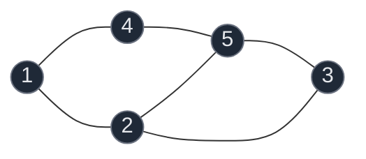
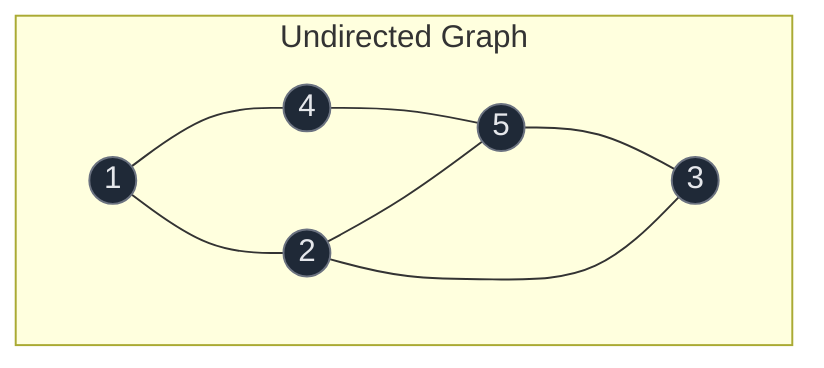
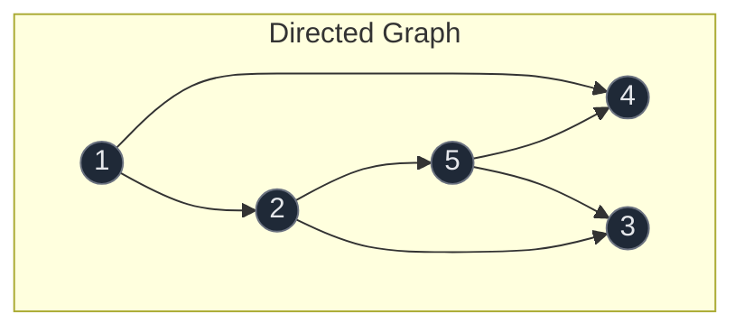
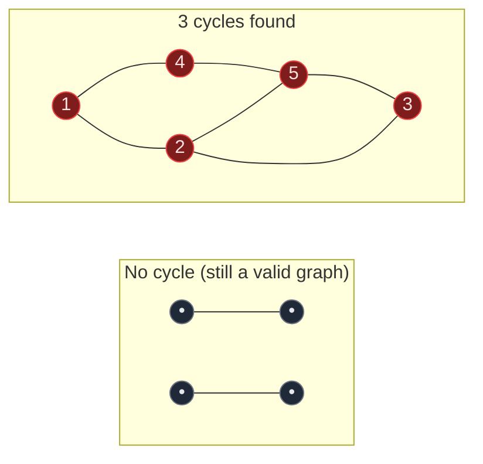
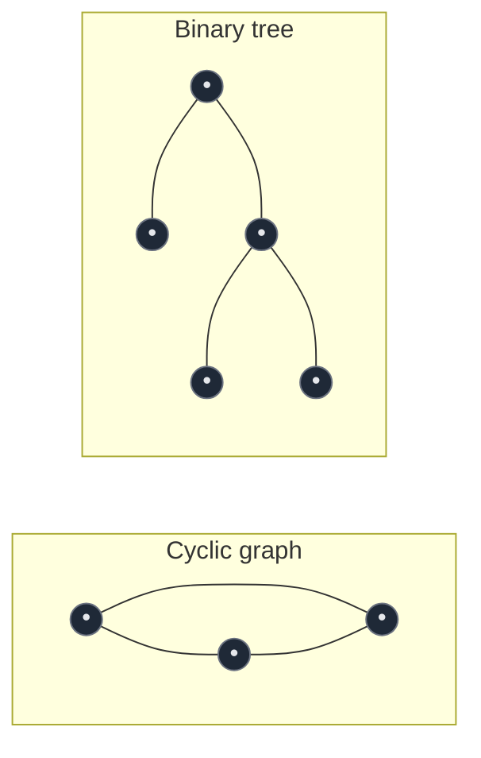
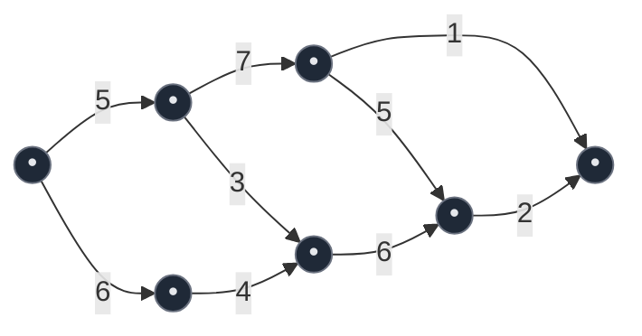

# 01. Introduction to Graphs

A graph is a non-linear data structure made of nodes connected by edges. Arrays, stacks, queues, and linked lists are all linear — data sits in a sequence. A tree, the first non-linear structure most people meet, is actually a graph with extra restrictions (connected, acyclic, one parent per node). Graphs drop those restrictions: any node can connect to any number of other nodes in any pattern, which is exactly why they can model things a tree cannot — road networks, social networks, circuits, dependency chains, and the shortest route between two places on a map.

## 1. Vertices, Edges, and Notation

The circles in a graph are called **nodes** or **vertices**; the connections between them are called **edges**. Numbering the nodes is arbitrary — no specific order needs to be followed.

The standard notation used throughout graph problems:

| Symbol | Meaning |
|:---|:---|
| `V` or `N` | Number of vertices (nodes) |
| `E` | Number of edges |
| `u`, `v` | Two generic vertices used to describe an edge |

For a graph with 5 nodes, you'd write `V = 5` or `N = 5`. An edge between nodes `u` and `v` is written as the pair `(u, v)`.



This graph has `V = 5` (nodes 1 through 5) and 6 edges.

## 2. Undirected vs Directed Graphs

**Undirected graph**: an edge has no direction — it can be traversed both ways. The pair `(u, v)` and `(v, u)` describe the *same* edge. If there is an edge between `u` and `v`, you can go `u -> v` as well as `v -> u`.

**Directed graph**: an edge has a direction, drawn as an arrow. The edge is an *ordered* pair `<u, v>`, meaning you can only travel `u -> v`. Here `<u, v>` and `<v, u>` are two *different* edges — a directed graph can even have both, which looks like a bidirectional double-arrow but is really two separate directed edges stacked on top of each other.





## 3. Cycles in a Graph

A graph is said to have a **cycle** if you can start from a node, follow edges, and end back at that same node without repeating an edge. Not every graph has a cycle — a graph is a valid graph whether or not it forms an enclosed shape.

- If at least one cycle exists in an undirected graph, it is called an **Undirected Cyclic Graph**.
- If a directed graph has no cycle at all, it is called a **Directed Acyclic Graph**, commonly abbreviated **DAG**.
- Adding just one directed edge to a DAG that closes a loop turns it into a **Directed Cyclic Graph**.



**Path in a graph**: a path is a sequence of nodes where consecutive nodes are connected by an edge, and no node repeats. For the graph `1-2, 2-3, 4-3, 3-5`:

- `1 2 3 5` **is** a path — every consecutive pair is connected, and no node repeats.
- `1 2 3 2 1` is **not** a path — node `2` (and `1`) appears twice.
- `1 3 5` is **not** a path — `1` and `3` are not directly connected by an edge.

## 4. Graphs vs Trees

The teacher draws a binary tree right next to a small cyclic graph to make the contrast explicit:



A binary tree is technically also a graph — it has nodes and edges, which is the minimal condition to be called a graph. But it is a very restricted graph:

| Property | Tree | General Graph |
|:---|:---|:---|
| Cycles | Never (acyclic) | May or may not have cycles |
| Connectivity | Always fully connected | May be disconnected into several pieces |
| Parents per node | Exactly one (except the root, which has none) | No such restriction — any node can connect to any number of others |
| Edge count | Exactly `V - 1` | Anywhere from `0` to `V*(V-1)/2` (undirected) |

So: **a tree is just a connected, acyclic graph with an elected root.** Every tree is a graph; not every graph is a tree.

## 5. Graph Representations: Adjacency Matrix

An **adjacency matrix** is a `V x V` grid of `0`s and `1`s (or weights). Cell `matrix[u][v] = 1` means there is an edge from `u` to `v`.

- **Undirected graph**: the matrix is symmetric — `matrix[u][v] == matrix[v][u]` always, because an edge `(u, v)` implies `(v, u)` too.
- **Directed graph**: the matrix need not be symmetric — `matrix[u][v] = 1` does not imply `matrix[v][u] = 1`.
- **Weighted graph**: store the weight itself instead of `1` (and some large sentinel value, like infinity, for "no edge").

For an undirected graph with edges `(1,2)`, `(1,3)`, `(2,3)` on 3 nodes (1-indexed):

```text
      1  2  3
   1  0  1  1
   2  1  0  1
   3  1  1  0
```

**Cost**: `O(V^2)` space regardless of how many edges actually exist, and `O(1)` to check whether a specific edge exists. This is efficient only when the graph is dense (edge count close to `V^2`).

## 6. Graph Representations: Adjacency List

An **adjacency list** stores, for every node, only the list of nodes it is directly connected to. This is the representation used in almost all interview-style graph problems because most real graphs are sparse (`E` much smaller than `V^2`).

For the same undirected graph with edges `(1,2)`, `(1,3)`, `(2,3)`:

```text
1 -> [2, 3]
2 -> [1, 3]
3 -> [1, 2]
```

For a directed graph, each node only lists the nodes reachable by an outgoing edge from it — node `v` does not appear in `u`'s list unless the edge is specifically `u -> v`.

**Cost**: `O(V + E)` space — you only pay for edges that actually exist — and checking whether a specific edge exists takes `O(degree)` in the worst case rather than `O(1)`. This trade-off (memory-efficient, slightly slower point lookups) is why adjacency lists dominate in practice.

## 7. Weighted Graphs

A graph may have a number, called a **weight**, assigned to each edge — often representing the cost of traversing it (distance, time, price). If a graph has no weights written on its edges, every edge is implicitly assumed to have **unit weight**, i.e. `1`.



A real-world reading: if vertices `A` and `B` are towns in a road network, the weight on edge `AB` might represent the distance (or cost, or time) of moving from `A` to `B`, or vice versa.

## 8. Degree of a Graph

The **degree** of a node is the number of edges going into or out of it.

**Undirected graphs** — degree is simply the count of edges attached to the node. For the graph `1-2, 2-5, 5-4, 4-3, 3-2, 3-1` (a square with a diagonal-style triangle):

```text
D(3) = 3
D(4) = 2
```

**Property**: the total degree of a graph is always `2 x E` — every edge is counted once at each of its two endpoints.

```text
D(1)+D(2)+D(3)+D(4)+D(5) = 2+3+3+2+2 = 12
2 x E = 2 x 6 = 12   ✓
```

**Directed graphs** split degree into two halves:

- **Indegree** of a node = number of edges coming *into* it.
- **Outdegree** of a node = number of edges going *out of* it.

```text
Indegree(3)  = 1
Outdegree(3) = 2
```

## 9. Common Mistakes

| Mistake | Why it's wrong | Fix |
|:---|:---|:---|
| Assuming `(u, v)` and `(v, u)` are different edges in an undirected graph | Undirected edges are unordered pairs — they name the same edge | Only store/count the edge once, or symmetrize consistently |
| Assuming every graph must be a single connected shape | A valid graph can be disconnected into multiple separate pieces | Treat disconnection as normal; see connected components |
| Assuming a graph must have a cycle | Cycles are optional — trees and many graphs are perfectly acyclic | Check for cycles explicitly rather than assuming |
| Confusing a DAG with "no edges can repeat a node" | DAG only means no directed cycle exists; it says nothing about revisiting via different paths | Define DAG strictly as "no directed cycle" |
| Using an adjacency matrix for a huge sparse graph | Wastes `O(V^2)` memory when `E` is tiny compared to `V^2` | Prefer an adjacency list when the graph is sparse |
| Forgetting unit weight | Treating an unweighted graph as having zero-cost edges | Unweighted means every edge costs `1`, not `0` |

## 10. Try It Yourself

```python
from collections import defaultdict


def build_adjacency_list(n, edges, directed=False):
    """Build an adjacency list for a graph with n nodes (1-indexed)."""
    graph = defaultdict(list)
    for u, v in edges:
        graph[u].append(v)
        if not directed:
            graph[v].append(u)
    return graph


def build_adjacency_matrix(n, edges, directed=False):
    """Build an (n+1) x (n+1) adjacency matrix (1-indexed, row/col 0 unused)."""
    matrix = [[0] * (n + 1) for _ in range(n + 1)]
    for u, v in edges:
        matrix[u][v] = 1
        if not directed:
            matrix[v][u] = 1
    return matrix


def degree(graph, node):
    return len(graph[node])


def total_degree(graph):
    return sum(len(neighbors) for neighbors in graph.values())


# The example graph from the notes: 1-2, 1-4, 2-5, 4-5, 5-3, 2-3 (undirected)
n = 5
edges = [(1, 2), (1, 4), (2, 5), (4, 5), (5, 3), (2, 3)]

adj_list = build_adjacency_list(n, edges, directed=False)
adj_matrix = build_adjacency_matrix(n, edges, directed=False)

# Adjacency list is symmetric for an undirected graph
assert 2 in adj_list[1] and 1 in adj_list[2]

# Adjacency matrix is symmetric for an undirected graph
for u, v in edges:
    assert adj_matrix[u][v] == adj_matrix[v][u] == 1

# Property: total degree == 2 * E
assert total_degree(adj_list) == 2 * len(edges)

# Directed version: edges only point one way
directed_edges = [(1, 4), (1, 2), (2, 5), (5, 4), (2, 3), (5, 3)]
directed_adj = build_adjacency_list(n, directed_edges, directed=True)
assert 4 in directed_adj[1]
assert 1 not in directed_adj[4]  # no reverse edge implied

# Indegree / outdegree for a directed graph
def indegree(adj, n, node):
    return sum(1 for u in range(1, n + 1) if node in adj[u])


def outdegree(adj, node):
    return len(adj[node])


assert outdegree(directed_adj, 2) == 2   # 2 -> 5, 2 -> 3
assert indegree(directed_adj, n, 3) == 2  # 2 -> 3, 5 -> 3

print("All tests passed")
```
