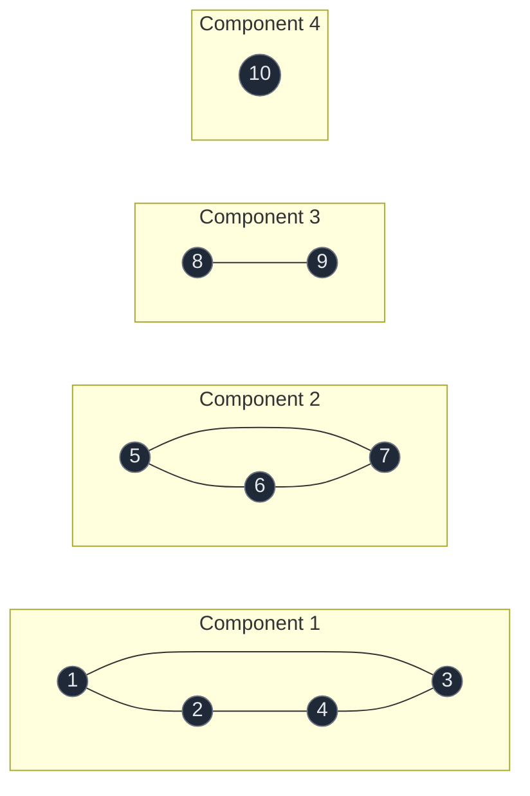

# 02. Connected Components in Graphs

So far every graph we've drawn has been one single connected piece, or a special restricted case like a binary tree. But a graph does not have to arrive as one connected shape — it can just as easily show up as several separate pieces, and it is still perfectly valid to call it "a graph."

## 1. What Is a Connected Component

Consider an undirected graph with 10 nodes and 8 edges: `(1,2), (1,3), (2,4), (4,3), (5,6), (5,7), (6,7), (8,9)`. Drawing it out:



At first glance this looks like 4 different, unrelated graphs — nothing connects them to each other. But according to the problem's input (10 nodes, 8 edges, all belonging to one graph description), this is **one single graph made of 4 connected components**. A **connected component** is a maximal set of nodes where every node can reach every other node in the set by following edges, and no node in the set has an edge reaching outside it. Node `10` on its own, with zero edges, still counts as its own (trivial, single-node) connected component.

The lesson: seeing two disconnected-looking pieces on paper does not mean you're looking at two different graphs — check what the problem says the graph is. If they were given as one graph with one node/edge list, they're components of that one graph.

## 2. Why This Matters: Graph Traversal

Almost every graph algorithm you'll meet next (BFS, DFS, and everything built on them) is a **traversal algorithm**, and every traversal algorithm relies on a `visited` array to avoid revisiting nodes. For the graph above, you'd allocate a `visited` array of size `n + 1` (indices `0` to `10`), all initialized to `0`:

```text
 0  1  2  3  4  5  6  7  8  9  10
 0  0  0  0  0  0  0  0  0  0  0
```

Then loop over every node, and only start a traversal from a node that hasn't been visited yet:

```text
for i := 1 to 10
    if (!visited[i])
        traversal(i)
```

**Why not just call `traversal(1)` once and stop?** Because a single traversal call only explores the connected component reachable from its starting node. Calling `traversal(1)` here would visit nodes `1, 2, 3, 4` and then stop — it has no way to reach `5, 6, 7`, `8, 9`, or `10`, since there is no edge linking them. To make sure *every* node in the graph gets visited, you must loop through all nodes and fire off a fresh traversal from any node still unvisited — each such call discovers exactly one connected component. This is the pattern behind "count the number of connected components," "count provinces," "number of islands," and similar problems: they are all really asking "how many times does the outer loop have to start a new traversal?"

## 3. Try It Yourself

```python
from collections import defaultdict


def build_adjacency_list(n, edges):
    graph = defaultdict(list)
    for u, v in edges:
        graph[u].append(v)
        graph[v].append(u)
    return graph


def dfs(node, graph, visited, component):
    visited[node] = True
    component.append(node)
    for neighbor in graph[node]:
        if not visited[neighbor]:
            dfs(neighbor, graph, visited, component)


def connected_components(n, edges):
    """Return a list of connected components (each a list of nodes), 1-indexed."""
    graph = build_adjacency_list(n, edges)
    visited = [False] * (n + 1)
    components = []

    for node in range(1, n + 1):
        if not visited[node]:
            component = []
            dfs(node, graph, visited, component)
            components.append(sorted(component))

    return components


# The worked example: 10 nodes, 8 edges, 4 connected components
n = 10
edges = [(1, 2), (1, 3), (2, 4), (4, 3), (5, 6), (5, 7), (6, 7), (8, 9)]

components = connected_components(n, edges)

assert len(components) == 4
assert [1, 2, 3, 4] in components
assert [5, 6, 7] in components
assert [8, 9] in components
assert [10] in components  # an isolated node is its own component

# Calling a traversal from just one node never reaches the other components
graph = build_adjacency_list(n, edges)
visited = [False] * (n + 1)
single_component = []
dfs(1, graph, visited, single_component)
assert sorted(single_component) == [1, 2, 3, 4]
assert visited[5] is False  # component 2 was never reached

print("All tests passed")
```
